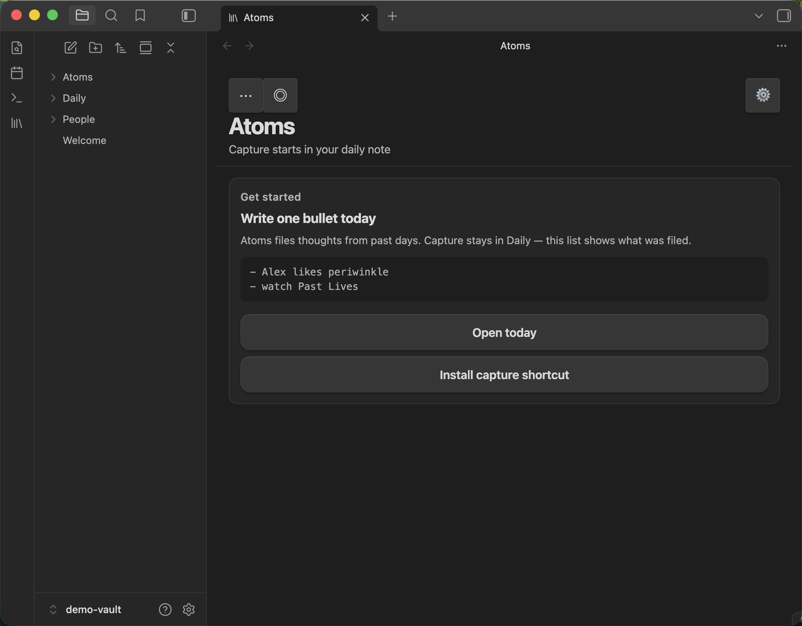
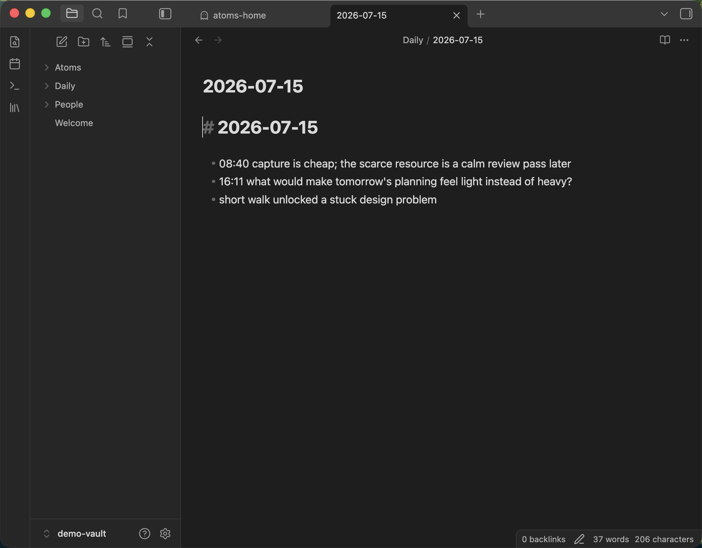
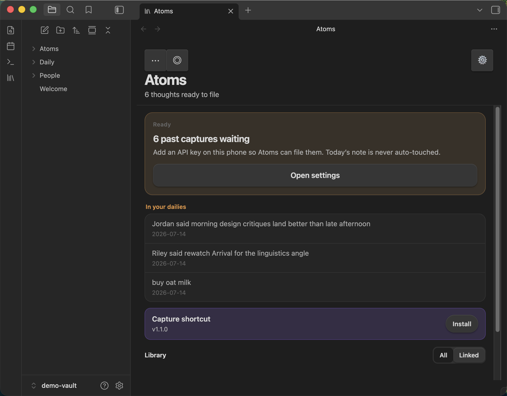
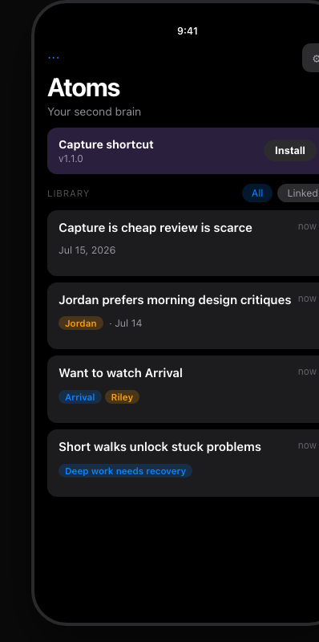
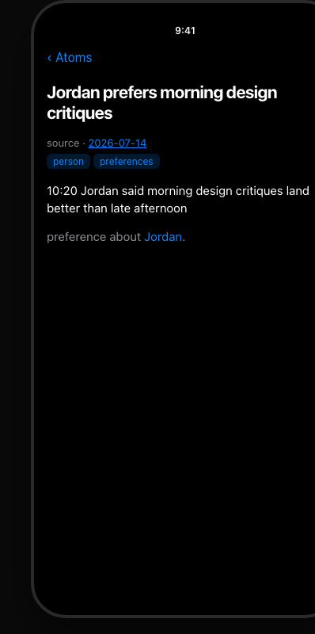
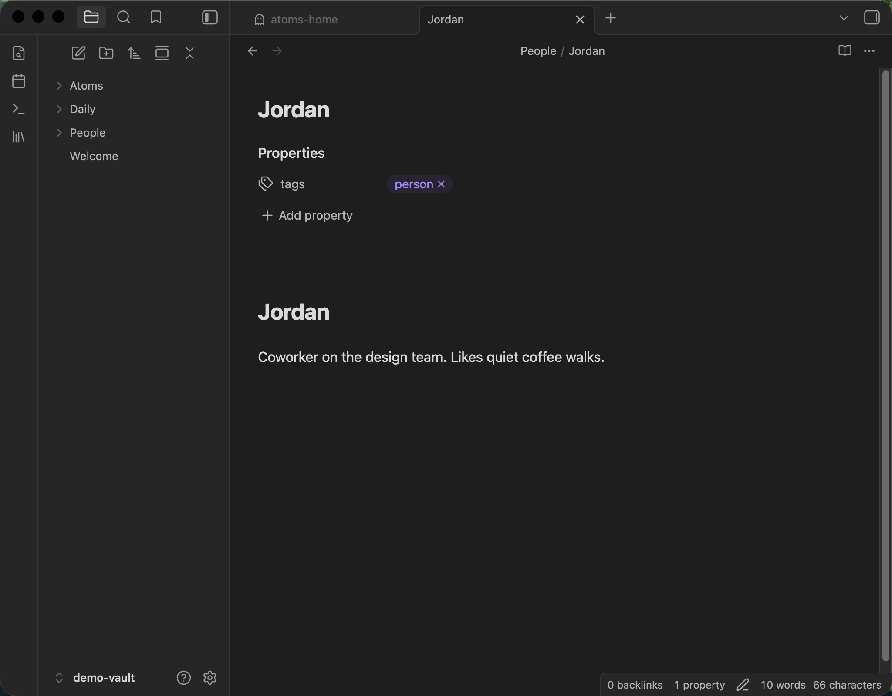
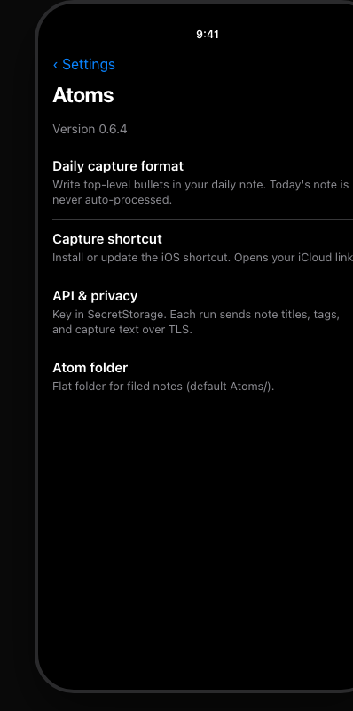

# Atoms

Obsidian plugin that turns **past daily-note captures** into a flat, linked knowledge graph.

Capture on your phone (iOS Shortcut → daily note). Atoms classifies each bullet as **atom / task / noise**, writes permanent claims into `Atoms/`, and leaves **markers** so nothing reprocesses. Person hubs you already have (e.g. `Alex`) get links and backlinks—no CRM, no AI folders.

**Plugin id:** `atoms` · **Version:** see `manifest.json` · **Requires:** Obsidian ≥ 1.11.4, core **Daily Notes**, Anthropic API key

**Coding agents:** start at [`AGENTS.md`](AGENTS.md) (claim rules + constitution). Humans do not need to memorize process — agents must.

### Privacy & cost

- Each classify run sends **vault note titles**, tags, person-hub **titles**, and the **capture text** to the Anthropic API over TLS.
- You supply your own API key (SecretStorage). That usage is **optional paid** Anthropic billing — the plugin itself is free (MIT).
- The model never rewrites your hand-authored daily bullets; it only creates flat atom files and appends markers. **Existing atom files are never overwritten** on title collision.
- Auto-run (device-local, default off) requires a one-time egress acknowledgment.

---

## What it does

| Step | Behavior |
|---|---|
| **Capture** | Your job — iOS Shortcut or typing bullets (`- thought`) in Daily Notes |
| **Classify** | Anthropic structured output: verdict, title, tags, links |
| **Write** | New files only in a flat folder (default `Atoms/`) + append markers under past captures |
| **People** | Vault-aware hubs + structural tags (`person`, `preferences`, `relationship`) |
| **Home** | Mobile-first **Atoms** leaf: library, waiting queue, first-day setup, preview cards |

### Non-negotiables

- Body of every atom = capture text **verbatim**
- Never move files or invent folders
- **Auto-run never processes today’s daily** (manual “Preview/Process today” exists for testing)
- API key in SecretStorage (or device-local fallback), never in `data.json`
- Two write types only: atom files + marker lines

---

## Install

### Community plugins (once listed)

1. Settings → **Community plugins** → turn on community plugins if needed.
2. **Browse** → search **Atoms** → Install → Enable.
3. Continue with [First-run setup](#first-run-setup).

### Manual / beta (GitHub Release)

Use this before Community listing, or to pin a specific version:

1. Open the latest [GitHub Release](https://github.com/taihartman/obsidian-atoms/releases) and download `main.js`, `manifest.json`, and `styles.css`.
2. Create `<Vault>/.obsidian/plugins/atoms/` and copy those three files into it.
3. Settings → Community plugins → refresh → enable **Atoms**.

Optional beta channel: install via [BRAT](https://obsidian.md/plugins?id=obsidian42-brat) pointing at `taihartman/obsidian-atoms`.

### First-run setup

1. Settings → **Atoms** → set your Anthropic API key (SecretStorage).
2. Confirm core **Daily Notes** is enabled.
3. Settings → Capture → install the iOS shortcut (or use the default iCloud link).
4. Capture bullets in daily notes, then use **Atoms** home → Preview → Process on **past** days (or the “including today” commands only for testing).

---

## How to use (walkthrough)

Empty vault → captures in Daily → file into a linked library. Screenshots are **phone-frame** product UI with synthetic dogfood (not personal notes).

### 1. First open — empty home

Open **Atoms** from the ribbon (library icon) or command palette → **Open home**. With no filed atoms yet, you get a setup card: write one bullet today, open today’s daily, install the capture shortcut.



### 2. Capture as daily bullets

Write top-level bullets in a **past** daily note (or today’s note if you only want to test later with “including today”). Phone shortcut or desktop typing both work.



### 3. Waiting to file

When past days have unmarked bullets, home shows a **waiting** card (and a queue peek). Today’s daily is never auto-processed. Add an API key if prompted, then Preview / Process (or enable automatic filing after the privacy ack).



### 4. Library after filing

Filed claims land as flat notes under `Atoms/`. Home lists them with optional person / work chips. Tap a row to open the atom.



### 5. An atom note

Each atom keeps your capture text **verbatim**, plus frontmatter (`source`, tags, `generated-by`) and reason-bearing links the model proposed.



### 6. Person hubs

Link to a person note you already keep (e.g. `People/Jordan`). Backlinks surface preferences and related atoms without a separate CRM.



### 7. Settings

**Settings → Atoms**: API key (SecretStorage), capture shortcut URL, model, atom folder, vocabulary. Version is shown at the top of the tab.



---

## Capture (phone)

1. Write **bullets** in today’s daily (`- What's on your mind?`).
2. Install shortcut from **Settings → Capture** (or Atoms home → Install).
3. Shortcut should append a line like `- your text` (dash added for you).
4. **Tomorrow** (or use **Preview today / Process today** to test): Atoms home → Preview → Process.

See [docs/capture-shortcut.md](./docs/capture-shortcut.md).

---

## Development

```bash
npm install
npm run dev          # watch-build main.js
npm test
npm run build
./scripts/install-to-vault.sh   # copy build into the throwaway vault
node scripts/seed-demo-vault.mjs           # synthetic README dogfood (full library)
node scripts/seed-demo-vault.mjs --empty   # first-day empty
node scripts/seed-demo-vault.mjs --waiting # past captures pending
```

Throwaway vault: `test_vault/test vault/`. Prefer that over a personal vault until dry-run looks right.

README screenshots use **`docs/media/demo-vault/`** with fictional sample notes only (`seed-demo-vault.mjs`). Do not seed personal vault content into that folder.

### Useful command palette entries

- **Open home**
- **Dry-run: preview classifications** / **including today (test)**
- **Process unprocessed captures** / **including today (test)**
- **Test connection**
- **Backfill: estimate cost & confirm batch**

---

## Docs

| Doc | Purpose |
|---|---|
| [CLAUDE.md](./CLAUDE.md) | Agent rules / non-negotiables |
| [docs/architecture.md](./docs/architecture.md) | System map |
| [docs/capture-shortcut.md](./docs/capture-shortcut.md) | iOS shortcut + iCloud link |
| [docs/design-handoff/atoms-view/](./docs/design-handoff/atoms-view/) | Home UI mocks |
| [docs/plans/](./docs/plans/) | Implementation plans |

---

## Repo

**[taihartman/obsidian-atoms](https://github.com/taihartman/obsidian-atoms)**

Releases ship `main.js`, `manifest.json`, and `styles.css` for manual install and for the Community directory once listed.

(Previously `obsidian-ai-linker`; renamed with the product.)

## License

MIT — see [LICENSE](./LICENSE).
