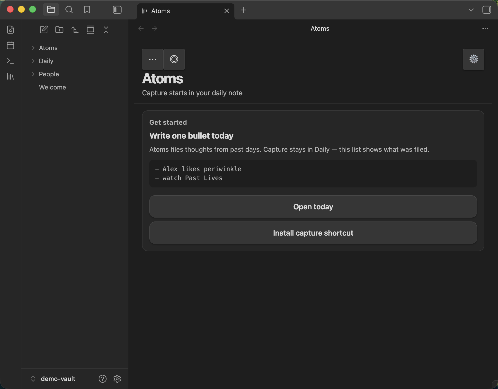
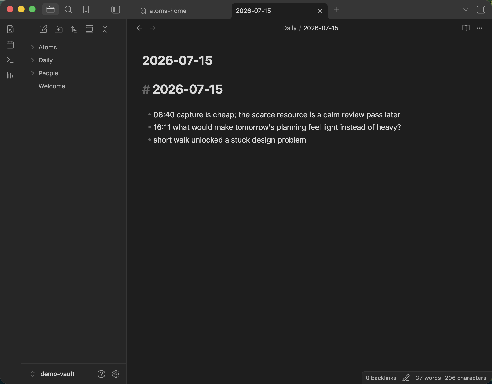
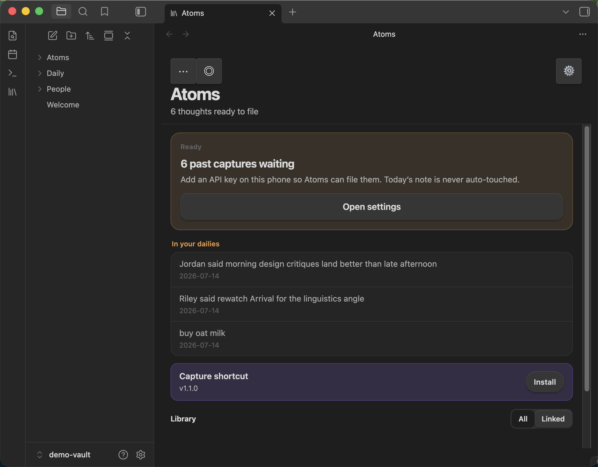
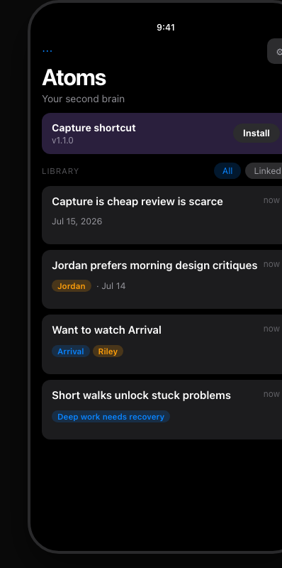
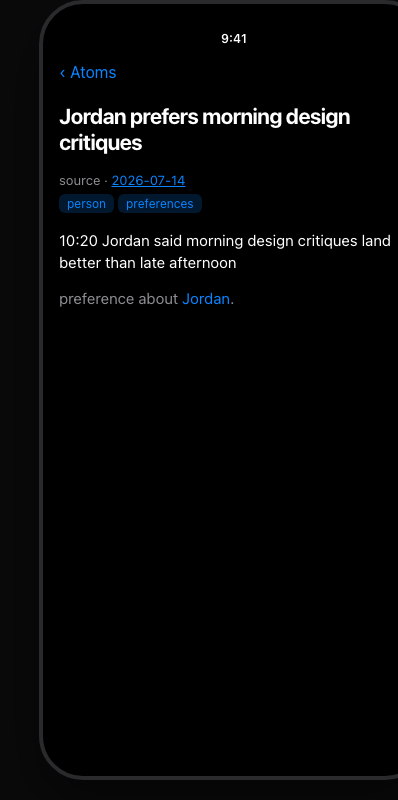
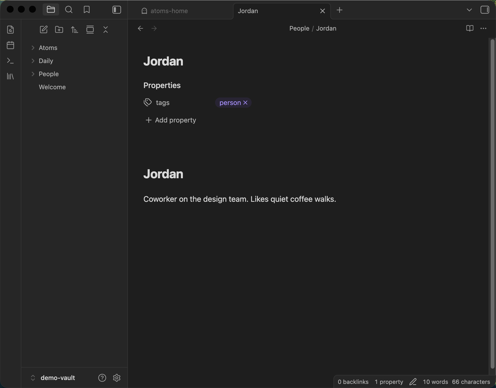
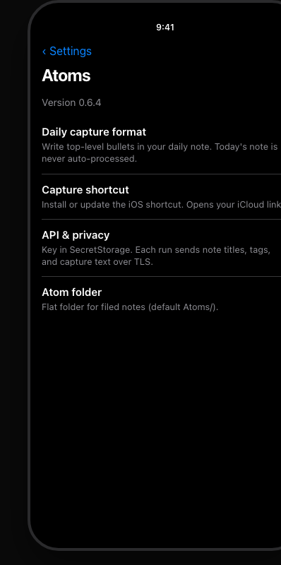

# Atoms

Get stuff **out of your head** into Obsidian — then have it **filed, linked, and gently brought back** so you can expand on it later.

The loop is simple:

1. **Dump** — capture a thought instantly (phone shortcut or a bullet in Daily Notes). No filing UI, no folders, no “where does this go?”
2. **File** — Atoms classifies **past** captures into flat notes under `Atoms/` (title, tags, reason-bearing links). Your original words stay **verbatim** as the body.
3. **Recall** — home resurfaces filed notes (For you / mind-change / library) so you’re not stuck in a guilt task list. Open any atom in Obsidian and keep writing.

It’s a **second brain inside your vault**, not a separate app and not a CRM. Person hubs you already keep get real links and backlinks.

> **Paid services notice.** Atoms needs a paid AI service to file anything. Pick one:
> **bring your own [Anthropic](https://console.anthropic.com) API key** and Anthropic bills you directly for your usage, or subscribe to **Atoms Plus** (hosted, no key to set up) from Settings inside the plugin. Asking Claude or ChatGPT about your atoms uses a cloud mirror: hosted Plus, or run [`plus-service` yourself](docs/ask-self-host.md) (Settings → Advanced → DIY Ask guide). Pricing and a free trial are at [tryatoms.app](https://tryatoms.app). The plugin code itself is MIT and free.

**Plugin id:** `atoms` · **Version:** see `manifest.json` · **Requires:** Obsidian ≥ 1.11.4, core **Daily Notes**, and either an Anthropic API key or Atoms Plus

**Coding agents:** start at [`AGENTS.md`](AGENTS.md) (claim rules + constitution). Humans do not need to memorize process — agents must.

### Privacy & cost

- Each classify run sends **vault note titles**, tags, person-hub **titles**, and the **capture text** to the Anthropic API over TLS.
- Filing costs money either way. With your own key (stored in SecretStorage, never `data.json`) **Anthropic bills you** for the usage. With **Atoms Plus** you pay a monthly or yearly subscription instead, and requests go through the Atoms service. The plugin code is free (MIT); the AI behind it is not.
- The model never rewrites your hand-authored daily bullets. It creates flat atom files, appends markers, and (only when you choose **Update notes**) refreshes titles/links/tags on existing linker atoms — **never** the capture body.
- On Process title collision, **existing atom files are not overwritten** (protect-existing).
- Automatic filing (device-local, default off) requires a one-time privacy acknowledgment. Unattended passes only file from the **day you turn it on**, forward, and never today’s daily. Older unmarked captures are a priced **Backfill** offer on home, not a background sweep.

---

## What it does

| Step | Behavior |
|---|---|
| **Capture** | Instant dump — iOS Shortcut or typing bullets (`- thought`) in Daily Notes. Capture UI is not this plugin. |
| **Classify** | Anthropic structured output: keepable **atom** vs logistics **noise** (task soft-retired). Title, tags, reason-bearing links. |
| **Write** | New flat files (default `Atoms/`) + append markers under past captures so nothing reprocesses. |
| **Update notes** | Optional: re-run the same AI path on older atoms so titles/links match newer filing quality; body stays put. |
| **People** | Vault-aware person hubs + structural tags — no AI folders, no CRM. |
| **Home** | Mobile-first leaf: wait to file, library, first-day setup, **For you** resurface (incl. mind-change), progress while Preview/Process runs. |
| **Ask** | Optional cloud copy of flat `Atoms/*.md` so Claude and ChatGPT can search. Vault stays the source of truth. Never writes atom bodies back. Hosted Plus, or [DIY Ask](docs/ask-self-host.md). |
| **Open loops** | Intention notes stay open until a later atom redeems them. Command palette: **Open loops: notes left for later** and **Open loops: review proposals**. |
| **Atom graph** | Command palette → **Open atom graph**. Global Graph filtered to atoms and notes they connect to (not the whole vault hairball). |

### Non-negotiables

- Body of every atom = capture text **verbatim**
- Never move files or invent folders
- **Automatic filing never processes today’s daily**, and never reaches history from before the day you enabled it (manual “Preview/Process today” exists for testing; **Backfill** is the attended history path)
- API key in SecretStorage (or device-local fallback), never in `data.json`
- Write types: new atom files · append-only markers · user-initiated Update notes (model surfaces only)
- Second brain, not a task app — no due-date queue

---

## Install

### Community plugins

Atoms is in Obsidian's [community directory](https://obsidian.md/plugins?id=atoms). That is the usual way to install.

1. Settings → **Community plugins** → Browse → **Atoms** → Install → Enable.
2. Updates come from the community plugin channel.
3. Continue with [First-run setup](#first-run-setup).

### BRAT (dogfood / beta)

Use BRAT if you want prerelease builds before they hit the directory.

1. Install [BRAT](https://obsidian.md/plugins?id=obsidian42-brat).
2. BRAT → **Add beta plugin** → `taihartman/obsidian-atoms`.
3. Enable **Atoms**. **Check for updates** after each [GitHub Release](https://github.com/taihartman/obsidian-atoms/releases).

**Stable vs beta (GitHub tags):**

| Channel | Tag / version shape | GitHub Release | Who gets it |
|---|---|---|---|
| **Stable** | `0.7.10` (no suffix) | **not** marked prerelease | Community plugins · BRAT with betas off |
| **Beta** | `0.7.11-beta.1` or `-rc.1` | marked **prerelease** | BRAT only if **Enable betas** is on |

- Dogfooders: BRAT → turn on **Enable betas** → Check for updates.
- Everyone else: Community plugins, or BRAT with betas **off**.

### Manual (GitHub Release)

If you cannot use the directory:

1. Download `main.js`, `manifest.json`, and `styles.css` from the latest **stable** [Release](https://github.com/taihartman/obsidian-atoms/releases) (skip “Pre-release” unless you want beta).
2. Put them in `<Vault>/.obsidian/plugins/atoms/`.
3. Settings → Community plugins → refresh → enable **Atoms**.

Optional integrity check (after a CI-built release): download `SHA256SUMS.txt` from the same release, then:

```bash
shasum -a 256 -c SHA256SUMS.txt
gh attestation verify main.js -R taihartman/obsidian-atoms
```

### First-run setup

1. Settings → **Atoms**. File with **Atoms Plus** (Email → **Start free trial** or **Send sign-in link**), or paste an Anthropic key under **Your API key (optional)** (SecretStorage).
2. Confirm core **Daily Notes** is enabled.
3. Settings → Capture → install the iOS shortcut (or use the default iCloud link).
4. Capture bullets in daily notes, then use **Atoms** home → Preview → Process on **past** days (or the “including today” commands only for testing).

---

## How to use (walkthrough)

Empty vault → dump into Daily → file into a linked library → open notes in Obsidian whenever you want to expand them. Screenshots are **phone-frame** product UI with synthetic dogfood (not personal notes).

### 1. First open — empty home

Open **Atoms** from the ribbon (library icon) or command palette → **Open home**. With no filed atoms yet, you get a setup card: write one bullet today, open today’s daily, install the capture shortcut.



### 2. Capture as daily bullets

Get it out of your head: top-level bullets in a **past** daily note (or today’s note if you only want to test later with “including today”). Phone shortcut or desktop typing both work.



### 3. Waiting to file

When past days have unmarked bullets, home shows a **waiting** card (and a queue peek). Today’s daily is never auto-processed. Sign in to Plus or add an API key if prompted, then Preview / Process (or enable automatic filing after the privacy ack).



### 4. Library after filing

Filed claims land as flat notes under `Atoms/`. Home lists them with optional person / work chips. Tap a row to open the atom in Obsidian and keep writing.



### 5. An atom note

Each atom keeps your capture text **verbatim**, plus frontmatter (`created`, `source`, tags, `generated-by`, quality stamps) and reason-bearing links the model proposed. Expand the note like any other Obsidian file.



### 6. Person hubs

Link to a person note you already keep (e.g. `People/Jordan`). Backlinks surface preferences and related atoms without a separate CRM.



### 7. Settings

**Settings → Atoms**: Plus account (or your own API key), Ask mirror, capture shortcut URL, model, atom folder, vocabulary. Version is at the top of the tab.



### After you’re set up

- **For you** on home gently resurfaces filed atoms (calendar day, connections, quiet spacing) and mind-change pairs when you revised yourself: stream, not a review queue.
- **Update notes** (home strip or command) refreshes older atoms to current filing quality when the pipeline improves; original capture text still never changes.
- **Automatic filing** (home, after the privacy ack) files new past captures on this device from the day you turn it on. Today stays untouched. Older history is **Backfill** on home (or the command), priced before it runs.
- **Ask mirror** (Settings) keeps a cloud copy of `Atoms/` current while Obsidian is open, so Claude and ChatGPT can ask. Wipe and Sync now live there too.
- **Open loops** (command palette) lists intention notes that are still open.

---

## Capture (phone)

1. Open Obsidian with Atoms once so it creates `Atoms System/Inbox.md` and the **Atoms Inbox** bookmark.
2. **Settings → Capture → Install Capture Atom** (or Atoms home).
3. **Lock once:** Shortcuts → Capture Atom → edit → **Append to Bookmark** → **Atoms Inbox** (not Ask Each Time) → Done.
4. Run it to append a stamped line to the inbox.
5. When Obsidian next opens (or via the **Drain inbox** command), each line files into the daily for its stamp date.
6. **Preview / Process** past days from Atoms home as usual.

Uses Obsidian's **Capture to Bookmark**, which appends with the app force-quit — so a capture on a day with no daily still survives. See [docs/capture-shortcut.md](./docs/capture-shortcut.md).

---

## Development

```bash
npm install
npm run dev          # watch-build main.js
npm test
npm run build
./scripts/install-to-vault.sh   # copy build into the throwaway vault
node scripts/seed-demo-vault.mjs           # synthetic README dogfood (full library)
node scripts/seed-demo-vault.mjs --empty   # first-day empty
node scripts/seed-demo-vault.mjs --waiting # past captures pending
```

Throwaway vault: `test_vault/test vault/`. Prefer that over a personal vault until dry-run looks right.

README screenshots use **`docs/media/demo-vault/`** with fictional sample notes only (`seed-demo-vault.mjs`). Do not seed personal vault content into that folder.

### Useful command palette entries

- **Open home**
- **Dry-run: preview classifications** / **including today (test)**
- **Process unprocessed captures** / **including today (test)**
- **Update notes (refresh older atoms to current quality)**
- **Test connection**
- **Backfill: estimate cost & confirm batch**
- **Open loops: notes left for later** / **Open loops: review proposals**
- **Sync everything now**

---

## Docs

| Doc | Purpose |
|---|---|
| [CLAUDE.md](./CLAUDE.md) | Agent rules / non-negotiables |
| [docs/architecture.md](./docs/architecture.md) | System map |
| [docs/how-atoms-works.html](./docs/how-atoms-works.html) | Visual walkthrough of capture → file → resurface |
| [docs/capture-shortcut.md](./docs/capture-shortcut.md) | iOS shortcut + iCloud link |
| [docs/ask-self-host.md](./docs/ask-self-host.md) | DIY Ask (run plus-service yourself) |
| [docs/design-handoff/atoms-view/](./docs/design-handoff/atoms-view/) | Home UI mocks |
| [docs/plans/](./docs/plans/) | Implementation plans |

---

## Repo

**[taihartman/obsidian-atoms](https://github.com/taihartman/obsidian-atoms)**

Releases ship `main.js`, `manifest.json`, and `styles.css` (plus `SHA256SUMS.txt`) for the Community directory and for manual install. Assets are built in GitHub Actions when a new version lands on `master`, with [artifact attestations](https://docs.github.com/en/actions/security-for-github-actions/using-artifact-attestations/using-artifact-attestations-to-establish-provenance-for-builds).

**Cut a release (maintainers):** bump `manifest.json` + `package.json` (+ `versions.json` via `npm version` / `version-bump.mjs`) and merge to `master`. CI creates the matching GitHub Release and tag. Do not hand-tag after a normal version-bump merge.

The [Release](https://github.com/taihartman/obsidian-atoms/actions/workflows/release.yml) workflow builds, attests, and attaches assets. Tag must equal `package.json` / `manifest.json` version. **Stable:** version `0.7.10` → ordinary Release. **Beta:** bump to `0.7.11-beta.1` in package+manifest, then merge: CI marks the Release as prerelease for BRAT betas. Manual tag is recovery only: [`docs/runbooks/plugin-release-beta-stable.md`](docs/runbooks/plugin-release-beta-stable.md). Do not upload laptop-built `main.js` for production tags.

(Previously `obsidian-ai-linker`; renamed with the product.)

## License

MIT — see [LICENSE](./LICENSE).
