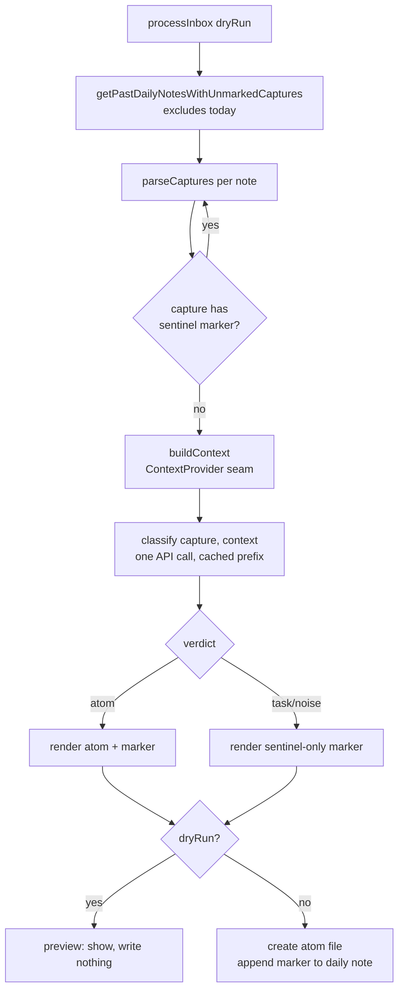
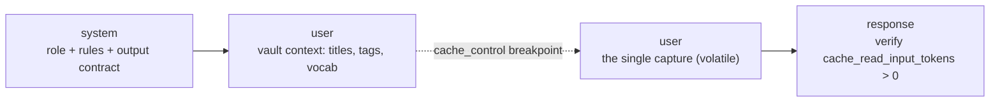

# feat: Obsidian Atoms plugin

## Product Contract

### Summary

Build an Obsidian plugin that reads **past** daily notes, splits each into individual captures, classifies every capture as **atom / task / noise**, writes one atomic note per atom (declarative-claim title + reason-bearing wikilinks, verbatim body), and marks every capture in place with a sentinel comment so nothing is ever reprocessed. It ships **dry-run-first** for prompt calibration, then an **opt-in auto-run** that fires on app-open (mobile-primary), and finally a **Batch-API backfill** for historical notes. Capture itself is out of scope — it already happens via a native iOS Shortcut.

### Problem Frame

The user captures fleeting thoughts on iPhone via Obsidian's native *Capture to Daily Note* Shortcut wired into Control Center — text is appended to today's daily note without launching the app. That half works. The missing half is turning that append-only stream into a linked knowledge graph: deciding which captures are worth keeping as permanent notes, titling them so they are findable and linkable, and connecting them to existing notes with readable reasons.

The failure modes this design exists to prevent are specific and documented: a vault of LLM prose that sounds like the user but isn't (→ body is sacred); AI-chosen folder placement that generates garbage the user must fight (→ intelligence lives in links, not folders); concurrent-write races against a live-syncing daily note (→ never touch today, only append); and a review queue that accumulates 400 unread notes and dies of the exact disease the tool exists to cure (→ the dry run is the only gate). This plan builds the *corrected* design captured in `docs/spec-amendments.md`, which resolves several load-bearing gaps in the original handoff (marker model, `append` verdict, error-handling boundary, knowledge-rot).

### Requirements

- **R1** — Process **yesterday and earlier only**; never read or modify today's daily note.
- **R2** — The atom body carries the capture's text **essentially verbatim**; light whitespace/obvious-typo cleanup is the ceiling. No paraphrasing, expansion, or "improving." The model's entire output surface is title, tags, links.
- **R3** — Never move files, choose destinations, or reorganize. Atoms land in **one configured flat folder** (default `Atoms/`).
- **R4** — Only **create files** and **append** to daily notes. Never rewrite a daily note's existing content.
- **R5** — A **per-capture sentinel marker** is the processed-state signal, and it covers **all three verdicts** (atom, task, noise) — not just atoms. A marked capture is skipped on every subsequent run.
- **R6** — Nothing is ever destroyed. The original capture always remains in the daily note. Every run is re-runnable and idempotent; a bad classification is never lossy.
- **R7** — A **dry-run preview** with zero side effects ships **before** the write path.
- **R8** — Each atom's **title is a declarative claim** ("Sleep debt doesn't accumulate linearly"), not a topic. Required for `atom` verdicts.
- **R9** — Each link carries a **`reason`**, rendered as inline prose in the atom body — not a bare link list.
- **R10** — Hard **triage** via `verdict`: `atom` / `task` / `noise`. Conservative — when in doubt, `noise`.
- **R11** — Tags come **only from the Active vocabulary**; `proposed_tags` are never auto-applied and must be surfaced for one-tap approval.
- **R12** — The API key lives in **SecretStorage** (OS keychain), never in `data.json`; entered once per device, never synced.
- **R13** — Auto-run is a **device-local setting, default off**: an `onload` async check (primary) plus an hourly interval check.
- **R14** — **Mobile-compatible by construction**: `isDesktopOnly: false`, network via `requestUrl`.
- **R15** — Atom frontmatter is **exactly** `created`, `source` (a wikilink), `generated-by`, `tags`. No `model`, `prompt-version`, or `confidence`.
- **R16** — Classification is **supersession-aware**: when a capture revises or contradicts an existing note's claim, the link's `reason` names that relationship. (The one in-v1 anti-rot move.)
- **R17** — Backfill runs via the **Batch API** behind an explicit confirmation gate showing a count and cost estimate.

### Acceptance Examples

- **AE1** — An unmarked bullet capture in yesterday's note, run in write mode → an atom file appears in `Atoms/` with a declarative title, verbatim body, four-field frontmatter, and a sentinel marker line appended beneath the capture.
- **AE2** — A capture already followed by a `<!--linker-->` marker line is skipped; no duplicate atom is created.
- **AE3** — A `buy milk` capture → verdict `task` → a `<!--linker:task-->` marker is written, no atom is created, and it is not reprocessed on the next run.
- **AE4** — Today's daily note is never among the files read or written, even when it contains unmarked captures.
- **AE5** — A dry run over notes with unmarked captures shows every decision (verdict, title, links, marker that *would* be written) and creates/modifies nothing on disk.
- **AE6** — On a run of ≥2 captures **whose stable prefix exceeds the model's cache floor**, `cache_read_input_tokens` is non-zero on the second and later calls. (Below the floor, cache_read is legitimately 0 — see KTD3.)
- **AE7** — A capture that revises an existing atom's claim produces a link whose `reason` names the supersession ("revises [[…]]"), end-to-end, against a scratch-vault fixture built for this case. (Exercises the one in-v1 anti-rot move — R16/KTD9 — rather than only asserting it renders.)

### Scope Boundaries

**In scope:** classifying past daily-note captures; atom creation with titles/links/markers; the vocabulary system; dry-run preview; manual write command; opt-in auto-run; Batch-API backfill.

#### Deferred to Follow-Up Work

- **Retrieval / resurfacing (v2, the actual second-brain "third leg").** A *stream* (not a queue): "on this day", "atoms that connect to what you've been writing lately", weekly digest. This is the antidote to knowledge-rot and the deliberate v1 boundary. See `docs/spec-amendments.md` § *Knowledge rot*.
- **Age-on-recall** surfacing (uses existing `created`; flags stale/unrevisited atoms).
- **Consolidation / map-of-content pass** that *links, never rewrites* clusters of same-claim atoms (sediment → synthesis).

#### Outside this product's identity

- **Capture UI** — handled natively by the iOS Shortcut; not built here.
- **AI-chosen folder placement / reorganization** — deliberately ignored (R3).
- **`append`-into-user-notes verdict** — cut (see KTD2); an append-worthy capture becomes an atom that links to the target.
- **Always-on 3am background processing** — requires always-on hardware (`ob` headless, Obsidian CLI, or CI). Documented as a future path only; the plain-markdown vault forecloses nothing. Not built.
- **Embeddings / semantic similarity retrieval** — similarity finds *alike* notes, not *related* ones. Titles + tags in context, model picks. That's v1.

**Product Contract preservation:** No upstream `ce-brainstorm` contract exists (solo/bootstrap plan). This contract is synthesized from the pasted handoff spec plus `docs/spec-amendments.md`; where the two conflict, the amendments win (they are the corrected design).

---

## Planning Contract

### Key Technical Decisions

- **KTD1 — Sentinel-comment markers, covering every verdict.** The processed-marker is a plugin-owned continuation line keyed on an HTML-comment sentinel, not "any nearby wikilink" (which would collide with user-authored links inside captures). Atoms get `↳ [[title]] <!--linker-->`; non-atoms get a link-less `<!--linker:task-->` / `<!--linker:noise-->`. Rationale: without non-atom markers, ~80% of captures (the non-atoms) are re-classified on every run forever — a cost bomb and an idempotency break. `parseCaptures` treats a capture as processed iff the following line matches the atom marker regex **or** `^\s*<!--linker:(task|noise)-->\s*$`. (`docs/spec-amendments.md` §A, §H1.)
- **KTD2 — `append` verdict cut.** The verdict enum is `atom | task | noise`. Writing model-chosen prose into a user's hand-authored note is the one move that breaches the "only `Atoms/` + daily-note markers" safety invariant; an append-worthy capture becomes an atom that links to the target instead. (§B.)
- **KTD3 — One API call per capture, stable-prefix prompt caching.** Order: `system` (role+rules+contract) → `user` (vault context: titles + tags + vocab) → **`cache_control` breakpoint** → `user` (the single capture). Per-capture calls keep one bad response from killing a run; the cached prefix makes them nearly free *within a run*. `cache_control` ephemeral TTL `5m` for interactive, `1h` for batch (both confirmed current). The breakpoint must never carry timestamps, progress counters, run IDs, or the capture itself. **Minimum-cacheable-prefix caveat:** below the model's floor (~1024 tok Sonnet / ~2048 tok Haiku) `cache_control` writes no cache and `cache_read_input_tokens` stays 0 — that is correct behavior on a small vault, not a bug (AE6 must gate on a prefix above the floor). **Open fork (evaluate at U1 spike):** a single call per *day* with an array output (a typical day is 3–5 captures) may dissolve this entire caching subsystem and be simpler and cheaper than per-capture+caching. Decide empirically at the spike on both cost and per-capture classification quality before committing this KTD; the winner may remove the `cache_control` breakpoint.
- **KTD4 — Structured outputs via `output_config.format` (`type: json_schema`), with `additionalProperties: false` on every object.** This is the current field (the old top-level `output_format` is deprecated in its favor — verified against live API docs). Three trust layers, not two: **(1) parse layer** trusts the schema for *well-formedness only* — no regex, no parse-retry, no `try/catch` around `JSON.parse`. **(2) invariant layer** — grammar-constrained JSON generally does **not** honor conditional-required semantics (`title` "required iff `verdict==atom`"), so a schema-valid object can still be an atom with no title. A small explicit post-parse invariant check is required (atom ⇒ title present; non-atom ⇒ no title); KTD4's "no validation" rule scopes to well-formedness, never to these business invariants. **(3) request layer** is fully defended (`requestUrl` can throw offline, return non-2xx, or return an error envelope — retry 429/5xx with backoff, else fail silently and retry next launch). A **401/403 is non-retryable** (usually a missing/invalid key) — surface it as a user-visible Notice rather than folding it into silent-fail-and-retry.
- **KTD5 — API key in SecretStorage, verified on iOS at the spike.** `SecretComponent` needs the App instance (use `Setting#addComponent()`, not `addText()`); secret IDs must be lowercase-alphanumeric-with-dashes. The mobile-primary product path depends entirely on SecretStorage working in the iOS plugin sandbox — this is verified in U1, not assumed.
- **KTD6 — `buildContext()` behind a one-function `ContextProvider` seam.** v1 returns every note title + every tag + the Active vocabulary. Isolated behind `getCandidates(capture) → { titles, tags }` so a future BM25/two-stage shortlist is a one-file change. Do not solve scaling now; make solving it later cheap.
- **KTD7 — Split settings storage by sync intent.** Auto-run flag and last-run timestamp use `app.saveLocalStorage()` / `loadLocalStorage()` (per-device, never synced — two devices racing an auto-run flag is the failure to avoid). Vocabulary uses `data.json` (not secret; *should* sync across devices).
- **KTD8 — Filename sanitization + a concrete v1 collision policy.** The `title` is filename, display, and wikilink target at once. Sanitize illegal filename characters (`: / ? "` …, plus `..`, leading dots, and OS-reserved names) for the filename while keeping the full claim linkable (add an `aliases:` entry when sanitization changes the title — the one sanctioned exception to R15's four-field rule, applied only when needed). **On same-title collision (v1 behavior, fully specified — no deferral):** create **no** new file; instead emit a supersession link from the new capture to the existing atom via the normal links mechanism (KTD9), then write the capture's `<!--linker-->` marker. This stays inside the two sanctioned write types (append cut, KTD2; consolidation is v2) and treats the collision as the consolidation signal without resurrecting append-into-user-notes. (§H2.)
- **KTD9 — Supersession-aware classify prompt (R16).** The prompt explicitly asks "does this update, revise, or contradict an existing note's claim?" and, when so, emits a link whose `reason` names it ("revises [[…]]"). This is how an append-only vault records a changed mind without editing the old atom.
- **KTD10 — Render unresolved links; the marker is authoritative for processed-state.** A returned link target that doesn't exactly resolve is rendered anyway — unresolved `[[wikilinks]]` are first-class in Obsidian and self-heal. Never drop links or block on exact resolution. (§D.) **Consequence for orphan recovery:** because unresolved links are normal and expected, the pipeline must **not** treat "an atom marker whose target doesn't resolve" as a reprocess trigger — that would duplicate every legitimately-unresolved atom. The sentinel marker alone is authoritative for processed-state. Recovering a genuinely-deleted atom (marker present, file gone) is handled by a **separate explicit "rebuild orphaned atoms" command**, never by the automatic run. (Supersedes §H5's automatic-reprocess phrasing.)

### Assumptions

- **Structured-outputs GA / header status** — the spec claims no beta header is required. The context7 docs surfaced both GA and `/beta/` paths; treat the exact endpoint/header as **spike-verified** (U1) against live docs rather than hard-coded here.
- **`app.metadataCache.getTags()`** (the fast tag-count path) is undocumented; assume it may be absent and fall back to iterating `getFileCache(f).tags` + `frontmatter.tags`. Verified in U5.
- Capture parser supports **both** plain bullets and timestamped lines (per the confirmed scope). Default atom folder is `Atoms/` (user-configurable).

---

## High-Level Technical Design

### Processing pipeline (`processInbox`)



### Request structure (caching breakpoint is load-bearing)



Everything up to and including the breakpoint is the stable prefix (1 write + N−1 reads *within a run*). Anything variable before the breakpoint (timestamp, counter, run ID, the capture itself) invalidates the cache and silently costs ~10×.

### Verdict → action

| verdict | atom file? | marker written | reprocessed next run? |
|---|---|---|---|
| `atom` | yes, in `Atoms/` | `↳ [[title]] <!--linker-->` | no |
| `task` | no | `<!--linker:task-->` | no |
| `noise` | no | `<!--linker:noise-->` | no |
| *(unmarked)* | — | — | yes (self-healing for late-arriving captures) |

---

## Output Structure

```
obsidian-atoms/
├── manifest.json            # isDesktopOnly: false
├── package.json
├── esbuild.config.mjs
├── tsconfig.json
├── src/
│   ├── main.ts              # plugin entry: commands, onload/interval wiring
│   ├── settings.ts          # settings tab: SecretStorage key field, vocab UI
│   ├── parse.ts             # parseCaptures + marker detection
│   ├── context.ts           # ContextProvider seam (buildContext v1)
│   ├── vocabulary.ts        # Active vocab + auto-suggest + proposed_tags
│   ├── classify.ts          # request build, caching, structured output, retry
│   ├── render.ts            # atom file + marker rendering, filename sanitize
│   ├── preview.ts           # dry-run modal / scratch note
│   ├── backfill.ts          # Batch API + count_tokens estimate + gate
│   └── types.ts             # Capture, Verdict, ContextProvider, settings
└── test/
    ├── parse.test.ts
    ├── render.test.ts
    ├── context.test.ts
    └── classify.test.ts
```

The tree is a scope declaration, not a constraint — the per-unit **Files** lists are authoritative.

---

## Implementation Units

Grouped into five phases matching the build order in the handoff spec. Each unit is an atomic commit's worth of work, dependency-ordered.

### Phase A — Foundation & prompt lab

### U1. The spike: API key + one command + `console.log` a title

**Goal:** The smallest thing that proves the real API path and lets the prompt be tuned. Settings tab with a SecretStorage-backed key field; one command that takes a hardcoded capture string, calls the Anthropic API with a first-draft system prompt + structured-output schema, and logs the parsed JSON. No daily-note parsing, no write path.
**Requirements:** R8, R9, R10, R12, KTD4, KTD5.
**Dependencies:** none.
**Files:** `src/main.ts`, `src/settings.ts`, `src/classify.ts` (first draft), `src/types.ts`, `manifest.json`, `package.json`, `esbuild.config.mjs`, `tsconfig.json`.
**Approach:** Grow from the `obsidianmd/obsidian-sample-plugin` template. Key stored/read via `app.secretStorage` (lowercase-dashed ID). Request via `requestUrl` to `POST https://api.anthropic.com/v1/messages` (TLS-pinned host), headers `x-api-key` + `anthropic-version: 2023-06-01`, body with `output_config.format` (`type: json_schema`). This is the prompt lab **and** the shipped code path — iterate the prompt here until titles make the user nod.
**Execution note:** This unit's proof is runtime, not unit tests — smoke-verify four things against live behavior at the console: (1) SecretStorage read/write works **on an iOS device/simulator**, not just desktop (blocks the whole mobile path if it fails); (2) the structured-output request succeeds and returns schema-valid JSON, confirming the exact GA/beta-header status; (3) `cache_read_input_tokens` is observable in the response `usage`; (4) resolve the KTD3 **per-day-batching fork** — measure single-call-per-day (array output) vs per-capture+caching on cost and classification quality, and commit KTD3 to the winner.
**Log-safety rule (applies from U1 onward):** never log request headers, request bodies, or full error objects — a caught `requestUrl` error can carry the `x-api-key` header, and "logs the parsed JSON" writes private capture-derived content to the console (exportable on mobile). Redact the key to a fingerprint; gate any capture-content logging behind a dev-only flag stripped from release builds.
**SecretStorage contingency (decide at spike, don't dead-end):** if iOS SecretStorage / `SecretComponent` proves unavailable in the plugin sandbox, fall back to a device-local (non-synced) key via `saveLocalStorage` with an explicit security disclosure — recorded here as a fork to resolve at U1, not a hard blocker.
**Patterns to follow:** sample-plugin settings-tab scaffold; Obsidian `requestUrl` usage.
**Test scenarios:** `Test expectation: none — spike verified by runtime smoke (console). Prompt quality is judged by the user, not asserted.`
**Verification:** Running the command on a hardcoded capture logs a parsed `{verdict, title, tags, links}` object; the same run logged on iOS confirms SecretStorage; a two-call variant shows a non-zero cache read on the second call.

### U2. Scaffold the plugin properly + settings shell + dev loop

**Goal:** Turn the spike into a real plugin skeleton: settings tab structure, module layout, `isDesktopOnly: false`, and a throwaway-vault + Hot Reload dev loop.
**Requirements:** R14, R12.
**Dependencies:** U1.
**Files:** `src/main.ts`, `src/settings.ts`, `src/types.ts`, `manifest.json`, `package.json`.
**Approach:** Establish the module boundaries from Output Structure. Install pjeby's Hot Reload in the dev vault; create ~20 fake daily notes in a **local-only, git-backed** scratch vault (never the real vault, never a second Sync remote). Add `obsidian-daily-notes-interface` dependency.
**Execution note:** Config/scaffolding — prefer install/runtime smoke over unit coverage.
**Test scenarios:** `Test expectation: none — scaffolding. Covered by the app loading the plugin without error in the dev vault.`
**Verification:** Plugin loads on desktop and mobile builds; settings tab renders; hot-reload round-trip is ~2s with devtools.

### Phase B — Read & context (no API, no writes)

### U3. Daily-note reading + `parseCaptures()` + marker detection

**Goal:** Read past daily notes (excluding today) and split each into captures, correctly skipping already-marked captures. Log only.
**Requirements:** R1, R5, R6, KTD1.
**Dependencies:** U2.
**Files:** `src/parse.ts`, `src/types.ts`, `test/parse.test.ts`.
**Approach:** `getPastDailyNotesWithUnmarkedCaptures()` via `getAllDailyNotes` / `getDateFromFile` — scan **all** past days for unmarked captures (last-run timestamp is only an auto-run *trigger*, never a correctness gate: captures can be added to old days). `parseCaptures` handles both plain bullets (`- thought`) and timestamped lines (`- 14:32 thought`). **Capture-extent rule (define first — the marker logic depends on it):** a capture is a top-level bullet plus its indented continuation lines, up to the next top-level bullet or the marker line. "The following line" in the marker check means the first line *after* the capture's full extent, so a multi-line thought's own continuation lines are never mistaken for a marker. A capture is processed iff that following line matches the atom marker regex `^\s*↳ .*\[\[.*\]\].*<!--linker-->\s*$` **or** `^\s*<!--linker:(task|noise)-->\s*$`. Wikilinks inside the capture text itself are ignored for marker purposes.
**Execution note:** This is the correctness core — implement marker detection **test-first**; the collision with user-authored links is the exact bug to prove against.
**Patterns to follow:** `obsidian-daily-notes-interface` API; the sentinel spec in `docs/spec-amendments.md` §A.
**Test scenarios:**
- Covers AE4. Today's daily note is excluded from the returned set even when it has unmarked captures.
- Covers AE2. A capture followed by an atom marker line is reported processed (skipped).
- Covers AE3. A capture followed by `<!--linker:task-->` (and separately `:noise`) is reported processed.
- A capture whose **own text** contains `[[a user link]]` but has no following marker line is reported **unprocessed** (the collision case).
- Both formats parse: `- plain thought` and `- 14:32 timestamped thought` each yield one capture with correct text (and timestamp when present).
- A **multi-line** capture (bullet + indented continuation lines) is treated as one capture, and its continuation lines are **not** mistaken for a marker; a marker placed after its full extent correctly marks it processed. Empty daily note / a day with zero captures each handled without error.
- Precondition: core Daily Notes plugin disabled → clear error, not a silent no-op.
**Verification:** Against the 20-note scratch vault, the unprocessed-capture list matches hand-computed expectation, today is absent, and re-running after a marker is added drops that capture.

### U4. `buildContext()` behind the `ContextProvider` seam + default tag vocabulary

**Goal:** Assemble the stable prompt prefix — all note titles + all tags + the Active vocabulary — behind a swappable one-function interface. Ship the default type-tag list.
**Requirements:** R11, KTD6.
**Dependencies:** U2.
**Files:** `src/context.ts`, `src/types.ts`, `test/context.test.ts`.
**Approach:** `interface ContextProvider { getCandidates(capture): Promise<{titles: string[]; tags: string[]}> }`; v1 impl reads `metadataCache` (`getMarkdownFiles`, `getFileCache`) synchronously — no index, no embeddings. Ship default vocabulary `#idea #question #observation #reference #decision`.
**Test scenarios:**
- Returns every markdown title in the vault and the union of vault tags + Active vocabulary.
- Deterministic ordering (so the cached prefix stays byte-stable across captures within a run — no timestamps, no counters).
- Empty vault / vault with no tags handled.
**Verification:** For a fixed vault the rendered prefix is byte-identical across two captures (a prerequisite for cache hits).

### U5. Vocabulary system — Active list, auto-suggest, `proposed_tags` surfacing

**Goal:** Let the user curate a small tag vocabulary without ever hand-writing a list, and give `proposed_tags` somewhere to land.
**Requirements:** R11, KTD7.
**Dependencies:** U4.
**Files:** `src/vocabulary.ts`, `src/settings.ts`, `test/context.test.ts` (shared).
**Approach:** Two settings lists — **Active** (checkbox: 6 defaults pre-enabled + custom text field) and **Found in your vault** (scanned tags with counts, tap to promote). Auto-suggest via `app.metadataCache.getTags()` with the documented `getFileCache`/frontmatter fallback (KTD assumption). `proposed_tags` from classify runs are collected and surfaced here for one-tap approval. Vocabulary persists in `data.json` (syncs).
**Test scenarios:**
- Tag-count aggregation returns correct counts via the fallback path (don't depend on the undocumented shortcut in tests).
- The model's `tags` are filtered to Active-only; a non-Active tag is dropped, not applied.
- A `proposed_tags` entry surfaces in settings and, on approval, moves into Active.
**Verification:** Settings shows top vault tags by frequency; approving one adds it to Active and it becomes eligible for future classifications.

### Phase C — Classify & preview (the gate)

### U6. `classify()` — structured output, prompt caching, supersession-aware, defended

**Goal:** Classify a single capture against the context with a cached stable prefix, guaranteed-parse output, and full request-layer error handling.
**Requirements:** R2, R8, R9, R10, R16, KTD3, KTD4, KTD9, KTD10.
**Dependencies:** U1, U3, U4.
**Files:** `src/classify.ts`, `src/types.ts`, `test/classify.test.ts`.
**Approach:** Build the request per KTD3 (breakpoint after context, before capture). Schema per the contract below, `additionalProperties: false` everywhere. System prompt carries R2 (body-verbatim, output surface is title/tags/links only), R10 (conservative triage, default `noise`), R8 (declarative-claim titles), and R9/KTD9 (per-link reason, supersession-aware). Default model `claude-sonnet-5` (configurable; `claude-haiku-4-5-20251001` for bulk). Do **not** set `temperature`/`top_p` (rejected on Sonnet 5); omit `thinking`. **After parse, run the invariant check** (KTD4 layer 2): atom ⇒ `title` present; non-atom ⇒ no `title`. Retry 429/5xx with exponential backoff; **treat 401/403 as non-retryable and surface a Notice** (KTD4 layer 3) rather than folding into silent-fail; on other final failure fail silently. Manual commands (U7/U8/U10) must check for a stored key first and Notice "Set your API key in settings" if absent. Redact the key in any log; never log request headers/bodies (KTD5 log-safety). Log `cache_read_input_tokens` during dev.

Classification contract (grammar-constrained):
```jsonc
{
  "verdict": "atom" | "task" | "noise",
  "title": "Declarative claim, not a topic",      // required iff verdict == "atom"
  "tags": ["only-from-Active-vocabulary"],
  "proposed_tags": ["new-tag-needing-approval"],  // never auto-applied
  "links": [
    { "note": "Existing Title (rendered even if unresolved)",
      "reason": "revises [[…]] / contradicts [[…]] / relates because …" }
  ]
}
```
**Execution note:** Prove the request/response contract with a **characterization test** over a mocked `requestUrl` — assert the cached-prefix bytes are stable and the volatile capture sits after the breakpoint; do not hit the network in tests.
**Test scenarios:**
- Request shape: `cache_control` sits at the context/capture boundary; the capture is **after** it; no timestamp/counter/run-ID appears before it.
- Parse layer: a schema-valid mocked response is consumed with no `try/catch` around `JSON.parse`.
- Request layer (error paths): `requestUrl` throws (offline) → caught, no crash; a 429 → retried with backoff; a 5xx then success → succeeds; final failure → returns a fail-silent sentinel, not an exception.
- **401/403 is surfaced as a user-visible Notice, not retried and not silently swallowed**; a manual command with no stored key Notices before dispatching.
- Invariant layer: a schema-valid response that is an atom with no title (or a non-atom carrying a title) is caught by the post-parse invariant check, not passed through.
- Covers AE7. A capture revising an existing atom's claim yields a link whose `reason` names the supersession (fixture-backed).
- A link whose `note` doesn't resolve is retained (KTD10), not dropped.
- No log line contains the key or a request body/header (KTD5 log-safety).
- Covers AE6. Second call in a run (prefix above the cache floor) reports a cache read (assert against a mocked usage block).
**Verification:** On the scratch vault, classification returns valid verdicts, conservative triage skews to `noise`, and dev logs show non-zero cache reads on calls 2..N.

### U7. Dry-run preview — the one gate

**Goal:** Show exactly what *would* be written — every verdict, title, links (with reasons), and the marker that would be appended — with zero side effects. Ships before the write path.
**Requirements:** R7.
**Dependencies:** U3, U6.
**Files:** `src/preview.ts`, `src/main.ts`.
**Approach:** A manual command runs the pipeline with `dryRun: true` and renders decisions into a modal or a generated scratch note. No file creation, no daily-note append. **Stop here and let the user look at real output before U8.**
**Execution note:** Verify by driving the command in the dev vault and confirming disk is untouched — behavior over unit coverage for the render surface.
**Test scenarios:**
- Covers AE5. After a dry run over unmarked captures, no atom files exist and no daily note is modified (assert file set + mtimes unchanged).
- The preview lists one entry per unmarked capture with its verdict, and for atoms the title + each link's rendered reason sentence.
**Verification:** Preview output matches the classifications for the scratch vault; a filesystem diff before/after is empty.

### Phase D — Write & automate (the product)

### U8. Write path — create atom, append marker

**Goal:** For each atom, create the atom file; for every classified capture, append its sentinel marker to the daily note. Manual command only.
**Requirements:** R2, R3, R4, R5, R6, R9, R15, KTD1, KTD8, KTD10.
**Dependencies:** U6, U7.
**Files:** `src/render.ts`, `src/main.ts`, `test/render.test.ts`.
**Approach:** Atom file in the configured flat folder with **exactly** the four frontmatter fields (R15): `created` (capture timestamp if present, else the daily note's date — never file ctime), `source` (a wikilink to the daily note — load-bearing for the backlinks pane), `generated-by: linker`, `tags` (Active-only). Body is the verbatim capture (R2). Links render as inline prose sentences using each `reason` (R9), not a bottom list. Filename sanitized per KTD8; on same-title collision, create **no** new file — emit a supersession link to the existing atom and write the marker (KTD8 v1 policy); `aliases:` added only when sanitization changed the title. Marker append per KTD1 — atoms get `↳ [[title]] <!--linker-->`; task/noise captures get their sentinel-only `<!--linker:task-->` / `<!--linker:noise-->` line. This command writes the marker for **all three** verdicts. Append-only to the daily note (R4); original capture untouched (R6).
**Execution note:** Render/marker logic is the second correctness core — test-first on frontmatter exactness, verbatim body, and marker format.
**Test scenarios:**
- Covers AE1. An `atom` verdict produces a file in `Atoms/` with exactly the four frontmatter fields, verbatim body, and a `↳ [[title]] <!--linker-->` line appended under the source capture.
- Frontmatter has **no** `model`/`prompt-version`/`confidence`; `source` is a wikilink, not a string.
- Body equals the capture text (whitespace/typo cleanup only) — assert no paraphrase.
- Links render as inline reason-bearing sentences; a supersession link reads "revises [[…]]".
- Filename sanitization: a title with `:` / `/` yields a valid filename and (only then) an `aliases:` entry preserving the full claim.
- Collision: a second capture yielding an identical title creates **no** new file and instead writes a supersession link to the existing atom plus the capture's marker (KTD8 v1 policy) — never a silent `Title 1.md`.
- Covers AE3. A `task` verdict appends `<!--linker:task-->` and creates no file; re-running skips it.
- Daily note: only appended to; the original capture line is byte-unchanged (R4/R6).
- Marker authority (KTD10): an atom whose file was deleted but whose marker remains is **not** auto-reprocessed on the normal run (that would duplicate legitimately-unresolved atoms); the separate "rebuild orphaned atoms" command is what recovers it.
**Verification:** After a write run on the scratch vault, atoms exist with correct frontmatter/body, daily notes carry markers under each capture, a re-run is a no-op, and the daily note's backlinks pane lists the day's atoms.

### U9. Auto-run — `onload` primary + hourly interval, device-local

**Goal:** Process yesterday-and-earlier automatically when the user opens Obsidian, without blocking launch, opt-in and device-local.
**Requirements:** R13, R14, R6, KTD7.
**Dependencies:** U8.
**Files:** `src/main.ts`, `src/settings.ts`.
**Approach:** `onload` async check (primary): if auto-run is enabled and the last run was on an earlier calendar day, process asynchronously — never block launch or UI; show a `Notice` on completion ("Filed 4 captures from yesterday"). **Gate the run behind `app.workspace.onLayoutReady()` and a warm `metadataCache`** (its "resolved" event): on a mobile cold start `metadataCache` populates *after* load, so running `buildContext` too early would classify against a near-empty title/tag set and produce atoms with **no links** — silently defeating R9/R16 on the marquee flow. Never invoke `buildContext` on an unresolved cache. `registerInterval` hourly date check for long-lived sessions (not raw `setInterval`). Auto-run flag + last-run timestamp via `saveLocalStorage`/`loadLocalStorage` (device-local, default off — KTD7). Idempotency across double-firing and multi-device is carried entirely by the markers (R5). Cap per-launch work (oldest-first, ceiling) so a month-away doesn't fire ~150 calls; on failure (offline/rate-limit) fail silently and retry next launch.
**Execution note:** Mobile launch latency matters — verify async/non-blocking behavior by driving app-open in the dev vault; smoke over unit coverage for the lifecycle wiring.
**Test scenarios:**
- Last-run gate: same-calendar-day → no run; earlier day → runs.
- Double-fire (onload + interval) is a no-op on already-marked captures (idempotency).
- Per-launch cap: with more than the ceiling of unmarked captures, only the cap is processed this launch; the rest remain unmarked for next launch.
- Failure path: a simulated offline/429 leaves captures unmarked and shows no crash.
- `buildContext` is **not** invoked before the workspace/`metadataCache` is resolved (assert against an unresolved-cache fixture — guards the cold-start no-links bug).
- Setting is read from local storage, not `data.json` (assert it does not appear in synced settings).
**Verification:** In the dev vault, enabling auto-run and reopening processes yesterday's captures without a perceptible launch delay; disabling stops it; the flag does not propagate via `data.json`.

### Phase E — Backfill

### U10. Backfill mode — Batch API, cost estimate, confirmation gate

**Goal:** Process historical daily notes cost-efficiently behind an explicit, estimated confirmation.
**Requirements:** R17, KTD3.
**Dependencies:** U8.
**Files:** `src/backfill.ts`, `src/main.ts`.
**Approach:** Enumerate all past unmarked captures; estimate cost with the `count_tokens` endpoint (free; do **not** use tiktoken — it undercounts). Gate behind a confirmation modal showing capture count + cost estimate. **Estimate conservatively — do not credit cross-request cache reads:** Batch requests run in parallel with no ordering guarantee, so the cache-writing request may not land before its siblings (the API exposes `cache_miss_reason: previous_message_not_found / unavailable` for exactly this); batch cache hits are best-effort. Price the full prefix per request minus only the 50% batch discount (optionally show a cached-best-case → uncached-worst-case range), so the gate cannot under-quote a large charge. Setting `cache_control` TTL `"1h"` still helps opportunistic hits, but is not the lever — write-before-read ordering is. Optionally warm the cache with one synchronous request before submitting. Default model configurable (`claude-haiku-4-5-20251001` sensible for bulk). Results flow through the same `render` path (U8) — markers make partial completion safely resumable.
**Execution note:** Guard the spend — the confirmation gate is the load-bearing safety; verify the estimate renders before any batch submits.
**Test scenarios:**
- The confirmation gate shows a non-zero count and a cost estimate derived from `count_tokens`, and **no** batch is submitted until confirmed.
- The estimate does **not** credit cross-request cache reads (assert it equals full-prefix-per-request minus the batch discount, or a range whose worst case does).
- Batch requests carry `ttl: "1h"` on the cached prefix.
- A partially-completed backfill (some captures marked) resumes on re-run without reprocessing marked captures.
**Verification:** Pointed at the scratch vault's history, backfill shows an estimate, processes only on confirm, and a re-run after partial completion picks up only the remainder.

---

## Risks & Dependencies

- **iOS SecretStorage (blocking).** The mobile-primary path assumes SecretStorage works in the iOS plugin sandbox. Mitigation: verified first, in U1 — before six units are built on top of it.
- **Structured-outputs GA/header drift.** Docs surfaced both GA and `/beta/` paths. Mitigation: spike-verify the exact endpoint/header (U1); the classification contract is otherwise portable.
- **Daily cold-cache cost, compounding.** The 5-minute TTL means each once-a-day auto-run starts cold — a full cache *write* of the whole vault context every morning, never a cross-day read. Caching only amortizes *within* a run. Worse, the cost is **super-linear in usage, not just vault age**: every atom the tool creates is itself a note whose (long, declarative-claim) title re-enters `buildContext`'s prefix on the next run, so the tool enlarges the prefix it must cold-write. Mitigation: log/surface the cached-prefix token size per run and define the threshold at which the KTD6 `ContextProvider` shortlist must replace the all-titles prefix — otherwise cost and classification quality degrade silently. (The per-day-batching fork in KTD3 may also moot the cold-write entirely.)
- **`getTags()` undocumented.** Mitigation: documented `getFileCache`/frontmatter fallback (U5).
- **Concurrent multi-device duplicate atoms.** Two devices reading the same unmarked capture before either writes can both create an atom. Low probability (auto-run default off, single device); cost is a duplicate in a quarantine folder, not data loss. Accepted, not fixed.
- **Privacy disclosure.** Every run ships the entire title-graph + each capture to the API over TLS. Surface this in settings next to the key field, and require a **one-time explicit acknowledgment at the moment auto-run is enabled** (before the first unattended send) — a passive static label is weaker than "consent" implies, since auto-run then exfiltrates the whole graph on every launch with no user present. Backfill (U10) is a larger one-shot egress of the full history to the Batch API (server-retained for a window) — covered by the same disclosure but worth naming at its confirmation gate.
- **Dependencies:** `obsidian-daily-notes-interface`; Obsidian ≥ 1.11.4 (SecretStorage); core Daily Notes plugin enabled; Anthropic API key.

---

## Definition of Done

- All ten units land with their test scenarios green; `parse`, `render`, `context`, and `classify` carry real unit tests (the two correctness cores test-first).
- Dry-run (U7) demonstrably writes nothing; the write path (U8) is re-runnable with no duplicates and never rewrites a daily note's existing content.
- Markers cover all three verdicts; a re-run over a fully-processed vault makes zero API calls.
- Same-title collision creates no new file and writes a supersession link (AE-covered); the post-parse invariant rejects an atom-without-title; supersession fires end-to-end (AE7).
- `cache_read_input_tokens` is non-zero on calls 2..N of a run whose prefix clears the cache floor (dev-logged); backfill's cost estimate does not over-credit batch cache reads.
- Auto-run never classifies against an unresolved `metadataCache` (no cold-start no-links atoms); 401/missing-key surfaces a Notice rather than failing silently; no log line carries the key or a request body.
- SecretStorage verified on iOS (or the recorded device-local fallback taken); the key never appears in `data.json`; the auto-run flag never syncs.
- Backfill refuses to submit without a confirmed count + estimate; auto-run enablement requires a one-time data-egress acknowledgment.
- The plugin loads on both desktop and mobile builds.

---

## Sources & Research

- `docs/spec-amendments.md` — the corrected design (marker model §A/§H1, `append` cut §B, error boundary §C, unresolved links §D, filename/collision §H2, undo §H5, knowledge-rot section). Authoritative where it conflicts with the handoff.
- Anthropic API (verified live via context7): `output_config.format` with `type: json_schema` is current; the top-level `output_format` is deprecated in its favor. `cache_control` ephemeral TTL `5m`/`1h`; `cache_read_input_tokens` in the `usage` block.
- Obsidian API: `obsidian-daily-notes-interface`, `metadataCache.resolvedLinks`, `requestUrl`, SecretStorage guide, `app.saveLocalStorage`. Plugin template: `obsidianmd/obsidian-sample-plugin`.
