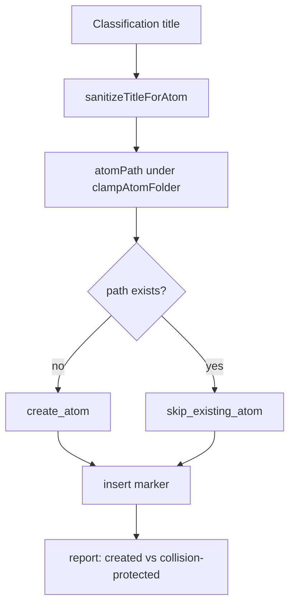

# feat: Pre-community security harden

## Goal Capsule

**Objective:** Harden Atoms so a Community / open-source install cannot clobber user notes, poison write paths, or open untrusted shortcut URLs — and ship minimum publish prep (LICENSE, privacy copy, spike gating).

**Authority:** `docs/security/pre-community-publish-review.md` · Product Contract below · CLAUDE.md non-negotiables.

**Product Contract preservation:** Unchanged (R1–R9, KD1–KD3 from brainstorm).

**Stop when:** P1 code hardening implemented + tested; LICENSE + README privacy/payments notes; spike/fixture commands gated off in production builds; version bumped; security checklist P1 items checkable.

---

## Product Contract

### Summary

Before listing Atoms in the Obsidian Community directory, close the integrity and poison paths found in the pre-publish security review. Default behavior becomes **protect existing atom files on title collision**, **clamp where atoms may be written**, **sanitize model titles**, and **open only trusted shortcut install URLs**. Publish prep makes the license and privacy story explicit without claiming on-device AI.

### Problem Frame

The plugin will leave a private friend-install path and face strangers. Silent full overwrite of an existing atom, a free-form atom folder, adversarial model titles, and an arbitrary `window.open` install URL are trust failures even when the API key story is already solid.

### Requirements

- R1. When a planned atom path already exists, **do not modify that file**. Still append the daily marker so the capture is processed. Report the collision as protected/linked-existing, not as a new atom write.
- R2. Model-produced titles used for filenames, markers, and wikilinks are sanitized: control characters removed; `[[` / `]]` neutralized; illegal filename characters handled as today; length bounded.
- R3. `atomFolder` is clamped to a safe relative vault folder (no `..`, no absolute paths, no empty segments). Invalid values fall back to `Atoms`.
- R4. Capture shortcut install opens only allowlisted HTTPS iCloud shortcut URLs (plus empty → built-in default). Other schemes/hosts refused with a Notice.
- R5. Root `LICENSE` (MIT, matching `package.json`) is present.
- R6. Spike / fixture / KTD3-fork developer commands are **not** in the default production command palette (gated by build mode).
- R7. README (and settings privacy blurb if already the right surface) state that vault **titles + captures** leave the device for Anthropic, and that usage is **optional paid API** (user’s key).
- R8. User-visible ship bumps `manifest.json` + `package.json` (+ `versions.json`).
- R9. Unit tests cover sanitizers, folder clamp, collision protect, and shortcut allowlist (adversarial cases from the security review).

### Actors

- A1. End user installing from Community or a zip.
- A2. Existing power user who already has atoms and may reprocess or collide titles.
- A3. Maintainer preparing public GitHub + Community submit (ops after this code ship).

### Key Flows

- F1. **Collision protect:** Process produces title T; `Atoms/T.md` already exists → file unchanged; marker `↳ [[T]] <!--linker-->` appended; report counts collision-protected, not created.
- F2. **Hostile title:** Model returns title with newlines / `]]` / path junk → safe filename + safe marker; no path escape; no multi-line marker.
- F3. **Poison folder:** `atomFolder` to `../x` or `/abs` → clamped to safe default.
- F4. **Bad shortcut URL:** non-iCloud / non-HTTPS → Install refuses; Notice.
- F5. **Production command surface:** Community install omits `Spike:*` / fixture process.

### Acceptance Examples

- AE1. Hand-edited existing atom body survives second process with same title; marker still appears; body bytes unchanged.
- AE2. Title `foo]]\nbar/../x` never creates a path outside the atom folder and never produces a multi-line marker.
- AE3. `atomFolder = "../Outside"` does not write outside intended relative root; effective folder is safe default.
- AE4. `openShortcutInstallUrl("javascript:alert(1)")` does not open; valid iCloud URL opens.
- AE5. Production build command list omits `Spike:*` and fixture process.
- AE6. `LICENSE` exists; README mentions Anthropic egress + optional payments.

### Scope Boundaries

**In scope:** Collision protect · title/path/marker sanitization · atomFolder clamp · shortcut allowlist · LICENSE · spike/fixture production gate · README privacy/payments · version bump · tests.

**Out of scope:** Public GitHub / Community submit (human) · device-local key UX redesign · dry-run log silence flag · smart metadata-only collision updates · overwrite toggle · changing Anthropic egress design · capture UI / embeddings / folder AI.

### Key Decisions

- **KD1 — Collision default: protect existing.** Skip atom file create/modify when path exists; still append marker; no overwrite setting.  
  `(session-settled: user-directed — chosen over smart-update / overwrite-toggle / keep-overwrite: Apple-safe default; body sacred; YAGNI on advanced repair)`
- **KD2 — Ship width: P1 harden + publish prep.**  
  `(session-settled: user-directed — chosen over P1-code-only / full-checklist)`
- **KD3 — Authority.** Security review is the threat-model source; SecretStorage-not-in-data.json already correct.

### Success Criteria

- Community-bound install cannot silently destroy an existing atom via collision.
- Write root and model titles cannot escape the atom folder via trivial poison strings.
- Shortcut button cannot open non-allowlisted URLs.
- MIT LICENSE + clear privacy/payments language.
- Spikes not default user surface.
- Tests prove AE1–AE4 class cases.

---

## Planning Contract

### Summary

Change collision from `update_atom` overwrite to **protect-existing** (marker still written; `atomSkippedCollision` already counted in write reports). Centralize title + folder sanitization in `render.ts` (or a tiny pure helper colocated with path builders). Allowlist shortcut URLs in `captureShortcut.ts`. Gate spike/fixture command registration behind esbuild production `define`. Add MIT LICENSE + README notes + version bump.

**Product Contract preservation:** unchanged.

### Key Technical Decisions

- **KTD1 — Collision action kind.** Replace `update_atom` collision path with `skip_existing_atom` (or equivalent): plan still carries path/title for markers and reporting; `applyWrite` never `create`/`modify` that path; sets `atomSkippedCollision`. Race in `applyWrite` when file appears mid-run: treat existing abstract file as skip, not force-modify.  
  `(session-settled: user-directed — inherits KD1: protect existing)`
- **KTD2 — Single sanitizer for titles.** One pure function used by `sanitizeFilename`, `markerLineForDecision`, and path builders: strip Cc controls; replace/neutralize `[[` `]]`; max length (e.g. 120); then existing illegal-filename rules. Alias still records original display title when filename changes (KTD8 spirit).
- **KTD3 — atomFolder clamp.** Pure `clampAtomFolder(raw): string` — reject `..`, absolute, empty, Windows drive-ish segments; allow single path segment only (flat folder product rule R3). Apply on settings change and on load merge into `DEFAULT_SETTINGS`. Default `Atoms`.
- **KTD4 — Shortcut allowlist.** Only `https://www.icloud.com/shortcuts/` prefix (case-sensitive host/path as today). Empty settings → built-in constant (already allowlisted). `openShortcutInstallUrl` returns false + caller Notice on reject.
- **KTD5 — Production command gate.** esbuild `define` injects `ATOMS_DEV_COMMANDS` true in watch/dev, false in `production` argv. `registerCommands` registers spikes/fixture only when true. Keep product commands always.
- **KTD6 — No smart body merge.** Explicit non-goal; reprocess same title does not refresh tags on existing file.

### Patterns to Follow

- Pure helpers + vitest first for parse/render-class correctness cores (CLAUDE.md test-first on render).
- Log safety: never log raw keys (existing `fingerprintKey` / redaction).
- Write path: bottom-up markers, `captureAlreadyHasMarker` (`docs/solutions/logic-errors/marker-line-drift-batch-process.md`).
- Version bump: manifest + package + versions.json.

### High-Level Technical Design

```text
classifyCapture
    → result.title (model, untrusted)
    → planWrite
         → sanitizeTitleForAtom(title)
         → clampAtomFolder(atomFolder)
         → atomPathForTitle
         → if path in existingAtomPaths:
              action = skip_existing_atom + marker with sanitized title
           else:
              action = create_atom
    → applyWrite: create only; never modify on skip; always try marker insert
```



### Implementation Units

### U1. Title sanitization + tests

**Goal:** Adversarial model titles cannot break markers, multi-line inserts, or path segments.

**Requirements:** R2, R9 · AE2 · F2

**Dependencies:** none

**Files:**

- `src/render.ts` (modify)
- `test/render.test.ts` (modify)

**Approach:** Extract/extend pure `sanitizeTitleForAtom` / tighten `sanitizeFilename` so all title consumers share one path. Neutralize `[[` `]]`, strip control chars (`\n\r\0` etc.), bound length, keep illegal-filename map and alias behavior. `markerLineForDecision` must use sanitized display form so markers stay single-line.

**Execution note:** Test-first on adversarial titles before changing production callers.

**Test scenarios:**

- Covers AE2. Title with newline + `]]` + `/../` → filename has no path separators or `..`; marker is single line; no raw `]]` breakout in marker.
- Empty / whitespace-only → `Untitled` (or existing empty behavior).
- Legal title unchanged (no alias when unchanged).
- Length over bound is truncated consistently for path and marker.

**Verification:** `npm test` green for render suite; greppable single sanitizer used by path + marker.

---

### U2. atomFolder clamp + settings load/save

**Goal:** Poisoned or mistaken folder settings cannot leave the intended flat relative folder.

**Requirements:** R3, R9 · AE3 · F3

**Dependencies:** none (can parallel U1)

**Files:**

- `src/render.ts` or small pure helper in `src/render.ts` / `src/types.ts` (modify)
- `src/settings.ts` (modify)
- `src/main.ts` loadSettings merge (modify if load path needs clamp)
- `test/render.test.ts` or `test/settings-path.test.ts` (create/modify)

**Approach:** Pure `clampAtomFolder`. Settings onChange + settings load apply clamp. `atomPathForTitle` / `listAtomPaths` / home helpers receive already-clamped folder from callers; belt-and-suspenders call clamp inside path builders if cheap.

**Test scenarios:**

- Covers AE3. `../Outside`, `/abs`, `foo/bar`, `..`, empty → `Atoms` (or single safe segment policy as coded).
- `Atoms` and `My Atoms` (if spaces allowed after sanitize) stay valid single segment.
- Trailing slash stripped.

**Verification:** Unit tests; settings change with bad value shows clamped value after redisplay.

---

### U3. Collision protect (planWrite + applyWrite + write path counts)

**Goal:** Existing atom files are never modified on same-title collision; markers still append; reports count collisions.

**Requirements:** R1, R9 · AE1 · F1 · KTD1

**Dependencies:** U1 (sanitized path/title)

**Files:**

- `src/render.ts` (modify) — `planWrite`, `WriteAction`, `applyWrite`
- `src/write.ts` (modify) — existingAtoms tracking, collisions already uses `atomSkippedCollision`
- `src/backfill.ts` (modify) — same planWrite consumer
- `src/preview.ts` (modify if preview promises create path on collision)
- `test/render.test.ts` (modify) — replace “updates same path” expectation
- `test/preview.test.ts` (modify if needed)

**Approach:** On existing path, plan `skip_existing_atom` (name flexible) with path + title for marker; **do not** build full replace content for write. `applyWrite` only inserts marker; sets `atomSkippedCollision` to path. Remove `update_atom` race that force-modifies. Preserve marker idempotency. Preview should say would link / protect, not would overwrite body.

**Patterns to follow:** Existing `atomSkippedCollision` field in `ApplyWriteResult` and write report `collisions` counter (already logged/Noticed).

**Test scenarios:**

- Covers AE1. planWrite with existing path → not create/update; marker still atom form with title.
- applyWrite with skip action leaves mock vault file content unchanged, marker may append.
- New title still `create_atom`.
- Non-atom verdicts still `marker_only` only.

**Verification:** Tests; manual/fixture process against existing atom title leaves body bytes identical.

---

### U4. Shortcut URL allowlist

**Goal:** Install button cannot open arbitrary schemes/hosts.

**Requirements:** R4, R9 · AE4 · F4

**Dependencies:** none

**Files:**

- `src/captureShortcut.ts` (modify)
- `src/settings.ts` / `src/atomsHomeView.ts` (modify Notices if needed)
- `test/captureShortcut.test.ts` (modify)

**Approach:** `isAllowedCaptureShortcutUrl(url)` pure predicate; `openShortcutInstallUrl` checks before `window.open`. Settings can still store free text for user paste, but open refuses bad values.

**Test scenarios:**

- Covers AE4. `javascript:…`, `http://…`, wrong host → false.
- Built-in constant and `https://www.icloud.com/shortcuts/…` → true.
- Empty → false (caller uses resolve then open).

**Verification:** Unit tests; bad URL in settings + Install → Notice, no open.

---

### U5. Production spike/fixture command gate

**Goal:** Community production bundle does not register spike/fixture commands.

**Requirements:** R6 · AE5 · F5 · KTD5

**Dependencies:** none

**Files:**

- `esbuild.config.mjs` (modify) — `define`
- `src/main.ts` (modify) — `registerCommands` gate

**Approach:** Define boolean for dev commands; wrap spike-classify, spike-cache-batch, spike-secret-storage, process-fixture-sample (and any other Spike:* / fixture-only ids). Keep open-atoms-home, list-unprocessed, dry-run, process, backfill, test-connection, auto-run commands.

**Test expectation:** none for full palette integration — verify by reading gate in code + production define; optional small pure helper test if extraction is clean.

**Verification:** `npm run build` production bundle greps without spike command id strings **or** dead-code-eliminated; dev `npm run dev` still registers for agents.

---

### U6. LICENSE + README privacy + version bump + security checklist tick

**Goal:** Publish prep artifacts and identifiable version.

**Requirements:** R5, R7, R8 · AE6

**Dependencies:** U1–U5 for version after behavior change

**Files:**

- `LICENSE` (create) — MIT
- `README.md` (modify) — privacy + optional payments; install notes
- `manifest.json`, `package.json`, `versions.json` (bump)
- `docs/security/pre-community-publish-review.md` (modify) — check off completed P1 items with date

**Approach:** Standard MIT text with year 2026 / author from package. README: short “Privacy & cost” section. Bump minor or patch (recommend **0.5.5** or **0.6.0** if framing as security ship — prefer **0.6.0** for user-visible security policy change). Tick P1 checklist in security doc.

**Test expectation:** none — file presence + version fields.

**Verification:** Files exist; Settings shows new version after install.

---

## Verification Contract

| Gate | Proof |
|---|---|
| Unit | `npm test` — render, captureShortcut, any new clamp tests |
| Typecheck/build | `npm run build` |
| Collision | Fixture or process on vault with pre-existing atom title → body unchanged, marker present, Notice collision count |
| Folder | Settings set `../x` → clamps |
| Shortcut | Bad URL refused |
| Prod commands | Production define false; spikes absent from registration path |
| Version | Settings → Atoms shows new version |

Agents: `./scripts/verify.sh` when Obsidian open on test vault, for units that touch plugin load.

## Definition of Done

- [ ] U1–U6 complete
- [ ] AE1–AE6 satisfiable
- [ ] Security review P1 checklist updated
- [ ] No update_atom overwrite on collision remains in planWrite
- [ ] Version bumped and build green

## Risks & Mitigations

| Risk | Mitigation |
|---|---|
| Media/people reprocess no longer refreshes same-title atom | Accepted (KD1); future explicit “Refresh atom” if needed |
| Single-segment folder rejects nested user folders | Product is flat `Atoms/`; document clamp |
| esbuild define leaves spike strings in bundle | Prefer dead-code elimination; verify with grep of production `main.js` |

## Deferred to Follow-Up Work

- P2: device-local key UX (no prefill)
- P2: shared safe error logger; dry-run body dump gate
- P2: catch JSON.parse per capture
- Public GitHub + Community dashboard submit
- Smart collision metadata merge

## Sources & Research

- Origin: `docs/security/pre-community-publish-review.md`
- Patterns: `src/render.ts` planWrite/applyWrite; `src/write.ts` collisions; `src/captureShortcut.ts`; `esbuild.config.mjs` prod flag
- Learning: `docs/solutions/logic-errors/marker-line-drift-batch-process.md` (marker idempotency)
- External: Obsidian Community optional-payments label (docs.obsidian.md / community blog May 2026) — no code dependency
