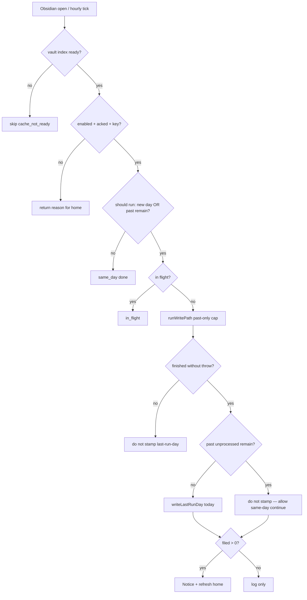

# feat: Invisible filing — reliable phone auto-run

## Goal Capsule

**Objective:** Make filing feel automatic on phone: dump during the day, open Obsidian on a new day (or after a failed attempt recovers), and past captures are filed without tapping Process.

**Authority:** This plan · CLAUDE.md non-negotiables (never auto-touch today by default; SecretStorage key; device-local auto-run) · existing U9 auto-run in `src/autorun.ts` / `src/main.ts`.

**Stop when:** Reliability gate retries correctly; home shows automatic-filing status and one-tap enable; Process remains backup; phone checklist can dogfood; version bumped for user-visible change.

**Not this plan:** Auto-filing today's daily; headless 3am without opening Obsidian; syncing key or auto-run flag via `data.json`; For you empty-same-day fixes.

---

## Product Contract

### Summary

Invisible filing means the **existing auto-run path** becomes trustworthy and discoverable. Reliability first (do not burn the calendar day on offline/auth failure; continue when past work remains). Then home speaks “filing for you” instead of only Process, with one-tap privacy ack + enable. Same product rhythm: **past days only** on auto; today stays manual.

### Requirements

- R1. Auto-run must not permanently skip the rest of a calendar day after a failed or blocked attempt (missing key, offline/network, hard error, auth failure).
- R2. Auto-run may re-run the same calendar day when past unprocessed captures remain (cap drain; markers keep it safe).
- R3. A successful scan with zero past work may mark the day done so hourly interval does not spam empty API work.
- R4. Auto-run still never processes today's daily (includeToday stays manual-only).
- R5. Auto-run remains opt-in, device-local, and requires one-time egress acknowledgment before unattended sends.
- R6. When past unprocessed exist and automatic filing is on with a key, home presents automatic filing as the default path (status / quiet confidence), not only Process homework.
- R7. When past unprocessed exist and automatic filing is off (but key present), home offers one-tap enable that sets egress ack + enabled without requiring a scavenger hunt into Settings.
- R8. When key is missing on this device, home points at adding a key — not Process as the only story.
- R9. Process (and Preview) remain available for force, include-today, and catch-up.
- R10. After a successful auto-run that filed anything, open Atoms home leaves refresh so the library/wait card updates without a manual reopen.
- R11. Auto-run stays silent on progress UI (no home progress card spam); success Notice when filings happened is OK (existing).
- R12. User-visible ship bumps plugin version (manifest + package + versions) and is dogfoodable on Remote Vault phone.

### Actors

- A1. Phone user with SecretStorage/mobile key and daily dumps via Shortcut.
- A2. Desktop/dev user verifying via CLI and test vault (no assumption desktop has the same key).

### Key Flows

- F1. **Happy morning:** Auto-run enabled + acked + key present → open Obsidian next calendar day → index ready → past unmarked filed under cap → Notice if filed > 0 → home refresh.
- F2. **Offline open then online:** First open fails network → day not burned → later open same day retries and files.
- F3. **Cap drain:** More than per-launch cap past items → first open files cap → reopen same day continues until drained or empty.
- F4. **Enable from home:** Wait surface with key, auto off → user confirms one sentence privacy → ack + enable set → optional immediate try-run if gates allow.
- F5. **Manual backup:** User still Preview/Process (past or include today) without disabling auto-run.

### Acceptance Examples

- AE1. Enabled + acked + key; last run was yesterday; past unmarked exist → open app → markers appear without Process; Notice when filed > 0.
- AE2. Enabled; simulate offline/throw before any success stamp → reopen same day with network → run attempts again (not stuck on same_day skip from a failed stamp).
- AE3. Cap 15 with 20 past unmarked → first run stamps only per KTD success rules; second open same day processes more (or remaining drain rule as specified).
- AE4. Home with past queue + auto off + key → primary “Turn on automatic filing” → after confirm, device-local enabled+acked true.
- AE5. Home with past queue + auto on → copy does not force Process-as-homework; Process still reachable.
- AE6. Auto-run path never calls write with includeToday.

### Scope Boundaries

**In scope**

- Stamp / retry gate in auto-run pure helpers + `maybeAutoRun` wiring
- Home wait-card / hero copy and enable action driven by device auto-run state + key presence
- Refresh home after auto-run success
- Tests for gate pure functions and home presentation helpers
- Version bump; phone dogfood notes in Verification Contract

**Out of scope**

- Auto-filing **today** (including evening-only variants)
- Always-on headless without Obsidian open
- Syncing API key or auto-run flags through `data.json`
- Changing For you cue logic or seeding history
- Chat-with-vault or new classify models

### Deferred to Follow-Up Work

- Optional evening “settle today” auto-file after a quiet window (product decision)
- Richer last-error surface on home (beyond one-line reason)
- Multi-device race hardening beyond marker idempotency

---

## Planning Contract

### Key Technical Decisions

- KTD1. **Success-based day stamp, not attempt stamp.** Remove pre-run `writeLastRunDay`. Stamp `LS_LAST_RUN_DAY` only when the run should count as “done enough for today”: (a) finished without throw and scanned with zero past work remaining after the run, or (b) finished without throw and no remaining past unprocessed *and* (optional) all attempted items either marked or exhaustively failed with no unmarked left — implementer picks the precise predicate from write report fields (`scanned`, `markersAppended`, `failed`) plus a cheap post-run past-unprocessed count if needed. On missing key, cache not ready, disabled, no ack: never stamp. On throw / total inability to call API: never stamp. `(session-settled direction: reliability over “once attempt per day” — chosen over burn-day-on-attempt)`

- KTD2. **Same-day re-entry when past work remains.** `shouldRunAutoProcess` (or successor pure gate) returns true on same calendar day when enabled+acked and either `lastRunDay` is null/before today **or** caller knows past unprocessed remain (pass `pastUnprocessedRemaining` / `forceContinue`). Prefer pure function inputs so tests do not need Obsidian. Markers make double-processing safe; in-flight guard still blocks concurrent runs.

- KTD3. **Empty successful scan stamps.** Zero past unprocessed after a successful gate pass stamps the day so the hourly interval does not re-scan forever. Distinct from “failed with work left.”

- KTD4. **Never include today on auto-run.** Keep calling `runWritePath` without `includeToday`. Manual Process/Preview retain force flags.

- KTD5. **Home presentation is pure + thin view.** Add pure helpers (e.g. in `atomsHomeData.ts` or `autorun.ts`) that map `{ pastUnprocessed, autoEnabled, egressAcked, hasKey, autoInFlight }` → hero mode enum + title/body/primary action id. `AtomsHomeView` only renders; `main` exposes read state + `enableAutomaticFiling()` that writes ack+enabled via existing `writeEgressAck` / `writeAutoRunEnabled`.

- KTD6. **One-tap enable = ack + enabled.** Confirm UI must restate privacy in one calm sentence (titles + captures to Anthropic over TLS when Obsidian opens; today never auto-touched). No second Settings round-trip required. Settings section remains source of truth to disable.

- KTD7. **Auto-run stays off home progress card.** Per `docs/solutions/architecture-patterns/home-native-progress-long-api-runs.md`: no `beginRun` broadcast on auto path; only `refreshAtomsHomeLeaves` after success (and optional end Notice already present).

- KTD8. **Device-local only.** No auto-run fields in `data.json`. Phone and desktop toggles independent; key independent.

### Assumptions

- User will enable on phone once the home path exists; we do not default auto-run on for existing installs (privacy).
- `runWritePath` report fields remain sufficient to decide stamp vs retry; if not, a single post-run unmarked count is acceptable.
- Obsidian iOS keeps the app process long enough for a capped run when opened (existing U9 assumption).

### High-Level Technical Design

Home wait surface (conceptual):

| past>0 | hasKey | auto on | Primary story |
|---|---|---|---|
| yes | no | * | Add API key on this phone |
| yes | yes | no | Turn on automatic filing (+ Process secondary) |
| yes | yes | yes | Filing handles past days · Process now secondary |
| no | * | * | Existing calm / For you / library |

### Sequencing

1. U1 pure gate + `maybeAutoRun` stamp fix + tests  
2. U2 home status helpers + wait-card copy/actions + refresh hook  
3. U3 one-tap enable + version bump  
4. Verification: unit + CLI where possible + phone checklist  

### Risks

| Risk | Mitigation |
|---|---|
| Same-day re-run storms hourly with remaining work | Keep in-flight; only re-enter on open/interval when gate true; cap per launch; empty success stamps |
| Privacy: one-tap too easy | Explicit confirm copy; still requires key; default remains off |
| Home confuses auto “in progress” with manual progress card | Auto stays silent; optional static “May file when you open Obsidian” only |
| Partial failures leave unmarked forever same day | Re-entry while past remain; manual Process backup |

### Alternatives Considered

- **Keep attempt-stamp; only add home UX** — rejected; offline day-burn is the core magic failure.
- **Default auto-run on after first successful Process** — rejected for this plan (privacy surprise); deferred.
- **Auto-include today after 22:00** — product fork deferred; not in units.

---

## Implementation Units

### U1. Auto-run success stamp and same-day continue

**Goal:** Failed or incomplete auto-runs no longer burn the calendar day; empty success and drained queues behave correctly.

**Requirements:** R1, R2, R3, R4, R11

**Dependencies:** none

**Files:**

- modify: `src/autorun.ts`
- modify: `src/main.ts` (`maybeAutoRun` only for stamp/gate)
- modify: `test/autorun.test.ts`

**Approach:**

- Expand pure gate API (keep name or add `shouldRunAutoProcessV2`) with inputs: `enabled`, `egressAcked`, `lastRunDay`, `today`, and `pastUnprocessedRemaining` (number or boolean).
- Rules: disabled/no ack → false; missing key handled in `maybeAutoRun` before run (no stamp); if lastRunDay < today or null → true when enabled+acked; if lastRunDay === today → true only when past remaining > 0.
- Pure helper `shouldStampLastRunDay({ threw, pastRemainingAfter })` (or equivalent): stamp iff !threw && pastRemainingAfter === 0.
- `maybeAutoRun`: remove pre-run stamp; after `runWritePath`, compute **past remaining**. Prefer one re-list via `getPastDailyNotesWithUnmarkedCaptures` (same helper as write path) so cap + failed-unmarked + mid-run vault edits stay correct. Do **not** use `report.scanned - markersAppended` alone: `scanned` is full queue size while only `maxCaptures` items run, and failed items stay unmarked.
- On throw: no stamp; return reason `error`.
- Keep in-flight guard and past-only write path.
- Do not wire home progress for auto-run.

**Execution note:** Test-first on pure gate and stamp helpers before changing `maybeAutoRun`.

**Patterns to follow:** Existing `readDeviceAutoRunState` / `writeLastRunDay` / device-local keys; silent console on auto failures.

**Test scenarios:**

- Happy: enabled, acked, lastRunDay yesterday, pastRemaining 3 → should run true.
- Same day, pastRemaining 0, lastRunDay today → should run false.
- Same day, pastRemaining 5, lastRunDay today → should run true.
- Disabled or no ack → false regardless of remaining.
- shouldStamp: threw true → false; threw false pastRemaining 0 → true; threw false pastRemaining 2 → false.
- Characterization: PER_LAUNCH_CAP unchanged; localDateString format unchanged.

**Verification:** `npm test` covers new/updated autorun cases; manual CLI `atoms:auto-run-status` / `atoms:auto-run-now` still return sensible reasons.

---

### U2. Home automatic-filing status (wait surface)

**Goal:** When past captures wait, home default story is automatic filing state, not only Process homework.

**Requirements:** R6, R8, R9, R10, R11

**Dependencies:** U1 (for accurate in-flight / post-run refresh behavior; can stub state before U1 lands if sequenced carefully — prefer after U1)

**Files:**

- modify: `src/atomsHomeData.ts` (pure mode helpers)
- modify: `test/atomsHomeData.test.ts`
- modify: `src/atomsHomeView.ts`
- modify: `src/main.ts` (expose auto-run snapshot for home; `refreshAtomsHomeLeaves` after successful auto-run with filed > 0 or always after ran)
- modify: `styles.css` only if secondary button hierarchy needs a class already used elsewhere

**Approach:**

- Pure `filingHeroMode(input) → { mode, title, body, primary, secondary }` with modes: `need_key` | `enable_auto` | `auto_on` | (optional `auto_running` if inFlight exposed).
- When `pastUnprocessed === 0`, existing home behavior unchanged (For you / library).
- When past > 0 and mode `auto_on`: eyebrow/title calm (“Past thoughts will file when you open Obsidian” / “Automatic filing on”); primary may be “Process now” as secondary emphasis; avoid “review” homework language as the only frame.
- When `need_key`: primary opens settings tab atoms (existing pattern).
- When `enable_auto`: primary reserved for U3; secondary Process/Preview.
- After `maybeAutoRun` returns ran true, call `refreshAtomsHomeLeaves()`.
- Auto-run must not call `beginHomeRun`.

**Patterns to follow:** Home-v2 one hero, calm copy; `shouldShowWaitCard`; settings open via `(this.app as any).setting?.openTabById?.("atoms")`.

**Test scenarios:**

- past 3, no key → mode need_key.
- past 3, key, auto off → mode enable_auto.
- past 3, key, auto on → mode auto_on.
- past 0 → helper returns null / not applicable (caller skips wait redesign).
- Covers AE5 copy intent: auto_on does not force Process-only homework framing (assert title/body tokens in pure helper).

**Verification:** Unit tests green; open home on test vault with unprocessed past and mock state via eval if needed; visual sanity on phone later.

---

### U3. One-tap enable automatic filing + version bump

**Goal:** From home, user can ack + enable in one confirmed gesture; ship identifiable build.

**Requirements:** R5, R7, R12

**Dependencies:** U2

**Files:**

- modify: `src/main.ts` (`enableAutomaticFilingFromHome` or similar)
- modify: `src/atomsHomeView.ts` (confirm UI + call plugin)
- modify: `src/settings.ts` only if shared copy helper needed (prefer not)
- modify: `manifest.json`, `package.json`, `versions.json` (e.g. 0.5.4)
- optional: `styles.css` for confirm button pair already matching wait actions

**Approach:**

- On primary “Turn on automatic filing”: show ConfirmModal or Notice+buttons pattern consistent with plugin (prefer Obsidian `Modal` with short privacy sentence + Enable / Cancel).
- On Enable: `writeEgressAck(true)`, `writeAutoRunEnabled(true)`, refresh home, optionally `maybeAutoRun("manual")` if gates pass.
- Settings toggles remain authoritative; no data.json writes.
- Bump version; Settings already shows version.

**Execution note:** Smoke on device/CLI after install-to-vault; unit-test pure strings if extracted.

**Test scenarios:**

- enable helper writes both LS keys true (unit with mock save/load).
- Cancel leaves both unchanged.
- Test expectation for Modal DOM: light — prefer unit on storage writes; CLI smoke for command path if exposed.

**Verification:** Enable from home on test vault → `atoms:auto-run-status` shows on+ack; version string in Settings matches; Remote Vault install script for phone dogfood.

---

## Verification Contract

| Gate | Evidence |
|---|---|
| Unit | `npm test` — autorun gate/stamp + home mode helpers |
| Typecheck/build | `npm run build` |
| Install | `./scripts/install-to-vault.sh` (or Remote Vault path per CLAUDE.md) |
| CLI | `obsidian command id=atoms:auto-run-status`; `atoms:auto-run-now` after enable; eval hasKey |
| Phone dogfood (A1) | Remote Vault 0.5.x: key works → enable from home → past unmarked on older daily → force-quit → reopen → filed without Process; airplane then online same-day retry |

---

## Definition of Done

- [ ] U1–U3 merged behavior on main (or PR) with tests listed above  
- [ ] Auto-run never includeToday  
- [ ] No auto-run flags in `data.json`  
- [ ] Version bumped and visible in Settings  
- [ ] Phone checklist exercised or explicitly deferred with reason in PR  
- [ ] Home still allows Process/Preview  

---

## Appendix

### Sources & Research

- Session product direction: dump → file without Process → surprise later (`docs/ideation/2026-07-16-product-explained-simply.html`)
- Draft sketch enriched in place (this file)
- Code: `src/autorun.ts`, `src/main.ts` `maybeAutoRun`, `src/settings.ts` auto-run section, `src/atomsHomeView.ts` wait card, `src/write.ts` `WritePathReport`
- Learning: `docs/solutions/architecture-patterns/home-native-progress-long-api-runs.md` (auto silent)
- Plan U9 history: `docs/plans/2026-07-15-001-feat-obsidian-ai-linker-plugin-plan.md` (device-local, past-only, cap)
- External research: skipped — local U9 patterns sufficient; privacy already product-settled

### Product Contract preservation

Bootstrap plan (no prior requirements-only unified plan). Session-settled: full magic path (reliability + home + one-tap); never auto today.
