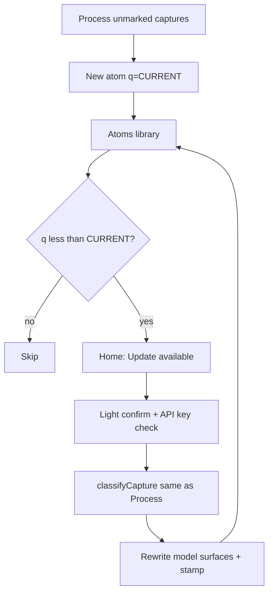

# feat: Refresh older atoms to Process parity (AI + quality stamp)

## Goal Capsule

When the classify pipeline improves, users can **refresh older atoms to the same quality as newly filed ones** — same Anthropic classify + post-classify enrich chain as Process. Capture **body stays verbatim**. Model may update title, tags, and links/reasons. Stamp `atoms-quality` so each note knows which pipeline generation last shaped it. UX: calm home strip → light confirm → run (not a homework review product).

**Product name (settled for implement):** home strip + confirm use **Update notes** (primary button **Update**). Avoid “Improve linking” / offline polish language.

## Problem Frame

0.6.6+ improved *new* Process output. Existing atoms stay on old titles/reasons forever. A **local-only** reason rewrite does **not** match new notes (no model judgment on title/hubs/tags). Product bar is **parity with Process**, not free offline polish.

Lost captures marked task/noise with **no** atom remain a separate path (unmark + Process).

---

## Product Contract

### Actors

| ID | Actor |
|---|---|
| A1 | Vault owner (desktop/phone) with API key |
| A2 | Community user with a back-catalog of atoms |

### Requirements

| ID | Requirement |
|---|---|
| R1 | **Parity:** Refresh runs the **same** classify path as Process: `classifyCapture` (API) + `applyClassificationQuality` / enrich chain. Not a weaker local-only substitute. |
| R2 | **Body sacred:** Input to the model is the atom’s capture text (body before reason prose). Model never rewrites body; write path re-embeds the **same** capture text. |
| R3 | **Model surfaces may change:** title, tags, `proposed_tags`, links/reasons — same contract as a new atom. |
| R4 | Every **new** Process atom and every **refreshed** atom stamps `atoms-quality: CURRENT` + `quality-updated: YYYY-MM-DD`. `created` + `source` immutable. |
| R5 | Eligibility: `generated-by: linker` under atom folder and (`atoms-quality` missing or `< CURRENT_ATOMS_QUALITY`). |
| R6 | Needs API key + network (same as Process). No key → same calm failure as Process (settings / test connection). Copy must **not** say offline. |
| R7 | UX happy path: home strip **Update** → **light confirm** (N notes, uses AI / key, body stays) → progress → done. Optional power “Review changes…” later; not required for v1. |
| R8 | Never auto-refresh on vault open or phone interval. |
| R9 | Batch cap (e.g. 20–50 per run) + progress UI; rate-limit friendly (reuse classify retry). |
| R10 | Version bump user-visible; tests for stamp, extract capture, apply refresh plan, eligibility. |
| R11 | If refresh would change title/filename: rename atom safely; update the **plugin-owned** daily marker line for that capture when locatable; never touch user capture bullets. |
| R12 | Refresh **modifies** an existing atom in place (or renames it). It does **not** go through `planWrite` create/`skip_existing_atom` collision for “file already exists” — that path is for *new* Process writes only. |
| R13 | If the model returns non-atom verdict (`noise`/`task`) for a body that already is an atom: **keep atom**, still run enrich for atom-shaped repair only if we force `verdict: atom` with the model title empty recovery — **v1 rule: force keep as atom**; re-classify may update title/tags/links but must not delete the atom file or convert to marker-only. |

### Acceptance Examples

| ID | Example |
|---|---|
| AE1 | New Process atom has `atoms-quality: CURRENT`. |
| AE2 | Old atom with weak reason + long title → after Refresh, title/links/reasons look like a fresh Process of the same body; body string identical; stamp CURRENT. |
| AE3 | Atom already at CURRENT not eligible. |
| AE4 | No key → Refresh does not call API; user guided to set key. |
| AE5 | Auto-run does not refresh. |
| AE6 | Code-level: Refresh and Process both call `classifyCapture` (or one shared wrapper) so prompt + enrich cannot drift. |
| AE7 | Model returns `noise` for an existing atom body → file remains; still stamped CURRENT after a keep-as-atom path (see R13). |

### Scope Boundaries

**In**

- Stamp on write (`buildAtomMarkdown`)
- Refresh orchestration: list eligible → classify each body → rewrite atom model surfaces → stamp
- Home strip + light confirm + progress
- Marker line repair when title changes (plugin marker only)
- Docs, tests, version

**Out**

- Local-only “good enough” as the primary product (may remain an internal helper for weak reasons after model output)
- Auto-refresh on plugin update
- Unmarking noise/task dailies (document one-liner in Settings/help)
- Full mandatory review sheet UI (optional later)
- Changing `created` / inventing new captures

---

## Key Technical Decisions

1. **Parity bar (session-settled: user-directed)** — Refresh uses the **same AI + enrich pipeline as Process**, not a local heuristic pass. Chosen over local-only: local cannot match new nightly quality.

2. **Two clocks** — `created` / `source` = memory identity; `atoms-quality` / `quality-updated` = last pipeline generation. *(session-settled: user-directed)*

3. **Integer `CURRENT_ATOMS_QUALITY`** — bump when Process/Refresh behavior that should re-touch old notes changes (prompt + enrich that affect model surfaces). Prompt-only that you want applied to old notes → **bump**. *(session-settled: user-approved)*

4. **Body extract → classify → reassemble** — Split atom into capture region + old reason region; classify(capture); `formatAtomBody(capture, result)` for new prose; preserve `created`/`source`; set quality stamps. *(session-settled: user-directed — body sacred)*

5. **Title may change** — Full parity includes declarative titles. Rename file when display title changes; collision = skip rename / keep old path + set aliases if needed. Update plugin marker `↳ [[old]] <!--linker-->` → `↳ [[new]]` when the capture can be found under `source` daily. **Narrow exception** to append-only dailies: only the single plugin-owned marker line. *(session-settled: user-directed for parity including titles)*

6. **Light confirm, not review product** — Strip → confirm (N, uses AI, body safe, approx cost optional) → run. *(session-settled: user-approved)* Drop “offline / no API key” copy.

7. **No auto-run** — User-initiated only. *(session-settled)*

8. **Home naming** — **Update notes** / button **Update**. Subcopy: “same AI as filing.” Confirm mentions API key. *(session-settled via mock v3 + parity decision)*

9. **YAML** — `atoms-quality` (int), `quality-updated` (date), `generated-by: linker`.

10. **Hand-edits** — v1: eligible if `q < CURRENT` and generated-by linker. User who hand-edited reasons/titles may be overwritten on model surfaces — confirm copy must say titles and links may update; original capture text will not. Future: `atoms-quality-locked` frontmatter.

11. **Keep-as-atom on refresh (R13)** — Never delete an atom because the model re-triages the body as noise. Force atom path: if verdict ≠ atom, set verdict atom and ensure non-empty title (reuse existing title if model cleared it).

---

## High-Level Technical Design

### Pipeline (must match Process)

```
eligible atom
  → extractCaptureBody(content)          // pure
  → build VaultContext (same as Process)
  → classifyCapture(body, ctx, deps)     // API + enrich
  → planRefreshWrite({ oldContent, result, body })
       - new FM: created/source kept; tags from result; quality stamps
       - body: formatAtomBody(body, result)
       - if title changed: rename plan + marker repair plan
  → apply (vault.modify / rename / marker line replace)
```

### Data model

```yaml
---
created: 2026-07-16                 # immutable
source: "[[2026-07-16]]"            # immutable
generated-by: linker
atoms-quality: 2
quality-updated: 2026-07-20
tags:
  - person
---
«verbatim capture — never from model»

«new formatLinkProse from classify»
```

### Lifecycle



### Marker exception (title change)

1. Read `source` daily path/name.  
2. Locate capture by matching body first line / bullet text.  
3. Find following plugin marker line; if atom wikilink matches **old** title, replace wikilink target with **new** title only.  
4. If not found: leave daily as-is; set `aliases` including old title so `[[old]]` still resolves.

### Cost / batching

- Default batch 20 (phone-friendly); desktop can allow 50.  
- Progress card reuse Process progress patterns.  
- Optional estimate: N × rough tokens — nice-to-have, not v1 blocker.

### When to bump CURRENT

| Change | Bump? |
|---|---|
| Prompt / schema / enrich that change titles or links | Yes |
| Home copy only | No |
| Local reason rewrite only (if still used post-model) | Yes if you want re-refresh |

---

## Implementation Units

### U1. Quality constant + stamp on Process write

**Goal:** New atoms carry `atoms-quality` + `quality-updated`.

**Files:** `src/atomQuality.ts`, `src/render.ts` (`buildAtomMarkdown`), tests, `docs/architecture.md`

**Verification:** render tests assert stamps at CURRENT.

---

### U2. Extract capture body + plan refresh content (pure)

**Goal:** Pure split/reassemble; body identity preserved.

**Files:** `src/refreshAtoms.ts` (or `improveAtoms.ts` renamed), `test/refreshAtoms.test.ts`

**Approach:** `extractCaptureBody`, `buildRefreshedAtomMarkdown(oldContent, result, { quality, today, title })`, body byte-equal to extract.

**Tests:** weak old atom → new reason; body unchanged; FM created/source kept.

---

### U3. Refresh run: classify parity + vault apply

**Goal:** Live API path identical choke points to Process.

**Files:**
- `src/refreshAtoms.ts` — orchestration + apply
- `src/main.ts` — commands `atoms:update-notes` / status
- `src/render.ts` — helpers for rename-safe paths if needed
- `test/refreshAtoms.test.ts` — apply + keep-as-atom + body identity (extend U2 file or split)

**Approach:**

- `refreshEligibleAtoms({ dryRun, limit })`  
- Reuse `classifyCapture` + same context provider as Process  
- Apply **in-place** `vault.modify` (not `planWrite` create); rename when title changes  
- Marker repair for plugin-owned line only  
- R13 keep-as-atom if model returns noise/task  
- Failures counted; continue batch; progress via existing progress helpers if present  

**Test scenarios:**
- Mock requestUrl → modify atom; body unchanged; quality stamped  
- Noise verdict → still atom file; title preserved or model title if non-empty  
- Rename path: old path gone / new path exists; marker updated when fixture daily present  

---

### U4. Home strip + light confirm + progress

**Goal:** Parity UX from mock v3 (AI-honest).

**Files:**
- `src/atomsHomeData.ts` — eligible count pure helper  
- `src/atomsHomeView.ts` — secondary strip  
- `test/atomsHomeData.test.ts`  
- styles if needed  

**Copy (lock):**

- Strip title: **Update notes**  
- Strip body: “N older notes · same AI as filing · your words stay put”  
- Button: **Update**  
- Confirm: “Refresh N notes with AI? Titles and links may update. Original capture text will not. Uses your Anthropic key.”  
- Done: “Updated N notes to current quality.”  
- No key: reuse Process empty-key messaging (do not run).  

**No** “offline · no API key.”

---

### U5. Version, seed, docs

**Goal:** Next user-visible version after 0.6.6 (or stacked PR), seed one legacy atom + one stamped; architecture + optional solutions note.

**Files:** `package.json`, `manifest.json`, `versions.json`, `scripts/seed-demo-vault.mjs`, `docs/architecture.md`, `Claude.md` command list if commands are listed there

---

## Sequencing

U1 → U2 → U3 → U4 → U5  

U1 alone is forward-compatible if U3 slips.

---

## Risks & Mitigations

| Risk | Mitigation |
|---|---|
| Cost surprise | Batch cap; confirm shows N; optional stop |
| Title rename breaks daily links | Marker repair + aliases |
| Hand-edited titles overwritten | Confirm copy; future lock |
| Body/reason split wrong | Prefer blank-line; if no split, whole body as capture (may re-embed old reason into capture — **mitigate:** strip trailing reason only when blank line present; else treat full body as capture and drop old prose on rebuild) |
| Not true parity if fork drifts | Single function both Process and Refresh call after classify |

---

## Verification Contract

1. `npm test` / `npm run build`  
2. Fixture: old atom → Refresh → compare to Process dry-run on same body (title/tags/links class similar; body identical)  
3. No key → blocked cleanly  
4. Auto-run unchanged  
5. Demo/test vault CLI: refresh command once  

## Definition of Done

- R1–R11 met  
- Mock + plan both say **AI parity**, not local polish  
- User-visible version bump  

---

## Assumptions

- User has API key for Refresh (same as Process).  
- 0.6.6 quality helpers remain part of classify path.  
- Stack after or with classification-quality PR as needed.  
- First ship sets `CURRENT_ATOMS_QUALITY = 2` (post-0.6.6 pipeline); unstamped atoms are `0` and eligible.

## Open Questions (non-blocking defaults)

| Q | Default if implementing now |
|---|---|
| Exact confirm Modal vs Obsidian Notice + buttons | Prefer small Modal / action-sheet-like UI on mobile home |
| Show token cost estimate on confirm | No in v1; N is enough |
| Max batch on phone vs desktop | 20 both; optional setting later |
| Power “Review changes” in v1 | Out of v1 (plan + mock optional only) |

## Doc review (2026-07-16 light headless)

**Team:** coherence, feasibility, design-lens, product-lens (inline; not full multi-agent swarm).

| Severity | Finding | Disposition |
|---|---|---|
| P1 | Local-only / offline contradicted parity | Already fixed in parity rewrite |
| P1 | `planWrite` skip_existing would block refresh | **R12** — in-place modify, not create path |
| P1 | Model noise verdict could delete intelligence | **R13** + KTD-11 keep-as-atom |
| P2 | Product name TBD | Locked: **Update notes** |
| P2 | Invalid `status: active` in frontmatter | Removed |
| P2 | U3/U4 missing explicit test paths | Filled |
| P3 | Cost estimate | Open Q default no |
| FYI | Marker rewrite is append-only exception | Documented; keep narrow |

**safe_auto applied:** R12–R13, naming lock, unit file lists, open questions, frontmatter cleanup, this section.

## Supersedes earlier draft

Earlier KTDs that said **local-only Improve** and **offline mock copy** are **void**. Product bar is **Process parity via API**.

## Process note (standing)

Material plan edits (product bar, KTDs, units) get at least a **light `ce-doc-review`** (headless coherence + feasibility; add design/product when UI/product moves) before `ce-work`. Full multi-persona review for large/high-risk plans.
