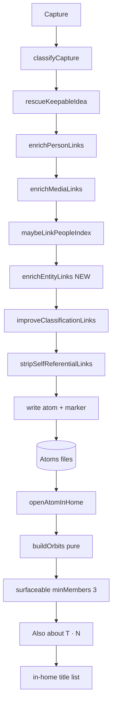

# feat: Entity orbits T0+T1 (hard links + Also about)

## Goal Capsule

**Objective.** Improve hard entity links on the existing classify path, then let users open any multi-member atom and see **Also about {entity} · N** as an in-home title list — without extra AI calls, home push cards, hub invent, merge, or checkboxes.

**Authority hierarchy**

1. Product Contract: `docs/plans/2026-07-17-006-spec-entity-orbits-product-contract.md` (R1–R26, KD1–KD11)
2. Architecture: `docs/architecture-constellations.md` (pass 2)
3. This plan (HOW)
4. Constitution: body sacred, flat atoms, no append, second brain not task app, intelligence in links

**Product Contract preservation.** Unchanged. This plan implements **T0 + T1 only**. T2–T4 remain deferred per product contract.

**Stop when:** T0 fixture gates green; T1 in-home sibling strip works on demo/test vault; soft denylist shared with connected resurface; version bumped; claim Issue closable via PR with evidence. No second Anthropic call on Process/auto-run.

**Claim coordination.** `STATUS.md` currently holds #91 Atoms Plus on `classify.ts` / home files. Do not implement until this work has its own assigned Issue + STATUS row + draft PR, and hot-file overlap with #91 is resolved (sequence after Plus, or non-overlapping slices agreed with owner).

---

## Product Contract

### Summary

Multi-night auto-run files related captures as separate atoms. Soft buckets (`Camping`, `People`) look like structure but are not trip-specific. This ship: (1) form **hard** links to existing vault entity titles when filing, (2) expand soft-key silence so connected never treats Camping-only as kinship, (3) pull **Also about {T} · N** when opening an atom that sits in a surfaceable orbit (≥3 members on a non-soft vault title).

### Requirements (trace — full text in origin)

| ID | One-line |
|---|---|
| R1–R5 | Hard keys only; soft never surface; link-prose membership; minMembers 3; multi-membership OK |
| R6–R7 | Bodies separate; living derived graph |
| R8–R12 | Piggyback AI; link-if-exists; high precision; general entities; person exclusivity |
| R13–R15 | Pull-first UI; in-home title list; memory-shelf copy |
| R21–R23 | Free UI; 0 extra filings; no auto-run call multiply |
| R24–R26 | Constitution; vault lanes; kill criteria |

T2–T4 requirements (R16–R20, Suggest) are **out of this plan**.

### Scope boundaries

**In:** T0 soft keys + prompt + entity reinforce + fixtures; T1 orbit index/policy + Also about strip + title list; shared soft denylist for resurface; tests; version bump.

**Deferred to follow-up:** T2 home Together card; T3 non-person hub invite; T4 Suggest; schema constellation_key; T1 open from hub note (non-atom) sibling list; resurface Open → in-home (optional if library path enough); packing checkboxes/append.

**Outside product identity:** Collections tab; task/packing app; AI folders; second model default.

---

## Planning Contract

### Key technical decisions

| ID | Decision | Rationale |
|---|---|---|
| KTD1 | Shared `pipeline/softKeys.ts` owns soft denylist; resurface imports it | R2; today `CONNECTED_SOFT_HUBS` is only `people` — Camping-only can still “Also about” |
| KTD2 | Membership = all `[[wikilink]]` targets in **link-prose region** (not capture body, not FM source). When a reason is parseable for that edge, **require** drop if `isJunkLinkReason`. Drop soft keys. Key must resolve to an **existing vault title** and must not be a daily basename (`YYYY-MM-DD`) | R1, R3; never last-wikilink-only parse; never full-body chips |
| KTD3 | `enrichEntityLinks` after `maybeLinkPeopleIndex`, before `improveClassificationLinks` / `stripSelfReferentialLinks` | Inject then rewrite weak reasons then strip junk; media/person run first |
| KTD4 | Entity reinforce = media contract: atom-only; never title/verdict; **exact** case-insensitive title match only (no media-style contains resolve); high-precision shape gates | R8–R10; contains-match invents wrong hubs |
| KTD5 | Orbit index pure + derived on home open / open-atom; no vault index files | KD5 product |
| KTD6 | T1 UI on `openAtomInHome` / `renderHomeOpen` (not For you hero, not land peak hero) | R13; citator cousin |
| KTD7 | **Library row opens in-home** (`openAtomInHome`) so Also about is reachable. Optional secondary “Open in vault” stays on the open view. Land peak / mind-change pair stay as today. **Amended 2026-07-18:** library → vault note again (`docs/plans/2026-07-18-amend-library-open-vault-note.md`); Also about entry = Together → siblings + other in-home paths | Feasibility: today almost nothing calls `openAtomInHome` |
| KTD8 | Person-only hard keys: if every surfaceable key for the open atom is in `personHubTitles` from `discoverPersonHubs` (cached on `loadData`), **suppress** Also about | R12 / KD8 |
| KTD9 | No schema change; prompt-only for model guidance | Cost + contract simplicity |
| KTD10 | No extra Anthropic call | R21–R23 |
| KTD11 | (session-settled: user-directed — chosen over T0-only / soft-keys-only: full T0+T1 first claim) | User confirm at plan scope gate |
| KTD12 | Hub-note open sibling list (open a non-atom hub file in-home) is **out of this claim** — atom-open only; product R13 hub-open deferred | Keep T1 shippable |

### High-level technical design



**Soft key flow**

```
softKeys.isSoftEntityKey
  ├── resurface bestConnectedEdge (rank-2 shared chip skip)
  └── entityOrbitPolicy (never surface orbit keyed on soft)
```

### Assumptions

- #91 Plus claim will not permanently block `classify.ts` / `atomsHomeData.ts`; implementer sequences or coordinates before editing (hard gate).
- Existing vault titles for trips/projects may be sparse; silence without hub is accepted (product).
- Library → in-home is an acceptable product change for this claim (KTD7); users still reach vault via “Open in vault” on the open view.

### Alternatives considered

| Approach | Why not for this claim |
|---|---|
| Home Together push card first | Pass 2 / product: pull-first; home noise |
| Haiku second pass | Cost under auto-run + Plus 150 |
| Full-body wikilink membership | Sacred body user links false members |
| Invent trip hubs in T0 | Person-hub adversarial bar; R19 |

---

## Implementation Units

### U1. Shared soft entity keys

**Goal.** One denylist for soft buckets; connected resurface stops treating Camping-only (etc.) as named kinship.

**Requirements.** R2, R24

**Dependencies.** None

**Files.**
- Create: `src/pipeline/softKeys.ts`
- Modify: `src/resurface/resurface.ts`
- Test: `test/softKeys.test.ts`, `test/resurface.test.ts`

**Approach.**
- Export `SOFT_ENTITY_KEYS` (lowercase set) and `isSoftEntityKey(title)`.
- Include at least: people, camping, travel, movies, shows, watchlist, index, social, tags, home, archive, templates, app ideas, projects (and obvious aliases).
- Replace `CONNECTED_SOFT_HUBS` usage with `isSoftEntityKey` (keep export alias if needed for tests).
- Case-insensitive trim match.

**Patterns.** `isSoftConnectedHub` today; person denylist style in `people.ts`.

**Test scenarios.**
- `isSoftEntityKey("Camping")` / `"people"` / `"App ideas"` → true
- `isSoftEntityKey("Yosemite packing")` → false
- Two atoms sharing only `Camping` chip → `bestConnectedEdge` does not return rank-2 via Camping (extend resurface tests)
- People-only share still silent (existing)

**Verification.** `npm test` softKeys + resurface green.

---

### U2. Entity link reinforce (T0 enrich)

**Goal.** After classify, reinforce hard links to existing vault entity titles for list/trip/project-shaped captures; never invent titles.

**Requirements.** R8–R11, R21, R24

**Dependencies.** U1 required (soft denylist SSOT)

**Files.**
- Create: `src/pipeline/enrich/entityLinks.ts`
- Modify: `src/pipeline/classify.ts` (both `classifyCapture` and `applyClassificationQuality` chains; short prompt section)
- Test: `test/entityLinks.test.ts`

**Approach.**
- Pure `enrichEntityLinks(captureText, result, noteTitles): ClassificationResult`.
- Contract mirror media: atom-only; no title/verdict change; identity return if no-op.
- Shape gate: packing/list/trip/project heuristics (high precision — e.g. pack/packing for, packing list, trip to, project crumbs). Prefer under-matching; not every bullet list.
- Candidate entity: token/phrase from capture that **exactly** matches a vault title case-insensitively (vault casing preserved). **No contains-resolve.** Never invent.
- Skip if candidate is soft key (`isSoftEntityKey`).
- Dedup existing links; inject substantive reason with `[[Title]]`.
- Do not mass-delete soft links (People index still valid). Do not drop person/media links.
- Prompt addendum: list/trip/project dumps must link **existing** entity note titles when present; do not invent hollow hubs; soft Camping/Travel alone is not enough when a specific title exists.

**Patterns.** `enrichMediaLinks` + `workTitleExistsInVault` (exact only), enrich chain order in `classify.ts`.

**Execution note.** Test-first on pure enrich (media.test.ts style) before wiring classify.

**Test scenarios.**
- Non-atom → unchanged
- Packing-shaped capture + vault has `Yosemite packing` + exact token match → link injected with vault casing
- Project-shaped capture + existing work title exact match → link injected (R11 not packing-only)
- Same without vault title → no invent
- Short token must not match longer unrelated title via contains (e.g. `Japan` must not link `Japan packing 2024` unless exact)
- Soft title only (`Camping`) as only match → no reinforce to Camping as hard entity hub
- Existing hard link → no duplicate
- Media fixtures still pass when full quality chain runs

**Verification.** entityLinks tests + classify chain still typechecks; no new network calls in unit tests.

---

### U3. Orbit index and policy (pure)

**Goal.** Build surfaceable sibling sets from generated atoms’ link-prose hard keys.

**Requirements.** R1–R5, R7, R12, KD3–KD5

**Dependencies.** U1

**Files.**
- Create: `src/pipeline/entityOrbitIndex.ts`
- Create: `src/pipeline/entityOrbitPolicy.ts`
- Test: `test/entityOrbitIndex.test.ts`

**Approach.**
- Input record: `{ path, title, content, sourceDate? }` for generated atoms under atom folder.
- Extract membership keys: `extractLinkProseRegion` → collect all `[[Note]]` titles (regex scan of region). When pairing with `parseLinkProse` reasons, **drop** edges whose reason fails `isJunkLinkReason`.
- Hard-key gates (all required): not soft; not daily basename `YYYY-MM-DD`; **exists in vault title index** (case-insensitive); minMembers ≥ 3 for surface.
- Normalize id = lower(trim); display label = vault preferred casing.
- Invert: key → members (exclude self-links).
- `buildOrbits(atoms, opts: { vaultTitles: string[]; personHubTitles?: Set<string> })`.
- `siblingsForAtom(path, orbits)` returns surfaceable orbits containing path.
- Person exclusivity: if all surfaceable keys for atom are in `personHubTitles`, return empty for Also about (KTD8).
- Pick primary orbit when multiple: prefer non-person; then higher memberCount; then newer sourceDate if available.

**Patterns.** `atomGraphSet` filters (conceptually); `extractLinkProseRegion`; `isJunkLinkReason`; pure graph tests.

**Test scenarios (product fixtures).**
- 3 atoms link-prose → `Yosemite packing` + title exists → one orbit, surfaceable, siblings exclude self
- 3 atoms link `Missing hub` title not in vaultTitles → zero surfaceable (R1)
- 3 atoms soft `Camping` only → zero surfaceable
- 3 atoms link daily basename `2026-07-01` only → zero surfaceable
- 2 Yosemite + 2 Japan via Camping only → no cross-merge orbit
- Capture body contains `[[Camping]]` but link-prose does not → no Camping membership
- 3 atoms → person hub only + personHubTitles set → Also-about suppressed
- 3 atoms → existing media/work title → surfaceable
- Atom with 2 hard keys → multi-membership; pick policy deterministic
- Junk-only reason edge → no membership for that key

**Verification.** Pure tests only; no Obsidian runtime required.

---

### U4. Also about strip + title list (T1 home)

**Goal.** Library opens atoms in-home; Also about shows when policy passes; title list; tap opens peer in home.

**Requirements.** R6, R12–R15, R21, R24

**Dependencies.** U3

**Files.**
- Modify: `src/home/atomsHomeData.ts` (pure helpers: strip model, sibling rows, copy)
- Modify: `src/home/atomsHomeView.ts` (library row → `openAtomInHome`; `loadData` person hubs + orbit cache; `renderHomeOpen` strip + `entity-siblings` state)
- Modify: `styles.css` (strip + list; ≥44px; flat card tokens)
- Test: `test/atomsHomeData.test.ts` (pure helpers)

**Approach.**
- **Entry (required):** library row click calls `openAtomInHome(path)` instead of vault `openLinkText`. Keep “Open in vault” on the open view.
- On `loadData`: cache `personHubTitles` via existing `discoverPersonHubs` (or equivalent titles-only set); rebuild orbit index from `atomFileInputs` + vault titles from metadata/title list available to home.
- On `openAtomInHome`: `siblingsForAtom` with person exclusivity (R12/KTD8).
- If primary orbit: strip **below title, above claim** — **Also about {label} · N** where N = other members (orbit size − 1).
- Tap strip → `homeOpen` kind `entity-siblings` with label + rows `{ path, title, sourceDate? }`.
- Sibling list: back to atom; rows → `openAtomInHome`; footer: “Each note keeps its own body. This view only gathers titles.”
- No checkboxes; no progress; no person-orange on non-person; no purple fills; no em dashes.
- Land peak / waiting / mind-change pair unchanged (Also about only on atom home-open).

**Patterns.** `renderHomeOpen`, citator peer click, `backLink`, grouped list, design tokens.

**Test scenarios.**
- Pure: orbits + personHub set → strip model null vs present (person-only → null)
- Pure: sibling rows exclude self; sort stable (sourceDate desc then title)
- Pure: copy has no em dash; body-separate sentence present
- Manual/QA: library row → in-home → Also about → list → peer (screenshot path)

**Verification.** Unit helpers green; test vault: library open multi-member atom → strip → list. Screenshots `docs/qa/screenshots/entity-orbits/`.

---

### U5. Wire, version, architecture pointer, claim hygiene

**Goal.** Production path complete; docs/module map; version identifiable; STATUS/PR ready.

**Requirements.** R21–R25; shipping tail prerequisites

**Dependencies.** U1–U4

**Files.**
- Modify: `src/pipeline/classify.ts` (confirm chain if not done in U2)
- Modify: `docs/architecture.md` (module map row for softKeys / entityLinks / entityOrbit*; future pointer one line under v2 or enrich)
- Modify: `manifest.json`, `package.json`, `versions.json` (patch bump)
- Modify: `STATUS.md` when claiming (not in code PR necessarily — process)
- Test: ensure `applyClassificationQuality` path covered if fixture write uses it

**Approach.**
- Confirm both classify enrich chains include entity reinforce.
- Version patch (e.g. 0.6.x → next).
- README one line optional under features — not required if home is self-explanatory.
- No phone install until master merge (CLAUDE shipping tail).

**Test expectation:** none beyond full `npm test` + `npm run typecheck` + `npm run build`.

**Verification.** Build green; version in Settings path unchanged convention.

---

## Verification Contract

| Gate | Command / action |
|---|---|
| Unit | `npm test` |
| Types | `npm run typecheck` |
| Bundle | `npm run build` |
| Agent vault | Demo/test vault only: Process fixture or seed atoms with hard hub links → open atom in home → Also about |
| Soft silence | Connected resurface: Camping-only share does not produce Camping kinship card |
| Cost | Code review: no new `requestUrl` / Anthropic path for orbits |
| PR evidence | Test plan boxes checked; UI screenshots linked absolute raw URLs |

CLI: prefer `./scripts/verify.sh` or targeted `obsidian` commands when Obsidian open on test vault.

---

## Definition of Done

- [ ] U1–U5 complete; all unit tests listed pass
- [ ] T0 fixture matrix from product contract Success criteria checked
- [ ] T1 Also about path dogfooded on demo/test vault with evidence
- [ ] No second model call; no hub invent; no append/checkboxes
- [ ] Soft denylist shared with resurface
- [ ] Version bumped; architecture module map updated
- [ ] Hard claim: Issue + STATUS + draft PR with `Closes #N`
- [ ] Shipping tail after implement: simplify → code-review → compound → world-class-qa (or recorded residual)
- [ ] Hot-file conflict with #91 resolved before merge

---

## Risks and mitigations

| Risk | Mitigation |
|---|---|
| #91 hot-file collision | Claim coordination; sequence after Plus or split PRs |
| Entity reinforce over-links | High-precision shape gate; fixtures; prefer silence |
| Empty Also about (no hubs in vault) | Accepted product; T0 still valuable for future hubs |
| Library open path regresses power users | “Open in vault” remains on open view; library was already one-tap open |
| parseLinkProse last-wikilink only | Membership uses all wikilinks in link-prose region |
| Soft denylist too aggressive | Unit tests for real hubs; allowlist is denylist of buckets only |

---

## System-wide impact

- **classify / Update / auto-run / fixtures:** all share `applyClassificationQuality` / classify chain — entity reinforce applies everywhere Process quality runs.
- **Connected For you:** fewer false Camping kinships (behavior change, intentional).
- **Home open:** new strip; citator unchanged.
- **Plus filings:** unchanged (piggyback).
- **Graph command:** unchanged; orbits are phone sibling list, not graph filter.

---

## Documentation plan

- Product: already in 006-spec
- Architecture: module map rows in `docs/architecture.md`
- Optional CONCEPTS: add **entity orbit** / **hard entity key** / **soft bucket** if missing after ship
- compound: learning on soft denylist + link-prose membership after merge

---

## Sources and research

- Origin: `docs/plans/2026-07-17-006-spec-entity-orbits-product-contract.md`
- Architecture: `docs/architecture-constellations.md`
- Adversarial: `docs/plans/2026-07-17-cluster-together-adversarial-and-cost.md`, `docs/reviews/2026-07-17-constellations-staff-adversarial-review.md`
- Patterns: `src/pipeline/enrich/media.ts`, `people.ts`, `linkQuality.ts`, `parseLinkProse.ts`, `resurface.ts`, `home/atomsHomeView.ts`, `graph/atomGraphSet.ts`
- Solutions: media hybrid enrich; multi-cue resurface; weak link reasons

**External research:** skipped — strong local enrich/home patterns; product already settled.

---

## Appendix — fixture matrix (implementer checklist)

| # | Setup | Expected |
|---|---|---|
| F1 | 3 linker atoms, link-prose `[[Yosemite packing]]`, hub file exists | Orbit surfaceable; library → in-home Also about |
| F2 | 3 atoms `[[Camping]]` only | No surface |
| F3 | Mixed Japan/Yosemite via Camping only | No single merged orbit |
| F4 | Capture body `[[Camping]]`, empty link-prose entity | No Camping membership |
| F5 | 3 atoms → person hub only | No Also about strip |
| F6 | enrich: packing text + vault title present | Hard link added |
| F7 | enrich: packing text, no vault title | No invent |
| F8 | 3 atoms link missing hub title | No surface |
| F9 | 3 atoms link daily `2026-07-01` only | No surface |
| F10 | Junk-only link reason to a title | No membership for that edge |
