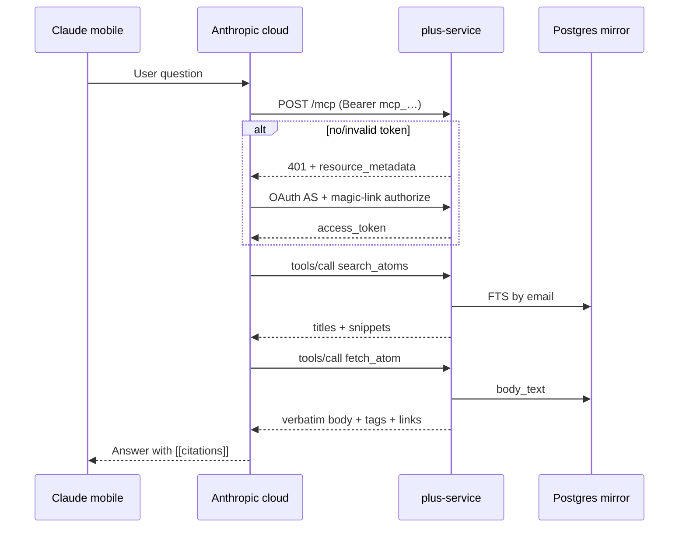

# Ask your brain — remote MCP for Claude/ChatGPT (Plus)

## Goal Capsule

**Objective.** Plus users ask questions about their atoms **inside Claude (phone + desktop)** via a **public remote MCP**. Chat stays in Claude/ChatGPT. Atoms owns read-only tools + optional `Atoms/` cloud mirror. **No in-plugin chat.**

**Authority.** Issue #112 product contract → this plan → `CLAUDE.md` non-negotiables (body sacred, no vault writes from chat). Dev Local REST MCP (`docs/dev-obsidian-mcp.md`) is **not** this product.

**P0 stop condition (protocol spike).** Dogfood user on **phone Claude** → custom connector → `https://plus.taihartman.com/mcp` → OAuth (Plus magic-link identity) → `search_atoms` / `fetch_atom` → answer with `[[title]]` citations and verbatim body quotes. Evidence under `docs/qa/`. **Label as fixture/protocol proof**, not full product enable→Process→ask acceptance (that is P1).

**P1 stop condition (hosted product path).** Plugin opt-in push (desktop **and** phone Process/Update), privacy ack (checklist below), wipe, Settings; AE1–AE4 on **hosted Claude** path. **Does not** require ChatGPT e2e or polished DIY (those are P2 follow-up issues opened before any `Closes #112`). Draft PR #116 may span P0–P1; never put `Closes #112` on P0-only merge.

**Out of band.** Full public Stripe catalog polish is not a P0 blocker if Plus sessions already work for dogfood. ChatGPT + DIY self-host docs = **P2 tracked issues** (open before close).

---

## Product Contract

**Product Contract preservation:** unchanged from #112 — planning adds HOW only.

### Problem frame

Pull recall today is Library + Obsidian search. Users want plain-language “ask my second brain” on **phone**, where Claude cannot reach vault localhost. Anthropic connects to remote MCP **from their cloud** — the server must be public HTTPS with atom text already available (hosted mirror) or DIY-hosted next to the vault.

Push recall (resurface) stays; Ask does not replace it.

### Actors

| ID | Actor |
|----|--------|
| A1 | Plus user (desktop + phone Obsidian; Claude Pro/Max or Free with one custom connector) |
| A2 | Free / DIY user (self-host MCP; no Plus bill for hosting) |
| A3 | Atoms plugin (Process/Update; P1 push client) |
| A4 | Claude custom connector (Anthropic cloud → public MCP) |
| A5 | ChatGPT remote MCP client (P2) |

### Requirements

| ID | Requirement |
|----|-------------|
| R1 | Chat happens in Claude and/or ChatGPT — **not** inside Atoms UI |
| R2 | One remote MCP (Streamable HTTP); Claude first; ChatGPT **fast-follow (P2 issue — not required to close #112)** |
| R3 | Tools **read-only**: search atoms, fetch full atom (verbatim body + tags + link reasons), optional neighbors |
| R4 | Hosted path: opt-in sync of **`Atoms/` only** with privacy ack (auto-run honesty bar) |
| R5 | Plus gates hosted mirror + MCP; free users get DIY self-host documentation (**P2 issue** if not complete at P1; Settings may link stub that states incomplete) |
| R6 | Answers cite `[[title]]` and prefer body quotes; if unknown, say so |
| R7 | User can **wipe** cloud mirror and revoke connector access |
| R8 | No Process / write / classify from chat in v1 |
| R9 | Desktop + iOS + Android consume the **same** cloud MCP |

### Key flows

| ID | Flow |
|----|------|
| F1 | P0: seed mirror → Claude Connectors → OAuth magic-link → phone question → tools → cited answer |
| F2 | P1: enable Ask + ack → Process/Update pushes atoms → Sync now / Wipe in Settings |
| F3 | P2: same MCP URL in ChatGPT; free user follows DIY doc |

### Acceptance examples

| ID | Example |
|----|---------|
| AE1 | Phone Claude: “What did I decide about X?” → tool calls → answer quotes body and cites `[[…]]` |
| AE2 | Wipe → subsequent search returns empty for that account; OAuth tokens revoked |
| AE3 | MCP tools cannot create/modify vault files or call classify |
| AE4 | Unauthenticated `/mcp` returns HTTP **401** with `WWW-Authenticate` resource_metadata (not a 200 tool error) |

### Explicit non-goals (v1)

- In-plugin chat chrome  
- Agent that files or edits notes  
- Full daily-note or whole-vault upload  
- Embeddings required day one  
- MCP process embedded in Obsidian mobile  
- Second subscription / second login system  
- Blocking P0 on unrelated Stripe public catalog work  

---

## Planning Contract

### Assumptions

- `https://plus.taihartman.com` remains the production Plus host (health verified 2026-07-27).
- Dogfood Plus sessions (magic-link + entitlement active/trialing) are available for P0 without new Stripe products.
- Claude custom connectors support Streamable HTTP + OAuth on mobile once account-linked (Anthropic docs 2026).
- Host can decrypt mirrored atoms at rest in v1 (documented in privacy ack) — not zero-knowledge.

### Session-settled decisions

| ID | Decision | Annotation |
|----|----------|------------|
| D1 | Mirror: app-level AES-GCM at rest (platform secret); wipe = hard delete | (session-settled: user-approved — chosen over per-user KMS day one: small-team ops + honesty) |
| D2 | Sync: P0 manual/seed API; P1 push on Process/Update + Sync now | (session-settled: user-approved — vault remains SSOT) |
| D3 | Connector auth: MCP OAuth 2.1 + PKCE; authorize reuses Plus magic-link; `mcp_` tokens ≠ plugin `sess_` | (session-settled: user-directed — chosen over inventing second login / query-string tokens: Claude requires OAuth; reuse Plus identity) |
| D4 | Ask included in base Plus (trialing/active); no Ask SKU v1 | (session-settled: user-approved) |
| D5 | Claude-only P0 (incl. mobile); ChatGPT + DIY = P2 | (session-settled: user-directed — phone path first) |
| D6 | Extend `plus-service` on same Fly app; path `/mcp` | (session-settled: user-approved — one deploy/auth DB) |
| D7 | Search v1 = FTS/ILIKE + title/tag boost; no embeddings | (session-settled: user-approved) |
| D8 | P0 data = per-account `atom_mirror` (not Anthropic reading vault) | (session-settled: user-approved) |

### Key technical decisions

| ID | Decision | Rationale |
|----|----------|-----------|
| KTD1 | Streamable HTTP single endpoint `/mcp`; **JSON response mode** (SSE optional later); GET may 405 | Claude supports Streamable HTTP; stateless JSON fits multi-instance Fly |
| KTD2 | Prefer `@modelcontextprotocol/sdk` (`McpServer` + `StreamableHTTPServerTransport`, `enableJsonResponse`) for protocol; **hand-roll OAuth AS** in existing `node:http` server | Avoid protocol drift; keep identity bridge on Plus patterns |
| KTD3 | Tools: `search_atoms`, `fetch_atom`; `neighbors` deferred unless free | R3; timebox P0 |
| KTD4 | Server MCP instructions: answer only from tools; quote bodies; cite `[[titles]]`; admit unknown | R6 |
| KTD5 | Unauth `/mcp` → **401** + `WWW-Authenticate: Bearer resource_metadata="https://plus.taihartman.com/.well-known/oauth-protected-resource"` (+ optional scope) | Claude discovery; AE4 |
| KTD6 | PRM `resource` **exactly** `https://plus.taihartman.com/mcp` (no trailing slash); AS issuer same host | Claude resource match |
| KTD7 | OAuth: AS metadata with PKCE S256; prefer **CIMD flags** (`client_id_metadata_document_supported` + `token_endpoint_auth_methods_supported` includes `none`) **or** DCR `/register`; redirect allowlist includes `https://claude.ai/api/mcp/auth_callback` (+ Claude Code loopback port-agnostic) | Claude auth reference; DCR spam risk |
| KTD8 | `/authorize`: require Plus identity via magic-link browser flow → consent “Atoms Ask (read-only)” → auth code bound to **email + resource + code_challenge + client_id + redirect_uri + expiry** | Reuse Plus; OAuth code interception defense |
| KTD8b | **OAuth pending state machine:** before email, persist `mcp_oauth_pending` (client_id, redirect_uri, state, code_challenge, resource, exp). Magic-link URL carries `pending_id`. Exchange sets KTD17 cookie and **302** to `/authorize/continue?pending=…` (not paste-only HTML dead-end). Consent requires cookie + pending + matching `state`; then one-time auth code | Plus today has no cookie/return_to — load-bearing for Claude connector |
| KTD8c | OAuth `state` required (CSRF); consent POST bound to same pending; reject missing/wrong/reused state | Prevents login CSRF / identity swap |
| KTD9 | Token endpoint: `application/x-www-form-urlencoded`; access `mcp_…` ~1h; refresh ~30d rotate; hash at rest like `sess_` | Separate from plugin sessions; R7 revoke |
| KTD10 | Mirror table: `(email, atom_id, title, path, body_text, tags_json, links_json, content_hash, updated_at)` unique `(email, path)` | Atoms-only; body sacred |
| KTD10b | **AES-GCM required in prod** when mirror rows exist: `ATOMS_ASK_MIRROR_KEY` in prodGate (fail-closed). Encrypt at least `body_text` (prefer title/tags/links too). Memory tests may use plaintext. Not optional. | Aligns D1; removes optional-crypto fork |
| KTD11 | Upsert/wipe HTTP: Bearer **Plus session** only; tenant email from `accountFromSession` **never** body; entitlement active\|trialing; MCP bearer never writes. Reject `mcp_` on Plus routes and `sess_` on `/mcp` | R8; multi-tenant write isolation |
| KTD11b | `accountFromMcpToken` / tools middleware: require active\|trialing else 401; Stripe cancel → `mcpRevokeForEmail` (access **and** refresh) | R5 after cancel |
| KTD12 | Cap fetch body / search snippets (snippet ≤240 chars; full body truncate soft cap ~100k chars toward 150k tool limit) | Claude tool result limit |
| KTD13 | Rate limit: tools per token+IP; also magic-link, `/authorize`, `/token`, DCR `/register` per IP/email | Abuse floor; metering P3 |
| KTD14 | Prod refuses authless MCP (tested under prodGate); DIY local may use folder + optional static bearer **dev only** | R5 |
| KTD15 | Plugin P1: Settings near Plus — ack checklist, enable, copy MCP URL, Sync now, Wipe via **`POST /v1/ask/mirror/wipe`** (not DELETE — CORS today is GET/POST/OPTIONS); push via `plusFetchRequest` | CORS/fetch lessons from Plus dogfood |
| KTD16 | Deploy: same `atoms-plus` Fly app; keep `min_machines_running = 1` (OAuth discovery &lt;10s) | Cold-start risk |
| KTD17 | OAuth browser cookie: `HttpOnly; Secure; SameSite=Lax`; short Max-Age; path limited to OAuth routes; value = opaque id mapped to `{email, pending_auth_id}` (**not** bare email). Set on magic-link exchange success then 302 continue. Never authorizes `/mcp` or mirror write APIs. Plugin `sess_` remains device-local paste storage | Plus paste-session + Claude browser hop |
| KTD18 | Logging: never log Authorization, raw tokens, magic secrets, auth codes, refresh tokens, or atom `body_text` / tool payloads | Plus log-safety parity |
| KTD19 | Privacy ack (U8) must state: (1) only `Atoms/` leaves device; (2) stored on Plus servers; (3) host can decrypt v1 — not ZK; (4) **Anthropic receives tool results** when chatting via Claude; (5) wipe deletes mirror + revokes MCP tokens; (6) disable ≠ wipe. Gate first upsert on ack timestamp | R4 honesty |
| KTD20 | MCP SDK mount: each POST `/mcp` after Bearer resolve creates **new** `McpServer` + `StreamableHTTPServerTransport({ sessionIdGenerator: undefined, enableJsonResponse: true })`; no shared stateful transport across Fly instances; GET `/mcp` → 405 | Multi-instance Fly |
| KTD21 | Dependencies: `@modelcontextprotocol/sdk` + `zod` direct deps; commit `package-lock.json` | Docker `npm ci` |

### High-level technical design



```text
plus-service/src/
  server.mjs              # route switch: existing + /mcp + well-known + OAuth + mirror HTTP
  store/{memory,sqlite,postgres}.mjs   # mirror* + mcp* methods (SSOT — not a separate store-api)
  mcp/
    transport.mjs         # per-request SDK Streamable HTTP (KTD20)
    tools.mjs             # search_atoms, fetch_atom
    instructions.mjs
  oauth/
    metadata.mjs          # PRM + AS metadata
    authorize.mjs         # pending + magic-link bridge + consent (KTD8b/c)
    token.mjs
    dcr.mjs               # optional /register
  mirror/
    http.mjs              # upsert/wipe/status routes (Plus session)
    crypto.mjs            # required AES-GCM envelope (KTD10b)
```

### Alternatives considered

| Approach | Verdict |
|----------|---------|
| In-plugin chat | Rejected — #112 product decision |
| Local Desktop MCP only | Rejected — fails phone |
| Hand-rolled JSON-RPC only (no SDK) | Rejected as default — protocol drift risk; SDK for transport |
| Separate `services/atoms-mcp` host | Deferred — extra deploy/auth; revisit if plus-service bloats |
| Embeddings day one | Deferred — FTS first |
| Plugin `sess_` as MCP Bearer | Rejected — wrong audience/TTL; use scoped `mcp_` |

### Scope boundaries

**In (this claim #112 / PR #116):** P0 service vertical + P1 plugin push/Settings/wipe.

**Deferred to follow-up:** ChatGPT verification (P2), polished DIY docs (P2), MCP call metering (P3), neighbors tool, Anthropic directory submission, per-user KMS.

**Outside product identity:** Competing with Claude’s chat UI; full-vault cloud backup product.

---

## Implementation Units

### U1. Mirror + MCP OAuth store methods

**Goal.** Durable (and memory) storage for atom mirror rows and OAuth artifacts across all three store backends.

**Requirements.** R3, R4, R7 · D1, D8 · KTD9, KTD10

**Dependencies.** None

**Files.**
- `plus-service/src/store/shared.mjs` (helpers if needed)
- `plus-service/src/store/memory.mjs`
- `plus-service/src/store/sqlite.mjs`
- `plus-service/src/store/postgres.mjs`
- `plus-service/test/store-ask.test.mjs` (new)

**Approach.** Add tables: `atom_mirror`; `mcp_oauth_pending`; `mcp_oauth_clients` (if DCR); `mcp_auth_codes`; `mcp_access_tokens` / `mcp_refresh_tokens` (hash-only secrets). Methods: `mirrorUpsert`, `mirrorSearch`, `mirrorFetch`, `mirrorWipe(email)`, `mcpCreatePending`, `mcpCreateAuthCode`, `mcpExchangeCode`, `mcpRefresh`, `mcpRevokeForEmail` (access **and** refresh), `accountFromMcpToken` (status active|trialing). Match `hashToken` / `id("mcp")`. **KTD10b:** encrypt `body_text` at rest in sqlite/postgres; decrypt inside fetch/search. Search = ILIKE + title/tag boost (defer true FTS). Await methods consistently on postgres.

**Test scenarios.**
- Upsert then fetch by path returns verbatim body for same email
- User A cannot fetch user B’s path
- Search ranks title hit above body-only hit for same query
- Wipe removes all rows for email and revokes **access + refresh** (same bearer → 401)
- Auth code is one-time, expires, binds client_id + redirect_uri
- Refresh rotation invalidates old refresh token
- Invalid/expired/inactive entitlement access token → null account

**Verification.** `cd plus-service && npm test` store-ask on **memory + sqlite**; when `DATABASE_URL` set, also postgres (document optional CI). Concrete DDL in all three migrate paths.

---

### U2. Mirror HTTP API (Plus session)

**Goal.** Authenticated upsert/wipe for operators and (later) plugin.

**Requirements.** R4, R5, R7, R8 · KTD11

**Dependencies.** U1

**Files.**
- `plus-service/src/server.mjs`
- `plus-service/src/mirror/http.mjs` (or inline routes)
- `plus-service/test/http-ask-mirror.test.mjs` (new; spawn pattern from `http-dogfood.test.mjs`)

**Approach.**
- `POST /v1/ask/mirror/upsert` Bearer **Plus `sess_` only**; body `{ atoms: [{ path, title, body, tags?, links? }] }`; **owner email from session only** (ignore forged body email); active|trialing
- **Canonical wipe:** `POST /v1/ask/mirror/wipe` → wipe + `mcpRevokeForEmail` (CORS-safe; no DELETE)
- `GET /v1/ask/mirror/status` → `{ count, updatedAt }` (optional P0)
- Size caps; rate limit; KTD18 no body logging

**Test scenarios.**
- 401 without session; 403 inactive entitlement
- Upsert then status count increments; forged body email ignored
- Wipe empties count + prior mcp bearer 401
- `mcp_` bearer on upsert → 401
- Oversized body rejected with 413/400
- Covers AE2 (wipe path at API layer)

**Verification.** Spawned HTTP tests green against memory store.

---

### U3. MCP tools over mirror (authenticated bearer stub OK)

**Goal.** Streamable HTTP `/mcp` serves `initialize`, `tools/list`, `tools/call` for search/fetch against mirror.

**Requirements.** R1–R3, R6, R8 · KTD1–KTD4, KTD12

**Dependencies.** U1

**Files.**
- `plus-service/package.json` + `package-lock.json` (`@modelcontextprotocol/sdk`, `zod` — KTD21)
- `plus-service/src/mcp/transport.mjs`
- `plus-service/src/mcp/tools.mjs`
- `plus-service/src/mcp/instructions.mjs`
- `plus-service/src/server.mjs` (mount `/mcp`)
- `plus-service/test/http-ask-mcp.test.mjs`

**Approach.** KTD20 per-request SDK transport JSON mode. Resolve user from `Authorization: Bearer mcp_…` with entitlement check (KTD11b); missing/invalid/wrong-audience `sess_` → **HTTP 401** before JSON-RPC (U4 adds full `WWW-Authenticate`). Tools scoped by email; empty mirror returns empty results + stable “mirror empty—sync from Obsidian” hint. No write tools. KTD18 logging.

**Execution note.** Start with failing HTTP tests for initialize + tools/call with a pre-inserted mirror row and a test-minted mcp token (helper), then implement.

**Test scenarios.**
- `initialize` returns server info + instructions mentioning cite/quote
- `tools/list` exposes only read tools
- `search_atoms` returns seeded title; user A token never sees user B atoms (incl. same path)
- `fetch_atom` returns verbatim body including hedges/whitespace-significant content
- Missing atom → tool error payload (not HTTP 500)
- No tool named classify/write/delete
- Result truncation when body exceeds soft cap
- Zero rows → empty + admit-unknown friendly payload
- Covers AE3 at tool registration level

**Verification.** Node test suite + optional `npx @modelcontextprotocol/inspector` smoke noted in QA doc.

---

### U4. OAuth AS + PRM + magic-link authorize

**Goal.** Claude can complete custom connector OAuth against Plus identity.

**Requirements.** R5, R7 · D3 · KTD5–KTD9, KTD8b, KTD8c, KTD17 · AE4

**Dependencies.** U1, U3

**Files.**
- `plus-service/src/oauth/metadata.mjs`
- `plus-service/src/oauth/authorize.mjs`
- `plus-service/src/oauth/token.mjs`
- `plus-service/src/oauth/dcr.mjs` (if DCR path)
- `plus-service/src/server.mjs`
- `plus-service/test/http-ask-oauth.test.mjs`

**Approach.**
- Serve PRM + AS metadata under `/.well-known/…`
- **KTD8b pending machine:** `/authorize` persists full OAuth query + `state` → magic-link with `pending_id` → exchange sets **KTD17 cookie** + **302** to consent continue (not paste-`sess_` dead-end). Consent needs cookie + pending + matching state → code.
- `/token`: form-urlencoded; PKCE S256; verify client_id + redirect_uri + challenge; mint mcp access+refresh; `aud` = canonical MCP URL
- CIMD metadata flags preferred; DCR optional; redirect allowlist: `https://claude.ai/api/mcp/auth_callback` + Claude Code loopback **exact path patterns** from current docs (not arbitrary path)
- **Phone risk:** same-browser instructions; if cookie hop fails on mobile, support resume via `pending_id` in magic-link alone (server-side pending) so cookie is belt-and-suspenders. Desktop OAuth green is **not** phone green (U6).
- Prod: reject authless tool access (tested)

**Test scenarios.**
- Unauth POST `/mcp` → 401 + `WWW-Authenticate` contains resource_metadata URL
- PRM `resource` exact match config public URL + `/mcp`
- AS metadata advertises S256 PKCE
- Full code+PKCE exchange yields token that authorizes tools/call **without pasting sess_ into Claude**
- Missing/wrong/reused `state` fails; cross-pending cookie mix fails
- Bad code_verifier / wrong client_id / wrong redirect_uri fail
- Refresh works once; reused old refresh fails after rotate
- Expired pending rejects
- Inactive entitlement cannot complete consent
- Covers AE4

**Verification.** Automated OAuth happy path in http tests; manual Claude Desktop connector before phone (U6).

---

### U5. Seed script + fixture corpus

**Goal.** Repeatable dogfood atoms for one Plus account without plugin push.

**Requirements.** F1 · D2

**Dependencies.** U2

**Files.**
- `plus-service/scripts/ask-seed.mjs`
- `plus-service/fixtures/ask-atoms/` (small markdown set)
- `plus-service/package.json` script `ask:seed`
- `plus-service/README.md` (Ask dogfood section)

**Approach.** CLI: env `PLUS_SESSION` or magic-link dogfood exchange → upsert fixtures with distinctive bodies answerable only from seed content.

**Test scenarios.**
- Script dry-run prints planned upserts without token
- With token, status count ≥ fixture count (integration, optional CI skip without env)

**Verification.** Documented one-command seed for dogfood account.

---

### U6. P0 dogfood — phone Claude

**Goal.** Prove **AE1-protocol** on real mobile Claude against public host (fixture seed — not product Process loop).

**Requirements.** R1, R6, R9 · AE1-protocol · F1

**Dependencies.** U3, U4, U5, **U7 first** (or local tunnel only if public deploy delayed — prefer public)

**Files.**
- `docs/qa/YYYY-MM-DD-ask-brain-p0-dogfood.md`
- `docs/qa/screenshots/ask-brain/` (phone screenshots if available)

**Approach.** **After U7.** Human/agent-assisted: seed → Desktop OAuth proof first → phone connector → OAuth (same-browser magic-link) → phone question only answerable from fixtures → capture answer + tool trace. Fixtures only — label QA as protocol spike. No personal Remote Vault.

**Test scenarios.**
- Covers AE1-protocol end-to-end on phone
- Negative: wipe → tools empty; disconnect; empty mirror admits unknown
- Record cookie/same-browser failure if phone OAuth breaks despite Desktop green

**Verification.** QA doc checked into PR; STATUS notes P0 protocol green (not product-complete).

**Execution note.** Prefer smoke/runtime proof over unit coverage for this unit.

---

### U7. Production deploy wiring

**Goal.** Live `/mcp` and OAuth on `plus.taihartman.com` without breaking classify/billing.

**Requirements.** R2, R9 · KTD16

**Dependencies.** U2–U5

**Files.**
- `plus-service/fly.toml` (env knobs if any)
- `plus-service/Dockerfile` (deps install already via npm ci)
- `plus-service/.env.example`
- `docs/runbooks/atoms-plus-prod.md` (Ask section)
- `plus-service/src/config.mjs` (`PUBLIC_BASE_URL`, MCP resource URL, crypto key)

**Approach.** Deploy same app; **`ATOMS_ASK_MIRROR_KEY` required in production** (KTD10b / prodGate). Smoke: health, unauth mcp 401 + WWW-Authenticate, OAuth metadata 200, npm ci lockfile. Regression: `/v1/me` and classify still work. Ask routes always on; mirror empty until upsert.

**Test scenarios.**
- Prod gate fails closed without existing required env **and** without `ATOMS_ASK_MIRROR_KEY`
- Authless MCP impossible when prodGate true
- Health check unchanged path `/health`

**Verification.** Post-deploy curl checklist in runbook passes. **Ship U7 before U6.**

---

### U8. Plugin Settings — Ask (P1)

**Goal.** User-facing enable, privacy ack, connector URL copy, Sync now, Wipe.

**Requirements.** R4, R5, R7 · KTD15 · F2

**Dependencies.** U2, U7

**Files.**
- `src/settings/settings.ts`
- `src/shared/types.ts` (settings flags)
- `src/platform/plusClient.ts` (mirror upsert/wipe/status clients)
- `src/platform/filingAuth.ts` (only if needed)
- `test/plusClient-ask.test.ts` (or extend plusClient tests)
- `manifest.json` / `package.json` / `versions.json` version bump

**Approach.** Subsection under Atoms Plus. **KTD19 privacy ack checklist** (checkbox + stored ack timestamp) before enable/first upsert. Copy MCP URL. Sync now scans configured atoms folder, hash-skips, upserts via `plusFetchRequest`. Wipe confirms then **`POST /v1/ask/mirror/wipe`**. Link DIY stub that states **status=incomplete / P2**. No chat UI.

**Test scenarios.**
- plusClient wipe/upsert request shapes (mock fetch)
- Settings: enable without ack blocked (if testable pure helper)
- Version string bumps

**Verification.** Desktop Settings smoke on test vault; screenshots for PR evidence.

---

### U9. Plugin push on Process/Update (P1)

**Goal.** After successful write-path Process or Update notes, push changed atoms when Ask enabled.

**Requirements.** R4 · D2 · F2

**Dependencies.** U8

**Files.**
- `src/plugin/main.ts` (hooks after process/update)
- `src/platform/askMirror.ts` (new pure-ish push planner)
- `test/askMirror.test.ts`

**Approach.** Collect created/updated atom paths from write results on **desktop and mobile** (same hook); read files; upsert via `plusFetchRequest`; best-effort (Notice on failure points to Sync now; never fail Process). Hash skip. **P1 acceptance:** phone-only vault Processes an atom → automatic push or Sync now → phone Claude retrieves it. Desktop is not required for mirror freshness.

**Test scenarios.**
- Planner includes only Atoms/ paths
- Hash equal → skip
- Disabled Ask / missing ack → no network
- Failure does not throw into Process success path
- Push planner invoked from Process path on both platforms (unit-level hook coverage)

**Verification.** Unit tests + test_vault Process → mirror status count; P1 QA phone Process → ask.

---

### U10. P1 shipping tail + acceptance

**Goal.** Hosted Claude Ask path complete; open P2 issues for ChatGPT + DIY; then `Closes #112`.

**Requirements.** R1–R9 for **hosted Claude** path (R2/R5 ChatGPT+DIY carved to P2 issues) · AE1-product · AE2–AE4

**Dependencies.** U6, U8, U9

**Files.**
- `docs/qa/YYYY-MM-DD-ask-brain-world-class-qa.md`
- `docs/ask-self-host.md` (stub stating incomplete + link P2 issue)
- `STATUS.md` (In review)
- PR #116 body: `Closes #112` only when ready; links P2 issues

**Approach.** Before close: open GitHub issues for ChatGPT client path and DIY self-host docs. simplify → code-review → compound → world-class-qa + adversarial. PR evidence screenshots for Settings. **AE1-product:** test_vault Process/Update → mirror → phone Claude question only answerable from processed atoms (not fixtures alone).

**Test scenarios.**
- Hosted acceptance checklist (Claude phone + Settings + wipe + privacy ack)
- Covers AE1-product, AE2–AE4
- P2 issues exist and are linked

**Verification.** Shipping tail complete; human review on product-facing Settings.

---

## Phased delivery

| Phase | Units | Ship gate |
|-------|-------|-----------|
| **P0a** | U1 → U2 → U5 | Mirror + seed green (Inspector/curl) |
| **P0b** | U3 | Tools against test-minted mcp tokens |
| **P0c** | U4 | OAuth + PRM (Desktop connector before phone) |
| **P0d** | **U7 → U6** | Public deploy, then phone AE1-protocol |
| **P1** | U8–U10 | Plugin enable/sync/wipe + AE1-product + `Closes #112` |
| **P2** | follow-up issues | ChatGPT + full DIY docs |
| **P3** | — | Metering / harden |

**PR landing.** Prefer **PR-A** service P0 (no `Closes`) when early deploy needed; **PR-B** plugin P1 with `Closes #112`. Single draft #116 OK if humans want one thread — still forbid Closes until U10.

---

## Verification Contract

| Gate | Command / action |
|------|------------------|
| Unit/store | `cd plus-service && npm test` |
| Plugin unit | `npm test` (root vitest) when U8–U9 land |
| Build | `npm run build` after plugin changes |
| MCP protocol | http-ask-mcp tests + Inspector optional |
| OAuth | http-ask-oauth tests |
| Deploy smoke | curl health; curl `/mcp` expect 401; GET well-known 200 |
| Product | Phone Claude dogfood doc (U6); Settings screenshots (U10) |
| Non-regression | Existing plus http-dogfood + meter tests still pass |

---

## Definition of Done

**Global**
- [ ] P0a–P0d complete with tests/evidence (U7 before U6)
- [ ] AE1-protocol proven on phone Claude (fixture); AE1-product on P1
- [ ] AE2–AE4 covered by automated tests and/or QA doc
- [ ] No write tools; no dailies/full-vault upload
- [ ] P1 Settings + phone-capable push + wipe + KTD19 ack before `Closes #112`
- [ ] P2 issues opened for ChatGPT + DIY before close
- [ ] Shipping tail on merge-ready PR
- [ ] STATUS cleared after merge

**Per-unit.** Each U-ID verification section satisfied; feature-bearing units have green listed tests.

---

## Risks and mitigations

| Risk | Mitigation |
|------|------------|
| Claude OAuth discovery fails (“Couldn’t reach MCP”) | Strict 401+PRM; exact resource URL; Inspector before phone |
| Cold start exceeds 10s OAuth budget | `min_machines_running = 1`; keep authorize/token fast |
| Protocol drift hand-rolling MCP | Use official SDK transport |
| Mirror privacy backlash | Clear ack: host can read atoms; Atoms-only; wipe |
| Process slowed by push | Best-effort async; hash skip; never fail filing |
| Confusion with Local REST MCP | Name “Atoms Ask”; docs callout |
| DCR client table spam | Prefer CIMD metadata flags |

---

## Open questions (deferred, non-blocking)

| ID | Question | Default if unresolved |
|----|----------|----------------------|
| OQ1 | Privacy ack voice polish | **KTD19 checklist is blocking content**; voice pass later |
| OQ2 | Soft caps: max atoms / max body bytes per account | 10k atoms / 100k chars body / 2MB bulk upsert |
| OQ3 | Neighbors in P0? | **No** — deferred follow-up |
| OQ4 | PR-A service vs single #116 | Prefer PR-A early deploy; single draft OK with Closes discipline |
| OQ5 | Encrypt title/tags/links or body-only? | Prefer all sensitive columns; minimum body_text |
| OQ6 | Exact Claude Code loopback URI pattern | Pin from Anthropic docs at implement time |

---

## System-wide impact

- **plus-service:** new routes, deps, tables — classify/billing must not regress  
- **Plugin:** Settings + post-process hook only; pipeline body sacred unchanged  
- **Ops:** one more secret (mirror key); same Fly app  
- **Users:** new Plus capability; free path docs later  
- **Agents:** still never MCP into personal vault for product Ask — dogfood fixtures / test_vault only  

---

## Sources and research

- Issue #112 full body  
- Prior plan draft this branch; STATUS claim; draft PR #116  
- `plus-service/src/server.mjs`, store trio, `prodGate.mjs`, `src/platform/plusClient.ts`, `filingAuth.ts`, `pipeline/render.ts`  
- `docs/handoffs/2026-07-23-plus-production-backend.md` (CORS, fetch vs requestUrl)  
- `docs/dev-obsidian-mcp.md` (non-product)  
- Claude: [connectors building](https://claude.com/docs/connectors/building), [authentication](https://claude.com/docs/connectors/building/authentication)  
- MCP: [Streamable HTTP transports](https://modelcontextprotocol.io/docs/concepts/transports)  
- Live gate: `GET https://plus.taihartman.com/health` → `{"ok":true,"service":"atoms-plus"}` (2026-07-27)
