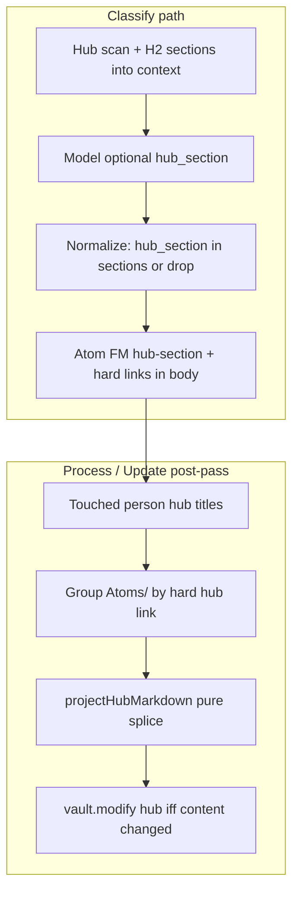

# feat: Hub projection (managed generated block in person hubs)

## Goal Capsule

**Objective.** Person hub notes stay human-owned except for one plugin-delimited region at the end that lists hard-linked atoms under the hub's existing H2 headings (or Unsorted). Routing metadata lives on the atom; the hub is a pure projection.

**Authority.** This plan > `CONCEPTS.md` after constitution unit lands > handoff design (except where session-settled decisions below supersede the handoff's `hub:` field).

**Stop when.** Opt-in setting off by default; with setting on, Process/Update regenerates only touched person hubs; human bytes outside delimiters are byte-identical across regen; no section invented; broken open delimiter aborts that hub with a surfaceable error; unit tests green; throwaway-vault smoke done. Constitution docs merged or stacked first.

**Out.** Slot facts, synthesis sections, atom dedupe/merge, non-person hubs, vault-event regen, Ask mirror schema changes, person-invite deny-list rewrite (spin-off Issue).

---

## Product Contract

### Summary

Ship a **managed hub block** — plugin-owned `<!-- atoms:generated v=1 -->…<!-- /atoms:generated -->` — that projects accumulating-list atoms into H2s the user already wrote on each person hub. Membership comes from hard person-hub links on atoms (link-prose). Optional `hub-section` frontmatter places an atom under a named H2 when that heading exists on that hub; otherwise Unsorted. Feature is **off by default** with copy that discloses vault writes into person hubs. Constitution carve-out is a **fourth write type**, not a silent rewrite of R9 “never rewrite person hub bodies.”

### Requirements

- R1. Person hubs gain at most one managed generated block, delimited by stable HTML comments (`atoms:generated` family — not overloaded `<!--linker-->`).
- R2. All human-authored bytes outside the open/close delimiters are unchanged across regenerate (both sides of the block).
- R3. If the open delimiter exists and the close is missing, abort that hub write and surface an error; do not guess an end boundary.
- R4. Block content is regenerated wholesale from current atoms; only sections with ≥1 projected atom are rendered; empty atom set yields no block (or removes an empty previous block — deterministic).
- R5. Taxonomy = existing `## ` headings on that hub note, in document order. The model never invents section names.
- R6. Classify may emit optional `hub_section` (schema) written as atom frontmatter `hub-section`. After parse, a normalizer keeps the value only when it exactly matches a section on a hard-linked person hub; otherwise the field is dropped (fail closed → Unsorted). Never invent or write H2s into the hub from the model.
- R7. Projection membership = hard person-hub link in atom link-prose (same junk-filter discipline as orbits/invite). No separate `hub:` frontmatter field. Multi-person atoms project onto every linked person hub.
- R8. Unroutable placement (missing/invalid/`hub-section` not ∈ that hub's sections) → `## Unsorted` inside the block only — never guess into a real H2.
- R9. Display line is `- [[atom title]]` only (no body snip, no invented summary prefix).
- R10. Regeneration runs after atom-filing paths that create or re-link person-hub hard links: Process, Update notes, backfill apply, and invite-accept hard-link upgrade — not on a background interval or raw vault events.
- R11. Only hubs **touched** by the run are rewritten (hubs newly hard-linked, section metadata changed, or members of the run's atom set) — not every person hub in the vault.
- R12. Settings toggle default **off**. Copy states plainly that Atoms will write a managed section into person hub notes.
- R13. Idempotent: same atoms + same hub human content → byte-identical hub file.
- R14. Capture body and daily notes remain sacred; this feature never touches them.
- R15. Constitution: document **Managed hub block** in `CONCEPTS.md`, fourth write type in `docs/architecture.md`, rationale in `docs/spec-amendments.md` — preferred as its own PR before or stacked under impl.
- R16. Ask mirror schema unchanged; linked hub bodies already mirror — projection content will appear on next vault→cloud sync (document as intended side effect / privacy note in settings or CONCEPTS).

### Actors

- A1. Vault owner — writes hub H2 taxonomy and human prose; may edit atom `hub-section` to fix placement.
- A2. Classify model — chooses optional section from listed hub H2s; must not invent names.
- A3. Plugin Process / Update / backfill / invite-accept — regenerates managed blocks when setting on.

### Key flows

- F1. Process with setting on → new/updated atoms hard-link person hubs → those hubs' managed blocks refresh.
- F2. User adds `## Gift Ideas` to hub → next classify can emit `hub_section: Gift Ideas` → next regen places atom under that H2.
- F3. User renames H2 → old `hub-section` no longer ∈ sections → atom moves to Unsorted until frontmatter corrected (fail closed).
- F4. Open delimiter without close (or close without open) → that hub skipped; Notice/error; other hubs still process.
- F5. Setting off → zero hub file writes from projection (classify may still emit hub_section into atom FM for future use — prefer still writing FM so turning on later works; no hub body mutation).

### Acceptance examples

- AE1. Hub with human prose above and below insertion point: after regen, diff outside delimiters is empty.
- AE2. Atom hard-links `[[Nichita]]`, `hub-section: Gift Ideas`, hub has that H2 → block lists `- [[Atom Title]]` under `## Gift Ideas`.
- AE3. Same atom without valid section → under `## Unsorted` only.
- AE4. Re-run Process with no atom/hub-section changes → hub file hash unchanged.
- AE5. Open delimiter without close → no write; error surfaced; human content intact.
- AE6. Setting default off; enabling requires reading disclosure copy.

### Scope boundaries

**In**

- Person hubs only; accumulating-list projection; pure splice module; classify optional section; settings; Process / Update / backfill / invite-accept hooks; constitution docs.

**Deferred for later**

- Slot facts / supersession into hub (soft death).
- Synthesis sections (Personality, Values).
- Dedupe or merge atoms in the block.
- Non-person hub projection.
- Fuzzy H2 rename migration.
- Seeding starter H2s on invite accept.

**Outside this product's identity**

- CRM profiles, AI-invented hub taxonomies, rewriting capture bodies, folder intelligence.

**Deferred to Follow-Up Work**

- Spin-off Issue: replace hardcoded `PERSON_INVITE_DENY_NAMES` with positional heuristic + user deny list (do not bundle).

### Product Contract preservation

Product Contract created in this plan from handoff + session design review. Session-settled supersessions of the handoff: drop `hub:` frontmatter (membership = hard links); display = `[[title]]` only; no H2 seed on invite; regen touched hubs only; preserve both sides of the block.

---

## Planning Contract

### Assumptions

- Discovering person hub file content for H2 parse is acceptable at context-build time (hub set is already score-capped; read bodies only for discovered hubs, not whole vault).
- Sending **H2 titles** (not hub bodies) in classify context is an acceptable privacy expansion vs titles-only hub names today.
- Plus `classifyTemplate.mjs` must stay lockstep with plugin schema/prompt when `hub_section` is added.
- `Unsorted` is a reserved block-internal heading name; if the user already has a human `## Unsorted` outside the block, projection still uses Unsorted **inside** the managed block only (no merge with human Unsorted).

### Key Technical Decisions

- KTD1. **Membership = hard person-hub links** (session-settled: user-approved — chosen over handoff `hub:` field: dual SSOT drifts; multi-person atoms need multi-hub projection). Reuse junk-filtered link-prose patterns from `membershipKeysForAtom` / `hasHardPersonHubLink`.
- KTD2. **Optional `hub-section` only on atom FM** — placement hint; not membership. Invalid/missing → Unsorted on each hub that lists the atom.
- KTD3. **Hub teaches taxonomy** — `PersonHubDetail.sections: string[]` from real `## ` lines; context message lists sections under each hub; model picks or omits.
- KTD4. **Pure splice API** — `(hubMarkdown, entries) => { ok, content } | { ok: false, error }` with deterministic entry sort (e.g. title localeCompare) for idempotency.
- KTD5. **Delimiters** — `<!-- atoms:generated v=1 -->` / `<!-- /atoms:generated -->`. Distinct from daily `<!--linker-->`. Version pin allows future format bumps.
- KTD6. **Fourth write type** — constitution names managed hub block alongside atoms, daily markers, Update-notes model surfaces. Human region remains write-never.
- KTD7. **Fail closed on section** — strip illegal `hub_section` in `checkInvariants` or a dedicated normalizer (prefer normalizer that clears field rather than full classify retry — same spirit as post-classify repair). Never create H2s in the hub from the model.
- KTD8. **H2 parser** — document-order `## ` headings; ignore `# ` (H1); ignore fenced code blocks; ignore headings inside the managed block itself when re-parsing a hub that already has a block (sections = human taxonomy outside the generated region).
- KTD9. **Settings** — `enableHubProjection: boolean` default false; Reconsider-style toggle (no separate privacy ack timestamp required — local vault write, not egress; disclosure in setDesc is enough).
- KTD10. **Touched hubs** — union of person hub titles hard-linked from atoms created/updated in the run (and invite-upgrade targets). Full vault atom scan only for those hub titles' member sets when building block content (or scan Atoms/ once and group by hub — implementer chooses; prefer single Atoms/ pass grouped by hub key when regenerating a non-empty touch set).
- KTD11. **Display** — `- [[title]]` only (session-settled: user-approved — chosen over handoff “summary — [[title]]”: no second invented string; body sacred).
- KTD12. **No H2 seed on invite** (session-settled: user-approved — chosen over seeding Gift Ideas etc.: would impose CRM taxonomy). Empty stubs project everything to Unsorted until the user writes H2s.
- KTD13. **Error surface** — Notice (or Process report line) naming the hub title and “managed block damaged — fix or remove open marker”; skip write for that hub only.

### High-Level Technical Design



**Block shape (directional):**

```markdown
<!-- atoms:generated v=1 -->
## Gift Ideas
- [[Nichita wants a big PC case]]
## Unsorted
- [[Nichita loves Snapple apple flavor]]
<!-- /atoms:generated -->
```

### Alternatives considered

| Approach | Why not |
|---|---|
| Fixed section schema (Gift Ideas, …) | Fights every vault; contradicts “hub teaches vocabulary.” |
| `hub:` + `hub-section` FM membership | Dual SSOT with link-prose; breaks multi-person. |
| Rewrite whole hub / append without delimiters | Spec amendment B rejected unbounded append into hand notes. |
| Vault-event continuous regen | Blast radius + editor conflicts; Process/Update is enough. |
| Seed H2s on invite | Imposes product taxonomy; Unsorted + teach is honest. |

### Risks and mitigations

| Risk | Mitigation |
|---|---|
| Human prose clobbered | Pure splice tests; abort open-without-close; byte-diff AE1 |
| Model invents sections | Context lists only real H2s; normalize drop unknown; never write H2 into hub from model |
| Editor conflict while hub open | Same class as other vault.modify; touched-only reduces frequency |
| Privacy: H2 titles to model | Document in CONCEPTS; titles only, not hub body |
| Ask mirror ships hub block cloudward | Document; already true for linked hub bodies |
| Plus schema drift | Sync `plus-service/src/classifyTemplate.mjs` + security-meter required fields if schema required list changes |
| Performance full Atoms/ scan | Only when touch set non-empty and setting on |

### Sequencing

1. Constitution PR (U1) — human review preferred before or as stack base.
2. Sections + parser (U2) → classify section field (U3) → pure projection (U4) → orchestrate + settings + hooks (U5).
3. Claim work per `docs/collab.md` (Issue, STATUS, draft PR) before code; no hot-file overlap with #115.

---

## Implementation Units

### U1. Constitution: Managed hub block

**Goal.** Legal carve-out so implementers are not fighting R9 / three-write-type doctrine.

**Requirements.** R15, R16, KTD6

**Dependencies.** None

**Files.**
- Modify: `CONCEPTS.md`
- Modify: `docs/architecture.md`
- Modify: `docs/spec-amendments.md`

**Approach.**
- CONCEPTS: new **Managed hub block** under People — plugin-owned region, delimiters, human outside sacred, opt-in, membership via hard links, `hub-section` placement, Unsorted, not citator chrome.
- architecture: fourth write type; privacy note (H2 titles in classify context; hub body may mirror via existing hub Ask path).
- spec-amendments: short amendment — narrow reversal of write-never hubs; capture/daily still absolute; fail-closed delimiters.
- Prefer **separate PR** titled constitution-only; impl PR depends on it or stacks.

**Test expectation:** none — docs only.

**Verification.** Human review; greppable CONCEPTS entry; architecture write-types list includes managed hub block.

---

### U2. Hub sections in context

**Goal.** `PersonHubDetail.sections` populated and visible to the model.

**Requirements.** R5, KTD3, KTD8

**Dependencies.** U1 preferred (docs), not code-blocked

**Files.**
- Modify: `src/shared/types.ts` — `PersonHubDetail.sections: string[]`
- Modify: `src/pipeline/context.ts` — parse H2s when building details; `renderStablePrefix` / hub listing
- Modify: `src/pipeline/classify.ts` — `buildContextUserMessage` person hubs section lists H2s
- Modify: `src/pipeline/enrich/people.ts` — if discovery is the natural place to attach path→read sections (or read in context provider from hub paths)
- Create: `src/pipeline/hubSections.ts` (or colocated pure parse export) — `parseHubSections(markdown): string[]`
- Modify: `test/context.test.ts`
- Create: `test/hubSections.test.ts`

**Approach.**
- Pure `parseHubSections`: strip/skip fenced code; skip lines inside existing generated delimiters if present; collect `## ` text in order; dedupe case-sensitively as written (first wins) or allow duplicates? **First occurrence wins; later duplicate H2s ignored for taxonomy list.**
- Populate `sections` on each `PersonHubDetail` during hub scan (needs hub file body — extend discovery or second pass over hub paths).
- Context message shape (directional): under each hub name, indented section bullets when non-empty; empty sections → no subsection (model sees hub name only → only Unsorted possible).
- Keep cache-stable prefix discipline: no timestamps; sections are vault-derived stable for the run.

**Execution note.** Test-first on `parseHubSections` (frontmatter, `#` vs `##`, code fences, generated-block exclusion).

**Test scenarios.**
- Happy: multiple `## ` in order → same order array.
- Edge: YAML frontmatter `##` in a string should not count if not a heading line — only line-start `## `.
- Edge: `# Title` H1 ignored.
- Edge: `##` inside fenced ``` block ignored.
- Edge: headings inside `<!-- atoms:generated -->…<!-- /atoms:generated -->` ignored when parsing taxonomy.
- Edge: empty body → `[]`.
- Integration: `buildContextUserMessage` / `renderStablePrefix` include section names for a hub with sections; empty hubs still `(none)` or name-only as today.

**Verification.** `npm test` for new/updated tests; typecheck clean.

---

### U3. Classify `hub_section` + atom frontmatter

**Goal.** Optional placement field end-to-end on atoms (not hub membership).

**Requirements.** R6, R8, KTD2, KTD7

**Dependencies.** U2

**Files.**
- Modify: `src/shared/types.ts` — `ClassificationResult.hub_section?: string` (or `hubSection` mapped at boundary)
- Modify: `src/pipeline/classify.ts` — schema, SYSTEM_PROMPT, `buildContextUserMessage`, normalize after parse, `checkInvariants` or `normalizeHubSection`
- Modify: `src/pipeline/render.ts` — `buildAtomMarkdown` writes `hub-section:` when present
- Modify: `src/pipeline/refreshAtoms.ts` — preserve/rewrite `hub-section` on FM rebuild when model returns it / existing FM
- Modify: `plus-service/src/classifyTemplate.mjs` — schema + prompt lockstep
- Modify: `test/classify.test.ts`, `test/render.test.ts`
- Modify: `plus-service/test/security-meter.test.mjs` if required-fields assertion needs update

**Approach.**
- Schema: optional string `hub_section` (JSON); not in `required[]`; `additionalProperties: false` still holds.
- Prompt: only emit when capture is person-list/accumulating fact AND section exactly matches a listed H2 for a linked person hub; never invent; omit when unsure.
- Normalize: if `hub_section` set, require atom verdict; if no person hub in links matches a hub that has that section name, **drop** field (do not invariant-fail whole classify — avoid retry storms). Document drop in code comment.
- FM key: `hub-section: Gift Ideas` (Obsidian-friendly).
- Refresh/refile: keep existing `hub-section` unless polish path supplies a new classification that includes the field.

**Execution note.** Test-first on normalize + FM round-trip before wiring Plus template.

**Test scenarios.**
- Happy: section ∈ hub sections + person link → FM contains hub-section.
- Happy: omit when empty/uncertain → no FM key.
- Edge: hallucinated section → dropped; classify still ok.
- Edge: non-atom verdict with hub_section → drop or invariant fail (prefer drop).
- Edge: `buildAtomMarkdown` omits key when absent; present when set.
- Contract: plugin schema and plus-service template both include optional hub_section.

**Verification.** Plugin + plus-service tests for schema contract; no accidental required-field break for Plus.

---

### U4. Pure hub projection splice

**Goal.** Deterministic managed-block render and splice with fail-closed delimiters.

**Requirements.** R1–R4, R8, R9, R13, KTD4, KTD5, KTD11

**Dependencies.** None (can parallel U2/U3)

**Files.**
- Create: `src/pipeline/hubProjection.ts`
- Create: `test/hubProjection.test.ts`

**Approach.**
- Types: `HubProjectionEntry { title: string; section?: string }`; section undefined → Unsorted.
- `renderGeneratedBlock(entries, hubSections: string[]): string` — group by section; only known hub sections as named H2s; unknown → Unsorted; sort titles within section; section order = hubSections order then Unsorted last if needed; skip empty groups.
- `projectHubMarkdown(hubContent, entries, hubSections): { ok: true; content: string } | { ok: false; reason: "unclosed-generated-block" }`
  - Find open/close; unclosed → error.
  - If both missing and entries empty → content unchanged.
  - If both missing and entries non-empty → append block at EOF (ensure trailing newline rules match repo).
  - If both present → replace interior only; preserve prefix before open and suffix after close **byte-exact**.
  - If entries empty and block present → remove block and clean extra blank lines deterministically.
- Idempotent: `projectHubMarkdown(projectHubMarkdown(x).content, same).content ===`.

**Execution note.** Test-first; this is the correctness core for human-byte safety.

**Test scenarios.**
- Happy: no block + entries → block appended; human prefix unchanged.
- Happy: existing block replaced; prose above and **below** preserved byte-exact.
- Happy: section grouping order follows hubSections; Unsorted last.
- Happy: display lines `- [[Title]]` only.
- Edge: empty entries removes block; file ends cleanly.
- Edge: open without close → ok false; original unused (caller must not write).
- Edge: only close marker → treat as no managed block or error? **Prefer error if close without open** (ambiguous damage).
- Edge: idempotent second pass identical.
- Edge: titles sorted stably for hash stability.
- Edge: entry section not in hubSections → Unsorted.

**Verification.** Full vitest file green; no vault I/O in unit.

---

### U5. Orchestration, settings, Process/Update hooks

**Goal.** Wire projection into the live pipeline behind default-off setting.

**Requirements.** R10–R14, KTD1, KTD9, KTD10, KTD12, KTD13, AE1–AE6

**Dependencies.** U2, U3, U4

**Files.**
- Modify: `src/shared/types.ts` — `enableHubProjection` + DEFAULT false
- Modify: `src/settings/settings.ts` — toggle + disclosure copy
- Modify: `src/pipeline/write.ts` — post-success hook when setting on
- Modify: `src/pipeline/refreshAtoms.ts` — post-success hook when setting on
- Modify: `src/pipeline/backfill.ts` and/or `src/plugin/main.ts` backfill apply success — same hook with touched hubs from applied atoms
- Modify: `src/home/atomsHomeView.ts` — after invite accept hard-link upgrade, regen that hub if setting on
- Modify: `src/plugin/main.ts` only if settings/gates must live there (prefer pipeline modules)
- Create: `src/pipeline/runHubProjection.ts` (name flexible) — load atoms folder, membership group, call pure project, `vault.modify` if changed
- Modify: `test/personInvite.test.ts` if needed; add `test/runHubProjection.test.ts` with mock vault or pure plan helper
- Optional: extend Process Notice with hub projection error counts

**Approach.**
- Export something like `runHubProjectionForHubs({ app, settings, hubTitles, personHubDetails })`.
- Gate: `settings.enableHubProjection !== true` → no-op.
- Membership: scan `atomFolder` markdown; parse link-prose; junk-filter; match canonical person hub titles (case-insensitive title match consistent with enrich).
- Read `hub-section` from atom FM (obsidian parseFrontMatter or lightweight YAML).
- For each touched hub title: load hub file by discovery path; parse sections; build entries; `projectHubMarkdown`; on failure Notice + continue; on success write only if `content !== previous`.
- Touched set: from write path results (new atom paths + links) and refresh updated paths; invite path: accepted hub title.
- Do **not** change `formatPersonNoteMarkdown` to seed H2s (KTD12).
- Settings copy (directional): name “Hub projection”; desc “When on, Process / Update / backfill write a managed section at the end of person hub notes listing linked atoms under your existing headings. Your text outside the markers is never changed. If Ask mirror is on, updated hub notes sync vault→cloud like other linked hubs. Off by default.”

**Execution note.** Prefer a pure “plan hub writes” function tested without Obsidian where possible; thin vault adapter.

**Test scenarios.**
- Happy: setting off → planner returns no writes.
- Happy: one atom hard-links hub + section → planned content contains block + wikilink title.
- Edge: damaged hub → error result, no modify planned.
- Edge: content unchanged → skip modify (idempotent).
- Integration-style: multi-hub atom appears in both hub plans.
- Settings default false in DEFAULT_SETTINGS.

**Verification.** `npm test`; `npm run typecheck` (or repo equivalent); throwaway vault smoke AE1–AE5 with setting on — **never personal Remote Vault** (`AGENTS.md`).

---

## Verification Contract

| Gate | Command / action |
|---|---|
| Unit | `npm test` (focus `hubSections`, `hubProjection`, `classify`, `render`, `context`, projection runner) |
| Types | `npm run typecheck` if present; else `npx tsc --noEmit` per repo scripts |
| Plus lockstep | `cd plus-service && npm test` when schema/prompt touched |
| Human | Constitution PR review before relying on carve-out in product |
| Vault smoke | `test_vault/` or demo vault only: hub with prose both sides; Process; diff outside delimiters empty; Unsorted path; broken delimiter Notice |

---

## Definition of Done

- [ ] U1 constitution merged or explicitly stacked under impl PR with human ack
- [ ] All U2–U5 tests listed above exist and pass
- [ ] Setting default off; disclosure copy present
- [ ] AE1–AE6 satisfied on throwaway vault
- [ ] No `hub:` FM field introduced
- [ ] No H2 seed on invite
- [ ] Spin-off deny-list Issue filed separately (not in this PR)
- [ ] STATUS claim + draft PR per collab; PR body `Closes #<issue>` when shipping
- [ ] PR evidence: screenshots under `docs/qa/screenshots/hub-projection/` or N/A if pure logic-only — UI setting toggle warrants a settings screenshot

---

## Open Questions

| ID | Question | Status |
|---|---|---|
| OQ1 | Refresh polish: should Update notes re-ask model for `hub_section` or only preserve FM? | **Deferred** — v1 preserve existing `hub-section`; optional re-classify can fill when polish already reclassifies links |
| OQ2 | Should invite-accept always trigger regen when setting on? | **Resolved in plan** — yes when hard links upgrade |
| OQ3 | Close-without-open delimiter | **Resolved** — error, same family as unclosed |
| OQ4 | Enforce “accumulating-list only” at projection time (tag filter) vs classify prompt only? | **Deferred** — v1 prompt guidance only; any hard-linked atom with optional hub-section may project (list dumps and person facts both). Narrow later if noise. |

---

## Sources and Research

- Handoff: hub projection (2026-07-28) + session world-class call-outs
- Code: `PersonHubDetail`, `context.ts`, `classify.ts`, `render.ts` `buildAtomMarkdown`, `write.ts`, `refreshAtoms.ts`, `personInvite.ts`, `entityOrbitIndex.ts`, `askMirror.ts` hub kind, `plus-service/src/classifyTemplate.mjs`
- Doctrine: `docs/architecture.md` three write types; `docs/spec-amendments.md` §B cut append; home plan R9 never rewrite hub bodies; `docs/solutions/features/person-hub-invite-add-name.md`; `docs/solutions/features/entity-orbits-hard-keys-and-also-about.md`
- External research: skipped — local marker/settings/classify patterns sufficient; greenfield is delimiter splice analogous to daily sentinels

---

## System-Wide Impact

- **Classify cache prefix** grows when hubs gain sections (expected cache miss churn once).
- **Ask mirror** uploads updated hub bodies for linked hubs after projection.
- **Multiplayer:** hot files `src/pipeline/*`, `src/shared/types.ts`, `src/settings/settings.ts` — claim before impl; no overlap with #115 infra.
- **Mobile:** same Process/Update path; no platform-only product.
