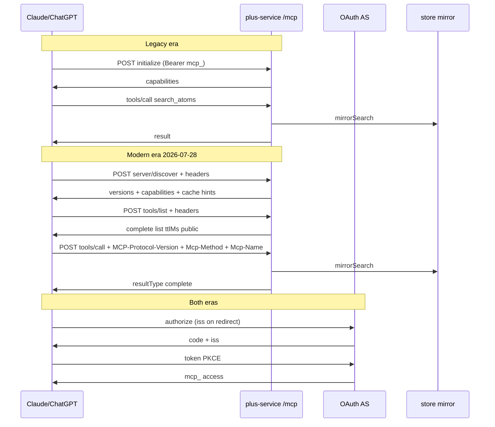

# Ask MCP — 2026-07-28 dual-era protocol + Claude connectors directory

**Lane:** full feature (auth + multi-unit protocol cutover; no new Ask product surface)  
**Scope lock (session):** protocol readiness + dual-era support **now** + connectors-directory **in ship bar** (Bar B = pack + submit track, not “listing live”). No MCP Apps, MRTR product UX, Tasks, enterprise-managed auth, or tunnels.

---

## Goal Capsule

**Objective.** Keep Atoms Ask (`https://plus.tryatoms.app/mcp`) working for today’s Claude/ChatGPT connectors while adding **MCP 2026-07-28** dual-era support, era-neutral auth hardening, and a complete **Claude connectors directory** submission pack so users can add Atoms without pasting a custom URL.

**Authority.** Constitution (body sacred, vault→cloud mirror only, no in-plugin chat) > original Ask plans (#112 / #119) > this plan > MCP/Claude external docs.

**Stop conditions (two bars).**

**Bar A — protocol (merge + Fly deploy):**
- Dual-era CI: legacy pin **`2025-03-26`** **and** modern `2026-07-28` (discover + tools/list + tools/call, no initialize) both green.
- Auth: RFC 9207 `iss` on **all** client redirects; CIMD flags correct; DCR kept + register RL asserted.
- ChatGPT `securitySchemes` structural assert green **in the same release artifact** as the dual-era handler (U2+U3+U4 together — no U2-only prod deploy).
- Post-deploy: scripted **public HTTPS** modern probe against `plus.tryatoms.app/mcp` + Claude/ChatGPT custom-connector regression.
- Fly previous-image rollback documented.
- **Not** in Bar A: MCP Apps, MRTR product, Tasks, dropping DCR, `legacy: 'reject'`, U5 logging, directory portal approval.

**Bar B — directory (pack + submit track):**
- Pack complete; KTD15 done (write scope/consent + reviewer-completable apply); live Inspector + Claude exercise of **every** tool including write→applied→fetch; privacy/docs checklist; portal submit.
- Exit: **Approved**, or **Rejected with remediation owner**, or **Blocked** on named external prerequisites (org role, privacy URL, icon) — not “submit attempted” alone.

---

## Product Contract

### Summary

MCP 2026-07-28 moves the ecosystem to a **stateless request/response core** (no initialize/sessions), required routing headers, cacheable list results, and harder OAuth. Atoms Ask is already stateless Streamable HTTP — the gap is **SDK/era dual-support**, **auth polish**, **directory listing quality**, and **submission ops**, not a server rewrite.

### Problem frame

Claude is rolling out MCP 2026-07-28 support. A legacy-only server will eventually break; a modern-only server breaks current connectors. Users still discover Ask via “paste custom connector URL.” Directory listing removes that friction and matches how other MCP products ship.

### Actors

| ID | Actor |
|----|--------|
| A1 | Plus user on Claude (custom connector today; directory listing target) |
| A2 | Plus user on ChatGPT (same `/mcp` URL) |
| A3 | Atoms plus-service (MCP + OAuth AS + mirror) |
| A4 | Anthropic connectors directory / review |
| A5 | DIY self-host operator (same protocol; docs stay accurate) |

### Requirements

| ID | Requirement |
|----|-------------|
| R1 | Same public URL `{plusBase}/mcp` remains the only product MCP endpoint for Claude and ChatGPT |
| R2 | **Legacy-era** clients that use initialize + Streamable JSON continue to work (no forced cutover) |
| R3 | **Modern-era** `2026-07-28` clients work without initialize (discover + tools/list + tools/call) |
| R4 | OAuth AS emits RFC 9207 `iss` on authorize responses and advertises support in metadata |
| R5 | CIMD remains preferred: `client_id_metadata_document_supported: true` and `token_endpoint_auth_methods_supported` includes `none`; DCR stays for back-compat |
| R6 | Tool catalog meets directory bar: stable titles, readOnly/destructive hints, split read vs write tools, ≤64-char names |
| R7 | Directory submission pack exists in-repo (checklist, privacy/docs URLs, support path, icon/branding, test-account steps) and is exercised |
| R8 | No change to body-sacred / outbox semantics; no vault FS from MCP; chat stays in Claude/ChatGPT |
| R9 | Optional ops visibility: attribute MCP traffic by method/tool without logging args/results (nice-to-have; not Bar A) |

### Flows

| ID | Flow |
|----|------|
| F1 | Existing Claude custom connector → OAuth → search/fetch (regression) |
| F2 | Existing ChatGPT connector → same (regression) |
| F3 | Modern client / Inspector on `2026-07-28` → discover → tools/list → tools/call without initialize |
| F4 | Directory: reviewer uses published listing + test account → OAuth → tools succeed |

### Acceptance examples

| ID | Example |
|----|---------|
| AE1 | CI: legacy init + `tools/call search_atoms` still passes with Bearer `mcp_` |
| AE2 | CI: modern `tools/call` with `MCP-Protocol-Version: 2026-07-28` + required headers succeeds without prior initialize (list cache fields: see AE6) |
| AE3 | OAuth authorize redirect (success **and** `access_denied`) includes `iss` byte-identical to metadata `issuer`; metadata has `authorization_response_iss_parameter_supported: true` **and** still has `client_id_metadata_document_supported: true` + `token_endpoint_auth_methods_supported` including `none` |
| AE4 | Unauth `/mcp` and `sess_` bearer still 401 + `WWW-Authenticate` resource_metadata (no auth regression either era) |
| AE5a | Bar A dogfood: Claude **and** ChatGPT custom connectors green after Fly deploy (legacy path) |
| AE5b | Bar B: directory checklist + evidence under `docs/qa/`; every **listed** tool exercised with recorded success |
| AE6 | Modern CI: `POST tools/list` with `MCP-Protocol-Version: 2026-07-28` + required headers, **no** prior initialize → 200 complete list with `ttlMs` (minutes-scale, not 0) and `cacheScope: "public"` |
| AE7 | Modern CI: `server/discover` without initialize returns supported versions including `2026-07-28` (+ cache hints if on wire) |
| AE8 | U4: tools/list every tool has non-empty `title`, boolean readOnly/destructive hints; write tools `destructiveHint: true`; ChatGPT `securitySchemes` on every tool |
| AE9 | Post-deploy public HTTPS: modern headers path against `https://plus.tryatoms.app/mcp` succeeds (discover or list + call) with smoke token |

### Scope boundaries

**In**
- plus-service MCP transport dual-era (U2+U3+U4 as one release train)
- OAuth `iss` + DCR `application_type` accept + register RL hard assert
- Tool titles/hints + ChatGPT securitySchemes survival (U4); keep existing tool names
- Optional request logging (U5 / R9) — **not** Bar A/B
- Directory pack + submit track (U6 / Bar B)
- Runbook / self-host protocol notes + Fly rollback

**Out**
- MCP Apps interactive UI
- MRTR confirm UX on create/continue
- Tasks extension
- Enterprise-managed auth / MCP tunnels
- Dropping DCR or rejecting legacy clients
- Full product metering / billing of MCP calls
- New MCP tools or in-plugin chat
- Re-architecting mirror/outbox

### Deferred to follow-up

- MRTR write confirmation when Claude modern UX is common
- MCP Apps atom picker
- `legacy: 'reject'` after traffic proves modern-only
- DCR removal after ≥12-month deprecation window + CIMD-only traffic; DCR client GC / table cap
- Per-tool rate limits / Plus MCP usage dashboard
- (none for write scope — KTD15 pulls scope/consent match + reviewer apply path into Bar B, not deferred)

---

## Planning Contract

### Product Contract preservation

Bootstrap plan (no prior requirements-only artifact). Session-settled scope: protocol + directory; dual-support now; directory in ship bar.

### Assumptions

- Claude directory will still accept dual-era Streamable HTTP + OAuth during rollout; exact required protocol pin is not documented — dual-era is the safe posture.
- TS SDK **v2** (`@modelcontextprotocol/server` + dual-era `createMcpHandler`) is the intended implementation vehicle; if codemod/API differs at implement time, preserve dual-era behavior and document the actual packages.
- Tool catalog is identical for all entitled users → `cacheScope: "public"` is acceptable for `tools/list` **only while** list JSON is byte-stable across tenants and contains no user fields (switch to `private` if scope-split or per-user tools land).
- ChatGPT `securitySchemes` injection may need reimplementation if private `_requestHandlers` wrap breaks on SDK upgrade — behavior must survive; tests fail closed if schemes missing.
- U5 logging is optional follow-through after Bar A; directory (Bar B) is independent once protocol is live.

### Key technical decisions

| ID | Decision | Rationale |
|----|----------|-----------|
| KTD1 | **Dual-era on one endpoint** via SDK v2 `createMcpHandler` (or equivalent) with **legacy stateless** default — never modern-only until explicitly approved | Claude support “rolling out soon”; current connectors are legacy |
| KTD2 | **Auth harden first or in parallel**, independent of era: emit `iss` + metadata flag; keep CIMD+DCR | Era-neutral; clients that validate `iss` will start rejecting missing values |
| KTD3 | Prefer **SDK dual-era entry** (`createMcpHandler` + node adapter) for headers/discover/envelopes — not bare `McpServer` + hand transport | v2 does not put 2026-07-28 on the wire without that entry; app owns tools + auth gate only |
| KTD4 | Keep **Bearer gate before MCP** (401 + PRM) for both eras; reject `sess_` on `/mcp`; never let SDK handler run tools unauthenticated | Existing Claude/ChatGPT discovery + tenant isolation |
| KTD5 | **Do not** drop DCR or auto-register-on-authorize allowlist behavior in this plan; DCR client GC is follow-up (document, do not expand auto-register) | Directory scale prefers CIMD, but ChatGPT/Claude still use mixed paths |
| KTD6 | Directory bar: add **title + hints** on tools; do not rename tools (`search_atoms`, etc.) | Avoid breaking prompt memory / docs; names already ≤64 and split read/write |
| KTD7 | Optional logging: headers when present else top-level method + `params.name` only; opaque account id or HMAC(email, server secret) — never raw email, token, args, results | R9 without metering product or PII dumps |
| KTD8 | Research SSOT: `docs/research/mcp-2026-07-28-dual-protocol.md` | External SEPs/SDK migration condensed for implementers |
| KTD9 | Tenant email reaches tools via `authInfo.extra.email` after one `accountFromMcpToken` — no global state, no second token resolve in factory | Preserve multi-tenant isolation under dual-era factory |
| KTD10 | **cacheHints on `McpServer` constructor options**, not on `createMcpHandler` options (handler options only: `legacy`, `responseMode`, …). Default modern encode is `ttlMs:0` / `private` if omitted — AE6 would soft-fail | Runtime probe: wrong option site is silently ignored |
| KTD11 | **Legacy wire format:** verify whether `createMcpHandler` legacy path can keep JSON-only (`enableJsonResponse`) or defaults to SSE. If SSE-only: either dogfood Claude/ChatGPT with `Accept` both + assert SSE-framed JSON-RPC, **or** dual mount (legacy hand transport JSON + modern `createMcpHandler` with `legacy:'reject'`) — ban is on *modern* hand transport only | KTD10 must not claim `responseMode:'json'` equals today’s legacy JSON-only |
| KTD12 | Per-request tenant: after Bearer gate set `req.auth` / fetch `authInfo` with `extra.email` so factory/tools see it; **fail closed** if email missing; no module-scope email close-over | `toNodeHandler` only forwards `req.auth` unless fetch options pass `authInfo` |
| KTD13 | Authenticated `/mcp` HTTP responses: `Cache-Control: private, no-store` (or equivalent) even when MCP `cacheScope` is `public` | MCP public ≠ HTTP public on Bearer responses |
| KTD14 | Bar A release train = **U2+U3+U4** same artifact; no production dual-era deploy without U4 schemes assert | ChatGPT shares `/mcp`; private wrap dies on v2 |
| KTD15 | **Write tools stay in the directory listing** (session-settled: user-directed — chosen over omit-writes / defer-Bar-B: product needs create/continue in Ask). Bar B therefore **must** ship both: (1) OAuth/consent/schemes that name write/outbox (not `atoms:read`-only chrome on write tools), and (2) a **reviewer-completable** path so `create_atom`/`continue_atom` can reach a successful applied+fetchable outcome during directory review (human vault window and/or test harness that applies outbox + mirrors) | Directory scale + Anthropic functional review; underclaim + permanent-pending both fail review |

### High-level technical design

**App boundary (directional):** HTTP server owns CORS, OPTIONS, body size cap (same as today before parse), Bearer + entitlement, `Cache-Control` no-store, then bridges via `toNodeHandler(req,res,parsedBody)` after setting `req.auth = { token, clientId, scopes, extra: { email } }` **or** `handler.fetch(webReq, { authInfo, parsedBody })`. Factory: `new McpServer(info, { instructions, cacheHints })` + register tools; tools read `ctx.authInfo.extra.email` and fail closed if missing. Prefer long-lived `createMcpHandler` at startup, not per-request construction.

### Sequencing

1. U1 auth `iss` (shippable alone)  
2. **Spike (pre-U2 merge):** authInfo threading + legacy Accept/Content-Type behavior on v2 dual-era entry  
3. U2 + U3 + U4 as **one Bar A release train** (parallelize after spike; single Fly deploy)  
4. Post-deploy AE5a + AE9; rollback path ready  
5. U5 optional anytime after train  
6. U6 write scope/consent (Bar B code) after Bar A stable  
7. U7 directory pack + reviewer apply path + submit (Bar B ops)

### Risks

| Risk | Mitigation |
|------|------------|
| SDK v2 breaks ChatGPT `securitySchemes` | U4 fail-closed structural assert; same artifact as U2 (KTD14) |
| Legacy wire becomes SSE under createMcpHandler | KTD11 spike; dogfood Accept both or dual-mount JSON legacy |
| Dual-era default still legacy-only on wire | AE6/AE7/AE9 modern probes merge + post-deploy |
| Directory rejects write-via-outbox / scope underclaim | KTD15 before submit; honest listing; reviewer-completable write path or omit writes |
| Fly multi-instance session affinity | Stateless; GET 405; refuse session IDs |
| Proxies strip `Mcp-*` headers | AE9 public HTTPS modern probe after every deploy |
| Claude product modern not available | CI AE6/AE7 + AE9 scripted; track product modern dogfood as residual with owner — do not waive AE9 |

### Sources and research

- Spec: https://modelcontextprotocol.io/specification/2026-07-28  
- Changelog: https://modelcontextprotocol.io/specification/2026-07-28/changelog  
- MCP blog: https://blog.modelcontextprotocol.io/posts/2026-07-28/  
- Claude: https://claude.com/blog/bringing-mcp-2026-07-28-to-claude  
- Directory: https://claude.com/docs/connectors/building/submission  
- Condensed: `docs/research/mcp-2026-07-28-dual-protocol.md`  
- Prior: `docs/plans/2026-07-27-001-feat-ask-brain-remote-mcp-plan.md`, `docs/plans/2026-07-27-006-feat-ask-chatgpt-mcp-plan.md`  
- Code: `plus-service/src/mcp/handler.mjs`, `plus-service/src/mcp/tools.mjs`, `plus-service/src/oauth/*`

---

## Implementation Units

### U1. OAuth AS — RFC 9207 `iss` + metadata

**Goal.** Every OAuth redirect back to the client includes `iss`; AS metadata advertises support; DCR accepts `application_type` without treating it as redirect policy.

**Requirements.** R4, R5, AE3, AE4  

**Dependencies.** None  

**Files.**
- `plus-service/src/oauth/routes.mjs` (modify)
- `plus-service/src/oauth/metadata.mjs` (modify)
- `plus-service/test/http-ask-oauth.test.mjs` (modify)
- `plus-service/test/oauth-redirect.test.mjs` (modify if needed)

**Approach.**
- Helper appends `iss=issuerUrl(publicBaseUrl)` on **every** 302 to `redirect_uri` (code success **and** `error=access_denied` / other client redirects). Never put `iss` on HTML error pages that do not redirect to the client.
- Set `authorization_response_iss_parameter_supported: true` only when both success and error redirect paths emit `iss`.
- `iss` must be **byte-identical** to metadata `issuer` (no slash/scheme normalize games).
- DCR: accept optional `application_type` (`native` \| `web`) and store/ignore only; **redirect authorization remains solely** `isAllowedRedirectUri` — never branch allowlist on client-supplied `application_type`.
- Keep CIMD flags + DCR; do not expand auto-register-on-authorize; DCR client GC is explicit follow-up non-goal.

**Test scenarios.**
- Happy: authorize success → Location has `iss` === metadata.issuer.
- Error: consent deny / access_denied redirect also has same `iss`.
- Metadata: flag true + CIMD + `none` still present (AE3).
- DCR: `application_type: "native"` + allowlisted redirect OK; unknown `application_type` OK; evil redirect rejected; **register flood → 429** (hard assert, not optional).
- Inventory: every 302 to `redirect_uri` uses `iss` helper (not only success + access_denied).
- Regression: unauth `/mcp` still 401 + resource_metadata.

**Verification.** `npm test` in `plus-service` green; manual OAuth once on staging/prod after deploy.

---

### U2. Dual-era MCP handler (SDK v2 / createMcpHandler)

**Goal.** One `/mcp` endpoint serves legacy initialize clients and modern `2026-07-28` clients via SDK dual-era APIs; preserve Bearer gate and tool registration.

**Requirements.** R1, R2, R3, R8, AE1, AE2, AE4, AE6, AE7, F1, F3  

**Dependencies.** U1 preferred; **must ship with U3+U4** (KTD14)  

**Files.**
- `plus-service/package.json` / `package-lock.json` — add `@modelcontextprotocol/server` + `@modelcontextprotocol/node`; **remove** v1 sdk (no dual-install)
- `plus-service/src/mcp/handler.mjs` (primary)
- `plus-service/src/mcp/tools.mjs` (registration/ctx + imports)
- `plus-service/src/mcp/instructions.mjs` (if needed)
- `plus-service/src/server.mjs` (mount)
- `plus-service/Dockerfile` (if Node bump)
- Tests (with U3)

**Approach.**
- **Spike first (KTD11/KTD12):** confirm legacy Accept/Content-Type on dual-era entry; confirm `req.auth` / fetch `authInfo` reaches factory.
- Mount: body size cap → Bearer + reject `sess_` → set `req.auth.extra.email` → `toNodeHandler` with parsedBody → HTTP `Cache-Control: private, no-store` (KTD13).
- `createMcpHandler(factory, { legacy: 'stateless', responseMode: 'json' })` for modern JSON; **do not** put `cacheHints` on handler options.
- Factory: `new McpServer({ name, version }, { instructions: ASK_MCP_INSTRUCTIONS, cacheHints: { 'tools/list': { ttlMs: 300000, cacheScope: 'public' }, 'server/discover': { ttlMs: 300000, cacheScope: 'public' } } })`; register tools; refuse tools if `extra.email` missing.
- If legacy cannot stay JSON-only under createMcpHandler, apply KTD11 option B (legacy hand JSON transport + modern handler `legacy:'reject'`) — only exception to “no hand transport.”
- GET/DELETE 405; long-lived handler preferred; R8 unchanged; no MRTR product.

**Execution note.** U2+U3+U4 one release train; Fly deploy only after all three green + rollback note.

**Patterns.** Plan 001 KTD20 stateless posture via dual-era factory.

**Test scenarios.** See U3; plus fail-closed missing email.

**Verification.** Local dual-era green; middleware wraps SDK; AE9 after deploy.

---

### U3. Dual-era automated test matrix

**Goal.** CI proves both eras; pin versions explicitly so SDK default drift is visible. Modern suite is **merge-blocking** (not optional smoke).

**Requirements.** R2, R3, AE1, AE2, AE4, AE6, AE7, F1, F2, F3  

**Dependencies.** U2 (same train as U4)  

**Files.**
- `plus-service/test/http-ask-oauth.test.mjs` (legacy pin `2025-03-26`; Content-Type per KTD11 outcome)
- `plus-service/test/mcp-modern-era.test.mjs` (create — hard gate)
- `plus-service/test/http-ask-mcp.test.mjs` (imports + 401)
- `plus-service/test/mcp-unmisreadable-shape.test.mjs` (if needed)

**Approach.**
- Legacy: `2025-03-26` initialize + tools/call; assert response shape per KTD11 spike (JSON **or** SSE-framed — do not hardcode JSON if spike proves SSE).
- Modern: no initialize; headers + `_meta`; **discover (AE7)**; tools/list (AE6); tools/call; stable list order; multi-tenant **interleaved** isolation; missing email fail-closed if testable.
- Auth: missing Authorization, `sess_`, expired/invalid `mcp_` → 401 + resource_metadata.
- Prefer unsupported version → `-32022` with `supported` including `2026-07-28`.
- OPTIONS/CORS + GET 405 + body oversize still rejected (adapter continuity).

**Test scenarios.**
- Legacy search isolation + response Content-Type/Accept contract from spike.
- Modern discover without initialize (AE7).
- Modern tools/list (AE6) + tools/call without initialize.
- Two tenants interleaved cannot cross-read.
- Auth matrix both eras.

**Verification.** Full suite CI; modern file blocks merge.

---

### U4. Tool catalog — directory metadata + ChatGPT list shape

**Goal.** Every tool has directory-grade `title` + `readOnlyHint`/`destructiveHint` (and annotations SDK expects); ChatGPT OAuth UI still sees security schemes on tools/list.

**Requirements.** R6, R8, F2, AE8  

**Dependencies.** U2 (same Bar A train)  

**Files.**
- `plus-service/src/mcp/tools.mjs` (modify)
- `plus-service/src/mcp/handler.mjs` (if schemes injection moves)
- `plus-service/test/http-ask-oauth.test.mjs` (modify)
- `plus-service/test/mcp-unmisreadable-shape.test.mjs` (modify)

**Approach.**
- Titles without renaming names; prefer `z.object` when touching tools.
- Hints: read tools `readOnlyHint: true`; **`create_atom` / `continue_atom` / `cancel_pending` → `destructiveHint: true`** (outbox mutates server state / eventual vault — not “non-destructive because not FS”).
- Spike v2 list: schemes via supported path or `_meta`; **fail closed** structural assert every tool has schemes (AE8).
- Deterministic order; R8 unchanged.

**Test scenarios.**
- AE8 titles + hints + schemes on every tool.
- Write tools assert `destructiveHint: true`.
- Instructions: write = queue not instant vault write.

**Verification.** Assertions green; ChatGPT tools/list usable in AE5a dogfood.

---

### U5. Lightweight MCP request logging (optional)

**Goal.** Ops can see method/tool volume without body dumps or a metering product. **Not required for Bar A or Bar B.**

**Requirements.** R9  

**Dependencies.** U2  

**Files.**
- `plus-service/src/mcp/handler.mjs` (or thin `plus-service/src/mcp/accessLog.mjs` create)
- `plus-service/test/` (unit for redaction/header pick)

**Approach.**
- After auth: structured one-liner — era/version if known; prefer `Mcp-Method`/`Mcp-Name` headers; else JSON-RPC top-level `method` + `params.name` only (allowlisted paths, max length). Legacy traffic has no headers — body fallback is required for useful ops during rollout.
- Account: opaque id or `HMAC-SHA256(email, server secret)` truncated — never raw/plain-hash email.
- Denylist: Authorization, code, token, arguments, result, content. No Plus meter coupling.

**Test scenarios.**
- Prefers headers when both present; legacy body path still logs method+name.
- Forged body with secrets must not appear in log payload.

**Verification.** Local request shows expected fields; optional prod spot-check.

---

### U6. Write scope + consent honesty for directory (Bar B)

**Goal.** OAuth and tool schemes stop advertising write tools as `atoms:read`-only so directory listing can include create/continue honestly (KTD15 part 1).

**Requirements.** KTD15, R7  

**Dependencies.** Bar A stable (U1–U4); can parallel U7 pack prep  

**Files.**
- `plus-service/src/oauth/constants.mjs` (scopes)
- `plus-service/src/oauth/routes.mjs` / `html.mjs` / `metadata.mjs` (consent + metadata scopes)
- `plus-service/src/mcp/handler.mjs` / `tools.mjs` (per-tool schemes; write tools require write/outbox scope)
- `plus-service/src/store/*` mcp token scope storage if needed
- `plus-service/test/http-ask-oauth.test.mjs` + write-path tests
- Settings/privacy copy if consent strings surface in plugin

**Approach.**
- Add scope (name at implement: prefer `atoms:write` or `atoms:outbox` — one clear write/outbox grant).
- Token mint + refresh preserve scopes; consent checkbox/copy lists search/fetch **and** queue new atoms.
- tools/list / securitySchemes: read tools → read scope; write tools → write scope (fail closed if token lacks write).
- Existing Plus users: on next consent or refresh path, ensure directory connect can request both scopes (document re-consent if required).
- Do not change outbox vault semantics (R8).

**Test scenarios.**
- Read-only token: search OK; create_atom rejected with clear error.
- Read+write token: create_atom enqueues; schemes on list match.
- Consent/metadata advertise both scopes.
- ChatGPT schemes structural assert still green.

**Verification.** CI green; dogfood OAuth shows write grant before U7 submit.

---

### U7. Claude connectors directory pack + dogfood + submit (Bar B)

**Goal.** In-repo submission pack + real dogfood evidence; portal submission when org access allows. Does **not** block Bar A protocol deploy.

**Requirements.** R7, AE5b, F4, KTD15  

**Dependencies.** Bar A stable (U1–U4 deployed + AE5a + AE9); **U6** write scope live; U5 optional  

**Files.**
- `docs/runbooks/atoms-ask-connectors-directory.md` (create)
- `docs/runbooks/atoms-plus-prod.md` (modify — protocol matrix + Fly rollback)
- `docs/ask-self-host.md` (dual-era note)
- `docs/qa/screenshots/ask-mcp-directory/` (evidence)
- Branding asset; live privacy/docs URLs verified

**Approach.**
- Depends on **U6** for scope/consent honesty (already live).
- **Reviewer-completable apply (KTD15 part 2):** test-account runbook with scheduled human vault operator **or** harness that claims outbox → applies → mirror upsert so `fetch_atom` succeeds in-session. Permanent-pending alone ≠ tool success.
- Pack checklist: HTTPS, OAuth CIMD, tool sync, listing (reads **and** writes), privacy/docs, support, icon, test-account steps including write apply window, compliance acks.
- Listing copy: mirror-not-vault; write = queue until vault applies; model I/O disclosure. No secrets in-repo.
- Pre-submit: every tool including write→applied→fetch; CIMD path proof; register RL check.
- Exit until Approved / Rejected+remediation / external Blocked.

**Test expectation:** none automated for portal — manual QA + runbook.

**Verification.** AE5b evidence; exit state recorded with owner.

---

## Verification Contract

| Gate | Command / action | Bar |
|------|------------------|-----|
| Unit/HTTP | `cd plus-service && npm test` (modern-era + AE8 schemes) | A |
| Local dual-era | Legacy + modern discover/list/call against local + seed | A |
| OAuth | iss success+all error redirects; DCR flood 429; live magic-link | A |
| Deploy | U2+U3+U4 artifact only; `fly deploy …`; previous-image rollback known | A |
| AE5a | Claude + ChatGPT custom connectors post-deploy | A |
| AE9 | Public HTTPS modern header probe on `plus.tryatoms.app/mcp` | A |
| Ops log (optional) | method/tool only; no Authorization/args | U5 |
| Write scope | U6 CI + dogfood OAuth shows write grant | B |
| Directory | U7 pack + AE5b + reviewer write→applied→fetch + exit state | B |

Plugin tests only if Settings change.

---

## Definition of Done

**Bar A (protocol)**
- [ ] U1 + **U2+U3+U4 same release** deployed to `plus.tryatoms.app`
- [ ] AE1–AE4, AE6–AE8 green in CI; AE5a + AE9 post-deploy
- [ ] Fly rollback path documented
- [ ] No abandoned SDK code; no v1+v2 dual-install
- [ ] Research doc updated if wire details differ
- [ ] STATUS/claim/PR process followed

**Bar B (directory)**
- [ ] U6 write scope/consent/schemes live
- [ ] U7 pack + reviewer write→applied→fetch path; AE5b evidence
- [ ] Portal **Approved** / **Rejected+remediation** / **Blocked** (named) — not bare “attempted”
- [ ] Evidence linked from PR / issue

**Optional:** U5 — not required for A or B.

**Per unit:** verification + tests green.

---

## System-wide impact

- **plus-service only** for runtime; Fly multi-instance unchanged if stateless preserved.
- **ChatGPT + Claude** share endpoint — any tools/list shape change hits both.
- **DIY self-host** operators need dual-era note if they pin old SDK.
- **Privacy:** directory listing increases discovery; ack copy already covers model providers seeing tool results — keep consistent on listing page.
