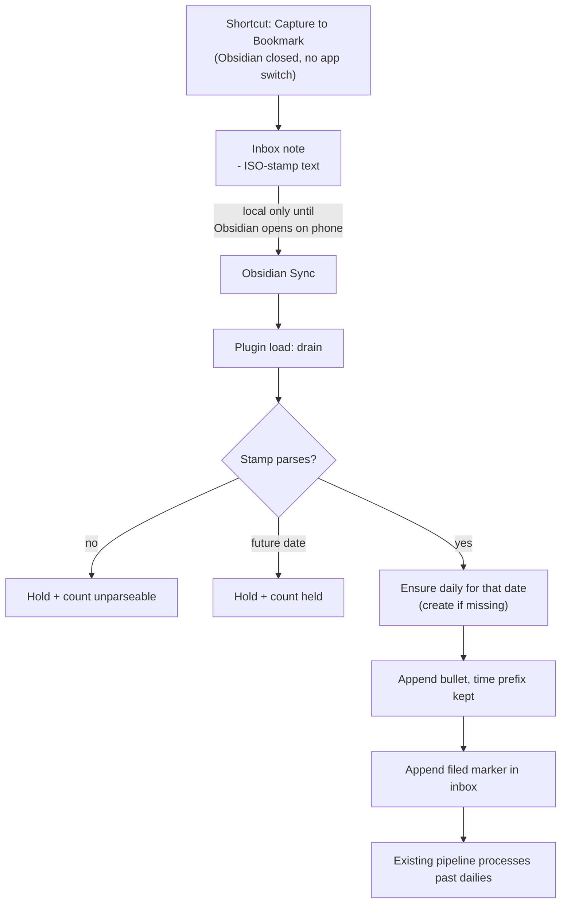
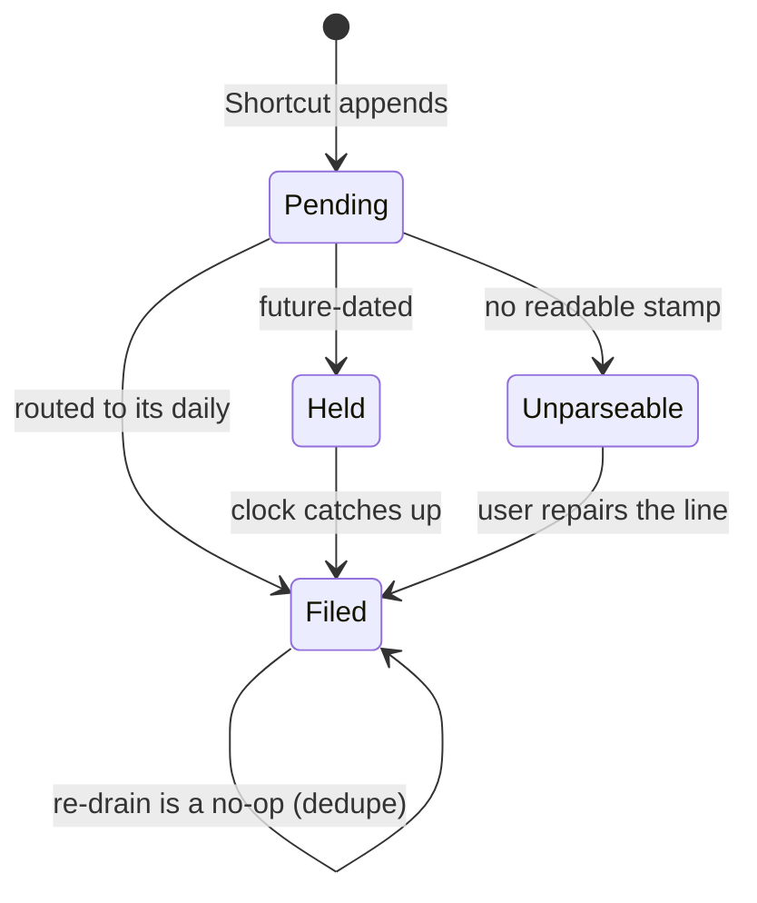

# feat: iOS capture inbox and drain

## Goal Capsule

**Objective.** Capture from the phone stops depending on today's daily note existing. The iOS Shortcut appends timestamped lines to a fixed bookmarked inbox note; the plugin routes each line into that capture's own daily note, creating it if missing, and never deletes from the inbox.

**Authority.** This plan > `CONCEPTS.md` > Issue #56's "possible directions" list (superseded — directions 1 and 2 are explicit non-goals here).

**Stop when.** A capture made with Obsidian force-quit lands in the daily for the date it was captured, even when it syncs days later. The inbox is never truncated. Pending and unparseable counts are visible without opening the inbox. Unit tests green; throwaway-vault CLI smoke done; phone smoke done by the human.

**Out.** Android capture (#166), heading-scoped intake (#10), attachments (#15), migrating other plugin files into the system folder, pruning old filed lines, capture UI.

---

## Product Contract

### Summary

Move the phone capture target off "today's daily note" — which Obsidian cannot create from a Shortcut — and onto a fixed inbox note that always exists. The plugin drains that inbox into the correct day's daily on load, creating past dailies as needed, marking rather than deleting each line it files.

### Problem Frame

Obsidian's **Capture to Daily Note** Shortcuts action fails with *File not found* when today's daily does not exist. The note is only created when Obsidian is opened, so the first capture of any day fails unless the user opens the app first. Obsidian's own documented workaround is exactly that: open the app and create the daily before capturing.

This is upstream and unfixed. It was reported against iOS 1.11.5, acknowledged with a promised fix in 1.11.6, and still reproduces on 1.12.7 as of June 2026. Their stated reason for not auto-creating is that writing the daily while the app is closed conflicts with template injection and Sync.

The user-visible cost is capture loss: a thought is spoken or typed, the Shortcut errors, and the text is gone. For a product whose premise is a trusted second brain, a capture path that silently drops the first thought of each day is disqualifying.

The capture URI approach (#51 / PR #52) solved creation but foregrounded Obsidian on every capture, so it was abandoned. The constraints from #56 stand: zero app switch, one shareable iCloud shortcut, native capture action.

### Requirements

**Capture reliability**

R1. A capture succeeds when today's daily note does not exist.
R2. A capture succeeds with Obsidian force-quit, without bringing the app to the foreground.
R3. The capture target is a note that never rotates by date, so the missing-file failure cannot recur.

**Day attribution**

R4. A capture made on a given local date lands in that date's daily note, regardless of when it syncs or drains.
R5. The plugin creates the target daily note when it is missing.
R6. Drained captures land in the user's real daily note, so the existing daily-note loop and the normal pipeline continue to own them.

**Data integrity**

R7. The drain never deletes or rewrites a line in the inbox; it appends a marker after the filed capture's extent.
R8. The drain is idempotent — re-running files nothing twice.
R9. A capture whose marker is lost to a sync merge is not filed twice.
R10. Capture body reaches the daily verbatim apart from whitespace normalization and the routing stamp.

**Visibility**

R11. Counts of pending and unparseable inbox captures are visible without opening the inbox note.
R12. A capture the drain cannot route is held, counted, and left in place — never dropped or guessed at.

**Vault surface**

R13. The inbox note lives at a fixed canonical path in a plugin-owned folder, outside the flat atom folder.
R14. The plugin creates the inbox note and its bookmark when either is missing.

**Onboarding**

R15. The shipped Shortcut recipe works on a fresh install without the user re-picking the bookmark, provided the inbox sits at the canonical path.
R16. Docs state that moving or renaming the inbox note breaks the Shortcut until it is re-pointed.

### Acceptance Examples

AE1. Obsidian force-quit, no daily for today, run the Shortcut → line appears in the inbox; no app switch; on next Obsidian load the line appears in today's daily (created if absent).
AE2. Capture Monday, do not open Obsidian on the phone until Thursday → on drain, the line lands in **Monday's** daily, created if absent.
AE3. Run the drain twice with no new captures → second run files nothing and appends no markers.
AE4. A filed line loses its marker (simulating a sync merge) → dedupe prevents a second daily line for the same capture.
AE5. A multi-line capture → the daily receives a top-level bullet plus indented continuation lines, and `parseCaptures` reads it as one capture.
AE6. An inbox line with no parseable stamp → held in place, counted as unparseable, surfaced; drain continues with the rest.
AE7. A capture stamped in the future (clock skew) → held, not filed into a future daily.

### Scope Boundaries

**In scope.** Inbox note and bookmark bootstrap; inbox capture format and parser; drain into arbitrary-date dailies; pending/unparseable visibility; Shortcut recipe and docs; version bumps.

**Explicit non-goals.**

- The hybrid "try Capture to Daily Note first, fall back to inbox" path (#56 direction 1) — see Alternatives Considered.
- Making the inbox path configurable. See KTD6 — a setting here is a foot-gun, not a feature.

#### Deferred to Follow-Up Work

- Android capture against this same inbox contract — #166.
- Targeting a specific heading inside the daily rather than end-of-file — #10.
- Images and attachments through the capture path — #15.
- Pruning or archiving old filed inbox lines. Any such operation must be manual, explicit, and desktop-only; an automatic prune races the phone and reintroduces the deletion hazard KTD2 exists to avoid.
- Migrating hub notes or other plugin-owned files into the new system folder.

### Outstanding Questions

Q2. *(Deferred, not blocking — decide during U5.)* What is the dedupe key? The daily line carries only `HH:MM` plus body, so a key built from those would silently collapse two genuine captures made in the same minute with the same text. Recommended default: keep second-level precision in the inbox stamp and treat the daily-content check purely as a backstop for the lost-marker case, accepting that two identical captures in the same *second* could still collapse. Whatever is chosen, dropping a real capture is the failure to avoid; filing one twice is recoverable.

Q1. *(Deferred, not blocking.)* Does a shared iCloud shortcut installed on a second device resolve the bookmark without re-picking? The schema shows no stable bookmark ID, so the reference is a path or title string and should resolve when paths match — but this is inference from `bookmarks.json`, not a verified result. Verify before the docs and landing-page copy commit to "one shareable link." If it does prompt, R15 softens to a documented one-time setup step and the plan does not otherwise change.

---

## Planning Contract

### Key Technical Decisions

KTD1. **A fixed bookmarked inbox note is the capture target.** (session-settled: user-approved — chosen over the capture URI, which foregrounds Obsidian; a per-user file path, which breaks the single shareable shortcut; and third-party Shortcuts actions, which impose a paid dependency.) Verified on device 2026-07-28: `Capture to Bookmark` appends with Obsidian force-quit and no app switch.

KTD2. **The inbox is append-only; the drain marks, never deletes.** (session-settled: user-approved — chosen over read-then-clear: with two devices, a clear that races an unsynced phone write either deletes the capture or refiles an old one.) Append-only removes our own deletion from the hazard set — no code path we control can destroy a capture. It does not, on its own, guarantee that a divergent merge preserves both sides; see Risk 1.

KTD3. **The Shortcut stamps capture time; the drain routes by that stamp.** (session-settled: user-directed — chosen over stamping at drain time, which would file a Monday capture into Thursday's daily whenever the phone syncs late.) Device smoke confirmed captures do not leave the phone until Obsidian is opened there, so late arrival is the normal case, not the edge case.

KTD4. **Drained captures land in the user's real daily note.** (session-settled: user-directed — chosen over processing straight from the inbox: the product is sold as the normal daily-note loop, and the existing pipeline already owns past dailies.)

KTD5. **The plugin creates the inbox note and bookmark on load when missing.** (session-settled: user-directed — chosen over documented manual setup, which would reproduce the missing-file failure on first capture.) Bookmarks sync only when settings-sync is on, so per-device creation is what makes this reliable.

KTD6. **The inbox path is a fixed constant, not a setting.** (session-settled: user-approved — chosen over a configurable folder with a default.) Device smoke 2026-07-28 established that the Shortcuts action binds the bookmark reference at configuration time: after renaming the note, the Shortcut prompted for bookmark re-selection on every run until the shortcut itself was edited. A user-changeable path would therefore silently break capture. The same finding makes a fixed path the thing that lets a shared shortcut resolve on a fresh device without re-picking.

KTD7. **Plugin-owned non-atom files live in their own folder, outside the flat atom folder.** (session-settled: user-directed — chosen over the vault root.) `clampAtomFolder` in `src/pipeline/render.ts` rejects subfolders, so the atom folder cannot hold it, and non-negotiable #2 keeps it flat.

KTD8. **The inbox uses the daily capture shape — top-level bullet plus indented continuation lines.** Research found `parseCaptures` already defines a capture as exactly that (`src/pipeline/parse.ts:42`, `:88`). Matching the shape makes the drain close to a copy and resolves multi-line captures without inventing a second convention. The Shortcut normalizes embedded newlines to newline-plus-tab before writing.

KTD9. **The inbox gets its own parser module, not a reuse of `parseCaptures`.** The inbox needs a different marker sentinel and a datestamp rather than a time-only stamp. Teaching `isMarkerLine` about the inbox sentinel would change how every daily note parses — an unacceptable blast radius on the correctness core the whole product rests on. `pipeline/inbox.ts` mirrors the continuation semantics with its own regexes and is tested independently.

KTD10. **The drained daily line keeps the time of day and drops the date.** `parse.ts:13` already recognizes and strips a leading `HH:MM` or `HH:MM:SS` from capture text, so `- 09:14 buy milk` renders as a normal rapid-log bullet while the atom body stays `buy milk`. The date is redundant — the file it lands in carries it.

KTD11. **Inbox markers are written bottom-up within a file.** `docs/solutions/logic-errors/marker-line-drift-batch-process.md` records markers stacking under the wrong capture when line indices drifted during a batch write. The drain marks many lines in one pass and is exposed to the same failure.

KTD12. **Bookmark creation goes through the undocumented internal Bookmarks API, behind a spike and a fallback.** No public plugin API exists for bookmarks. U2 proves or disproves it before anything depends on it; if unusable, the plugin still creates the note and the docs carry a one-time manual bookmark step, degrading R14 without blocking the feature.

### High-Level Technical Design

Capture flow across processes — note that Sync does not run while Obsidian is closed, which is why the stamp must be written at capture time:



Per-line state in the inbox. Lines only ever move forward, and no transition removes bytes:



### Assumptions

- Obsidian's `Capture to Bookmark` continues to append without foregrounding the app. Verified on 1.12.x; a future Obsidian change would surface as a capture regression.
- `createDailyNote` from `obsidian-daily-notes-interface` accepts an arbitrary moment, not only today. U4 verifies this before U5 depends on it.

- iOS Shortcuts can emit an ISO 8601 datetime with a UTC offset (Format Date) and can rewrite embedded newlines to newline-plus-tab (Replace Text). Both are standard actions, but neither is verified on device. The whole routing contract rests on the Shortcut producing a stamp U3 can parse, so U7 proves both before the recipe ships.

### Alternatives Considered

**Pre-create tomorrow's daily on each plugin load**, so the native `Capture to Daily Note` action always finds a file. Far cheaper — no inbox, no drain, no new parser, no bookmark API. Rejected because it degrades exactly where it matters: it only holds while the user opens Obsidian at least once every 24 hours, and the whole problem is captures made when the app has not been opened. Miss two days and the failure returns unchanged. It also litters the vault with speculative empty dailies and fires daily-note templates for days that may never be used.

**Hybrid — try `Capture to Daily Note`, fall back to the inbox on failure** (Issue #56 direction 1). Viable now that `Get Daily Note` is known to exist. Rejected as two code paths where one suffices, with the branch that matters least (the happy path) getting the most exercise and the fallback path rotting untested.

### Risks and Dependencies

Risk 1. **Obsidian Sync's merge behavior on a divergent inbox is unverified.** The design assumes that when the phone has appended captures and the desktop has appended markers, Sync reconciles to a file containing both. If Sync instead picks a whole-file winner, the losing side's appended lines are lost — which is capture loss, the exact failure this plan exists to remove. Append-only narrows the blast radius (nothing *we* write deletes anything) but does not close this.

Mitigations available without redesigning: Obsidian Sync retains version history, so a lost append is recoverable rather than gone; and the U5 dedupe makes re-filing a recovered line safe. Worth confirming empirically during U5 — force a divergence by capturing on the phone while offline, draining on the desktop, then opening the phone — and recording the result in `docs/solutions/`. If Sync picks a winner, the honest mitigation is a doc note that the phone should be opened reasonably often, not a code change.

Risk 2. **The Bookmarks internal API is undocumented and can change without notice.** A future Obsidian release could break bookmark creation silently. U2's defensive guarding keeps this from breaking plugin load, and the fallback keeps the feature usable, but it is a standing maintenance exposure.

Risk 3. **The capture path depends on upstream behavior Obsidian has already broken once.** `Capture to Daily Note` regressed for four releases. `Capture to Bookmark` could regress the same way, and we would find out through user reports rather than tests, since no automated test can drive iOS Shortcuts.

Dependency. The Daily Notes core plugin, already a hard dependency via `DailyNotesDisabledError` in `src/pipeline/daily.ts:14`.

---

## Implementation Units

### U1. Canonical inbox location and note bootstrap

**Goal.** A fixed system folder and inbox note exist, created on load when missing.

**Requirements.** R13, R14 (note half).

**Dependencies.** None.

**Files.** `src/pipeline/inbox.ts`, `src/plugin/main.ts`, `test/inbox.test.ts`.

**Approach.** Define the canonical system folder and inbox path as exported constants in `src/pipeline/inbox.ts`, the owning module, with a comment stating that changing either breaks deployed shortcuts (same contract class as `CAPTURE_SHORTCUT_VERSION` in `src/settings/captureShortcut.ts`). Create folder and note from `onLayoutReady` in `src/plugin/main.ts:177`, alongside existing post-load wiring. Give the note frontmatter that says what it is, that Atoms drains it, and not to hand-edit — someone finding it in six months should not have to guess. Creation is idempotent: never overwrite an existing note.

**Patterns to follow.** `openTodaysDaily` in `src/pipeline/daily.ts:84` for the resolve-or-create shape.

**Test scenarios.**
- Missing folder and note → both created, note carries the explanatory frontmatter.
- Note already exists with captures in it → untouched, no content change.
- Note exists but folder was renamed by the user → a fresh canonical note is created; existing content is not moved or deleted.
- Called twice in one session → second call is a no-op.

**Verification.** Fresh throwaway vault, enable plugin, confirm folder and note appear at the canonical path with frontmatter intact.

### U2. Bookmark bootstrap spike and creation

**Goal.** The inbox note is bookmarked so the Shortcut can target it — or the fallback path is proven and documented.

**Requirements.** R14 (bookmark half), R15.

**Dependencies.** U1.

**Files.** `src/pipeline/inbox.ts`, `test/inbox.test.ts`, `docs/capture-shortcut.md`.

**Approach.** Spike first: determine whether the internal Bookmarks plugin exposes a usable add-item path, and whether a bookmark added that way persists to `.obsidian/bookmarks.json` and appears in the Shortcuts picker. The observed schema is `{type, ctime, path, title?}` with no stable ID. Guard every access defensively — this is not a public API and must never throw into plugin load. If unusable, skip creation, surface a one-time setup Notice, and document the manual bookmark step; R14's bookmark half degrades and nothing else in the plan changes.

**Execution note.** This is a feasibility spike before it is a feature. Establish the API works, or does not, before U5 is built on the assumption that capture reaches the inbox at all.

**Test scenarios.**
- Bookmark absent → created pointing at the canonical inbox path.
- Bookmark already present for that path → not duplicated.
- Bookmarks plugin disabled or API shape unrecognized → no throw, plugin load completes, setup Notice surfaced once.

**Verification.** Throwaway vault: confirm the bookmark appears in the Bookmarks pane and in `.obsidian/bookmarks.json` with the canonical path.

### U3. Inbox capture format and parser

**Goal.** A pure parser that reads the inbox into stamped captures with filed state.

**Requirements.** R4, R7, R8, R10.

**Dependencies.** U1 (shares `src/pipeline/inbox.ts`; the logic itself is pure and independent).

**Files.** `src/pipeline/inbox.ts`, `test/inbox.test.ts`.

**Approach.** Define the line format as a top-level bullet whose body opens with an ISO 8601 local datetime carrying a UTC offset, followed by capture text; indented non-empty lines that are not bullets or markers continue the capture. The filed marker is an indented sentinel line after the capture's extent, distinct from the daily's `<!--linker-->` family. Mirror the extent logic in `parseCaptures` without importing its marker predicates (KTD9). Return per-capture: stamp, local date, body, filed state, marker line index, and start/end lines.

**Execution note.** Test-first. This is a correctness core in the sense CLAUDE.md means, and it is the piece that decides whether a capture is preserved or mangled.

**Patterns to follow.** `src/pipeline/parse.ts:42` (`isContinuationLine`), `:70` (`parseCaptures` extent walk), and the existing table-driven style in `test/parse.test.ts`.

**Test scenarios.**
- Single-line capture with a valid stamp → one capture, stamp and body split correctly.
- Multi-line capture with indented continuations → one capture, body joined with newlines, indentation stripped.
- Filed marker after a capture's extent → capture reports filed; marker is not absorbed into the body.
- Capture text containing the filed sentinel verbatim → not treated as a marker; body preserved.
- Line with no stamp → surfaced as unparseable, not silently dropped.
- Stamp with a UTC offset different from the current device offset → local date derived from the stamp's own offset, not the device's.
- Empty bullet → skipped, matching `isEmptyCaptureText` semantics.
- Blank lines between captures → do not merge or split captures.

**Verification.** `npm test` green with the new suite.

### U4. Resolve or create the daily note for an arbitrary date

**Goal.** A helper that returns the daily note for any past date, creating it if missing.

**Requirements.** R5.

**Dependencies.** None.

**Files.** `src/pipeline/daily.ts`, `test/daily.test.ts` (create if absent).

**Approach.** Generalize the resolve-or-create shape of `openTodaysDaily` (`src/pipeline/daily.ts:84`) to accept a date rather than assuming today, keeping the `DailyNotesDisabledError` guard and the defensive `getDailyNote` try/catch already there. Do not change `openTodaysDaily`'s signature — its callers open the note in the workspace, which this helper must not do. Confirm `createDailyNote` accepts an arbitrary moment before U5 depends on it.

**Test scenarios.**
- Daily exists for the date → returned, not recreated, content untouched.
- Daily missing → created via Daily Notes settings, no workspace leaf opened.
- Daily Notes plugin disabled → `DailyNotesDisabledError`.
- Future date → rejected; the drain holds rather than creating a future daily.

**Verification.** Throwaway vault: drain a capture stamped for a date with no daily and confirm the file is created in the configured folder with the configured format.

### U5. Drain inbox captures into their dailies

**Goal.** Every pending inbox capture is appended to its own day's daily and marked filed, idempotently.

**Requirements.** R4, R6, R7, R8, R9, R10, R12.

**Dependencies.** U1, U3, U4.

**Files.** `src/pipeline/inbox.ts`, `src/plugin/main.ts`, `test/inbox.test.ts`.

**Approach.** Group pending captures by local date, resolve or create each daily once, and append each capture as a top-level bullet whose body opens with the `HH:MM` time and whose continuation lines are tab-indented (KTD8, KTD10). Then append the filed marker into the inbox, writing markers bottom-up so earlier insertions do not shift later line indices (KTD11). Before appending to a daily, check whether that daily already contains a capture matching this stamp and body — this is the dedupe that keeps a marker lost to a sync merge from producing a duplicate. Hold and count anything unparseable or future-dated rather than guessing. Appending into an already-processed daily is safe and needs no special handling: the new bullet simply has no marker line yet, so the existing pipeline picks it up on the next run (`docs/spec-amendments.md` §A). Run on `onLayoutReady` and expose a manual command alongside the existing `atoms:` commands. Read and write with `vault.read` / `vault.modify`, matching `src/pipeline/write.ts:384`.

**Test scenarios.**
- Captures spanning three dates → three dailies receive their own captures; none crosses days.
- Capture for a date with no daily → daily created, capture appended.
- Re-run with no new captures → no writes, no duplicate markers.
- Filed line with its marker removed → dedupe suppresses a second daily line.
- Multi-line capture → daily receives bullet plus tab-indented continuations, and `parseCaptures` reads it back as exactly one capture.
- Mixed batch of valid, unparseable, and future-dated lines → valid ones file, the others stay in place and are counted.
- Daily already ends without a trailing newline → append does not join onto the last line.
- Marking many captures in one file → every marker sits under its own capture (regression guard for the line-drift learning).
- Capture body containing a wikilink → not mistaken for a marker, per non-negotiable #4.
- Two distinct captures with identical text in the same minute → both file. The dedupe key must not silently collapse them (see Open Question Q2).

**Verification.** Throwaway vault via CLI: seed inbox lines across several dates, run the drain command, confirm each daily and each marker; run again and confirm no change.

### U6. Surface pending and unparseable counts

**Goal.** A stuck drain is visible without opening the inbox note.

**Requirements.** R11, R12.

**Dependencies.** U3, U5.

**Files.** `src/home/atomsHomeView.ts`, `test/atomsHomeData.test.ts`.

**Approach.** Compute pending, held, and unparseable counts during the drain and surface them in Atoms home next to the existing unprocessed-capture state, reusing the count and wait-card pattern already there (`src/home/atomsHomeView.ts:182`, `:1674`). Show nothing when all counts are zero — silence is the healthy state. Held and unparseable are the load-bearing signals: pending resolves itself on the next drain, but a capture the drain cannot route stays stuck until someone sees it.

**Test scenarios.**
- All zero → no count surfaced.
- Pending only → pending count shown.
- Unparseable present → surfaced distinctly from pending, since it needs human repair.
- Held (future-dated) present → surfaced distinctly from unparseable.
- Counts move to zero after a successful drain → indicator clears.

**Verification.** Throwaway vault: seed one unparseable line, open Atoms home, screenshot the indicator; repair the line, re-drain, confirm it clears.

### U7. Shortcut recipe, docs, and version bumps

**Goal.** A user can install the recipe and capture successfully on the first try.

**Requirements.** R1, R2, R3, R15, R16.

**Dependencies.** U1, U2, U5.

**Files.** `docs/capture-shortcut.md`, `src/settings/captureShortcut.ts`, `manifest.json`, `package.json`, `versions.json`, `README.md`.

**Approach.** Replace the Option A/B/C recipe in `docs/capture-shortcut.md` with the `Capture to Bookmark` recipe: append mode, the canonical bookmark, a Text action that builds the bullet with an ISO stamp carrying the UTC offset, and newline normalization to newline-plus-tab so multi-line dictation survives as continuations. Bump `CAPTURE_SHORTCUT_VERSION` so existing users see the Update prompt, and bump plugin version across `manifest.json`, `package.json`, and `versions.json` per CLAUDE.md.

Document three things honestly, because each is a real behavior a user will otherwise discover the hard way:
- Moving or renaming the inbox note breaks the Shortcut until it is re-pointed (R16, from the U2/KTD6 device finding).
- With Obsidian closed, a capture is on disk immediately but does not reach other devices until Obsidian is opened on the phone. Nothing is lost; it is Obsidian Sync behavior, not ours.
- The old daily-note recipe is superseded and why — so the upstream bug is on the record rather than looking like a preference.

**Test scenarios.** `Test expectation: none -- docs, constants, and version metadata; behavior is covered by U1-U6 and by the device smoke in Verification.`

**Verification.** Human phone smoke: force-quit Obsidian, run the rebuilt Shortcut on a day with no daily, confirm no app switch and no error; reopen Obsidian and confirm the capture in the correct daily.

---

## Verification Contract

```bash
npm test
```

```bash
npm run build
```

```bash
./scripts/verify.sh
```

CLI smoke with Obsidian open on the throwaway vault (`test_vault/test vault`), per CLAUDE.md's requirement that agents verify with the CLI and report its output as evidence:

```bash
obsidian command id=atoms:drain-inbox
```

**Gates.** Unit tests green including the new inbox suite. Clean build. Drain smoke run twice, with the second run producing no change. Vault lane discipline: all agent verification on `test_vault/` or `docs/media/demo-vault/` — never Remote Vault.

**Human-only gate.** The phone smoke in U7. No agent can run it, and the feature is not proven without it.

---

## Definition of Done

**Global.**

- All seven units landed with their test scenarios covered.
- A capture made with Obsidian force-quit on a day with no daily reaches that day's daily.
- A capture stamped for an earlier date lands in that date's daily, not the drain date's.
- The drain is provably idempotent — a second run writes nothing.
- No code path deletes or rewrites an inbox line.
- Pending, held, and unparseable counts surface in Atoms home.
- `docs/capture-shortcut.md` carries the new recipe and all three honesty notes from U7.
- Versions bumped in `manifest.json`, `package.json`, `versions.json`; `CAPTURE_SHORTCUT_VERSION` bumped.
- Spike leftovers removed — if U2's bookmark API probe left exploratory code, it is deleted or promoted, not abandoned in the diff.

**Shipping tail** (CLAUDE.md mandatory tail, not optional polish): `ce-simplify-code` → `ce-code-review` → `ce-compound` → `world-class-qa` including its adversarial half → PR with `Closes #56`, core user stories, edge cases, and screenshots of the Atoms home count indicator committed under `docs/qa/screenshots/` and linked with absolute raw URLs.

---

## Sources / Research

- Issue #56 (constraints), #51 / PR #52 (abandoned URI approach, and why), #10, #15, #166.
- Upstream bug: [Obsidian forum — capture to daily note fails when the daily does not exist](https://forum.obsidian.md/t/ios-capture-to-daily-note-shortcut-fails-if-daily-note-doesn-t-exist/112619). Reported 1.11.5, still reproducing 1.12.7, June 2026.
- [Obsidian 1.11 mobile changelog](https://obsidian.md/changelog/2026-01-12-mobile-v1.11.4/) — capture actions append "without opening the Obsidian app." Confirmed on device; note the changelog's "capture to a note" is actually **Capture to Bookmark**.
- Device smoke 2026-07-28: full action list is ten actions with no append-by-path and no create-note; `Capture to Bookmark` appends with the app force-quit and no app switch; captures do not sync until Obsidian is opened on the phone; the action writes raw text plus a newline and adds no bullet; renaming the target note makes the Shortcut prompt for bookmark re-selection on every run until the shortcut is edited.
- `.obsidian/bookmarks.json` schema: `{type, ctime, path, title?}` — no stable bookmark ID, which is what makes the reference a path string and Q1 likely benign.
- `src/pipeline/parse.ts:42`, `:70`, `:13` — continuation-line semantics and the existing leading-time strip that KTD8 and KTD10 depend on.
- `src/pipeline/daily.ts:84` — resolve-or-create shape U4 generalizes.
- `docs/solutions/logic-errors/marker-line-drift-batch-process.md` — bottom-up marker writes (KTD11).
- `docs/solutions/logic-errors/collision-foreign-marker-integrity.md` and open Issue #108 — marker integrity on the daily write path, which U5 adds a new writer to.
