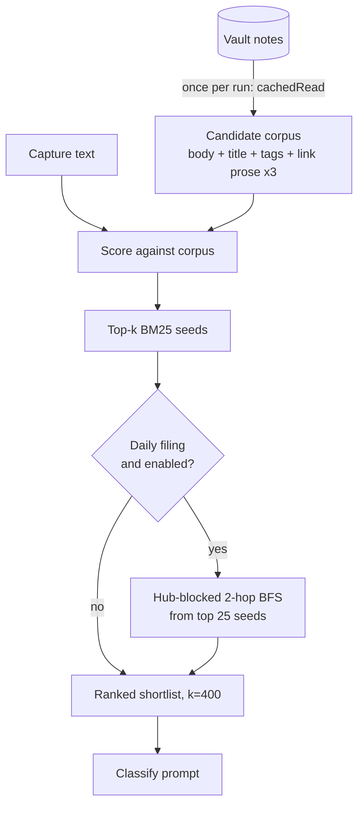
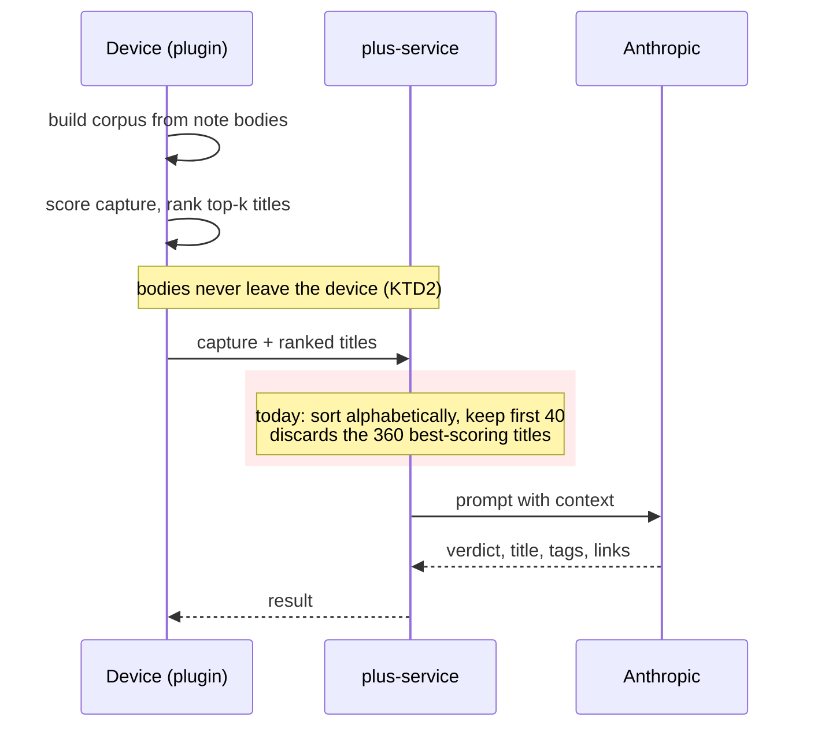

# feat: BM25 body-scored shortlists for classify context

## Product Contract

### Summary

Replace the all-titles classify context with a shortlist scored against the capture — ranked on note
bodies, tags and link prose, not titles alone — routed through the `ContextProvider` seam that
already exists and is currently bypassed. Adds hub-blocked graph expansion for daily filing, and
makes the Plus service honour the device's ranking instead of re-truncating it alphabetically.

### Problem Frame

The model can only link a capture to a note it was shown. Today the plugin shows it **every** title
in the vault, and `plus-service` shows it the alphabetically-first **40**
(`ATOMS_PLUS_MAX_CONTEXT_TITLES`, `plus-service/src/config.mjs:162`). Both are wrong in different
directions.

Uncapped does not scale, and the cost is not a rounding error: a 3,000-capture catch-up runs $3.23
per thousand at a 200-note vault and $13.32 at 5,000, so no single honest price exists. Measured on
the real prompt, input grows at roughly **11 tokens per vault title** — vault size, not capture
length, is the cost driver. Capped at 400 titles the price is flat at $3.65 per thousand at any
vault size.

Alphabetical-40 is worse than a cap — it is an *accidental* cap. Scored against the owner's real
vault links it retrieves **0%** of them. A Plus subscriber today cannot link to most of their vault,
and the failure is silent.

Three findings shape the fix, all reproduced across corpora with different flaws:

- **Score bodies, not titles.** Title-only scoring leaves 39% of gold targets scoring literally
  zero; body+title leaves 23%.
- **Misses are absolute, not ranking failures.** A missed note scores *zero*, so widening `k` cannot
  recover it — only adding terms to the index can. This is why body, tag and link-prose text matter
  more than a bigger shortlist.
- **The model's own link prose is free signal.** Indexing it with a ×3 field weight won 13 links
  against 1 lost at k=400, converting 21 of 190 absolute misses into something `k` can reach.

Separately, the seam meant to hold this is dead. `ContextProvider.getCandidates(capture)`
(`src/pipeline/context.ts:19`) takes the capture and is documented as the one function a BM25 stage
changes — but the metadata implementation ignores its argument and delegates to `buildContext()`,
and every real caller bypasses it. Worse, both `write.ts:120` (the everyday **Process** path) and
`backfill.ts:268` call `buildContext()` **once, before the loop over captures**. An atom created
early in a run is invisible to every capture processed after it in the same run.

### Requirements

| ID | Requirement |
|---|---|
| R1 | Classify context is a shortlist scored against the specific capture, not the whole vault and not an alphabetical slice. |
| R2 | Scoring indexes note **body** text, tags and the model's link prose — not titles alone. |
| R3 | Every classify path resolves its context through `ContextProvider.getCandidates(capture)`. |
| R4 | Context is resolved **per capture**, so an atom created earlier in a run is visible to captures processed later in the same run. |
| R5 | Plus subscribers get the device's ranked shortlist intact; the service must not reorder or alphabetically re-truncate it. |
| R6 | Note bodies never leave the device. The Plus request carries titles only. |
| R7 | Daily filing additionally reaches hub-blocked 2-hop neighbours of the top BM25 seeds, behind a setting that can disable it. |
| R8 | Shortlist size is configurable, defaulting to the studied k=400. |
| R9 | Behaviour outside context selection is unchanged — verbatim bodies, flat folder, markers, collision policy. |

### Scope Boundaries

**In scope.** Context selection for classify: the scoring core, the candidate corpus, the seam, all
five classify call sites, graph expansion for daily filing, the Plus rank-order fix, and the
settings and diagnostics needed to observe it in the wild.

**Not in scope.**

- Plus billing, allowance, and delivery-queue work — that is
  `docs/plans/2026-07-28-003-feat-plus-vault-catch-up-plan.md`, still requirements-only with four
  open blockers. This plan must not enrich or depend on it.
- The model bake-off across providers.
- Capture UI, folder intelligence, `append` into user notes — permanently out per `CLAUDE.md`.

#### Deferred to Follow-Up Work

- **Tags as a retrieval lever.** The real vault suggests tags carry more indexable tokens than the
  captures themselves (714 vs 650), but n=37 settles nothing. R2 indexes tags because it is free to
  do so; *measuring* their contribution needs a corpus that does not exist.
- **A persistent scoring index.** KTD4 reads bodies per run deliberately. If profiling on a large
  vault shows the read dominates, an incremental index is the follow-up.
- **Recovering the ~58% of misses in another graph component.** Unreachable at any BFS depth; needs
  a different mechanism entirely.

---

## Planning Contract

### Key Technical Decisions

**KTD1 — Index body + title + tags + link prose; weight the link field ×3.**
Title-only leaves 39% of targets at score zero against body+title's 23%, and misses are absolute, so
the only lever that recovers them is adding terms. Link prose won 13 against 1 lost at k=400. The
pipeline reads no note bodies today, so this is genuinely new I/O — see KTD4.

**KTD2 — Score on the device; send ranked titles to Plus. Never send bodies.**
`CLAUDE.md` non-negotiable 12 constrains vault→cloud to a flat `Atoms/*.md` title allowlist. Scoring
server-side would require shipping note bodies to the service, which is a privacy expansion this
plan explicitly refuses. It is also unnecessary: the device already has the text.

**KTD3 — The Plus fix is rank preservation, not server-side scoring.**
Follows from KTD2 and is the non-obvious half. Once the device sends a *ranked* shortlist, the
server's existing 40-title alphabetical truncation actively destroys it — it would discard the 360
best-scoring titles and keep whichever 40 sort first. The service must honour the received order and
cap at `k`, not re-sort.

**KTD4 — Read bodies once per run via `app.vault.cachedRead`; no persistent index.**
`cachedRead` is already the pattern (`atomsHomeView.ts:552`, `refreshAtoms.ts:482`). A persistent
index is a new stateful subsystem that can go stale, corrupt, or disagree with the vault, and the
blast radius of a shared substrate is paid in tests. Build the corpus once per run and score every
capture against it in memory — the read is amortised across the whole run, not paid per capture.

**KTD5 — Port `scripts/lib/shortlist.mjs` rather than reimplement.**
Every finding on this branch was measured with that tokeniser and BM25. A fresh implementation risks
shipping behaviour that does not match what was proven. Port it to TypeScript with a parity test
against the research fixtures.

**KTD6 — k=400 default, configurable.**
The studied cap. Flat at $3.65 per thousand at any vault size, against $3.23–$13.32 uncapped. R8
makes it a setting because the right value may differ for BYOK backfill (bar: "as good as uncapped")
and Plus (bar: "better than alphabetical-40").

**KTD7 — Graph expansion is daily-filing only, and the plan says so.**
Hub-blocked 2-hop BFS from the top 25 BM25 seeds reaches 29% of zero-score misses. That reach figure
is trustworthy — zero-score counts were byte-identical across every corpus variant. The associated
"+7 recall points" is **not**: it came off a synthetic corpus where recall swung ±10 points on
padding alone. In a catch-up the only edges are atom→hub, so hub-blocked reach is **0% by
construction** — the unit must not imply a backfill win. R7 puts it behind a setting so the
contribution can be measured in the wild rather than asserted.

**KTD8 — Per-capture context replaces build-once.**
R4 fixes a real bug on the everyday path, not just backfill. It becomes cheap once the corpus is
built once per run: re-scoring a capture against an in-memory corpus does not re-read the vault.

### Assumptions

- Obsidian's `cachedRead` is fast enough on phone-sized vaults to build the corpus once per run.
  U2's verification is where this gets tested rather than assumed.
- `resolvedLinks` from `metadataCache` is a sufficient graph source for U6 and needs no separate
  link parse.

---

## High-Level Technical Design

Directional — the prose above is authoritative where they disagree.

### Context selection, per capture

The corpus is built once per run and shared; only the scoring step repeats per capture. That is what
makes R4 affordable.

### Where the ranking survives, and where it used to die

U7 removes the red step: the service preserves received order and caps at `k`.

---

## Implementation Units

### U1. Port the scoring core

**Goal.** A pure, tested BM25 + tokeniser in the plugin, behaviourally identical to the research
harness.

**Requirements.** R2 (partially), KTD5.

**Dependencies.** None.

**Files.** `src/pipeline/shortlist.ts` (new), `test/shortlist.test.ts` (new).

**Approach.** Port `tokens()`, `bm25Rank()` and the field-weighting from `scripts/lib/shortlist.mjs`.
No Obsidian imports — this layer must stay pure so it can be tested without a vault and reused by
the research scripts.

**Patterns to follow.** `src/pipeline/parse.ts` for a pure, heavily-tested pipeline module.

**Execution note.** Test-first, and write the parity test before the port: pin a handful of research
fixtures and their expected ranking, then make the TypeScript reproduce them.

**Test scenarios.**
- Tokenisation matches the research tokeniser on captures containing punctuation, casing, and
  possessives.
- Ranking order for a known capture/corpus pair matches the fixture ranking exactly.
- A candidate sharing no term with the capture scores exactly zero (this is the load-bearing
  property — misses must be absolute, not merely low).
- Field weighting: a term appearing only in link prose outranks the same term appearing once in a
  body, at ×3 weight.
- Empty capture returns an empty ranking rather than throwing.
- Ranking is deterministic across repeated calls with identical input.

**Verification.** `npm test` passes; the parity test fails if the port diverges from the fixtures.

---

### U2. Build the candidate corpus from note bodies

**Goal.** Assemble the scoreable corpus — body, title, tags, link prose — once per run.

**Requirements.** R2, KTD1, KTD4.

**Dependencies.** U1.

**Files.** `src/pipeline/candidates.ts` (new), `test/candidates.test.ts` (new).

**Approach.** Read each candidate note once via `app.vault.cachedRead` and assemble its scoreable
fields. Tolerate unreadable files rather than failing the run — Obsidian Sync placeholders appear in
`readdir` but cannot be opened, a case `scripts/analyze-vault-shortlist.mjs` already handles by
counting rather than dying. Body text is the atom's capture, which averages 123 characters on real
atoms (median 97, only 5 of 37 over 200), so truncation is close to a non-question here; if a limit
is added, decide it on memory rather than recall.

**Patterns to follow.** `src/home/atomsHomeView.ts:552` for `cachedRead` usage;
`src/pipeline/refreshAtoms.ts:482` for read-with-tolerance.

**Test scenarios.**
- A note that cannot be read is skipped and the run continues, with the skip counted.
- A missing or deleted file between listing and reading does not throw.
- An empty note yields a candidate scoreable on its title alone.
- Tags from frontmatter and inline tags both reach the corpus.
- Link prose from the atom's reason-bearing links reaches the corpus in the weighted field.
- The corpus is built once for a multi-capture run — the read count equals the note count, not
  note count × capture count.

**Verification.** `npm test`; read-count assertion proves the once-per-run contract from KTD4.

---

### U3. Make the seam real

**Goal.** `getCandidates(capture)` actually uses its argument and returns a scored shortlist.

**Requirements.** R1, R3, R8.

**Dependencies.** U1, U2.

**Files.** `src/pipeline/context.ts`, `test/context.test.ts`.

**Approach.** Implement `MetadataContextProvider.getCandidates` to score the capture against the U2
corpus and return the top `k`. Keep `buildContext()` for the hub and diagnostic callers in
`main.ts` that are not classify paths — this unit does not touch those.

**Test scenarios.**
- Two different captures against the same corpus return different shortlists (the argument is
  genuinely used — this is the regression that would catch a relapse to dead code).
- Shortlist length is capped at `k` and respects a configured non-default `k`.
- A capture matching nothing returns a shortlist that is empty or title-only rather than throwing.
- Person hubs remain linkable — hub titles and frontmatter aliases survive selection.
- Ordering is by score descending, not alphabetical.

**Verification.** `npm test`; `obsidian command id=atoms:dry-run-preview` shows a capture-specific
shortlist rather than the full title list.

---

### U4. Route the daily Process and preview paths

**Goal.** The everyday path uses the seam, per capture.

**Requirements.** R3, R4, R9.

**Dependencies.** U3.

**Files.** `src/pipeline/write.ts`, `src/pipeline/preview.ts`, `test/write.test.ts`,
`test/preview.test.ts`.

**Approach.** Replace the single pre-loop `buildContext()` at `write.ts:120` and `preview.ts:247`
with a per-capture `getCandidates()` call inside the loop. The corpus is built once outside the
loop; only scoring repeats. Nothing else about the write path changes — marker append, collision
policy, and verbatim body handling are untouched.

**Execution note.** Write the in-run visibility test first and watch it fail against current
`main` — it is the proof that KTD8 fixes a real bug rather than a theoretical one.

**Test scenarios.**
- **In-run visibility (the regression):** processing a daily with several captures, where a later
  capture belongs with an atom created by an earlier capture in the same run, surfaces that atom in
  the later capture's shortlist. Fails before this unit, passes after.
- Bottom-up capture ordering within a daily is preserved, so appended markers do not shift line
  numbers.
- The verbatim body is byte-identical to the capture text after processing.
- A capture whose shortlist is empty still classifies and still gets a marker.
- Preview writes nothing to the vault.
- `includeToday` behaviour is unchanged.

**Verification.** `npm test`; `./scripts/verify.sh`; `obsidian command id=atoms:dry-run-preview` then
`id=atoms:process-fixture-sample` against the throwaway vault, reporting CLI output as evidence.

---

### U5. Route backfill and refreshAtoms

**Goal.** The remaining classify paths use the seam.

**Requirements.** R3, R4.

**Dependencies.** U3.

**Files.** `src/pipeline/backfill.ts`, `src/pipeline/refreshAtoms.ts`, `test/backfill.test.ts`,
`test/refreshAtoms.test.ts`.

**Approach.** Same change at `backfill.ts:268` and `refreshAtoms.ts:727` and `:862`. Backfill batches
through the Batch API, so the corpus must be built before batch assembly while scoring stays
per-capture.

**Test scenarios.**
- Backfill: an atom created earlier in the batch is visible to a later capture's shortlist.
- The cost-estimate gate still fires before any batch is submitted, and the estimate reflects
  shortlist-sized context rather than full-vault context.
- `refreshAtoms` update path: refreshing an existing atom scores against the capture, not the atom's
  current title.
- Both paths tolerate an empty shortlist.

**Verification.** `npm test`; `obsidian command id=atoms:backfill-estimate-confirm` shows an estimate
consistent with k=400 rather than full-vault context.

---

### U6. Graph expansion for daily filing

**Goal.** Reach hub-blocked 2-hop neighbours of the top BM25 seeds when filing a daily.

**Requirements.** R7, KTD7.

**Dependencies.** U3, U4.

**Files.** `src/pipeline/expand.ts` (new), `src/pipeline/context.ts`, `test/expand.test.ts`.

**Approach.** From the top 25 scored seeds, walk `resolvedLinks` two hops, blocking traversal
*through* person and topic hubs so a single popular hub does not pull in the whole vault. Append the
reached notes to the shortlist. Behind a setting, default on for daily filing.

This does nothing for backfill and the code should not pretend otherwise: in a catch-up the only
edges are atom→hub, so hub-blocked reach is 0% by construction. Gate it to the daily path and say so
in the module comment.

**Test scenarios.**
- A note two hops from a seed, not itself scoring above zero, is added to the shortlist.
- Traversal through a hub is blocked: a hub with many neighbours does not flood the shortlist.
- A note in a disconnected graph component is not reached at any depth.
- With the setting off, the shortlist is byte-identical to U3's output.
- Expansion adds a bounded number of slots (~32 at the studied seed count), not an unbounded set.
- Catch-up context: expansion contributes zero additional notes, asserted rather than assumed.

**Verification.** `npm test`; a dry-run preview on the seeded test vault shows expansion slots
appearing for daily filing and none for backfill.

---

### U7. Preserve the device's ranking in plus-service

**Goal.** Stop the service from discarding the shortlist it is given.

**Requirements.** R5, R6, KTD3.

**Dependencies.** U3.

**Files.** `plus-service/src/anthropic.mjs`, `plus-service/src/config.mjs`, plus-service tests.

**Approach.** `anthropic.mjs:47` currently truncates to `config.maxContextTitles` (default 40) after
an alphabetical sort. Change it to preserve the received order and cap at `k`. Raise the default to
match KTD6. The request contract carries titles only — assert that bodies are absent rather than
trusting the client.

**Execution note.** Add the order-preservation test before changing the truncation, so the
alphabetical behaviour is captured as the thing being replaced.

**Test scenarios.**
- Given 400 ranked titles and a cap of 400, all 400 reach the prompt in the received order.
- Given more titles than the cap, the **first** `k` by received order survive — not the first `k`
  alphabetically. This is the regression that matters.
- A request containing note body text is rejected, proving R6 server-side.
- An unranked or legacy client request still works, falling back to current behaviour.
- The cap remains configurable via `ATOMS_PLUS_MAX_CONTEXT_TITLES`.

**Verification.** plus-service test suite; a request with a known ranking returns a prompt whose
context order matches the input.

---

### U8. Settings surface and redacted diagnostics

**Goal.** Make `k` and expansion configurable, and make shortlist behaviour observable in the wild.

**Requirements.** R7, R8.

**Dependencies.** U3, U6.

**Files.** `src/settings/settings.ts`, `src/shared/types.ts`, `test/settings.test.ts`.

**Approach.** Expose shortlist size and the expansion toggle in Settings → Atoms. Log shortlist size,
seed count, expansion slot count and how many candidates scored zero. Counts only — never capture
content, never titles. Bump `manifest.json`, `package.json` and `versions.json` so builds are
identifiable per the repo's versioning rule.

**Test scenarios.**
- Settings round-trip: a configured `k` reaches `getCandidates`.
- Expansion toggle off is honoured by the daily path.
- Diagnostics emit counts only — a test asserts no capture text or note title appears in the logged
  payload.
- Defaults match KTD6 when settings are absent.

**Verification.** `npm test`; Settings → Atoms shows the new controls and the bumped version.

---

## Verification Contract

| Gate | Command |
|---|---|
| Unit and widget tests | `npm test` |
| Typecheck and bundle | `npm run build` |
| Full local verify | `./scripts/verify.sh` |
| Dry run, no writes | `obsidian command id=atoms:dry-run-preview` |
| Fixture write, no API | `obsidian command id=atoms:process-fixture-sample` |
| Backfill estimate gate | `obsidian command id=atoms:backfill-estimate-confirm` |
| Plus service | plus-service test suite |

CLI verification runs against the **throwaway vault** (`test_vault/test vault/`) with Obsidian open.
Never against a personal vault — `CLAUDE.md` vault lanes.

## Definition of Done

- All eight units landed, each with its test scenarios passing.
- The in-run visibility regression in U4 and the order-preservation regression in U7 both fail on
  `main` and pass after — these are the two proofs that the plan fixed real bugs.
- No behaviour change outside context selection: verbatim bodies, flat folder, markers, collision
  policy all unchanged, asserted by existing tests still passing.
- No note body text reaches `plus-service`, asserted server-side.
- Shipping tail per `CLAUDE.md`: `ce-simplify-code`, `ce-code-review`, `ce-compound`,
  `world-class-qa` including its adversarial half.
- PR body carries `Closes #168`, core user stories, edge cases, and vault screenshots for the
  settings surface.

## Risks

| Risk | Mitigation |
|---|---|
| **Blast radius.** This changes what the model sees on every classification, across five call sites. A regression is silent — worse links, not an error. | The zero-score property in U1 and the two named regressions in U4/U7 are the tripwires. Existing pipeline tests must pass untouched. |
| **Mobile memory and read cost.** Reading every note body on a phone-sized vault is new work the pipeline has never done. | KTD4 amortises the read across the run. U2's read-count test proves it. If profiling shows it dominates, the deferred index is the answer. |
| **BYOK backfill regression.** The bar there is "as good as uncapped", and capping at 400 can only lose links relative to uncapped. | U8 makes `k` configurable so backfill can run wider than daily filing. Misses are absolute, so body/tag/link-prose indexing (KTD1) is what recovers them, not a bigger `k`. |
| **Graph expansion oversold.** The "+7 points" figure is not trustworthy; the mechanism is. | KTD7 states this explicitly and R7 puts expansion behind a setting so the contribution is measured, not assumed. |
| **Claiming a Plus win without measuring it.** Alphabetical-40 scoring 0% was measured on a 37-atom vault. | The improvement direction is safe — anything ranked beats an alphabetical slice — but the magnitude is not. Do not put a number in the changelog. |

## Sources & Research

- `docs/plans/2026-07-28-004-research-shortlist-quality-experiment.md` — the experiment design and
  the cost framing that forces a cap.
- `docs/handoffs/2026-07-29-atoms-corpus-build.md` — settled findings, the corrections to two
  inflated figures, and why the corpus build was stopped.
- `scripts/lib/shortlist.mjs` — the tokeniser and BM25 every finding was measured with; U1 ports it.
- `scripts/analyze-vault-shortlist.mjs` — read-only real-vault scoring, source of the 0% and the
  Sync-placeholder tolerance U2 needs.
- `src/pipeline/context.ts:19` — the seam; `write.ts:120`, `preview.ts:247`, `backfill.ts:268`,
  `refreshAtoms.ts:727` and `:862` — the five classify call sites.
- `plus-service/src/config.mjs:162`, `plus-service/src/anthropic.mjs:47` — the alphabetical-40 cap.

**Correction to the handoff.** It describes four call sites and attributes the build-once bug to
backfill alone. There are **five** on the classify path, and `write.ts:120` — the everyday Process
path — has the same build-once bug. Verified 2026-07-29.
