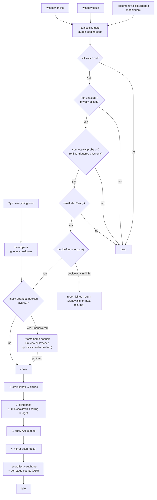
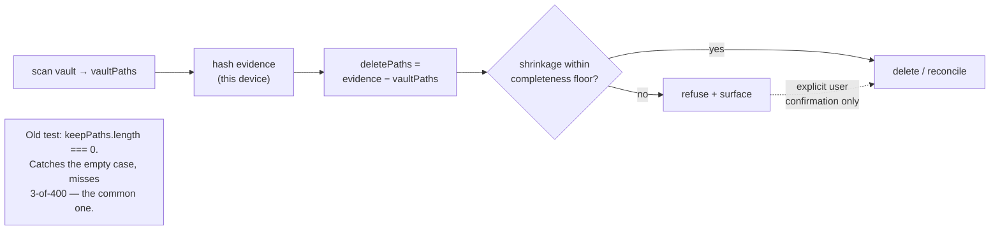
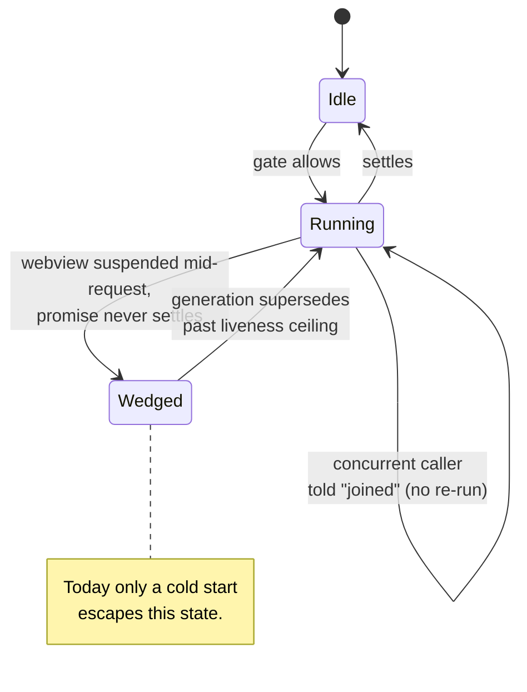

# feat: Catch up on resume (foreground trigger + Sync everything now)

## Goal Capsule

**Objective.** Atoms should do its catch-up work when the app comes back to the foreground, so a
user never has to force-quit Obsidian to get their captures filed. Add a manual "Sync everything
now" action as the explicit escape hatch.

**Product authority.** This document. `CLAUDE.md` non-negotiables override it. `docs/architecture.md`
is the system map; this plan amends its Ask mirror section (KTD7) and rewrites invariant 7 (KTD13).

**Shape of the work.** The trigger itself is small. Most of this plan is the three pre-existing
data-loss paths that the trigger converts from rare to routine, which is why this is a full-lane
change and why Phase A must land before the feature exists.

**Not active scope.** Any work while Obsidian is closed. Changes to how captures are classified or
what gets written. The Plus paid backfill "catch-up" feature
(`docs/plans/2026-07-28-003-feat-plus-vault-catch-up-plan.md`) is a different thing with a colliding
name — see KTD10.

**Blocking before implementation — all five are now answered.** The five Outstanding Questions that
changed this plan's unit set or its observable outcome are closed: **Q2** — keep U13 and R14, scoped to
inbox-stranded captures only, `BACKLOG_GATE_THRESHOLD = 50`, presented as a persistent inline banner on
Atoms home rather than a launch-time modal. **Q3** — yes, split Phase A: U1, U9, and U2's marker-time
re-verification (with U1's deletion-confirmation modal) ship as their own PR ahead of this feature; U2's
`Vault.process` migration stays here. **Q4** — filing is *underway* within a few seconds of the user
reopening the app; the bound is on start, not finish, which is why R4 is cut and U6 with it. **Q5** —
yes, add the passive "last caught up" surface; it is U15/R16. **Q8** — cut U11 to its own issue.
**Q6 is reopened** — the absence-keyed cooldown exemption it closed on is a
no-op on the platform this feature targets; the work-keyed replacement is specified in KTD4 and U3 as
of the 2026-07-31 round-2 doc-review, and the reopening records why the original rule was withdrawn.
Q1, Q6, Q7, Q9, and Q10 remain open and **do not block** — Q10 (connectivity-restore scope) is the most
likely next cut and is left standing deliberately.

---

## Product Contract

### Summary

Add a foreground/resume trigger that runs the same catch-up chain currently wired only to cold start,
plus a manual action that runs it on demand. Three pre-existing data-loss paths that the new trigger
makes routine are fixed first, in the same change, behind a settings kill switch.

### Problem Frame

Every piece of catch-up work in the plugin is wired to `app.workspace.onLayoutReady()`, which fires
once per cold start:

| Work | Current trigger | Fires on resume? |
|---|---|---|
| Inbox drain (capture → daily) | `onLayoutReady` (`src/plugin/main.ts:210`) + `atoms:drain-inbox` | No |
| Auto-run filing (daily → atom) | `onLayoutReady` + hourly interval (`src/plugin/main.ts:633`) | Not for up to an hour |
| Ask outbox apply | `onLayoutReady` + 60s interval (`src/plugin/main.ts:233`) | Within 60s |
| Ask mirror push | `onLayoutReady` + vault events on watched paths (`src/plugin/main.ts:352`) | Only if a watched file changes |

So phone captures sit in the inbox until the user kills and relaunches the app. That is the reported
complaint, and it is a lifecycle gap rather than a bug in any one stage.

Research turned up live hazards here. Each is verified against source, not inferred. **Correction
from review: these are not latent and the resume trigger is not what makes them routine** — the first
one already fires on every cold start, which on mobile is every relaunch:

1. **An ordinary delta sync can mass-delete the cloud mirror — today, on every launch.**
   `planAskMirrorDeletes` (`src/platform/askMirror.ts:264`) emits every path in this device's hash
   evidence that is absent from the current vault scan, and the delete loop at
   `src/plugin/main.ts:1385-1392` runs on **every** sync — it sits outside the `if (force)` block at
   `:1395`. `onLayoutReady` already calls `syncAskMirror({ force: false })` unconditionally
   (`src/plugin/main.ts:229`). So a phone with 3 of 400 atoms delivered issues ~397 deletes on
   relaunch right now, with no force flag and without the server's empty-reconcile guard ever being
   consulted.

   **Precondition, stated explicitly.** The wipe needs a device that is Ask-enabled with privacy
   acked and a live Plus session — `syncAskMirror` returns `-1` otherwise — *and* whose own hash
   evidence already holds N paths while the current scan returns far fewer. A device reaches that
   state either through a prior successful sync of its own, or through the `settings.askMirrorHashes`
   fallback read at `src/plugin/main.ts:1291`: `data.json` syncs, so a freshly-installed phone can
   inherit a desktop's 400-path evidence before a single `Atoms/*.md` has downloaded. That is the
   concrete route, and it is the common one on the platform this feature targets — but the frequency
   is conditional on that state, not unconditional on every cold start. Q3's split decision should be
   re-checked against the corrected frequency.

   Mobile cold start is when a vault is *least* delivered, and it is exactly the
   force-quit behaviour this feature exists to remove — so the wipe fires most often today for the
   users most affected. **This makes U1 and U9 urgent independently of this feature; see Open
   Question 3 on shipping them first.**
2. **The forced reconcile authorizes its own worst case.** `src/plugin/main.ts:1397` sets
   `confirmEmpty = keepPaths.length === 0` — the client asserts "yes, really empty" precisely when its
   own scan came back empty. The server guard described in
   `docs/qa/2026-07-27-ask-mirror-sync-security-review.md` exists to prevent "failed scan wiped brain",
   and the client defeats it.
3. **The inbox drain can lose an append that Sync delivers out-of-band.** *Severity corrected during
   review.* The in-process read → await → modify window is already narrowed: the drain re-reads the
   inbox immediately before the marker write, with a comment at `src/pipeline/inbox.ts:849` naming
   exactly this hazard. The live residual is Obsidian Sync **replacing the file out-of-band**, which
   `Vault.process` does not address because it serializes writers within this process only. So U2's
   load-bearing part is the marker-time re-verification, not the migration; the migration's real job
   is to be the precondition for retiring the drain's promise-join in U4. The repo has 13
   `vault.modify` calls and zero `vault.process`; the drain's two are `src/pipeline/inbox.ts:836` and
   `:859`.

A fourth, smaller one: `applyAskOutbox` acks entries as applied when `syncAskMirror` returns `≥ 0`
(`src/plugin/main.ts:1189-1196`), but `0` also means "deferred to an in-flight pass" (`:1222-1226`) —
so a concurrent push causes the outbox to ack writes the cloud never received. Resume adds a third
concurrent caller.

Shipping the trigger without fixing these would take latent data-loss paths and make them routine.

### Requirements

**R1.** A capture that reached the device while Obsidian was not in use is drained into its daily,
filed into an atom, and mirrored — without the user doing anything, and **filing is underway within a
few seconds of the user reopening the app** (Q4, closed). No force-quit required. **The bound is on
start, not finish:** a classify batch may legitimately take longer than a few seconds; what must not
happen is the work sitting untouched until the next cold start. The requirement is the outcome and the
bound; *how* the plugin notices the user came back is a technical decision, not a requirement — the
foreground-signal trigger lives in KTD1. **This bound is what rejects the interval-drain baseline** in
Alternatives Considered: the requirement is latency relative to the user's *attention*, not absolute
latency, and an hourly timer has no relationship to when the user is actually looking. It can fire
while the phone is in a pocket and still miss someone who opened the app minutes earlier.

**R2.** The resume trigger works on iOS and Android, not only desktop. Mobile is the platform the
complaint came from, and each platform gets its own verification.

**R3.** Repeated foregrounding does not repeatedly spend API allowance.

**R4.** *(Cut by Q4. Number retired, not reused.)* It read: a capture that Obsidian Sync delivers
*after* the resume signal is still filed in that session. A capture arriving 30 s late is filed on the
next app open; that is not data loss, and the 60-second watch window was sized on a single forum
anecdote. **U6 was cut with it** — see Scope Boundaries.

**R5.** The resume path stays silent. No notice per foreground. Auto-run's existing silence contract
(`CONCEPTS.md` § Auto-run) is preserved.

**Silence is not invisibility, and it does not cover integrity refusals.** Three reviewers converged
here, so the boundary is stated explicitly: routine outcomes are silent; a mirror-deletion refusal
(R8) is *not* a routine outcome and must reach the user. Refusals land in passive state — the Ask
mirror status line, which already has an error shape — rather than a notice, and a refusal that
persists across several consecutive passes may raise one notice. The exceptions to per-foreground
silence are therefore three, each once-per-device rather than once-per-foreground: R14's persistent
backlog banner, a persistent integrity refusal, and U14's one-time egress disclosure on first launch
after upgrade — which must be acknowledged before that device's first resume-triggered filing pass,
because a disclosure that arrives after the egress it discloses is not a disclosure.

**Refusal surface, specified.** A refusal renders in the Ask mirror status line as `Ask mirror: N ·
sync refused — vault scan incomplete · Sync everything now to retry`, and in the same status position
on Atoms home — Settings → Atoms is not a surface a phone user opens routinely, so a Settings-only
refusal is indistinguishable from silence. It clears on the first pass that passes the completeness
floor. "Persists" means **three** consecutive refused passes; that constant lives in KTD4's block.
U1 owns the copy and both surfaces.

**The escalation copy is scripted too.** On the third consecutive refusal the plugin raises one
Notice — the only Notice this plan adds anywhere, since U13's gate is now an inline banner (Q2) and
U14's disclosure is a persistent in-app notice, not a transient one — reading: `Atoms has not synced your
cloud mirror for the last three passes. Your vault scan looks incomplete, so nothing was deleted.
Run "Sync everything now" once your vault has finished downloading.` It is raised once per refusal
streak, not once per pass, and the streak resets on the first pass that clears the floor. U1 owns this
string and ships a scenario for it; without a scripted string and a test, the product's most important
data-safety alert would ship untested with implementer-invented wording.

**R6.** A manual "Sync everything now" action, available as a command and from Atoms home, runs the
whole chain on demand ignoring cooldowns, and forces a full mirror reconcile.

**R7.** The manual action reports honestly. It never says "0 synced" when it was absorbed into a
running pass, and never reports success before the forced reconcile has actually run.

**R8.** Mirror deletion is refused when the local vault scan is not credibly complete — on the delta
path as well as the forced path. An incomplete scan can never delete the user's cloud brain.

**R9.** The inbox drain does not lose a capture that arrives while the drain is running, and never
marks a capture filed unless its bullet is verifiably present in the daily.

**R10.** A stage that dies without settling — the iOS webview suspended mid-request — does not
permanently disable catch-up for the rest of the app's life.

**R11.** Today's daily note is never processed by the resume path or by the manual action. Forcing
today stays the separate, explicit action it is today (`CLAUDE.md` non-negotiable #3).

**R12.** Resume never runs before the vault index is ready, so it cannot create a duplicate inbox
note ahead of Sync delivering the real one.

**R13.** The resume trigger can be turned off from Settings without a new release.

**R14.** The first post-upgrade pass over a large stranded backlog asks before it starts, once.
Silently filing months of captures is not something the user opted into by updating a plugin.

**R15.** An outbox entry is acked only when the cloud confirmed receipt.

**R16.** The user can confirm catch-up ran without triggering it. A passive line — `Last caught up 4m
ago · 3 filed` — renders on Atoms home and in Settings → Atoms, sourced from the report data the sync
units already produce. Passive only: no notification, no toast. The reported complaint is a *trust*
problem, and a silent fix to a trust problem is not a fix.

### Acceptance Examples

| Situation | Expected |
|---|---|
| Phone capture written while Obsidian is backgrounded; user reopens the app | Capture drains into its daily and files into an atom, with no force-quit and no notice |
| User alt-tabs between Obsidian and a terminal ten times in a minute | At most one catch-up pass; the paid filing stage runs at most once |
| Sync delivers a capture 20 seconds after the app foregrounds | It waits for the next app open. **R4 was cut by Q4** — a capture arriving 30 s late is not data loss, and no watch window chases it |
| Phone foregrounds with 3 of 400 atoms delivered; ordinary delta sync runs | Zero deletes issued; the shrinkage is refused and surfaced |
| User taps "Sync everything now" on a phone whose `Atoms/` has not synced | Forced reconcile refuses; no cloud deletion |
| Resume fires while a filing pass from the previous resume is still running | No second pass starts; the caller is told it joined, never "0 synced"; newly-arrived work is picked up on the next resume |
| iOS suspends the webview mid-classify; user reopens hours later | The wedged pass is reset and catch-up runs normally |
| User taps "Sync everything now" while an auto pass is running | Reports that it joined the running pass, not "0 synced" |
| User has automatic filing off and taps "Sync everything now" | Filing runs for this explicit gesture (credentials and egress ack permitting); not a silent no-op |
| Crash between the daily write and the marker write; drain re-runs | The capture is neither duplicated nor lost |
| Mirror push is deferred mid-outbox-apply | No entries are acked; they remain pending |
| A capture that always fails to classify sits in the backlog | It is quarantined, stops driving re-runs, and remains recoverable |
| User upgrades with 400 inbox-stranded captures and foregrounds | A persistent banner on Atoms home offering Preview or Proceed; nothing files until they answer it |
| User wants to know whether catch-up ran, without making it run | Atoms home and Settings → Atoms both show `Last caught up 4m ago · 3 filed` |
| User turns off "Sync automatically on resume" in Settings | No foreground pass fires; the manual action still works |
| Captures in today's daily note | Excluded from resume and from the manual action |

### Scope Boundaries

- **In scope:** the foreground-signal device spike (U0), the resume trigger, the manual action, the
  data-integrity fixes named in the Problem Frame, liveness/reclaim correctness, the settings kill
  switch, the first-run backlog gate (U13, kept by Q2 and scoped to inbox-stranded captures), the
  passive "last caught up" surface (U15, added by Q5), the egress-ack copy update (U14), and the
  docs/version tail.
- **Split ahead of this plan (Q3, closed — yes).** U1, U9, and U2's marker-time re-verification —
  together with U1's deletion-confirmation modal — ship as their own PR **before** this feature. A live
  cloud-atom wipe is shipping today and must not wait behind a 12-unit feature, and a guard whose
  escape hatch lands in Phase C is a trap (F1). U2's `Vault.process` migration stays behind in this
  plan as the precondition for retiring the drain's promise-join result-share in U4.
- **Also in scope, and not requested:** connectivity-restore mirror push. KTD7 takes a previously
  deferred P1 on the grounds that the same listener set answers it, then states in the same decision
  that it needs a new probe and its own file — so it is not free. No requirement names it. **Its scope
  is open — see Q10.** Named here so it is discoverable without reading KTD7.
- **Cut by Q4 — R4 and U6.** R4 promised that a capture Obsidian Sync delivers *after* the resume
  signal is still filed in that same session, and U6 was the 60-second post-resume inbox watch that
  chased it. Both are cut: a capture arriving 30 s late is filed on the next app open, which is not
  data loss, and the 60-second window was sized on a single forum anecdote. The latency that matters is
  latency relative to the user's attention (R1), and R1 is already met the moment filing starts.
- **Cut by Q8 — U11 (Plus checkout poll migration).** Deferred to its own issue. The plan's own reason:
  it implements zero requirements, and "a regression here is invisible to this feature's QA" — so it
  deserves its own commit, its own check, and its own review surface, not a ride into a full-lane
  feature. `src/platform/plusResume.ts` keeps its two raw listeners until that issue lands.
- **Out of scope:** any processing while Obsidian is closed (`CLAUDE.md` — no always-on headless);
  changes to classification, prompts, or what gets written; capture UI; the Plus paid backfill path.

#### Deferred to Follow-Up Work

- **U11 — migrating the Plus checkout poll (`src/platform/plusResume.ts:89,92`) onto the shared
  trigger.** Cut from this plan by Q8; needs its own issue, carrying the behavior-change note that the
  poll must stay exempt from the resume cooldown while `awaitingCheckout` is set.

- Migrating the other 11 `vault.modify` call sites to `Vault.process`. This plan migrates only the
  drain's two. The rest are listed in the cited solution doc and need their own issue.
- A user-visible surface for quarantined captures. U10 makes the count readable via
  `atoms:auto-run-status`; a real UI is a separate product decision.
- Multi-window leader election on desktop. Effect-layer idempotency covers correctness, and Web Locks
  is not safe to assume in the iOS webview.
- Server-side proportional-delete refusal (see Risks). The client-side floor in U1 is the fix this
  plan ships; a server backstop is the durable one and belongs to `plus-service`.

### Outstanding Questions

**Q2, Q3, Q4, Q5 and Q8 are closed** — their answers are recorded in place below, with the original
framing kept underneath for the record. **Q1, Q6, Q7, Q9 and Q10 remain open and none of them blocks
implementation.** Q10 (connectivity-restore scope) is the most likely next cut and is left standing.

1. **Midnight edge.** A capture written at 23:58 becomes "past" at 00:00, so a 00:05 resume files it
   minutes later. Correct under the current day rule, but it slightly weakens the "today's daily is
   quiet" promise. The plan does not change the day rule.
2. **CLOSED — keep U13 and R14, scoped to inbox-stranded captures only, as a persistent inline banner
   on Atoms home.** The gate counts **only captures sitting in the capture inbox that have never been
   drained** — not total unprocessed work, and not daily-note captures, which auto-run already files
   today. That population is the one auto-run has never been able to reach, and it only becomes filable
   because this plan adds the drain trigger. `BACKLOG_GATE_THRESHOLD = 50`: below ~50 the spend is
   pennies and the interruption costs more than it saves. **The surface changed from a launch-time modal
   to a banner** that sits on Atoms home until answered — the "once means once *answered*, not once
   *shown*" property the unit already argues for is preserved; only the presentation moves, from
   interrupting launch to sitting in place until acted on. It still routes through KTD15's injected host
   `confirm` (F28), because a banner still needs a testable confirm. *Original framing, kept for the
   record:* the earlier
   argument for cutting it compared two different populations and does not survive the correction.
   Auto-run *already* files a past backlog unattended today — `shouldRunAutoProcess` returns true
   same-day while work remains and the hourly interval re-enters — but its backlog counter enumerates
   **daily notes**, so the behaviour users already live with is captures that are *already in
   dailies*. The gate protects **undrained inbox captures**, a population auto-run has never been able
   to reach and which only becomes filable because this plan adds the drain trigger. Those are not the
   same consent. **Lean: keep it, scoped to the inbox-stranded backlog only** — count what the drain
   is about to move into dailies, not what auto-run could already see. Nothing else depends on it.
   *Doc-review 2026-07-31 (round 2): the population equivalence behind the earlier cut lean was
   wrong; getting it wrong means the first foreground after upgrade silently spends API allowance
   filing months of captures the user never consented to. U13 carries an explicit pointer back to this
   question, and its dismissal-stall defect is fixed in place, so the unit is safe either way — but
   the scoping is still your call.*
3. **CLOSED — yes, split Phase A.** U1, U9, and U2's marker-time re-verification ship as their own PR
   ahead of this feature; U2's `Vault.process` migration stays behind in this plan. **U1's
   deletion-confirmation modal ships with that PR** — F1: a guard whose escape hatch lands in Phase C is
   a trap, and if Phase A ships separately the trap is permanent. Rationale: a live cloud-atom wipe is
   shipping today and must not wait behind a 12-unit feature. *Original framing, kept for the record:*
   Holding the highest-severity fix behind a 12-unit feature leaves a live cloud-brain wipe shipping for the
   duration of a full-lane change. **Lean: yes, split them out now.** *Doc-review 2026-07-31: the
   frequency claim behind this urgency is now stated with its precondition (Problem Frame hazard 1) —
   the wipe needs a device holding stale hash evidence while scanning a mostly-undelivered vault,
   which is common on mobile but not unconditional. Re-check the lean against that. The earlier claim
   that the remainder drops to a light lane is withdrawn: what remains spans `main.ts`, two new
   modules, settings, home UI, a quarantine subsystem, docs and a version bump — that is still full
   lane.*
   **Extended (round 2): U2's marker-time re-verification belongs in the same accelerated PR.** The
   accelerated set was chosen because its hazard already fires today independent of the trigger; the
   drain's torn-write is the same shape — it fires on every cold start — and U2 already isolates that
   piece from its non-urgent `Vault.process` migration half. U2's dependencies read "None (parallel
   with U1)", so nothing blocks including it. **Lean: pull U1, U9, and U2 step 3 forward together**,
   leaving only the `Vault.process` migration behind as the precondition for retiring the chain's
   promise-join in U4.
4. **CLOSED — filing is underway within a few seconds of the user reopening the app. Start, not
   finish.** The requirement is latency relative to *attention*, not absolute latency. An hourly timer
   has no relationship to when the user is actually looking: it can fire while the phone is in a pocket
   and still miss someone who opened the app minutes earlier. That is what justifies the foreground
   trigger over the interval-drain alternative, and it is now R1's bound. **Consequence: R4 is cut and
   U6 with it** — the same-session promise for a capture Sync delivers 30 s late is not worth a
   60-second watch window sized on one forum anecdote; that capture is filed on the next app open, which
   is not data loss. U3, U4, U5 survive; U4 keeps only its liveness/reclaim half.
5. **CLOSED — yes, add it.** It is **U15 / R16**: a passive `Last caught up 4m ago · 3 filed` line on
   Atoms home and in Settings → Atoms, sourced from the report data the sync units already produce.
   **Passive only — no notification, no toast.** Rationale: the complaint is a *trust* problem, and a
   silent fix to a trust problem is not a fix. *Original framing, kept for the record:* The reported complaint is a
   *trust* problem — the user force-quits because they cannot tell whether filing happened — so a fix
   that is invisible by contract may not change the habit. There is currently no way to confirm a
   resume pass ran without triggering one, which also means the objective has no signal the user *or
   QA* can observe. **Concrete shape:** a passive line in the same status position on Atoms home and
   in Settings → Atoms reading `Last caught up 4m ago · 3 filed`, plus what the paid stage has spent
   today — sourced from the per-stage counts U9's tri-state result and U7's reporting path already
   produce, so it reads existing report data rather than adding new instrumentation. It breaks no
   silence: it is passive state, like the refusal line beside it. **Lean: add it.** *Escalated to
   blocking by round 2: resolving it toward "add it" creates a new Phase C unit, which is the exact
   criterion used to mark Q2, Q3 and Q4 blocking. Shipping without it means the habit this feature
   exists to end may persist unchanged even after the trigger works, and no QA pass can prove
   otherwise without triggering the thing it is trying to observe.*
6. **Reopened 2026-07-31 (round 2) — how is the returning-from-absence filing-cooldown exemption
   keyed?** It was closed on an **absence-keyed** rule: a resume following an absence longer than the
   filing cooldown skips that cooldown for its first pass. That rule is a **no-op on the platform this
   feature targets.** The plugin does not run while backgrounded, so the last filing pass always
   precedes the absence — an absence longer than the cooldown implies the cooldown was already
   satisfied, and the rule can never change an outcome. It also takes an absence-duration input
   nothing produces, since cooldown state is deliberately not persisted (KTD3). Worse, the case that
   actually breaks the headline acceptance example — a short background right after a filing pass — is
   the one the absence rule explicitly excludes. **Replaced with a work-keyed exemption:** waive the
   filing cooldown on any resume pass whose drain produced a capture the previous filing pass did not
   see, capped at one waiver per resume signal. Specified in KTD4 and tested in U3. Repeated
   foregrounding that drains nothing new still pays the cooldown, so R3 holds. This question stays
   open only to record why the absence rule was withdrawn; it does not block.
7. **Is "Sync everything now" the right name?** KTD10 flags it as the plan's weakest decision. It
   sits near the existing narrower "Sync now" and competes with Obsidian's own Sync feature. Review's
   counter-proposal: **"Process everything now"**, reusing the Preview/Process vocabulary Atoms home
   already ships, which removes the overloaded word entirely. **Resolve the same-plugin collision as
   well as the Obsidian-Sync one** — the two are separated today only by which screen they sit on, and
   the new action can spend on paid classify while the old one cannot (KTD10 now states the test the
   chosen name has to pass). Naming is a product call, so it is yours.
8. **CLOSED — cut U11.** It is removed from this plan's units and deferred to its own issue, on the
   plan's own reason: it implements zero requirements, and "a regression here is invisible to this
   feature's QA". Recorded in Scope Boundaries; a tombstone sits where the unit was.
9. **Should "Sync everything now" ask before the paid stage when automatic filing is off?** KTD11
   runs filing regardless of the enablement flag to avoid a silent no-op — right instinct — but a
   user who disabled filing to control spend gets charged by a button whose name promises syncing,
   not classifying. Option: run the free stages immediately and ask once before the paid stage,
   remembering the answer for the session. Trades one tap for informed consent.
10. **Should connectivity-restore mirror push stay in this plan?** KTD7 admits it is "not requested"
    and defends taking the deferred P1 as free "because the same listener set already carries the
    signal" — then states in the same decision that it needs a **new probe** that neither existing
    helper can supply and its **own file**. Both cannot be true: the scope argument for taking
    unrequested work is retracted by the decision that implements it. No requirement mentions it, so it
    is an orphan, and it adds a recurring outbound beacon on every network transition (which F25's gate
    ordering now bounds but does not remove). **Options:** (a) keep it as scoped, accepting an
    unrequested unit inside a full-lane change; (b) drop the `online` listener and its probe from this
    plan, move it to follow-up work with a pointer to `ask-mirror-parity.md` KTD4 where the deferral
    was written, and narrow KTD7 to a note that the resume listener set makes it cheap to add later.
    **Lean: (b)** — the plan's own precedent is Q8, now closed by cutting requirement-less work out.
    **This is the most likely next cut, and it is left standing deliberately.** Does not
    block: if it stays, it is already specified; if it goes, U5 loses one signal and one file.

---

## Planning Contract

### Key Technical Decisions

**KTD1 — Foreground detection is three DOM events funnelled into one gate.** There is no first-party
resume event in the Obsidian API. Research enumerated every `Workspace`, `Vault`, and `MetadataCache`
event in the installed `obsidian` 1.13.1 typings; none is a foreground signal, and
`window-open`/`window-close` are popout windows rather than OS backgrounding. Every comparable plugin
— `vrtmrz/obsidian-livesync`, `No-Instructions/Relay`, `hjinco/synch`,
`hyungyunlim/obsidian-social-archiver` — converges on `document` `visibilitychange` (guarded on
not-hidden) + `window` `focus` + `window` `online`, routed into one debounced handler. The two
visibility signals are not redundant: `visibilitychange` does not fire when an Electron window merely
loses focus behind another app, and `focus` does not fire in cases visibility does.

**KTD2 — Every listener goes through `registerDomEvent`.** It is documented as detaching on unload.
The repo uses it nowhere today, and `src/platform/plusResume.ts:89,92` leaks two listeners that stack
on every dev plugin reload.

**KTD3 — Resume cooldown state is an in-memory monotonic timestamp; quarantine state is persisted.**
Wall-clock time is not monotonic (NTP correction, DST, sleep/wake skew), so a persisted `Date.now()`
comparison can be defeated by a clock change, and a monotonic epoch is per-process so persisting it is
meaningless. Cooldown state therefore adds **no** localStorage key.

**Everything else this plan persists is device-local, and every key is named here.** An earlier draft
said quarantine was "the stated exception" and then accreted four more pieces of device-local state
across later decisions, none of them named — which leaves an implementer to invent the names, and one
unit to borrow a key that is not its own. These keys must **never** reach `data.json`, which syncs;
they are device-local evidence in the same class as the mirror hashes.

| Key | Owner | Holds | Why device-local |
|---|---|---|---|
| `atoms-quarantine-v1` | U10 | Capture identity hash, failure count, redacted failure code, first/last attempt | Worthless unless it survives restart; another device should still retry |
| `atoms-filing-budget-v1` | KTD4 / U3 | Rolling 60-minute filing timestamps | iOS reclaims the webview, so an in-memory budget is no bound at all; spend is per device |
| `atoms-mirror-scan-highwater-v1` | U1 | High-water mark of the scanned path count, with its decay timestamp | The completeness floor is measured against *this* device's evidence; a synced mark would import another device's baseline |
| `atoms-backlog-gate-v1` | U13 | Pending / answered state of the first-run backlog banner | The gate is per device, like the trigger it guards; U13 previously said it shared the quarantine key — it does not |
| `atoms-egress-notice-v1` | U14 | Whether this device acknowledged the widened trigger set | Egress happens per device, and the existing egress-ack flag is already stored this way |
| `atoms-resume-enabled-v1` | U12 | The "Sync automatically on resume" kill switch | A synced switch cannot mute one misbehaving phone (see U12) |
| `atoms-last-catchup-v1` | U15 | Wall-clock timestamp and per-stage counts of the last completed pass, for the passive "last caught up" line | It reports what *this* device did; a synced value would claim a desktop's pass as the phone's. Display-only, so wall-clock skew costs nothing (contrast the cooldown, above) |

**KTD4 — Concrete cooldowns, and the rolling filing budget stacks on top of `PER_LAUNCH_CAP`.** These are
decisions, not implementation details, because they govern spend. All live in one exported constants
block so they are tunable in one place.

| Knob | Value | Why |
|---|---|---|
| Signal coalescing debounce | 750 ms, leading edge | Matches shipping precedent; a resume is a discrete action, so act on the first signal and suppress the rest |
| Minimum interval between resume passes | 30 s | Shipping precedent; absorbs alt-tab storms |
| Filing-stage cooldown | 10 min | The only paid stage; needs its own far longer gate than the free drain (per-stage, not one gate) |
| Filing budget | 15 captures per rolling 60 min, **persisted** | **Stacks on top of** `PER_LAUNCH_CAP`; does not replace it (see correction below) |
| Liveness ceiling | 10 min general, 30 min filing | A classify batch can legitimately run long; everything else cannot |
| ~~Post-resume watch window~~ | — | **Cut with R4 and U6 (Q4).** It was 60 s, sized against a single forum report of ~30 s Sync lag; a capture that arrives after the pass is filed on the next app open |
| **New-work filing-cooldown waiver** | one waiver per resume signal, when the drain produced a capture the previous filing pass did not see | **Replaces the absence-keyed exemption (Q6, reopened).** Keying on absence was a no-op: the plugin does not run while backgrounded, so an absence longer than the cooldown implies the cooldown was already satisfied, and the case that actually breaks the headline example — a short background right after a filing pass — was the one it excluded. Keying on *work* fires exactly when there is something new to file. Repeated foregrounding that drains nothing new still pays the cooldown, so R3 holds |
| Consecutive refusals before one notice | 3 | Integrity refusals stay passive state until they persist (R5) |
| Connectivity-probe minimum interval | 5 min | Bounds probe volume independently of the resume gate (KTD7); restated in U1's constants block with its siblings |
| Deletion completeness floor | `max(5, highWaterMark × 0.8)` | Not a spend knob — it and its three siblings live in **U1's named constants block**, which is the single place to change them |

**Two corrections from review.** First, `PER_LAUNCH_CAP` is **not** launch-scoped: it is passed as
`maxCaptures` to `runWritePath` on every pass (`src/plugin/main.ts:750`), and the hourly interval
re-enters while past work remains (`src/platform/autorun.ts:38`), so today's real throughput is
already ~15 per hour. Keep it as the per-pass bound and add the rolling window on top; deleting it
would *uncap* a single pass, which is the opposite of the intent. The rolling window is therefore
close to a no-op against today's spend — its job is to bound resume-triggered passes specifically,
and the plan should not claim more.

Second, the budget must be **persisted** (a device-local key alongside `atoms-quarantine-v1`, never
`data.json`). KTD3 keeps the anti-alt-tab debounce in monotonic memory, which is right, but iOS
reclaims webview memory routinely — an in-memory budget resets to empty on every process reload,
which on the platform this feature exists for means no bound at all. Wall-clock skew makes a
persisted budget slightly wrong; a reset budget makes it unbounded, and only one of those costs the
user money.

**KTD5 — The shared-promise join keeps its lock and loses its result-share.** `drainInboxOnce`
(`src/plugin/main.ts:294`) returns the *running* promise, so a concurrent caller receives that pass's
result. Correct for de-duplicating two callers who want the same work; wrong for resume, where the
trigger fires *because Sync just delivered a capture* — the caller would join a pass that already read
the inbox and report `0 filed` as if that were the truth. The fix is honesty, not a re-run: a caller
that arrives mid-pass is told it **joined** (U9's tri-state), never handed another pass's counts, and
the work it brought is picked up on the next resume.

**Cut with R4 (Q4): the dirty/epoch re-run.** An earlier draft generalized the follow-up-flag semantic
`syncAskMirror` uses via `askMirrorFollowUp` (`:1237-1243`) into a chain-wide dirty flag, so that work
arriving mid-pass triggered a second pass in the same session. That existed to serve R4, and R4 is
cut. Without it the re-entrancy question stops being a contradiction: a dirty re-run had to either loop
straight back into the chain (running the paid stage twice inside a minute, breaking the alt-tab
acceptance example) or re-enter the gate with nothing waived (leaving a +20 s capture drained but
unfiled, breaking R4). Neither branch is needed now — **the alt-tab acceptance example simply holds**,
because there is no re-run to reconcile it against.

**The join's other role survives, and that is the whole of what U4 keeps here.** The F1 comment at
`:174` says the join exists to stop "a second read-modify-write that would double-append" — so it is an
in-process **single-flight lock** as well as a result-share. U2's content-keyed dedupe does **not**
replace the lock: U2 step 2 requires the recomputed dedupe be diffed against *pre-pass* content only, so
two genuine same-second captures both file (the shipped Q2 decision at `src/pipeline/inbox.ts:826`) —
which means a second drain body whose own pre-pass snapshot also lacked the bullet writes it again.
After U5 the drain has four callers, so that concurrency is designed in, not hypothetical.
U4 therefore **keeps the single-flight lock and drops only the result-sharing**: no caller receives
another pass's counts, and the double-append guard survives. U2 remains a dependency of U4 for the
out-of-band Sync case it genuinely covers — not for in-process serialization, which the lock still
owns. All three drain callers migrate at once: a partial migration where resume gets the tri-state
while `runDrainInbox` still joins would make the command report counts from a pass it did not run,
which is the same dishonesty R7 forbids, leaking into a path nobody is watching.

**KTD6 — In-flight flags get a liveness reset.** `autoRunInFlight` is cleared only in `finally`
(`:816`) and by `onunload`. On iOS the OS can suspend the webview mid-`requestUrl` so the promise never
settles, leaving the flag stuck `true`, after which `maybeAutoRun` returns `"in_flight"` forever
(`:719`). Today only a cold start clears that, which is survivable; once resume is the primary trigger
it means filing silently dies for the life of the app. Each guarded stage records a start timestamp
and generation; a pass past the liveness ceiling is superseded. `onunload` also nulls `drainInFlight`,
which it currently does not.

**KTD7 — The `online` event is a named amendment to the Ask mirror architecture, and its probe must
be free and uncredentialed.** `docs/solutions/architecture-patterns/ask-mirror-parity.md` KTD4
states: "No mirror poll interval … Connectivity-restore catch-up is P1, not silent scope creep."
This plan takes that P1 deliberately, because the same listener set already carries the signal.
*Not free, though:* it needs a new probe that neither existing helper can supply, so the work is
real and U5 owns the file — which is why **whether this belongs in this plan at all is now Q10**. The
rest of this decision specifies it on the assumption it stays.

`navigator.onLine` in a mobile webview reports online with no usable route, so the handler needs a
real probe — but **neither existing probe may be used on this path**, and review found that following
repo precedent here would have been actively harmful:

- `probeAnthropicApi` (`src/platform/connectivity.ts:98`) POSTs to `/v1/messages` with `x-api-key`
  set. It bills, and it egresses the user's key on every network transition.
- `probeHttpsBaseline` (`:58`) GETs `https://api.github.com/zen` — a third party the user never
  consented to, which would learn their IP and Obsidian-usage timing on every wifi/cellular handoff.
- `runConnectivityTest` is the only entry point `main.ts` already imports (`:121`, `:1031`), and it
  calls the billed one. Today its sole caller is the user-invoked `atoms:test-connection` command;
  turning that deliberate diagnostic into an unattended background beacon is not acceptable.

Use a **new, unauthenticated** reachability check against the Plus base URL, living in
`src/platform/connectivity.ts` alongside the two it must not reuse, and give it its own minimum
interval (KTD4). **Position it downstream of the coalescing gate and the kill switch**, so an
`online` storm cannot fire N probes and a disabled kill switch fires zero.

**And downstream of the cloud-feature gate.** The gate ordering is: coalescing gate → kill switch →
**Ask enabled *and* privacy acknowledged** → probe → `vaultIndexReady` → decision. Without that third
condition, a device that never enabled the cloud features still beacons the vendor on every network
transition, disclosing its IP and Obsidian-usage timing to a service the user is not a customer of —
which is the identical objection this decision uses to reject `probeHttpsBaseline`, applied to our own
backend and left ungated. `syncAskMirror` already enforces exactly this precondition and returns `-1`
without it (`src/plugin/main.ts:1216`), but the probe sits upstream of that check, so the refusal it
relies on never runs. U5 asserts zero probe requests on a device with the cloud features off.

Reusing `askMirrorStatus` was considered and rejected: it takes a required `sessionToken`
(`src/platform/plusClient.ts:532`), so it is a credentialed call and fails the uncredentialed
requirement this KTD exists to state. U5 must therefore assert what the probe *sends*, not only that
a failing probe blocks the pass — the path of least resistance is `runConnectivityTest`, already
imported by `main.ts`, which calls the billed key-egressing one.

**KTD8 — Resume gates on `vaultIndexReady`, and does not re-await `waitForVaultIndexReady`.** That
helper (`src/platform/autorun.ts:105`) resolves in ~150 ms once the cache is warm, so on a resume it
returns almost immediately and says nothing about whether Sync has finished delivering. Reusing it as
the resume gate would look correct and fire too early. The chain gates on the existing plugin-level
`this.vaultIndexReady` flag (`:185`), and `ensureInboxNote` stays off the resume path entirely — it
belongs to cold-start bootstrap, where the F2 comment at `:248` explains why.

**KTD9 — Force is for the manual action only; the completeness floor applies to both paths.**
`force: true` performs a full-orphan reconcile that removes server paths this device never hashed —
appropriate for an explicit gesture, not for something firing on every foreground. But delta deletes
by hash evidence too, so KTD12's floor gates **both**. Resume pushes delta; only the manual action
forces.

**KTD10 — Naming.** The new action is **"Sync everything now"**. Settings keeps its mirror-only
**"Sync now"** (`src/settings/settings.ts:1166`), disambiguated by sitting inside the Ask mirror
section. "Catch-up" is avoided as a product-facing name because the Plus backfill plan owns it — **which is why
U12's toggle is "Sync automatically on resume" and not "Run catch-up on resume"**, as an earlier draft
had it. The rule applies to every surface this plan adds, not only the manual action.
**The near-synonym is not safe on this plugin's own surface, and that is the harder half.** Settings'
existing "Sync now" does a mirror-only delta reconcile: free, and it cannot touch the paid path. "Sync
everything now" runs the whole chain, forces a full reconcile, and **can spend on paid classify even
when automatic filing is disabled** (KTD11). Separating them by which screen they sit on addresses
discoverability, not the consequence — a user who knows the first taps the second expecting a mirror
sync and gets a bill. The deletion path stays safe behind U1's completeness floor; the spend surprise
has no equivalent guard, which is what Q9 is about. **Test the chosen name against this:** does it
signal that the action costs money? "Sync" does not, on any screen. *The action's own name therefore
remains open — see Q7, which proposes "Process everything now" and must resolve the same-plugin scope
difference as well as the collision with Obsidian's own Sync feature.*

**KTD11 — The manual action honors consent gates but not the enablement gate.** Routing the button
through `maybeAutoRun` unchanged would mean a user with automatic filing off taps "Sync everything
now" and gets a silent no-op. It is an explicit gesture, so it runs filing regardless of the device's
auto-run *enabled* flag, while still requiring egress ack and valid credentials, and still never
touching today's daily. Absent either, it says so rather than failing silently.

*Open: whether it should ask once before the paid stage when the enablement flag is off — the action's
name promises syncing, not classifying, so the gesture may not carry consent for the spend. See Q9.*

**KTD12 — Mirror deletion is gated on scan completeness, not on emptiness.** This is the plan's most
important decision and it supersedes the narrower `confirmEmpty` fix. `LS_ASK_MIRROR_SERVER_COUNT`
(`src/platform/askMirror.ts:11`, written at `src/plugin/main.ts:1439`) already records what the server
last held, so the client can tell "the user deleted atoms" from "this device hasn't synced yet".
Deletion — delta or forced — is refused when the scan shrank beyond a proportional floor, unless the
user explicitly confirmed. Emptiness is just the extreme case of shrinkage, which is why fixing only
`confirmEmpty` would have left the common failure open.

**KTD13 — Invariant 7 is rewritten, deliberately.** `docs/architecture.md` invariant 7 states that
outbox ack waits for successful land **and** mirror. The current code violates it by acking on a
deferred push (`:1189-1196` treating `0` as success). U9 makes the code honest and the invariant
explicit rather than silently changing behavior.

**KTD14 — A settings kill switch, default on.** R1 wires the trigger unconditionally and filed atoms
cannot be un-filed, so without a switch the only recovery from misbehaviour on someone's phone is a
new release — through BRAT, at the user's own pace. "Sync automatically on resume" is independent of the
auto-run enabled flag, which only gates the paid stage rather than the trigger or the drain.

**KTD15 — Orchestration lives in `src/plugin/catchUp.ts`, not in `platform/` and not in `main.ts`.**
`docs/architecture.md` puts device gates in `platform/` and wire-up in `plugin/`. (Correction: its
dependency rule constrains `pipeline/`, `home/`, `resurface/`, and `ui/` and does not explicitly name
`platform/`, so the layering argument rests on the module map's stated roles plus the two concrete
grounds below, not on an explicit prohibition.) Chain orchestration needs the plugin instance, so putting it in
`platform/resume.ts` would drag a fat host interface across the boundary and make resume the second
god-object. It cannot go in `main.ts` either — already ~2170 lines and named in `CLAUDE.md` as "not a
dumping ground". The new module takes an **injected host interface**, which also solves the test
problem: no test in the repo imports `main.ts` (`test/mocks/obsidian.ts` stubs `Plugin` as an empty
class), so chain behavior is only testable if it is written against a fake host.

**Confirmation is part of that host interface, not a surface the units construct.**
Two units need a user verdict in the unit suite — U1's deletion-confirmation modal and U13's backlog
banner (Q2 changed U13's chrome from a modal to a banner; **it did not change this seam**, because a
banner needs a testable confirm exactly as a modal did) — and the shared Obsidian mock stubs `Modal`
with no children, no buttons and no event wiring, while
`vitest.config.ts` runs a node environment with no DOM implementation in devDependencies. No test in
the repo drives a modal or renders a view. So the host exposes a **`confirm(request) → confirmed |
declined | dismissed`** method; both units' scenarios drive a fake host and assert on that verdict, and
the concrete surface that implements it — U1's `Modal` subclass, U13's home banner — is verified
through the CLI/device gate in the
Verification Contract rather than `npm test`. Without this, both units' scenarios quietly become
no-ops and the dismissal-stall fix and the confirmation gate ship untested.

### Assumptions

- **`document.visibilitychange` fires on Obsidian's iOS and Android webviews.** *Inferred, not
  documented.* Every actively-maintained cross-platform Obsidian sync plugin ships it as their core
  resume signal with `isDesktopOnly: false` and none special-cases mobile out of it — if it did not
  fire, their sync-on-resume would be visibly broken. No Obsidian documentation states it outright.
  **Load-bearing for R2; must be verified on a real phone, per platform, not inferred from a desktop
  smoke test — and verified *before* Phase B, not at merge.** U0 is the spike that does it. Placing
  the only test in the merge-time device gate means six units land before anyone learns whether the
  trigger fires on the platform the complaint came from, and the Definition of Done as originally
  written permitted recording a negative result and shipping anyway. A negative spike result stops
  Phase C and routes to the interval-drain alternative; it does not get recorded and waved through.
- The Capacitor `App` lifecycle API is reachable at runtime in Obsidian mobile but is undocumented,
  absent from `obsidian.d.ts`, and used by no comparable plugin for resume detection. Deliberately not
  used. (One research pass claimed it was load-bearing on iOS; the source-level survey of shipping
  plugins contradicts that, and the survey is the stronger evidence.) **This is a rejected option,
  not the fallback.** If U0 disproves the visibility assumption, the fallback is the interval drain
  below: add `drainInboxOnce()` to the existing hourly tick, keep Phase A, and drop U3, U4 and U5.
  Routing a failed assumption to an undocumented API absent from the typings and used by no
  comparable plugin — when the alternative analyzed one section later needs no assumption at all —
  is the weaker of the two branches.
- Obsidian Sync can deliver files tens of seconds after foreground; a forum report cites ~30 s. **No
  longer load-bearing:** it sized U6's watch window, and Q4 cut both. A late-delivered capture is filed
  on the next app open.
- The server hard-deletes on reconcile rather than tombstoning. If it tombstones, the rollback story
  improves materially — worth confirming against `plus-service` before U1.

### Alternatives Considered

- **Add the inbox drain to the existing hourly interval — the cheap baseline.** Surfaced in review and
  not previously considered. The plugin already runs an hourly `maybeAutoRun` interval
  (`src/plugin/main.ts:633`) and a 60 s outbox interval; the *only* stage missing from any interval is
  the drain. Adding `drainInboxOnce()` to the existing tick closes the reported complaint in a few
  lines, keeps the double-append join intact, and needs none of KTD1's unverified mobile-visibility
  assumption, no listener/coalescing/cooldown machinery, and neither U2 nor U4. The earlier rejection
  ("a polling interval") cited `ask-mirror-parity.md` KTD4 — but that bans a *mirror* poll interval,
  not an inbox drain, and the incremental battery cost on a timer that already exists is near zero.
  **Rejected on Q4's answer (closed):** filing must be *underway within a few seconds of the user
  reopening the app*. The bound is on attention, not on elapsed time, and an interval has no
  relationship to attention — it can fire while the phone is in a pocket and still miss a user who
  opened the app minutes earlier. It survives as the fallback if U0's spike comes back negative, where
  the coarser bound would be accepted knowingly rather than by default.
- **A mirror poll interval.** Still rejected: `ask-mirror-parity.md` KTD4 forbids it outright.
- **Reusing `drainInboxOnce`'s shared-promise join for the whole chain.** Rejected on the stale-result
  grounds in KTD5 — the lock is kept, the result-share is not. This was the plan's original shape.
- **A chain-wide dirty/epoch re-run.** Cut with R4 (Q4). It existed to file a capture that arrived
  mid-pass in the same session, and it could not be reconciled with the alt-tab example without
  threading a cooldown waiver through it. See KTD5.
- **Fixing only `confirmEmpty`.** Rejected once research showed the delta delete path is the common
  case (KTD12). This was also the plan's original shape.
- **Persisting the last-resume timestamp.** Rejected per KTD3.
- **Landing Phase A as its own PR first. Chosen (Q3, closed).** The phases are cleanly separable, and
  the original argument for keeping them together — the trigger is what makes the fixes urgent — is
  retracted by the Problem Frame's own correction that hazard 1 already fires without the trigger. The
  boundary is Phase A/B, with two adjustments: U2 splits so its marker-time re-verification goes
  forward and its `Vault.process` migration stays, and U1's deletion-confirmation modal goes with the
  accelerated PR rather than waiting for Phase C.

---

## System-Wide Impact

**Method signatures changing.** Each is reachable from CLI commands and the home view, so a shape
change is user-visible, not internal:

| Method | Change | Callers to update |
|---|---|---|
| `drainInboxOnce` (`:294`) | Result-share retired (single-flight lock kept), tri-state result | `bootstrapInbox` (`:273`), `runDrainInbox` (`:323`) |
| `applyAskOutbox` (`:1098`) | Empty-on-busy → tri-state; ack only on confirmed push | `onload` (`:226`), 60s interval (`:235`), `:593`, `:1620`, **and `src/settings/settings.ts` — the outbox apply the Ask mirror section invokes** |
| `syncAskMirror` (`:1216`) | `0`-on-deferred → tri-state | `:229`, `:392`, `:590`, `:1189`, `:1617`, **and `src/settings/settings.ts` — the "Sync now" button handler (`:1166`) and the status-line refresh that reads its result** |
| `maybeAutoRun` (`:719`) | Adds liveness supersede; rolling budget stacks on top of the per-pass cap | `:630`, `:636`, `:674` |

**The settings call sites are not optional inventory.** Settings' own sync button branches on the
numeric return value to choose between "reconciled" and "uploaded N atoms"; under the tri-state that
comparison silently misreports, and `src/settings/settings.ts` is not otherwise in U9's file list, so
no test would catch it. U9 owns those three call sites and asserts the button reports reconciled,
uploaded and joined distinctly.

**Entry points converging on the chain.** Nine triggers now exist. The plan re-points `onLayoutReady`
bootstrap, the resume signals, and the manual action at the shared chain; it leaves the hourly auto-run
interval, the 60 s outbox interval, the vault-event mirror debounce, the two CLI commands, and the
pre-existing Plus checkout resume listener (`src/platform/plusResume.ts`, which **stays standalone —
U11 was cut by Q8**) running standalone. That distinction is deliberate — the intervals are the healing
path if the trigger fails — but every one of them must go through the same in-flight state, or the
guards are per-caller rather than global.

**Failure propagation.** `docs/architecture.md` invariant 7 is rewritten by U9 (KTD13). Chain-stage
failure semantics are newly defined: a stage that throws does not abort the remaining stages, since the
mirror push failing must not prevent the inbox from draining; each stage records its own failure for
backoff. Mirror hard-failure (`-1`) mid-outbox-loop acks nothing and leaves entries pending.

**Platform parity.** `docs/architecture.md` invariant 6 forbids a desktop-only watcher:

| Signal | Desktop (Electron) | iOS | Android |
|---|---|---|---|
| `visibilitychange` | Fires on minimize/tab-hide | Primary signal (assumed) | Primary signal (assumed) |
| `focus` | Primary signal; covers window-blur that visibility misses | Unreliable | Unreliable |
| `online` | Fires | Fires; `navigator.onLine` may lie | Fires; may lie |

Each row needs its own verification. Android is not a footnote to iOS.

**Surfaces reading stale state.** Atoms home counts, Settings' Ask mirror status line, and the CLI
output of `atoms:drain-inbox` / `atoms:auto-run-status` all change shape under tri-state results and
must be updated in the same change rather than silently reporting the new "joined" outcome as zero.

**Surfaces added.** Atoms home gains three new render positions and Settings → Atoms one: the mirror
refusal line (U1, net-new on home), the backlog banner (U13), and the passive "last caught up" line
(U15, on home and in Settings). All three sit in the same status region and must not fight each other
for it — the refusal outranks the passive line, and the banner sits above both.

---

## High-Level Technical Design

Directional guidance for review, not implementation specification.

### Trigger to chain

### The deletion gate — why emptiness was the wrong test

### Pass lifecycle — why a dead pass must be reclaimable

---

## Implementation Units

Grouped into phases. **Phase A must land before Phase C exists** — it is the difference between fixing
latent hazards and shipping a trigger that fires them.

### Phase A — Make the existing paths safe

> **Phase A ships as its own PR, ahead of this feature (Q3, closed — yes).** The accelerated set is
> **U1** (including its deletion-confirmation modal — F1: a guard whose escape hatch lands in Phase C is
> a trap, and if Phase A ships separately the trap is permanent), **U9**, and **U2 step 3** — the
> marker-time re-verification, whose hazard fires on every cold start exactly like U1's. **U2 steps 1,
> 2 and 4 — the `Vault.process` migration — stay behind in this plan**, where their only job is to be
> the precondition for retiring the drain's promise-join result-share in U4. A live cloud-atom wipe is
> shipping today and must not wait behind a 12-unit feature.

### U1. Gate mirror deletion on scan completeness

**Goal.** An incomplete local scan can never delete the user's cloud atoms, on either the delta or the
forced path.

**Requirements.** R8.

**Dependencies.** No unit dependencies — land first. **But two service-side confirmations against
`plus-service` are prerequisites, not risk notes:** (a) whether reconcile **hard-deletes or
tombstones**, which sets how severe the refusal has to be and whether a rollback story exists at all;
and (b) the **TTL and abort semantics of a chunked reconcile session** (`:1406`), which decide the
branch the chunked-path scenario below has to assert on. Assumptions and Risks each say "confirm
before U1" and nothing enforced it; both are Verification Contract rows and a Definition of Done item
now, and the answers are recorded in this unit before merge.

**Files.**
- `src/platform/askMirror.ts` — the completeness predicate and the named constants block below, beside
  `planAskMirrorDeletes` (`:264`), **plus the extracted upsert/delete/reconcile loop** (see below)
- `src/plugin/main.ts` — the delete loop (`:1385-1392`) and the forced reconcile (`:1394-1418`),
  reduced to a thin caller
- `src/settings/settings.ts` — the Ask mirror status line, which renders the refusal, and the existing
  "Sync now" button, which is where the confirmation modal is wired (see below)
- `src/home/atomsHomeView.ts` — the equivalent status position on Atoms home. **Net-new: this surface
  does not exist today**, so it is a new render, not an edit to an existing line
- `test/askMirror.test.ts`

**Extraction is a precondition, not a refactor.** The Verification Contract makes "a test observed
failing against pre-fix code" a merge gate for this unit, and the 3-of-400 delta case cannot be
written where the loop lives: no test imports `src/plugin/main.ts` (vitest aliases `obsidian` to a
stub whose `Plugin` is an empty class), so a test in `test/askMirror.test.ts` can only reach the pure
predicate. Move the loop into `askMirror.ts` behind an injected host (vault scan, request fn,
localStorage, **and KTD15's `confirm` method**) — the same move KTD15 makes for the chain — before
writing the regression test.

**Named constants.** This is the plan's self-declared most important decision, so its threshold is
stated here rather than left to the implementer. All of these live in one exported block in
`askMirror.ts`; KTD4's decisions table points here.

| Constant | Value | Why |
|---|---|---|
| `MIRROR_COMPLETENESS_FLOOR` | `max(5, highWaterMark × 0.8)` scanned paths | Refuse deletion when the scan falls below this. The `max(5, …)` arm keeps a genuinely tiny vault from being wedged by rounding; the ratio is what discriminates "the user pruned" from "this device has not synced" |
| `MIRROR_HIGHWATER_DECAY_DAYS` | 30 | The high-water mark decays to the current scanned count after 30 days with no refusal, which is the "stated expiry" the ratchet rule referred to and never stated. It also drops on an explicitly confirmed reconcile. Without a release condition, one large legitimate prune wedges the device forever |
| `BACKLOG_GATE_THRESHOLD` (U13) | **50** inbox-stranded captures | Set by Q2, which also fixed the population: captures sitting in the capture inbox that have never been drained, not daily-note captures. Below ~50 the spend is pennies and the interruption costs more than it saves |
| `QUARANTINE_EXPIRY_DAYS` (U10) | 14 | A backstop only — version bump and model change are the primary expiries (U10 step 3). Long enough that a multi-day API outage does not thrash, short enough that a device which never updates still retries |
| `CONNECTIVITY_PROBE_MIN_INTERVAL` (KTD7) | 5 min | Restated from KTD4 so all four thresholds read in one place |

*The ratio is the value most open to your revision.* Reviewers split between 0.8 and 0.9; 0.8 is taken
because too tight permanently wedges a user who genuinely pruned, and the ratchet bound below already
covers the slow-shrinkage case that a looser ratio would otherwise leave open.

**This unit owns the deletion-confirmation modal, and ships it wired.** The floor refuses deletion
"unless the user explicitly confirmed", and until something can produce that gesture the refusal has
no release valve — a user who legitimately deleted many atoms has a permanently divergent mirror.
Deferring the modal to U7 leaves that gap for the whole of Phases B and C, and **permanently, because
Phase A does ship as its own PR** (Q3, closed). So the modal lands **here**, wired behind the **existing Settings
"Sync now" button**, which exists today: when that button's reconcile is refused by the floor, the
modal is offered. U7's manual action reuses it rather than building it. The modal names the concrete
numbers — evidence count, scanned count, last known server count — and follows `BackfillConfirmModal`'s
shape; it is presented through KTD15's host `confirm` method so its scenarios are testable under
`npm test`. This is the same reasoning the plan already applied to the egress-consent copy in U14, and
it was not applied here.

**Approach.**
1. Add a pure predicate taking the scanned path count, the delete count, the last known server count
   (`LS_ASK_MIRROR_SERVER_COUNT`), and an optional **confirmation token**; returning allow or a
   refusal reason.
   **The confirmation is a token, not a boolean.** A boolean has no origin, so no test can assert a
   confirmation came from the modal rather than being improvised from `force` — which is exactly the
   scenario this unit declares. Model it as an opaque `DeletionConfirmation` type with a **single
   constructor, called only by the modal's confirmed branch**, unexported beyond that call site. The
   scenario then has something to assert: the guard refuses without the token, and no other path in
   the module can construct one.
2. **Gate the delta delete loop** — this is the main fix. Three corrections from review, each of
   which defeated the naive version:
   - **Denominator must be this device's own evidence size, not the server count.** `deletePaths`
     comes from `planAskMirrorDeletes(vaultPaths, hashSnapshot)` (`src/plugin/main.ts:1347`) where
     `hashSnapshot` is *this device's* evidence map, while `LS_ASK_MIRROR_SERVER_COUNT` is the
     server's total across all devices. Comparing one to the other makes the floor a no-op on exactly
     the devices at risk: 60 paths in evidence against a 400-row server passes `max(5, 400×0.2)` and
     deletes all 60.
   - **Gate on scan completeness, not delete magnitude.** Delete count cannot distinguish "the user
     deleted 50 atoms" from "50 atoms have not synced yet" — which is the discrimination R8 exists to
     make. Refuse when the scan is too small relative to this device's evidence, independent of how
     few deletes that implies.
   - **Bound cumulative shrinkage — concretely.** `LS_ASK_MIRROR_SERVER_COUNT` refreshes from
     `askMirrorStatus` at the end of every successful run, so a sequence of individually-within-floor
     passes ratchets the mirror down (400 → 320 → 256) and achieves what one over-floor pass is
     refused. Persist a **device-local high-water mark of the scanned path count** (alongside the hash
     evidence, never `data.json`) and evaluate the floor against *that*, not against the previous
     pass's evidence size — so each pass is measured against the pre-shrinkage baseline rather than
     the freshly-lowered one. Lower the mark only on an explicitly confirmed reconcile, or after a
     stated expiry. A per-pass-only floor leaves the ratchet open, and the resume trigger makes
     multi-pass routine rather than rare.
3. **Gate the forced reconcile** on the same predicate, and stop deriving `confirmEmpty` from
   `keepPaths.length === 0`. It becomes an explicit input carried by the confirmation token, which
   **only this unit's confirmation modal can construct** — never derived from `force`, from scan
   size, from emptiness, or from the fact that a command was invoked. This unit owns both the
   consumer and the gesture that produces it; U7 reuses the modal (without an owning unit, the
   cheapest invention is exactly the bug KTD12 supersedes).
4. A refusal is surfaced, not swallowed — the user needs to know the mirror did not converge. This
   unit owns the copy and both surfaces named in the Product Contract's *Refusal surface, specified*
   note: the Ask mirror status line **and** the equivalent position on Atoms home.
5. **Keep the existing delete-then-persist order.** An earlier draft called for persisting evidence
   before issuing deletes; that inverts which inconsistency is survivable. Today `askMirrorDelete`
   (`:1387`) runs before `writeAskMirrorHashes` (`:1391`), so a crash leaves evidence still naming a
   deleted path and the next delta pass re-issues an idempotent delete and self-heals. Reversed, a
   failed delete drops the path from evidence while the server still holds it — and since
   `planAskMirrorDeletes` derives deletes solely from evidence, no future pass can ever remove it.
   At-least-once with an idempotent remote call is the correct shape here.

**Patterns to follow.** Pure predicate with injected values in the shape of `shouldRunAutoProcess`
(`src/platform/autorun.ts:24`) and `planAskMirrorDeletes` itself.

**Execution note.** Test-first. Write the 3-of-400 delta case against current code and watch it issue
397 deletes before changing anything — that failing test is the proof this closed.

**Test scenarios.**
- 400 in evidence, 3 in scan, delta sync → zero deletes issued; refusal surfaced.
- 400 in evidence, 399 in scan (user deleted one atom) → the delete proceeds; the floor does not block
  legitimate use.
- Scan returns zero paths, force requested, no explicit confirmation → reconcile does not run.
- Scan returns zero with explicit confirmation → reconcile runs with `confirmEmpty` true.
- Non-empty scan that shrank past the floor, force requested → **refused** regardless of gesture unless
  explicitly confirmed. (This replaces the earlier draft's scenario, which codified the bug.)
- Chunked path (>500): intermediate chunks always send `confirmEmpty: false`; only a genuinely
  confirmed-empty final chunk may set it true.
- No prior server count recorded (first ever sync) → floor cannot be evaluated; deletes are refused
  rather than allowed by default. **And the device exits that state**: assert the count is recorded
  after the first successful upsert-only pass, so a device whose first sync failed is not stuck
  refusing forever.
- **Ratchet:** three consecutive passes, each individually within the floor, against a scan that
  keeps shrinking → refused at the pass where cumulative shrinkage from the high-water mark crosses
  the floor.
- A delete failing mid-loop leaves the remaining paths in evidence, so the next pass retries them.
- The guard refuses with no confirmation token, and no path in the module other than the modal's
  confirmed branch can construct one — assert both halves, since the second is what makes the first
  meaningful.
- A refusal renders on both surfaces (Ask mirror status line and Atoms home), and clears on the first
  pass that passes the floor.
- **Three consecutive refused passes → the scripted escalation notice is raised exactly once**, with
  the literal text in the Product Contract's *Refusal surface* note; a fourth consecutive refusal
  raises no second notice, and a pass that clears the floor resets the streak.
- Refused reconcile → the fake host's `confirm` is called with the evidence, scanned and last-known
  server counts; a `confirmed` verdict re-runs the reconcile with the token, `declined` and
  `dismissed` both leave the mirror untouched and no stuck state behind.
- An explicitly confirmed reconcile lowers the high-water mark; an unconfirmed refused one does not.
- The high-water mark decays to the current scanned count after `MIRROR_HIGHWATER_DECAY_DAYS`
  without a refusal, so a user who legitimately pruned is not wedged forever.

**Verification.** A delta sync against a vault with 3 of 400 atoms present leaves the server count
unchanged and reports the refusal.

---

### U2. Atomic inbox writes with verified marker placement

**Goal.** The drain stops losing captures that arrive while it runs, and never marks a capture filed
unless its bullet is verifiably in the daily.

**Requirements.** R9.

**Dependencies.** None (parallel with U1).

**This unit ships in two pieces (Q3, closed).** **Step 3 — the marker-time re-verification — goes into
the accelerated Phase A PR with U1 and U9**, because its hazard fires on every cold start today,
independent of the trigger; it is also the load-bearing half, per the Problem Frame's severity
correction. **Steps 1, 2 and 4 — the `Vault.process` migration — stay in this plan**, where their job
is to be the precondition for retiring the drain's promise-join result-share in U4. Split the test
scenarios along the same line: the marker-time and torn-write scenarios travel with step 3.

**Files.**
- `src/pipeline/inbox.ts` — the write sites at `:836` and `:859`, and the dedupe at `:831`
- `test/inbox.test.ts`

**Approach.**
1. Migrate both writes from `vault.modify` to `Vault.process`, available in the installed typings and
   well under `minAppVersion` 1.11.4.
2. **The migration only fixes anything if the decision moves inside the callback** — but the
   recomputed dedupe must still exclude *this pass's own additions*. `:828-836` computes `additions`
   from a `dailyContent` read taken outside the write, so wrapping it as-is atomically re-applies a
   stale decision. Recompute against the callback's data, **diffed against the pre-pass content
   only**. The naive version reverses a shipped decision: the comment at `src/pipeline/inbox.ts:826`
   records that two genuine same-second captures with identical text must *both* file — "dropping one
   is the failure to avoid, filing twice is recoverable (Q2)". Deduping against content this pass
   just wrote would silently drop the second, inside the unit whose goal is to stop losing captures.
   `Vault.process` callbacks may re-run, so they must be synchronous and side-effect-free — which
   also means step 3's cross-file re-verification (read the daily, write the inbox marker) cannot
   live inside a single-file `process()` callback. **Where it runs, stated:** the daily is re-read
   immediately before entering the inbox `process()` callback, and the verified capture set is passed
   *into* the callback, which then does nothing but decide markers from that set synchronously.
3. **Condition the marker write on re-verifying the bullet is present in the daily** at marker time,
   rather than trusting the earlier loop's result. `Vault.process` serializes writers within this
   process only; Obsidian Sync replaces files out-of-band, so a daily write can land, the marker can be
   written, and Sync can then merge the daily and drop the bullet — leaving a capture marked filed and
   gone. Re-verification is the only thing that catches that.
   **Stated plainly: this narrows the out-of-band merge window, it does not eliminate it.** Because
   the re-read happens outside the callback, a Sync replacement landing between the re-read and the
   marker write is still possible — a shorter window than today's, not a closed one. The recovery
   path for that residual is the **unmatched-capture fallback**: a capture whose bullet is absent from
   the daily is left unmarked and re-drained on the next pass, which is why step 3 conditions the
   marker rather than repairing the daily. An implementer must not read this step as closing the
   hazard.
4. Key the dedupe by content (`stamp + body`) on the **daily** side as well as the inbox side, not by
   line index.

**Patterns to follow.** `docs/solutions/logic-errors/read-modify-write-lost-update-synced-file.md`
§ Prevention. Its test list is a coverage claim — diff this unit's tests against it, per
`docs/solutions/logic-errors/partial-adoption-of-a-cited-solution-doc.md`.

**Execution note.** Test-first, and the regression test must inject the concurrent append *inside the
awaited dependency*. Calling the drain twice does not open the window and will pass against the buggy
code.

**Test scenarios.**
- Concurrent append lands mid-drain, injected inside the awaited dependency → the late capture survives.
- Crash between the daily write and the marker write → re-run neither duplicates the bullet nor loses
  the capture.
- Same, but the filing pass has since appended a `↳ [[title]] <!--linker-->` sentinel under the bullet →
  dedupe still matches, because it is content-keyed rather than string-adjacent.
- Daily bullet absent at marker time (simulating a Sync merge that dropped it) → no marker is written;
  the capture stays pending.
- A capture already carrying a filed marker is not filed twice.
- Blank line drifted between capture and marker (the Sync-merge shape) still reads as filed, on both
  the parse and write halves.
- Empty capture filtering unchanged.
- `Vault.process` callback re-run yields the same result.

**Verification.** The existing inbox suite passes plus the new concurrency and torn-write tests; no
behavior change for a user with no concurrency.

---

### U9. Tri-state busy results and the outbox ack fix

**Goal.** A caller can tell "nothing to do" from "someone else is doing it", and an outbox entry is
acked only when the cloud confirmed it.

**Requirements.** R7, R15.

**Dependencies.** None. Phase A — this is a live data-loss path independent of resume.

**Files.**
- `src/plugin/main.ts` — `applyAskOutbox` (`:1098`, ack at `:1189-1196`), `syncAskMirror` (`:1216`),
  reduced to thin callers
- `src/plugin/catchUp.ts` (new) — the result type **and the extracted outbox apply loop**
- `src/settings/settings.ts` — **the three call sites that branch on the numeric return value**: the
  "Sync now" button handler (`:1166`), the status-line refresh that reads its result, and the outbox
  apply the Ask mirror section invokes. Omitting this file is how the button silently misreports
- `test/catchUp.test.ts` (new)

**Extraction is a precondition, same as U1.** The ack-on-deferred regression cannot be observed
failing where the loop lives — no test imports `main.ts`. Move the outbox apply loop into
`catchUp.ts` behind an injected host before writing the test; otherwise `test/catchUp.test.ts` only
exercises a result type and the merge gate is met on paper.

**Approach.**
1. Introduce a tri-state outcome — did work (with counts) / joined a running pass / failed — replacing
   the ambiguous empty-result and `0` returns.
2. **Fix the ack.** `applyAskOutbox` currently breaks only on `n < 0` and acks on `n === 0`, but `0`
   also means "deferred to an in-flight pass" (`:1222-1226`), so a concurrent push acks writes the
   cloud never received. Ack only on a confirmed push. This rewrites `docs/architecture.md` invariant 7
   (KTD13).
3. Update every caller listed in System-Wide Impact, including CLI-facing output.

**Execution note.** Test-first, like U1 and U2 — the Verification Contract makes "a test observed
failing against pre-fix code" a merge gate for this unit too, and it is the one of the three that
never said so in its own unit. Write the acknowledge-on-deferred regression test first, confirm that a
concurrent push gets its entries acknowledged while the cloud received nothing, and only then fix it.
The tri-state and the ack fix stay in one unit — the tri-state *is* the mechanism that fixes the ack,
and splitting them means shipping a sentinel value as a stopgap.

**Test scenarios.**
- Mirror push deferred → zero entries acked; all remain pending.
- Mirror hard-fails (`-1`) mid-outbox-loop → no acks; remaining entries untouched.
- Mirror push confirmed → entries acked exactly once.
- A busy caller receives "joined", distinct from "did work, count zero".
- Re-running after a deferred push acks the entries that then land.
- **Settings' "Sync now" button reports reconciled, uploaded N atoms, and joined as three distinct
  outcomes** — the numeric comparison it uses today collapses two of them under the tri-state.

**Verification.** `atoms:auto-run-status` and the outbox CLI path report the joined state distinctly
from a zero-work state.

---

### Phase B — Mechanism

### U0. Device spike: does the foreground signal actually fire?

**Goal.** Learn whether `visibilitychange` fires in Obsidian's iOS and Android webviews **before**
building against the assumption, not at merge.

**Requirements.** Gates R1, R2.

**Dependencies.** None. **Land first in Phase B — this unit gates whether Phase C is built at all.**

**Files.**
- A throwaway branch build; nothing merges from this unit except its recorded result and a note in
  Assumptions.

**Approach.** Register `visibilitychange`, `focus`, and `online` via `registerDomEvent` and log each
fire with a timestamp. Install via BRAT on a real iOS device and a real Android device. Background the
app, wait, reopen; repeat with the screen locked and with an app switch. Record which signals fire on
each platform.

**Why this is its own unit.** The assumption is marked *inferred, not documented* and load-bearing for
R2, yet its only test sat in the merge-time device gate — six units (U1, U2, U9, U3, U4, U12) would
land before anyone learned whether the trigger fires on the platform the complaint came from. Three of
those now ship in the accelerated Phase A PR (Q3) regardless of the spike, which sharpens rather than
softens the point: the ones still at risk are the ones the spike gates. This costs a fraction of one
unit.

**Branch on the result.**
- **Fires on both platforms** → proceed to U3 and the rest of the plan unchanged.
- **Does not fire on one or both** → **stop before Phase C.** Route to the interval-drain alternative:
  keep Phase A and add `drainInboxOnce()` to the existing hourly `maybeAutoRun` tick. Do not route to
  the Capacitor API (Assumptions explains why it is a rejected option, not a fallback). **Every unit
  that named U5 as a dependency gets an explicit disposition — none of them dies by dependency chain**,
  which is what an earlier draft's "drop U3–U6 and U11" left to inference (U6 and U11 have since been
  cut outright by Q4 and Q8, so only three units are actually at stake here):

  | Unit | Disposition under a negative spike |
  |---|---|
  | U3 resume decision module | **Dropped.** Its cooldowns exist to bound an event trigger; the hourly tick is already bounded |
  | U4 reclaimable chain | **Dropped.** The drain keeps its promise-join whole, since the stale-result hazard (KTD5) is a resume problem |
  | U5 trigger wiring | **Dropped.** This is the unit the spike gates |
  | ~~U6~~ | Already cut by Q4, before the spike. Nothing to dispose of |
  | ~~U11~~ | Already cut by Q8, before the spike. Nothing to dispose of |
  | **U7 "Sync everything now"** | **Kept.** It is a headline objective (R6) and needs no resume signal at all. It ships against the **retained promise-join drain** rather than U4's reclaimable chain, and gets its honest reporting from U9's tri-state, which is Phase A |
  | **U1 deletion guard, U2 drain, U9 tri-state** | **Kept unchanged**, and already shipped — they are the accelerated Phase A PR (Q3), which lands before the spike is even run |
  | **U10 quarantine** | **Kept.** It bounds repeat spend on the hourly tick exactly as it would on a resume pass (R3) |
  | **U12 kill switch** | **Kept, retargeted** to gate the interval drain stage. R13 is met in a narrower form: the user can stop unattended draining without a release |
  | **U13 backlog gate** | **Kept.** The first-post-upgrade backlog hazard comes from the drain becoming automatic, not from *which* trigger makes it automatic. The banner and the inbox-stranded scoping (Q2) are unaffected |
  | **U14 egress copy** | **Kept, rewritten** to name the interval-driven drain and the manual action instead of the foreground event. The trigger set still widens |
  | **U15 passive surface** | **Kept, and it matters more, not less.** Under an hourly bound the user has even less idea whether catch-up ran; it reports the interval pass instead of the resume pass |
  | **U8 docs and version** | **Kept, retargeted** to the shipped shape |

  **Requirements the fallback does and does not meet.** Met: R3, R5–R16. **Not met: R1** — the fallback
  files within the hour rather than within a few seconds of the user reopening the app, which is the
  bound Q4 set and the reason the interval baseline was rejected on merit. **R2 is moot** rather than
  met, since there is no resume trigger to verify per platform. Record both in the PR; a negative spike
  means shipping a knowingly weaker R1, not a silently redefined one.

**Test expectation: none — a spike, not shipped code.**

**Verification.** A recorded per-platform result, pasted into the PR and into Assumptions. A negative
result is a successful spike, not a failure.

---

### U3. The resume decision module

**Goal.** A pure, unit-testable decision core for "may this stage run right now", with DOM wiring
behind a thin adapter.

**Requirements.** R3, R10.

**Dependencies.** None.

**Files.**
- `src/platform/resume.ts` (new) — pure only, zero Obsidian imports
- `test/resume.test.ts` (new)

**Approach.**
1. A pure function taking monotonic now, per-stage last-run times, last-failure time, in-flight state
   with its start time, and the KTD4 constants; returning which stages may run and a reason for each
   that may not.
2. Failure backoff is a distinct input from cooldown — a failure pushes the next attempt out rather
   than retrying at cooldown cadence forever.
2b. **The new-work filing-cooldown waiver (KTD4, Q6 reopened).** The function takes **whether the
   pass's drain produced a capture the previous filing pass did not see** — not how long the app was
   backgrounded. The absence-keyed version this replaces was a no-op: the plugin does not run while
   backgrounded, so an absence longer than the cooldown implies the cooldown was already satisfied,
   and it took an absence-duration input nothing produces (KTD3 does not persist cooldown state).
   When there is genuinely new drained work, the paid stage is exempt from the filing cooldown for
   that pass, capped at **one waiver per resume signal** — so the three DOM signals that a single
   foreground can produce (KTD1) cannot earn three waivers between them. Repeated
   foregrounding that drains nothing new pays the full cooldown, so R3 is unaffected.
3. A liveness verdict so the caller can supersede a wedged pass (KTD6).
4. Export the KTD4 constants block from here.
5. A host-adapter interface for the signal source, so DOM listeners are substitutable in tests. No
   timers, no platform APIs, no I/O in the pure function.

**Patterns to follow.** `shouldRunAutoProcess` (`src/platform/autorun.ts:24`) for the pure predicate;
`LocalStorageLike` (`src/platform/filingAuth.ts:152`) for injected-host shape.

**Execution note.** Test-first, driven by plain numbers rather than fake timers — that is the point of
separating the decision from the scheduling.

**Test scenarios.**
- First ever call → runs.
- Exactly at the cooldown boundary → runs; one millisecond before → refused with a cooldown reason.
- Cheap stage allowed while the paid stage is still cooling.
- Rolling filing budget exhausted → paid stage refused, cheap stages still allowed; budget frees as the
  window slides.
- In-flight pass younger than the liveness ceiling → refused as in-flight; older → reported dead.
- Filing gets the longer liveness ceiling than the other stages.
- A recorded failure pushes the next attempt past the plain cooldown; success clears the backoff.
- Monotonic clock jumps backwards → treated as no time passed, never as "cooldown satisfied".
- A pass whose drain produced a capture the previous filing pass did not see → the paid stage runs
  inside the filing cooldown; a second foreground ten seconds later, having drained nothing new, does
  not.
- Ten foregrounds in a minute with no new drained work → no waiver at any of them; the paid stage runs
  at most once (the alt-tab acceptance example).
- One waiver per resume signal — asserted by driving all three coalesced DOM signals off one
  foreground and confirming the paid stage is exempted once, not three times.

**Verification.** Every branch covered with no timers and no mocked globals.

---

### U4. Reclaimable chain

> **Scope halved by Q4.** This unit used to carry a dirty/epoch re-run as well as the liveness reset.
> The re-run served R4, and R4 is cut — so **the dirty-marking and the re-run-on-dirty logic are gone**.
> What remains is the half that stands on its own: a pass that never settles must be reclaimable, and
> a caller that arrives mid-pass must be told it joined rather than handed stale counts.

**Goal.** The chain recovers from a pass that never settles, and stops handing concurrent callers
another pass's results.

**Requirements.** R10.

**Dependencies.** **U2** (the join is the current double-append guard — KTD5), U3, **U9** (it creates
`src/plugin/catchUp.ts`, which this unit edits).

**Files.**
- `src/plugin/catchUp.ts` — the orchestration, against an injected host (KTD15)
- `src/plugin/main.ts` — guard fields (`:167-185`), `drainInboxOnce` (`:294`), `onunload` (`:616`),
  and both drain callers: `bootstrapInbox` (`:273`), `runDrainInbox` (`:323`)
- `test/catchUp.test.ts`

**Approach.**
1. Retire the join's *result-sharing* in favour of U9's tri-state, migrating all three drain callers at
   once — **but keep the in-process single-flight lock.** The join has two roles and only the
   result-share is retired (KTD5); U2's content-keyed dedupe deliberately does not suppress a genuine
   same-second duplicate, so admitting concurrent drain bodies would double-append. One body at a
   time, and no caller gets another pass's counts — a caller that arrives mid-pass is told it joined,
   and the work it brought is picked up on the next resume.
2. Liveness reset and generation counter per KTD6; `onunload` nulls `drainInFlight`.
3. Define chain-stage failure semantics: a throwing stage does not abort the rest; each records its own
   failure for backoff.

**Patterns to follow.** `drainInboxOnce`'s promise-join is the shape to retire — its lock half stays,
its result-share half becomes U9's tri-state.

**Execution note.** Do not change `shouldStampLastRunDay` semantics — stamping on attempt was a shipped
bug (`docs/solutions/logic-errors/autorun-stamp-on-attempt-blocks-same-day-retry.md`).

**Test scenarios.**
- Two callers invoke the drain concurrently → one body runs; the same capture is appended once, not
  twice. (This is the guard the retired result-share used to provide as a side effect.)
- A caller arriving mid-pass receives "joined" and **never** the running pass's counts — the stale-result
  dishonesty KTD5 names, asserted directly rather than papered over by a re-run.
- `bootstrapInbox` and `runDrainInbox` both behave correctly under the new contract.
- A pass whose promise never settles is superseded past the liveness ceiling; a later pass runs.
- Stage 2 throwing does not prevent stages 3 and 4.
- `onunload` mid-pass leaves no state that blocks the next load.
- Day-stamp behavior unchanged: no stamp on throw, no stamp while past work remains.

**Verification.** Liveness reclaim and join-reporting asserted against the fake host; guard behavior
exercised via the CLI drain commands on the test vault.

---

### U12. Settings kill switch

**Goal.** Resume can be turned off without a new release.

**Requirements.** R13.

**Dependencies.** **U9** — it creates `src/plugin/catchUp.ts`, which this unit edits. Must land before
U5 so U5's gate can read it.

**Files.**
- `src/settings/settings.ts` — the toggle, near the existing Ask mirror controls
- `src/plugin/catchUp.ts` — the gate reads it
- `test/catchUp.test.ts`

**Approach.** A "Sync automatically on resume" toggle, default on, independent of the auto-run enabled flag
(which gates only the paid stage, not the trigger or the drain). The manual action ignores it — turning
off automation should not remove the escape hatch.

**It persists device-locally, with only its UI in settings.** The value lives in
`atoms-resume-enabled-v1` (KTD3's key table), alongside the existing auto-run device state — **never
in `data.json`**, which syncs. This is the only control that stops unattended spending, and a
vault-global one cannot do that job: a user could not mute a misbehaving phone without disabling
resume on every device, and flipping it on at a desktop would silently enable the trigger on devices
they never intended. The repo already stores exactly this class of gate device-locally — the auto-run
enable flag and the egress acknowledgment — while keeping their UI in Settings, so this follows
precedent rather than inventing a pattern.

**Test scenarios.** *Scoped to what exists when this unit lands.* The trigger (U5) and the manual
action (U7) do not exist yet, and both depend on this unit — so their scenarios live with them, not
here:
- The gate predicate returns "blocked" when the toggle is off and "allowed" when on.
- The gate ignores the toggle when the caller is the manual path.
- **The toggle's value is absent from the synced settings file** — assert `data.json` never carries it
  — and two devices hold independent values: turning it off on one leaves the other on.
- Toggle is independent of the auto-run enabled flag: changing one does not change the other.

*Moved out:* "no foreground pass fires for any of the three signals" → U5. "the manual action still
runs fully" → U7.

**Verification.** Unit-level via the gate predicate. End-to-end (toggle off, foreground, observe no
pass in the CLI log) is verified in U5, where a trigger exists to observe.

---

### Phase C — The feature

### U14. Egress acknowledgment copy

**Goal.** The recorded consent artifact names the real trigger set before the trigger widens it — not
after.

**Requirements.** Supports R1; carries the consent obligation formerly buried in U8.

**Dependencies.** None. **Must land with or before U5.**

**Files.**
- `src/settings/settings.ts` — the egress acknowledgment copy at `:756`
- `test/` — a test asserting an already-acked device still files after upgrade

**Why this is its own unit.** The copy previously sat in U8, which depends on every other unit — so
between U5 landing and U8 landing, and permanently if the phases ship as separate PRs, capture bodies
leave the device under a string that says egress happens "when Obsidian opens." The ack is the
plugin's sole recorded egress-consent artifact. Tying it to the behavior is the same discipline Phase
A applies to the data-loss fixes.

**Approach.** The current ack reads: "I understand auto-run will send my vault title graph and each
capture to the Anthropic API over TLS **when Obsidian opens** (unattended)." After this change,
capture bodies also leave on every foreground (R1) and on a manually tapped action with auto-run
disabled (KTD11). Rewrite it to name the actual trigger set.

**The literal acknowledgment sentence**, at the specificity the refusal copy already uses — an
implementer authoring consent copy from a brief will under- or over-state the trigger set, and nothing
is reviewable until the unit lands:

> I understand Atoms will send my vault title graph and each capture to the Anthropic API over TLS,
> unattended — when Obsidian opens, when it returns to the foreground, and when I tap "Sync everything
> now", which classifies even when automatic filing is turned off.

**The literal upgrade notice**, shown once per device on the first launch after upgrade:

> **Atoms now catches up when you reopen the app**
>
> Filing used to run only when Obsidian started. It now also runs each time you come back to the app,
> and whenever you tap "Sync everything now" — that button classifies even when automatic filing is
> turned off, so it can spend your API allowance.
>
> Each capture is sent to the Anthropic API over TLS, the same as before. You can turn the automatic
> part off under Settings → Atoms → Sync automatically on resume.
>
> [ Got it ]

The manual action is named explicitly in both strings because it is the case most likely to be
omitted: it spends even for a user who turned automatic filing off precisely to stop spending.
*If Q7 renames the action, both strings are touch points.*

**KTD16 — the existing ack carries forward; the widened scope is disclosed, not re-gated.** A re-ack
gate would silently stop the paid stage for every user who does not notice the prompt — the same
invisible-failure mode U10 and U12 exist to prevent, and a worse outcome than the disclosure gap it
closes. So: carry the ack forward with rewritten copy, and surface the widened scope through a
one-time in-app notice on first upgrade. *(This resolves what U8 previously left to whoever wrote the
copy.)*

**"Once" means once *acknowledged*, and it lands before the first resume-triggered filing pass.** The
notice persists until the user acknowledges it, recorded in `atoms-egress-notice-v1` (KTD3), and the
resume path's paid stage is blocked on that device until it is. A transient notice fails here for the
same reason U13 rejected one: a phone user who backgrounds the app mid-notice never learns the trigger
set widened — and because the first resume pass is silent by contract, filing can bill and upload
capture text before the disclosure is ever seen. The disclosure has to precede the egress it discloses,
not race it. The free stages (drain, outbox, mirror) are not blocked; only the stage that sends capture
bodies is.

**Test scenarios.**
- An already-acked device continues to file after upgrade — no re-ack gate, no silent stop.
- A device that never acked still refuses the paid stage.
- **No classify request is issued on the resume path until the disclosure has been acknowledged** —
  assert zero egress, not merely that the notice was rendered.
- The disclosure persists across a background/foreground cycle and across a reload until acknowledged,
  then never recurs on that device.
- The free stages still run while the disclosure is outstanding.

**Verification.** Settings → Atoms shows the rewritten ack text; an upgraded test vault files without
re-acking.

---

### U5. Wire the resume trigger

**Goal.** The chain runs when the app comes back to the foreground, silently.

**Requirements.** R1, R2, R5, R11, R12.

**Dependencies.** **U0 (gating — a negative spike result cancels this unit)**, U1, U2, U9, U3, U4,
U12, **and U14 must land with or before this unit** — the egress copy has to name the widened trigger
set before the trigger widens it. That ordering is already a Definition of Done criterion and U14
states it; it belongs on this line too, because that is how every other ordering constraint in this
document is expressed, and sequencing off this line alone would land the trigger first and fail the
gate.

**Files.**
- `src/plugin/main.ts` — `onload` (`:204-240`), the notice sites at `:784` and `:1362`, and the thin
  `registerDomEvent` adapter
- `src/platform/connectivity.ts` — **the new unauthenticated reachability probe (KTD7)**
- `src/plugin/catchUp.ts`
- `test/catchUp.test.ts`

**Approach.**
1. Register the three signals via `registerDomEvent` (KTD1/KTD2), all routed into the single gate.
   Guard `visibilitychange` on not-hidden; gate `online` on a real connectivity probe (KTD7).
   **The signals reach the chain through U3's injected signal-source adapter**, with `registerDomEvent`
   confined to a thin adapter implementation in `main.ts`. This is what makes the fan-in testable:
   `vitest.config.ts` sets a node environment, there is no jsdom or happy-dom in devDependencies, and
   the stubbed `Plugin` has no `registerDomEvent`, so DOM events cannot be dispatched under `npm test`.
   Target the fake adapter, not `document`.
1b. **Build the probe.** New, unauthenticated, against the Plus base URL, with its own minimum
   interval, positioned downstream of the coalescing gate and the kill switch. It must not call
   `runConnectivityTest`, `probeAnthropicApi`, or `probeHttpsBaseline` — the first is already imported
   by `main.ts` and bills while egressing the user's key.
2. Gate in KTD7's stated order: coalescing gate → kill switch → **Ask enabled *and* privacy
   acknowledged** → probe → `this.vaultIndexReady` (KTD8) → decision. Keep `ensureInboxNote` off this
   path. The cloud-feature condition sits ahead of the probe deliberately: without it, a device that
   never enabled Ask still beacons the vendor on every network change, upstream of the `syncAskMirror`
   precondition that would have refused it.
3. **Cold-start de-duplication.** A `focus` at window creation can fire before the `onLayoutReady`
   bootstrap starts, interleaving two chains. The gate treats the bootstrap pass as the session's first
   pass so resume does not double-run it.
4. **Silence.** `maybeAutoRun` notices on `filed > 0` (`:784`) and the mirror `fail()` notices (`:1362`)
   are correct for a manual invocation and wrong for a foreground event — gate them by trigger source
   so resume stays silent per R5 while the manual path stays chatty.

**Patterns to follow.** `hyungyunlim/obsidian-social-archiver`'s foreground catch-up handler is the
closest shipping reference for the debounce plus minimum-interval shape.

**Test scenarios.**
- All three signals in quick succession → the chain runs once.
- `visibilitychange` while hidden → ignored.
- `online` fires but the connectivity probe fails → the paid stage does not run.
- Signal before `vaultIndexReady` → no pass, and specifically no inbox note created.
- Cold start: bootstrap plus an immediate startup focus → one chain, not two.
- A resume pass produces no notice; a manual pass with the same outcome does.
- A stage failing mid-chain produces no notice on the resume path.
- **The resume path's probe request carries no credential headers** — no `x-api-key`, no session
  token — and neither `runConnectivityTest`, `probeAnthropicApi`, nor `probeHttpsBaseline` is invoked
  from this path.
- The probe fires downstream of the gate and kill switch: an `online` storm produces one probe, and a
  disabled kill switch produces zero.
- **A device with Ask disabled, or with privacy not acknowledged, produces zero probe requests** — no
  outbound request of any kind on any of the three signals.
- Kill switch off → no foreground pass fires for any of the three signals *(moved here from U12)*.
- Listeners removed on unload — **verified via the CLI/device reload check in the Verification
  Contract, not `npm test`**, since the node test environment has no DOM.

**Verification.** On the throwaway vault with Obsidian open: append a capture to the inbox from outside
the app, switch away and back, observe the atom appear with no notice. Report the CLI output.

---

### U6. *(Cut by Q4 — number retired, not reused.)*

**U6 was the bounded post-resume inbox watch**: a 60-second window after each resume pass, watching the
inbox note and marking the chain dirty so a capture Sync delivered late was filed in the same session.
It existed solely to serve **R4**, and R4 is cut — a capture arriving 30 s late is filed on the next app
open, which is not data loss, and the 60-second window was sized on a single forum anecdote. Cutting it
also removes the unit's own hazards: own-write self-triggering, per-signal window duplication, and an
iOS-suspended timer firing late into the next session. Its dirty primitive went with it (KTD5).

---

### U13. First-run backlog gate

**Goal.** Upgrading does not silently file months of inbox-stranded captures.

**Requirements.** R14.

**Dependencies.** U5.

**Files.**
- `src/plugin/catchUp.ts` — the gate predicate and the pending/answered state
- `src/home/atomsHomeView.ts` — **the persistent inline banner** (Q2's surface decision; net-new render)
- `src/platform/resume.ts` — `BACKLOG_GATE_THRESHOLD = 50`, recorded with its siblings in U1's named
  constants table
- `test/catchUp.test.ts`

**Scope, settled (Q2, closed).** The gate counts **only captures sitting in the capture inbox that have
never been drained** — not total unprocessed work, and not daily-note captures. Auto-run already files
the daily-note population today (`shouldRunAutoProcess` returns true same-day while work remains, and
its counter enumerates daily notes), so gating that would re-ask for consent the user already lives
with. The inbox-stranded population is the one auto-run has never been able to reach, and it becomes
filable only because this plan adds the drain trigger. Those are not the same consent.
`BACKLOG_GATE_THRESHOLD = 50`: below ~50 the spend is pennies and the interruption costs more than it
saves.

**Approach.** On the first pass after upgrade, if the inbox-stranded backlog exceeds
`BACKLOG_GATE_THRESHOLD`, render a **persistent inline banner on Atoms home** offering Preview (routing
to the existing `atoms:dry-run-preview`) or Proceed, and file nothing until the user answers it.
**Persist a pending flag in this unit's own device-local key, `atoms-backlog-gate-v1`** (KTD3's key
table) so an unanswered gate is still there on the next resume. An earlier draft said it shared the
quarantine key; it does not — that key belongs to U10 and carries a different record shape. The banner's
choice routes through KTD15's host `confirm` method (F28), so these scenarios drive a fake host rather
than a rendered surface the node test environment cannot exercise — a banner still needs a testable
confirm.

*Why a banner, and why it is still not a Notice.* An Obsidian Notice is transient and swipeable: if the
user misses it mid-scroll or backgrounds the app before choosing, "nothing files until they choose"
becomes "nothing ever files" — a permanently stranded backlog on the exact upgrade path this gate
exists to protect. **"Once" means once *answered*, not once *shown*, and the banner keeps that
property**: it sits in place on Atoms home until acted on. What changed from the earlier draft is only
the presentation — a launch-time modal interrupts a user who opened the app to do something else, while
a banner waits where they will see it. The repo's persist-until-acted precedent (`BackfillConfirmModal`
in `src/pipeline/backfill.ts`, `DryRunPreviewModal` in `src/pipeline/preview.ts`) still governs the
confirm semantics; only the chrome differs.

This is one of the three exceptions to R5's silence — the others being a persistent integrity refusal
and U14's one-time egress disclosure, per the Product Contract's R5 section — and it exists because
`docs/solutions/architecture-patterns/holding-degrades-to-losing-when-the-repair-surface-is-machinery.md`
warns that making stuck work flow again is irreversible without hand-deleting atoms. A release note read
once at install time does not gate an ongoing multi-day silent drain.

**Test scenarios.**
- More than 50 inbox-stranded captures on the first post-upgrade pass → banner rendered, nothing filed
  until answered.
- **The count is over inbox-stranded captures only** — a vault with 400 undrained-but-already-in-daily
  captures and 3 in the inbox does not trip the gate.
- User picks Preview → dry-run runs, still nothing filed, and the banner stays until they answer.
- User picks Proceed → the chain runs normally and the gate never fires again.
- 50 or fewer inbox-stranded captures → no banner, chain runs silently.
- User navigates away from Atoms home without answering → nothing files, the pending flag survives, and
  the banner is still there on return. It does not become unreachable.
- User backgrounds and returns before answering → the banner persists; it is not consumed by having
  been shown.
- Once answered (either way), the gate never fires again — including across restarts.

**Verification.** Seed the test vault with more than 50 inbox-stranded captures, install, foreground,
and confirm the banner appears on Atoms home and nothing files until Proceed. Screenshot the banner.

---

### U7. "Sync everything now"

**Goal.** An explicit, honest, on-demand run of the whole chain.

**Requirements.** R6, R7, R11.

**Dependencies.** U1, U9, U4, U5.

**Files.**
- `src/plugin/main.ts` — a `runSyncEverythingFromHome`-style entry point
- `src/plugin/commands.ts` — command registration
- `src/home/atomsHomeView.ts` — more-menu item near "Test connection" / "Backfill…" (`:2127`)
- `test/catchUp.test.ts`

**This unit reuses U1's deletion-confirmation modal; it does not build one.** The modal moved into U1
so that the guard's refusal has a release valve the moment the guard exists — otherwise a user who
legitimately deleted a large share of their atoms has a permanently divergent mirror for the whole of
Phases B and C, and permanently if Phase A ships separately. Here, the forced reconcile simply offers
that modal when U1's floor refuses it, and passes the resulting confirmation token back into the
reconcile. Do not construct a second confirmation path: the token has one constructor by design (U1
step 1), and deriving "confirmed" from `force` or from an empty scan is the bug KTD12 supersedes.

**Approach.**
1. Register a command whose callback delegates in one line to a plugin method, per the repo convention
   that no logic lives in `commands.ts`.
2. Add the home more-menu item alongside the existing plugin-dispatched actions, respecting the
   view-level `busy` guard.
3. Ignore cooldowns; force the mirror reconcile subject to U1's completeness floor; run filing per KTD11.
4. **Honest reporting (R7).** Use U9's tri-state. Never report "0 synced" when absorbed, and never report
   success before a forced reconcile has run — today a forced call absorbed into a running pass only sets
   `askMirrorForceFollowUp` (`:1223`) and returns.
5. Never processes today's daily (R11).

**Patterns to follow.** `runProcessFromHome` / `runDryRunFromHome` (`:431,436`) for the home-variant split;
`src/ui/factories.ts` `actionRow` for button chrome, per
`docs/solutions/ui-patterns/obsidian-button-chrome-reset.md` and the phone-wrapping fix in `4a02f80`.

**Test scenarios.**
- Invoked while idle → runs every stage, reports per-stage counts.
- Invoked while an auto pass is running → reports joined, never "0 synced".
- Forced reconcile refused by U1's floor → says so, reports no deletion, and offers U1's confirmation
  modal through the injected host.
- User confirms in that modal → the reconcile re-runs and proceeds; the confirmation is scoped to
  that one reconcile, not remembered.
- User declines or dismisses → still refused; no deletion; no stuck state on the next attempt.
- Kill switch off → the manual action still runs fully *(moved here from U12)*.
- Auto-run disabled on the device → filing still runs and is reported.
- Egress ack missing → refuses the paid stage and names the reason.
- Kill switch off → the manual action still works.
- Today's daily excluded from what it files and reports.
- Reports only after the forced reconcile completes.

**Verification.** Run `obsidian command id=atoms:sync-everything-now` on the test vault and capture the
notice plus home state as screenshot evidence.

---

### U15. Passive "last caught up" surface

**Goal.** The user can confirm catch-up ran without triggering it — and so can QA.

**Requirements.** R16.

**Dependencies.** U9 (its tri-state result carries the per-stage counts), U5 (the pass whose completion
is being reported). Lands after U5 so there is something to report.

**Files.**
- `src/plugin/catchUp.ts` — record the timestamp and per-stage counts on pass completion into
  `atoms-last-catchup-v1` (KTD3's key table)
- `src/home/atomsHomeView.ts` — the passive line, in the same status region as U1's refusal
- `src/settings/settings.ts` — the same line under Settings → Atoms
- `test/catchUp.test.ts`

**Why this unit exists.** The reported complaint is a *trust* problem: the user force-quits because they
cannot tell whether filing happened. A fix that is invisible by contract (R5) may not change that habit,
and **a silent fix to a trust problem is not a fix**. It is also the plan's only observable signal that
the objective was met — without it there is no way to confirm a resume pass ran except by triggering
one, which is not a QA method.

**Approach.**
1. On pass completion, write the wall-clock timestamp plus the per-stage counts the pass already
   produced — drained, filed, outbox applied, mirrored — to `atoms-last-catchup-v1`. **This reads
   existing report data; it adds no new instrumentation** and no new API surface.
2. Render `Last caught up 4m ago · 3 filed` on Atoms home, in the same status position U1's refusal
   uses, and the same string under Settings → Atoms. Include what the paid stage has spent today,
   sourced from the rolling filing budget (KTD4) rather than counted again.
3. **Passive only.** No Notice, no toast, no badge, no sound. It is state that sits there, exactly like
   the refusal line beside it — so it breaks no part of R5's silence contract. A pass that produced
   nothing still updates the timestamp, because "ran and found nothing" is the answer the user is
   looking for.
4. **Precedence in the shared status region:** an active integrity refusal (U1) outranks this line; the
   backlog banner (U13) sits above both. Never stack two of them in the same slot.

**Patterns to follow.** The existing Ask mirror status line in `src/settings/settings.ts` for the
render shape; U1's refusal render on `atomsHomeView.ts` for the home position, which this unit shares.

**Test scenarios.**
- A completed pass writes the timestamp and counts; the rendered string reads `Last caught up 4m ago ·
  3 filed` for a pass that filed three.
- A pass that drained and filed nothing still updates the timestamp — "ran, found nothing" is reported,
  not hidden.
- The value survives a reload (it is device-local persisted) and is **absent from `data.json`**.
- No Notice, toast, or badge is raised by this unit on any path — assert zero, since the whole point is
  that it stays passive.
- With an active refusal, the refusal renders and this line yields the slot; when the refusal clears,
  this line returns.
- Never-run state renders a defined string rather than an empty slot or `Last caught up NaN ago`.

**Verification.** On the test vault: foreground, observe an atom file, then open Atoms home and
Settings → Atoms and confirm both show the line with a plausible age and count — **without invoking a
pass to find out**. Screenshot both.

---

### Phase D — Hardening and tail

### U10. Poison-capture quarantine

**Goal.** A capture that can never classify stops causing every resume to spend API calls forever, and
stays recoverable.

**Requirements.** R3.

**Dependencies.** U5.

**Files.**
- `src/platform/autorun.ts` — `shouldRunAutoProcess` (`:24`) and the unprocessed count
- **`src/pipeline/write.ts`** — `runWritePath`'s work selection and its failure record
- `src/plugin/main.ts` — `countPastUnprocessed`, `atoms:auto-run-status`
- `test/autorun.test.ts`, **`test/write.test.ts`**

**Approach.**
1. `shouldRunAutoProcess` re-runs same-day whenever `pastUnprocessedRemaining > 0` (`:38`), so a capture
   that always fails keeps it true forever and every resume past cooldown spends calls with no progress.
   Quarantined captures stop counting toward that total.
1b. **But that alone does not stop the spend — the write path must skip them too.** The work list and
   the per-capture failure record live in `runWritePath` (`src/pipeline/write.ts`), which slices work
   by `maxCaptures`. Excluding quarantined captures from the remaining-work count only suppresses
   same-day *re-entry*; once any pass runs for any reason, the poison capture is selected and
   classified again. `runWritePath` takes an injected `isQuarantined(capture)` predicate that filters
   work **before** the cap slice. The failure record also truncates capture text to 120 characters, so
   it must carry a full `stamp + body` hash for the caller to key the quarantine record.
2. **Quarantine is deferred data loss unless the record is durable, inspectable, and expiring.** Record
   capture identity (stamp+body hash), failure count, **a redacted error summary**, and first/last
   attempt timestamps in the device-local key from KTD3 — and **never** write a `<!--linker-->`
   sentinel, which would make it indistinguishable from filed and unrecoverable.

   **Store a code, never a message.** Classify failures originate from the Anthropic request path, so
   a stored error can carry the request body — verbatim capture text — response snippets, or a
   key-bearing auth message, persisted in device-local plaintext until expiry. `CLAUDE.md`'s
   log-safety non-negotiable forbids storing full error objects or raw keys, and **`safeErrorBits`
   (`src/platform/connectivity.ts:44`) does not solve this**: it strips key-shaped prefixes and then
   truncates, so it has no mechanism to remove echoed request-body content, and classify failures
   routinely carry input echoes — up to 160 characters of the user's own capture text would land in
   the record, failing the test this unit's own scenario asserts. So the persisted record carries an
   **enumerated failure code from a closed set** (`schema-invalid`, `rate-limited`, `auth-rejected`,
   `network`, `timeout`, `unknown`) plus the **HTTP status**, and **nothing else derived from the
   error**. Free text never reaches the record. `safeErrorBits` keeps its existing job on the
   transient dev-log path only, where nothing is persisted.
3. Auto-expire on version bump, model change, or after `QUARANTINE_EXPIRY_DAYS` (14, recorded with its
   siblings in U1's constants table), so a transient API or schema failure does not strand a capture
   permanently.
4. Surface the count in `atoms:auto-run-status`. Storage is device-local, so another device will retry —
   intended, but it means the counter is not authoritative.

**Test scenarios.**
- A capture failing N times is quarantined; other captures in the same backlog still file.
- **A quarantined capture is not selected by the write path** — assert no classify call is made for
  it on a subsequent pass, which is the spend this unit exists to stop.
- **A quarantine record written from a key-bearing or body-echoing error contains neither the key nor
  the capture body** — assert the record holds only a code from the closed set plus an HTTP status,
  and carries no free-text field at all.
- Quarantined captures stop driving same-day re-runs.
- No sentinel is written for a quarantined capture.
- Quarantine expires on version bump and the capture is retried.
- Quarantine survives restart (it is persisted).
- The count is readable from the status command.

**Verification.** `atoms:auto-run-status` reports a non-zero quarantine count after seeded failures, and
zero after a version bump.

---

### U11. *(Cut by Q8 — number retired, not reused.)*

**U11 was the migration of the Plus checkout poll** (`src/platform/plusResume.ts:89,92`) onto the shared
resume trigger. Deferred to its own issue on the plan's own reason: it implements **zero requirements**,
and "a regression here is invisible to this feature's QA" — so it deserves its own commit, its own
check, and its own review surface rather than a ride into a full-lane feature. Carry forward to that
issue the fact that it is a **behavior change, not a cleanup**: `schedulePlusCheckoutResume` resets
`polls = 0` and fires immediately on every visibility/focus event (`:82-87`), so the shared trigger must
exempt it from the resume cooldown while `awaitingCheckout` is set, or post-Stripe entitlement refresh
is delayed exactly when the user is watching. Until it lands, those two raw listeners keep leaking on
dev reload (KTD2).

---

### U8. Docs, vocabulary, and version

**Goal.** The change is discoverable and the architecture docs stop being wrong.

**Requirements.** Supports R1–R3 and R5–R16. *(R4 was cut by Q4.)*

**Dependencies.** All other units: U0–U5, U7, U9, U10, U12–U15. *(U6 and U11 are cut.)*

**Files.**
- `CONCEPTS.md` — a term for the resume pass; extend the Delta reconcile trigger list
- `docs/architecture.md` — the Ask mirror section (KTD7) and invariant 7 (KTD13)
- `docs/solutions/architecture-patterns/ask-mirror-parity.md` — record the KTD4 amendment
- `manifest.json`, `package.json`, `versions.json` — 0.6.59 → 0.6.60
- `README.md` — the manual action, the kill switch, and the passive "last caught up" line (U15)

**Egress consent moved to U14.** It used to live here, which meant the consent copy landed after the
behavior it describes — and U8 depends on every other unit. It is now its own unit that U5 depends on,
with the carry-forward-vs-re-ack question settled there as KTD16.

**Approach.** Coin the vocabulary term (the repo has none, and "catch-up" is taken per KTD10); add resume
to the documented Delta reconcile trigger list; record the connectivity-restore amendment where the
deferral was written; rewrite invariant 7 to match U9; bump the version so desktop and phone builds are
distinguishable in Settings → Atoms.

**Test expectation: none — documentation and version metadata, no behavioral change.**

**Verification.** Settings → Atoms shows 0.6.60; `npm run build` passes.

---

## Risks and Dependencies

| Risk | Mitigation |
|---|---|
| **Delta hash-evidence mass delete** (the high-probability wipe) | U1's completeness floor gates the delta path, not just force |
| Forced reconcile self-authorizes an empty wipe | U1 makes `confirmEmpty` an explicit input |
| Drain loses a synced-in capture | U2, landing before the trigger exists |
| Torn write: daily has the bullet, Sync drops it, capture marked filed | U2 step 3 re-verifies the bullet at marker time — **in the accelerated Phase A PR** (Q3), since this hazard fires on every cold start today |
| Outbox acks writes the cloud never received | U9 |
| **A capture Sync delivers just after a pass waits for the next app open** | **Accepted, not mitigated.** R4 and U6 were cut by Q4: 30 s of lag is not data loss, the capture is never dropped, and it files on the next open. Called out so the acceptance is deliberate rather than an omission |
| Catch-up works but the user cannot tell, and keeps force-quitting | U15's passive line (R16) — the objective's only observable signal, for the user and for QA alike |
| **No rollback for deleted cloud atoms.** Nothing in this plan can restore them | U1 prevents rather than repairs. Whether the server tombstones or hard-deletes is **an enforced U1 dependency and a Verification Contract row**, because it sets the refusal's severity; a server-side proportional-delete refusal is the durable backstop and is a named follow-up |
| **Multi-device reconcile loop.** Hash evidence is per-device, so A's forced reconcile deletes atoms B mirrored, B re-upserts, and resume makes it a loop | U1's floor breaks the loop in practice. A device-scoping or last-writer rule is not specified and is a follow-up |
| **Interrupted chunked reconcile.** >500 paths opens a server session (`:1406`) that a suspended webview abandons half-applied | Server TTL/abort semantics unspecified — **now an enforced U1 dependency, a Verification Contract row, and a Definition of Done item**, not an unowned note; prefer aborting the session over leaving it open |
| **Mixed versions across devices.** The old build keeps the wipe bug via Settings' "Sync now", and U1 only protects updated devices | Release note must say: update every device. The wipe risk is not closed until all are updated |
| First post-upgrade pass files a months-old backlog irreversibly | **Covered (Q2 kept U13).** U13's banner gates any inbox-stranded backlog over 50, plus the release-note disclosure required by the cited solution doc. The gate does *not* cover daily-note captures, deliberately — auto-run already files those today |
| Resume misbehaves on someone's phone | U12's kill switch — a product control, not a process one |
| Resume multiplies API spend | KTD4's per-stage cooldowns and rolling budget; U10's quarantine |
| Mobile visibility assumption is wrong → silently does nothing on iOS | **U0's device spike, before Phase B ends** — not a merge-time gate. A negative result stops Phase C and routes to the interval drain, which needs no assumption |
| The paid stage is billed by a button whose name promises syncing | Open — see Q9 |
| ~~Plus entitlement refresh delayed by the shared cooldown~~ | **Not a risk of this plan.** U11 was cut by Q8, so `plusResume.ts` keeps its own immediate listeners and nothing about entitlement refresh changes. The cooldown-exemption requirement travels to U11's own issue |

**Dependency.** BRAT's pull-when-ready distribution is itself the staged rollout. That is intentional and
should be stated as such rather than left implicit.

---

## Verification Contract

| Gate | How |
|---|---|
| **Foreground-signal spike (U0)** | **Gates Phase C.** Throwaway build on a real iOS device and a real Android device; record which of `visibilitychange` / `focus` / `online` actually fire. A negative result routes to the interval-drain alternative rather than proceeding |
| **Latency requirement (Q4)** | **Answered: filing is underway within a few seconds of the user reopening the app — start, not finish.** R1 carries the bound; R4 and U6 were cut on it. Verified by the desktop and per-platform device rows below: observe that filing *begins* on foreground, not that it completes by a stopwatch |
| **Passive surface (U15/R16)** | Atoms home and Settings → Atoms both show `Last caught up … · N filed` after a pass, **read without triggering a pass**. This is the objective's observable signal; a QA run that cannot read it has not verified the objective |
| **Server delete semantics (U1)** | Confirm against `plus-service` whether reconcile **hard-deletes or tombstones**. Record the answer in U1 before merge; it sets how severe the refusal has to be |
| **Chunked reconcile session semantics (U1)** | Confirm the TTL and abort behaviour of a >500-path reconcile session (`:1406`). Record the answer in U1 before merge; the chunked-path scenario asserts on it |
| Unit | `npm test`. One module ↔ one same-named test file, per repo convention: `test/askMirror.test.ts`, `test/inbox.test.ts`, `test/write.test.ts`, `test/resume.test.ts`, `test/catchUp.test.ts`, `test/autorun.test.ts`. **The test environment is node with no DOM** — listener registration and unload-detach are verified via CLI/device reload, not `npm test` |
| Regression proof | U1, U2, and U9 each ship a test that was observed failing against pre-fix code. **These three are the accelerated Phase A PR (Q3)** — the gate is met there, not here |
| Build | `npm run build` |
| CLI smoke | `./scripts/verify.sh` with Obsidian open on the throwaway vault; report the output |
| Desktop resume | Append a capture externally, switch away and back, observe silent filing |
| **iOS device** | **Required.** BRAT install, background, capture via the Shortcut, reopen, confirm filing with no force-quit |
| **Android device** | **Required, separately.** Same flow. Android is not a footnote to iOS |
| Destructive-path proof | Delta sync with 3 of 400 atoms present issues zero deletes and surfaces the refusal |
| QA | `world-class-qa` then `adversarial-qa`, per the shipping tail |

## Definition of Done

- All units landed; `npm test` and `npm run build` green.
- The three data-integrity regression tests exist and were observed failing before their fixes.
- **U0's spike ran before Phase C was built**, and its per-platform result is recorded in Assumptions
  and in the PR. A negative result is not "recorded and shipped anyway" — it stops Phase C and routes
  to the interval-drain alternative.
- Per-platform device verification performed and recorded for the shipped trigger.
- The egress acknowledgment copy (U14) landed with or before the trigger (U5), not after it.
- Resume produces no notices; the manual action does. **U13's banner appears once per device and
  persists until answered** (Q2, closed — kept, inbox-stranded scope, threshold 50).
- **U15's passive line reads correctly on Atoms home and in Settings → Atoms**, and was read without
  triggering a pass. Without it the objective has no observable signal.
- **The accelerated Phase A PR (U1, U9, U2 step 3, with U1's confirmation modal) merged before this
  feature's units began** (Q3, closed).
- **The two `plus-service` confirmations U1 depends on — hard-delete vs tombstone, and chunked-session
  TTL/abort semantics — are answered and their answers recorded in U1 before U1 merges.**
- Shipping tail run: `ce-simplify-code` → `ce-code-review` → `ce-compound` → `world-class-qa` (ending in
  `adversarial-qa`).
- PR body carries `Closes #<issue>`, core user stories, edge cases, a test plan matching real evidence,
  and vault screenshots under `docs/qa/screenshots/` with absolute `raw.githubusercontent.com` URLs.
- **PR body and release note state (a)** that this makes previously-stuck work flow again and the first
  pass files everything stranded, not reversible without hand-deleting atoms; **and (b)** that users
  should update every device, because an old build retains the mirror-wipe path. Both required by
  `docs/solutions/architecture-patterns/holding-degrades-to-losing-when-the-repair-surface-is-machinery.md`
  and the mixed-version risk above.
- `STATUS.md` cleared after merge.

## Sources / Research

- `docs/solutions/logic-errors/read-modify-write-lost-update-synced-file.md` — the drain's lost-update
  window; names `Vault.process` and lists all 13 `vault.modify` sites
- `docs/solutions/logic-errors/autorun-stamp-on-attempt-blocks-same-day-retry.md` — day-stamp semantics
  that must not change
- `docs/solutions/logic-errors/partial-adoption-of-a-cited-solution-doc.md` — marker region-scan, and the
  rule that citing a doc is a coverage claim
- `docs/solutions/architecture-patterns/ask-mirror-parity.md` — hybrid C; KTD4's deferred
  connectivity-restore P1, amended here
- `docs/solutions/architecture-patterns/holding-degrades-to-losing-when-the-repair-surface-is-machinery.md`
  — the upgrade-hazard disclosure requirement
- `docs/qa/2026-07-27-ask-mirror-sync-security-review.md` — the server-side empty-reconcile guard the
  client defeats
- `docs/architecture.md` — module map and layering rule (`:65`), invariants 6 and 7
- Obsidian API: `node_modules/obsidian/obsidian.d.ts` v1.13.1; https://docs.obsidian.md/Plugins/Events;
  https://docs.obsidian.md/Reference/TypeScript+API/Component/registerDomEvent
- Trigger-shape precedent: `vrtmrz/obsidian-livesync`, `No-Instructions/Relay`, `hjinco/synch`,
  `hyungyunlim/obsidian-social-archiver`
- Obsidian Sync foreground lag: https://forum.obsidian.md/t/make-obsidian-sync-work-in-background-on-mobile/25906
- Coalescing precedent: https://github.com/TanStack/query/pull/4805; MDN Page Visibility API
