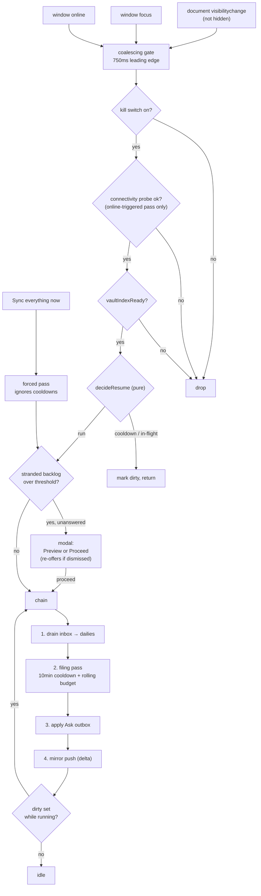
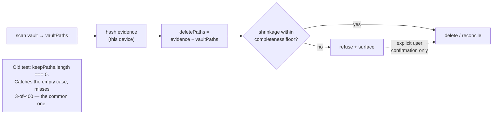
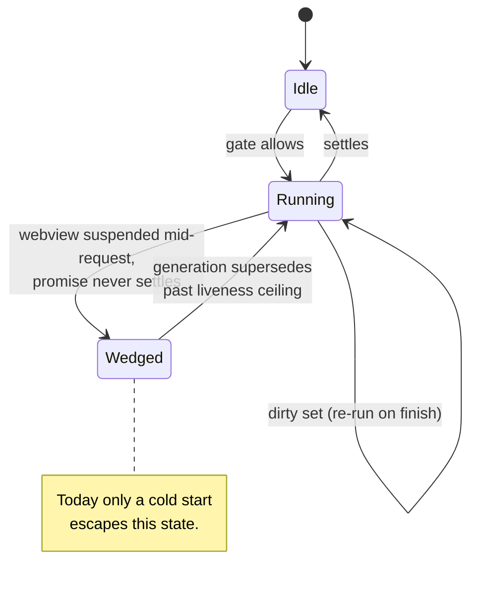

# feat: Catch up on resume (foreground trigger + Sync everything now)

## Goal Capsule

**Objective.** Atoms should do its catch-up work when the app comes back to the foreground, so a
user never has to force-quit Obsidian to get their captures filed. Add a manual "Sync everything
now" action as the explicit escape hatch.

**Product authority.** This document. `CLAUDE.md` non-negotiables override it. `docs/architecture.md`
is the system map; this plan amends its Ask mirror section (KTD7) and rewrites invariant 7 (KTD13).

**Shape of the work.** The trigger itself is small. Most of this plan is the three pre-existing
data-loss paths that the trigger converts from rare to routine, which is why this is a full-lane
change and why Phase A must land before the feature exists.

**Not active scope.** Any work while Obsidian is closed. Changes to how captures are classified or
what gets written. The Plus paid backfill "catch-up" feature
(`docs/plans/2026-07-28-003-feat-plus-vault-catch-up-plan.md`) is a different thing with a colliding
name — see KTD10.

**Blocking before implementation.** Three Outstanding Questions still change this plan's unit set and
must be closed before `ce-work` runs: **Q2** (cut U13 and R14?), **Q3** (split Phase A into its own
PR?), and **Q4** (the latency requirement that decides whether Phases B and C exist at all). **Q6 is
closed** — the returning-from-absence cooldown exemption is specified in KTD4 and U3 as of the
2026-07-31 doc-review. Q1, Q5, and Q7–Q9 are open but do not block.

---

## Product Contract

### Summary

Add a foreground/resume trigger that runs the same catch-up chain currently wired only to cold start,
plus a manual action that runs it on demand. Three pre-existing data-loss paths that the new trigger
makes routine are fixed first, in the same change, behind a settings kill switch.

### Problem Frame

Every piece of catch-up work in the plugin is wired to `app.workspace.onLayoutReady()`, which fires
once per cold start:

| Work | Current trigger | Fires on resume? |
|---|---|---|
| Inbox drain (capture → daily) | `onLayoutReady` (`src/plugin/main.ts:210`) + `atoms:drain-inbox` | No |
| Auto-run filing (daily → atom) | `onLayoutReady` + hourly interval (`src/plugin/main.ts:633`) | Not for up to an hour |
| Ask outbox apply | `onLayoutReady` + 60s interval (`src/plugin/main.ts:233`) | Within 60s |
| Ask mirror push | `onLayoutReady` + vault events on watched paths (`src/plugin/main.ts:352`) | Only if a watched file changes |

So phone captures sit in the inbox until the user kills and relaunches the app. That is the reported
complaint, and it is a lifecycle gap rather than a bug in any one stage.

Research turned up live hazards here. Each is verified against source, not inferred. **Correction
from review: these are not latent and the resume trigger is not what makes them routine** — the first
one already fires on every cold start, which on mobile is every relaunch:

1. **An ordinary delta sync can mass-delete the cloud mirror — today, on every launch.**
   `planAskMirrorDeletes` (`src/platform/askMirror.ts:264`) emits every path in this device's hash
   evidence that is absent from the current vault scan, and the delete loop at
   `src/plugin/main.ts:1385-1392` runs on **every** sync — it sits outside the `if (force)` block at
   `:1395`. `onLayoutReady` already calls `syncAskMirror({ force: false })` unconditionally
   (`src/plugin/main.ts:229`). So a phone with 3 of 400 atoms delivered issues ~397 deletes on
   relaunch right now, with no force flag and without the server's empty-reconcile guard ever being
   consulted.

   **Precondition, stated explicitly.** The wipe needs a device that is Ask-enabled with privacy
   acked and a live Plus session — `syncAskMirror` returns `-1` otherwise — *and* whose own hash
   evidence already holds N paths while the current scan returns far fewer. A device reaches that
   state either through a prior successful sync of its own, or through the `settings.askMirrorHashes`
   fallback read at `src/plugin/main.ts:1291`: `data.json` syncs, so a freshly-installed phone can
   inherit a desktop's 400-path evidence before a single `Atoms/*.md` has downloaded. That is the
   concrete route, and it is the common one on the platform this feature targets — but the frequency
   is conditional on that state, not unconditional on every cold start. Q3's split decision should be
   re-checked against the corrected frequency.

   Mobile cold start is when a vault is *least* delivered, and it is exactly the
   force-quit behaviour this feature exists to remove — so the wipe fires most often today for the
   users most affected. **This makes U1 and U9 urgent independently of this feature; see Open
   Question 3 on shipping them first.**
2. **The forced reconcile authorizes its own worst case.** `src/plugin/main.ts:1397` sets
   `confirmEmpty = keepPaths.length === 0` — the client asserts "yes, really empty" precisely when its
   own scan came back empty. The server guard described in
   `docs/qa/2026-07-27-ask-mirror-sync-security-review.md` exists to prevent "failed scan wiped brain",
   and the client defeats it.
3. **The inbox drain can lose an append that Sync delivers out-of-band.** *Severity corrected during
   review.* The in-process read → await → modify window is already narrowed: the drain re-reads the
   inbox immediately before the marker write, with a comment at `src/pipeline/inbox.ts:849` naming
   exactly this hazard. The live residual is Obsidian Sync **replacing the file out-of-band**, which
   `Vault.process` does not address because it serializes writers within this process only. So U2's
   load-bearing part is the marker-time re-verification, not the migration; the migration's real job
   is to be the precondition for retiring the drain's promise-join in U4. The repo has 13
   `vault.modify` calls and zero `vault.process`; the drain's two are `src/pipeline/inbox.ts:836` and
   `:859`.

A fourth, smaller one: `applyAskOutbox` acks entries as applied when `syncAskMirror` returns `≥ 0`
(`src/plugin/main.ts:1189-1196`), but `0` also means "deferred to an in-flight pass" (`:1222-1226`) —
so a concurrent push causes the outbox to ack writes the cloud never received. Resume adds a third
concurrent caller.

Shipping the trigger without fixing these would take latent data-loss paths and make them routine.

### Requirements

**R1.** When Obsidian returns to the foreground, the plugin runs the catch-up chain without user
action: drain the inbox into dailies, run the gated filing pass, apply the Ask outbox, push the Ask
mirror. No force-quit required.

**R2.** The resume trigger works on iOS and Android, not only desktop. Mobile is the platform the
complaint came from, and each platform gets its own verification.

**R3.** Repeated foregrounding does not repeatedly spend API allowance.

**R4.** A capture that Obsidian Sync delivers *after* the resume signal is still filed in that
session, without waiting for the next resume.

**R5.** The resume path stays silent. No notice per foreground. Auto-run's existing silence contract
(`CONCEPTS.md` § Auto-run) is preserved.

**Silence is not invisibility, and it does not cover integrity refusals.** Three reviewers converged
here, so the boundary is stated explicitly: routine outcomes are silent; a mirror-deletion refusal
(R8) is *not* a routine outcome and must reach the user. Refusals land in passive state — the Ask
mirror status line, which already has an error shape — rather than a notice, and a refusal that
persists across several consecutive passes may raise one notice. The exceptions to per-foreground
silence are therefore: R14's one-time backlog notice, and a persistent integrity refusal.

**Refusal surface, specified.** A refusal renders in the Ask mirror status line as `Ask mirror: N ·
sync refused — vault scan incomplete · Sync everything now to retry`, and in the same status position
on Atoms home — Settings → Atoms is not a surface a phone user opens routinely, so a Settings-only
refusal is indistinguishable from silence. It clears on the first pass that passes the completeness
floor. "Persists" means **three** consecutive refused passes; that constant lives in KTD4's block.
U1 owns the copy and both surfaces.

**R6.** A manual "Sync everything now" action, available as a command and from Atoms home, runs the
whole chain on demand ignoring cooldowns, and forces a full mirror reconcile.

**R7.** The manual action reports honestly. It never says "0 synced" when it was absorbed into a
running pass, and never reports success before the forced reconcile has actually run.

**R8.** Mirror deletion is refused when the local vault scan is not credibly complete — on the delta
path as well as the forced path. An incomplete scan can never delete the user's cloud brain.

**R9.** The inbox drain does not lose a capture that arrives while the drain is running, and never
marks a capture filed unless its bullet is verifiably present in the daily.

**R10.** A stage that dies without settling — the iOS webview suspended mid-request — does not
permanently disable catch-up for the rest of the app's life.

**R11.** Today's daily note is never processed by the resume path or by the manual action. Forcing
today stays the separate, explicit action it is today (`CLAUDE.md` non-negotiable #3).

**R12.** Resume never runs before the vault index is ready, so it cannot create a duplicate inbox
note ahead of Sync delivering the real one.

**R13.** The resume trigger can be turned off from Settings without a new release.

**R14.** The first post-upgrade pass over a large stranded backlog asks before it starts, once.
Silently filing months of captures is not something the user opted into by updating a plugin.

**R15.** An outbox entry is acked only when the cloud confirmed receipt.

### Acceptance Examples

| Situation | Expected |
|---|---|
| Phone capture written while Obsidian is backgrounded; user reopens the app | Capture drains into its daily and files into an atom, with no force-quit and no notice |
| User alt-tabs between Obsidian and a terminal ten times in a minute | At most one catch-up pass; the paid filing stage runs at most once |
| Sync delivers a capture 20 seconds after the app foregrounds | The capture is drained in the same session, without a second resume |
| Phone foregrounds with 3 of 400 atoms delivered; ordinary delta sync runs | Zero deletes issued; the shrinkage is refused and surfaced |
| User taps "Sync everything now" on a phone whose `Atoms/` has not synced | Forced reconcile refuses; no cloud deletion |
| Resume fires while a filing pass from the previous resume is still running | No second pass starts; newly-arrived work is picked up after the running pass finishes |
| iOS suspends the webview mid-classify; user reopens hours later | The wedged pass is reset and catch-up runs normally |
| User taps "Sync everything now" while an auto pass is running | Reports that it joined the running pass, not "0 synced" |
| User has automatic filing off and taps "Sync everything now" | Filing runs for this explicit gesture (credentials and egress ack permitting); not a silent no-op |
| Crash between the daily write and the marker write; drain re-runs | The capture is neither duplicated nor lost |
| Mirror push is deferred mid-outbox-apply | No entries are acked; they remain pending |
| A capture that always fails to classify sits in the backlog | It is quarantined, stops driving re-runs, and remains recoverable |
| User upgrades with 400 stranded captures and foregrounds | One notice offering Preview or Proceed; nothing files until they choose |
| User turns off "Sync automatically on resume" in Settings | No foreground pass fires; the manual action still works |
| Captures in today's daily note | Excluded from resume and from the manual action |

### Scope Boundaries

- **In scope:** the foreground-signal device spike (U0), the resume trigger, the manual action, the
  data-integrity fixes named in the Problem Frame, liveness/re-run correctness, the settings kill
  switch, the first-run backlog gate (pending Q2), the Plus checkout poll migration (U11, pending
  Q8), the egress-ack copy update (U14), and the docs/version tail.
- **Also in scope, and not requested:** connectivity-restore mirror push. KTD7 takes a previously
  deferred P1 because the same listener set answers it. Named here so it is discoverable without
  reading KTD7.
- **Out of scope:** any processing while Obsidian is closed (`CLAUDE.md` — no always-on headless);
  changes to classification, prompts, or what gets written; capture UI; the Plus paid backfill path.

#### Deferred to Follow-Up Work

- Migrating the other 11 `vault.modify` call sites to `Vault.process`. This plan migrates only the
  drain's two. The rest are listed in the cited solution doc and need their own issue.
- A user-visible surface for quarantined captures. U10 makes the count readable via
  `atoms:auto-run-status`; a real UI is a separate product decision.
- Multi-window leader election on desktop. Effect-layer idempotency covers correctness, and Web Locks
  is not safe to assume in the iOS webview.
- Server-side proportional-delete refusal (see Risks). The client-side floor in U1 is the fix this
  plan ships; a server backstop is the durable one and belongs to `plus-service`.

### Outstanding Questions

1. **Midnight edge.** A capture written at 23:58 becomes "past" at 00:00, so a 00:05 resume files it
   minutes later. Correct under the current day rule, but it slightly weakens the "today's daily is
   quiet" promise. The plan does not change the day rule.
2. **BLOCKING — Is the first-run backlog gate (U13, R14) wanted?** Review argues for cutting it:
   auto-run *already* files a past backlog unattended today — `shouldRunAutoProcess` returns true
   same-day while work remains and the hourly interval re-enters — so the gate asks consent for
   behaviour users already live with, while introducing a stall path if the notice is dismissed
   unanswered. The release-note disclosure in the Definition of Done covers the irreversibility
   warning. **Lean: cut U13 and R14.** Nothing else depends on them. *Doc-review 2026-07-31:
   product-lens, scope-guardian, and coherence independently reached the same conclusion. U13 as
   written is committed scope with no pointer to this question, so an implementer builds it unaware.
   Its dismissal-stall defect has been fixed in place (see U13) so the unit is safe either way, but
   the cut is still your call.*
3. **BLOCKING — Should U1 and U9 ship as their own PR, immediately, ahead of this feature?** Holding
   the highest-severity fix behind a 12-unit feature leaves a live cloud-brain wipe shipping for the
   duration of a full-lane change. **Lean: yes, split them out now.** *Doc-review 2026-07-31: the
   frequency claim behind this urgency is now stated with its precondition (Problem Frame hazard 1) —
   the wipe needs a device holding stale hash evidence while scanning a mostly-undelivered vault,
   which is common on mobile but not unconditional. Re-check the lean against that. The earlier claim
   that the remainder drops to a light lane is withdrawn: what remains spans `main.ts`, three new
   modules, settings, home UI, a quarantine subsystem, docs and a version bump — that is still full
   lane.*
4. **BLOCKING — What is the actual latency requirement for filing after reopening?** Everything that
   distinguishes the event trigger from a much cheaper alternative depends on this number, and the
   plan never states it. See the interval-drain alternative below. *Doc-review 2026-07-31: this is
   the single highest-leverage unanswered question in the document — the interval-drain baseline is
   rejected "only if filing must be visible within seconds", and if the honest answer is "within the
   hour", Phases B and C collapse into a timer that already runs. Answer it before `ce-work`.*
5. **Should the plan add a passive "last caught up" surface?** The reported complaint is a *trust*
   problem — the user force-quits because they cannot tell whether filing happened — so a fix that is
   invisible by contract may not change the habit. There is currently no way to confirm a resume pass
   ran without triggering one. A passive line on Atoms home and in Settings → Atoms ("Last caught up
   4m ago · 3 filed", plus what the paid stage has spent today) would close it without breaking
   silence. **Lean: add it** — but it is new product surface, so it is your call. *Doc-review
   2026-07-31: product-lens raised this independently — the objective ("a user never has to
   force-quit") has no signal the user or QA can observe. Adding it would need its own Phase C unit.*
6. ~~**Does the 10-minute filing cooldown break the headline promise?**~~ **Closed 2026-07-31.** The
   returning-from-absence exemption is adopted: a resume following an absence longer than the filing
   cooldown is exempt from that cooldown for its first pass. Specified in KTD4 and tested in U3. The
   cooldown still applies to repeated foregrounding within a session, so R3 holds.
7. **Is "Sync everything now" the right name?** KTD10 flags it as the plan's weakest decision. It
   sits near the existing narrower "Sync now" and competes with Obsidian's own Sync feature. Review's
   counter-proposal: **"Process everything now"**, reusing the Preview/Process vocabulary Atoms home
   already ships, which removes the overloaded word entirely. Naming is a product call, so it is
   yours.
8. **Does U11 (Plus checkout poll migration) belong in this plan?** It serves no requirement, and the
   plan already concedes "a regression here is invisible to this feature's QA". Splitting it into its
   own issue would shrink the review surface. **Lean: split it out.**
9. **Should "Sync everything now" ask before the paid stage when automatic filing is off?** KTD11
   runs filing regardless of the enablement flag to avoid a silent no-op — right instinct — but a
   user who disabled filing to control spend gets charged by a button whose name promises syncing,
   not classifying. Option: run the free stages immediately and ask once before the paid stage,
   remembering the answer for the session. Trades one tap for informed consent.

---

## Planning Contract

### Key Technical Decisions

**KTD1 — Foreground detection is three DOM events funnelled into one gate.** There is no first-party
resume event in the Obsidian API. Research enumerated every `Workspace`, `Vault`, and `MetadataCache`
event in the installed `obsidian` 1.13.1 typings; none is a foreground signal, and
`window-open`/`window-close` are popout windows rather than OS backgrounding. Every comparable plugin
— `vrtmrz/obsidian-livesync`, `No-Instructions/Relay`, `hjinco/synch`,
`hyungyunlim/obsidian-social-archiver` — converges on `document` `visibilitychange` (guarded on
not-hidden) + `window` `focus` + `window` `online`, routed into one debounced handler. The two
visibility signals are not redundant: `visibilitychange` does not fire when an Electron window merely
loses focus behind another app, and `focus` does not fire in cases visibility does.

**KTD2 — Every listener goes through `registerDomEvent`.** It is documented as detaching on unload.
The repo uses it nowhere today, and `src/platform/plusResume.ts:89,92` leaks two listeners that stack
on every dev plugin reload.

**KTD3 — Resume cooldown state is an in-memory monotonic timestamp; quarantine state is persisted.**
Wall-clock time is not monotonic (NTP correction, DST, sleep/wake skew), so a persisted `Date.now()`
comparison can be defeated by a clock change, and a monotonic epoch is per-process so persisting it is
meaningless. Cooldown state therefore adds **no** localStorage key. Poison-capture quarantine (U10) is
the stated exception: it is worthless unless it survives restart, so it gets one device-local key
(`atoms-quarantine-v1`), never `data.json` — `data.json` syncs, and quarantine is device-local
evidence like the mirror hashes.

**KTD4 — Concrete cooldowns, and the rolling filing budget stacks on top of `PER_LAUNCH_CAP`.** These are
decisions, not implementation details, because they govern spend. All live in one exported constants
block so they are tunable in one place.

| Knob | Value | Why |
|---|---|---|
| Signal coalescing debounce | 750 ms, leading edge | Matches shipping precedent; a resume is a discrete action, so act on the first signal and suppress the rest |
| Minimum interval between resume passes | 30 s | Shipping precedent; absorbs alt-tab storms |
| Filing-stage cooldown | 10 min | The only paid stage; needs its own far longer gate than the free drain (per-stage, not one gate) |
| Filing budget | 15 captures per rolling 60 min, **persisted** | **Stacks on top of** `PER_LAUNCH_CAP`; does not replace it (see correction below) |
| Liveness ceiling | 10 min general, 30 min filing | A classify batch can legitimately run long; everything else cannot |
| Post-resume watch window | 60 s | Sized against observed Sync lag of ~30 s, not an instant |
| **Returning-from-absence exemption** | absence > filing cooldown | **Closes Q6.** The first resume after a real absence skips the filing cooldown — that case *is* the reported complaint, and without the exemption the headline acceptance example is false for ten minutes. Repeated foregrounding within one session still pays the cooldown, so R3 holds |
| Consecutive refusals before one notice | 3 | Integrity refusals stay passive state until they persist (R5) |
| Connectivity-probe minimum interval | 5 min (proposed) | Bounds probe volume independently of the resume gate (KTD7); tune on device |
| Deletion completeness floor | see U1 | Not a spend knob; lives in its own constants block |

**Two corrections from review.** First, `PER_LAUNCH_CAP` is **not** launch-scoped: it is passed as
`maxCaptures` to `runWritePath` on every pass (`src/plugin/main.ts:750`), and the hourly interval
re-enters while past work remains (`src/platform/autorun.ts:38`), so today's real throughput is
already ~15 per hour. Keep it as the per-pass bound and add the rolling window on top; deleting it
would *uncap* a single pass, which is the opposite of the intent. The rolling window is therefore
close to a no-op against today's spend — its job is to bound resume-triggered passes specifically,
and the plan should not claim more.

Second, the budget must be **persisted** (a device-local key alongside `atoms-quarantine-v1`, never
`data.json`). KTD3 keeps the anti-alt-tab debounce in monotonic memory, which is right, but iOS
reclaims webview memory routinely — an in-memory budget resets to empty on every process reload,
which on the platform this feature exists for means no bound at all. Wall-clock skew makes a
persisted budget slightly wrong; a reset budget makes it unbounded, and only one of those costs the
user money.

**KTD5 — Re-entrancy is an epoch/dirty re-run, not a shared-promise join.** `drainInboxOnce`
(`src/plugin/main.ts:294`) returns the *running* promise, so a concurrent caller receives that pass's
result. Correct for de-duplicating two callers who want the same work; wrong for resume, where the
trigger fires *because Sync just delivered a capture* — the caller would join a pass that already read
the inbox, get `0 filed`, and nobody would re-run. The chain gets a dirty flag instead, generalizing
the semantic `syncAskMirror` already uses via `askMirrorFollowUp` (`:1237-1243`).

**The join has two roles, and only one of them is retired.** The F1 comment at `:174` says it exists
to stop "a second read-modify-write that would double-append" — so the join is an in-process
**single-flight lock** as well as a result-share. U2's content-keyed dedupe does **not** replace the
lock: U2 step 2 requires the recomputed dedupe be diffed against *pre-pass* content only, so two
genuine same-second captures both file (the shipped Q2 decision at `src/pipeline/inbox.ts:826`) —
which means a second drain body whose own pre-pass snapshot also lacked the bullet writes it again.
After U5 and U6 the drain has five callers, so that concurrency is designed in, not hypothetical.
U4 therefore **keeps the single-flight lock and drops only the result-sharing**: no caller receives
another pass's counts, freshness comes from the dirty re-run, and the double-append guard survives.
U2 remains a dependency of U4 for the out-of-band Sync case it genuinely covers — not for
in-process serialization, which the lock still owns. All three drain callers migrate
at once: a partial migration where resume marks dirty while `runDrainInbox` joins would make the
command report counts from a pass that excluded the just-arrived capture, which is the same dishonesty
R7 forbids, leaking into a path nobody is watching.

**KTD6 — In-flight flags get a liveness reset.** `autoRunInFlight` is cleared only in `finally`
(`:816`) and by `onunload`. On iOS the OS can suspend the webview mid-`requestUrl` so the promise never
settles, leaving the flag stuck `true`, after which `maybeAutoRun` returns `"in_flight"` forever
(`:719`). Today only a cold start clears that, which is survivable; once resume is the primary trigger
it means filing silently dies for the life of the app. Each guarded stage records a start timestamp
and generation; a pass past the liveness ceiling is superseded. `onunload` also nulls `drainInFlight`,
which it currently does not.

**KTD7 — The `online` event is a named amendment to the Ask mirror architecture, and its probe must
be free and uncredentialed.** `docs/solutions/architecture-patterns/ask-mirror-parity.md` KTD4
states: "No mirror poll interval … Connectivity-restore catch-up is P1, not silent scope creep."
This plan takes that P1 deliberately, because the same listener set already carries the signal.
*Not free, though:* it needs a new probe that neither existing helper can supply, so the work is
real and U5 owns the file.

`navigator.onLine` in a mobile webview reports online with no usable route, so the handler needs a
real probe — but **neither existing probe may be used on this path**, and review found that following
repo precedent here would have been actively harmful:

- `probeAnthropicApi` (`src/platform/connectivity.ts:98`) POSTs to `/v1/messages` with `x-api-key`
  set. It bills, and it egresses the user's key on every network transition.
- `probeHttpsBaseline` (`:58`) GETs `https://api.github.com/zen` — a third party the user never
  consented to, which would learn their IP and Obsidian-usage timing on every wifi/cellular handoff.
- `runConnectivityTest` is the only entry point `main.ts` already imports (`:121`, `:1031`), and it
  calls the billed one. Today its sole caller is the user-invoked `atoms:test-connection` command;
  turning that deliberate diagnostic into an unattended background beacon is not acceptable.

Use a **new, unauthenticated** reachability check against the Plus base URL, living in
`src/platform/connectivity.ts` alongside the two it must not reuse, and give it its own minimum
interval (KTD4). **Position it downstream of the coalescing gate and the kill switch**, so an
`online` storm cannot fire N probes and a disabled kill switch fires zero.

Reusing `askMirrorStatus` was considered and rejected: it takes a required `sessionToken`
(`src/platform/plusClient.ts:532`), so it is a credentialed call and fails the uncredentialed
requirement this KTD exists to state. U5 must therefore assert what the probe *sends*, not only that
a failing probe blocks the pass — the path of least resistance is `runConnectivityTest`, already
imported by `main.ts`, which calls the billed key-egressing one.

**KTD8 — Resume gates on `vaultIndexReady`, and does not re-await `waitForVaultIndexReady`.** That
helper (`src/platform/autorun.ts:105`) resolves in ~150 ms once the cache is warm, so on a resume it
returns almost immediately and says nothing about whether Sync has finished delivering. Reusing it as
the resume gate would look correct and fire too early. The chain gates on the existing plugin-level
`this.vaultIndexReady` flag (`:185`), and `ensureInboxNote` stays off the resume path entirely — it
belongs to cold-start bootstrap, where the F2 comment at `:248` explains why.

**KTD9 — Force is for the manual action only; the completeness floor applies to both paths.**
`force: true` performs a full-orphan reconcile that removes server paths this device never hashed —
appropriate for an explicit gesture, not for something firing on every foreground. But delta deletes
by hash evidence too, so KTD12's floor gates **both**. Resume pushes delta; only the manual action
forces.

**KTD10 — Naming.** The new action is **"Sync everything now"**. Settings keeps its mirror-only
**"Sync now"** (`src/settings/settings.ts:1166`), disambiguated by sitting inside the Ask mirror
section. "Catch-up" is avoided as a product-facing name because the Plus backfill plan owns it — **which is why
U12's toggle is "Sync automatically on resume" and not "Run catch-up on resume"**, as an earlier draft
had it. The rule applies to every surface this plan adds, not only the manual action.
*The action's own name remains open — see Q7, which proposes "Process everything now" instead.*

**KTD11 — The manual action honors consent gates but not the enablement gate.** Routing the button
through `maybeAutoRun` unchanged would mean a user with automatic filing off taps "Sync everything
now" and gets a silent no-op. It is an explicit gesture, so it runs filing regardless of the device's
auto-run *enabled* flag, while still requiring egress ack and valid credentials, and still never
touching today's daily. Absent either, it says so rather than failing silently.

*Open: whether it should ask once before the paid stage when the enablement flag is off — the action's
name promises syncing, not classifying, so the gesture may not carry consent for the spend. See Q9.*

**KTD12 — Mirror deletion is gated on scan completeness, not on emptiness.** This is the plan's most
important decision and it supersedes the narrower `confirmEmpty` fix. `LS_ASK_MIRROR_SERVER_COUNT`
(`src/platform/askMirror.ts:11`, written at `src/plugin/main.ts:1439`) already records what the server
last held, so the client can tell "the user deleted atoms" from "this device hasn't synced yet".
Deletion — delta or forced — is refused when the scan shrank beyond a proportional floor, unless the
user explicitly confirmed. Emptiness is just the extreme case of shrinkage, which is why fixing only
`confirmEmpty` would have left the common failure open.

**KTD13 — Invariant 7 is rewritten, deliberately.** `docs/architecture.md` invariant 7 states that
outbox ack waits for successful land **and** mirror. The current code violates it by acking on a
deferred push (`:1189-1196` treating `0` as success). U9 makes the code honest and the invariant
explicit rather than silently changing behavior.

**KTD14 — A settings kill switch, default on.** R1 wires the trigger unconditionally and filed atoms
cannot be un-filed, so without a switch the only recovery from misbehaviour on someone's phone is a
new release — through BRAT, at the user's own pace. "Sync automatically on resume" is independent of the
auto-run enabled flag, which only gates the paid stage rather than the trigger or the drain.

**KTD15 — Orchestration lives in `src/plugin/catchUp.ts`, not in `platform/` and not in `main.ts`.**
`docs/architecture.md` puts device gates in `platform/` and wire-up in `plugin/`. (Correction: its
dependency rule constrains `pipeline/`, `home/`, `resurface/`, and `ui/` and does not explicitly name
`platform/`, so the layering argument rests on the module map's stated roles plus the two concrete
grounds below, not on an explicit prohibition.) Chain orchestration needs the plugin instance, so putting it in
`platform/resume.ts` would drag a fat host interface across the boundary and make resume the second
god-object. It cannot go in `main.ts` either — already ~2170 lines and named in `CLAUDE.md` as "not a
dumping ground". The new module takes an **injected host interface**, which also solves the test
problem: no test in the repo imports `main.ts` (`test/mocks/obsidian.ts` stubs `Plugin` as an empty
class), so chain behavior is only testable if it is written against a fake host.

### Assumptions

- **`document.visibilitychange` fires on Obsidian's iOS and Android webviews.** *Inferred, not
  documented.* Every actively-maintained cross-platform Obsidian sync plugin ships it as their core
  resume signal with `isDesktopOnly: false` and none special-cases mobile out of it — if it did not
  fire, their sync-on-resume would be visibly broken. No Obsidian documentation states it outright.
  **Load-bearing for R2; must be verified on a real phone, per platform, not inferred from a desktop
  smoke test — and verified *before* Phase B, not at merge.** U0 is the spike that does it. Placing
  the only test in the merge-time device gate means six units land before anyone learns whether the
  trigger fires on the platform the complaint came from, and the Definition of Done as originally
  written permitted recording a negative result and shipping anyway. A negative spike result stops
  Phase C and routes to the interval-drain alternative; it does not get recorded and waved through.
- The Capacitor `App` lifecycle API is reachable at runtime in Obsidian mobile but is undocumented,
  absent from `obsidian.d.ts`, and used by no comparable plugin for resume detection. Deliberately not
  used. (One research pass claimed it was load-bearing on iOS; the source-level survey of shipping
  plugins contradicts that, and the survey is the stronger evidence.) **This is a rejected option,
  not the fallback.** If U0 disproves the visibility assumption, the fallback is the interval drain
  below: add `drainInboxOnce()` to the existing hourly tick, keep Phase A, and drop U3–U6 and U11.
  Routing a failed assumption to an undocumented API absent from the typings and used by no
  comparable plugin — when the alternative analyzed one section later needs no assumption at all —
  is the weaker of the two branches.
- Obsidian Sync can deliver files tens of seconds after foreground; a forum report cites ~30 s.
- The server hard-deletes on reconcile rather than tombstoning. If it tombstones, the rollback story
  improves materially — worth confirming against `plus-service` before U1.

### Alternatives Considered

- **Add the inbox drain to the existing hourly interval — the cheap baseline.** Surfaced in review and
  not previously considered. The plugin already runs an hourly `maybeAutoRun` interval
  (`src/plugin/main.ts:633`) and a 60 s outbox interval; the *only* stage missing from any interval is
  the drain. Adding `drainInboxOnce()` to the existing tick closes the reported complaint in a few
  lines, keeps the double-append join intact, and needs none of KTD1's unverified mobile-visibility
  assumption, no listener/coalescing/cooldown machinery, and neither U2 nor U4. The earlier rejection
  ("a polling interval") cited `ask-mirror-parity.md` KTD4 — but that bans a *mirror* poll interval,
  not an inbox drain, and the incremental battery cost on a timer that already exists is near zero.
  **This alternative is rejected only if filing must be visible within seconds of reopening rather
  than within the hour** — see Open Question 4. If that requirement does not hold, this should ship
  first and let real usage decide whether the event trigger earns its complexity.
- **A mirror poll interval.** Still rejected: `ask-mirror-parity.md` KTD4 forbids it outright.
- **Reusing `drainInboxOnce`'s shared-promise join for the whole chain.** Rejected on the stale-result
  grounds in KTD5. This was the plan's original shape.
- **Fixing only `confirmEmpty`.** Rejected once research showed the delta delete path is the common
  case (KTD12). This was also the plan's original shape.
- **Persisting the last-resume timestamp.** Rejected per KTD3.
- **Landing Phase A as its own PR first.** Genuinely reasonable, and the phases are cleanly separable.
  **Undecided — see Q3**, which leans toward splitting. The original argument for keeping them
  together (the trigger is what makes the fixes urgent) is weakened by the Problem Frame's own
  correction that hazard 1 already fires without the trigger. If split, the boundary is Phase A/B.

---

## System-Wide Impact

**Method signatures changing.** Each is reachable from CLI commands and the home view, so a shape
change is user-visible, not internal:

| Method | Change | Callers to update |
|---|---|---|
| `drainInboxOnce` (`:294`) | Promise-join → dirty/epoch, tri-state result | `bootstrapInbox` (`:273`), `runDrainInbox` (`:323`) |
| `applyAskOutbox` (`:1098`) | Empty-on-busy → tri-state; ack only on confirmed push | `onload` (`:226`), 60s interval (`:235`), `:593`, `:1620` |
| `syncAskMirror` (`:1216`) | `0`-on-deferred → tri-state | `:229`, `:392`, `:590`, `:1189`, `:1617` |
| `maybeAutoRun` (`:719`) | Adds liveness supersede; rolling budget stacks on top of the per-pass cap | `:630`, `:636`, `:674` |

**Entry points converging on the chain.** Nine triggers now exist. The plan re-points `onLayoutReady`
bootstrap, the resume signals, and the manual action at the shared chain; it leaves the hourly auto-run
interval, the 60 s outbox interval, the vault-event mirror debounce, the two CLI commands, and the
pre-existing Plus checkout resume listener (`src/platform/plusResume.ts`, until U11 migrates it)
running standalone. That distinction is deliberate — the intervals are the healing path if the trigger fails —
but every one of them must go through the same in-flight and dirty state, or the guards are per-caller
rather than global.

**Failure propagation.** `docs/architecture.md` invariant 7 is rewritten by U9 (KTD13). Chain-stage
failure semantics are newly defined: a stage that throws does not abort the remaining stages, since the
mirror push failing must not prevent the inbox from draining; each stage records its own failure for
backoff. Mirror hard-failure (`-1`) mid-outbox-loop acks nothing and leaves entries pending.

**Platform parity.** `docs/architecture.md` invariant 6 forbids a desktop-only watcher:

| Signal | Desktop (Electron) | iOS | Android |
|---|---|---|---|
| `visibilitychange` | Fires on minimize/tab-hide | Primary signal (assumed) | Primary signal (assumed) |
| `focus` | Primary signal; covers window-blur that visibility misses | Unreliable | Unreliable |
| `online` | Fires | Fires; `navigator.onLine` may lie | Fires; may lie |

Each row needs its own verification. Android is not a footnote to iOS.

**Surfaces reading stale state.** Atoms home counts, Settings' Ask mirror status line, and the CLI
output of `atoms:drain-inbox` / `atoms:auto-run-status` all change shape under tri-state results and
must be updated in the same change rather than silently reporting the new "joined" outcome as zero.

---

## High-Level Technical Design

Directional guidance for review, not implementation specification.

### Trigger to chain

### The deletion gate — why emptiness was the wrong test

### Pass lifecycle — why a dead pass must be reclaimable

---

## Implementation Units

Grouped into phases. **Phase A must land before Phase C exists** — it is the difference between fixing
latent hazards and shipping a trigger that fires them.

### Phase A — Make the existing paths safe

### U1. Gate mirror deletion on scan completeness

**Goal.** An incomplete local scan can never delete the user's cloud atoms, on either the delta or the
forced path.

**Requirements.** R8.

**Dependencies.** None. Land first.

**Files.**
- `src/platform/askMirror.ts` — the completeness predicate, beside `planAskMirrorDeletes` (`:264`),
  **plus the extracted upsert/delete/reconcile loop** (see below)
- `src/plugin/main.ts` — the delete loop (`:1385-1392`) and the forced reconcile (`:1394-1418`),
  reduced to a thin caller
- `test/askMirror.test.ts`

**Extraction is a precondition, not a refactor.** The Verification Contract makes "a test observed
failing against pre-fix code" a merge gate for this unit, and the 3-of-400 delta case cannot be
written where the loop lives: no test imports `src/plugin/main.ts` (vitest aliases `obsidian` to a
stub whose `Plugin` is an empty class), so a test in `test/askMirror.test.ts` can only reach the pure
predicate. Move the loop into `askMirror.ts` behind an injected host (vault scan, request fn,
localStorage) — the same move KTD15 makes for the chain — before writing the regression test.

**Approach.**
1. Add a pure predicate taking the scanned path count, the delete count, the last known server count
   (`LS_ASK_MIRROR_SERVER_COUNT`), and whether the user explicitly confirmed; returning allow or a
   refusal reason.
2. **Gate the delta delete loop** — this is the main fix. Three corrections from review, each of
   which defeated the naive version:
   - **Denominator must be this device's own evidence size, not the server count.** `deletePaths`
     comes from `planAskMirrorDeletes(vaultPaths, hashSnapshot)` (`src/plugin/main.ts:1347`) where
     `hashSnapshot` is *this device's* evidence map, while `LS_ASK_MIRROR_SERVER_COUNT` is the
     server's total across all devices. Comparing one to the other makes the floor a no-op on exactly
     the devices at risk: 60 paths in evidence against a 400-row server passes `max(5, 400×0.2)` and
     deletes all 60.
   - **Gate on scan completeness, not delete magnitude.** Delete count cannot distinguish "the user
     deleted 50 atoms" from "50 atoms have not synced yet" — which is the discrimination R8 exists to
     make. Refuse when the scan is too small relative to this device's evidence, independent of how
     few deletes that implies.
   - **Bound cumulative shrinkage — concretely.** `LS_ASK_MIRROR_SERVER_COUNT` refreshes from
     `askMirrorStatus` at the end of every successful run, so a sequence of individually-within-floor
     passes ratchets the mirror down (400 → 320 → 256) and achieves what one over-floor pass is
     refused. Persist a **device-local high-water mark of the scanned path count** (alongside the hash
     evidence, never `data.json`) and evaluate the floor against *that*, not against the previous
     pass's evidence size — so each pass is measured against the pre-shrinkage baseline rather than
     the freshly-lowered one. Lower the mark only on an explicitly confirmed reconcile, or after a
     stated expiry. A per-pass-only floor leaves the ratchet open, and the resume trigger makes
     multi-pass routine rather than rare.
3. **Gate the forced reconcile** on the same predicate, and stop deriving `confirmEmpty` from
   `keepPaths.length === 0`. It becomes an explicit input that **only U7's confirmation modal may
   set** — never derived from `force`, from scan size, from emptiness, or from the fact that a
   command was invoked. U1 consumes the flag; U7 owns the gesture that produces it (without an owning
   unit, the cheapest invention is exactly the bug KTD12 supersedes).
4. A refusal is surfaced, not swallowed — the user needs to know the mirror did not converge. This
   unit owns the copy and both surfaces named in the Product Contract's *Refusal surface, specified*
   note: the Ask mirror status line **and** the equivalent position on Atoms home.
5. **Keep the existing delete-then-persist order.** An earlier draft called for persisting evidence
   before issuing deletes; that inverts which inconsistency is survivable. Today `askMirrorDelete`
   (`:1387`) runs before `writeAskMirrorHashes` (`:1391`), so a crash leaves evidence still naming a
   deleted path and the next delta pass re-issues an idempotent delete and self-heals. Reversed, a
   failed delete drops the path from evidence while the server still holds it — and since
   `planAskMirrorDeletes` derives deletes solely from evidence, no future pass can ever remove it.
   At-least-once with an idempotent remote call is the correct shape here.

**Patterns to follow.** Pure predicate with injected values in the shape of `shouldRunAutoProcess`
(`src/platform/autorun.ts:24`) and `planAskMirrorDeletes` itself.

**Execution note.** Test-first. Write the 3-of-400 delta case against current code and watch it issue
397 deletes before changing anything — that failing test is the proof this closed.

**Test scenarios.**
- 400 in evidence, 3 in scan, delta sync → zero deletes issued; refusal surfaced.
- 400 in evidence, 399 in scan (user deleted one atom) → the delete proceeds; the floor does not block
  legitimate use.
- Scan returns zero paths, force requested, no explicit confirmation → reconcile does not run.
- Scan returns zero with explicit confirmation → reconcile runs with `confirmEmpty` true.
- Non-empty scan that shrank past the floor, force requested → **refused** regardless of gesture unless
  explicitly confirmed. (This replaces the earlier draft's scenario, which codified the bug.)
- Chunked path (>500): intermediate chunks always send `confirmEmpty: false`; only a genuinely
  confirmed-empty final chunk may set it true.
- No prior server count recorded (first ever sync) → floor cannot be evaluated; deletes are refused
  rather than allowed by default. **And the device exits that state**: assert the count is recorded
  after the first successful upsert-only pass, so a device whose first sync failed is not stuck
  refusing forever.
- **Ratchet:** three consecutive passes, each individually within the floor, against a scan that
  keeps shrinking → refused at the pass where cumulative shrinkage from the high-water mark crosses
  the floor.
- A delete failing mid-loop leaves the remaining paths in evidence, so the next pass retries them.
- The confirmation input cannot be set by anything except U7's modal — assert the predicate rejects a
  confirmation that did not originate there.
- A refusal renders on both surfaces (Ask mirror status line and Atoms home), and clears on the first
  pass that passes the floor.

**Verification.** A delta sync against a vault with 3 of 400 atoms present leaves the server count
unchanged and reports the refusal.

---

### U2. Atomic inbox writes with verified marker placement

**Goal.** The drain stops losing captures that arrive while it runs, and never marks a capture filed
unless its bullet is verifiably in the daily.

**Requirements.** R9.

**Dependencies.** None (parallel with U1).

**Files.**
- `src/pipeline/inbox.ts` — the write sites at `:836` and `:859`, and the dedupe at `:831`
- `test/inbox.test.ts`

**Approach.**
1. Migrate both writes from `vault.modify` to `Vault.process`, available in the installed typings and
   well under `minAppVersion` 1.11.4.
2. **The migration only fixes anything if the decision moves inside the callback** — but the
   recomputed dedupe must still exclude *this pass's own additions*. `:828-836` computes `additions`
   from a `dailyContent` read taken outside the write, so wrapping it as-is atomically re-applies a
   stale decision. Recompute against the callback's data, **diffed against the pre-pass content
   only**. The naive version reverses a shipped decision: the comment at `src/pipeline/inbox.ts:826`
   records that two genuine same-second captures with identical text must *both* file — "dropping one
   is the failure to avoid, filing twice is recoverable (Q2)". Deduping against content this pass
   just wrote would silently drop the second, inside the unit whose goal is to stop losing captures.
   `Vault.process` callbacks may re-run, so they must be synchronous and side-effect-free — which
   also means step 3's cross-file re-verification (read the daily, write the inbox marker) cannot
   live inside a single-file `process()` callback; state where it runs.
3. **Condition the marker write on re-verifying the bullet is present in the daily** at marker time,
   rather than trusting the earlier loop's result. `Vault.process` serializes writers within this
   process only; Obsidian Sync replaces files out-of-band, so a daily write can land, the marker can be
   written, and Sync can then merge the daily and drop the bullet — leaving a capture marked filed and
   gone. Re-verification is the only thing that catches that.
4. Key the dedupe by content (`stamp + body`) on the **daily** side as well as the inbox side, not by
   line index.

**Patterns to follow.** `docs/solutions/logic-errors/read-modify-write-lost-update-synced-file.md`
§ Prevention. Its test list is a coverage claim — diff this unit's tests against it, per
`docs/solutions/logic-errors/partial-adoption-of-a-cited-solution-doc.md`.

**Execution note.** Test-first, and the regression test must inject the concurrent append *inside the
awaited dependency*. Calling the drain twice does not open the window and will pass against the buggy
code.

**Test scenarios.**
- Concurrent append lands mid-drain, injected inside the awaited dependency → the late capture survives.
- Crash between the daily write and the marker write → re-run neither duplicates the bullet nor loses
  the capture.
- Same, but the filing pass has since appended a `↳ [[title]] <!--linker-->` sentinel under the bullet →
  dedupe still matches, because it is content-keyed rather than string-adjacent.
- Daily bullet absent at marker time (simulating a Sync merge that dropped it) → no marker is written;
  the capture stays pending.
- A capture already carrying a filed marker is not filed twice.
- Blank line drifted between capture and marker (the Sync-merge shape) still reads as filed, on both
  the parse and write halves.
- Empty capture filtering unchanged.
- `Vault.process` callback re-run yields the same result.

**Verification.** The existing inbox suite passes plus the new concurrency and torn-write tests; no
behavior change for a user with no concurrency.

---

### U9. Tri-state busy results and the outbox ack fix

**Goal.** A caller can tell "nothing to do" from "someone else is doing it", and an outbox entry is
acked only when the cloud confirmed it.

**Requirements.** R7, R15.

**Dependencies.** None. Phase A — this is a live data-loss path independent of resume.

**Files.**
- `src/plugin/main.ts` — `applyAskOutbox` (`:1098`, ack at `:1189-1196`), `syncAskMirror` (`:1216`),
  reduced to thin callers
- `src/plugin/catchUp.ts` (new) — the result type **and the extracted outbox apply loop**
- `test/catchUp.test.ts` (new)

**Extraction is a precondition, same as U1.** The ack-on-deferred regression cannot be observed
failing where the loop lives — no test imports `main.ts`. Move the outbox apply loop into
`catchUp.ts` behind an injected host before writing the test; otherwise `test/catchUp.test.ts` only
exercises a result type and the merge gate is met on paper.

**Approach.**
1. Introduce a tri-state outcome — did work (with counts) / joined a running pass / failed — replacing
   the ambiguous empty-result and `0` returns.
2. **Fix the ack.** `applyAskOutbox` currently breaks only on `n < 0` and acks on `n === 0`, but `0`
   also means "deferred to an in-flight pass" (`:1222-1226`), so a concurrent push acks writes the
   cloud never received. Ack only on a confirmed push. This rewrites `docs/architecture.md` invariant 7
   (KTD13).
3. Update every caller listed in System-Wide Impact, including CLI-facing output.

**Execution note.** The tri-state and the ack fix stay in one unit — the tri-state *is* the mechanism
that fixes the ack, and splitting them means shipping a sentinel value as a stopgap.

**Test scenarios.**
- Mirror push deferred → zero entries acked; all remain pending.
- Mirror hard-fails (`-1`) mid-outbox-loop → no acks; remaining entries untouched.
- Mirror push confirmed → entries acked exactly once.
- A busy caller receives "joined", distinct from "did work, count zero".
- Re-running after a deferred push acks the entries that then land.

**Verification.** `atoms:auto-run-status` and the outbox CLI path report the joined state distinctly
from a zero-work state.

---

### Phase B — Mechanism

### U0. Device spike: does the foreground signal actually fire?

**Goal.** Learn whether `visibilitychange` fires in Obsidian's iOS and Android webviews **before**
building against the assumption, not at merge.

**Requirements.** Gates R1, R2.

**Dependencies.** None. **Land first in Phase B — this unit gates whether Phase C is built at all.**

**Files.**
- A throwaway branch build; nothing merges from this unit except its recorded result and a note in
  Assumptions.

**Approach.** Register `visibilitychange`, `focus`, and `online` via `registerDomEvent` and log each
fire with a timestamp. Install via BRAT on a real iOS device and a real Android device. Background the
app, wait, reopen; repeat with the screen locked and with an app switch. Record which signals fire on
each platform.

**Why this is its own unit.** The assumption is marked *inferred, not documented* and load-bearing for
R2, yet its only test sat in the merge-time device gate — six units (U1, U2, U9, U3, U4, U12) would
land before anyone learned whether the trigger fires on the platform the complaint came from. This
costs a fraction of one unit.

**Branch on the result.**
- **Fires on both platforms** → proceed to U3 and the rest of the plan unchanged.
- **Does not fire on one or both** → **stop before Phase C.** Route to the interval-drain alternative:
  keep Phase A, add `drainInboxOnce()` to the existing hourly `maybeAutoRun` tick, and drop U3–U6 and
  U11. Do not route to the Capacitor API (Assumptions explains why it is a rejected option, not a
  fallback).

**Test expectation: none — a spike, not shipped code.**

**Verification.** A recorded per-platform result, pasted into the PR and into Assumptions. A negative
result is a successful spike, not a failure.

---

### U3. The resume decision module

**Goal.** A pure, unit-testable decision core for "may this stage run right now", with DOM wiring
behind a thin adapter.

**Requirements.** R3, R10.

**Dependencies.** None.

**Files.**
- `src/platform/resume.ts` (new) — pure only, zero Obsidian imports
- `test/resume.test.ts` (new)

**Approach.**
1. A pure function taking monotonic now, per-stage last-run times, last-failure time, in-flight state
   with its start time, and the KTD4 constants; returning which stages may run and a reason for each
   that may not.
2. Failure backoff is a distinct input from cooldown — a failure pushes the next attempt out rather
   than retrying at cooldown cadence forever.
2b. **The returning-from-absence exemption (KTD4, closes Q6).** The function also takes how long the
   app was backgrounded. When that exceeds the filing cooldown, the first pass after return is exempt
   from the filing cooldown — that case is the reported complaint, and without the exemption the
   headline acceptance example is false for up to ten minutes. Repeated foregrounding inside one
   session still pays the cooldown, so R3 is unaffected.
3. A liveness verdict so the caller can supersede a wedged pass (KTD6).
4. Export the KTD4 constants block from here.
5. A host-adapter interface for the signal source, so DOM listeners are substitutable in tests. No
   timers, no platform APIs, no I/O in the pure function.

**Patterns to follow.** `shouldRunAutoProcess` (`src/platform/autorun.ts:24`) for the pure predicate;
`LocalStorageLike` (`src/platform/filingAuth.ts:152`) for injected-host shape.

**Execution note.** Test-first, driven by plain numbers rather than fake timers — that is the point of
separating the decision from the scheduling.

**Test scenarios.**
- First ever call → runs.
- Exactly at the cooldown boundary → runs; one millisecond before → refused with a cooldown reason.
- Cheap stage allowed while the paid stage is still cooling.
- Rolling filing budget exhausted → paid stage refused, cheap stages still allowed; budget frees as the
  window slides.
- In-flight pass younger than the liveness ceiling → refused as in-flight; older → reported dead.
- Filing gets the longer liveness ceiling than the other stages.
- A recorded failure pushes the next attempt past the plain cooldown; success clears the backoff.
- Monotonic clock jumps backwards → treated as no time passed, never as "cooldown satisfied".
- Return after an absence longer than the filing cooldown → the paid stage runs on the first pass,
  cooldown notwithstanding; a second foreground ten seconds later does not.
- Return after an absence *shorter* than the filing cooldown → no exemption; the cooldown applies.

**Verification.** Every branch covered with no timers and no mocked globals.

---

### U4. Re-runnable, reclaimable chain

**Goal.** The chain re-runs when work arrives while it is running, and recovers from a pass that never
settles.

**Requirements.** R4 (partly), R10.

**Dependencies.** **U2** (the join is the current double-append guard — KTD5), U3.

**Files.**
- `src/plugin/catchUp.ts` — the orchestration, against an injected host (KTD15)
- `src/plugin/main.ts` — guard fields (`:167-185`), `drainInboxOnce` (`:294`), `onunload` (`:616`),
  and both drain callers: `bootstrapInbox` (`:273`), `runDrainInbox` (`:323`)
- `test/catchUp.test.ts`

**Approach.**
1. Replace stale *result-sharing* with dirty/epoch re-run (KTD5), migrating all three drain callers at
   once — **but keep the in-process single-flight lock.** The join has two roles and only the
   result-share is retired; U2's content-keyed dedupe deliberately does not suppress a genuine
   same-second duplicate, so admitting concurrent drain bodies would double-append. One body at a
   time, no caller gets another pass's counts, freshness comes from the dirty flag.
2. Liveness reset and generation counter per KTD6; `onunload` nulls `drainInFlight`.
3. Define chain-stage failure semantics: a throwing stage does not abort the rest; each records its own
   failure for backoff.
4. The dirty primitive is generalized here so U6 consumes it rather than building a second coalescer.

**Patterns to follow.** The follow-up-flag loop in `syncAskMirror` (`:1236-1243`) is the shape to
generalize; `drainInboxOnce`'s promise-join is the shape to retire.

**Execution note.** Do not change `shouldStampLastRunDay` semantics — stamping on attempt was a shipped
bug (`docs/solutions/logic-errors/autorun-stamp-on-attempt-blocks-same-day-retry.md`).

**Test scenarios.**
- Dirty marked during a running pass → exactly one additional pass, not one per marking.
- Dirty marked twice during one pass → still exactly one re-run.
- Two callers invoke the drain concurrently → one body runs; the same capture is appended once, not
  twice. (This is the guard the retired promise-join used to provide.)
- `runDrainInbox` reports counts from a pass that includes work arriving mid-pass, not stale counts.
- `bootstrapInbox` and `runDrainInbox` both behave correctly under the new contract.
- A pass whose promise never settles is superseded past the liveness ceiling; a later pass runs.
- Stage 2 throwing does not prevent stages 3 and 4.
- `onunload` mid-pass leaves no state that blocks the next load.
- Day-stamp behavior unchanged: no stamp on throw, no stamp while past work remains.

**Verification.** Chain re-entrancy asserted against the fake host; guard behavior exercised via the
CLI drain commands on the test vault.

---

### U12. Settings kill switch

**Goal.** Resume can be turned off without a new release.

**Requirements.** R13.

**Dependencies.** **U9** — it creates `src/plugin/catchUp.ts`, which this unit edits. Must land before
U5 so U5's gate can read it.

**Files.**
- `src/settings/settings.ts` — the toggle, near the existing Ask mirror controls
- `src/plugin/catchUp.ts` — the gate reads it
- `test/catchUp.test.ts`

**Approach.** A "Sync automatically on resume" toggle, default on, independent of the auto-run enabled flag
(which gates only the paid stage, not the trigger or the drain). The manual action ignores it — turning
off automation should not remove the escape hatch.

**Test scenarios.** *Scoped to what exists when this unit lands.* The trigger (U5) and the manual
action (U7) do not exist yet, and both depend on this unit — so their scenarios live with them, not
here:
- The gate predicate returns "blocked" when the toggle is off and "allowed" when on.
- The gate ignores the toggle when the caller is the manual path.
- Toggle state survives reload.
- Toggle is independent of the auto-run enabled flag: changing one does not change the other.

*Moved out:* "no foreground pass fires for any of the three signals" → U5. "the manual action still
runs fully" → U7.

**Verification.** Unit-level via the gate predicate. End-to-end (toggle off, foreground, observe no
pass in the CLI log) is verified in U5, where a trigger exists to observe.

---

### Phase C — The feature

### U14. Egress acknowledgment copy

**Goal.** The recorded consent artifact names the real trigger set before the trigger widens it — not
after.

**Requirements.** Supports R1; carries the consent obligation formerly buried in U8.

**Dependencies.** None. **Must land with or before U5.**

**Files.**
- `src/settings/settings.ts` — the egress acknowledgment copy at `:756`
- `test/` — a test asserting an already-acked device still files after upgrade

**Why this is its own unit.** The copy previously sat in U8, which depends on every other unit — so
between U5 landing and U8 landing, and permanently if the phases ship as separate PRs, capture bodies
leave the device under a string that says egress happens "when Obsidian opens." The ack is the
plugin's sole recorded egress-consent artifact. Tying it to the behavior is the same discipline Phase
A applies to the data-loss fixes.

**Approach.** The current ack reads: "I understand auto-run will send my vault title graph and each
capture to the Anthropic API over TLS **when Obsidian opens** (unattended)." After this change,
capture bodies also leave on every foreground (R1) and on a manually tapped action with auto-run
disabled (KTD11). Rewrite it to name the actual trigger set.

**KTD16 — the existing ack carries forward; the widened scope is disclosed, not re-gated.** A re-ack
gate would silently stop the paid stage for every user who does not notice the prompt — the same
invisible-failure mode U10 and U12 exist to prevent, and a worse outcome than the disclosure gap it
closes. So: carry the ack forward with rewritten copy, and surface the widened scope through a
one-time in-app notice on first upgrade. *(This resolves what U8 previously left to whoever wrote the
copy.)*

**Test scenarios.**
- An already-acked device continues to file after upgrade — no re-ack gate, no silent stop.
- A device that never acked still refuses the paid stage.
- The one-time disclosure notice shows once and does not recur.

**Verification.** Settings → Atoms shows the rewritten ack text; an upgraded test vault files without
re-acking.

---

### U5. Wire the resume trigger

**Goal.** The chain runs when the app comes back to the foreground, silently.

**Requirements.** R1, R2, R5, R11, R12.

**Dependencies.** **U0 (gating — a negative spike result cancels this unit)**, U1, U2, U9, U3, U4, U12.

**Files.**
- `src/plugin/main.ts` — `onload` (`:204-240`), the notice sites at `:784` and `:1362`, and the thin
  `registerDomEvent` adapter
- `src/platform/connectivity.ts` — **the new unauthenticated reachability probe (KTD7)**
- `src/plugin/catchUp.ts`
- `test/catchUp.test.ts`

**Approach.**
1. Register the three signals via `registerDomEvent` (KTD1/KTD2), all routed into the single gate.
   Guard `visibilitychange` on not-hidden; gate `online` on a real connectivity probe (KTD7).
   **The signals reach the chain through U3's injected signal-source adapter**, with `registerDomEvent`
   confined to a thin adapter implementation in `main.ts`. This is what makes the fan-in testable:
   `vitest.config.ts` sets a node environment, there is no jsdom or happy-dom in devDependencies, and
   the stubbed `Plugin` has no `registerDomEvent`, so DOM events cannot be dispatched under `npm test`.
   Target the fake adapter, not `document`.
1b. **Build the probe.** New, unauthenticated, against the Plus base URL, with its own minimum
   interval, positioned downstream of the coalescing gate and the kill switch. It must not call
   `runConnectivityTest`, `probeAnthropicApi`, or `probeHttpsBaseline` — the first is already imported
   by `main.ts` and bills while egressing the user's key.
2. Gate on the kill switch, then on `this.vaultIndexReady` (KTD8); keep `ensureInboxNote` off this path.
3. **Cold-start de-duplication.** A `focus` at window creation can fire before the `onLayoutReady`
   bootstrap starts, interleaving two chains. The gate treats the bootstrap pass as the session's first
   pass so resume does not double-run it.
4. **Silence.** `maybeAutoRun` notices on `filed > 0` (`:784`) and the mirror `fail()` notices (`:1362`)
   are correct for a manual invocation and wrong for a foreground event — gate them by trigger source
   so resume stays silent per R5 while the manual path stays chatty.

**Patterns to follow.** `hyungyunlim/obsidian-social-archiver`'s foreground catch-up handler is the
closest shipping reference for the debounce plus minimum-interval shape.

**Test scenarios.**
- All three signals in quick succession → the chain runs once.
- `visibilitychange` while hidden → ignored.
- `online` fires but the connectivity probe fails → the paid stage does not run.
- Signal before `vaultIndexReady` → no pass, and specifically no inbox note created.
- Cold start: bootstrap plus an immediate startup focus → one chain, not two.
- A resume pass produces no notice; a manual pass with the same outcome does.
- A stage failing mid-chain produces no notice on the resume path.
- **The resume path's probe request carries no credential headers** — no `x-api-key`, no session
  token — and neither `runConnectivityTest`, `probeAnthropicApi`, nor `probeHttpsBaseline` is invoked
  from this path.
- The probe fires downstream of the gate and kill switch: an `online` storm produces one probe, and a
  disabled kill switch produces zero.
- Kill switch off → no foreground pass fires for any of the three signals *(moved here from U12)*.
- Listeners removed on unload — **verified via the CLI/device reload check in the Verification
  Contract, not `npm test`**, since the node test environment has no DOM.

**Verification.** On the throwaway vault with Obsidian open: append a capture to the inbox from outside
the app, switch away and back, observe the atom appear with no notice. Report the CLI output.

---

### U6. Bounded post-resume inbox watch

**Goal.** A capture Sync delivers seconds after the resume signal is still filed in that session.

**Requirements.** R4.

**Dependencies.** U2 (own-write identification depends on the relocated writes), U4, U5.

**Files.**
- `src/plugin/main.ts` — near the vault-event registration (`:352`)
- `src/plugin/catchUp.ts`
- `test/catchUp.test.ts`

**Approach.**
1. A bounded window (KTD4: 60 s) after a resume pass, watching the inbox note for create/modify and
   marking the chain dirty. **This consumes U4's dirty primitive rather than building a second
   coalescer** — the branch must not end with two.
2. **Own-write suppression.** The drain writes the inbox itself (`src/pipeline/inbox.ts:859`), so a
   naive watcher self-triggers: drain → modify → watch → drain. It terminates, but each cycle costs a
   full vault read and re-arms the 2 s mirror debounce. Suppress the drain's own writes explicitly.
3. Singleton per session, not per signal — desktop fires `visibilitychange` and `focus` together and
   would otherwise open overlapping windows.
4. Backgrounding inside the window cancels it, so an iOS-suspended timer firing late on the next resume
   cannot cause a double drain.

**Note.** An earlier draft also had a fixed settle delay before the first pass. Cut: the window already
catches late arrivals, so the delay only postponed every pass and added a second cancellable timer to
reason about across backgrounding.

**Test scenarios.**
- File change inside the window → drain re-runs once.
- The drain's own write does not re-trigger the watcher.
- Two signals in one session open one window, not two.
- Window expires → later changes wait for the next resume.
- Backgrounding mid-window cancels it; a later resume starts a fresh one rather than firing the stale one.
- Repeated changes inside the window coalesce into one re-run.

**Verification.** On the test vault, write a capture into the inbox ~10 s after foregrounding and observe
it drain without a second app switch.

---

### U13. First-run backlog gate

**Goal.** Upgrading does not silently file months of stranded captures.

**Requirements.** R14.

**Dependencies.** U5.

**Files.**
- `src/plugin/catchUp.ts`
- `src/platform/resume.ts` — the threshold constant
- `test/catchUp.test.ts`

> **This unit's existence is undecided — see Q2**, which leans toward cutting it and R14 on the
> grounds that auto-run already files a past backlog unattended today. Nothing else depends on it.
> The dismissal defect below is fixed regardless, so the unit is safe to build if Q2 resolves the
> other way.

**Approach.** On the first pass after upgrade, if the stranded backlog exceeds a threshold, present a
**Modal** — not an Obsidian Notice — offering Preview (routing to the existing
`atoms:dry-run-preview`) or Proceed, and file nothing until the user chooses. **Persist a pending flag
in the device-local key from KTD3** so an unanswered gate re-offers on the next resume.

*Why a Modal.* A Notice is transient and swipeable. If the user dismisses it, misses it mid-scroll, or
backgrounds the app before choosing, "nothing files until they choose" becomes "nothing ever files" —
a permanently stranded backlog on the exact upgrade path this gate exists to protect. The repo already
ships the right pattern: `BackfillConfirmModal` (`src/pipeline/backfill.ts`) and `DryRunPreviewModal`
(`src/pipeline/preview.ts`) both persist until the user acts. "Once" means once *answered*, not once
*shown*.

This is the sole exception to R5's silence, and it exists because
`docs/solutions/architecture-patterns/holding-degrades-to-losing-when-the-repair-surface-is-machinery.md`
warns that making stuck work flow again is irreversible without hand-deleting atoms. A release note read
once at install time does not gate an ongoing multi-day silent drain.

**Test scenarios.**
- Backlog over threshold on first post-upgrade pass → notice shown, nothing filed until chosen.
- User picks Preview → dry-run runs, still nothing filed.
- User picks Proceed → the chain runs normally and the gate never fires again.
- Backlog under threshold → no notice, chain runs silently.
- User dismisses the modal without choosing → nothing files, the pending flag survives, and the gate
  re-offers on the next resume. It does not become unreachable.
- User backgrounds and returns before choosing → the gate re-offers; it is not consumed by having
  been shown.
- Once answered (either way), the gate never fires again — including across restarts.

**Verification.** Seed the test vault with a large stranded backlog, install, foreground, and confirm the
notice appears and nothing files until Proceed.

---

### U7. "Sync everything now"

**Goal.** An explicit, honest, on-demand run of the whole chain.

**Requirements.** R6, R7, R11.

**Dependencies.** U1, U9, U4, U5.

**Files.**
- `src/plugin/main.ts` — a `runSyncEverythingFromHome`-style entry point
- `src/plugin/commands.ts` — command registration
- `src/home/atomsHomeView.ts` — more-menu item near "Test connection" / "Backfill…" (`:2127`)
- **the deletion-confirmation modal (KTD12 / U1)** — see below
- `test/catchUp.test.ts`

**This unit owns the deletion-confirmation gesture.** U1's completeness floor refuses deletion "unless
the user explicitly confirmed", and that input has to come from somewhere an implementer cannot
improvise. When the forced reconcile is refused by the floor, surface a modal naming the concrete
numbers — evidence count, scanned count, last known server count — and requiring an explicit
acknowledgment before re-invoking the reconcile with the confirmation input set. Follow
`BackfillConfirmModal`'s shape. Without this, a user who legitimately deleted a large share of their
atoms has a permanently divergent mirror and no way out, and the next implementer to hit the wall
derives "confirmed" from `force` or from an empty scan — which is the bug KTD12 supersedes.

**Approach.**
1. Register a command whose callback delegates in one line to a plugin method, per the repo convention
   that no logic lives in `commands.ts`.
2. Add the home more-menu item alongside the existing plugin-dispatched actions, respecting the
   view-level `busy` guard.
3. Ignore cooldowns; force the mirror reconcile subject to U1's completeness floor; run filing per KTD11.
4. **Honest reporting (R7).** Use U9's tri-state. Never report "0 synced" when absorbed, and never report
   success before a forced reconcile has run — today a forced call absorbed into a running pass only sets
   `askMirrorForceFollowUp` (`:1223`) and returns.
5. Never processes today's daily (R11).

**Patterns to follow.** `runProcessFromHome` / `runDryRunFromHome` (`:431,436`) for the home-variant split;
`src/ui/factories.ts` `actionRow` for button chrome, per
`docs/solutions/ui-patterns/obsidian-button-chrome-reset.md` and the phone-wrapping fix in `4a02f80`.

**Test scenarios.**
- Invoked while idle → runs every stage, reports per-stage counts.
- Invoked while an auto pass is running → reports joined, never "0 synced".
- Forced reconcile refused by U1's floor → says so, reports no deletion, and offers the confirmation
  modal.
- User confirms in that modal → the reconcile re-runs and proceeds; the confirmation is scoped to
  that one reconcile, not remembered.
- User declines or dismisses → still refused; no deletion; no stuck state on the next attempt.
- Kill switch off → the manual action still runs fully *(moved here from U12)*.
- Auto-run disabled on the device → filing still runs and is reported.
- Egress ack missing → refuses the paid stage and names the reason.
- Kill switch off → the manual action still works.
- Today's daily excluded from what it files and reports.
- Reports only after the forced reconcile completes.

**Verification.** Run `obsidian command id=atoms:sync-everything-now` on the test vault and capture the
notice plus home state as screenshot evidence.

---

### Phase D — Hardening and tail

### U10. Poison-capture quarantine

**Goal.** A capture that can never classify stops causing every resume to spend API calls forever, and
stays recoverable.

**Requirements.** R3.

**Dependencies.** U5.

**Files.**
- `src/platform/autorun.ts` — `shouldRunAutoProcess` (`:24`) and the unprocessed count
- **`src/pipeline/write.ts`** — `runWritePath`'s work selection and its failure record
- `src/plugin/main.ts` — `countPastUnprocessed`, `atoms:auto-run-status`
- `test/autorun.test.ts`, **`test/write.test.ts`**

**Approach.**
1. `shouldRunAutoProcess` re-runs same-day whenever `pastUnprocessedRemaining > 0` (`:38`), so a capture
   that always fails keeps it true forever and every resume past cooldown spends calls with no progress.
   Quarantined captures stop counting toward that total.
1b. **But that alone does not stop the spend — the write path must skip them too.** The work list and
   the per-capture failure record live in `runWritePath` (`src/pipeline/write.ts`), which slices work
   by `maxCaptures`. Excluding quarantined captures from the remaining-work count only suppresses
   same-day *re-entry*; once any pass runs for any reason, the poison capture is selected and
   classified again. `runWritePath` takes an injected `isQuarantined(capture)` predicate that filters
   work **before** the cap slice. The failure record also truncates capture text to 120 characters, so
   it must carry a full `stamp + body` hash for the caller to key the quarantine record.
2. **Quarantine is deferred data loss unless the record is durable, inspectable, and expiring.** Record
   capture identity (stamp+body hash), failure count, **a redacted error summary**, and first/last
   attempt timestamps in the device-local key from KTD3 — and **never** write a `<!--linker-->`
   sentinel, which would make it indistinguishable from filed and unrecoverable.

   **Redaction is not optional.** Classify failures originate from the Anthropic request path, so a
   raw stored error can carry the request body — verbatim capture text — response snippets, or a
   key-bearing auth message, persisted in device-local plaintext until expiry. `CLAUDE.md`'s
   log-safety non-negotiable forbids storing full error objects or raw keys. Store error name plus a
   truncated message passed through the same redaction as `safeErrorBits`
   (`src/platform/connectivity.ts:44`), which strips `sk-ant-*` and `Bearer *`. Never the error
   object, never the response body.
3. Auto-expire on version bump, model change, or after N days, so a transient API or schema failure does
   not strand a capture permanently.
4. Surface the count in `atoms:auto-run-status`. Storage is device-local, so another device will retry —
   intended, but it means the counter is not authoritative.

**Test scenarios.**
- A capture failing N times is quarantined; other captures in the same backlog still file.
- **A quarantined capture is not selected by the write path** — assert no classify call is made for
  it on a subsequent pass, which is the spend this unit exists to stop.
- **A quarantine record written from a key-bearing or body-echoing error contains neither the key nor
  the capture body.**
- Quarantined captures stop driving same-day re-runs.
- No sentinel is written for a quarantined capture.
- Quarantine expires on version bump and the capture is retried.
- Quarantine survives restart (it is persisted).
- The count is readable from the status command.

**Verification.** `atoms:auto-run-status` reports a non-zero quarantine count after seeded failures, and
zero after a version bump.

---

### U11. Migrate the Plus checkout poll onto the shared trigger

**Goal.** One resume mechanism, no leaked listeners.

**Requirements.** None — KTD2 hygiene.

**Dependencies.** U5.

**Files.**
- `src/platform/plusResume.ts`
- `src/plugin/catchUp.ts`
- `test/catchUp.test.ts`

**Approach.** Replace the raw `addEventListener` pair (`:89,92`) with the shared trigger. **This is a
behavior change, not a cleanup:** `schedulePlusCheckoutResume` currently resets `polls = 0` and fires
immediately on every visibility/focus event (`:82-87`); routing it through a debounced, cooldown-gated
trigger would delay post-Stripe entitlement refresh, which is exactly when a user is watching. Exempt the
Plus poll from the resume cooldown so it keeps firing immediately while `awaitingCheckout` is set.

**Kept separate from U5 deliberately** — a regression here is invisible to this feature's QA, so it
deserves its own commit and its own check. *That same reasoning is why Q8 asks whether this unit
belongs in this plan at all: it serves no requirement, and its own commit and check could just as
easily be its own issue.*

**Test scenarios.**
- While `awaitingCheckout`, a foreground signal refreshes entitlement immediately, not after the cooldown.
- While not awaiting checkout, no entitlement call is made.
- Listeners are removed on unload; a reload does not double-poll.

**Verification.** Existing Plus checkout flow still refreshes promptly on return from Stripe.

---

### U8. Docs, vocabulary, and version

**Goal.** The change is discoverable and the architecture docs stop being wrong.

**Requirements.** Supports R1–R15.

**Dependencies.** All other units (U0–U7, U9–U14).

**Files.**
- `CONCEPTS.md` — a term for the resume pass; extend the Delta reconcile trigger list
- `docs/architecture.md` — the Ask mirror section (KTD7) and invariant 7 (KTD13)
- `docs/solutions/architecture-patterns/ask-mirror-parity.md` — record the KTD4 amendment
- `manifest.json`, `package.json`, `versions.json` — 0.6.59 → 0.6.60
- `README.md` — the manual action and the kill switch

**Egress consent moved to U14.** It used to live here, which meant the consent copy landed after the
behavior it describes — and U8 depends on every other unit. It is now its own unit that U5 depends on,
with the carry-forward-vs-re-ack question settled there as KTD16.

**Approach.** Coin the vocabulary term (the repo has none, and "catch-up" is taken per KTD10); add resume
to the documented Delta reconcile trigger list; record the connectivity-restore amendment where the
deferral was written; rewrite invariant 7 to match U9; bump the version so desktop and phone builds are
distinguishable in Settings → Atoms.

**Test expectation: none — documentation and version metadata, no behavioral change.**

**Verification.** Settings → Atoms shows 0.6.60; `npm run build` passes.

---

## Risks and Dependencies

| Risk | Mitigation |
|---|---|
| **Delta hash-evidence mass delete** (the high-probability wipe) | U1's completeness floor gates the delta path, not just force |
| Forced reconcile self-authorizes an empty wipe | U1 makes `confirmEmpty` an explicit input |
| Drain loses a synced-in capture | U2, landing before the trigger exists |
| Torn write: daily has the bullet, Sync drops it, capture marked filed | U2 step 3 re-verifies the bullet at marker time |
| Outbox acks writes the cloud never received | U9 |
| **No rollback for deleted cloud atoms.** Nothing in this plan can restore them | U1 prevents rather than repairs. Confirm whether the server tombstones or hard-deletes (Assumptions); a server-side proportional-delete refusal is the durable backstop and is a named follow-up |
| **Multi-device reconcile loop.** Hash evidence is per-device, so A's forced reconcile deletes atoms B mirrored, B re-upserts, and resume makes it a loop | U1's floor breaks the loop in practice. A device-scoping or last-writer rule is not specified and is a follow-up |
| **Interrupted chunked reconcile.** >500 paths opens a server session (`:1406`) that a suspended webview abandons half-applied | Server TTL/abort semantics unspecified — confirm before U1 ships; prefer aborting the session over leaving it open |
| **Mixed versions across devices.** The old build keeps the wipe bug via Settings' "Sync now", and U1 only protects updated devices | Release note must say: update every device. The wipe risk is not closed until all are updated |
| First post-upgrade pass files a months-old backlog irreversibly | U13's gate, plus the disclosure required by the cited solution doc |
| Resume misbehaves on someone's phone | U12's kill switch — a product control, not a process one |
| Resume multiplies API spend | KTD4's per-stage cooldowns and rolling budget; U10's quarantine |
| Mobile visibility assumption is wrong → silently does nothing on iOS | **U0's device spike, before Phase B ends** — not a merge-time gate. A negative result stops Phase C and routes to the interval drain, which needs no assumption |
| The paid stage is billed by a button whose name promises syncing | Open — see Q9 |
| Plus entitlement refresh delayed by the shared cooldown | U11 exempts it, with its own commit and check |

**Dependency.** BRAT's pull-when-ready distribution is itself the staged rollout. That is intentional and
should be stated as such rather than left implicit.

---

## Verification Contract

| Gate | How |
|---|---|
| **Foreground-signal spike (U0)** | **Gates Phase C.** Throwaway build on a real iOS device and a real Android device; record which of `visibilitychange` / `focus` / `online` actually fire. A negative result routes to the interval-drain alternative rather than proceeding |
| Unit | `npm test`. One module ↔ one same-named test file, per repo convention: `test/askMirror.test.ts`, `test/inbox.test.ts`, `test/write.test.ts`, `test/resume.test.ts`, `test/catchUp.test.ts`, `test/autorun.test.ts`. **The test environment is node with no DOM** — listener registration and unload-detach are verified via CLI/device reload, not `npm test` |
| Regression proof | U1, U2, and U9 each ship a test that was observed failing against pre-fix code |
| Build | `npm run build` |
| CLI smoke | `./scripts/verify.sh` with Obsidian open on the throwaway vault; report the output |
| Desktop resume | Append a capture externally, switch away and back, observe silent filing |
| **iOS device** | **Required.** BRAT install, background, capture via the Shortcut, reopen, confirm filing with no force-quit |
| **Android device** | **Required, separately.** Same flow. Android is not a footnote to iOS |
| Destructive-path proof | Delta sync with 3 of 400 atoms present issues zero deletes and surfaces the refusal |
| QA | `world-class-qa` then `adversarial-qa`, per the shipping tail |

## Definition of Done

- All units landed; `npm test` and `npm run build` green.
- The three data-integrity regression tests exist and were observed failing before their fixes.
- **U0's spike ran before Phase C was built**, and its per-platform result is recorded in Assumptions
  and in the PR. A negative result is not "recorded and shipped anyway" — it stops Phase C and routes
  to the interval-drain alternative.
- Per-platform device verification performed and recorded for the shipped trigger.
- The egress acknowledgment copy (U14) landed with or before the trigger (U5), not after it.
- Resume produces no notices; the manual action does; U13's gate fires once.
- Shipping tail run: `ce-simplify-code` → `ce-code-review` → `ce-compound` → `world-class-qa` (ending in
  `adversarial-qa`).
- PR body carries `Closes #<issue>`, core user stories, edge cases, a test plan matching real evidence,
  and vault screenshots under `docs/qa/screenshots/` with absolute `raw.githubusercontent.com` URLs.
- **PR body and release note state (a)** that this makes previously-stuck work flow again and the first
  pass files everything stranded, not reversible without hand-deleting atoms; **and (b)** that users
  should update every device, because an old build retains the mirror-wipe path. Both required by
  `docs/solutions/architecture-patterns/holding-degrades-to-losing-when-the-repair-surface-is-machinery.md`
  and the mixed-version risk above.
- `STATUS.md` cleared after merge.

## Sources / Research

- `docs/solutions/logic-errors/read-modify-write-lost-update-synced-file.md` — the drain's lost-update
  window; names `Vault.process` and lists all 13 `vault.modify` sites
- `docs/solutions/logic-errors/autorun-stamp-on-attempt-blocks-same-day-retry.md` — day-stamp semantics
  that must not change
- `docs/solutions/logic-errors/partial-adoption-of-a-cited-solution-doc.md` — marker region-scan, and the
  rule that citing a doc is a coverage claim
- `docs/solutions/architecture-patterns/ask-mirror-parity.md` — hybrid C; KTD4's deferred
  connectivity-restore P1, amended here
- `docs/solutions/architecture-patterns/holding-degrades-to-losing-when-the-repair-surface-is-machinery.md`
  — the upgrade-hazard disclosure requirement
- `docs/qa/2026-07-27-ask-mirror-sync-security-review.md` — the server-side empty-reconcile guard the
  client defeats
- `docs/architecture.md` — module map and layering rule (`:65`), invariants 6 and 7
- Obsidian API: `node_modules/obsidian/obsidian.d.ts` v1.13.1; https://docs.obsidian.md/Plugins/Events;
  https://docs.obsidian.md/Reference/TypeScript+API/Component/registerDomEvent
- Trigger-shape precedent: `vrtmrz/obsidian-livesync`, `No-Instructions/Relay`, `hjinco/synch`,
  `hyungyunlim/obsidian-social-archiver`
- Obsidian Sync foreground lag: https://forum.obsidian.md/t/make-obsidian-sync-work-in-background-on-mobile/25906
- Coalescing precedent: https://github.com/TanStack/query/pull/4805; MDN Page Visibility API
