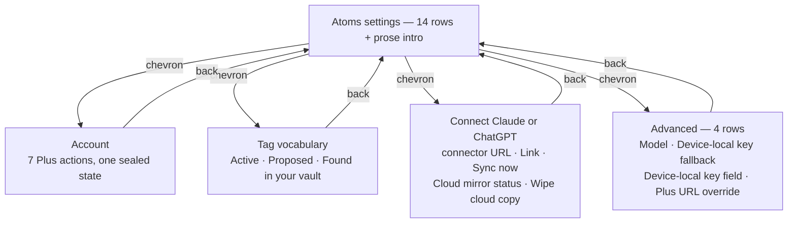
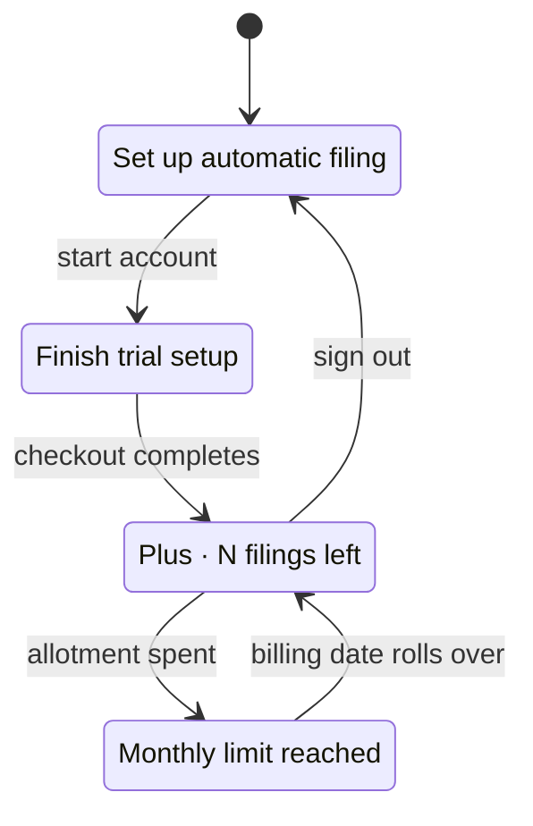
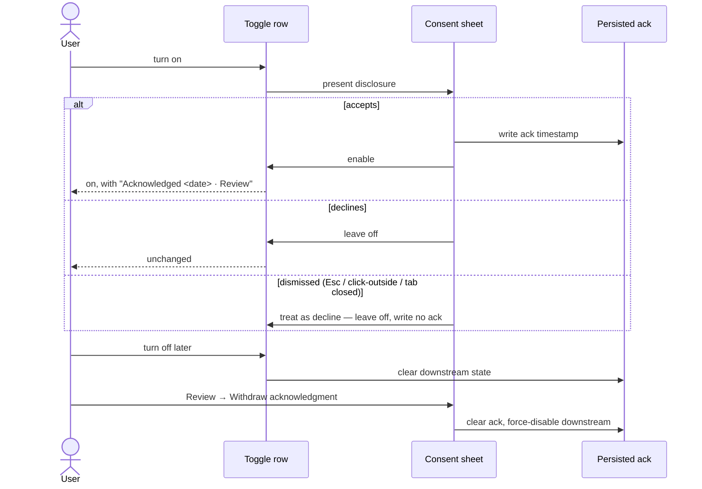

# feat: Give the settings screen a row grammar

**Issue:** [#304](https://github.com/taihartman/obsidian-atoms/issues/304) · **Lane:** full · **Depth:** deep

---

## Summary

The Atoms settings screen renders 48 rows — about 90 once the tag vocabulary expands — as
undifferentiated `Setting` rows. A button that fires a network wipe, a toggle that stores a
preference, and a line of read-only status are visually identical.

This plan gives the screen a **row grammar** (five row kinds, five right-edge affordances), moves
three row clusters into destinations, merges consent disclosures into the toggles they gate, and
deletes three settings and three actions. The main screen ends at **14 rows plus one prose section
intro**, counted in the signed-in Plus state (see *The resulting main screen* for the other states).

Every money, egress, and vault-write gate stays on the main screen. Advanced holds four rows, none
of which gate anything.

---

## Problem frame

Asked which of four failure modes applies during the #304 scoping conversation on 2026-08-05, the
plugin's author — its only daily user today — selected **all four**: too many, can't tell which
matter, jargon, and scared to change them. That is one self-report, not a user study; it is the
whole of the direct evidence, and the structural inventory below is what carries the weight. The
cost of doing nothing is that the screen grows: the tag vocabulary alone takes it from 48 rows to
about 90 as the vocabulary expands, so the row-kind defect compounds rather than holds steady.

Three of the four are not vocabulary problems, so a copy pass could not have fixed this. The
inventory (`docs/handoffs/2026-08-05-settings-inventory.md`) shows why:

| Row kind | Count | Renders as |
|---|---|---|
| Setting — persists a value | 18 | `Setting` row |
| Action — happens now | 19 | `Setting` row |
| Status — read-only | 8 | `Setting` row |
| Prose — an explainer | 3 | `Setting` row |

The screen has no way to say what a row *is*. That is failure mode 2 and failure mode 4 in a single
defect, and it is the thing this plan fixes. Row-count reduction is a consequence, not the goal.

---

## Requirements

| ID | Requirement |
|---|---|
| **R1** | Each row visibly declares its kind: setting, destination, action, destructive, or status. A section-intro paragraph is not a row and is exempt |
| **R2** | No row carries two grammars (never a toggle *and* a button; never a chevron *and* a toggle) |
| **R3** | The Atoms Plus section renders one account row on the main screen; its four states come from one sealed type switched with no catch-all branch |
| **R4** | The tag vocabulary renders as one row on the main screen and opens its own surface |
| **R5** | Every gate on money, cloud egress, or vault writes remains on the main screen — never behind Advanced. A **gate** is any control that enables, disables, or **redirects** money spend, cloud egress, or vault writes |
| **R6** | Consent disclosure is presented when the user enables the thing it gates, and the recorded acknowledgment stays inspectable afterward |
| **R7** | The egress acknowledgment and the Ask privacy acknowledgment remain two separate consents; neither may authorize the other |
| **R8** | Exactly three persisted fields leave `LinkerSettings` — two tuning settings (`shortlistSize`, `expandLinkedNotes`) and one feature gate (`enableReconsiderCapture`, per KTD5); every other reduction is a collapse or an action removal |
| **R9** | Labels quoted verbatim by `www/src/setup.html.tmpl` change only in lockstep with that file, guarded by a test |
| **R10** | Behavior reachable today stays reachable — a deleted *action* row must leave its capability available elsewhere |
| **R11** | The surviving main-screen row *labels* read in plain language — no unglossed product jargon. Setting *descriptions* stay deferred |

---

## Key technical decisions

**KTD1 — Five row kinds, five right edges.** *(session-settled: user-approved — chosen over adding
more section headings: sections thin the screen but never say what a row does.)*

| Kind | Right edge | Rule |
|---|---|---|
| Setting | toggle or input | The only kind that may carry a toggle |
| Destination | chevron | Never also a toggle |
| Action | accent-text button | Never wears a toggle |
| Destructive | `setWarning()` button | Already available in this file |
| Status | muted right-aligned text, no control | Not a full `Setting` row with a description paragraph |

Precedent: iOS Settings holds far more than 48 rows and stays legible because its right edge is a
learnable grammar. Every decision below is downstream of this one. Governs R1, R2.

**KTD2 — Destinations are `containerEl` re-renders, not new views.** `src/settings/settings.ts`
already calls `containerEl.empty()` (`:156`) and `this.display()` (`:140`). A destination is a route
value on the tab plus a back row; no new Obsidian view type, no modal-as-navigation. Governs R3, R4.

**KTD3 — The account section becomes one sealed state.** *(session-settled: user-approved.)* Four
mutually exclusive branches render one row; adding a fifth state must be a compile error. This is
the direct cause of today's duplicated *Refresh status*, *Sign out*, and *Account* rows, which are
four hand-maintained branches rather than a copy defect. Governs R3.

**KTD4 — Consent is a sheet at enable time, not a second permanent toggle.**
*(session-settled: user-approved — chosen over shortening the disclosure text: the length was a
symptom; a seven-clause disclosure living permanently on the screen is a dialog wearing a toggle.)*
The persisted ack fields are unchanged and still required; withdrawal still force-disables
downstream. A muted `Acknowledged <date> · Review` line keeps the record inspectable. This is not
burying — burying is Advanced; this puts the disclosure in front of the user at the moment of
decision instead of decorating the screen of everyone who already agreed. Governs R6.

**The Review sheet is not read-only — it carries the withdrawal.** Today the *only* controls that
clear an ack are the permanent acknowledgment toggles this KTD deletes (`src/settings/settings.ts:846-854`
for egress, `:1165-1174` for Ask privacy). Removing those rows without putting **Withdraw
acknowledgment** on the Review sheet would make consent to store bodies on Plus servers permanent
and unrevocable — a consent model that can be granted but not withdrawn is worse than the row it
replaced. The status line therefore renders **whenever an ack timestamp exists**, not only beneath
an enabled toggle: an ack recorded against a currently-disabled feature is a real state
(`readDeviceAutoRunState` supports `egressAcked` true with `enabled` false) and must stay inspectable
and revocable.

**Any sheet exit that is not an explicit accept is a decline.** Escape, click-outside, and closing
the settings tab each leave the toggle off and write no ack. The toggle has already flipped visually
by the time the sheet opens, so an unhandled dismissal is the path that silently enables egress.

**KTD5 — Delete `enableReconsiderCapture` rather than flipping its default.**
*(session-settled: user-approved — chosen over "flip the default for new installs only": that
required a new install marker because `Object.assign({}, DEFAULT_SETTINGS, raw)` in
`src/plugin/main.ts` would otherwise flip the value for users who never touched it.)* A preference
that gates whether a command-palette command is registered is not a preference. Deleting it removes
the marker work entirely. Governs R8.

*Amended 2026-08-05 after reading [PR #297](https://github.com/taihartman/obsidian-atoms/pull/297),
which this plan was originally written without checking.* The amendment **confirms** KTD5 rather
than reversing it, and it changes U8's sequencing.

#297 ships **Try filing…** — a Library long-press that runs the full Reconsider classify-and-apply
path — and its PR body states the Home path *"does not require the experimental Reconsider settings
flag."* Its entire diff touches `enableReconsiderCapture` in exactly one place: a docstring, `Gated
by…` → `Command palette path — gated by…`. No code it adds reads the field.

So #297 does not depend on the setting **existing**; it depends on the setting **not applying to its
path**. That is the opposite of a dependency, and deleting the field satisfies #297's intent more
completely than keeping it would. KTD5's original premise — that nothing depends on this setting —
survives contact with #297.

Keeping it is the worse outcome. Once #297 lands, the Library gesture runs Reconsider ungated on
every platform while a toggle reading *"Experimental… Off by default"* still gates the command
palette entry to the same function. A user who has used Try filing and then cannot find Reconsider
in the palette has found a lie in the settings screen — the exact failure mode this plan exists to
remove.

**KTD6 — Deletion conservatism binds settings, not actions.** The rule exists because deleting a
setting silently overrides a value someone chose. An action stores nothing, so removing one
overrides nothing — but it does cost discoverability, not just a click: a visible row becomes a
searched command, which is a larger step on the iOS and Android consumers than on desktop. Each
removal below therefore names *where* the capability survives, and U9's survivor must be a command
this plugin registers, not a core-plugin coincidence. This is what licenses removing three action
rows while removing only two *tuning* settings. Governs R8, R10.

**KTD7 — The two consent gates are not unified.** *(session-settled: user-directed.)* The egress ack
covers *your own key sending captures to Anthropic*. The Ask ack covers *bodies stored on Atoms Plus
servers, decryptable at rest in v1*. The write ack (`askWriteAckAt`) covers *Claude or ChatGPT
creating new files in your vault*. Merging any two would let agreeing to one silently authorize
another. **Three acks, three sheets, permanently** — accepting any one sheet sets exactly its own
ack field and no other. Governs R7.

**KTD8 — Deleted settings leave their keys behind, and that is correct.** Removing a field from
`LinkerSettings` leaves the key in existing `data.json` files, where nothing reads it. No migration,
no cleanup pass, no user-visible effect. Attempting to strip stale keys would be a write to every
user's `data.json` for zero benefit. Governs R8.

---

## High-level technical design

The main screen and its four destinations:

The account row's sealed state — one row, four renderings, no catch-all:

The consent flow, replacing two rows with one:

---

## The resulting main screen

Fourteen rows plus one prose section intro. Every entry in the Kind column is one of R1's five
kinds; the Capture section's intro is a paragraph, not a row, and is exempt from R1 (U9).

| # | Row | Kind |
|---|---|---|
| 1 | Account state | Destination |
| — | *Daily capture format* | prose — Capture section intro, not a row |
| 2 | iCloud shortcut link | Setting |
| 3 | Capture Atom shortcut | Action |
| 4 | Atom folder | Setting |
| 5 | Hub projection — *writes into your existing person notes* | Setting |
| 6 | Tag vocabulary — 13 active | Destination |
| 7 | Ask mirror — *copies Atoms/ to Atoms Plus servers* | Setting † |
| 8 | Allow filing from Claude or ChatGPT — *creates new files in your vault* | Setting † |
| 9 | Connect Claude or ChatGPT | Destination |
| 10 | Auto-run on open — *sends each capture to Anthropic, unattended* | Setting † |
| 11 | Sync automatically on resume | Setting |
| 12 | Sync everything now | Action |
| 13 | Anthropic API key — validates inline | Setting |
| 14 | Advanced | Destination |

† A Setting whose enable path presents a consent sheet (U5). The sheet is a modal, not a right-edge
affordance, so the row's kind stays Setting and R2 holds.

**Which state this counts.** Fourteen is the **signed-in Plus** screen. Rows 7-9 live in the Ask
section, which renders only when a Plus session exists (`renderAskSection` reads `readPlusSession`
at `src/settings/settings.ts:1141`), so a **signed-out** install shows **11 rows plus the prose
intro**. Trial-incomplete and exhausted match signed-in at 14; only row 1's label changes. The live
smoke and Definition of Done both name the state they measure.

---

## Implementation units

### U0. Settings-rendering test harness

**Goal:** A vitest test can render a settings row and assert what came out.
**Requirements:** prerequisite for R1, R2 — every U1-U6 test scenario asserts rendered output
**Dependencies:** none
**Files:** `test/mocks/obsidian.ts`, `vitest.config.ts`, `tsconfig.test.json`
**Approach:**

1. **Nothing in the repo can render a settings row today.** `vitest.config.ts:7` sets
   `environment: "node"` with no jsdom or happy-dom dependency; `test/mocks/obsidian.ts:7` stubs
   `PluginSettingTab` as an empty class with no `containerEl`; and its `Setting` stub (`:11`) is a
   no-op chainable whose `addToggle()` (`:27`) discards its callback, with no `setWarning`,
   `setClass`, `settingEl`, or `controlEl`. `test/settings.test.ts` — named as the test home by U3,
   U4, U5, U6, U8, and U9 — is a pipeline-retrieval test file with zero UI assertions.
2. Switch `vitest.config.ts` to a DOM environment and add the Obsidian `createEl` / `createDiv` /
   `empty` HTMLElement augmentations the plugin relies on.
3. Extend the `Setting` mock into a DOM-backed recorder: it records name and description, records
   each control added and in what order, exposes `settingEl` / `controlEl`, and supports
   `setWarning`, `setClass`, and `addExtraButton`. Give `PluginSettingTab` a real `containerEl`.
4. Add the file holding U2's and U3's type-level assertions to `tsconfig.test.json`'s `include`
   list — it currently lists only `askMirror.test.ts`, `askMirrorGate.adversarial.test.ts`, and
   `catchUp.test.ts`, and `tsconfig.json` excludes `test/` entirely, so an assertion written
   anywhere else is typechecked by neither `npm run build` nor `npm test`.

**Execution note:** This unit exists because U1's test-first mandate is otherwise unexecutable. Land
it before U1 or U1 stalls on an unmade decision. That file's own header documents the matching past
failure: inert `@ts-expect-error` assertions in a file nothing typechecked.
**Test scenarios:**
- A `Setting` built in a test exposes its name, description, and the controls added to it
- A deliberately broken type-level assertion in the newly-included test file fails `npm test`
**Verification:** a throwaway test that renders one row and asserts its right-edge control passes,
and fails when the control is changed.

### U1. Row-grammar primitives

**Goal:** One place that knows how each row kind renders.
**Requirements:** R1, R2
**Dependencies:** U0
**Files:** `src/settings/rows.ts` (new), `test/settingsRows.test.ts` (new)
**Approach:**

1. Add small builders — `settingRow`, `destinationRow`, `actionRow`, `destructiveRow`, `statusRow` —
   each wrapping `new Setting(containerEl)` and applying exactly one right-edge affordance.
2. Each builder takes name, optional description, and its one control. No builder accepts a second
   control kind.
3. **Signatures alone do not enforce R2 — close both holes.** Obsidian's `Setting` is a chainable
   builder, so a caller holding the returned object can add a second affordance after the fact:
   give every builder a `void` return, matching the existing `settingHeading()` helper. And a
   signature constrains only rows built *through* a builder, while `src/settings/settings.ts` holds
   51 direct `new Setting(` call sites that U3-U6 keep editing — add a repository guard asserting
   that `settings.ts` constructs no `Setting` directly outside `src/settings/rows.ts`.
4. `destructiveRow` uses the existing `setWarning()` path already in `settings.ts` (`markDestructive()`
   at `:106`, direct call at `:1517`).

**Patterns to follow:** the existing `settingHeading()` helper at `src/settings/settings.ts:109` —
same shape, same file-local style, same `void` return.
**Execution note:** Build the primitives test-first; they are the substrate every later unit sits on
and the blast radius of a bug here is the whole screen.
**Test scenarios:**
- `settingRow` with a toggle renders exactly one control and no button
- `destinationRow` renders a chevron affordance and invokes its callback on click
- `actionRow` renders a button and no toggle
- `destructiveRow` applies the warning style
- `statusRow` renders no interactive control and carries its value as muted trailing text
- The repository guard fails when a direct `new Setting(` is reintroduced into `settings.ts`
**Verification:** the five builders exist, are covered, no builder can emit two right-edge
affordances, and no builder returns a chainable the caller can extend.

### U2. Destination shell

**Goal:** The settings tab can render a sub-screen and come back.
**Requirements:** R1
**Dependencies:** U0, U1
**Files:** `src/settings/settings.ts`, `test/settingsRows.test.ts`
**Approach:**

1. Add a route field on the tab (`main` plus one value per destination) and switch on it in
   `display()`. Close the switch with `const _exhaustive: never = route;` — a switch inside a
   void-returning render method is **not** flagged by `noImplicitReturns`, so "no `default` branch"
   alone does not make a missing case a compile error.
2. Each destination renders a back row first, then its own content.
3. Leaving and re-entering settings resets to `main`. `settings.ts` has no `hide()` override today
   (only `display()` at `:154` and `redisplay()` at `:137`); add the reset hook rather than assuming
   one. Note that `redisplay()` restores `scrollTop`, which is wrong for a destination switch — a
   route change re-renders from the top.

**Patterns to follow:** `containerEl.empty()` at `src/settings/settings.ts:156` and `this.display()`
at `:140` — the re-render path already exists; this unit only adds the route.
**Test scenarios:**
- Entering a destination and pressing back returns to the main screen
- Closing and reopening the settings tab lands on `main`, not the last destination
- Adding a route value without a matching branch fails `npm test`'s `typecheck:test` step (the
  assertion lives in a file U0 added to `tsconfig.test.json`)
- Switching routes renders from the top rather than restoring the previous scroll position
**Verification:** all four destinations are reachable and reversible, and the exhaustiveness
assertion fails when a route is added without a branch.

### U3. Account destination and sealed account state

**Goal:** 16 Plus rows become one row plus a destination.
**Requirements:** R3, R5
**Dependencies:** U0, U1, U2
**Files:** `src/settings/settings.ts`, `test/settings.test.ts`
**Approach:**

1. Model the four account states as one sealed type and `switch` with **no `default` branch**. "No
   `default`" is necessary but not sufficient: TypeScript flags a missing case only where the
   function must produce a value, and `noImplicitReturns` does not fire on a void-returning
   renderer. Have the account renderer **return a row descriptor** instead of rendering inline, and
   close its switch with `const _exhaustive: never = state;`. That is what turns a fifth state into
   a build failure.
2. The main-screen row renders that state's label and a chevron.
3. The destination holds Refresh status, Manage, Sign out, Email, Sign in on another device, Skip
   the API key, and Advanced: paste session — each once, not once per branch.

**Test scenarios:**
- Each of the four states renders its own main-screen label
- Adding a fifth state to the sealed type fails `npm test`'s `typecheck:test` step without a new
  branch (the assertion lives in a file U0 added to `tsconfig.test.json`; `npm run build` excludes
  `test/` and will never see it)
- Refresh status, Sign out, and Account each appear exactly once in the destination
- Signed-out state offers account setup and does not render Manage
**Verification:** the duplicated Refresh status / Sign out / Account rows no longer exist anywhere,
and the exhaustiveness assertion is proven to fail by deliberately adding a fifth state.

### U4. Tag vocabulary destination

**Goal:** ~45 rendered rows become one.
**Requirements:** R4
**Dependencies:** U0, U1, U2
**Files:** `src/settings/settings.ts`, `test/settings.test.ts`
**Approach:**

1. Main screen: one destination row reading `Tag vocabulary — N active`, where N is
   `activeVocabulary.length`.
2. Destination: Active, Proposed (only when non-empty), and Found in your vault, as three groups
   with their existing behavior unchanged.

**Test scenarios:**
- The main row's count matches `activeVocabulary.length`
- With zero proposed tags, the Proposed group does not render
- Activating a vault tag moves it into Active and updates the main row's count
- Adding a custom tag normalizes it as it does today
**Verification:** the main screen renders one tag row regardless of vocabulary size.

### U5. Consent sheets

**Goal:** Three acknowledgment rows disappear into the toggles they gate, without losing withdrawal.
**Requirements:** R5, R6, R7
**Dependencies:** U0, U1
**Files:** `src/settings/settings.ts`, `test/settings.test.ts`, `test/askMirrorGate.adversarial.test.ts`
**Approach:**

1. Enabling *Auto-run on open* presents the egress disclosure as a sheet; accepting writes the
   existing device-local ack key, declining leaves the toggle off.
2. Enabling *Ask mirror* does the same against `askPrivacyAckAt`.
3. **Enabling *Allow filing from Claude or ChatGPT* does the same against `askWriteAckAt`.** This is
   the third sheet, not a copy of the second: it authorizes writes *into the vault*, its disclosure
   lives in that toggle's own description today (`src/settings/settings.ts:1202-1226`), and KTD7's
   independence rule binds all three. It keeps today's prerequisite — the row stays disabled while
   Ask mirror is off (`setDisabled(!ack || !askEnabled)` at `:1210`) and its description still says
   *Requires Ask mirror enabled*.
4. **Any sheet exit that is not an explicit accept is a decline** — Escape, click-outside, closing
   the settings tab. The toggle has already flipped visually when the sheet opens, so an unhandled
   dismissal is the path that silently enables egress.
5. Wherever an ack timestamp exists — **not only beneath an enabled toggle** — render a muted
   `Acknowledged <date> · Review` status line. The Review sheet re-presents the disclosure and
   carries a **Withdraw acknowledgment** action. Without it there is no withdrawal UI at all: the
   only controls that clear an ack today are the permanent toggles at `:846-854` and `:1165-1174`
   that this unit deletes.
6. **Correcting today's cascade before preserving it.** The plan previously described this
   backwards. What the code actually does: clearing `askPrivacyAckAt` sets `askEnabled = false` and
   **does not touch** `askWriteAckAt` (`:1167-1171`); `askWriteAckAt` is cleared only by the Ask
   mirror toggle's own off path (`:1192`). Withdrawing the privacy ack therefore leaves a live
   vault-write consent behind. Keep the egress cascade as-is (clearing the egress ack force-disables
   auto-run) and **deliberately harden** the Ask side: withdrawing `askPrivacyAckAt` now also clears
   `askWriteAckAt`. Not currently exploitable — `askCoordinator.ts:139-140` checks both fields — but
   the plan is the contract for the rewrite and should state the stricter behavior on purpose.

**Patterns to follow:** `AskMirrorDeleteConfirmModal` at `src/settings/settings.ts:1473` and the
inline `new Modal(this.app)` at `:1385`.
**Execution note:** These three toggles gate egress, cloud storage, and vault writes. Write the
decline-path, dismissal-path, and withdrawal-cascade tests before the happy path.
**Test scenarios:**
- Declining the sheet leaves the toggle off and writes no ack
- Escape, click-outside, and closing the settings tab each behave exactly as decline
- Accepting writes the ack timestamp and enables the toggle
- The status line renders for an ack recorded against a currently-disabled feature, and its Review
  sheet still offers Withdraw
- Withdrawing from the Review sheet clears that ack and force-disables everything downstream
- Withdrawing `askPrivacyAckAt` clears `askWriteAckAt` and disables the mirror
- Turning off Ask mirror clears `askWriteAckAt`
- Turning off the egress ack force-disables auto-run
- *Allow filing* stays disabled while Ask mirror is off
- Accepting any one of the three sheets sets exactly its own ack field and neither of the other two
  (R7 — all three consents stay independent)
**Verification:** no ack can be granted by accepting another's sheet, and every ack that can be
granted can be withdrawn from the same surface.

### U6. Connect and Advanced destinations; inline key validation

**Goal:** Ask plumbing and the four Advanced rows leave the main screen; *Test connection* becomes
part of the field it was compensating for.
**Requirements:** R1, R5, R10
**Dependencies:** U0, U1, U2
**Files:** `src/settings/settings.ts`, `test/connectivity.test.ts`, `test/settings.test.ts`
**Approach:**

1. **Connect Claude or ChatGPT** destination: MCP connector URL, Link, Sync now, Cloud mirror
   status, Wipe cloud copy (destructive, beside what it destroys).
2. **Advanced** destination, exactly four rows: Model; Device-local key fallback (toggle); the
   device-local key field it gates (rendered when the toggle is on); Plus service URL override.
   Carry the existing *Leave these alone unless you self-host or dogfood a local Plus server*
   caution (`src/settings/settings.ts:1443`) into the destination with the row.
3. **Ruling the two borderline rows against R5's definition of a gate** (enables, disables, or
   redirects money / egress / vault writes). *Plus service URL override* **redirects** where mirrored
   bodies are sent (`askCoordinator.ts:161`, `:266`, `classifyAuth.ts:56`, `plusResume.ts:45`) — it
   is a redirect, not a gate: it cannot turn egress on, only point existing egress elsewhere, and it
   is inert unless Ask mirror is already enabled by a main-screen gate. *Model* affects per-capture
   spend but does not enable spend. Both stay in Advanced, on the record, rather than by silence.
4. The Anthropic API key field validates on save and reports inline — reachability included — and
   the standalone *Test connection* row is removed. The underlying `runTestConnection()` capability
   is reused, not deleted (R10); the reusable seam is `runConnectivityTest()` in
   `src/platform/connectivity.ts` (injectable request, structured report), not `main.ts:1327`'s
   Notice wrapper. The command-palette entry (`commands.ts:128`) and the Home menu item
   (`atomsHomeView.ts:2495`) both survive independently.
5. **Re-verify on render, not only on save.** A save event is the only trigger the row would
   otherwise have, so a user whose key was saved while offline — U6's own test case — could never
   re-check without re-entering the key. Re-run the check when the row renders with a saved key and
   surface the outcome as that row's status text.

**Test scenarios:**
- Saving a malformed key surfaces an inline error and does not report success
- Saving a valid key with no network surfaces a reachability failure, distinct from an invalid key
- The field shows a pending/checking state while the network check is in flight, distinct from both
  terminal outcomes
- Rendering the row with an already-saved key re-verifies it without re-entry
- Wipe cloud copy still requires its confirmation modal
- Advanced holds exactly the four rows above, and none of them enables, disables, or redirects money,
  egress, or vault writes (R5 — assert the property against the definition, not the current list)
**Verification:** the API key row alone tells the user whether their key works, on render as well as
on save.

### U7. Delete `shortlistSize` and `expandLinkedNotes`

**Goal:** Two pure tuning knobs become constants.
**Requirements:** R8
**Dependencies:** none
**Files:** `src/shared/types.ts`, `src/pipeline/context.ts`, `src/plugin/main.ts`,
`src/settings/settings.ts`, `test/settings.test.ts`
**Approach:**

1. Drop both fields from `LinkerSettings` and `DEFAULT_SETTINGS` (`src/shared/types.ts:144`, `:146`,
   `:194`, `:195`).
2. `src/pipeline/context.ts:183-187` currently takes
   `Partial<Pick<LinkerSettings, "shortlistSize" | "expandLinkedNotes">>` and falls back to
   `clampShortlistSize()` and `DEFAULT_GRAPH_EXPANSION`. Drop the parameter; use `DEFAULT_SHORTLIST_K`
   and `DEFAULT_GRAPH_EXPANSION` directly.
3. **Update the eight `shortlistOptionsFromSettings(this.settings)` call sites in
   `src/plugin/main.ts`** — `:521`, `:1044`, `:1146`, `:1175`, `:1533`, `:1654`, `:1720`, `:2059`,
   plus the import at `:50` — to the zero-argument form. Without this the typecheck fails with
   *Expected 0 arguments, but got 1* and `npm run build` goes red; `main.ts` is the largest reader
   of these keys and was missing from this unit's file list.
4. `test/settings.test.ts:90` pins `DEFAULT_SETTINGS.shortlistSize` to `DEFAULT_SHORTLIST_K`. That
   pin is the reason the comment at `src/shared/types.ts:192` exists; both go away together.
5. Retune the cases at `test/settings.test.ts:129`, `:141`, `:160`, `:172`, `:186`, which vary these
   values — they must now assert default behavior rather than configured behavior.
6. Keep `clampShortlistSize` and `MIN_SHORTLIST_K` exported as the defensive clamp inside
   `shortlistOptionsFromSettings`'s replacement — after this unit they have no other production
   caller, but roughly 25 pure-clamp assertions at `test/settings.test.ts:88-124` still exercise
   them. Those assertions stay; only the `DEFAULT_SETTINGS.shortlistSize` pin at `:90` goes.
7. Per KTD8, leave stale keys in existing `data.json` untouched.

**Test scenarios:**
- Context building uses `DEFAULT_SHORTLIST_K` with no settings input
- Graph expansion is on with no settings input
- A `data.json` still carrying `shortlistSize: 50` loads without error and has no effect on retrieval
- `npm run build` typechecks clean (proves every `main.ts` call site was updated)
**Verification:** no reference to either key remains outside historical docs, and the build is green.

### U8. Delete `enableReconsiderCapture`

**Goal:** The command exists unconditionally.
**Requirements:** R8, R10
**Dependencies:** [PR #297](https://github.com/taihartman/obsidian-atoms/pull/297) — **satisfied**,
merged 2026-08-05 as `622f095` (see KTD5 amendment). Line numbers below are re-anchored against
that merge — the `main.ts` sites moved +1.
**Files:** `src/shared/types.ts`, `src/plugin/main.ts`, `src/pipeline/reconsider.ts`,
`src/settings/settings.ts`, `test/settings.test.ts`
**Approach:**

1. Remove the field (`src/shared/types.ts:171`, `:215`) and the settings row
   (`src/settings/settings.ts:983-995`).
2. Remove the guard at `src/plugin/main.ts:1987` and the comment above it at `:1984` — post-#297
   that comment reads `Command palette path — gated by…`, and the whole block goes.
3. Remove `flagOffNotice()` (`src/pipeline/reconsider.ts:142`) and its now-unused import at
   `src/plugin/main.ts:79`. The helper existed only to explain the deleted flag; nothing breaks if
   it stays (`tsconfig.json` sets no `noUnusedLocals`), but it becomes dead code the shipping tail
   would flag anyway.
4. No install marker and no default flip — that work is dissolved by KTD5, not deferred.

**Test scenarios:**
- The Reconsider capture command is registered on a fresh install
- The command is registered for a profile whose `data.json` carries
  `enableReconsiderCapture: false`
- Invoking it on a line with no skip marker behaves as it does today
**Verification:** the command palette exposes Reconsider capture with no setting anywhere.

### U9. Remove three action rows and demote one prose row

**Goal:** Rows that were never settings stop occupying settings.
**Requirements:** R1, R10
**Dependencies:** U1
**Files:** `src/settings/settings.ts`, `test/settings.test.ts`
**Approach:**

1. **Register `openTodaysDailyFromHome()` as an Atoms command first, then** delete *Open today's
   daily*. The plan previously claimed "the command palette already opens the daily note" — it does
   not: `src/plugin/commands.ts` registers no daily-note command, and
   `openTodaysDailyFromHome()` (`src/plugin/main.ts:571`) has exactly one caller, the row being
   deleted. Atoms Home does reach the same `openTodaysDaily(app)` path
   (`src/home/atomsHomeView.ts:2509`), and Obsidian's core Daily notes plugin has its own command —
   but that is a different code path the user can disable, so R10's survivor must be a command this
   plugin owns. Registering it also stops the deletion stranding `openTodaysDailyFromHome()` as
   dead code.
2. Delete *Self-host Ask* — the DIY guide stays in `docs/ask-self-host.md`; the settings row was a
   link.
3. Convert *Daily capture format* from a `Setting` row into the Capture section's intro paragraph.
   It is then a paragraph, not a row: it is exempt from R1 and is not counted among the 14.

**Test scenarios:**
- The Capture section renders its intro as prose, not as a row with a control
- An Atoms command for today's daily note is registered, and no settings row invokes daily-note
  creation
- The self-host guide remains reachable from documentation
**Verification:** the Capture and Ask sections contain only rows that persist or act, and every
deleted action's survivor is a capability this plugin registers.

### U10. Website lockstep and label-binding test

**Goal:** The surviving labels read in plain language, and the setup guide cannot drift from them.
**Requirements:** R9, R11
**Dependencies:** U3, U5, U6
**Files:** `www/src/setup.html.tmpl`, `src/settings/captureShortcut.ts`,
`test/wwwPricing.test.ts` or a new `test/wwwSetupLabels.test.ts`
**Approach:**

1. Three quoted labels survive unchanged: `Install Capture Atom` (`:222`), `MCP connector URL`
   (`:335`), `Allow filing from Claude or ChatGPT` (`:386`).
2. Two change and must be edited in this unit: `Enable Ask mirror` (`:330`) becomes **Ask mirror**,
   and `Get pairing code` (`:357`) now lives inside the Connect destination — the guide must say
   where to find it, not only what to press.
3. Bind each quoted label to **its owning source file**, not to `settings.ts` blanket:
   `Install Capture Atom` is **not** in `settings.ts` — it lives in
   `src/settings/captureShortcut.ts:130-132` as one arm of a conditional return
   (`"Install Capture Atom" | "Update Capture Atom"`, chosen by whether the shortcut has been
   acked). The other four resolve in `settings.ts` (`:1177`, `:1203`, `:1229`, `:1298`).
4. **Plain-language pass over the 14 surviving row labels (R11).** Do this *before* step 3's
   bindings, so a label is renamed once and bound once. Scope is labels only — descriptions stay
   deferred. The rule: a label names what the row does to the user's stuff, not what the subsystem
   is called internally. Candidates the inventory and the problem frame both name — *Hub
   projection*, *Ask mirror*, *Auto-run on open*, *Atom folder* — but judge all 14 against the rule
   rather than only the flagged four. A label already quoted by the setup guide changes only in
   lockstep with it, which this unit owns. `egress` is not a user-facing word; if a survivor needs
   it, it needs a `CONCEPTS.md` entry instead (already flagged in the inventory's Observations).
5. Assert the guide side against the **built** `www/dist/setup.html`, not the `.tmpl` source.
   `package.json` already runs `pretest: npm run build:www`, so the built output exists at test time
   and the existing `wwwPricing` guard reads it. Asserting template-vs-source leaves exactly the gap
   that let the #302 test pass.

**Execution note:** A new test is not a guard until it has failed. Mutate a label in its owning
source file, confirm the test fails, then revert — the hero test on #302 passed against a mutation
string that did not exist in the built output. Paste the failing run's output into the PR Evidence
table so the mutation check is auditable rather than self-reported; a prose instruction is what
failed last time.
**Test scenarios:**
- Each of the five labels appears in both its owning source file and the built `www/dist/setup.html`
- Renaming a label in its owning source file without updating the guide fails the test
  (mutation-verified, with the failing output captured)
- The guide's pairing-code step names the destination it now lives in
**Verification:** the mutation check failed before it passed, and the failure is on the record.

---

## Phasing

| Phase | Units | Why grouped |
|---|---|---|
| Harness | U0 | Nothing in U1-U6 is testable until a settings row can be rendered in vitest |
| Foundation | U1, U2 | Everything else composes these; ship them before any row moves |
| Collapse | U3, U4, U5, U6 | The four destinations and the consent merge — the bulk of the reduction |
| Subtraction | U7, U8, U9 | Logically independent of Collapse. **U8's #297 gate is satisfied** — merged 2026-08-05 as `622f095` |
| Lockstep | U10 | Depends on the final labels, so it lands last |

**"In parallel" means within one branch, not one-PR-per-phase.** U3 through U9 all edit
`src/settings/settings.ts`, which Collapse is simultaneously restructuring, so landing Subtraction
as a separate PR means resolving conflicts on the file under rewrite. All phases ship as a single PR
carrying `Closes #304`.

---

## Scope boundaries

**In scope:** the settings screen's structure, row grammar, the three `LinkerSettings` deletions
above (two tuning settings plus the `enableReconsiderCapture` gate), the test harness U0 adds, and
the `setup.html.tmpl` edits forced by label changes.

**Not in scope:**
- `enableHubProjection`'s default. It is enshrined default-off at `docs/architecture.md:187` and
  framed as a narrow carve-out at `docs/spec-amendments.md:330`; changing it requires a constitution
  PR. This plan changes its placement and its sub-label, never its default.
- Any change to what the pipeline does. This is a presentation plan.
- Recapturing the `/setup` screenshots. Flagged as a follow-up on #277/#278 and still open.

### Deferred to follow-up work

- Rewriting the remaining setting *descriptions* for plain language. **Labels are no longer
  deferred — R11 and U10 bring them into this change** (user decision, 2026-08-05): jargon was one
  of the four reported failure modes, the labels are where it lives, and U10 is already editing both
  sides of the setup-guide lockstep, so splitting label and description work costs a second lockstep
  round for nothing. Descriptions remain deferred and are easier to judge once there are 14 rows
  instead of 90. File them as their own issue and reference it from the PR, so `Closes #304` does
  not retire a failure mode nothing addressed.
- A **consequence affordance** in the grammar — a mark distinguishing rows that spend money, egress,
  or write to the vault from ordinary preferences. Considered and deliberately not taken now: it
  widens session-settled KTD1, and the R11 label pass attacks the same target more directly. The
  verification contract's outcome check decides whether it is still wanted, with evidence.
- `CONCEPTS.md` entries for "shortlist" and "egress", flagged in the inventory's Observations. The
  shortlist term disappears from the UI in U7; egress survives and still wants a definition.

---

## Risks

| Risk | Mitigation |
|---|---|
| Shared primitives spread a bug everywhere at once | U1 is test-first with full per-kind coverage, landed before any consumer |
| A consent regression is a privacy incident, not a UI bug | U5's decline-path, independence, and withdrawal-cascade tests are written first; `test/askMirrorGate.adversarial.test.ts` already exists and must stay green |
| A destination hides something that must not be hidden | R5 is asserted as a membership test in U6 — Advanced's contents are pinned by a test, not by review |
| The setup guide silently drifts | U10's binding test, mutation-verified |
| Users lose a capability with a deleted action row | KTD6 permits removing actions only where the capability survives elsewhere; U6 and U9 each name a survivor this plugin registers, verified against `commands.ts` rather than assumed |
| A consent can be granted but never withdrawn | KTD4's Review sheet carries Withdraw, and U5 tests withdrawal for all three acks including the ack-present / feature-disabled state |
| A compile-time guarantee that does not compile-time-guarantee | U0 puts the assertions in a typechecked file; U2 and U3 use `never` assignments rather than relying on a missing `default` |

---

## Verification contract

- `npm test` green, including the retuned `test/settings.test.ts` and the new
  `test/settingsRows.test.ts`
- `npm run build` clean (typecheck is the enforcement mechanism for the sealed account state)
- `./scripts/verify.sh` with Obsidian open on the throwaway vault
- Live smoke in `test_vault/`: open settings, count the main-screen rows **and record which account
  state was signed in**, enter and leave each of the four destinations, toggle one consent sheet
  through accept / decline / dismiss-without-choosing / withdraw
- **Outcome check.** Re-pose the four failure modes from the Problem frame — too many, can't tell
  which matter, jargon, scared to change them — against the shipped screen and record the answers in
  the `world-class-qa` report. Every other item here measures structure; this is the only one that
  measures whether the reported problem is gone, and its answer tells the deferred copy pass whether
  it is still needed.
- Screenshots of the main screen and each destination committed under
  `docs/qa/screenshots/feat-settings-row-grammar/` and linked in the PR body with absolute
  `raw.githubusercontent.com` URLs. **Capture the Account and Advanced destinations signed-out with
  no key present, or redact before committing** — those two render an Email row, an
  *Advanced: paste session* field, and the device-local API key field, and the committed images are
  served publicly and permanently from a public repo's history
- Capture screenshots twice and use the second — the first returns the stale frame
  (`docs/solutions/documentation-gaps/screenshot-capture-races-and-viewer-lies.md`)

## Definition of done

1. Every main-screen row declares one of R1's five kinds; the screen lands at 14 rows plus one prose
   section intro in the signed-in Plus state (11 plus the intro signed out)
2. Every money, egress, and vault-write gate is on the main screen; Advanced holds exactly four rows,
   none of which enables, disables, or redirects money, egress, or vault writes
3. The account state is a sealed type whose switch fails to compile on a fifth state — proven by
   adding one, not asserted
4. All three consents are independent, all three can be withdrawn from the surface that granted
   them, and every non-accept sheet exit behaves as decline
5. `shortlistSize`, `expandLinkedNotes`, and `enableReconsiderCapture` are gone from
   `LinkerSettings`, their readers — including the eight `main.ts` call sites — and the UI
6. The setup guide matches its labels' owning source files, guarded by a test whose mutation failure
   is captured in the PR
7. Every surviving main-screen label reads in plain language (R11); the deferred *description*
   rewrite is filed as its own issue and referenced from the PR
8. The outcome check ran: the four failure modes were re-posed against the shipped screen and the
   answers are recorded
9. Shipping tail complete: `ce-simplify-code`, `ce-code-review`, `ce-compound`, `world-class-qa`
   including its adversarial half
10. PR body carries `Closes #304`, core user stories, edge cases, and the screenshot evidence table

---

## Sources

- `docs/handoffs/2026-08-05-settings-inventory.md` — the 48-row inventory this plan assigns
- `docs/handoffs/2026-08-05-settings-off-by-default-rationale.md` — why each off-by-default setting
  ships off, classified hard-gate / caution / incidental
- Issue [#304](https://github.com/taihartman/obsidian-atoms/issues/304)
- `docs/architecture.md:187`, `docs/spec-amendments.md:330` — the `enableHubProjection` carve-out
- `docs/solutions/documentation-gaps/screenshot-capture-races-and-viewer-lies.md`

**Line-number caveat:** the caveat applies to the **inventory**, not to this plan. The inventory was
written against a 1511-line `settings.ts`; the file is 1536 lines now, and sections after Capture
shifted about +25. Names, keys, and descriptions are unaffected. Re-anchor an inventory row against
the live file — by symbol, not by line — before editing anything past the Capture section.

Every line number **this plan** cites was re-verified against the worktree on 2026-08-05 and is
correct as written: `settings.ts` at 1536 lines with `markDestructive()` `:106`, `settingHeading()`
`:109`, `redisplay()` `:137`, `display()` `:140`/`:154`, `containerEl.empty()` `:156`,
`renderPlusSession` gate `:1141`, `new Modal(this.app)` `:1385`, `AskMirrorDeleteConfirmModal`
`:1473`, the Reconsider row `:983-995`; `types.ts` `:144`/`:146`/`:171`/`:192`/`:194`/`:195`/`:215`;
`main.ts` `:1984`/`:1987` post-#297; `context.ts:183-187`; `test/settings.test.ts`
`:90`/`:129`/`:141`/`:160`/`:172`/`:186`; `setup.html.tmpl` `:222`/`:330`/`:335`/`:357`/`:386`.
