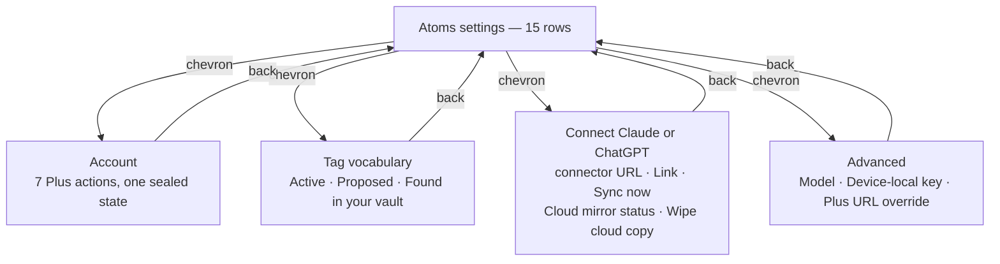
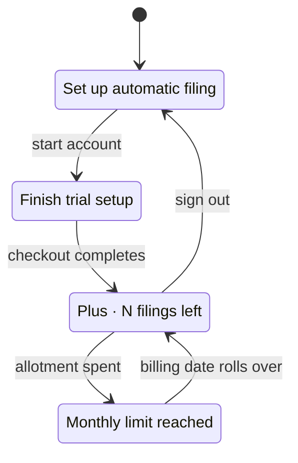
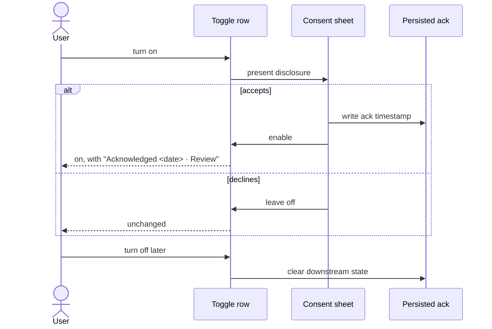

# feat: Give the settings screen a row grammar

**Issue:** [#304](https://github.com/taihartman/obsidian-atoms/issues/304) · **Lane:** full · **Depth:** deep

---

## Summary

The Atoms settings screen renders 48 rows — about 90 once the tag vocabulary expands — as
undifferentiated `Setting` rows. A button that fires a network wipe, a toggle that stores a
preference, and a line of read-only status are visually identical.

This plan gives the screen a **row grammar** (four row kinds, four right-edge affordances), moves
three row clusters into destinations, merges consent disclosures into the toggles they gate, and
deletes two settings and three actions. The main screen ends at **15 rows**.

Every money, egress, and vault-write gate stays on the main screen. Advanced holds four rows, none
of which gate anything.

---

## Problem frame

Asked which of four failure modes applies, the user selected **all four**: too many, can't tell
which matter, jargon, and scared to change them.

Three of the four are not vocabulary problems, so a copy pass could not have fixed this. The
inventory (`docs/handoffs/2026-08-05-settings-inventory.md`) shows why:

| Row kind | Count | Renders as |
|---|---|---|
| Setting — persists a value | 18 | `Setting` row |
| Action — happens now | 19 | `Setting` row |
| Status — read-only | 8 | `Setting` row |
| Prose — an explainer | 3 | `Setting` row |

The screen has no way to say what a row *is*. That is failure mode 2 and failure mode 4 in a single
defect, and it is the thing this plan fixes. Row-count reduction is a consequence, not the goal.

---

## Requirements

| ID | Requirement |
|---|---|
| **R1** | Each row visibly declares its kind: setting, destination, action, destructive, or status |
| **R2** | No row carries two grammars (never a toggle *and* a button; never a chevron *and* a toggle) |
| **R3** | The Atoms Plus section renders one account row on the main screen; its four states come from one sealed type switched with no catch-all branch |
| **R4** | The tag vocabulary renders as one row on the main screen and opens its own surface |
| **R5** | Every gate on money, cloud egress, or vault writes remains on the main screen — never behind Advanced |
| **R6** | Consent disclosure is presented when the user enables the thing it gates, and the recorded acknowledgment stays inspectable afterward |
| **R7** | The egress acknowledgment and the Ask privacy acknowledgment remain two separate consents; neither may authorize the other |
| **R8** | Exactly two persisted settings are removed (`shortlistSize`, `expandLinkedNotes`); every other reduction is a collapse or an action removal |
| **R9** | Labels quoted verbatim by `www/src/setup.html.tmpl` change only in lockstep with that file, guarded by a test |
| **R10** | Behavior reachable today stays reachable — a deleted *action* row must leave its capability available elsewhere |

---

## Key technical decisions

**KTD1 — Four row kinds, four right edges.** *(session-settled: user-approved — chosen over adding
more section headings: sections thin the screen but never say what a row does.)*

| Kind | Right edge | Rule |
|---|---|---|
| Setting | toggle or input | The only kind that may carry a toggle |
| Destination | chevron | Never also a toggle |
| Action | accent-text button | Never wears a toggle |
| Destructive | `setWarning()` button | Already available in this file |
| Status | muted right-aligned text, no control | Not a full `Setting` row with a description paragraph |

Precedent: iOS Settings holds far more than 48 rows and stays legible because its right edge is a
learnable grammar. Every decision below is downstream of this one. Governs R1, R2.

**KTD2 — Destinations are `containerEl` re-renders, not new views.** `src/settings/settings.ts`
already calls `containerEl.empty()` (`:156`) and `this.display()` (`:140`). A destination is a route
value on the tab plus a back row; no new Obsidian view type, no modal-as-navigation. Governs R3, R4.

**KTD3 — The account section becomes one sealed state.** *(session-settled: user-approved.)* Four
mutually exclusive branches render one row; adding a fifth state must be a compile error. This is
the direct cause of today's duplicated *Refresh status*, *Sign out*, and *Account* rows, which are
four hand-maintained branches rather than a copy defect. Governs R3.

**KTD4 — Consent is a sheet at enable time, not a second permanent toggle.**
*(session-settled: user-approved — chosen over shortening the disclosure text: the length was a
symptom; a seven-clause disclosure living permanently on the screen is a dialog wearing a toggle.)*
The persisted ack fields are unchanged and still required; withdrawal still force-disables
downstream. A muted `Acknowledged <date> · Review` line keeps the record inspectable. This is not
burying — burying is Advanced; this puts the disclosure in front of the user at the moment of
decision instead of decorating the screen of everyone who already agreed. Governs R6.

**KTD5 — Delete `enableReconsiderCapture` rather than flipping its default.**
*(session-settled: user-approved — chosen over "flip the default for new installs only": that
required a new install marker because `Object.assign({}, DEFAULT_SETTINGS, raw)` in
`src/plugin/main.ts` would otherwise flip the value for users who never touched it.)* A preference
that gates whether a command-palette command is registered is not a preference. Deleting it removes
the marker work entirely. Governs R8.

*Amended 2026-08-05 after reading [PR #297](https://github.com/taihartman/obsidian-atoms/pull/297),
which this plan was originally written without checking.* The amendment **confirms** KTD5 rather
than reversing it, and it changes U8's sequencing.

#297 ships **Try filing…** — a Library long-press that runs the full Reconsider classify-and-apply
path — and its PR body states the Home path *"does not require the experimental Reconsider settings
flag."* Its entire diff touches `enableReconsiderCapture` in exactly one place: a docstring, `Gated
by…` → `Command palette path — gated by…`. No code it adds reads the field.

So #297 does not depend on the setting **existing**; it depends on the setting **not applying to its
path**. That is the opposite of a dependency, and deleting the field satisfies #297's intent more
completely than keeping it would. KTD5's original premise — that nothing depends on this setting —
survives contact with #297.

Keeping it is the worse outcome. Once #297 lands, the Library gesture runs Reconsider ungated on
every platform while a toggle reading *"Experimental… Off by default"* still gates the command
palette entry to the same function. A user who has used Try filing and then cannot find Reconsider
in the palette has found a lie in the settings screen — the exact failure mode this plan exists to
remove.

**KTD6 — Deletion conservatism binds settings, not actions.** The rule exists because deleting a
setting silently overrides a value someone chose. An action stores nothing, so removing one
overrides nothing — it costs a click. This is what licenses removing three action rows while
removing only two settings. Governs R8, R10.

**KTD7 — The two consent gates are not unified.** *(session-settled: user-directed.)* The egress ack
covers *your own key sending captures to Anthropic*. The Ask ack covers *bodies stored on Atoms Plus
servers, decryptable at rest in v1*. Merging them would let agreeing to one silently authorize the
other. Two gates, two sheets, permanently. Governs R7.

**KTD8 — Deleted settings leave their keys behind, and that is correct.** Removing a field from
`LinkerSettings` leaves the key in existing `data.json` files, where nothing reads it. No migration,
no cleanup pass, no user-visible effect. Attempting to strip stale keys would be a write to every
user's `data.json` for zero benefit. Governs R8.

---

## High-level technical design

The main screen and its four destinations:

The account row's sealed state — one row, four renderings, no catch-all:

The consent flow, replacing two rows with one:

---

## The resulting main screen

| # | Row | Kind |
|---|---|---|
| 1 | Account state | Destination |
| 2 | Daily capture format | prose (section intro) |
| 3 | iCloud shortcut link | Setting |
| 4 | Capture Atom shortcut | Action |
| 5 | Atom folder | Setting |
| 6 | Hub projection — *writes into your existing person notes* | Setting |
| 7 | Tag vocabulary — 13 active | Destination |
| 8 | Ask mirror — *copies Atoms/ to Atoms Plus servers* | Setting + sheet |
| 9 | Allow filing from Claude or ChatGPT — *creates new files in your vault* | Setting + sheet |
| 10 | Connect Claude or ChatGPT | Destination |
| 11 | Auto-run on open — *sends each capture to Anthropic, unattended* | Setting + sheet |
| 12 | Sync automatically on resume | Setting |
| 13 | Sync everything now | Action |
| 14 | Anthropic API key — validates inline | Setting |
| 15 | Advanced | Destination |

---

## Implementation units

### U1. Row-grammar primitives

**Goal:** One place that knows how each row kind renders.
**Requirements:** R1, R2
**Dependencies:** none
**Files:** `src/settings/rows.ts` (new), `test/settingsRows.test.ts` (new)
**Approach:**

1. Add small builders — `settingRow`, `destinationRow`, `actionRow`, `destructiveRow`, `statusRow` —
   each wrapping `new Setting(containerEl)` and applying exactly one right-edge affordance.
2. Each builder takes name, optional description, and its one control. No builder accepts a second
   control kind; that is the invariant, enforced by the signatures rather than by review.
3. `destructiveRow` uses the existing `setWarning()` path already in `settings.ts`.

**Patterns to follow:** the existing `settingHeading()` helper at `src/settings/settings.ts:109` —
same shape, same file-local style.
**Execution note:** Build the primitives test-first; they are the substrate every later unit sits on
and the blast radius of a bug here is the whole screen.
**Test scenarios:**
- `settingRow` with a toggle renders exactly one control and no button
- `destinationRow` renders a chevron affordance and invokes its callback on click
- `actionRow` renders a button and no toggle
- `destructiveRow` applies the warning style
- `statusRow` renders no interactive control and carries its value as muted trailing text
**Verification:** the five builders exist, are covered, and no builder can emit two right-edge
affordances.

### U2. Destination shell

**Goal:** The settings tab can render a sub-screen and come back.
**Requirements:** R1
**Dependencies:** U1
**Files:** `src/settings/settings.ts`, `test/settingsRows.test.ts`
**Approach:**

1. Add a route field on the tab (`main` plus one value per destination) and switch on it in
   `display()`.
2. Each destination renders a back row first, then its own content.
3. Leaving and re-entering settings resets to `main`.

**Patterns to follow:** `containerEl.empty()` at `src/settings/settings.ts:156` and `this.display()`
at `:140` — the re-render path already exists; this unit only adds the route.
**Test scenarios:**
- Entering a destination and pressing back returns to the main screen
- Closing and reopening the settings tab lands on `main`, not the last destination
- An unknown route value is impossible to construct (compile-time)
**Verification:** all four destinations are reachable and reversible.

### U3. Account destination and sealed account state

**Goal:** 16 Plus rows become one row plus a destination.
**Requirements:** R3, R5
**Dependencies:** U1, U2
**Files:** `src/settings/settings.ts`, `test/settings.test.ts`
**Approach:**

1. Model the four account states as one sealed type and `switch` with **no `default` branch**, so a
   fifth state fails compilation until every consumer handles it.
2. The main-screen row renders that state's label and a chevron.
3. The destination holds Refresh status, Manage, Sign out, Email, Sign in on another device, Skip
   the API key, and Advanced: paste session — each once, not once per branch.

**Test scenarios:**
- Each of the four states renders its own main-screen label
- Adding a fifth state to the sealed type fails to compile without a new branch (documented as a
  type-level assertion)
- Refresh status, Sign out, and Account each appear exactly once in the destination
- Signed-out state offers account setup and does not render Manage
**Verification:** the duplicated Refresh status / Sign out / Account rows no longer exist anywhere.

### U4. Tag vocabulary destination

**Goal:** ~45 rendered rows become one.
**Requirements:** R4
**Dependencies:** U1, U2
**Files:** `src/settings/settings.ts`, `test/settings.test.ts`
**Approach:**

1. Main screen: one destination row reading `Tag vocabulary — N active`, where N is
   `activeVocabulary.length`.
2. Destination: Active, Proposed (only when non-empty), and Found in your vault, as three groups
   with their existing behavior unchanged.

**Test scenarios:**
- The main row's count matches `activeVocabulary.length`
- With zero proposed tags, the Proposed group does not render
- Activating a vault tag moves it into Active and updates the main row's count
- Adding a custom tag normalizes it as it does today
**Verification:** the main screen renders one tag row regardless of vocabulary size.

### U5. Consent sheets

**Goal:** Two acknowledgment rows disappear into the toggles they gate.
**Requirements:** R5, R6, R7
**Dependencies:** U1
**Files:** `src/settings/settings.ts`, `test/settings.test.ts`, `test/askMirrorGate.adversarial.test.ts`
**Approach:**

1. Enabling *Auto-run on open* presents the egress disclosure as a sheet; accepting writes the
   existing device-local ack key, declining leaves the toggle off.
2. Enabling *Ask mirror* does the same against `askPrivacyAckAt`.
3. Beneath each enabled toggle, a muted `Acknowledged <date> · Review` status line re-presents the
   disclosure read-only.
4. Withdrawal keeps today's cascade: clearing the Ask ack force-disables the mirror and clears
   `askWriteAckAt`; clearing the egress ack force-disables auto-run.

**Patterns to follow:** `AskMirrorDeleteConfirmModal` at `src/settings/settings.ts:1473` and the
inline `new Modal(this.app)` at `:1385`.
**Execution note:** These two toggles gate egress and cloud storage. Write the decline-path and
withdrawal-cascade tests before the happy path.
**Test scenarios:**
- Declining the sheet leaves the toggle off and writes no ack
- Accepting writes the ack timestamp and enables the toggle
- The status line shows the recorded ack date and reopens the disclosure read-only
- Turning off Ask mirror clears `askWriteAckAt`; turning off the ack force-disables the mirror
- Turning off the egress ack force-disables auto-run
- Accepting the egress sheet does **not** set `askPrivacyAckAt`, and vice versa (R7 — the two
  consents stay independent)
**Verification:** neither ack can be granted by accepting the other's sheet.

### U6. Connect and Advanced destinations; inline key validation

**Goal:** Ask plumbing and the four Advanced rows leave the main screen; *Test connection* becomes
part of the field it was compensating for.
**Requirements:** R1, R5, R10
**Dependencies:** U1, U2
**Files:** `src/settings/settings.ts`, `test/connectivity.test.ts`, `test/settings.test.ts`
**Approach:**

1. **Connect Claude or ChatGPT** destination: MCP connector URL, Link, Sync now, Cloud mirror
   status, Wipe cloud copy (destructive, beside what it destroys).
2. **Advanced** destination: Model, Device-local key fallback and its gated field, Plus service URL
   override.
3. The Anthropic API key field validates on save and reports inline — reachability included — and
   the standalone *Test connection* row is removed. The underlying `runTestConnection()` capability
   is reused, not deleted (R10).

**Test scenarios:**
- Saving a malformed key surfaces an inline error and does not report success
- Saving a valid key with no network surfaces a reachability failure, distinct from an invalid key
- Wipe cloud copy still requires its confirmation modal
- Advanced contains no row that gates money, egress, or vault writes (R5 — assert the membership
  list)
**Verification:** the API key row alone tells the user whether their key works.

### U7. Delete `shortlistSize` and `expandLinkedNotes`

**Goal:** Two pure tuning knobs become constants.
**Requirements:** R8
**Dependencies:** none
**Files:** `src/shared/types.ts`, `src/pipeline/context.ts`, `src/settings/settings.ts`,
`test/settings.test.ts`
**Approach:**

1. Drop both fields from `LinkerSettings` and `DEFAULT_SETTINGS` (`src/shared/types.ts:144`, `:146`,
   `:194`, `:195`).
2. `src/pipeline/context.ts:183-187` currently takes
   `Partial<Pick<LinkerSettings, "shortlistSize" | "expandLinkedNotes">>` and falls back to
   `clampShortlistSize()` and `DEFAULT_GRAPH_EXPANSION`. Drop the parameter; use `DEFAULT_SHORTLIST_K`
   and `DEFAULT_GRAPH_EXPANSION` directly.
3. `test/settings.test.ts:90` pins `DEFAULT_SETTINGS.shortlistSize` to `DEFAULT_SHORTLIST_K`. That
   pin is the reason the comment at `src/shared/types.ts:192` exists; both go away together.
4. Retune the cases at `test/settings.test.ts:129`, `:141`, `:160`, `:172`, `:186`, which vary these
   values — they must now assert default behavior rather than configured behavior.
5. Per KTD8, leave stale keys in existing `data.json` untouched.

**Test scenarios:**
- Context building uses `DEFAULT_SHORTLIST_K` with no settings input
- Graph expansion is on with no settings input
- A `data.json` still carrying `shortlistSize: 50` loads without error and has no effect on retrieval
**Verification:** no reference to either key remains outside historical docs.

### U8. Delete `enableReconsiderCapture`

**Goal:** The command exists unconditionally.
**Requirements:** R8, R10
**Dependencies:** [PR #297](https://github.com/taihartman/obsidian-atoms/pull/297) — **satisfied**,
merged 2026-08-05 as `622f095` (see KTD5 amendment). Line numbers below are re-anchored against
that merge — the `main.ts` sites moved +1.
**Files:** `src/shared/types.ts`, `src/plugin/main.ts`, `src/settings/settings.ts`,
`test/settings.test.ts`
**Approach:**

1. Remove the field (`src/shared/types.ts:171`, `:215`) and the settings row
   (`src/settings/settings.ts:983-995`).
2. Remove the guard at `src/plugin/main.ts:1987` and the comment above it at `:1984` — post-#297
   that comment reads `Command palette path — gated by…`, and the whole block goes.
3. No install marker and no default flip — that work is dissolved by KTD5, not deferred.

**Test scenarios:**
- The Reconsider capture command is registered on a fresh install
- The command is registered for a profile whose `data.json` carries
  `enableReconsiderCapture: false`
- Invoking it on a line with no skip marker behaves as it does today
**Verification:** the command palette exposes Reconsider capture with no setting anywhere.

### U9. Remove three action rows and demote one prose row

**Goal:** Rows that were never settings stop occupying settings.
**Requirements:** R1, R10
**Dependencies:** U1
**Files:** `src/settings/settings.ts`, `test/settings.test.ts`
**Approach:**

1. Delete *Open today's daily* — the command palette already opens the daily note (R10 satisfied by
   the existing command).
2. Delete *Self-host Ask* — the DIY guide stays in `docs/ask-self-host.md`; the settings row was a
   link.
3. Convert *Daily capture format* from a `Setting` row into the Capture section's intro paragraph.

**Test scenarios:**
- The Capture section renders its intro as prose, not as a row with a control
- No settings row invokes daily-note creation
- The self-host guide remains reachable from documentation
**Verification:** the Capture and Ask sections contain only rows that persist or act.

### U10. Website lockstep and label-binding test

**Goal:** The setup guide cannot drift from the labels it quotes.
**Requirements:** R9
**Dependencies:** U3, U5, U6
**Files:** `www/src/setup.html.tmpl`, `test/wwwPricing.test.ts` or a new `test/wwwSetupLabels.test.ts`
**Approach:**

1. Three quoted labels survive unchanged: `Install Capture Atom` (`:222`), `MCP connector URL`
   (`:335`), `Allow filing from Claude or ChatGPT` (`:386`).
2. Two change and must be edited in this unit: `Enable Ask mirror` (`:330`) becomes **Ask mirror**,
   and `Get pairing code` (`:357`) now lives inside the Connect destination — the guide must say
   where to find it, not only what to press.
3. Add a test binding each quoted label to the string in `settings.ts`, in the shape of the existing
   guard in `test/wwwPricing.test.ts`.

**Execution note:** A new test is not a guard until it has failed. Mutate a label in `settings.ts`,
confirm the test fails, then revert — the hero test on #302 passed against a mutation string that
did not exist in the built output.
**Test scenarios:**
- Each of the five labels appears in both `settings.ts` and the rendered guide
- Renaming a label in `settings.ts` without updating the guide fails the test (mutation-verified)
- The guide's pairing-code step names the destination it now lives in
**Verification:** the mutation check failed before it passed.

---

## Phasing

| Phase | Units | Why grouped |
|---|---|---|
| Foundation | U1, U2 | Everything else composes these; ship them before any row moves |
| Collapse | U3, U4, U5, U6 | The four destinations and the consent merge — the bulk of the reduction |
| Subtraction | U7, U8, U9 | Independent of the above; can land in parallel with Collapse. **U8 is gated on [#297](https://github.com/taihartman/obsidian-atoms/pull/297) merging** — see its Dependencies |
| Lockstep | U10 | Depends on the final labels, so it lands last |

---

## Scope boundaries

**In scope:** the settings screen's structure, row grammar, and the two setting deletions above;
the `setup.html.tmpl` edits forced by label changes.

**Not in scope:**
- `enableHubProjection`'s default. It is enshrined default-off at `docs/architecture.md:187` and
  framed as a narrow carve-out at `docs/spec-amendments.md:330`; changing it requires a constitution
  PR. This plan changes its placement and its sub-label, never its default.
- Any change to what the pipeline does. This is a presentation plan.
- Recapturing the `/setup` screenshots. Flagged as a follow-up on #277/#278 and still open.

### Deferred to follow-up work

- Rewriting the remaining setting *descriptions* for plain language. The restructure is the
  load-bearing fix; a copy pass over the survivors is a smaller, separate change and is easier to
  judge once there are 15 rows instead of 90.
- `CONCEPTS.md` entries for "shortlist" and "egress", flagged in the inventory's Observations. The
  shortlist term disappears from the UI in U7; egress survives and still wants a definition.

---

## Risks

| Risk | Mitigation |
|---|---|
| Shared primitives spread a bug everywhere at once | U1 is test-first with full per-kind coverage, landed before any consumer |
| A consent regression is a privacy incident, not a UI bug | U5's decline-path, independence, and withdrawal-cascade tests are written first; `test/askMirrorGate.adversarial.test.ts` already exists and must stay green |
| A destination hides something that must not be hidden | R5 is asserted as a membership test in U6 — Advanced's contents are pinned by a test, not by review |
| The setup guide silently drifts | U10's binding test, mutation-verified |
| Users lose a capability with a deleted action row | KTD6 permits removing actions only where the capability survives elsewhere; U6 and U9 each name the survivor |

---

## Verification contract

- `npm test` green, including the retuned `test/settings.test.ts` and the new
  `test/settingsRows.test.ts`
- `npm run build` clean (typecheck is the enforcement mechanism for the sealed account state)
- `./scripts/verify.sh` with Obsidian open on the throwaway vault
- Live smoke in `test_vault/`: open settings, count the main-screen rows, enter and leave each of the
  four destinations, toggle one consent sheet through accept / decline / withdraw
- Screenshots of the main screen and each destination committed under
  `docs/qa/screenshots/feat-settings-row-grammar/` and linked in the PR body with absolute
  `raw.githubusercontent.com` URLs
- Capture screenshots twice and use the second — the first returns the stale frame
  (`docs/solutions/documentation-gaps/screenshot-capture-races-and-viewer-lies.md`)

## Definition of done

1. Main screen renders 15 rows; each declares its kind
2. Every money, egress, and vault-write gate is on the main screen; Advanced holds four rows, none of
   which gate anything
3. The account state is a sealed type switched with no catch-all
4. Both consents are independent and both survive withdrawal correctly
5. `shortlistSize`, `expandLinkedNotes`, and `enableReconsiderCapture` are gone from
   `LinkerSettings`, their readers, and the UI
6. `setup.html.tmpl` matches `settings.ts`, guarded by a mutation-verified test
7. Shipping tail complete: `ce-simplify-code`, `ce-code-review`, `ce-compound`, `world-class-qa`
   including its adversarial half
8. PR body carries `Closes #304`, core user stories, edge cases, and the screenshot evidence table

---

## Sources

- `docs/handoffs/2026-08-05-settings-inventory.md` — the 48-row inventory this plan assigns
- `docs/handoffs/2026-08-05-settings-off-by-default-rationale.md` — why each off-by-default setting
  ships off, classified hard-gate / caution / incidental
- Issue [#304](https://github.com/taihartman/obsidian-atoms/issues/304)
- `docs/architecture.md:187`, `docs/spec-amendments.md:330` — the `enableHubProjection` carve-out
- `docs/solutions/documentation-gaps/screenshot-capture-races-and-viewer-lies.md`

**Line-number caveat:** the inventory was written against a 1511-line `settings.ts`; the file is
1536 lines now. Sections after Capture shifted about +25. Names, keys, and descriptions are
unaffected. Re-anchor before editing anything past the Capture section.
