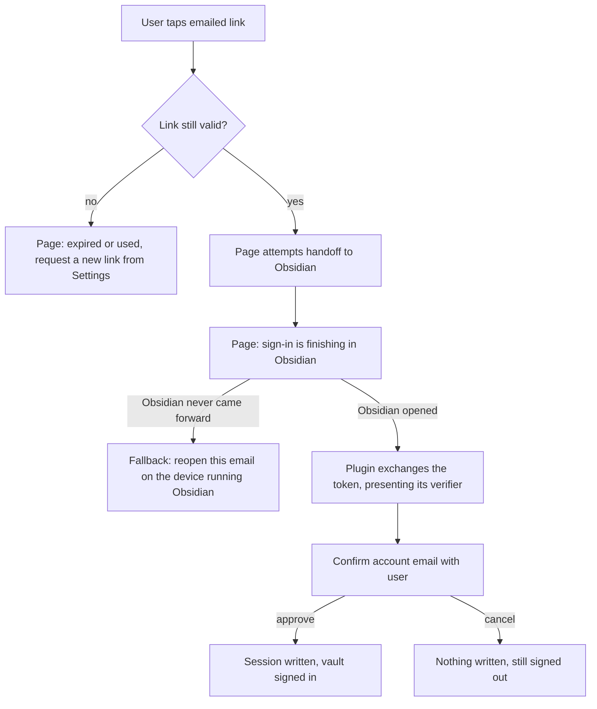

# Magic-link handoff to the plugin - Plan

## Goal Capsule

- **Objective:** the emailed sign-in link signs the plugin in on the device that opened it, with nothing typed and nothing copied.
- **Product authority:** this Product Contract, issue #240, and the `CLAUDE.md` non-negotiables it inherits (log safety; secrets never in `data.json`). Sign-out teardown (#284) and cloud-copy wipe (#285) are siblings from the same dogfood session and are not active scope here.
- **Open blockers:** none blocking planning — the desktop probe on 2026-08-05 settled the one that was (see Outstanding Questions). Release still gates on a physical-device test: the whole handoff is verified on desktop macOS only, and whether `obsidian://` fires from a mail client's in-app browser on iOS and Android is still unverified.

---

## Product Contract

### Summary

The emailed sign-in link stops handing the user a token to copy.
Its landing page hands the magic token to an `obsidian://` deep link, the plugin exchanges it for a session, confirms the account with the user, and signs in.
Same device, no typing.

### Problem Frame

On 2026-08-04 the user tapped **Send sign-in link** in Settings, opened the email on the phone, and read: "Signed in ... Switch back to Obsidian → Settings → Atoms Plus → Refresh status."

**Refresh status** did nothing. It refreshes an *existing* local session, and this device had none — the button is a no-op by construction on exactly the device the sign-in link exists to serve.

The session the link minted only ever existed as text in the browser, inside a collapsed "Advanced: session token" block. The one working path was reading an opaque `sess_…` string off a web page and pasting it into Settings on a phone. #240 exists to delete that path.

### Key Decisions

- KD1. **Same-device handoff only.** (session-settled: user-directed — chosen over supporting both device shapes on day one: the link opens in the phone browser and hands off to Obsidian on that same phone, which is the case the user actually hit.) Governs R1, R8.
- KD2. **When the handoff cannot reach Obsidian, the page sends the user back to the email on the right device.** (session-settled: user-directed — chosen over showing a typable code now: the code is deferred to #286.) Governs R8.
- KD3. **"Advanced: paste session" is deleted in this change.** (session-settled: user-directed — chosen over keeping it until the claim code ships: #240's stated goal is met in full and the ugly path dies with it.) Governs R10.
- KD4. **Exchange first, then always confirm the server-verified email before writing a session.** (session-settled: user-approved — chosen over a silent device-local gate that rejects unrequested links: a silent gate reproduces #240's own symptom, "I tapped it and nothing happened.") The device-local pending flag only shapes the confirmation copy. Governs R4, R5.
- KD5. **The deep link carries the magic token, never the session.** The magic token is single-use and short-lived, which keeps #240's out-of-scope line intact: nothing that stores a session token in a URL. Governs R2, R11.
- KD6. **Consumption moves from the landing page's page load to the plugin's exchange.** This retires the mail-prefetch burn as a byproduct rather than as separate work. Governs R6.
- KD7. **The link carries the requesting vault's identity.** Without it a multi-vault device can sign the wrong vault in, and the right vault still reads signed-out — indistinguishable from the bug being fixed. Cost: the vault name transits and sits beside the magic token for at most the token's life, then dies with it. Governs R3.
- KD8. **The landing page checks link validity without consuming it.** An expired link then fails on the web page rather than several taps deep inside Obsidian. Governs R7.

### Actors

- A1. **The user** — taps the link in a mail client on the device running Obsidian, and approves or cancels the account confirmation.
- A2. **The landing page** — the web page the emailed link opens; it decides whether a handoff is possible and what the user is told when it is not.
- A3. **The Plus service** — mints and validates the magic link, and issues the session in exchange for the token.
- A4. **The plugin, in one vault** — receives the handoff, exchanges the token, asks A1 to confirm, and stores the session.

### Requirements

**Handoff**

- R1. Tapping the emailed sign-in link on the device running Obsidian signs that Obsidian in, with no characters typed and no text copied.
- R2. The handoff to Obsidian carries the magic token; it never carries a session token.
- R3. The session lands in the vault that requested the link, on a device running more than one vault.
- R12. The plugin mints a device-held verifier when it requests a sign-in link, the request registers that verifier's hash against the magic token, and the exchange succeeds only when the plugin presents the matching verifier. A handoff arriving without a match is refused with a visible explanation — never silently dropped.
- R13. A link opened while the requesting vault is not running leaves the token unconsumed and tells the user which vault to open, rather than showing the confirmation in a vault that did not request it.

**Consent**

- R4. The user sees a confirmation naming the server-verified account email and approves it before any session is written; cancelling writes nothing, revokes the just-exchanged session server-side, and leaves the device signed out.
- R5. A link arriving on a device that did not request one still surfaces the confirmation, with copy stating the request did not originate here — never silently accepted, never silently dropped. That copy also names what approving grants: this vault will act as that account and will sync its atoms there. The confirmation defaults to cancel and takes a deliberate non-default tap to approve.

**Link lifecycle and dead ends**

- R6. A magic link is consumed exactly once, by the plugin's exchange; mail prefetches, security scanners, and repeat page loads leave it usable.
- R7. An expired or already-used link says so on the landing page and points the user at requesting a new one from Settings.
- R8. A link opened where the handoff cannot reach Obsidian explains what happened and tells the user to reopen the email on the device running Obsidian.
- R9. A validity check never consumes the magic token in any store backend, so a dead-link check and a real exchange stay distinguishable.
- R14. After handing off, the landing page states the sign-in is finishing in Obsidian. R8's reopen-on-the-right-device text is a fallback the user reaches only when Obsidian never came forward — never an assertion that the handoff failed.

**Settings surface and safety**

- R10. "Advanced: paste session" is gone from Settings; requesting a sign-in link is the only sign-in-on-another-device path.
- R11. Nothing in this flow writes a session token into a URL, a log, or an error object.
- R15. After a sign-in link is requested, the plugin's signed-out Settings copy describes the new flow — open the link in the email on this device — and does not direct the user to **Refresh status**.

### Key Flows

- F1. Same-device sign-in
  - **Trigger:** A1 taps the emailed link in a mail client on the phone running Obsidian.
  - **Actors:** A1, A2, A3, A4
  - **Steps:** A2 confirms the link is still valid without consuming it; A2 hands the magic token and the requesting vault's identity to Obsidian, then states the sign-in is finishing in Obsidian; A4 in that vault exchanges the token with A3, presenting the verifier it minted when the link was requested; A4 shows A1 the server-verified email; A1 approves; A4 stores the session and Settings reads signed in.
  - **Covers:** R1, R2, R3, R4, R6, R12, R14
- F2. Handoff cannot reach Obsidian
  - **Trigger:** the link opens where nothing takes the deep link — no Obsidian installed, the scheme blocked, or the target vault's plugin too old to register the action. Not a device shape: desktop with Obsidian installed is an F1 success case, verified 2026-08-05.
  - **Actors:** A1, A2
  - **Steps:** A2 explains that the sign-in has to finish inside Obsidian and tells A1 to reopen this email on the device running Obsidian. The link stays unconsumed.
  - **Covers:** R6, R8, R14
- F3. Dead link
  - **Trigger:** A1 opens a link that has expired or that a completed sign-in already consumed.
  - **Actors:** A1, A2, A3
  - **Steps:** A2 asks A3 whether the link is still usable, gets no, and tells A1 to request a new sign-in link from Settings. No handoff is attempted.
  - **Covers:** R7, R9

### Acceptance Examples

- AE1. Happy path on a real phone
  - **Covers R1, R4.**
  - **Given** a phone running Obsidian on one vault, signed out of Plus, having just requested a sign-in link
  - **When** the user opens the email and taps the link
  - **Then** Obsidian comes forward, shows a confirmation naming the account email, and on approval Settings → Atoms Plus reads signed in — with nothing typed and nothing copied.
- AE2. Cancel at the confirmation
  - **Covers R4.**
  - **Given** the confirmation is on screen naming the account email
  - **When** the user cancels
  - **Then** no session is stored, Settings still reads signed out, no error is presented as a failure, and the session that was exchanged a moment earlier no longer authenticates.
- AE3. Expired link
  - **Covers R7.**
  - **Given** a link older than the magic token's lifetime
  - **When** the user opens it
  - **Then** the landing page says the link expired and tells the user to request a new one from Settings, and Obsidian is never opened.
- AE4. Handoff finds no taker
  - **Covers R8.**
  - **Given** the user opens the email on a machine with no Obsidian installed, or where the target vault's plugin does not register the action
  - **When** the page loads
  - **Then** it explains the sign-in finishes inside Obsidian and tells the user to reopen this email on the device running Obsidian — not a dead end, and not a token to copy.
- AE5. Prefetched link
  - **Covers R6.**
  - **Given** a mail client or security scanner has already loaded the link's page once
  - **When** the human then taps the same link
  - **Then** the sign-in completes normally, because only the plugin's exchange consumes the token.
- AE6. Multi-vault device
  - **Covers R3.**
  - **Given** a device running two vaults and a link requested from vault B
  - **When** the user taps the link
  - **Then** vault B receives the session and reads signed in.
- AE7. Unrequested link
  - **Covers R5.**
  - **Given** a device that never requested a sign-in link
  - **When** a valid link is opened there
  - **Then** the confirmation still appears, its copy states the request did not originate on this device and names what approving would grant, the cancel action is the default, and no session is written unless the user deliberately approves.
- AE8. Neither token reaches a log or an error
  - **Covers R11.**
  - **Given** a sign-in completing through the handoff, and a second attempt whose exchange fails
  - **When** the deep-link URL, the plugin's logs, and the surfaced error are inspected
  - **Then** no session token appears in any of the three, and no magic token appears in a log line or an error object — the deep-link URL is the magic token's only carrier.
- AE9. The paste field is gone
  - **Covers R10.**
  - **Given** the plugin is signed out
  - **When** the user opens Settings → Atoms Plus
  - **Then** there is no "Advanced: paste session" field anywhere in the panel.
- AE10. Requesting vault is closed
  - **Covers R13.**
  - **Given** a device running Obsidian on a vault other than the one that requested the link
  - **When** the user taps the link
  - **Then** the user is told which vault to open, no confirmation appears in the wrong vault, and the link still works after opening the right one.
- AE11. Settings copy after requesting a link
  - **Covers R15.**
  - **Given** the user has just tapped **Send sign-in link** on a signed-out device
  - **When** they read the Settings copy that follows
  - **Then** it tells them to open the link in the email on this device, and does not tell them to tap **Refresh status**.

### Scope Boundaries

- **The typable cross-device claim code** — deferred to #286, explicitly ordered after this plan. Accepted consequence, knowingly: until it ships, a link opened on the wrong device has no recovery beyond requesting a new link from the right device.
- **Sign-out teardown of MCP grants and mirror device state** — issue #284.
- **"Wipe cloud copy" re-uploading the whole vault** — issue #285.
- **Any design that puts a session token in a URL** — ruled out by #240 itself.
- **Changing how sessions are stored, or how entitlement refresh works** — untouched by this change.

### Success Criteria

A real trial-account sign-in completed on a physical iOS device **and** a physical Android device, with the link opened from a mail client that uses an in-app browser, from tapping the emailed link to Settings showing the signed-in state, with zero characters typed and zero text copied. The no-handoff path must also produce a message the user can act on rather than a dead end.

### Outstanding Questions

**Resolve before planning**

- None. The desktop-lane question was settled by probe on 2026-08-05 (see Probe results below); F2 and AE4 have been reframed accordingly, and no desktop-only user is stranded.

**Deferred to planning**

- Whether the confirmation should also appear when the device-local pending flag *is* set, or only harden its copy when the flag is absent. KD4 settles it as always-show; flag this as the item most likely to be revisited after real use.

**Risks**

- **Mobile is still the risk; desktop is not.** The whole mechanism is verified on desktop macOS (Probe results below) but unverified from a mail client's in-app browser on iOS and Android. The release gate stays a real-device test, echoing #230 where an automated test proved the mechanism but not the live path.
- **Detection is real but narrow, and timing-dependent.** On desktop the page can tell the handoff was taken — but only via `document.hasFocus()`; `visibilityState` stayed `visible` throughout, so any check written against `visibilitychange` alone would wrongly report failure on the success path. Focus also returned to the browser within a few seconds, so the verdict depends on when it is sampled. R14's fallback must be a retry offer the user can dismiss, never an automatic failure verdict.
- **A stale or action-less plugin swallows the link silently.** A vault whose installed build does not register the action produced no handler call, no error, and no user-visible signal — the exact "I tapped it and nothing happened" symptom #240 exists to kill. Same for an unrecognized vault name. This is what R13 must cover; the landing page cannot detect it either, since the OS did accept the URI.
- Whether `vault=` routing works on **mobile** remains unverified — the repo's own QA fixture qualifies the parameter with "when supported" (`docs/qa/testing-fixtures.md:86`). It is confirmed on desktop. R3 and AE6 join the mobile release gate.
- All three store backends delete the magic token unconditionally, including on the expired path (`postgres.mjs:343-347`, `sqlite.mjs:295-296`, `memory.mjs:213-217`) — the deletion *ordering* differs but the observable result does not. The real defect is that no code path can check a token without consuming it, which is what R9 and KD8 require changing.

### Probe results — desktop macOS, 2026-08-05

Run against Obsidian 1.12.7 with a throwaway `registerObsidianProtocolHandler("atoms-signin", …)` spike
installed in the `test vault`, `demo-vault`, and `new vault` agent lanes, then reverted. Personal vaults
untouched. **Everything below is macOS only.**

- **The scheme is claimed and the handoff works.** `obsidian:` is bound at the LaunchServices level; firing
  a link brings Obsidian forward from the background. A plugin-registered handler receives the action with
  all query params intact, including an injected `action` key.
- **A real desktop browser hands off.** A link fired from a page in Chrome reached the plugin handler. This
  settles the F2/AE4 question in favour of "desktop with Obsidian installed is a success case". Caveat: this
  machine may already have granted Chrome permission for `obsidian://`; a fresh browser profile may show a
  one-time "Open Obsidian?" prompt first, which is untested.
- **`vault=` routes a custom action to a named vault.** Control-tested: with one vault frontmost, a link
  naming a *different* vault fired in the named one, not the focused one. KD7's mechanism works here.
- **A closed vault is opened by the link**, and the handler then fires provided that vault's plugin
  registers the action.
- **Silent-drop cases:** a vault whose plugin lacks the action, and an unrecognized vault name, both produce
  no handler call and no signal of any kind.
- **Detection:** the page saw `blur` and `hasFocus() === false`, but `visibilityState` stayed `visible`.
  Focus returned to the browser within seconds, so the verdict is sampling-time dependent.
- **Storage scoping:** `app.saveLocalStorage` is vault-scoped (a value written in one vault reads `null` in
  another), so R3's premise holds. Raw `window.localStorage` is *not* scoped and is shared across vaults —
  an implementation trap, not a requirements problem.

### Sources / Research

Verified against the branch on 2026-08-05. Cited as context for planning, not as requirements.

- `GET /v1/auth/exchange` consumes the magic token and renders the session as raw text in a collapsed block — `plus-service/src/server.mjs:378-388`, `:127-164` (session printed at `:161`).
- `POST /v1/auth/exchange` already exists and returns session, email, status, and remaining — `plus-service/src/server.mjs:390-405`.
- The plugin-side client `exchangeMagicToken` exists with zero production callers — `src/platform/plusClient.ts:378`. Both ends are wired to nothing.
- The plugin registers no `obsidian://` protocol handler: `registerObsidianProtocolHandler` has zero matches in `src/`, `test/`, or `plus-service/`. This is net-new surface.
- No endpoint can report magic-token validity without consuming it — every magic-token route calls `store.exchangeMagic`, which deletes the row (`plus-service/src/server.mjs:364,379,391`). KD8/R7/F3 therefore require a net-new non-consuming check endpoint, the second piece of net-new surface alongside the protocol handler.
- The exchange accepts a bare token from any caller with no device, vault, or origin binding (`plus-service/src/server.mjs:391-405`), which is what R12's verifier closes. Sign-out already revokes a session by bearer (`:357-359`), which is what R4's cancel path can reuse.
- The device-local pending flag KD4 refers to does not exist yet; `src/platform/filingAuth.ts` declares only `atoms-plus-session`, `atoms-plus-limit-dismiss-day`, and `atoms-plus-awaiting-checkout`. Buildable on the awaiting-checkout precedent.
- The magic link is minted with only a token parameter (`plus-service/src/server.mjs:346`) and the client sends email only (`src/platform/plusClient.ts:299`), so KD7's vault identity needs plumbing through the mint path, not just the landing page.
- Signed-out Settings copy still tells the user to tap **Refresh status** (`src/settings/settings.ts:212`) and still references the paste field (`:219`) — both are stale once R10 and R15 land.
- Magic token TTL is 15 minutes — `plus-service/src/store/postgres.mjs:199-206`, `sqlite.mjs:180-186`.
- `exchangeMagic` deletes the token row *before* checking expiry in both real stores — `postgres.mjs:328-350`, `sqlite.mjs:290-296` — so any GET burns the link. `memory.mjs:210-218` checks expiry first, so the stores disagree.
- The Plus session persists in Obsidian `localStorage` under `atoms-plus-session`, never `data.json` — `src/platform/filingAuth.ts:42-47`, `:176`.
- Precedent for the deferred claim code: Ask MCP pairing codes are 8-character Crockford Base32 (no I, L, O, U), stored hashed, 10-minute TTL — `plus-service/src/store/askHelpers.mjs:14-26`.
- "Advanced: paste session" lives at `src/settings/settings.ts:552-614` and bypasses the Plus client entirely.

<!-- ce-section: work-relationships -->
### How This Work Fits Together

This plan owns one area: getting a browser-completed magic link into the plugin on the same device. The breakdown below is the current understanding, not a committed roadmap.

- Recovery path #230 did not fix
  - **Depends on** nothing from #230; #230 proved a real trial signup completes, this proves a signed-out device can rejoin one.
- Typable cross-device claim code (#286)
  - **Depends on** this plan's exchange and confirmation behavior; it is the direct successor, and it closes the recovery window this plan knowingly opens by deleting the paste field.
- #284 (sign-out teardown) and #285 (cloud-copy wipe)
  - **Can proceed independently of** this plan. Siblings from the same dogfood session, sharing no surface with it.
