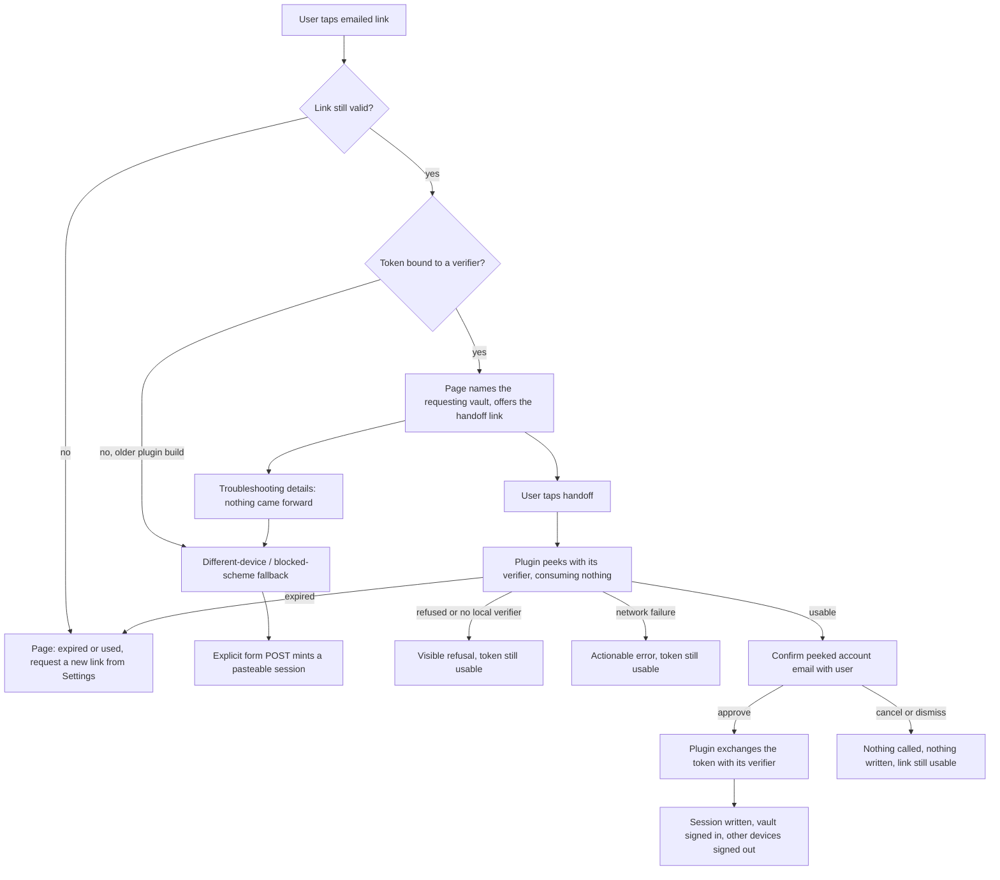
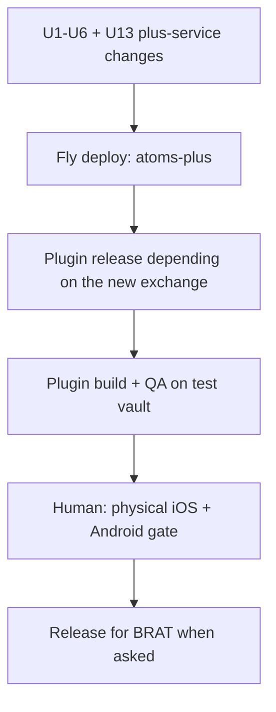

# Magic-link handoff to the plugin - Plan

## Goal Capsule

- **Objective:** the emailed sign-in link signs the plugin in on the device that opened it, with nothing typed and nothing copied.
- **Product authority:** this Product Contract, issue #240, and the `CLAUDE.md` non-negotiables it inherits (log safety; secrets never in `data.json`). Sign-out teardown (#284) and cloud-copy wipe (#285) are siblings from the same dogfood session and are not active scope here.
- **Open blockers:** none. The desktop probe on 2026-08-05 settled the platform question (see Probe results).
- **Stop conditions:** stop and surface, rather than guessing, if the deep-link handoff cannot be made to reach a named vault, if binding the exchange to a device verifier would make the primary path fail closed on desktop, or if `crypto.subtle` turns out to be unavailable on the mobile webview — substituting a non-cryptographic hash for the verifier is not an acceptable recovery.
- **Execution profile:** two deploy surfaces in a fixed order — `plus-service` to Fly first, then a plugin release. The server must accept the new exchange shape before any plugin build depends on it.
- **Tail ownership:** this plan owns the full shipping tail (`ce-simplify-code` → `ce-code-review` → `ce-compound` → `world-class-qa`). The physical-device release gate is human-only and is not satisfiable by an agent.

**Product Contract preservation:** changed — KD3, R5, R10, AE7, AE9, Scope Boundaries. KD3 was reversed by user direction on 2026-08-05: "Advanced: paste session" now survives this change and #286 owns deleting it. R5 and AE7 changed because the device verifier introduced by R12 makes an unrequested device unable to complete an exchange at all, so that case becomes a visible refusal rather than an approvable confirmation. R16-R18 are new requirements arising from those two changes, and AE12 is a new acceptance example covering R16. AE5 and AE6 changed only in that their Covers lines now carry R17 and R18. Everything else is unchanged.

**Round-1 doc review, 2026-08-05:** findings F1-F29 in `docs/plans/2026-08-05-240-doc-review-findings.md` are folded in below. Two of them moved the contract again. KD4 was restructured from *exchange-then-confirm* to **peek-then-confirm-then-exchange** (user-directed), because `exchangeMagic` revokes every other session for the account before minting, which made cancelling more destructive than approving; R4, AE2, F1's and F4's steps, U9, U10, and the new U13 all follow from that. R19 is a new requirement covering in-progress and network-failure feedback (F12). `GET /v1/auth/dev-exchange` is **deleted** rather than branched (user-directed; F25).

**Round-2 doc review, 2026-08-05:** the coherence, feasibility, and security lenses re-read the folded document. Nothing moved the Product Contract again. The load-bearing corrections: KD9's fallback skip is now stated as a **separate route that skips the verifier check for bound and unbound tokens alike** — U6's earlier "via U4's unbound path" wording would have limited the fallback to unbound rows, which silently kills KD3's cross-device recovery since every current-build link is bound; R19's window now runs from the tap through the session landing rather than stopping at the confirmation; KTD6 and U7 now specify the verifier's entropy (the `pkce()` test helper is a wire-shape reference and a zero-entropy constant); U9's refusal never presents the attacker-controlled `vault=` param as the attested requesting vault, and U13 returns the server-recorded vault on `refused` to make that possible; KTD8 gains the deferred drain that its registration-only fix would otherwise have raced; KTD13's sweep drops its email predicate; and KTD14's cutover regression is labelled rather than discovered.

**Round-3 correction, 2026-08-05 — one P0, encoding:** U1's "Patterns to follow" told the implementer to reuse `hashToken` (sha256 **hex**) "for both `verifier_hash` and the token key." Hex is right for the token key and wrong for the verifier: KTD6 has the plugin send base64url, so a hex `verifier_hash` matches nothing and **every** bound peek and exchange is refused — the primary path, failing closed, no error to read, and after KTD11 has already deployed the server ahead of the plugin. It would present exactly like the `crypto.subtle` failure the Goal Capsule's stop condition anticipates and misdirect the debugging. Nothing moved the Product Contract. U1 now names the two helpers and their two encodings separately and forbids collapsing them; U4's shared comparison is specified as `pkceChallengeS256`-only, with an explicit ban on inheriting `verifyPkce`'s non-S256 plaintext branch; KTD6 and U7 state the plugin-side digest encoding as half of a wire contract; and U1, U4, and U7 each gain an anti-hex test scenario pinned to the RFC 7636 Appendix B vector rather than to each other. Prerequisite landed separately: `verifyPkce` no longer re-derives the digest, `pkceChallengeS256` is the single home for sha256-base64url in the service, and `plus-service/test/pkce-digest.test.mjs` pins it.

---

## Product Contract

### Summary

The emailed sign-in link stops handing the user a token to copy.
Its landing page hands the magic token to an `obsidian://` deep link; the plugin peeks — a non-consuming, verifier-bound check that learns the account email without spending anything — confirms that account with the user, and only then exchanges the token for a session.
Same device, no typing. The paste path survives as a demoted fallback until the typable claim code (#286) replaces it.

### Problem Frame

On 2026-08-04 the user tapped **Send sign-in link** in Settings, opened the email on the phone, and read: "Signed in ... Switch back to Obsidian → Settings → Atoms Plus → Refresh status."

**Refresh status** did nothing. It refreshes an *existing* local session, and this device had none — the button is a no-op by construction on exactly the device the sign-in link exists to serve.

The session the link minted only ever existed as text in the browser, inside a collapsed "Advanced: session token" block. The one working path was reading an opaque `sess_…` string off a web page and pasting it into Settings on a phone. #240 exists to make that path unnecessary.

### Key Decisions

- KD1. **Same-device handoff only.** (session-settled: user-directed — chosen over supporting both device shapes on day one: the link opens in the phone browser and hands off to Obsidian on that same phone, which is the case the user actually hit.) Governs R1, R8.
- KD2. **When the handoff cannot reach Obsidian, the page sends the user back to the email on the right device.** (session-settled: user-directed — chosen over showing a typable code now: the code is deferred to #286.) Governs R8.
- KD3. **"Advanced: paste session" stays in this change.** (session-settled: user-directed — chosen over deleting it alongside the handoff: strict device binding removes the cross-device path entirely, and a user whose mail only reaches a device other than the one running Obsidian would have no recovery until #286 ships.) For that recovery to exist at all, the fallback must be able to redeem a **bound** token too — every link a current build mints carries a verifier hash, so a fallback scoped to unbound tokens would recover nothing. KD9 states the mechanism. #286 owns deleting the field and the landing page's fallback block together. Governs R10.
- KD4. **Peek first, always confirm the server-verified email, then exchange only on approve.** (session-settled: user-approved — chosen over a silent device-local gate that rejects unrequested links: a silent gate reproduces #240's own symptom, "I tapped it and nothing happened.") The ordering was reversed on 2026-08-05 after review: `exchangeMagic` calls `revokeAllSessionsForEmail` before minting (`plus-service/src/store/memory.mjs:233`, `sqlite.mjs:312`, `postgres.mjs:371`), so exchanging before asking made *cancel* destroy the user's other sessions and burn the link — cancel being more destructive than approve defeats R4 outright. The plugin therefore asks a **non-consuming, verifier-bound peek** for the account email and the requesting vault, shows the confirmation from that, and calls the exchange only when the user approves. The device-local pending record is not a copy and not merely copy-shaping: it holds the only instance of the verifier, and without it neither the peek nor the exchange can succeed — treat it as a hard precondition of the whole flow. Governs R4, R19.
- KD5. **The deep link carries the magic token, never the session.** The magic token is single-use and short-lived, which keeps #240's out-of-scope line intact: nothing that stores a session token in a URL. Governs R2, R11.
- KD6. **Consumption moves from the landing page's page load to a deliberate user action.** This retires the mail-prefetch burn as a byproduct rather than as separate work. Governs R6, R17.
- KD7. **The link carries the requesting vault's identity.** Without it a multi-vault device can sign the wrong vault in, and the right vault still reads signed-out — indistinguishable from the bug being fixed. Cost: the vault name transits and sits beside the magic token for at most the token's life, then dies with it. "Dies with it" only holds if expired rows are actually removed: the peek is read-only by construction, so the mint path sweeps expired rows instead (KTD13). Governs R3, R18.
- KD8. **Link validity is checked without consuming the token, on both the landing page and in the plugin.** An expired link then fails on the web page rather than several taps deep inside Obsidian, and the plugin can learn the account email before it spends anything. Governs R7, R19.
- KD9. **Two exchange routes, bound differently, and the handoff is only offered to a bound token.** The plugin's `POST /v1/auth/exchange` is bound to the requesting device's verifier and refuses a mismatch or an absent verifier against a bound row. The web fallback that mints a pasteable session is a **separate HTML-rendering route** that **skips the verifier check entirely — for bound and unbound tokens alike, by design**. That skip is not an oversight and not a gap left for a later hardening pass: it is the whole mechanism of KD3's cross-device recovery, because every link a current build mints is bound, so a fallback that honored the check would recover nothing. It stays at the same trust level as today's behavior and retires with the paste field in #286. Separately, and for a different reason, the landing page offers the `obsidian://` handoff **only when the token carries a verifier hash**: a token minted by an older plugin build carries none, so no build on that device could complete the bound exchange, and that page promotes the fallback block instead of offering a dead end. Gating the *handoff* on binding and skipping the *check* on the fallback route are two independent rules, and neither implies the other. **Residual, stated plainly:** until #286 the magic link remains a bearer credential redeemable by any holder. The verifier binds *where a session lands*, not *who may obtain one* — its retained benefit this release is wrong-vault routing safety, not bearer resistance or anti-theft. Governs R5, R10, R12.

### Actors

- A1. **The user** — taps the link in a mail client on the device running Obsidian, and approves or cancels the account confirmation.
- A2. **The landing page** — the web page the emailed link opens; it decides whether a handoff is possible and what the user is told when it is not.
- A3. **The Plus service** — mints and validates the magic link, and issues the session in exchange for the token.
- A4. **The plugin, in one vault** — receives the handoff, exchanges the token, asks A1 to confirm, and stores the session.

### Requirements

**Handoff**

- R1. Tapping the emailed sign-in link on the device running Obsidian signs that Obsidian in, with no characters typed and no text copied.
- R2. The handoff to Obsidian carries the magic token; it never carries a session token.
- R3. The session lands in the vault that requested the link, on a device running more than one vault.
- R12. The plugin mints a device-held verifier when it requests a sign-in link, the request registers that verifier's hash against the magic token, and **both** the non-consuming peek and the exchange succeed only when the plugin presents the matching verifier. A handoff arriving without a match is refused at peek time, with a visible explanation and before anything is spent — never silently dropped.
- R13. A link naming a vault that is not currently running opens that vault and completes there. Only when the named vault cannot take the handoff at all — it does not exist on this device, or its installed build does not register the action — does the flow fall back to naming the vault in prose; R18's pre-tap naming is then the only signal the user gets. *(Annotation: R13 adds no behavior beyond R5 and R16. It survives as the statement of the closed-vault case specifically, which the probe settled in favour of "the link opens it and the handler fires".)*
- R16. A verifier mismatch leaves the magic token unconsumed and still usable, so the user can open the requesting vault and tap the same link again — for the whole life of the token, not only while a pending record happens to be fresh.
- R18. The landing page names the vault that requested the link, before the user taps the handoff.
- R19. From the tap through to the session landing — across both round-trips, the peek and the exchange, and the confirmation between them — the plugin shows that something is happening. Every outcome of the peek — usable, expired, invalid, refused, rate-limited, or unreachable over the network — produces a message the user can act on, as does a failed exchange after approval. Silence is the symptom #240 exists to remove and is never an acceptable outcome.

**Consent**

- R4. The user sees a confirmation naming the server-verified account email — obtained from the non-consuming peek, before anything is spent — and approves it before the exchange is called at all. The confirmation states, before the user chooses, that approving signs the account out on every other device. Cancelling or dismissing calls nothing server-side: no exchange, no revoke, no other session disturbed, and the link stays valid and re-tappable.
- R5. A deep link arriving in a vault that holds no usable verifier for it produces a visible, non-auto-dismissing refusal telling the user to open the vault that requested the link and tap again — never a silent drop, and never an approvable confirmation, because neither the peek nor the exchange can succeed there. It names the requesting vault **when the server has attested that name** — which is whenever a peek ran, since the peek returns the requesting vault on `refused` as well as `usable`. Where no peek could run at all, because this vault holds no verifier to present, the refusal names no vault: the deep link's own `vault=` param is attacker-controlled prose and is never presented as the attested requesting vault. This is reachable only in a vault the link actually reached; a device with no vault of the named name gets no in-app signal at all (see R13 and the Risks).

**Link lifecycle and dead ends**

- R6. A **plugin sign-in link** is consumed exactly once, by a deliberate user action; mail prefetches, security scanners, and repeat page loads leave it usable. Known residual: the Ask OAuth authorize link points at the same route carrying `&pending=…` and KTD12 deliberately keeps that branch consuming on `GET`, so a scanner still burns an OAuth link. R6 does not claim otherwise; closing it means reworking `maybeFinishOauthAfterExchange`, which this plan does not take on.
- R7. An expired or already-used link says so on the landing page and points the user at requesting a new one from Settings.
- R8. A link opened where the handoff cannot reach Obsidian explains what happened and offers a remedy that fits the reason. Where the *device* is wrong — no Obsidian here — it says to reopen the email on the device running Obsidian. Where the *browser* is wrong — the custom scheme is blocked, which is what a mail client's in-app browser does — it says to open this page in the system browser and tap again, and points at the different-device fallback below. Telling a user with Obsidian on this very phone to "use the device running Obsidian" is a dead end, not a remedy.
- R9. A validity check never consumes the magic token in any store backend, so a dead-link check and a real exchange stay distinguishable.
- R14. The landing page renders **once**, before the tap, and never asserts an outcome it cannot observe. It names the requesting vault, offers the handoff, and carries R8's remedies inside a collapsed troubleshooting block the user opens if nothing came forward. It does not claim the sign-in is finishing, and it does not claim it failed: with no JavaScript (KTD4) it cannot transition, so it states only what is true at render time.
- R17. The landing page's fallback session is minted only by an explicit user action, never by a page load.

**Settings surface and safety**

- R10. The magic-link handoff is the primary sign-in-on-another-device path. "Advanced: paste session" remains available, demoted below it, until #286 replaces it.
- R11. Nothing in this flow writes a session token into a URL, a log, or an error object.
- R15. After a sign-in link is requested, the plugin's signed-out Settings copy describes the new flow — open the link in the email on this device — and does not direct the user to **Refresh status**. This binds *every* string on the surface, including the "Advanced: paste session" description that currently reads "Only if Refresh status does not work after the sign-in link" (`src/settings/settings.ts:556`) and the landing page's fallback success HTML, which ends with the same instruction. Before a link is requested the copy stays in its static form; the pending record is what distinguishes the two states.

### Key Flows



- F1. Same-device sign-in
  - **Trigger:** A1 taps the emailed link in a mail client on the phone running Obsidian.
  - **Actors:** A1, A2, A3, A4
  - **Steps:** A2 confirms the link is still valid without consuming it, sees it is bound to a verifier, and names the requesting vault; A1 taps the handoff; A4 in the named vault shows an in-progress state and asks A3 for a **peek**, presenting the verifier it minted when the link was requested; A3 answers usable and returns the account email; A4 shows A1 that email and the warning that approving signs other devices out; A1 approves; only then does A4 exchange the token with A3 and store the session, and Settings reads signed in.
  - **Covers:** R1, R2, R3, R4, R6, R12, R14, R18, R19
- F2. Handoff cannot reach Obsidian
  - **Trigger:** the link opens where nothing takes the deep link — no Obsidian installed, the scheme blocked by a mail client's in-app browser, or the target vault's plugin too old to register the action. Not a device shape: desktop with Obsidian installed is an F1 success case, verified 2026-08-05.
  - **Actors:** A1, A2
  - **Steps:** nothing comes forward, so A1 opens the troubleshooting block A2 rendered before the tap. It explains that the sign-in has to finish inside Obsidian, and separates the two remedies: reopen this email on the device running Obsidian, or — if Obsidian *is* on this device — open this page in the system browser and tap again, with the different-device fallback below as the last resort. The link stays unconsumed. A2 never asserts the handoff failed; it only ever offered these as things to try.
  - **Covers:** R6, R8, R14
- F3. Dead link
  - **Trigger:** A1 opens a link that has expired or that a completed sign-in already consumed.
  - **Actors:** A1, A2, A3
  - **Steps:** A2 asks A3 whether the link is still usable, gets no, and tells A1 to request a new sign-in link from Settings. No handoff is offered.
  - **Covers:** R7, R9
- F4. Wrong vault takes the handoff
  - **Trigger:** the deep link fires in a vault that holds no matching verifier — a multi-vault device where routing did not reach the requesting vault, or a device that never requested a link.
  - **Actors:** A1, A3, A4
  - **Steps:** A4 asks A3 for a peek and A3 refuses it, consuming nothing and minting nothing; A4 tells A1 — in a dismiss-only acknowledgement, not an auto-dismissing toast — which vault requested the link and that the same link still works there. The exchange is never reached.
  - **Covers:** R5, R12, R13, R16, R19
- F5. Signing in on a different device, or in a browser that blocks the scheme
  - **Trigger:** A1 can only read email on a device other than the one running Obsidian, or the in-app browser refuses the custom scheme, or the token was minted by an older plugin build and carries no verifier so no handoff is offered at all.
  - **Actors:** A1, A2, A3, A4
  - **Steps:** A1 opens the demoted fallback block on the landing page and submits its form; A3 consumes the token on the fallback route, which skips the verifier check by design whether or not the token is bound, and A2 renders a session to copy; A1 pastes it into A4's Settings on the target device.
  - **Covers:** R8, R10, R17

### Acceptance Examples

- AE1. Happy path on a real phone
  - **Covers R1, R4, R19.**
  - **Given** a phone running Obsidian on one vault, signed out of Plus, having just requested a sign-in link
  - **When** the user opens the email and taps the link, then taps the handoff
  - **Then** Obsidian comes forward, shows an in-progress state while it peeks, then a confirmation naming the account email and stating that approving signs the account out on other devices; on approval an in-progress state is shown again while the exchange runs, and Settings → Atoms Plus then reads signed in — with nothing typed and nothing copied.
- AE2. Cancel at the confirmation
  - **Covers R4.**
  - **Given** the confirmation is on screen naming the account email obtained from the peek
  - **When** the user cancels, or dismisses without choosing
  - **Then** no server call of any kind is made, no session is stored, Settings still reads signed out, no error is presented as a failure, any session the account holds on another device still authenticates, and tapping the same link again still completes the sign-in — because nothing was exchanged.
- AE3. Expired link
  - **Covers R7.**
  - **Given** a link older than the magic token's lifetime
  - **When** the user opens it
  - **Then** the landing page says the link expired and tells the user to request a new one from Settings, and no handoff is offered.
- AE4. Handoff finds no taker
  - **Covers R8, R14.**
  - **Given** the user opens the email on a machine with no Obsidian installed, where the in-app browser blocks the custom scheme, or where the target vault's plugin does not register the action
  - **When** the user taps the handoff, nothing comes forward, and they open the troubleshooting block
  - **Then** the page — which said nothing about success or failure, because it cannot tell — offers both remedies separately: reopen this email on the device running Obsidian, and, if Obsidian is on this device, open this page in the system browser and tap again, with the different-device fallback below.
- AE5. Prefetched link
  - **Covers R6, R17.**
  - **Given** a mail client or security scanner has already loaded the plugin sign-in link's page once
  - **When** the human then taps the same link
  - **Then** the sign-in completes normally, because no page load of that link consumes the token. (An Ask OAuth link carrying `pending` is out of this example's scope — KTD12 keeps that branch consuming.)
- AE6. Multi-vault device
  - **Covers R3, R18.**
  - **Given** a device running two vaults and a link requested from vault B
  - **When** the user taps the link
  - **Then** the page names vault B, and vault B receives the session and reads signed in.
- AE7. A vault that holds no usable verifier
  - **Covers R5, R12.**
  - **Given** a device running a vault whose name the link's `vault=` param matches, but which holds no pending record for this link — it never requested one, or its record was cleared
  - **When** a valid link is opened there and the handoff is tapped
  - **Then** the vault shows a refusal that stays on screen until dismissed, telling the user to open the vault that requested the link and tap again; no confirmation is offered, no exchange is attempted, and no session is written. Because this vault holds no verifier, no peek can run, so no server-attested vault name exists and the refusal names none — it does **not** fall back to printing the deep link's `vault=` param, which any web page can set to arbitrary prose. Where a peek *did* run and was refused (F4), the server-recorded requesting vault is named.
  - **Scoping note:** this is the reachable case. On a device with *no* vault of the named name, the probe found no handler call and no signal of any kind, so there is nothing to render a refusal — R18's pre-tap naming on the landing page is the only mitigation, and a unit test that fakes a handler call there would pass while proving nothing.
- AE8. Neither token reaches a log or an error
  - **Covers R11.**
  - **Given** a sign-in completing through the handoff, and a second attempt whose peek or exchange fails
  - **When** the deep-link URL, the plugin's logs, and the surfaced error are inspected
  - **Then** no session token appears in any of the three, and no magic token and no verifier appears in a log line or an error object — the deep-link URL is the only carrier the plugin constructs. This requires `redact` to learn the magic-token and verifier shapes; today it covers `sess_`, `Bearer`, and `sk-ant-` only, and this change is what first carries a magic token into the plugin at all.
- AE9. The paste path survives end to end, demoted
  - **Covers R10, R8.**
  - **Given** the plugin is signed out, and separately a magic link minted by a plugin build old enough to send no verifier hash
  - **When** the user opens Settings → Atoms Plus, and when that unbound link's landing page is opened
  - **Then** requesting a sign-in link is presented as the way to sign in with "Advanced: paste session" still reachable below it; and the unbound link's page offers no `obsidian://` handoff but promotes the fallback block, whose form POST actually mints a pasteable session rather than being refused for presenting no verifier. Rendering the field is not enough to pass this example — the fallback must complete.
- AE10. Requesting vault is closed, or absent
  - **Covers R13.**
  - **Given** a device running Obsidian on a vault other than the one that requested the link, where the requesting vault exists on that device but is not open
  - **When** the user taps the handoff
  - **Then** the link opens the requesting vault, its handler fires, and the sign-in completes there — the probe settled this. **And given** instead that the named vault does not exist on the device, or its build does not register the action, **then** nothing happens in-app, and the only signal the user has is the vault name the landing page printed before the tap.
- AE11. Settings and landing-page copy after requesting a link
  - **Covers R15.**
  - **Given** the user has just tapped **Send sign-in link** on a signed-out device
  - **When** they read the Settings copy that follows, including the "Advanced: paste session" description, and the landing page's fallback success page
  - **Then** all of it tells them to open the link in the email on this device, and none of it tells them to tap **Refresh status**.
- AE12. A refused handoff does not burn the link
  - **Covers R16.**
  - **Given** a deep link that fired in a vault holding no matching verifier and was refused, with the retry attempted late in the token's 15-minute life
  - **When** the user opens the requesting vault and taps the same link again
  - **Then** the sign-in completes — the first attempt consumed nothing, and the requesting vault's pending record still holds the verifier because it is retained until sign-in completes or the session is cleared, not until the token's TTL elapses.

### Scope Boundaries

- **The typable cross-device claim code** — deferred to #286, explicitly ordered after this plan. #286 also owns deleting "Advanced: paste session" and the landing page's fallback block, and closing the session-in-browser-HTML item that block keeps open.
- **Sign-out teardown of MCP grants and mirror device state** — issue #284.
- **"Wipe cloud copy" re-uploading the whole vault** — issue #285.
- **Any design that puts a session token in a URL** — ruled out by #240 itself.
- **Changing how sessions are stored, or how entitlement refresh works** — untouched by this change.
- **Rewriting the setup docs that reference the paste field** — `docs/ask-self-host.md` and the QA docs stay accurate while the field survives; they retire with #286.

### Success Criteria

A real trial-account sign-in completed on a physical iOS device **and** a physical Android device, with the link opened from a mail client that uses an in-app browser, from tapping the emailed link to Settings showing the signed-in state, with zero characters typed and zero text copied. The no-handoff path must also produce a message the user can act on rather than a dead end.

### Outstanding Questions

**Deferred to implementation**

- Whether the confirmation should also appear when the device-local pending flag *is* set, or only harden its copy when the flag is absent. KD4 settles it as always-show; flag this as the item most likely to be revisited after real use.
- Whether the refusal in F4 should offer a one-tap "open the requesting vault" action rather than naming it in prose. Naming it is the floor; the action depends on whether `obsidian://open?vault=` reliably fronts a vault from inside another vault, which the probe did not test.

**Raised by round-1 doc review and deliberately left open**

- If the physical iOS/Android gate fails, what ships — the POST fallback promoted on mobile, or a block until #286?
- ~~Should the Definition of Done gate the BRAT release explicitly on the human device result, so "recorded as outstanding" cannot be read as "shippable"?~~ **Answered 2026-08-05 (user, pre-`ce-work`): yes, hard gate on both platforms.** Merge may proceed with the gate open; the release may not. Wording is in Definition of Done § Global. Do not relitigate.
- Which rate-limit key shape and ceiling for the non-consuming checks, given scanners hit the landing page before the human — and does sharing a key let a scanner's 429 block the human's deliberate POST, or the plugin's peek? Two verified constraints narrow the answer more than this question originally admitted: `clientIp` returns the first element of a client-supplied `x-forwarded-for` (`plus-service/src/ratelimit.mjs:32-35`), so an IP key is forgeable **and** can be aimed at a victim's bucket; and `checkRateLimit`'s window is a module-level in-process `Map` (`ratelimit.mjs:7`), so any ceiling is per-instance, not per-deployment.
- Should the fallback POST require re-entering the account email, so a link holder alone cannot mint a session before #286?
- Does `registerObsidianProtocolHandler` deliver params to more than one registered plugin in the same vault?

**Raised by round-2 doc review and deliberately left open**

- Should U13's peek limit carry a fifth key on the token hash, so a single held token has a bounded verifier-guessing budget across surfaces — given R16 forbids burning the token after N failed attempts, which leaves a rate cap as the only available shape?
- Should the landing-page GET's rate-limit key be shared with, or separated from, the OAuth `pending` hop that flows through the same route? At the default ceiling of 30/min it does not matter, but a low custom ceiling on that key would 429 the OAuth browser hop.
- If the protocol handler is queued until `loadSettings()` resolves (KTD8, U9 step 6), what bounds that wait, and what does the user see if settings never load?
- After U5 removes session rendering from the non-`pending` GET, `renderExchangeHtml` has only U6's form POST as a caller — should it move into U6's route rather than staying a shared helper?

**Risks**

- **Mobile is still the risk; desktop is not.** The whole mechanism is verified on desktop macOS (Probe results below) but unverified from a mail client's in-app browser on iOS and Android. The release gate stays a real-device test, echoing #230 where an automated test proved the mechanism but not the live path.
- **`vault=` routing for a plugin-registered action is undocumented.** Obsidian's URI documentation describes `vault=` only for its six built-in actions; nothing states that a plugin-registered action receives or honors it. The desktop probe control-tested that it does on macOS 1.12.7, so KD7's mechanism rests on verified-but-undocumented behavior that a future Obsidian release could change. The verifier binding is what makes this fail safe: if routing does not reach the requesting vault, the exchange is refused and the link survives, rather than signing the wrong vault in.
- **Detection is real but narrow, timing-dependent, and not used.** On desktop the page can tell the handoff was taken — but only via `document.hasFocus()`; `visibilityState` stayed `visible`, so any check written against `visibilitychange` alone would wrongly report failure on the success path. Focus also returned to the browser within a few seconds, so the verdict depends on when it is sampled. All of that would need JavaScript, which KTD4 forbids. R14 therefore takes the only honest option available to a scriptless page: render once, before the tap, and assert no outcome at all.
- **`crypto.subtle` on Obsidian mobile is assumed, not probed.** R12's whole binding rests on SHA-256 in the plugin, and the plugin has never used WebCrypto — the only hashing in `src/` is a hand-rolled FNV-1a at `src/platform/askMirror.ts:177`. If `crypto.subtle` is unavailable or restricted in the iOS/Android webview, the binding fails at the human-only device gate, after both surfaces have shipped. U7 carries a cheap capability check and U12 carries the device probe so this surfaces early rather than at the gate. FNV-1a is *not* an acceptable substitute for the verifier hash; if WebCrypto is absent the correct outcome is to stop and surface, per the Goal Capsule's stop condition.
- **Custom-scheme interception is what the verifier is borrowed from PKCE to answer, and it is only partly answered.** Any installed app may register `obsidian://` and receive the deep link, magic token included. The verifier means an intercepting app cannot turn that token into a session in *its* vault without the requesting vault's device-local secret — that is the wrong-vault routing safety KD9 claims. It does **not** stop that app from replaying the token against the fallback POST route, which skips the verifier check for bound and unbound tokens alike and by design accepts anyone. That gap closes with #286, and it is the same bearer-credential residual KD9 records, reached by a second route.
- **A stale or action-less plugin swallows the link silently.** A vault whose installed build does not register the action produced no handler call, no error, and no user-visible signal. The landing page cannot detect it either, since the OS did accept the URI. R18 is the mitigation available: name the requesting vault *before* the tap, so a user who lands nowhere knows what to check.
- **The magic token is a bearer credential on the fallback path.** The web fallback mints a session for anyone holding the link — including a link bound to a verifier, since that route skips the check by design (KD9) so KD3's cross-device recovery survives. This is today's behavior, is an accepted residual rather than an open defect, and is why #286 is ordered next: #286 deletes the fallback route and the paste field together, and that is the only thing that closes it.
- All three store backends delete the magic token unconditionally, including on the expired path (`plus-service/src/store/postgres.mjs:328-350`, `sqlite.mjs:290-296`, `memory.mjs:210-235`) — the deletion *ordering* differs but the observable result does not. The real defect is that no code path can check a token without consuming it, which is what R9 and KD8 require changing.

### Probe results — desktop macOS, 2026-08-05

Run against Obsidian 1.12.7 with a throwaway `registerObsidianProtocolHandler("atoms-signin", …)` spike
installed in the `test vault`, `demo-vault`, and `new vault` agent lanes, then reverted. Personal vaults
untouched. **Everything below is macOS only.**

- **The scheme is claimed and the handoff works.** `obsidian:` is bound at the LaunchServices level; firing
  a link brings Obsidian forward from the background. A plugin-registered handler receives the action with
  all query params intact, including an injected `action` key.
- **A real desktop browser hands off.** A link fired from a page in Chrome reached the plugin handler. This
  settles the F2/AE4 question in favour of "desktop with Obsidian installed is a success case". Caveat: this
  machine may already have granted Chrome permission for `obsidian://`; a fresh browser profile may show a
  one-time "Open Obsidian?" prompt first, which is untested.
- **`vault=` routes a custom action to a named vault.** Control-tested: with one vault frontmost, a link
  naming a *different* vault fired in the named one, not the focused one. KD7's mechanism works here.
- **A closed vault is opened by the link**, and the handler then fires provided that vault's plugin
  registers the action.
- **Silent-drop cases:** a vault whose plugin lacks the action, and an unrecognized vault name, both produce
  no handler call and no signal of any kind.
- **Detection:** the page saw `blur` and `hasFocus() === false`, but `visibilityState` stayed `visible`.
  Focus returned to the browser within seconds, so the verdict is sampling-time dependent.
- **Storage scoping:** `app.saveLocalStorage` is vault-scoped (a value written in one vault reads `null` in
  another), so R3's premise holds. Raw `window.localStorage` is *not* scoped and is shared across vaults —
  an implementation trap, not a requirements problem.

---

## Planning Contract

### Key Technical Decisions

- KTD1. **A non-consuming check is a new store method, not a flag on `exchangeMagic`.** Every magic-token route today calls `store.exchangeMagic`, which deletes the row. Adding a `peekMagic(token)` that returns validity, email, and requesting vault without mutating keeps the consuming path a single code path and makes R9 testable as a property of each backend rather than a branch in a route. It has two consumers: the landing page in-process (U5), and the new verifier-bound HTTP peek the plugin calls (U13). Governs R7, R9, R19.
- KTD2. **The magic-token row gains `verifier_hash` and `vault` through the repo's additive-ALTER convention.** There is no migrations directory and no version table: sqlite applies inline DDL plus `PRAGMA table_info` back-fills (`plus-service/src/store/sqlite.mjs:96-104`), postgres applies `MIGRATE_SQL` plus `ALTER TABLE … ADD COLUMN IF NOT EXISTS` (`postgres.mjs:107-112`). Both new columns ship the same way so an existing deployment upgrades on boot. Governs R3, R12.
- KTD3. **The verifier is checked inside the same transaction as the delete, before it, and a mismatch aborts without deleting.** Postgres already wraps the exchange in `BEGIN` / `SELECT … FOR UPDATE` / `DELETE` (`postgres.mjs:328-374`); the check belongs inside that lock. sqlite and postgres delete before checking expiry; memory already reads the row first (`memory.mjs:211-217` reads, tests `Date.now() > row.exp`, and only then deletes), so the verifier compare inserts between the read and the delete there rather than requiring an inversion. This is what makes a refused handoff non-destructive. Governs R12, R16.
- KTD4. **The handoff is a plain anchor and the landing page stays JavaScript-free.** The exchange page ships `default-src 'none'` (`plus-service/src/server.mjs:130,148`) and has no client-side script today. External research is consistent that a user-tapped anchor is the only custom-scheme navigation iOS `SFSafariViewController` and Android Chrome reliably honor without a user gesture — an automatic `window.location` or meta-refresh is silently ignored. The CSP constraint and the reliable shape are the same shape, so neither is relaxed. Two consequences the page must live with rather than work around: it renders exactly **once**, pre-tap, and cannot transition or dismiss anything, so the troubleshooting content is a native `<details>` and never a state change (R14); and because the whole feature funnels through this one tap, often in a mail client's in-app browser, the anchor gets a real touch target — block-level, at least 44px tall, with padding rather than being an inline run of text. The CSP already permits inline styles, so this costs nothing. Governs R1, R8, R14.
- KTD5. **The fallback session is minted by a form POST, not a GET.** Mail scanners and prefetchers issue GETs; a POST requires the human. This is the mechanism behind KD6 and is what lets the paste path survive without reintroducing the prefetch burn. Governs R6, R17.
- KTD6. **PKCE S256 shape, verifier held device-local.** The plugin generates a random verifier with `crypto.getRandomValues`, sends `SHA-256` of it at mint time, and presents the raw verifier at **both** the peek and the exchange. The server stores only the hash. **Entropy is specified, not inferred: 32 bytes from `crypto.getRandomValues`, base64url-encoded.** **The digest encoding is specified too, and it is half of a wire contract: `SHA-256` of the verifier, base64url, unpadded — the same shape `pkceChallengeS256` produces server-side.** The plugin's `crypto.subtle.digest` returns an `ArrayBuffer`; encoding that as hex is the natural mistake and is the one to avoid, because the server's stored `verifier_hash` is base64url (U1) and the two never match. A mismatch here does not surface as an error — it refuses every bound peek and exchange, silently, on the primary path. Both ends are pinned by tests that assert against a fixed vector rather than against each other. `plus-service/test/http-ask-oauth.test.mjs:23-27` already carries a `pkce()` helper from the Ask OAuth flow — reuse its **wire shape** rather than inventing a second one, but read it as a wire-shape reference only: its verifier is the literal constant `"v" + "a".repeat(43)`, which carries zero entropy and is not a model for how the plugin generates one. The verifier is written with `app.saveLocalStorage`, never `window.localStorage`, which is not vault-scoped. `crypto.getRandomValues` and `crypto.subtle` are called directly rather than injected: SHA-256 is deterministic so a fake digest proves nothing, and "two verifiers differ" needs real randomness to mean anything — an injection seam here buys no testability and only hides which implementation actually runs on device. Its availability on the mobile webview is unverified; see the Risks and U7's capability check. What PKCE is borrowed *for* is custom-scheme interception: any installed app can claim `obsidian://` and receive the token, and the verifier is what stops that app completing the exchange in its own vault. Governs R12.
- KTD7. **Plugin network calls use `plusFetchRequest`, not `requestUrl`.** `CLAUDE.md` states the repo-wide default is `requestUrl`; the Plus surface is a documented exception — `plusFetchRequest` (`src/platform/plusClient.ts:21-60`) exists because desktop `requestUrl` fails against localhost with `net::ERR_FAILED`, and production Plus sends `Access-Control-Allow-Origin: *`. Every Plus call site already passes it. The one raw `requestUrl` in this surface is inside the paste-session block, which KD3 leaves in place.
- KTD8. **The protocol handler registers synchronously in `onload` before the first `await`, and queues what arrives until settings are loaded.** A link that opens a cold vault must not race a deferred registration. Beside `registerCommands()` is not sufficient: `onload()` awaits `loadSettings()` at `src/plugin/main.ts:217`, so everything after that line — `:229` included — runs a tick later, which is exactly the race this decision exists to close. Registration needs no settings, so it goes **above** the first `await`, next to `registerCommands()` only if that call moves with it. **Registration alone is not the whole fix, and shipping only that half converts one race into another.** The handler's work does need settings: `settings!: LinkerSettings` (`src/plugin/main.ts:169`) is assigned only inside `loadSettings()` (`:1386`), and the narrow host shape U9 copies declares `settings: { plusBaseUrl: string }` (`src/platform/plusResume.ts:18`, read at `:45`) — so a handler registered above the first `await` is guaranteed to exist at precisely the moment its dependency is guaranteed not to. The registered handler therefore captures the protocol params into a **one-slot queue** and drains it once `loadSettings()` resolves; a handoff that arrives after settings are loaded runs straight through. One slot, not a list: a second deep link during a cold open supersedes the first rather than queuing a second sign-in. The orchestration lives in a new `platform/` module taking a narrow host type, following `src/platform/plusResume.ts:16-27` — that keeps `plugin/main.ts` a wiring shell and makes the flow testable without an Obsidian runtime.
- KTD9. **The confirmation modal mirrors `AskMirrorDeleteConfirmModal`.** `src/settings/settings.ts:1473-1536` already implements exactly the shape R4 needs: safe option first, `onClose` treated as non-consent behind an `answered` latch, and a verdict union returned through a callback. Copy its structure, including extracting the verdict so it can be tested without rendering. **Do not call `.setWarning()` directly, and do not call `.setDestructive()` either** — the repo already holds the considered answer to that problem: `markDestructive` at `src/settings/settings.ts:98-107` prefers `setDestructive` by bracket access where the running Obsidian has it and falls back to `setWarning` otherwise, with the 1.11.4 `minAppVersion` rationale in its docstring. It is module-private today and this unit creates a new file, so **export it (or lift it to a shared module) and call it** — one convention for one problem, rather than a second call site that re-solves it worse. `.setWarning()` is additionally marked `@deprecated` in the shipped typings, so hard-coding it is not the safe choice it looks like.
- KTD10. **The non-consuming checks and both exchange routes get rate limits, and U13 owns all of them.** Neither exchange route is limited today. About a dozen keyed limits already exist across `plus-service/src/server.mjs`, `oauth/routes.mjs`, `mirror/http.mjs`, and `mcp/tools.mjs`, several passing a custom ceiling as `checkRateLimit`'s second argument (`oauth/routes.mjs:302`, `mirror/http.mjs:94`). A non-consuming check is an unauthenticated oracle on token validity, so each gets its own key: the landing page's in-process peek (U5's GET), the plugin's HTTP peek (U13), the POST exchange (U4), and the fallback form POST (U6). **Single owner, deliberately:** these limits are declared here and implemented in one place — U13 — rather than being split across the units that happen to add each route. A control claimed by three units and owned by none is how a declared limit ships as nothing, which is what round-1 review found. Governs R19.
- KTD11. **`plus-service` deploys to Fly before the plugin release.** The plugin's exchange call carries a field the current server ignores, and its sign-in fails against a server that does not yet enforce the verifier. Standing repo precedent for this ordering is `docs/plans/2026-08-04-002-feat-ask-mcp-pairing-plan.md:28`. **The deploy carries one stated regression:** KTD14's re-keying on `hashToken(token)` orphans every magic-token row minted before the deploy, so links already in flight at cutover report expired for up to the 15-minute TTL. That is accepted and labelled here rather than surfacing as an unexplained support report; deploy when a 15-minute window of dead in-flight links is acceptable, and expect it rather than debug it.
- KTD12. **`GET /v1/auth/exchange` keeps a consuming branch for the OAuth browser hop, gated on a live pending record.** The route serves two callers: the plain magic-link email and the Ask OAuth authorize flow, which emails the same URL with `&pending=…` and needs the GET to consume and 302 to consent. Making the GET uniformly non-consuming would strand every MCP authorization in an email-form loop and, worse, offer an `obsidian://` handoff that mints a plugin session for a request the user never consented to. Branching on `pending` is smaller than reworking `maybeFinishOauthAfterExchange`, keeps the OAuth token single-use, and closes an existing hole where a stale `pending` burns the token and then prints the session as HTML. **Consequence for R6, stated rather than papered over:** this branch is precisely why R6's prefetch guarantee is scoped to the plugin sign-in link. A scanner that GETs an OAuth authorize link still burns it. That is today's behavior, unchanged by this plan, and is named as a residual rather than claimed as fixed. Governs R6, R9, R17.
- KTD13. **Expired magic-token rows are swept on mint, not on peek.** `exchangeMagic` was the only delete path, and after this change the expired case is answered by `peekMagic`, which is read-only by construction (KTD1) and must stay that way — a check that deletes is a check that can be weaponized into a delete. Rows holding an email, a vault name, and a verifier hash would then accumulate forever, contradicting KD7's claim that the vault name dies with the token. `createMagicToken` therefore deletes **every** magic-token row past TTL before inserting, in all three backends. **The sweep is deliberately not scoped to the minting email.** Scoping it there leaves the exact case KD7 promises cannot happen: a user requests one link, never taps it, and never requests another, so no mint for that email ever runs again and the row holds their email, vault name, and verifier hash forever. A global past-TTL sweep on each mint costs nothing extra and is the only shape that actually keeps KD7's claim. Governs R9, KD7.
- KTD14. **Magic tokens are stored hashed, closing M9.** `docs/security/2026-07-28-public-repo-fanout-review.md` M9 records magic tokens sitting in the store as plaintext. Sessions are already stored as `hashToken(...)`, U1 is already rewriting the `magic_tokens` schema, and `plus-service/src/store/shared.mjs:16` already exposes the hex-sha256 helper, so keying magic tokens the same way costs one lookup change per backend and is cheapest now rather than later. M10 (session in browser HTML) stays open by design and retires with the fallback block in #286. **Stated regression, accepted rather than discovered later:** `magic_tokens` is keyed `token TEXT PRIMARY KEY` holding the plaintext value today (`plus-service/src/store/sqlite.mjs:39`, `postgres.mjs:39`), so re-keying on `hashToken(token)` orphans every row minted before the deploy. Any link in flight at cutover reports expired, for up to the 15-minute TTL. The orphaned rows are unreachable rather than redeemable, and U3's sweep removes them; the user-visible cost is one dead link inside a 15-minute cutover window, which is cheaper than carrying a dual-lookup path forever. Governs R11.
- KTD15. **The plugin's pre-confirmation check is a verifier-bound HTTP peek, not a trial exchange.** The plugin must know the server-verified email before it can ask R4's question, and the only way to learn it from an exchange is to have already spent the token and revoked the account's other sessions. So `peekMagic` is exposed as an HTTP endpoint that takes the token *and* the device verifier and answers usable / expired / invalid / refused, plus the account email and requesting vault. It consumes nothing and mints nothing. Being verifier-bound means a wrong-vault handoff is refused here, before any exchange exists to undo — R5's refusal and R16's still-usable link both fall out of the ordering rather than needing compensation. Cost: one extra round-trip between the tap and the confirmation, which is why R19 requires an in-progress state. Governs R4, R5, R12, R16, R19.

### High-Level Technical Design

Token lifecycle across the four actors, showing where the token is checked and where it is spent:

```mermaid
sequenceDiagram
  participant P as Plugin (vault B)
  participant S as Plus service
  participant M as Mail
  participant W as Landing page
  P->>P: mint verifier, store device-local
  P->>S: POST /v1/auth/magic-link {email, verifierHash, vault}
  S->>S: createMagicToken(email, verifierHash, vault)
  S->>M: send link
  M->>W: user opens link (GET, may be prefetched)
  W->>S: peekMagic(token)
  S-->>W: valid, bound, requesting vault = B
  W-->>W: render handoff anchor + vault name (once, pre-tap)
  Note over W: nothing consumed yet; unbound token renders the fallback instead
  W->>P: user taps obsidian://atoms-signin?token&vault=B
  P->>S: POST /v1/auth/peek {token, verifier}
  S->>S: hash(verifier) == verifier_hash ?
  alt match
    S-->>P: usable + verified email + vault B
    Note over S: nothing deleted, nothing minted
    P->>P: confirm with user (email + "other devices sign out")
    alt approve
      P->>S: POST /v1/auth/exchange {token, verifier}
      S->>S: revoke other sessions, delete token, issue session
      S-->>P: session + verified email
      P->>P: store session
    else cancel or dismiss
      Note over P,S: no call at all; token still usable
    end
  else mismatch
    S-->>P: refused + requesting vault B, no email, token left intact
    P->>P: show dismiss-only refusal naming vault B
  end
```

Deploy and dependency order across surfaces:



### Assumptions

- The Obsidian action name is `atoms-signin`, making the deep link `obsidian://atoms-signin?token=…&vault=…`. Nothing else in the repo registers a protocol action, so there is no collision to avoid.
- The requesting vault's identity is its Obsidian vault **name**, matching what the probe control-tested. Vault IDs are the documented alternative for built-in actions but were not probed.
- The magic token TTL stays at 15 minutes, hard-coded identically in all three backends. Moving consumption later in the flow widens the live window within that TTL but does not extend it.

### System-Wide Impact

- **`GET /v1/auth/exchange` has two consumers, not one.** The plain magic-link email and the Ask OAuth authorize flow both point at it (`plus-service/src/server.mjs:346`, `plus-service/src/oauth/routes.mjs:360`). KTD12 preserves the OAuth branch. Three existing tests pin that contract and must stay green rather than being updated to match new behavior: `plus-service/test/http-ask-oauth.test.mjs:124-135`, `:362-387`, `plus-service/test/mcp-modern-era.test.mjs:71-94`.
- **`exchangeMagic` has exactly three production call sites** — `plus-service/src/server.mjs:368`, `:380`, `:394` — and the memory backend's implementation carries side effects the OAuth path relies on being harmless (dogfood auto-grant, `revokeAllSessionsForEmail`). Adding the verifier check must not disturb them. Deleting `GET /v1/auth/dev-exchange` removes one of the three.
- **`exchangeMagic` revokes before it mints.** `revokeAllSessionsForEmail` runs inside the exchange in all three backends (`memory.mjs:233`, `sqlite.mjs:312`, `postgres.mjs:371`) — the #163 session-fixation fix, behaving as designed. It is not a side effect this plan may reorder or suppress: it is why KD4 puts the confirmation *before* the exchange, and why U10's copy must disclose the sign-out consequence before the user chooses rather than after they discover it.
- **Auth boundary.** A session minted through the handoff is a full `sess_`, which under `docs/architecture.md` § Ask mirror sync invariant 4 can mutate the mirror and apply the outbox. The confirmation in U10 is the only human gate on that, and under KD4 it is a gate on *whether the exchange happens at all* — so declining to call it is the whole of cancel's job. There is no revoke to perform, because there is no session to revoke.
- **Device-local control plane grows a key.** `atoms-plus-signin-pending` joins the three existing keys and must follow the same no-sync rule: `app.saveLocalStorage`, never `data.json`, never `window.localStorage`.
- **Two deploy surfaces in a fixed order.** The plugin's exchange call fails against a server that does not yet accept a verifier, so `plus-service` ships first (KTD11). The landing page is part of `plus-service`, not the `www/` site, so it deploys with the server rather than through the Cloudflare Pages workflow.
- **Docs that describe the old behavior go stale, and two of them need editing rather than ageing gracefully.** `plus-service/README.md:63` states that production has "no `/v1/auth/dev-exchange`" — U5 deletes the route outright, so that sentence becomes wrong about every environment, not just production. `plus-service/README.md:104` is the API table's `POST | /v1/auth/exchange | body { token }` row: U4 widens that body with `verifier`, and the table lists no `/v1/auth/peek` at all, which U13 adds. Both lines are updated by U13, which owns the README edit. Read-only staleness, no edit needed: `docs/qa/2026-08-01-trial-session-invalid-world-class-qa.md:48` and `docs/handoffs/2026-08-04-240-magic-link-handoff.md:31` describe the GET rendering a session and become historical rather than current.
- **`GET /v1/auth/dev-exchange` is deleted in this change.** Zero callers, zero tests, 404 in production, and a duplicate of the GET body. Settled as delete rather than branch: a dead surface is removed rather than a second branch maintained, and leaving it diverged is how the #230 one-branch-only bug happened. U5 owns the deletion and the test asserting the route is gone.

---

## Implementation Units

### Unit Index

| U-ID | Title | Files touched | Depends on |
|---|---|---|---|
| U1 | Magic-token columns across three backends | `plus-service/src/store/{memory,sqlite,postgres}.mjs` | — |
| U2 | Non-consuming `peekMagic` | `plus-service/src/store/{memory,sqlite,postgres}.mjs` | U1 |
| U3 | Mint accepts verifier hash and vault | `plus-service/src/server.mjs` | U1 |
| U4 | Verifier-bound exchange, non-destructive on mismatch | `plus-service/src/{server.mjs,store/*}` | U1, U3 |
| U5 | Landing page: handoff anchor gated on binding, named vault, no session on load, OAuth branch preserved, `dev-exchange` deleted | `plus-service/src/server.mjs` | U2 |
| U6 | Demoted fallback that mints a session on a form POST | `plus-service/src/server.mjs` | U5 |
| U13 | Verifier-bound peek endpoint, and every rate limit KTD10 declares | `plus-service/src/server.mjs`, `plus-service/README.md` | U2, U4, U5, U6 |
| U7 | Device verifier and pending record | `src/platform/pkce.ts`, `src/platform/filingAuth.ts` | — |
| U8 | Client sends verifier hash at mint, verifier at exchange | `src/platform/plusClient.ts` | U7 |
| U9 | Protocol handler, peek-first orchestration, and every outcome routed | `src/platform/plusSignIn.ts`, `src/plugin/main.ts` | U7, U8, U13 |
| U10 | Confirmation modal: cancel default, sign-out disclosure, exchange only on approve | `src/settings/plusSignInConfirmModal.ts`, `src/platform/plusSignIn.ts` | U9 |
| U11 | Settings copy for the new flow | `src/settings/settings.ts` | U7, U8 |
| U12 | QA fixtures and evidence | `docs/qa/testing-fixtures.md`, `docs/qa/` | U1-U11, U13 |

### U1. Magic-token columns across three backends

**Goal:** the magic-token row can carry the requesting device's verifier hash and the requesting vault's name.

**Requirements:** R3, R11, R12, R18.

**Dependencies:** none.

**Files:**
- `plus-service/src/store/memory.mjs`
- `plus-service/src/store/sqlite.mjs`
- `plus-service/src/store/postgres.mjs`
- `plus-service/test/security-auth-criticals.test.mjs`

**Approach:**
1. Widen `createMagicToken(email, opts)` in all three backends to accept `verifierHash` and `vault`, both optional so an existing caller keeps working.
2. sqlite: add both columns to the `magic_tokens` DDL, and add a `PRAGMA table_info(magic_tokens)` back-fill beside the existing ones so already-deployed databases upgrade on open.
3. postgres: add both columns to `MIGRATE_SQL` and an `ALTER TABLE … ADD COLUMN IF NOT EXISTS` beside the existing additive ALTERs.
4. memory: add both fields to the stored object.
5. Widen what `exchangeMagic` returns so the vault name is available to callers.
6. Store the magic token itself hashed rather than plaintext, per KTD14 — key the row on `hashToken(token)` exactly as sessions already are, and hash on lookup in `exchangeMagic`, `peekMagic`, and the new sweep. This is the cheap moment for it: the schema is already being rewritten and the helper already exists. Record M9 as closed by this step in the QA report; M10 stays open until #286.

**Patterns to follow:** the `sessions.verified` back-fill at `plus-service/src/store/sqlite.mjs:96-100` and the additive ALTER block at `postgres.mjs:107-112`.

**Two hashes, two encodings — do not collapse them.** This paragraph previously said to reuse the hex helper "for both `verifier_hash` and the token key." That was wrong for the verifier and would have shipped a sign-in that never succeeds:

- **Token key → `hashToken` (`store/shared.mjs:16`), sha256 hex.** Correct: it matches how sessions are already keyed, and both ends of that comparison are server-side, so the encoding is ours to pick.
- **`verifier_hash` → `pkceChallengeS256` (`store/askHelpers.mjs`), sha256 base64url.** Not a free choice. KTD6 has the *plugin* send base64url (PKCE S256 wire shape, RFC 7636 §4.2). A server that stores or compares hex never matches what the plugin sends, so **every** bound peek and exchange is refused — the primary path, failing closed, with no error to read and after KTD11 has already deployed the server ahead of the plugin. It would look exactly like the `crypto.subtle` failure this plan's stop condition anticipates, and send the debugging to the wrong place.

Neither helper is a substitute for the other. `pkceChallengeS256` is the single home for sha256-base64url in this service — import it, do not re-derive the digest. Its encoding is pinned by `plus-service/test/pkce-digest.test.mjs` against the RFC 7636 Appendix B vector; that file is also the shape to copy for U1's and U4's own encoding assertions.

**Test scenarios:**
- A token minted with a verifier hash and vault reads both back on exchange, in all three backends.
- A token minted without either field exchanges successfully with both absent — the columns are additive, not required.
- Opening a database created before this change adds both columns rather than throwing.
- The vault name round-trips unchanged through a value containing a space and a non-ASCII character.
- The stored row does not contain the raw magic token anywhere — a direct read of the table finds only the hash, in all three backends.
- A token still exchanges after the hashing change, proving lookup and insert hash the same way.
- A `verifier_hash` written by the store equals `pkceChallengeS256(verifier)` and is **not** the hex digest of the same verifier — asserted against a fixed vector, not against our own output, so the two encodings cannot drift together past the test. A round-trip alone does not cover this: mint and check share one helper, so both would flip to hex and still agree.
- A row written with a **plaintext** key — the pre-deploy shape — is not redeemable by peek or exchange, and is removed by U3's sweep once past TTL rather than lingering. This pins KTD11's stated cutover regression as orphaned-and-swept, not orphaned-and-immortal.

**Verification:** `security-auth-criticals.test.mjs`'s `runStoreSuite` passes for memory, sqlite, and postgres, with `TEST_DATABASE_URL` set so the postgres arm actually runs rather than silently falling back.

### U2. Non-consuming `peekMagic`

**Goal:** a caller can ask whether a magic token is usable, and which vault requested it, without spending it.

**Requirements:** R6, R7, R9, R18.

**Dependencies:** U1.

**Files:**
- `plus-service/src/store/memory.mjs`
- `plus-service/src/store/sqlite.mjs`
- `plus-service/src/store/postgres.mjs`
- `plus-service/test/security-auth-criticals.test.mjs`

**Approach:** add `peekMagic(token)` to each backend returning validity, the account email, the requesting vault, and whether the row carries a `verifier_hash`, and export it from all three factory literals. It reads only — no delete, no transaction that could delete. Expired tokens report expired rather than being cleaned up here; KTD13 puts the sweep on the mint path (U3) precisely so this method can stay read-only, since the exchange is no longer guaranteed to run for every token.

**Execution note:** write the parity assertions first. This unit's whole value is that a property holds identically in three implementations, and the harness that proves it (`runStoreSuite`) is the thing most likely to be quietly weakened into passing.

**Test scenarios:**
- Peeking a valid token twice, then exchanging it, still succeeds — the peeks consumed nothing.
- Peeking an expired token reports expired and leaves the row present.
- Peeking an unknown token reports invalid without throwing.
- Peek returns the requesting vault when one was recorded, and absent when it was not.
- Peek reports whether the row is verifier-bound, so U5 can gate the handoff anchor on it.
- Peeking an expired token does not delete the row — the sweep is U3's job and a peek that cleans up is a peek that can be used to delete.
- Each of the three factories exports `peekMagic` — a source-level parity assertion in the shape of `plus-service/test/stripe-incidents.test.mjs:249-284`.

**Verification:** the parity suite passes across all three backends, and deliberately breaking the postgres query turns the suite red rather than being masked by a memory-store fallback.

### U3. Mint accepts verifier hash and vault

**Goal:** requesting a sign-in link records the device's verifier hash and the requesting vault against the token.

**Requirements:** R3, R12.

**Dependencies:** U1.

**Files:**
- `plus-service/src/server.mjs`
- `plus-service/test/http-dogfood.test.mjs` (or a sibling route test)

**Approach:**
1. `POST /v1/auth/magic-link` accepts optional `verifierHash` and `vault` alongside `email`, validated as bounded strings in the manual style the route already uses.
2. Pass both through to `store.createMagicToken`.
3. Leave the OAuth mint path (`plus-service/src/oauth/routes.mjs:359-360`) unbound — it has no plugin device to bind to.
4. Do not log either value; the existing non-prod link log at `plus-service/src/email.mjs:13` already prints the full link and must not gain more.
5. Sweep **every** magic-token row past TTL before inserting the new one, per KTD13 — not only rows for the minting email. This is the only delete path left for a token nobody ever exchanges, and without it every row's email, vault name, and verifier hash outlives the token indefinitely, which is the claim KD7 makes and would otherwise break. Scoping the predicate to the minting email would leave that hole wide open for the commonest shape of it: a user who requests one link, never taps it, and never requests another.

**Test scenarios:**
- A mint carrying a verifier hash and vault stores both against the token.
- A mint omitting them still succeeds, and the resulting token exchanges unbound.
- An oversized or non-string `verifierHash` is rejected with 400 rather than stored.
- The rate limit on the mint key still applies with the new fields present.
- A row left expired and unexchanged is gone after the next mint for that email, in all three backends.
- An expired row belonging to a **different** email is also gone after a mint — the sweep is global, so a user who never requests a second link does not leave their email, vault name, and verifier hash behind forever.
- The sweep removes only expired rows: a live token for the same email minted moments earlier still peeks and exchanges, and so does a live token for a different email.

**Verification:** route tests pass against a spawned server; a mint followed by a peek shows the vault name; a mint after an expired row exists leaves no expired row behind.

### U4. Verifier-bound exchange, non-destructive on mismatch

**Goal:** the deep-link exchange succeeds only for the device that requested the link, and a refusal leaves the link usable.

**Requirements:** R5, R12, R16. Realizes F4.

**Dependencies:** U1, U3.

**Files:**
- `plus-service/src/server.mjs`
- `plus-service/src/store/memory.mjs`
- `plus-service/src/store/sqlite.mjs`
- `plus-service/src/store/postgres.mjs`
- `plus-service/test/security-auth-criticals.test.mjs`

**Approach:**
1. `POST /v1/auth/exchange` — the **plugin's** JSON exchange route — accepts an optional `verifier` and passes it to `exchangeMagic`.
2. In each backend, when the stored row carries a `verifier_hash`, compare it to the hash of the presented verifier **before** any delete, and abort the exchange without deleting on mismatch or absence. **This abort governs `POST /v1/auth/exchange` only.** U6's fallback route is a separate route that calls the store with the check explicitly skipped, for bound and unbound rows alike, per KD9 — so give the store call an unambiguous way to say "no verifier check applies here" rather than letting an absent `verifier` argument mean two different things on two routes.
3. Order the check before the delete: sqlite and postgres delete before checking expiry, so the read-and-check must move ahead of the removal there; memory already reads the row first (`memory.mjs:211-217`), so the compare inserts between that read and the delete. In postgres the check goes inside the existing `FOR UPDATE` transaction.
4. A row with no `verifier_hash` exchanges as it does today on this route, with no verifier presented — this is the unbound path KD9 preserves for links minted by older plugin builds. It is **not** the mechanism that keeps U6's fallback working: the fallback works because its own route skips the check, which is what lets it redeem the **bound** tokens every current build mints. Both facts are stated here, in KD9, and in U6 so no later reader collapses them or "hardens" the fallback into refusing a bound token — that would silently delete KD3's cross-device recovery.
5. Return a refusal distinguishable from "expired or used" so the plugin can render R5's message rather than R7's.
6. Factor the hash-compare so U13's peek endpoint applies exactly the same check — one comparison, two callers, so a peek can never say usable where an exchange would refuse. That comparison hashes with `pkceChallengeS256` (sha256 **base64url**, per U1) and compares only that digest. It must never fall back to comparing the presented verifier against the stored hash as plaintext, and it must never accept an absent or empty verifier as a match — `verifyPkce` in the same file carries a plaintext branch for non-S256 OAuth rows, and that leniency does not belong here. This comparison is the only thing standing between a magic link and a session in the wrong vault; borrow the digest, not the branch.

**Rate limits:** this route's limit is declared by KTD10 and implemented in U13, which owns all four keys together. Do not add a second one here.

**Execution note:** the mismatch path is the one that must not delete. Write a failing test that exchanges with a wrong verifier and then exchanges again with the right one, before touching any store code.

**Test scenarios:**
- Exchange with the matching verifier issues a session and consumes the token.
- Covers AE12. Exchange with a wrong verifier is refused, and a subsequent exchange with the right verifier succeeds — proving nothing was consumed.
- Exchange with no verifier against a bound token is refused on `POST /v1/auth/exchange`, not accepted.
- Exchange with any verifier against an unbound token succeeds on `POST /v1/auth/exchange`, preserving the older-build path.
- The store's check-skipping call path — the one U6's route uses — redeems a **bound** token with no verifier presented, proving the abort in step 2 is scoped to the plugin route rather than baked into the store unconditionally.
- An expired bound token reports expired, not verifier-mismatch.
- Presenting the **hex** digest of the correct verifier is refused, and presenting the raw verifier as if it were the hash is refused — the two shapes a drifting or plaintext-tolerant implementation would wrongly accept.
- All of the above hold identically in memory, sqlite, and postgres.
- The refusal response carries no session token and no magic token.

**Verification:** parity suite green across three backends; a deliberate mutation of the postgres comparison turns it red.

### U5. Landing page: handoff anchor gated on binding, named vault, no session on load, OAuth branch preserved, `dev-exchange` deleted

**Goal:** opening the emailed link offers a tap-to-open handoff *to the tokens that can complete one*, names the requesting vault, and spends nothing.

**Requirements:** R1, R2, R6, R7, R8, R11, R14, R18. Realizes F1's page half, F2, and F3.

**Dependencies:** U2.

**Files:**
- `plus-service/src/server.mjs`

**Approach:**
1. `GET /v1/auth/exchange` branches on the `pending` query parameter **before** deciding whether to consume. This is load-bearing: the Ask OAuth browser flow emails a link to this same route carrying `&pending=…` (`plus-service/src/oauth/routes.mjs:360`), and depends on the GET consuming the token and then 302-ing to consent.
2. With a `pending` id **that resolves to a live pending record**, keep today's behavior: consume via `exchangeMagic` and hand off to `maybeFinishOauthAfterExchange`. Check the record exists first — today a stale `pending` consumes the token and then falls through to printing the session as HTML (`plus-service/src/server.mjs:384-387`), which is a live hole this branch closes.
3. Without a `pending` id, call `peekMagic` and branch: expired or unknown renders R7's message; valid renders the page. This path consumes nothing.
4. **Gate the handoff on binding.** Offer the `obsidian://atoms-signin?token=…&vault=…` anchor only when the peek reports the token carries a `verifier_hash`. A token minted by an older plugin build carries none, so no build on that device can complete the exchange U4 would demand — offering the anchor there sends the user into a dead end while the same deploy removes the session block that was their only working path, and BRAT-paced updates make that window indefinite. For an unbound token, render U6's fallback block promoted to the primary position instead, with copy explaining that this link was requested by an older version.
5. The anchor is a plain `<a>`, URI-encoded, with the requesting vault named in the surrounding copy, and styled per KTD4 as a real touch target — block-level, ≥44px tall, padded — using an inline style, which the CSP permits.
6. **One render, no asserted outcome.** The page states what is true before the tap and never claims the handoff succeeded or failed; with no script it cannot know either. R8's remedies live in a native `<details>` labelled for a user who tapped and saw nothing, holding both branches: reopen on the device running Obsidian, and — if Obsidian is on this device — open this page in the system browser, then the fallback block below.
7. Neither branch prints a session token. The CSP stays `default-src 'none'`; no script is added.
8. `Referrer-Policy: no-referrer` **and `Cache-Control: no-store`** on this response. The referrer header is one leak path; the cache is the other, and it matters more now than before: R14 makes this page deliberately re-loadable, and its body carries a live `obsidian://…token=` anchor, so a cached copy is a cached magic token sitting in a shared or in-app browser cache.
9. **Delete `GET /v1/auth/dev-exchange`** (`plus-service/src/server.mjs:364-376`). Zero callers, zero tests, 404 in production, a duplicate of the GET body. Settled as delete rather than branch: removing the dead surface is cheaper than maintaining a second branch of the logic, and a diverged duplicate is exactly the #230 shape. Remove the route and its import from `server.mjs`, plus any now-unreachable helper it alone used — **but leave `allowDevExchange` exported from `plus-service/src/prodGate.mjs:27` in place.** It is still asserted by `plus-service/test/prod-gate.test.mjs:67-69` and `plus-service/test/security-meter.test.mjs:34`, so deleting it as apparently-dead code turns two unrelated suites red. Those two tests must stay green, unchanged.

**Rate limits:** this route's limit — the landing page GET's non-consuming peek — is declared by KTD10 and implemented in U13, which owns all four keys together. Do not add a second one here.

**Patterns to follow:** the existing inline template and `escHtml` at `plus-service/src/server.mjs:119-162`. `maybeFinishOauthAfterExchange` (`plus-service/src/oauth/routes.mjs:559-590`) stays untouched — it consumes only `out.account` and already discards `out.session`.

**Test scenarios:**
- Covers AE6. A GET of a valid link returns 200, contains an `obsidian://atoms-signin` anchor carrying the token, and names the requesting vault.
- Covers AE5. The same link peeks clean after two GETs and still exchanges — no page load consumed it.
- A GET of a valid link contains no `sess_` string anywhere in the response body.
- A GET of an expired link returns the expired message and no anchor.
- Response carries `Referrer-Policy: no-referrer`, `Cache-Control: no-store`, and an unchanged CSP.
- The landing-page GET is rate-limited on its own key (the limit itself is U13's; this asserts it is wired to this route).
- A token minted without a vault renders the handoff without a vault name rather than the string `undefined`.
- Covers AE9. A GET of a link minted **without** a verifier hash renders no `obsidian://` anchor at all, and renders the fallback block promoted, so an older-build user is not sent into a dead end.
- The rendered body contains no `visibilityState`, no script tag, and no sentence asserting that the sign-in succeeded or failed — the page makes only pre-tap claims.
- The troubleshooting content is inside a `<details>` element and is present in the initial HTML rather than requiring any transition.
- Covers R8. The troubleshooting content names both remedies distinctly: the wrong-device case and the blocked-scheme-on-this-device case.
- The handoff anchor carries a block-level inline style with a ≥44px target height.
- `GET /v1/auth/dev-exchange` returns 404 — the route is gone, and a test pins its absence so it cannot be reintroduced unbranched.
- `plus-service/test/prod-gate.test.mjs:67-69` and `security-meter.test.mjs:34` stay green unchanged — the `allowDevExchange` export survives the route's deletion.
- A GET carrying a live `pending` id still consumes the token, sets the `atoms_oauth_bs` cookie, and 302s to consent — the existing OAuth assertions stay green.
- A GET carrying a stale or unknown `pending` id consumes nothing and renders no session, rather than burning the token and printing it.
- A GET carrying `pending` never renders the `obsidian://` handoff — an OAuth request must not mint a plugin session the user never consented to.

**Verification:** route tests against a spawned server; grep the rendered body for `sess_` and assert absent. The three existing OAuth tests that assert the 302 hop must still pass unchanged — `plus-service/test/http-ask-oauth.test.mjs:124-135`, `:362-387`, and `plus-service/test/mcp-modern-era.test.mjs:71-94`. If any of them goes red, the branch in step 1 is wrong.

### U6. Demoted fallback that mints a session on a form POST

**Goal:** a user who can only read email on a different device — or whose browser blocks the scheme, or whose link predates the verifier — can still obtain a pasteable session, without a page load ever spending the token.

**Requirements:** R6, R8, R10, R15, R17. Realizes F5.

**Dependencies:** U5.

**Files:**
- `plus-service/src/server.mjs`

**Approach:**
1. Add a collapsed "signing in on a different device?" block below the handoff — promoted to primary, uncollapsed, when U5's peek reports the token is unbound — containing a form that POSTs the token.
2. **A dedicated HTML-rendering route, not `POST /v1/auth/exchange`.** A scriptless form sends `application/x-www-form-urlencoded`, and `readBody` is JSON-only and throws on anything else; reusing the plugin's JSON exchange route would either break that route or fail every form submit. Add a separate route that reads via `readRawBody` + `URLSearchParams` and renders HTML.
3. **This route skips the verifier check entirely, by design, for bound and unbound tokens alike.** It presents no verifier and calls the store on the explicitly check-skipping path U4 step 2 provides — it does **not** route through U4's bound `POST /v1/auth/exchange`, whose abort-on-mismatch-or-absence would refuse every link a current build mints. That is not a loophole to tighten later: every current-build link is bound, so a fallback that honored the check would recover nothing and KD3's cross-device path would be dead on arrival. KD9 records the skip as deliberate; a later "fix" that requires a verifier here silently deletes that recovery. It closes with #286, which deletes this route and the paste field together — not before.
4. **Rewrite the success HTML's closing instruction.** Today it ends by telling the user to switch back to Obsidian and tap **Refresh status** — the no-op by construction that this issue exists because of. U11 removes that sentence from the plugin; nothing else removes it from this page. Replace it with paste-it-into-Settings copy (R15).
5. Keep `escHtml` on everything rendered; the CSP already forbids script, and a form post is permitted by `default-src 'none'` — verify rather than assume, and add `form-action 'self'` explicitly.

**Rate limits:** this route's limit is declared by KTD10 and implemented in U13. Do not add a second one here.

**Test scenarios:**
- A GET of the landing page does not consume the token even though the form is present.
- Submitting the form consumes the token and renders a session.
- Submitting the same form twice reports the link already used on the second attempt.
- A HEAD request against the landing page consumes nothing.
- The form's POST is rate-limited (the limit itself is U13's; this asserts it is wired to this route).
- The route parses `application/x-www-form-urlencoded` rather than throwing, and `POST /v1/auth/exchange` still accepts JSON unchanged.
- Covers AE9. A form POST for a token carrying **no** verifier hash mints a session — the older-build path is intact.
- A form POST for a token carrying **a** verifier hash also mints a session, with no verifier presented — this is KD3's cross-device recovery, and it is the assertion that fails first if someone later "hardens" this route.
- Covers AE11. The rendered success page contains no occurrence of "Refresh status".

**Verification:** route tests prove GET-then-POST works and POST-then-POST fails; a simulated scanner issuing GET and HEAD leaves the token usable; grep the success HTML for "Refresh status" and assert absent.

### U13. Verifier-bound peek endpoint, and every rate limit KTD10 declares

**Goal:** the plugin can learn whether a handoff will work, and for which account, without spending anything — and every unauthenticated token surface added by this plan is rate-limited by one owner.

**Requirements:** R4, R5, R7, R9, R12, R16, R19. Realizes KTD15 and KTD10.

**Dependencies:** U2, U4, U5, U6.

**Files:**
- `plus-service/src/server.mjs`
- `plus-service/README.md`
- `plus-service/test/security-auth-criticals.test.mjs` (or the route-test sibling used by U3-U6)

**Approach:**
1. Add `POST /v1/auth/peek` taking `{ token, verifier }` and answering `usable` / `expired` / `invalid` / `refused`. It returns the server-recorded **requesting vault on both `usable` and `refused`**, and the server-verified account email on `usable` only. Returning the vault on `refused` is load-bearing rather than incidental: it is the only server-attested vault name a refusing plugin will ever hold, and without it U9's refusal has nothing to name but the attacker-controlled `vault=` param (see U9 step 4). The email is still withheld on `refused` — naming the vault that requested a link is not the same disclosure as naming the account. It calls `store.peekMagic` and U4's factored hash-compare. It deletes nothing and mints nothing; there is no code path from this route to `exchangeMagic` or to session issuance.
2. A bound row with a non-matching or absent verifier answers `refused` — with the requesting vault, without the email — using the same comparison U4 applies, so a `usable` answer can never be followed by a refused exchange.
3. An unbound row answers `refused` to this route as well. The plugin has no business peeking a token it cannot exchange, and answering `usable` there would hand an email address to any caller holding the link.
4. Return no session token, no magic token, and no verifier in any response body, and send `Cache-Control: no-store` — a `usable` response carries the account email, which no intermediary has any business storing.
5. **Update `plus-service/README.md`.** Line 63's "no `/v1/auth/dev-exchange`" sentence describes a production-only absence of a route U5 now deletes everywhere; line 104's API-table row `POST | /v1/auth/exchange | body { token }` omits the `verifier` U4 adds, and the table lists no `/v1/auth/peek` at all. One owner for the README so the three route changes land as one edit rather than three partial ones.
6. **Own KTD10 in full.** Add all four keys here in one place, following the existing `checkRateLimit` idiom with a custom ceiling where the default is wrong (`oauth/routes.mjs:302`, `mirror/http.mjs:94`): the landing page GET's non-consuming peek (U5), this peek endpoint, `POST /v1/auth/exchange` (U4), and the fallback form POST (U6). Keys are distinct per surface so a scanner hammering the landing page cannot 429 the human's deliberate POST or the plugin's peek — the exact ceiling and key shape are an Outstanding Question, but the separation is not. Two verified constraints narrow that open question before it is answered: `clientIp` returns the first element of a client-supplied `x-forwarded-for` (`plus-service/src/ratelimit.mjs:32-35`), so an IP key is forgeable **and** can be aimed at a victim's bucket; and `checkRateLimit`'s window is a module-level in-process `Map` (`ratelimit.mjs:7`), so whatever ceiling is chosen is per-instance, not per-deployment.

**Patterns to follow:** the manual bounded-string validation the neighbouring auth routes already use; `plus-service/src/ratelimit.mjs:14-30`.

**Test scenarios:**
- A peek with the matching verifier answers usable and returns the account email and requesting vault.
- Covers AE2 and AE12. Peeking twice, then exchanging, still succeeds — the peeks consumed nothing and the token survives a peek that is never followed by an exchange.
- Covers AE7. A peek with a wrong verifier answers refused **and returns the server-recorded requesting vault**, without the account email, and the token still exchanges afterwards with the right one.
- A peek with no verifier against a bound token answers refused, not usable.
- A peek against an unbound token answers refused and does not return the email.
- An expired token answers expired, distinguishably from refused, so U9 can route R7's message rather than R5's.
- No peek response contains a session token, the magic token, or the verifier, and every peek response carries `Cache-Control: no-store`.
- Each of the four surfaces returns 429 past its own ceiling, and exhausting the landing-page GET key does not 429 the peek endpoint or the fallback POST.

**Verification:** route tests against a spawned server; a peek-then-exchange sequence proves non-consumption end to end over HTTP, not only at the store layer. Deliberately break the shared hash-compare and confirm both the peek test and the U4 exchange test turn red — one comparison, two callers.

### U7. Device verifier and pending record

**Goal:** the plugin can mint a verifier, remember it vault-locally, and forget it on sign-out.

**Requirements:** R12, R11, R16.

**Dependencies:** none.

**Files:**
- `src/platform/pkce.ts` (new)
- `src/platform/filingAuth.ts`
- `test/pkce.test.ts` (new)
- `test/filingAuth.test.ts`

**Approach:**
1. `src/platform/pkce.ts` exports a verifier generator and an S256 challenge function, calling `crypto.getRandomValues` and `crypto.subtle` **directly**. **The verifier is 32 bytes from `crypto.getRandomValues`, base64url-encoded** — specified here rather than left to the implementer, because the nearest thing to a reference in this repo is `plus-service/test/http-ask-oauth.test.mjs:23-27`, whose `pkce()` helper uses the literal constant `"v" + "a".repeat(43)`. That helper documents the **wire shape only**; copying it as an entropy source would reduce R12's whole binding to a fixed string. No injectable randomness or digest: SHA-256 is deterministic so a fake digest asserts nothing, "two verifiers differ" is only meaningful against real randomness, and a seam with one consumer buys no testability while hiding which implementation actually runs on device.
2. Probe `crypto.subtle` availability at that call site rather than assuming it. The plugin has never used WebCrypto and the mobile webview is unverified (see Risks). If it is absent, fail with a message naming the platform limitation — do not substitute the FNV-1a at `src/platform/askMirror.ts:177`, which is not a cryptographic hash and would silently weaken R12 to nothing.
3. `filingAuth.ts` gains a pending sign-in record — verifier, requesting vault, requested-at — stored under a new `atoms-plus-signin-pending` key, following the `isAwaitingCheckout` / `setAwaitingCheckout` idiom at `src/platform/filingAuth.ts:186-201`.
4. Reads and writes go through `app.saveLocalStorage`, never `window.localStorage`, which is not vault-scoped.
5. `clearPlusSession` also clears the pending record.
6. **Requesting a second link does not discard a still-live earlier link's verifier.** U11 mints a fresh verifier hash on every **Send sign-in link** tap, and the pending record lives under one key, so a naive overwrite means a user who taps the button twice while an earlier confirmation is still open presents the *newer* verifier against the *older* link's row and gets refused. Keep the earlier verifier reachable for as long as its link could still be live, and let the in-flight flow carry the verifier that satisfied its own peek (U9, U10) rather than re-reading the record at approve time.
7. **The record is retained until sign-in completes or the session is cleared — not until the token's TTL.** Expiring it at the 15-minute TTL breaks AE12's retry: a user refused at minute 13 who opens the requesting vault and taps again finds no verifier there either, and gets refused a second time while being told to open the vault they are already in. The record's own staleness bound is generous (a day) and exists only to stop an abandoned verifier lingering forever; the token's TTL is the server's business, not the device's.

**Patterns to follow:** the injectable `LocalStorageLike` adapter at `src/platform/filingAuth.ts:151-154`; `src/platform/plusClient.ts:44` for web globals being acceptable in this layer.

**Test scenarios:**
- A generated verifier is URL-safe, decodes to **32 bytes**, and two calls differ — against the real `crypto.getRandomValues`, not a stub. Assert the length as well as the difference: "two calls differ" alone would pass for a counter.
- The S256 challenge of a known verifier matches a known digest, computed by the real `crypto.subtle` — pinned to the **RFC 7636 Appendix B** vector (verifier `dBjftJeZ4CVP-mB92K27uhbUJU1p1r_wW1gFWFOEjXk` → challenge `E9Melhoa2OwvFrEMTJguCHaoeK1t8URWbuGJSstw-cM`), the same vector `plus-service/test/pkce-digest.test.mjs` pins the server to. Both ends assert against the spec, so neither can drift to hex by agreeing with the other.
- The challenge is base64url and **not** hex: 43 chars, no `+`, `/`, or `=`, and not `13d31e96…` for the vector above. `crypto.subtle.digest` hands back an `ArrayBuffer` and hex is the natural way to render one — this is the assertion that catches it.
- Writing then reading the pending record round-trips the verifier and vault.
- Covers AE12. A pending record written 14 minutes ago still reads back with its verifier — retention outlives the magic token's TTL so a late retry can succeed.
- A pending record past its own generous staleness bound reads as absent.
- Requesting a second link while an earlier one is still live does not leave the earlier link unusable — the earlier verifier is still available to a flow that started against it.
- Clearing the session clears the pending record.
- A malformed stored value reads as absent rather than throwing.
- With `crypto.subtle` unavailable, the verifier path reports a platform failure rather than falling back to a non-cryptographic hash.

**Verification:** `npm test` passes; the new tests fail if the storage adapter is swapped for a non-vault-scoped one. The `crypto.subtle` result on a real iOS and Android device is recorded by U12 — vitest's node environment passing proves nothing about the mobile webview.

### U8. Client sends verifier hash at mint, verifier at exchange

**Goal:** the plugin's two Plus calls carry the binding.

**Requirements:** R12.

**Dependencies:** U7.

**Files:**
- `src/platform/plusClient.ts`
- `test/plusClient.test.ts`

**Approach:**
1. `requestMagicLink` accepts and sends `verifierHash` and `vault`.
2. `exchangeMagicToken` accepts and sends `verifier`.
3. Add `peekMagicToken` calling U13's endpoint with `{ token, verifier }` and returning the usable / expired / invalid / refused verdict plus the account email and vault.
4. Map the server's refusal into a distinct error code so the caller can tell "wrong vault" from "expired" and from a network failure. The same codes come back from both the peek and the exchange.
5. Extend `redact` (`src/platform/plusClient.ts:119-125`) to cover **the magic token shape and the verifier**, not the verifier alone. The shipped helper strips `sess_`, `Bearer`, and `sk-ant-`; this change is the first thing that ever carries a magic token into the plugin, so the shape it arrives in is new to the redactor and AE8's promise is unmet without it. This is a recurrence of M1 from the fanout review — pattern-match the token's actual emitted shape, not a guess.

**Test scenarios:**
- The mint request body carries the verifier hash and vault.
- The exchange request body carries the verifier.
- The peek request body carries the token and verifier, and its response is parsed into the four verdicts.
- A refusal response maps to the wrong-vault code, distinct from the expired code, from both the peek and the exchange.
- A network failure still maps to the existing network code, from both.
- Covers AE8. `redact` strips a realistic magic token, a verifier, and a `sess_` value; a message containing all three survives with none of them.
- No error message produced by any of the three calls contains the magic token, the verifier, or a session token.

**Verification:** `npm test`; the existing `mockRequest` harness asserts on the parsed request bodies.

### U9. Protocol handler, peek-first orchestration, and every outcome routed

**Goal:** tapping the handoff reaches the confirmation in the requesting vault and is refused visibly anywhere else — with nothing spent before the user has chosen, and no outcome that shows the user nothing.

**Requirements:** R1, R3, R5, R11, R13, R16, R19. Realizes F1's plugin half and F4.

**Dependencies:** U7, U8, U13.

**Files:**
- `src/platform/plusSignIn.ts` (new)
- `src/plugin/main.ts`
- `test/plusSignIn.test.ts` (new)

**Approach:**
1. `plusSignIn.ts` exports a handler taking a narrow host type and the protocol params, mirroring `PlusResumeHost` at `src/platform/plusResume.ts:16-27`.
2. **Peek, then route, then confirm — never exchange first.** It reads the pending record and calls U13's peek with the verifier. `usable` goes to U10's confirmation, carrying the peeked email **and the verifier that satisfied this peek**. `refused`, or no local pending record at all, goes to the refusal. `expired` or `invalid` goes to the request-a-new-link message. A **429** from any of KTD10's limited surfaces gets its own too-many-attempts message — `mapError`'s terminal branch (`src/platform/plusClient.ts:239-244`) already surfaces the server's `Too many requests` text, so this is naming an outcome the routing must acknowledge rather than adding a mechanism, and R19's "every outcome" claim is not literally true until it is named. A network failure goes to its own actionable message. The exchange is not called here at all; U10 calls it on approve.
   **Carry the verifier through the in-flight flow; do not re-read it at approve time.** The pending record lives under one key and U11 mints a fresh verifier hash on every link request (U7 step 6), so re-reading at approve presents a newer verifier against the older link's row and refuses a user who merely tapped **Send sign-in link** twice.
3. **Show an in-progress state from the tap until the peek answers.** The peek adds a round-trip, and on a slow phone the interval between "I tapped it" and "something appeared" is precisely the silence #240 exists to remove. Use the same surface the outcome will occupy so it is replaced rather than stacked.
4. **The deep link's `vault=` param is never presented as the attested requesting vault.** Any web page can fire `obsidian://atoms-signin?token=x&vault=<attacker prose>`, and F13 removed the auto-dismiss, so whatever the refusal prints stays on screen with the plugin's authority until the user dismisses it. A mitigation chain that prefers the local pending record, then the peek's vault, then the param is inert exactly where it is needed: the two reachable refusal cases are "no local pending record" and a server `refused`, and neither yields a preferred source unless U13 supplies one. Hence U13 returns the server-recorded requesting vault on `refused` as well as `usable`. **With a server-attested name, the refusal names that vault. With none, the refusal names no vault at all** — it says only that this vault did not request the link, and to open the vault that did and tap again. Naming nothing is strictly better than naming an attacker's string. The param is still sanitized for any other use — length-capped, control characters stripped, rendered with `setText`, never as HTML or an interpolated markup string.
5. Register the handler in `src/plugin/main.ts` **above the first `await`** in `onload` (`loadSettings()` at `:217`), per KTD8. Placing it beside `registerCommands()` at `:229` leaves it a tick late, which is the cold-open race this step exists to close.
6. **Queue what the early handler receives, and drain it after `loadSettings()` resolves.** Registering above the first `await` fixes one race and opens another: `settings!: LinkerSettings` (`src/plugin/main.ts:169`) is assigned only inside `loadSettings()` (`:1386`), and the host shape this unit copies declares `settings: { plusBaseUrl: string }` (`src/platform/plusResume.ts:18`, read at `:45`) — so the early handler is guaranteed to exist precisely when its dependency is guaranteed not to. The handler therefore writes the protocol params into a one-slot queue and the orchestration drains that slot once settings are loaded; a handoff arriving after load runs straight through. The in-progress state from step 3 starts at the tap, not at the drain, so a cold open still shows something immediately.
7. Never log the token or the verifier; the refusal message carries at most a server-attested vault name and nothing else.

**Execution note:** the refusal path is the one a user actually hits when mobile routing misbehaves. Cover it before the happy path.

**Test scenarios:**
- A handoff whose token matches the local verifier peeks usable and reaches the confirmation step, with no exchange called.
- Covers AE7. A handoff arriving in a matching-named vault with no local pending record produces a refusal that names **no** vault — no peek could run, so no server-attested name exists and the `vault=` param is not substituted — calls no exchange, and does not reach the confirmation. *(A device with no vault of that name receives no handler call at all — that case is unreachable here by construction and must not be faked into a passing test; the mitigation is R18's pre-tap naming, and U12 records it.)*
- Covers AE10. A handoff into a closed-but-present requesting vault opens it and completes there.
- A handoff whose peek is refused by the server surfaces the wrong-vault message naming the **server-recorded** requesting vault, not a generic failure and not the `vault=` param.
- An expired token surfaces the request-a-new-link message.
- Covers R19. A peek that fails with a network error surfaces an actionable retry message, not silence and not a wrong-vault message.
- Covers R19. An in-progress state is shown between the handler firing and the peek resolving, and is replaced — not stacked — by whatever outcome follows.
- A `vault` param containing markup, control characters, or 10KB of text is **never rendered as the requesting vault** in a refusal: with a server-attested vault from the peek, that name is shown and the param is ignored; with none, the refusal names no vault at all. Anywhere the param is used for anything else it renders capped and inert.
- Covers R19. A 429 from the peek surfaces a distinct too-many-attempts message, not a generic failure and not silence.
- The verifier presented at the exchange is the one that satisfied this flow's peek: requesting a second link mid-flow does not cause the in-flight approval to be refused.
- A malformed or token-less deep link is ignored without throwing.
- Neither the token nor the verifier appears in any surfaced text.
- The handler is registered before `onload`'s first `await`, not after it and not deferred.
- A handoff fired **before** `loadSettings()` resolves still reaches the peek — it is queued and drained rather than throwing on an unassigned `settings`.

**Verification:** `npm test`; then a live CLI smoke firing `obsidian://atoms-signin` against the throwaway test vault with Obsidian open, including one fired with a hostile `vault=` value.

### U10. Confirmation modal: cancel default, sign-out disclosure, exchange only on approve

**Goal:** no session is written and no exchange is called without a deliberate approval, and a cancel touches nothing at all.

**Requirements:** R4, R5, R19.

**Dependencies:** U9.

**Files:**
- `src/settings/plusSignInConfirmModal.ts` (new)
- `src/settings/settings.ts` (export `markDestructive`, or lift it to a shared module)
- `src/platform/plusSignIn.ts`
- `test/plusSignIn.test.ts`

**Approach:**
1. Build the modal on `AskMirrorDeleteConfirmModal`'s structure (`src/settings/settings.ts:1473-1536`): safe option first, verdict union, `answered` latch, `onClose` counted as a dismissal rather than consent.
2. Extract the verdict handling so it can be tested without rendering — the test suite's `Modal` mock has an inert `contentEl`.
3. **The modal renders the email from U9's peek, and the exchange runs only on approve.** On approve, call `exchangeMagicToken` with **the verifier U9 carried through this flow — the one that satisfied this link's peek — not a fresh read of the pending record.** The record lives under one key and U11 mints a new verifier hash on every link request, so re-reading here hands the newer verifier to the older link's row and refuses a user whose only mistake was tapping **Send sign-in link** a second time while this confirmation was open. Write the returned session. On cancel or dismiss, call nothing: no exchange, no revoke, no request of any kind. There is no just-issued session to undo, because none was ever issued — the previous "call sign-out with the just-issued session" step is deleted, not softened.
4. **Disclose the sign-out consequence before the user chooses.** Approving runs `exchangeMagic`, which calls `revokeAllSessionsForEmail` before minting — the #163 session-fixation fix behaving as designed. So the copy states plainly, above the buttons, that signing in here signs the account out on any other devices. That is a fact the user must have before deciding, not an outcome they discover afterwards. Do not describe it as an error or a warning about something going wrong.
5. Copy also names the server-verified email and states that approving lets this vault act as that account and sync its atoms there.
6. Between approve and the session landing, show progress on the same surface — the exchange is a second round-trip and R19 binds it too.
7. **Reuse this modal's shape for U9's refusal**, as a dismiss-only acknowledgement with a single button. R5 demands a *visible* refusal, and a `Notice` auto-dismisses on its own timer — often while the user is still switching back from their mail app, which makes the refusal indistinguishable from the silent drop it exists to replace.
8. **Call the repo's existing `markDestructive`, not `.setWarning()` and not `.setDestructive()`.** `src/settings/settings.ts:98-107` already solves this exact problem — bracket-access `setDestructive` where the running Obsidian has it, `setWarning` otherwise, with the `minAppVersion: 1.11.4` rationale in its docstring. It is module-private and this unit adds a new file, so export it (or lift it to a shared module) and import it here. A second hand-rolled call site is how one convention becomes two, and `.setWarning()` carries an `@deprecated` marker in the shipped typings.

**Test scenarios:**
- Covers AE1. Approving calls the exchange once, writes the session, and Settings reads signed in.
- Covers AE2. Cancelling makes **no** server call — assert on the request mock's call count being zero, not merely that no session was written — and the token remains usable afterwards.
- Dismissing without choosing behaves as a cancel, including making no server call.
- Covers R4. The rendered copy states that approving signs the account out on other devices, and it appears before the buttons rather than after the choice.
- Covers R19. Progress is shown between the approval and the session being written — the exchange is a second round-trip and R19's window runs through to the session landing, not only to the confirmation.
- An exchange that fails after approval leaves the device signed out and surfaces a message rather than silently succeeding.
- The exchange is called with the verifier carried from this flow's peek, not a value re-read at approve time — a second link request between peek and approve does not change what is presented.
- The rendered copy contains the server-verified email from the peek and no token.
- The refusal surface is a dismiss-only modal, not an auto-dismissing Notice.

**Verification:** `npm test`; live smoke covering approve and cancel, with a signed-out Settings pane after cancel and the same link then completing a sign-in on a second tap.

### U11. Settings copy for the new flow

**Goal:** the signed-out panel describes the handoff, and stops pointing at **Refresh status**.

**Requirements:** R10, R15.

**Dependencies:** U7, U8.

**Files:**
- `src/settings/settings.ts`
- `test/settings.test.ts`

**Approach:**
1. Rewrite the "Sign in on another device" description at `src/settings/settings.ts:531-533` to describe opening the link in the email on this device.
2. Rewrite the post-send Notice at `:212-215`, which currently tells the user to return and tap **Refresh status**.
3. Update the stale docstring at `:219-221`.
4. Pass the vault name and a freshly minted verifier hash into `sendPlusMagicLink` at `:201-216`. A fresh verifier per request is correct, but it must not strand an earlier link that is still live — see U7 step 6; the in-flight flow carries its own verifier (U9, U10) rather than re-reading the record.
5. Leave the "Advanced: paste session" block at `:553-617` in place per KD3, demoted below the sign-in-link row, with copy framing it as the different-device fallback — **and rewrite its description at `:556`**, which today reads "Only if Refresh status does not work after the sign-in link". Leaving that block untouched keeps a pointer to the no-op on the very panel R15 exists to clean, and AE11 would still pass because it only inspects the sign-in-link row. The `requestUrl` import at `:79` stays with it.
6. **Condition the sign-in-link copy on the pending record.** R15 scopes its change to "after a link is requested"; an unconditional rewrite tells a user who has requested nothing to go read an email that does not exist. U7's pending record makes the two states cheap to distinguish — static before, "open the link in the email on this device" after.

**Test scenarios:**
- Covers AE11. The signed-out panel's sign-in-link copy does not contain "Refresh status".
- Covers AE11. No string rendered anywhere in the signed-out panel contains "Refresh status", including the paste-field description — a panel-wide assertion, not a row-scoped one.
- Covers AE11. The post-send Notice tells the user to open the link on this device.
- With no pending record the copy is in its static form; after a link is requested it describes the emailed link. Both states are asserted.
- Requesting a link writes a pending record and sends a verifier hash.
- Covers AE9. The paste field is still present and still saves a pasted session.
- No rendered string in the panel contains a `sess_` value.

**Verification:** `npm test`; `./scripts/verify.sh` with Obsidian open on the throwaway vault, plus a screenshot of the signed-out panel.

### U12. QA fixtures and evidence

**Goal:** the repo's standing hedge about `vault=` on mobile becomes a recorded device result, and the PR carries real evidence.

**Requirements:** Success Criteria.

**Dependencies:** U1-U11.

**Files:**
- `docs/qa/testing-fixtures.md`
- `docs/qa/2026-08-05-240-magic-link-handoff-world-class-qa.md` (new)
- `docs/qa/screenshots/240-magic-link/`

**Approach:**
1. Run `world-class-qa` against the throwaway vault, ending with its required `adversarial-qa` half.
2. Update the "when supported" qualifier at `docs/qa/testing-fixtures.md:86` with what the device gate actually found, rather than leaving the hedge standing.
3. Capture desktop screenshots of the landing page (bound and unbound tokens), the troubleshooting `<details>` open, the confirmation including its sign-out disclosure, the refusal, and the signed-in panel; commit them and link with absolute raw URLs.
4. State plainly which results are scripted plumbing and which are product proof, following `docs/qa/2026-08-01-trial-session-invalid-world-class-qa.md`.
5. Record the iOS and Android gate as outstanding and human-only rather than checking it, and give the human gate two explicit checks beyond the happy path: that `crypto.subtle` is actually available in the mobile webview (Risks), and what a mail client's in-app browser does with the `obsidian://` anchor.
6. Record the two cases that produce **no** in-app signal by construction — a device with no vault of the named name, and a vault whose build does not register the action — as known dead ends whose only mitigation is R18's pre-tap vault naming. State that the unit tests covering AE7 exercise the reachable case only.
7. Record M9 as closed by U1's token hashing, and M10 as still open pending #286.

**Test expectation:** none — this unit produces evidence, not behavior.

**Verification:** the QA report exists, names its gaps, and the PR's test-plan boxes match what actually ran.

---

## Verification Contract

| Gate | Command | Applies to | Signal |
|---|---|---|---|
| Plugin unit tests | `npm test` | U7-U11 | vitest green |
| Service unit and route tests | `cd plus-service && npm test` | U1-U6, U13 | `node --test` green |
| Store parity including postgres | `TEST_DATABASE_URL=… npm test` in `plus-service` | U1, U2, U4 | the postgres arm runs and is fatal if skipped in CI |
| Non-consumption over HTTP | peek-then-peek-then-exchange against a spawned server | U13 | the token survives both peeks and then exchanges |
| Rate limits | exhaust each of KTD10's four keys in turn | U13 | each surface 429s on its own key, and none 429s another |
| Build | `npm run build` | all plugin units | typecheck and bundle clean |
| Live vault smoke | `./scripts/verify.sh`, then `obsidian command id=…` against the throwaway vault | U9-U11 | handoff fires, peek resolves, confirmation appears, Settings reads signed in; cancel leaves the link usable |
| Deploy | `fly deploy -a atoms-plus -c plus-service/fly.toml --dockerfile plus-service/Dockerfile` | U1-U6, U13 | health check green before any plugin build ships |
| Release gate | physical iOS and Android, link opened in a mail client's in-app browser | Success Criteria | human-only; an agent cannot satisfy it. Also the only place `crypto.subtle` on the mobile webview is actually proven |

A deliberate mutation check applies to U1, U2, and U4: break the postgres path on purpose and confirm the suite turns red. A parity harness that cannot fail is the failure mode `docs/solutions/architecture-patterns/a-test-harness-that-cannot-fail-reports-coverage-that-never-ran.md` documents, and this plan's store work is exactly its shape.

## Definition of Done

**Global**

- Every requirement R1-R19 is implemented or explicitly deferred in writing.
- All Verification Contract gates pass except the human-only release gate, which is recorded as outstanding. **Outstanding is not shippable.** Merge to `master` may proceed with the device gate open; **no BRAT release is cut until a magic link has been opened from a mail client's in-app browser on a physical iOS device *and* a physical Android device, both reaching the signed-in state.** Both must pass — one platform is not the gate. This feature exists to fix a mobile handoff, so an unverified mobile path is the specific failure this gate is designed against. If either device fails, the Outstanding Question on what ships (POST fallback promoted on mobile, or block until #286) is answered before release, not after.
- No session token, magic token, or verifier appears in a URL the plugin constructs, a log line, or a surfaced error — with `redact` covering all three shapes, not only `sess_`.
- Cancelling the confirmation makes no server call, and the link still works afterwards.
- No surface offers an `obsidian://` handoff for a token that carries no verifier hash.
- `plus-service` is deployed to Fly before any plugin build that depends on it.
- Dead-end and experimental code from approaches that did not pan out is removed, not left in the diff.
- Shipping tail complete: `ce-simplify-code`, `ce-code-review` with P0/P1 fixed, `ce-compound`, and `world-class-qa` including its adversarial half.
- PR body carries `Closes #240`, distilled user stories, edge cases, and screenshots linked by absolute raw URL.
- `STATUS.md` cleared after merge.

**Per unit**

| Unit | Done when |
|---|---|
| U1 | Both columns exist in three backends, an old database upgrades on open, and no raw magic token is stored |
| U2 | `peekMagic` consumes nothing and deletes nothing in three backends, proven by peek-then-exchange |
| U3 | A mint records verifier hash and vault, omitting them still works, and **every** expired row is gone — including one belonging to a different email |
| U4 | A wrong verifier is refused on the plugin route and the same link then succeeds with the right one; an unbound token still exchanges with no verifier; the check-skipping store path U6 uses redeems a bound token |
| U5 | A page load renders the handoff **only for a bound token**, names the vault, prints no session, spends nothing, asserts no outcome, carries `no-store`, and puts R8's remedies in a `<details>`; the OAuth `pending` hop still 302s to consent; `dev-exchange` returns 404 while `allowDevExchange` stays exported and its two tests stay green |
| U6 | GET and HEAD leave the token usable; the form POST parses urlencoded, mints a session for a bound **and** an unbound token, and its success page never says **Refresh status** |
| U13 | A peek answers usable / expired / invalid / refused without consuming or minting, refuses a wrong verifier while still returning the requesting vault, sends `no-store`, updates the README, and all four of KTD10's rate limits exist on distinct keys |
| U7 | Verifier is 32 bytes of real randomness, round-trips vault-locally, outlives the token TTL, survives a second link request, and clears on sign-out |
| U8 | All three request bodies carry the binding, and `redact` strips the magic token and verifier as well as `sess_` |
| U9 | The handler is registered before `onload`'s first `await` and queues until settings load; the peek runs before any exchange; every outcome including network failure and 429 surfaces something; a hostile `vault=` is never presented as the requesting vault |
| U10 | Cancel and dismiss make no server call and leave the link usable; the sign-out disclosure appears before the choice; progress shows between approve and the session landing; the exchange runs only on approve, with the verifier carried from this flow's peek |
| U11 | No signed-out copy anywhere on the panel mentions **Refresh status**; the copy is conditional on the pending record; the paste field still works |
| U12 | QA report exists, names its gaps including the no-signal dead ends and the unproven mobile `crypto.subtle`, and the device gate is recorded as outstanding |

---

## Sources / Research

Verified against the branch on 2026-08-05. Cited as context for planning, not as requirements.

**Service surface**

- `GET /v1/auth/exchange` consumes the magic token and renders the session as raw text in a collapsed block — `plus-service/src/server.mjs:378-388`, `:127-162` (session printed at `:161`).
- `POST /v1/auth/exchange` already exists and returns session, email, status, and remaining — `plus-service/src/server.mjs:390-409`. Neither exchange route is rate-limited today.
- The landing page is an inline template literal in `server.mjs` with `Content-Security-Policy: default-src 'none'` and zero client-side JavaScript (`:130,:148`). It is served by `plus-service`, not by the `www/` marketing site.
- The magic link is minted with only a token parameter (`plus-service/src/server.mjs:346`) and the client sends email only (`src/platform/plusClient.ts:299`), so KD7's vault identity needs plumbing through the mint path, not just the landing page.
- No endpoint can report magic-token validity without consuming it — every magic-token route calls `store.exchangeMagic`, which deletes the row (`plus-service/src/server.mjs:364,379,391`).
- The exchange accepts a bare token from any caller with no device, vault, or origin binding (`plus-service/src/server.mjs:391-409`), which is what R12's verifier closes. Sign-out revokes a session by bearer at `:356-361`; R4's cancel path no longer uses it, because under KD4 there is nothing to revoke.
- `exchangeMagic` calls `revokeAllSessionsForEmail` before minting in all three backends — `plus-service/src/store/memory.mjs:233`, `sqlite.mjs:312`, `postgres.mjs:371`. This is the #163 session-fixation fix and is the single fact that forced KD4's ordering: an exchange is not a reversible probe, it is a destructive commit.
- Magic token TTL is 15 minutes, hard-coded in all three backends — `plus-service/src/store/postgres.mjs:199-206`, `sqlite.mjs:180-186`, `memory.mjs:111-118`.
- There is no migrations directory and no version table; schema ships as inline DDL plus additive ALTERs — `sqlite.mjs:26-105`, `postgres.mjs:27-112`.
- Rate limiting is `plus-service/src/ratelimit.mjs:14-30`; there is no log-redaction helper anywhere in `plus-service/src`, and `email.mjs:13` logs the full magic link in non-prod.
- The Ask OAuth flow already carries a PKCE helper — `plus-service/test/http-ask-oauth.test.mjs:23-27`.
- The three-backend behavioural parity harness is `runStoreSuite` in `plus-service/test/security-auth-criticals.test.mjs:15-170`; source-level parity assertions follow `stripe-incidents.test.mjs:249-284`.

**Plugin surface**

- The plugin registers no `obsidian://` protocol handler: `registerObsidianProtocolHandler` has zero matches in `src/`, `test/`, or `plus-service/`. This is net-new surface.
- The plugin-side client `exchangeMagicToken` exists with zero production callers — `src/platform/plusClient.ts:378-420`. Both ends are wired to nothing.
- Plus network calls use the `plusFetchRequest` shim, not `requestUrl` — `src/platform/plusClient.ts:21-60`, justified in its docstring at `:4-19`.
- The device-local pending flag KD4 refers to does not exist yet; `src/platform/filingAuth.ts` declares only `atoms-plus-session`, `atoms-plus-limit-dismiss-day`, and `atoms-plus-awaiting-checkout` (`:43-47`). Buildable on the awaiting-checkout precedent at `:186-201`.
- `window.localStorage` has zero matches in `src/`; every device-local read and write goes through `app.saveLocalStorage`.
- No crypto helper exists in the plugin — `crypto.subtle` and `crypto.getRandomValues` have zero matches in `src/` and `test/`. Both are available under vitest's node environment and on desktop Obsidian; **their availability in the iOS and Android webview is asserted, not probed**, and the only hashing that exists in `src/` today is a hand-rolled FNV-1a at `src/platform/askMirror.ts:177`. See the Risks and U7.
- Signed-out Settings copy still tells the user to tap **Refresh status** (`src/settings/settings.ts:531-533`, Notice at `:212-215`); "Advanced: paste session" lives at `:553-617` and bypasses the Plus client entirely, with its `requestUrl` import at `:79`.
- The confirm-modal precedent with cancel-default and dismissal-as-non-consent is `AskMirrorDeleteConfirmModal` — `src/settings/settings.ts:1473-1536`.
- Lifecycle registration happens in `src/plugin/main.ts:216-265`; the narrow-host pattern for Plus lifecycle is `src/platform/plusResume.ts:16-27`.

**External**

- Obsidian's API reference documents `registerObsidianProtocolHandler(action, handler)` and an `ObsidianProtocolData` shape carrying `action` plus decoded query params as flat strings. `vault=` is documented only for the six built-in actions; nothing states that a plugin-registered action receives or honors it, and neither the URI help page nor the mobile development guide mentions protocol handlers on iOS or Android. Mobile is undocumented, not documented-absent.
- A user-tapped anchor is the only custom-scheme navigation iOS `SFSafariViewController` reliably honors — programmatic redirects, meta refresh, and timer-based navigation are silently ignored without a user gesture. Android Chrome applies the same user-gesture rule. Both findings are community-reported on vendor forums rather than vendor documentation.
- Magic-link guidance converges on single-use enforced atomically at the storage layer, a 5-15 minute TTL, and — for prefetch resistance — never consuming the token on a `GET`. The primary OWASP text covers password-reset tokens; the magic-link application is extrapolation, flagged as such.

**Institutional learnings**

- `docs/solutions/logic-errors/security-fix-repair-wired-into-only-one-branch.md` — the #230 post-mortem. A repair wired into the dogfood branch only left every production signup dead-ending, and "a dead session must never be a dead end" is this issue's origin.
- `docs/solutions/architecture-patterns/a-test-harness-that-cannot-fail-reports-coverage-that-never-ran.md` — the store-parity failure mode this plan's U1/U2/U4 must avoid.
- `docs/solutions/logic-errors/a-safety-hook-that-was-declared-tested-and-never-wired.md` — a confirm modal outlived its promise because an optional host hook was tested against a fake host and never implemented. Binds U10.
- `docs/security/2026-07-28-public-repo-fanout-review.md` — M9 (magic tokens plaintext, links in logs) and M10 (session in browser HTML, token in URL) are the exact surfaces this change touches. **M9 is closed here** by KTD14, since U1 is already rewriting the schema and the hash helper already exists; M10 stays open while the fallback block survives and retires with #286. M1 (a redactor that does not know a token's shape) recurs in U8 and is closed there.
- `docs/qa/2026-08-01-trial-session-invalid-world-class-qa.md` — the honesty statement to imitate, and the source of the `.setDestructive()` / `minAppVersion` crash.

<!-- ce-section: work-relationships -->
### How This Work Fits Together

This plan owns one area: getting a browser-completed magic link into the plugin on the same device. The breakdown below is the current understanding, not a committed roadmap.

- Recovery path #230 did not fix
  - **Depends on** nothing from #230; #230 proved a real trial signup completes, this proves a signed-out device can rejoin one.
- The verifier-bound peek endpoint (U13)
  - **New shared surface introduced here.** It exists because the plugin must know the server-verified email before it can ask for consent, and learning it from an exchange would mean having already spent the token and signed the account out elsewhere. Anything later that needs to ask "is this link usable, and for whom" — #286's claim code included — should call it rather than adding a second non-consuming path. It also owns every rate limit KTD10 declares, so a future token surface adds its key there rather than inventing another.
- Typable cross-device claim code (#286)
  - **Depends on** this plan's peek, exchange, and confirmation behavior; it is the direct successor, and it owns deleting both the paste field and the landing page's fallback block once a bound cross-device path exists — which is also what retires the bearer-credential residual KD9 records and closes M10.
- #284 (sign-out teardown) and #285 (cloud-copy wipe)
  - **Can proceed independently of** this plan. Siblings from the same dogfood session, sharing no surface with it.
