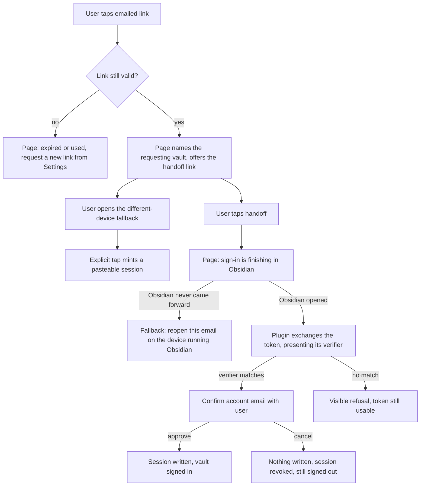
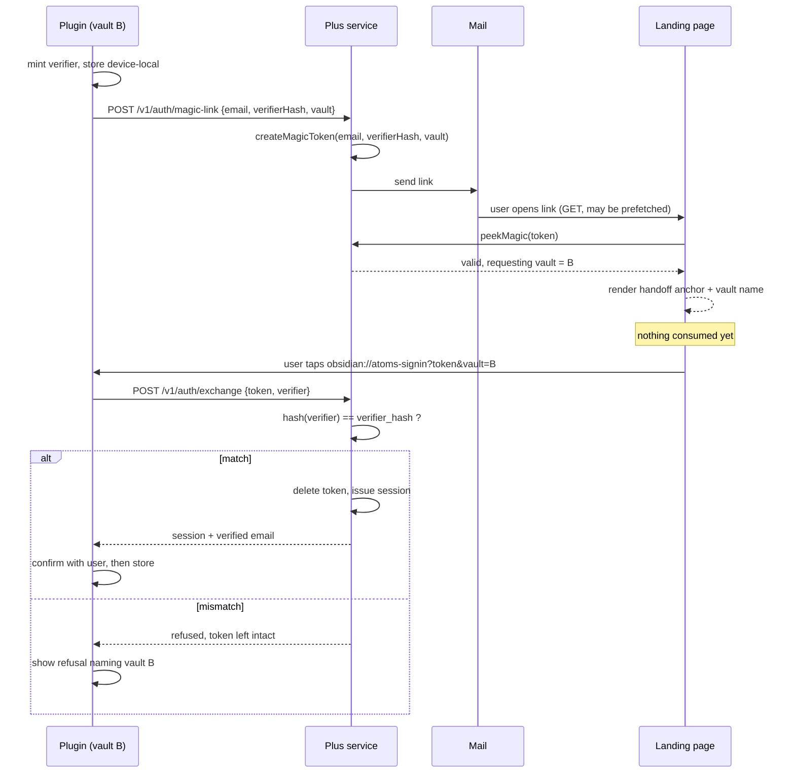
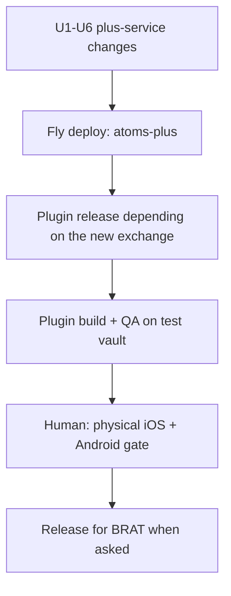

# Magic-link handoff to the plugin - Plan

## Goal Capsule

- **Objective:** the emailed sign-in link signs the plugin in on the device that opened it, with nothing typed and nothing copied.
- **Product authority:** this Product Contract, issue #240, and the `CLAUDE.md` non-negotiables it inherits (log safety; secrets never in `data.json`). Sign-out teardown (#284) and cloud-copy wipe (#285) are siblings from the same dogfood session and are not active scope here.
- **Open blockers:** none. The desktop probe on 2026-08-05 settled the platform question (see Probe results).
- **Stop conditions:** stop and surface, rather than guessing, if the deep-link handoff cannot be made to reach a named vault, or if binding the exchange to a device verifier would make the primary path fail closed on desktop.
- **Execution profile:** two deploy surfaces in a fixed order — `plus-service` to Fly first, then a plugin release. The server must accept the new exchange shape before any plugin build depends on it.
- **Tail ownership:** this plan owns the full shipping tail (`ce-simplify-code` → `ce-code-review` → `ce-compound` → `world-class-qa`). The physical-device release gate is human-only and is not satisfiable by an agent.

**Product Contract preservation:** changed — KD3, R5, R10, AE7, AE9, Scope Boundaries. KD3 was reversed by user direction on 2026-08-05: "Advanced: paste session" now survives this change and #286 owns deleting it. R5 and AE7 changed because the device verifier introduced by R12 makes an unrequested device unable to complete an exchange at all, so that case becomes a visible refusal rather than an approvable confirmation. R16-R18 are new requirements arising from those two changes, and AE12 is a new acceptance example covering R16. AE5 and AE6 changed only in that their Covers lines now carry R17 and R18. Everything else is unchanged.

---

## Product Contract

### Summary

The emailed sign-in link stops handing the user a token to copy.
Its landing page hands the magic token to an `obsidian://` deep link, the plugin exchanges it for a session, confirms the account with the user, and signs in.
Same device, no typing. The paste path survives as a demoted fallback until the typable claim code (#286) replaces it.

### Problem Frame

On 2026-08-04 the user tapped **Send sign-in link** in Settings, opened the email on the phone, and read: "Signed in ... Switch back to Obsidian → Settings → Atoms Plus → Refresh status."

**Refresh status** did nothing. It refreshes an *existing* local session, and this device had none — the button is a no-op by construction on exactly the device the sign-in link exists to serve.

The session the link minted only ever existed as text in the browser, inside a collapsed "Advanced: session token" block. The one working path was reading an opaque `sess_…` string off a web page and pasting it into Settings on a phone. #240 exists to make that path unnecessary.

### Key Decisions

- KD1. **Same-device handoff only.** (session-settled: user-directed — chosen over supporting both device shapes on day one: the link opens in the phone browser and hands off to Obsidian on that same phone, which is the case the user actually hit.) Governs R1, R8.
- KD2. **When the handoff cannot reach Obsidian, the page sends the user back to the email on the right device.** (session-settled: user-directed — chosen over showing a typable code now: the code is deferred to #286.) Governs R8.
- KD3. **"Advanced: paste session" stays in this change.** (session-settled: user-directed — chosen over deleting it alongside the handoff: strict device binding removes the cross-device path entirely, and a user whose mail only reaches a device other than the one running Obsidian would have no recovery until #286 ships.) #286 owns deleting the field and the landing page's fallback block together. Governs R10.
- KD4. **Exchange first, then always confirm the server-verified email before writing a session.** (session-settled: user-approved — chosen over a silent device-local gate that rejects unrequested links: a silent gate reproduces #240's own symptom, "I tapped it and nothing happened.") The device-local pending flag only shapes the confirmation copy. Governs R4.
- KD5. **The deep link carries the magic token, never the session.** The magic token is single-use and short-lived, which keeps #240's out-of-scope line intact: nothing that stores a session token in a URL. Governs R2, R11.
- KD6. **Consumption moves from the landing page's page load to a deliberate user action.** This retires the mail-prefetch burn as a byproduct rather than as separate work. Governs R6, R17.
- KD7. **The link carries the requesting vault's identity.** Without it a multi-vault device can sign the wrong vault in, and the right vault still reads signed-out — indistinguishable from the bug being fixed. Cost: the vault name transits and sits beside the magic token for at most the token's life, then dies with it. Governs R3, R18.
- KD8. **The landing page checks link validity without consuming it.** An expired link then fails on the web page rather than several taps deep inside Obsidian. Governs R7.
- KD9. **Two exchange paths, bound differently.** The deep-link exchange is bound to the requesting device's verifier and refuses anything else. The web fallback that mints a pasteable session stays deliberately unbound, at the same trust level as today's behavior, and retires with the paste field in #286. Governs R5, R10, R12.

### Actors

- A1. **The user** — taps the link in a mail client on the device running Obsidian, and approves or cancels the account confirmation.
- A2. **The landing page** — the web page the emailed link opens; it decides whether a handoff is possible and what the user is told when it is not.
- A3. **The Plus service** — mints and validates the magic link, and issues the session in exchange for the token.
- A4. **The plugin, in one vault** — receives the handoff, exchanges the token, asks A1 to confirm, and stores the session.

### Requirements

**Handoff**

- R1. Tapping the emailed sign-in link on the device running Obsidian signs that Obsidian in, with no characters typed and no text copied.
- R2. The handoff to Obsidian carries the magic token; it never carries a session token.
- R3. The session lands in the vault that requested the link, on a device running more than one vault.
- R12. The plugin mints a device-held verifier when it requests a sign-in link, the request registers that verifier's hash against the magic token, and the deep-link exchange succeeds only when the plugin presents the matching verifier. A handoff arriving without a match is refused with a visible explanation — never silently dropped.
- R13. A link opened while the requesting vault is not running leaves the token unconsumed and tells the user which vault to open, rather than showing the confirmation in a vault that did not request it.
- R16. A verifier mismatch leaves the magic token unconsumed and still usable, so the user can open the requesting vault and tap the same link again.
- R18. The landing page names the vault that requested the link, before the user taps the handoff.

**Consent**

- R4. The user sees a confirmation naming the server-verified account email and approves it before any session is written; cancelling writes nothing, revokes the just-exchanged session server-side, and leaves the device signed out.
- R5. A deep link arriving in a vault that did not request one produces a visible refusal naming the requesting vault and telling the user to open that vault and tap again — never a silent drop, and never an approvable confirmation, because the exchange cannot succeed there.

**Link lifecycle and dead ends**

- R6. A magic link is consumed exactly once, by a deliberate user action; mail prefetches, security scanners, and repeat page loads leave it usable.
- R7. An expired or already-used link says so on the landing page and points the user at requesting a new one from Settings.
- R8. A link opened where the handoff cannot reach Obsidian explains what happened and tells the user to reopen the email on the device running Obsidian.
- R9. A validity check never consumes the magic token in any store backend, so a dead-link check and a real exchange stay distinguishable.
- R14. After handing off, the landing page states the sign-in is finishing in Obsidian. R8's reopen-on-the-right-device text is a fallback the user reaches only when Obsidian never came forward — never an assertion that the handoff failed.
- R17. The landing page's fallback session is minted only by an explicit user action, never by a page load.

**Settings surface and safety**

- R10. The magic-link handoff is the primary sign-in-on-another-device path. "Advanced: paste session" remains available, demoted below it, until #286 replaces it.
- R11. Nothing in this flow writes a session token into a URL, a log, or an error object.
- R15. After a sign-in link is requested, the plugin's signed-out Settings copy describes the new flow — open the link in the email on this device — and does not direct the user to **Refresh status**.

### Key Flows

- F1. Same-device sign-in
  - **Trigger:** A1 taps the emailed link in a mail client on the phone running Obsidian.
  - **Actors:** A1, A2, A3, A4
  - **Steps:** A2 confirms the link is still valid without consuming it and names the requesting vault; A1 taps the handoff; A2 states the sign-in is finishing in Obsidian; A4 in the named vault exchanges the token with A3, presenting the verifier it minted when the link was requested; A4 shows A1 the server-verified email; A1 approves; A4 stores the session and Settings reads signed in.
  - **Covers:** R1, R2, R3, R4, R6, R12, R14, R18
- F2. Handoff cannot reach Obsidian
  - **Trigger:** the link opens where nothing takes the deep link — no Obsidian installed, the scheme blocked, or the target vault's plugin too old to register the action. Not a device shape: desktop with Obsidian installed is an F1 success case, verified 2026-08-05.
  - **Actors:** A1, A2
  - **Steps:** A2 explains that the sign-in has to finish inside Obsidian and tells A1 to reopen this email on the device running Obsidian. The link stays unconsumed.
  - **Covers:** R6, R8, R14
- F3. Dead link
  - **Trigger:** A1 opens a link that has expired or that a completed sign-in already consumed.
  - **Actors:** A1, A2, A3
  - **Steps:** A2 asks A3 whether the link is still usable, gets no, and tells A1 to request a new sign-in link from Settings. No handoff is offered.
  - **Covers:** R7, R9
- F4. Wrong vault takes the handoff
  - **Trigger:** the deep link fires in a vault that holds no matching verifier — a multi-vault device where routing did not reach the requesting vault, or a device that never requested a link.
  - **Actors:** A1, A3, A4
  - **Steps:** A4 attempts the exchange and A3 refuses it without consuming the token; A4 tells A1 which vault requested the link and that the same link still works there.
  - **Covers:** R5, R12, R13, R16
- F5. Signing in on a different device
  - **Trigger:** A1 can only read email on a device other than the one running Obsidian.
  - **Actors:** A1, A2, A3
  - **Steps:** A1 opens the demoted fallback block on the landing page and taps it; A3 consumes the token and A2 renders a session to copy; A1 pastes it into Settings on the target device.
  - **Covers:** R10, R17

### Acceptance Examples

- AE1. Happy path on a real phone
  - **Covers R1, R4.**
  - **Given** a phone running Obsidian on one vault, signed out of Plus, having just requested a sign-in link
  - **When** the user opens the email and taps the link, then taps the handoff
  - **Then** Obsidian comes forward, shows a confirmation naming the account email, and on approval Settings → Atoms Plus reads signed in — with nothing typed and nothing copied.
- AE2. Cancel at the confirmation
  - **Covers R4.**
  - **Given** the confirmation is on screen naming the account email
  - **When** the user cancels
  - **Then** no session is stored, Settings still reads signed out, no error is presented as a failure, and the session that was exchanged a moment earlier no longer authenticates.
- AE3. Expired link
  - **Covers R7.**
  - **Given** a link older than the magic token's lifetime
  - **When** the user opens it
  - **Then** the landing page says the link expired and tells the user to request a new one from Settings, and no handoff is offered.
- AE4. Handoff finds no taker
  - **Covers R8.**
  - **Given** the user opens the email on a machine with no Obsidian installed, or where the target vault's plugin does not register the action
  - **When** the user taps the handoff and nothing comes forward
  - **Then** the page explains the sign-in finishes inside Obsidian and tells the user to reopen this email on the device running Obsidian.
- AE5. Prefetched link
  - **Covers R6, R17.**
  - **Given** a mail client or security scanner has already loaded the link's page once
  - **When** the human then taps the same link
  - **Then** the sign-in completes normally, because no page load consumes the token.
- AE6. Multi-vault device
  - **Covers R3, R18.**
  - **Given** a device running two vaults and a link requested from vault B
  - **When** the user taps the link
  - **Then** the page names vault B, and vault B receives the session and reads signed in.
- AE7. Unrequested device
  - **Covers R5, R12.**
  - **Given** a device that never requested a sign-in link
  - **When** a valid link is opened there and the handoff is tapped
  - **Then** the vault shows a visible refusal naming the vault that did request the link, no confirmation is offered, and no session is written.
- AE8. Neither token reaches a log or an error
  - **Covers R11.**
  - **Given** a sign-in completing through the handoff, and a second attempt whose exchange fails
  - **When** the deep-link URL, the plugin's logs, and the surfaced error are inspected
  - **Then** no session token appears in any of the three, and no magic token appears in a log line or an error object — the deep-link URL is the only carrier the plugin constructs.
- AE9. The paste field is demoted, not gone
  - **Covers R10.**
  - **Given** the plugin is signed out
  - **When** the user opens Settings → Atoms Plus
  - **Then** requesting a sign-in link is presented as the way to sign in, and "Advanced: paste session" is still reachable below it.
- AE10. Requesting vault is closed
  - **Covers R13.**
  - **Given** a device running Obsidian on a vault other than the one that requested the link
  - **When** the user taps the handoff
  - **Then** the user is told which vault to open, no confirmation appears in the wrong vault, and the link still works after opening the right one.
- AE11. Settings copy after requesting a link
  - **Covers R15.**
  - **Given** the user has just tapped **Send sign-in link** on a signed-out device
  - **When** they read the Settings copy that follows
  - **Then** it tells them to open the link in the email on this device, and does not tell them to tap **Refresh status**.
- AE12. A refused handoff does not burn the link
  - **Covers R16.**
  - **Given** a deep link that fired in a vault holding no matching verifier and was refused
  - **When** the user opens the requesting vault and taps the same link again
  - **Then** the sign-in completes — the first attempt consumed nothing.

### Scope Boundaries

- **The typable cross-device claim code** — deferred to #286, explicitly ordered after this plan. #286 also owns deleting "Advanced: paste session" and the landing page's fallback block, and closing the session-in-browser-HTML item that block keeps open.
- **Sign-out teardown of MCP grants and mirror device state** — issue #284.
- **"Wipe cloud copy" re-uploading the whole vault** — issue #285.
- **Any design that puts a session token in a URL** — ruled out by #240 itself.
- **Changing how sessions are stored, or how entitlement refresh works** — untouched by this change.
- **Rewriting the setup docs that reference the paste field** — `docs/ask-self-host.md` and the QA docs stay accurate while the field survives; they retire with #286.

### Success Criteria

A real trial-account sign-in completed on a physical iOS device **and** a physical Android device, with the link opened from a mail client that uses an in-app browser, from tapping the emailed link to Settings showing the signed-in state, with zero characters typed and zero text copied. The no-handoff path must also produce a message the user can act on rather than a dead end.

### Outstanding Questions

**Deferred to implementation**

- Whether the confirmation should also appear when the device-local pending flag *is* set, or only harden its copy when the flag is absent. KD4 settles it as always-show; flag this as the item most likely to be revisited after real use.
- Whether the refusal in F4 should offer a one-tap "open the requesting vault" action rather than naming it in prose. Naming it is the floor; the action depends on whether `obsidian://open?vault=` reliably fronts a vault from inside another vault, which the probe did not test.

**Risks**

- **Mobile is still the risk; desktop is not.** The whole mechanism is verified on desktop macOS (Probe results below) but unverified from a mail client's in-app browser on iOS and Android. The release gate stays a real-device test, echoing #230 where an automated test proved the mechanism but not the live path.
- **`vault=` routing for a plugin-registered action is undocumented.** Obsidian's URI documentation describes `vault=` only for its six built-in actions; nothing states that a plugin-registered action receives or honors it. The desktop probe control-tested that it does on macOS 1.12.7, so KD7's mechanism rests on verified-but-undocumented behavior that a future Obsidian release could change. The verifier binding is what makes this fail safe: if routing does not reach the requesting vault, the exchange is refused and the link survives, rather than signing the wrong vault in.
- **Detection is real but narrow, and timing-dependent.** On desktop the page can tell the handoff was taken — but only via `document.hasFocus()`; `visibilityState` stayed `visible`, so any check written against `visibilitychange` alone would wrongly report failure on the success path. Focus also returned to the browser within a few seconds, so the verdict depends on when it is sampled. R14's fallback must be a retry offer the user can dismiss, never an automatic failure verdict.
- **A stale or action-less plugin swallows the link silently.** A vault whose installed build does not register the action produced no handler call, no error, and no user-visible signal. The landing page cannot detect it either, since the OS did accept the URI. R18 is the mitigation available: name the requesting vault *before* the tap, so a user who lands nowhere knows what to check.
- **The magic token is a bearer credential on the fallback path.** The web fallback mints a session for anyone holding the link, which is today's behavior and is why #286 is ordered next.
- All three store backends delete the magic token unconditionally, including on the expired path (`plus-service/src/store/postgres.mjs:328-350`, `sqlite.mjs:290-296`, `memory.mjs:210-235`) — the deletion *ordering* differs but the observable result does not. The real defect is that no code path can check a token without consuming it, which is what R9 and KD8 require changing.

### Probe results — desktop macOS, 2026-08-05

Run against Obsidian 1.12.7 with a throwaway `registerObsidianProtocolHandler("atoms-signin", …)` spike
installed in the `test vault`, `demo-vault`, and `new vault` agent lanes, then reverted. Personal vaults
untouched. **Everything below is macOS only.**

- **The scheme is claimed and the handoff works.** `obsidian:` is bound at the LaunchServices level; firing
  a link brings Obsidian forward from the background. A plugin-registered handler receives the action with
  all query params intact, including an injected `action` key.
- **A real desktop browser hands off.** A link fired from a page in Chrome reached the plugin handler. This
  settles the F2/AE4 question in favour of "desktop with Obsidian installed is a success case". Caveat: this
  machine may already have granted Chrome permission for `obsidian://`; a fresh browser profile may show a
  one-time "Open Obsidian?" prompt first, which is untested.
- **`vault=` routes a custom action to a named vault.** Control-tested: with one vault frontmost, a link
  naming a *different* vault fired in the named one, not the focused one. KD7's mechanism works here.
- **A closed vault is opened by the link**, and the handler then fires provided that vault's plugin
  registers the action.
- **Silent-drop cases:** a vault whose plugin lacks the action, and an unrecognized vault name, both produce
  no handler call and no signal of any kind.
- **Detection:** the page saw `blur` and `hasFocus() === false`, but `visibilityState` stayed `visible`.
  Focus returned to the browser within seconds, so the verdict is sampling-time dependent.
- **Storage scoping:** `app.saveLocalStorage` is vault-scoped (a value written in one vault reads `null` in
  another), so R3's premise holds. Raw `window.localStorage` is *not* scoped and is shared across vaults —
  an implementation trap, not a requirements problem.

---

## Planning Contract

### Key Technical Decisions

- KTD1. **A non-consuming check is a new store method, not a flag on `exchangeMagic`.** Every magic-token route today calls `store.exchangeMagic`, which deletes the row. Adding a `peekMagic(token)` that returns validity, email, and requesting vault without mutating keeps the consuming path a single code path and makes R9 testable as a property of each backend rather than a branch in a route. Governs R7, R9.
- KTD2. **The magic-token row gains `verifier_hash` and `vault` through the repo's additive-ALTER convention.** There is no migrations directory and no version table: sqlite applies inline DDL plus `PRAGMA table_info` back-fills (`plus-service/src/store/sqlite.mjs:96-104`), postgres applies `MIGRATE_SQL` plus `ALTER TABLE … ADD COLUMN IF NOT EXISTS` (`postgres.mjs:107-112`). Both new columns ship the same way so an existing deployment upgrades on boot. Governs R3, R12.
- KTD3. **The verifier is checked inside the same transaction as the delete, before it, and a mismatch aborts without deleting.** Postgres already wraps the exchange in `BEGIN` / `SELECT … FOR UPDATE` / `DELETE` (`postgres.mjs:328-374`); the check belongs inside that lock. sqlite and memory delete first and check expiry after, which must be inverted for the same reason. This is what makes a refused handoff non-destructive. Governs R12, R16.
- KTD4. **The handoff is a plain anchor and the landing page stays JavaScript-free.** The exchange page ships `default-src 'none'` (`plus-service/src/server.mjs:130,148`) and has no client-side script today. External research is consistent that a user-tapped anchor is the only custom-scheme navigation iOS `SFSafariViewController` and Android Chrome reliably honor without a user gesture — an automatic `window.location` or meta-refresh is silently ignored. The CSP constraint and the reliable shape are the same shape, so neither is relaxed. Governs R1, R14.
- KTD5. **The fallback session is minted by a form POST, not a GET.** Mail scanners and prefetchers issue GETs; a POST requires the human. This is the mechanism behind KD6 and is what lets the paste path survive without reintroducing the prefetch burn. Governs R6, R17.
- KTD6. **PKCE S256 shape, verifier held device-local.** The plugin generates a random verifier with `crypto.getRandomValues`, sends `SHA-256` of it at mint time, and presents the raw verifier at exchange. The server stores only the hash. `plus-service/test/http-ask-oauth.test.mjs:23-27` already carries a `pkce()` helper from the Ask OAuth flow — reuse its shape rather than inventing a second one. The verifier is written with `app.saveLocalStorage`, never `window.localStorage`, which is not vault-scoped. Governs R12.
- KTD7. **Plugin network calls use `plusFetchRequest`, not `requestUrl`.** `CLAUDE.md` states the repo-wide default is `requestUrl`; the Plus surface is a documented exception — `plusFetchRequest` (`src/platform/plusClient.ts:21-60`) exists because desktop `requestUrl` fails against localhost with `net::ERR_FAILED`, and production Plus sends `Access-Control-Allow-Origin: *`. Every Plus call site already passes it. The one raw `requestUrl` in this surface is inside the paste-session block, which KD3 leaves in place.
- KTD8. **The protocol handler registers synchronously in `onload`, with its logic in `src/platform/`.** A link that opens a cold vault must not race a deferred registration, so the call goes beside `registerCommands()` in `src/plugin/main.ts:229` rather than inside an `onLayoutReady` block. The orchestration lives in a new `platform/` module taking a narrow host type, following `src/platform/plusResume.ts:16-27` — that keeps `plugin/main.ts` a wiring shell and makes the flow testable without an Obsidian runtime.
- KTD9. **The confirmation modal mirrors `AskMirrorDeleteConfirmModal`.** `src/settings/settings.ts:1473-1536` already implements exactly the shape R4 needs: safe option first, `onClose` treated as non-consent behind an `answered` latch, and a verdict union returned through a callback. Copy its structure, including extracting the verdict so it can be tested without rendering. Use `.setWarning()`, not `.setDestructive()` — the latter exists only from Obsidian 1.13 and `manifest.json` declares `minAppVersion: 1.11.4`, a combination that has already crashed Settings for Plus users once.
- KTD10. **The non-consuming check and both exchange routes get rate limits.** Neither exchange route is limited today. About a dozen keyed limits already exist across `plus-service/src/server.mjs`, `oauth/routes.mjs`, `mirror/http.mjs`, and `mcp/tools.mjs`, several passing a custom ceiling as `checkRateLimit`'s second argument (`oauth/routes.mjs:302`, `mirror/http.mjs:94`). A non-consuming check is an unauthenticated oracle on token validity, so it needs its own key alongside the exchange paths.
- KTD11. **`plus-service` deploys to Fly before the plugin release.** The plugin's exchange call carries a field the current server ignores, and its sign-in fails against a server that does not yet enforce the verifier. Standing repo precedent for this ordering is `docs/plans/2026-08-04-002-feat-ask-mcp-pairing-plan.md:28`.
- KTD12. **`GET /v1/auth/exchange` keeps a consuming branch for the OAuth browser hop, gated on a live pending record.** The route serves two callers: the plain magic-link email and the Ask OAuth authorize flow, which emails the same URL with `&pending=…` and needs the GET to consume and 302 to consent. Making the GET uniformly non-consuming would strand every MCP authorization in an email-form loop and, worse, offer an `obsidian://` handoff that mints a plugin session for a request the user never consented to. Branching on `pending` is smaller than reworking `maybeFinishOauthAfterExchange`, keeps the OAuth token single-use, and closes an existing hole where a stale `pending` burns the token and then prints the session as HTML. Governs R6, R9, R17.

### High-Level Technical Design

Token lifecycle across the four actors, showing where the token is checked and where it is spent:

Deploy and dependency order across surfaces:

### Assumptions

- The Obsidian action name is `atoms-signin`, making the deep link `obsidian://atoms-signin?token=…&vault=…`. Nothing else in the repo registers a protocol action, so there is no collision to avoid.
- The requesting vault's identity is its Obsidian vault **name**, matching what the probe control-tested. Vault IDs are the documented alternative for built-in actions but were not probed.
- The magic token TTL stays at 15 minutes, hard-coded identically in all three backends. Moving consumption later in the flow widens the live window within that TTL but does not extend it.

### System-Wide Impact

- **`GET /v1/auth/exchange` has two consumers, not one.** The plain magic-link email and the Ask OAuth authorize flow both point at it (`plus-service/src/server.mjs:346`, `plus-service/src/oauth/routes.mjs:360`). KTD12 preserves the OAuth branch. Three existing tests pin that contract and must stay green rather than being updated to match new behavior: `plus-service/test/http-ask-oauth.test.mjs:124-135`, `:362-387`, `plus-service/test/mcp-modern-era.test.mjs:71-94`.
- **`exchangeMagic` has exactly three production call sites** — `plus-service/src/server.mjs:368`, `:380`, `:394` — and the memory backend's implementation carries side effects the OAuth path relies on being harmless (dogfood auto-grant, `revokeAllSessionsForEmail`). Adding the verifier check must not disturb them.
- **Auth boundary.** A session minted through the handoff is a full `sess_`, which under `docs/architecture.md` § Ask mirror sync invariant 4 can mutate the mirror and apply the outbox. The confirmation in U10 is the only human gate on that, which is why cancel must revoke rather than merely decline to store.
- **Device-local control plane grows a key.** `atoms-plus-signin-pending` joins the three existing keys and must follow the same no-sync rule: `app.saveLocalStorage`, never `data.json`, never `window.localStorage`.
- **Two deploy surfaces in a fixed order.** The plugin's exchange call fails against a server that does not yet accept a verifier, so `plus-service` ships first (KTD11). The landing page is part of `plus-service`, not the `www/` site, so it deploys with the server rather than through the Cloudflare Pages workflow.
- **Docs that describe the old GET behavior go stale**, without breaking: `plus-service/README.md:105` documents only the POST and stays correct; `docs/qa/2026-08-01-trial-session-invalid-world-class-qa.md:48` and `docs/handoffs/2026-08-04-240-magic-link-handoff.md:31` describe the GET rendering a session and become historical rather than current.
- **`GET /v1/auth/dev-exchange` is dead weight** — zero callers, zero tests, 404 in production, and a duplicate of the GET body. It either receives the same branch or is deleted in this change; leaving it diverged is how the #230 one-branch-only bug happened.

---

## Implementation Units

### Unit Index

| U-ID | Title | Files touched | Depends on |
|---|---|---|---|
| U1 | Magic-token columns across three backends | `plus-service/src/store/{memory,sqlite,postgres}.mjs` | — |
| U2 | Non-consuming `peekMagic` | `plus-service/src/store/{memory,sqlite,postgres}.mjs` | U1 |
| U3 | Mint accepts verifier hash and vault | `plus-service/src/server.mjs` | U1 |
| U4 | Verifier-bound exchange, non-destructive on mismatch | `plus-service/src/{server.mjs,store/*}` | U1, U3 |
| U5 | Landing page: handoff anchor, named vault, no session on load, OAuth branch preserved | `plus-service/src/server.mjs` | U2 |
| U6 | Demoted fallback that mints a session on POST | `plus-service/src/server.mjs` | U5 |
| U7 | Device verifier and pending record | `src/platform/pkce.ts`, `src/platform/filingAuth.ts` | — |
| U8 | Client sends verifier hash at mint, verifier at exchange | `src/platform/plusClient.ts` | U7 |
| U9 | Protocol handler and sign-in orchestration | `src/platform/plusSignIn.ts`, `src/plugin/main.ts` | U7, U8 |
| U10 | Confirmation modal with cancel default and revoke | `src/settings/plusSignInConfirmModal.ts`, `src/platform/plusSignIn.ts` | U9 |
| U11 | Settings copy for the new flow | `src/settings/settings.ts` | U7, U8 |
| U12 | QA fixtures and evidence | `docs/qa/testing-fixtures.md`, `docs/qa/` | U1-U11 |

### U1. Magic-token columns across three backends

**Goal:** the magic-token row can carry the requesting device's verifier hash and the requesting vault's name.

**Requirements:** R3, R12, R18.

**Dependencies:** none.

**Files:**
- `plus-service/src/store/memory.mjs`
- `plus-service/src/store/sqlite.mjs`
- `plus-service/src/store/postgres.mjs`
- `plus-service/test/security-auth-criticals.test.mjs`

**Approach:**
1. Widen `createMagicToken(email, opts)` in all three backends to accept `verifierHash` and `vault`, both optional so an existing caller keeps working.
2. sqlite: add both columns to the `magic_tokens` DDL, and add a `PRAGMA table_info(magic_tokens)` back-fill beside the existing ones so already-deployed databases upgrade on open.
3. postgres: add both columns to `MIGRATE_SQL` and an `ALTER TABLE … ADD COLUMN IF NOT EXISTS` beside the existing additive ALTERs.
4. memory: add both fields to the stored object.
5. Widen what `exchangeMagic` returns so the vault name is available to callers.

**Patterns to follow:** the `sessions.verified` back-fill at `plus-service/src/store/sqlite.mjs:96-100` and the additive ALTER block at `postgres.mjs:107-112`. `plus-service/src/store/shared.mjs:16` already exposes a sha256 hex helper — reuse it rather than adding a second hashing path.

**Test scenarios:**
- A token minted with a verifier hash and vault reads both back on exchange, in all three backends.
- A token minted without either field exchanges successfully with both absent — the columns are additive, not required.
- Opening a database created before this change adds both columns rather than throwing.
- The vault name round-trips unchanged through a value containing a space and a non-ASCII character.

**Verification:** `security-auth-criticals.test.mjs`'s `runStoreSuite` passes for memory, sqlite, and postgres, with `TEST_DATABASE_URL` set so the postgres arm actually runs rather than silently falling back.

### U2. Non-consuming `peekMagic`

**Goal:** a caller can ask whether a magic token is usable, and which vault requested it, without spending it.

**Requirements:** R6, R7, R9, R18.

**Dependencies:** U1.

**Files:**
- `plus-service/src/store/memory.mjs`
- `plus-service/src/store/sqlite.mjs`
- `plus-service/src/store/postgres.mjs`
- `plus-service/test/security-auth-criticals.test.mjs`

**Approach:** add `peekMagic(token)` to each backend returning validity, the account email, and the requesting vault, and export it from all three factory literals. It reads only — no delete, no transaction that could delete. Expired tokens report expired rather than being cleaned up here; the consuming path already removes them.

**Execution note:** write the parity assertions first. This unit's whole value is that a property holds identically in three implementations, and the harness that proves it (`runStoreSuite`) is the thing most likely to be quietly weakened into passing.

**Test scenarios:**
- Peeking a valid token twice, then exchanging it, still succeeds — the peeks consumed nothing.
- Peeking an expired token reports expired and leaves the row present.
- Peeking an unknown token reports invalid without throwing.
- Peek returns the requesting vault when one was recorded, and absent when it was not.
- Each of the three factories exports `peekMagic` — a source-level parity assertion in the shape of `plus-service/test/stripe-incidents.test.mjs:249-284`.

**Verification:** the parity suite passes across all three backends, and deliberately breaking the postgres query turns the suite red rather than being masked by a memory-store fallback.

### U3. Mint accepts verifier hash and vault

**Goal:** requesting a sign-in link records the device's verifier hash and the requesting vault against the token.

**Requirements:** R3, R12.

**Dependencies:** U1.

**Files:**
- `plus-service/src/server.mjs`
- `plus-service/test/http-dogfood.test.mjs` (or a sibling route test)

**Approach:**
1. `POST /v1/auth/magic-link` accepts optional `verifierHash` and `vault` alongside `email`, validated as bounded strings in the manual style the route already uses.
2. Pass both through to `store.createMagicToken`.
3. Leave the OAuth mint path (`plus-service/src/oauth/routes.mjs:359-360`) unbound — it has no plugin device to bind to.
4. Do not log either value; the existing non-prod link log at `plus-service/src/email.mjs:13` already prints the full link and must not gain more.

**Test scenarios:**
- A mint carrying a verifier hash and vault stores both against the token.
- A mint omitting them still succeeds, and the resulting token exchanges unbound.
- An oversized or non-string `verifierHash` is rejected with 400 rather than stored.
- The rate limit on the mint key still applies with the new fields present.

**Verification:** route tests pass against a spawned server; a mint followed by a peek shows the vault name.

### U4. Verifier-bound exchange, non-destructive on mismatch

**Goal:** the deep-link exchange succeeds only for the device that requested the link, and a refusal leaves the link usable.

**Requirements:** R5, R12, R16. Realizes F4.

**Dependencies:** U1, U3.

**Files:**
- `plus-service/src/server.mjs`
- `plus-service/src/store/memory.mjs`
- `plus-service/src/store/sqlite.mjs`
- `plus-service/src/store/postgres.mjs`
- `plus-service/test/security-auth-criticals.test.mjs`

**Approach:**
1. `POST /v1/auth/exchange` accepts an optional `verifier` and passes it to `exchangeMagic`.
2. In each backend, when the stored row carries a `verifier_hash`, compare it to the hash of the presented verifier **before** any delete, and abort the exchange without deleting on mismatch or absence.
3. Invert the sqlite and memory order so the row is read and checked before it is removed; in postgres the check goes inside the existing `FOR UPDATE` transaction.
4. A row with no `verifier_hash` exchanges as it does today — this is the unbound web path KD9 preserves.
5. Return a refusal distinguishable from "expired or used" so the plugin can render R5's message rather than R7's.
6. Add a rate-limit key for the exchange routes.

**Execution note:** the mismatch path is the one that must not delete. Write a failing test that exchanges with a wrong verifier and then exchanges again with the right one, before touching any store code.

**Test scenarios:**
- Exchange with the matching verifier issues a session and consumes the token.
- Covers AE12. Exchange with a wrong verifier is refused, and a subsequent exchange with the right verifier succeeds — proving nothing was consumed.
- Exchange with no verifier against a bound token is refused, not accepted.
- Exchange with any verifier against an unbound token succeeds, preserving the web fallback.
- An expired bound token reports expired, not verifier-mismatch.
- All of the above hold identically in memory, sqlite, and postgres.
- The refusal response carries no session token and no magic token.

**Verification:** parity suite green across three backends; a deliberate mutation of the postgres comparison turns it red.

### U5. Landing page: handoff anchor, named vault, no session on load, OAuth branch preserved

**Goal:** opening the emailed link offers a tap-to-open handoff, names the requesting vault, and spends nothing.

**Requirements:** R1, R2, R6, R7, R8, R11, R14, R18. Realizes F1's page half, F2, and F3.

**Dependencies:** U2.

**Files:**
- `plus-service/src/server.mjs`

**Approach:**
1. `GET /v1/auth/exchange` branches on the `pending` query parameter **before** deciding whether to consume. This is load-bearing: the Ask OAuth browser flow emails a link to this same route carrying `&pending=…` (`plus-service/src/oauth/routes.mjs:360`), and depends on the GET consuming the token and then 302-ing to consent.
2. With a `pending` id **that resolves to a live pending record**, keep today's behavior: consume via `exchangeMagic` and hand off to `maybeFinishOauthAfterExchange`. Check the record exists first — today a stale `pending` consumes the token and then falls through to printing the session as HTML (`plus-service/src/server.mjs:384-387`), which is a live hole this branch closes.
3. Without a `pending` id, call `peekMagic` and branch: expired or unknown renders R7's message; valid renders the handoff. This path consumes nothing.
4. The handoff is a plain `<a href="obsidian://atoms-signin?token=…&vault=…">`, URI-encoded, with the requesting vault named in the surrounding copy.
5. Below it, R14's "finishing in Obsidian" state and R8's reopen-on-the-right-device text as a dismissible fallback, not an automatic failure verdict.
6. Neither branch prints a session token. The CSP stays `default-src 'none'`; no script is added.
7. `Referrer-Policy: no-referrer` on this response so the magic token does not leak through a referer header.
8. Apply the same branch to `GET /v1/auth/dev-exchange` (`plus-service/src/server.mjs:364-376`), or delete that route — it duplicates the GET body, has zero callers, zero tests, and is 404 in production.

**Patterns to follow:** the existing inline template and `escHtml` at `plus-service/src/server.mjs:119-162`. `maybeFinishOauthAfterExchange` (`plus-service/src/oauth/routes.mjs:559-590`) stays untouched — it consumes only `out.account` and already discards `out.session`.

**Test scenarios:**
- Covers AE6. A GET of a valid link returns 200, contains an `obsidian://atoms-signin` anchor carrying the token, and names the requesting vault.
- Covers AE5. The same link peeks clean after two GETs and still exchanges — no page load consumed it.
- A GET of a valid link contains no `sess_` string anywhere in the response body.
- A GET of an expired link returns the expired message and no anchor.
- Response carries `Referrer-Policy: no-referrer` and an unchanged CSP.
- A token minted without a vault renders the handoff without a vault name rather than the string `undefined`.
- A GET carrying a live `pending` id still consumes the token, sets the `atoms_oauth_bs` cookie, and 302s to consent — the existing OAuth assertions stay green.
- A GET carrying a stale or unknown `pending` id consumes nothing and renders no session, rather than burning the token and printing it.
- A GET carrying `pending` never renders the `obsidian://` handoff — an OAuth request must not mint a plugin session the user never consented to.

**Verification:** route tests against a spawned server; grep the rendered body for `sess_` and assert absent. The three existing OAuth tests that assert the 302 hop must still pass unchanged — `plus-service/test/http-ask-oauth.test.mjs:124-135`, `:362-387`, and `plus-service/test/mcp-modern-era.test.mjs:71-94`. If any of them goes red, the branch in step 1 is wrong.

### U6. Demoted fallback that mints a session on POST

**Goal:** a user who can only read email on a different device can still obtain a pasteable session, without a page load ever spending the token.

**Requirements:** R6, R10, R17. Realizes F5.

**Dependencies:** U5.

**Files:**
- `plus-service/src/server.mjs`

**Approach:**
1. Add a collapsed "signing in on a different device?" block below the handoff, containing a form that POSTs the token.
2. The POST handler consumes the token via the unbound path and renders the session for copying — today's success HTML, reached deliberately instead of automatically.
3. Rate-limit the POST on the same key family as the other exchange routes.
4. Keep `escHtml` on everything rendered; the CSP already forbids script, and a form post is permitted by `default-src 'none'` — verify rather than assume, and add `form-action 'self'` explicitly.

**Test scenarios:**
- A GET of the landing page does not consume the token even though the form is present.
- Submitting the form consumes the token and renders a session.
- Submitting the same form twice reports the link already used on the second attempt.
- A HEAD request against the landing page consumes nothing.
- The form's POST is rate-limited.

**Verification:** route tests prove GET-then-POST works and POST-then-POST fails; a simulated scanner issuing GET and HEAD leaves the token usable.

### U7. Device verifier and pending record

**Goal:** the plugin can mint a verifier, remember it vault-locally, and forget it on sign-out.

**Requirements:** R12, R11.

**Dependencies:** none.

**Files:**
- `src/platform/pkce.ts` (new)
- `src/platform/filingAuth.ts`
- `test/pkce.test.ts` (new)
- `test/filingAuth.test.ts`

**Approach:**
1. `src/platform/pkce.ts` exports a verifier generator and an S256 challenge function, both taking their randomness and digest as injectable dependencies in the style the rest of `src/platform/` already uses.
2. `filingAuth.ts` gains a pending sign-in record — verifier, requesting vault, requested-at — stored under a new `atoms-plus-signin-pending` key, following the `isAwaitingCheckout` / `setAwaitingCheckout` idiom at `src/platform/filingAuth.ts:186-201`.
3. Reads and writes go through `app.saveLocalStorage`, never `window.localStorage`, which is not vault-scoped.
4. `clearPlusSession` also clears the pending record.
5. The record expires on read past the magic token's TTL, so a stale verifier does not linger.

**Patterns to follow:** the injectable `LocalStorageLike` adapter at `src/platform/filingAuth.ts:151-154`; `src/platform/plusClient.ts:44` for web globals being acceptable in this layer.

**Test scenarios:**
- A generated verifier is high-entropy and URL-safe, and two calls differ.
- The S256 challenge of a known verifier matches a known digest.
- Writing then reading the pending record round-trips the verifier and vault.
- A pending record older than the token TTL reads as absent.
- Clearing the session clears the pending record.
- A malformed stored value reads as absent rather than throwing.

**Verification:** `npm test` passes; the new tests fail if the storage adapter is swapped for a non-vault-scoped one.

### U8. Client sends verifier hash at mint, verifier at exchange

**Goal:** the plugin's two Plus calls carry the binding.

**Requirements:** R12.

**Dependencies:** U7.

**Files:**
- `src/platform/plusClient.ts`
- `test/plusClient.test.ts`

**Approach:**
1. `requestMagicLink` accepts and sends `verifierHash` and `vault`.
2. `exchangeMagicToken` accepts and sends `verifier`.
3. Map the server's refusal into a distinct error code so the caller can tell "wrong vault" from "expired" and from a network failure.
4. Extend `redact` (`src/platform/plusClient.ts:119-125`) so a verifier never survives into a message or log line; it already strips `sess_`.

**Test scenarios:**
- The mint request body carries the verifier hash and vault.
- The exchange request body carries the verifier.
- A refusal response maps to the wrong-vault code, distinct from the expired code.
- A network failure still maps to the existing network code.
- No error message produced by either call contains the verifier or a session token.

**Verification:** `npm test`; the existing `mockRequest` harness asserts on the parsed request bodies.

### U9. Protocol handler and sign-in orchestration

**Goal:** tapping the handoff completes the exchange in the requesting vault, and is refused visibly anywhere else.

**Requirements:** R1, R3, R5, R13, R16. Realizes F1's plugin half and F4.

**Dependencies:** U7, U8.

**Files:**
- `src/platform/plusSignIn.ts` (new)
- `src/plugin/main.ts`
- `test/plusSignIn.test.ts` (new)

**Approach:**
1. `plusSignIn.ts` exports a handler taking a narrow host type and the protocol params, mirroring `PlusResumeHost` at `src/platform/plusResume.ts:16-27`.
2. It reads the pending record, exchanges with the verifier, and routes the outcome: success to the confirmation, refusal to a Notice naming the requesting vault from the deep link's `vault` param, expiry to a request-a-new-link Notice.
3. Register it in `src/plugin/main.ts` beside `registerCommands()` at `:229`, synchronously in `onload`, so a cold-opened vault does not miss the link.
4. Never log the token or the verifier; the refusal message names the vault only.

**Execution note:** the refusal path is the one a user actually hits when mobile routing misbehaves. Cover it before the happy path.

**Test scenarios:**
- A handoff whose token matches the local verifier reaches the confirmation step.
- Covers AE7 and AE10. A handoff arriving with no local pending record produces a refusal naming the vault from the link, and does not reach the confirmation.
- A handoff whose exchange is refused by the server surfaces the wrong-vault message, not a generic failure.
- An expired token surfaces the request-a-new-link message.
- A malformed or token-less deep link is ignored without throwing.
- Neither the token nor the verifier appears in any Notice text.
- The handler is registered during `onload`, not deferred.

**Verification:** `npm test`; then a live CLI smoke firing `obsidian://atoms-signin` against the throwaway test vault with Obsidian open.

### U10. Confirmation modal with cancel default and revoke

**Goal:** no session is written without a deliberate approval, and a cancel undoes the exchange server-side.

**Requirements:** R4.

**Dependencies:** U9.

**Files:**
- `src/settings/plusSignInConfirmModal.ts` (new)
- `src/platform/plusSignIn.ts`
- `test/plusSignIn.test.ts`

**Approach:**
1. Build the modal on `AskMirrorDeleteConfirmModal`'s structure (`src/settings/settings.ts:1473-1536`): safe option first, verdict union, `answered` latch, `onClose` counted as a dismissal rather than consent.
2. Extract the verdict handling so it can be tested without rendering — the test suite's `Modal` mock has an inert `contentEl`.
3. On approve, write the session. On cancel or dismiss, write nothing and call sign-out with the just-issued session so it stops authenticating.
4. Copy names the server-verified email and states that approving lets this vault act as that account and sync its atoms there.
5. Use `.setWarning()`; `.setDestructive()` requires Obsidian 1.13 and `manifest.json` declares 1.11.4.

**Test scenarios:**
- Covers AE1. Approving writes the session and Settings reads signed in.
- Covers AE2. Cancelling writes nothing and calls revoke with the exchanged session.
- Dismissing without choosing behaves as a cancel, including the revoke.
- A revoke that fails still leaves the device signed out, and surfaces a message rather than silently succeeding.
- The rendered copy contains the server-verified email and no token.

**Verification:** `npm test`; live smoke covering approve and cancel, with a signed-out Settings pane after cancel.

### U11. Settings copy for the new flow

**Goal:** the signed-out panel describes the handoff, and stops pointing at **Refresh status**.

**Requirements:** R10, R15.

**Dependencies:** U7, U8.

**Files:**
- `src/settings/settings.ts`
- `test/settings.test.ts`

**Approach:**
1. Rewrite the "Sign in on another device" description at `src/settings/settings.ts:531-533` to describe opening the link in the email on this device.
2. Rewrite the post-send Notice at `:212-215`, which currently tells the user to return and tap **Refresh status**.
3. Update the stale docstring at `:219-221`.
4. Pass the vault name and a freshly minted verifier hash into `sendPlusMagicLink` at `:201-216`.
5. Leave the "Advanced: paste session" block at `:553-617` in place per KD3, demoted below the sign-in-link row, with copy framing it as the different-device fallback. The `requestUrl` import at `:79` stays with it.

**Test scenarios:**
- Covers AE11. The signed-out panel's sign-in-link copy does not contain "Refresh status".
- Covers AE11. The post-send Notice tells the user to open the link on this device.
- Requesting a link writes a pending record and sends a verifier hash.
- Covers AE9. The paste field is still present and still saves a pasted session.
- No rendered string in the panel contains a `sess_` value.

**Verification:** `npm test`; `./scripts/verify.sh` with Obsidian open on the throwaway vault, plus a screenshot of the signed-out panel.

### U12. QA fixtures and evidence

**Goal:** the repo's standing hedge about `vault=` on mobile becomes a recorded device result, and the PR carries real evidence.

**Requirements:** Success Criteria.

**Dependencies:** U1-U11.

**Files:**
- `docs/qa/testing-fixtures.md`
- `docs/qa/2026-08-05-240-magic-link-handoff-world-class-qa.md` (new)
- `docs/qa/screenshots/240-magic-link/`

**Approach:**
1. Run `world-class-qa` against the throwaway vault, ending with its required `adversarial-qa` half.
2. Update the "when supported" qualifier at `docs/qa/testing-fixtures.md:86` with what the device gate actually found, rather than leaving the hedge standing.
3. Capture desktop screenshots of the landing page, the confirmation, the refusal, and the signed-in panel; commit them and link with absolute raw URLs.
4. State plainly which results are scripted plumbing and which are product proof, following `docs/qa/2026-08-01-trial-session-invalid-world-class-qa.md`.
5. Record the iOS and Android gate as outstanding and human-only rather than checking it.

**Test expectation:** none — this unit produces evidence, not behavior.

**Verification:** the QA report exists, names its gaps, and the PR's test-plan boxes match what actually ran.

---

## Verification Contract

| Gate | Command | Applies to | Signal |
|---|---|---|---|
| Plugin unit tests | `npm test` | U7-U11 | vitest green |
| Service unit and route tests | `cd plus-service && npm test` | U1-U6 | `node --test` green |
| Store parity including postgres | `TEST_DATABASE_URL=… npm test` in `plus-service` | U1, U2, U4 | the postgres arm runs and is fatal if skipped in CI |
| Build | `npm run build` | all plugin units | typecheck and bundle clean |
| Live vault smoke | `./scripts/verify.sh`, then `obsidian command id=…` against the throwaway vault | U9-U11 | handoff fires, confirmation appears, Settings reads signed in |
| Deploy | `fly deploy -a atoms-plus -c plus-service/fly.toml --dockerfile plus-service/Dockerfile` | U1-U6 | health check green before any plugin build ships |
| Release gate | physical iOS and Android, link opened in a mail client's in-app browser | Success Criteria | human-only; an agent cannot satisfy it |

A deliberate mutation check applies to U1, U2, and U4: break the postgres path on purpose and confirm the suite turns red. A parity harness that cannot fail is the failure mode `docs/solutions/architecture-patterns/a-test-harness-that-cannot-fail-reports-coverage-that-never-ran.md` documents, and this plan's store work is exactly its shape.

## Definition of Done

**Global**

- Every requirement R1-R18 is implemented or explicitly deferred in writing.
- All Verification Contract gates pass except the human-only release gate, which is recorded as outstanding.
- No session token or magic token appears in a URL the plugin constructs, a log line, or a surfaced error.
- `plus-service` is deployed to Fly before any plugin build that depends on it.
- Dead-end and experimental code from approaches that did not pan out is removed, not left in the diff.
- Shipping tail complete: `ce-simplify-code`, `ce-code-review` with P0/P1 fixed, `ce-compound`, and `world-class-qa` including its adversarial half.
- PR body carries `Closes #240`, distilled user stories, edge cases, and screenshots linked by absolute raw URL.
- `STATUS.md` cleared after merge.

**Per unit**

| Unit | Done when |
|---|---|
| U1 | Both columns exist in three backends and an old database upgrades on open |
| U2 | `peekMagic` consumes nothing in three backends, proven by peek-then-exchange |
| U3 | A mint records verifier hash and vault; omitting them still works |
| U4 | A wrong verifier is refused and the same link then succeeds with the right one |
| U5 | A page load renders the handoff, names the vault, prints no session, and spends nothing; the OAuth `pending` hop still 302s to consent |
| U6 | GET and HEAD leave the token usable; the form POST mints a session |
| U7 | Verifier round-trips vault-locally and clears on sign-out |
| U8 | Both request bodies carry the binding and no error text leaks it |
| U9 | The handler is registered in `onload`; a no-verifier handoff refuses visibly naming the vault |
| U10 | Cancel and dismiss both write nothing and revoke the exchanged session |
| U11 | No signed-out copy mentions **Refresh status**; the paste field still works |
| U12 | QA report exists, names its gaps, and the device gate is recorded as outstanding |

---

## Sources / Research

Verified against the branch on 2026-08-05. Cited as context for planning, not as requirements.

**Service surface**

- `GET /v1/auth/exchange` consumes the magic token and renders the session as raw text in a collapsed block — `plus-service/src/server.mjs:378-388`, `:127-162` (session printed at `:161`).
- `POST /v1/auth/exchange` already exists and returns session, email, status, and remaining — `plus-service/src/server.mjs:390-409`. Neither exchange route is rate-limited today.
- The landing page is an inline template literal in `server.mjs` with `Content-Security-Policy: default-src 'none'` and zero client-side JavaScript (`:130,:148`). It is served by `plus-service`, not by the `www/` marketing site.
- The magic link is minted with only a token parameter (`plus-service/src/server.mjs:346`) and the client sends email only (`src/platform/plusClient.ts:299`), so KD7's vault identity needs plumbing through the mint path, not just the landing page.
- No endpoint can report magic-token validity without consuming it — every magic-token route calls `store.exchangeMagic`, which deletes the row (`plus-service/src/server.mjs:364,379,391`).
- The exchange accepts a bare token from any caller with no device, vault, or origin binding (`plus-service/src/server.mjs:391-409`), which is what R12's verifier closes. Sign-out already revokes a session by bearer (`:356-361`), which R4's cancel path reuses.
- Magic token TTL is 15 minutes, hard-coded in all three backends — `plus-service/src/store/postgres.mjs:199-206`, `sqlite.mjs:180-186`, `memory.mjs:111-118`.
- There is no migrations directory and no version table; schema ships as inline DDL plus additive ALTERs — `sqlite.mjs:26-105`, `postgres.mjs:27-112`.
- Rate limiting is `plus-service/src/ratelimit.mjs:14-30`; there is no log-redaction helper anywhere in `plus-service/src`, and `email.mjs:13` logs the full magic link in non-prod.
- The Ask OAuth flow already carries a PKCE helper — `plus-service/test/http-ask-oauth.test.mjs:23-27`.
- The three-backend behavioural parity harness is `runStoreSuite` in `plus-service/test/security-auth-criticals.test.mjs:15-170`; source-level parity assertions follow `stripe-incidents.test.mjs:249-284`.

**Plugin surface**

- The plugin registers no `obsidian://` protocol handler: `registerObsidianProtocolHandler` has zero matches in `src/`, `test/`, or `plus-service/`. This is net-new surface.
- The plugin-side client `exchangeMagicToken` exists with zero production callers — `src/platform/plusClient.ts:378-420`. Both ends are wired to nothing.
- Plus network calls use the `plusFetchRequest` shim, not `requestUrl` — `src/platform/plusClient.ts:21-60`, justified in its docstring at `:4-19`.
- The device-local pending flag KD4 refers to does not exist yet; `src/platform/filingAuth.ts` declares only `atoms-plus-session`, `atoms-plus-limit-dismiss-day`, and `atoms-plus-awaiting-checkout` (`:43-47`). Buildable on the awaiting-checkout precedent at `:186-201`.
- `window.localStorage` has zero matches in `src/`; every device-local read and write goes through `app.saveLocalStorage`.
- No crypto helper exists in the plugin — `crypto.subtle` and `crypto.getRandomValues` have zero matches in `src/` and `test/`. Both are available at runtime and under vitest's node environment.
- Signed-out Settings copy still tells the user to tap **Refresh status** (`src/settings/settings.ts:531-533`, Notice at `:212-215`); "Advanced: paste session" lives at `:553-617` and bypasses the Plus client entirely, with its `requestUrl` import at `:79`.
- The confirm-modal precedent with cancel-default and dismissal-as-non-consent is `AskMirrorDeleteConfirmModal` — `src/settings/settings.ts:1473-1536`.
- Lifecycle registration happens in `src/plugin/main.ts:216-265`; the narrow-host pattern for Plus lifecycle is `src/platform/plusResume.ts:16-27`.

**External**

- Obsidian's API reference documents `registerObsidianProtocolHandler(action, handler)` and an `ObsidianProtocolData` shape carrying `action` plus decoded query params as flat strings. `vault=` is documented only for the six built-in actions; nothing states that a plugin-registered action receives or honors it, and neither the URI help page nor the mobile development guide mentions protocol handlers on iOS or Android. Mobile is undocumented, not documented-absent.
- A user-tapped anchor is the only custom-scheme navigation iOS `SFSafariViewController` reliably honors — programmatic redirects, meta refresh, and timer-based navigation are silently ignored without a user gesture. Android Chrome applies the same user-gesture rule. Both findings are community-reported on vendor forums rather than vendor documentation.
- Magic-link guidance converges on single-use enforced atomically at the storage layer, a 5-15 minute TTL, and — for prefetch resistance — never consuming the token on a `GET`. The primary OWASP text covers password-reset tokens; the magic-link application is extrapolation, flagged as such.

**Institutional learnings**

- `docs/solutions/logic-errors/security-fix-repair-wired-into-only-one-branch.md` — the #230 post-mortem. A repair wired into the dogfood branch only left every production signup dead-ending, and "a dead session must never be a dead end" is this issue's origin.
- `docs/solutions/architecture-patterns/a-test-harness-that-cannot-fail-reports-coverage-that-never-ran.md` — the store-parity failure mode this plan's U1/U2/U4 must avoid.
- `docs/solutions/logic-errors/a-safety-hook-that-was-declared-tested-and-never-wired.md` — a confirm modal outlived its promise because an optional host hook was tested against a fake host and never implemented. Binds U10.
- `docs/security/2026-07-28-public-repo-fanout-review.md` — M9 (magic tokens plaintext, links in logs) and M10 (session in browser HTML, token in URL) are the exact surfaces this change touches; M10 stays open while the fallback block survives and retires with #286.
- `docs/qa/2026-08-01-trial-session-invalid-world-class-qa.md` — the honesty statement to imitate, and the source of the `.setDestructive()` / `minAppVersion` crash.

<!-- ce-section: work-relationships -->
### How This Work Fits Together

This plan owns one area: getting a browser-completed magic link into the plugin on the same device. The breakdown below is the current understanding, not a committed roadmap.

- Recovery path #230 did not fix
  - **Depends on** nothing from #230; #230 proved a real trial signup completes, this proves a signed-out device can rejoin one.
- Typable cross-device claim code (#286)
  - **Depends on** this plan's exchange and confirmation behavior; it is the direct successor, and it owns deleting both the paste field and the landing page's fallback block once a bound cross-device path exists.
- #284 (sign-out teardown) and #285 (cloud-copy wipe)
  - **Can proceed independently of** this plan. Siblings from the same dogfood session, sharing no surface with it.
