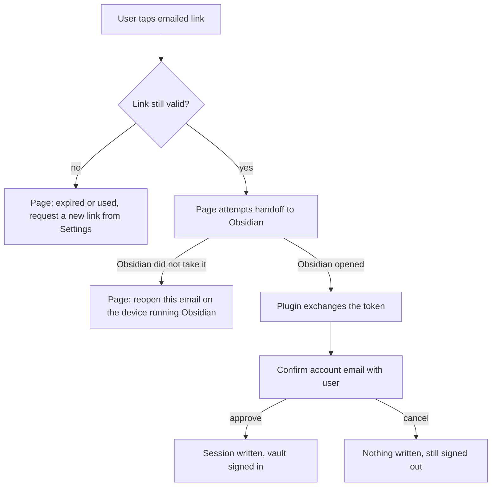

# Magic-link handoff to the plugin - Plan

## Goal Capsule

- **Objective:** the emailed sign-in link signs the plugin in on the device that opened it, with nothing typed and nothing copied.
- **Product authority:** this Product Contract, issue #240, and the `CLAUDE.md` non-negotiables it inherits (log safety; secrets never in `data.json`). Sign-out teardown (#284) and cloud-copy wipe (#285) are siblings from the same dogfood session and are not active scope here.
- **Open blockers:** none blocking planning. One blocks release: `obsidian://` firing from mobile mail clients and in-app browsers is unverified on both iOS and Android, and the gate is a real-device test (see Outstanding Questions).

---

## Product Contract

### Summary

The emailed sign-in link stops handing the user a token to copy.
Its landing page hands the magic token to an `obsidian://` deep link, the plugin exchanges it for a session, confirms the account with the user, and signs in.
Same device, no typing.

### Problem Frame

On 2026-08-04 the user tapped **Send sign-in link** in Settings, opened the email on the phone, and read: "Signed in ... Switch back to Obsidian → Settings → Atoms Plus → Refresh status."

**Refresh status** did nothing. It refreshes an *existing* local session, and this device had none — the button is a no-op by construction on exactly the device the sign-in link exists to serve.

The session the link minted only ever existed as text in the browser, inside a collapsed "Advanced: session token" block. The one working path was reading an opaque `sess_…` string off a web page and pasting it into Settings on a phone. #240 exists to delete that path.

### Key Decisions

- KD1. **Same-device handoff only.** (session-settled: user-directed — chosen over supporting both device shapes on day one: the link opens in the phone browser and hands off to Obsidian on that same phone, which is the case the user actually hit.) Governs R1, R8.
- KD2. **When the handoff cannot reach Obsidian, the page sends the user back to the email on the right device.** (session-settled: user-directed — chosen over showing a typable code now: the code is deferred to #286.) Governs R8.
- KD3. **"Advanced: paste session" is deleted in this change.** (session-settled: user-directed — chosen over keeping it until the claim code ships: #240's stated goal is met in full and the ugly path dies with it.) Governs R10.
- KD4. **Exchange first, then always confirm the server-verified email before writing a session.** (session-settled: user-approved — chosen over a silent device-local gate that rejects unrequested links: a silent gate reproduces #240's own symptom, "I tapped it and nothing happened.") The device-local pending flag only shapes the confirmation copy. Governs R4, R5.
- KD5. **The deep link carries the magic token, never the session.** The magic token is single-use and short-lived, which keeps #240's out-of-scope line intact: nothing that stores a session token in a URL. Governs R2, R11.
- KD6. **Consumption moves from the landing page's page load to the plugin's exchange.** This retires the mail-prefetch burn as a byproduct rather than as separate work. Governs R6.
- KD7. **The link carries the requesting vault's identity.** Without it a multi-vault device can sign the wrong vault in, and the right vault still reads signed-out — indistinguishable from the bug being fixed. Cost: the vault name transits and sits beside the magic token for at most the token's life, then dies with it. Governs R3.
- KD8. **The landing page checks link validity without consuming it.** An expired link then fails on the web page rather than several taps deep inside Obsidian. Governs R7.

### Actors

- A1. **The user** — taps the link in a mail client on the device running Obsidian, and approves or cancels the account confirmation.
- A2. **The landing page** — the web page the emailed link opens; it decides whether a handoff is possible and what the user is told when it is not.
- A3. **The Plus service** — mints and validates the magic link, and issues the session in exchange for the token.
- A4. **The plugin, in one vault** — receives the handoff, exchanges the token, asks A1 to confirm, and stores the session.

### Requirements

**Handoff**

- R1. Tapping the emailed sign-in link on the device running Obsidian signs that Obsidian in, with no characters typed and no text copied.
- R2. The handoff to Obsidian carries the magic token; it never carries a session token.
- R3. The session lands in the vault that requested the link, on a device running more than one vault.

**Consent**

- R4. The user sees a confirmation naming the server-verified account email and approves it before any session is written; cancelling writes nothing and leaves the device signed out.
- R5. A link arriving on a device that did not request one still surfaces the confirmation, with copy stating the request did not originate here — never silently accepted, never silently dropped.

**Link lifecycle and dead ends**

- R6. A magic link is consumed exactly once, by the plugin's exchange; mail prefetches, security scanners, and repeat page loads leave it usable.
- R7. An expired or already-used link says so on the landing page and points the user at requesting a new one from Settings.
- R8. A link opened where the handoff cannot reach Obsidian explains what happened and tells the user to reopen the email on the device running Obsidian.
- R9. An expired token is rejected as expired whichever store backend serves it, so validity never depends on which store is deployed.

**Settings surface and safety**

- R10. "Advanced: paste session" is gone from Settings; requesting a sign-in link is the only sign-in-on-another-device path.
- R11. Nothing in this flow writes a session token into a URL, a log, or an error object.

### Key Flows

- F1. Same-device sign-in
  - **Trigger:** A1 taps the emailed link in a mail client on the phone running Obsidian.
  - **Actors:** A1, A2, A3, A4
  - **Steps:** A2 confirms the link is still valid without consuming it; A2 hands the magic token and the requesting vault's identity to Obsidian; A4 in that vault exchanges the token with A3; A4 shows A1 the server-verified email; A1 approves; A4 stores the session and Settings reads signed in.
  - **Covers:** R1, R2, R3, R4, R6
- F2. Handoff cannot reach Obsidian
  - **Trigger:** the link opens on a desktop browser, or on a phone without the plugin, and nothing takes the deep link.
  - **Actors:** A1, A2
  - **Steps:** A2 explains that the sign-in has to finish inside Obsidian and tells A1 to reopen this email on the device running Obsidian. The link stays unconsumed.
  - **Covers:** R6, R8
- F3. Dead link
  - **Trigger:** A1 opens a link that has expired or that a completed sign-in already consumed.
  - **Actors:** A1, A2, A3
  - **Steps:** A2 asks A3 whether the link is still usable, gets no, and tells A1 to request a new sign-in link from Settings. No handoff is attempted.
  - **Covers:** R7, R9

### Acceptance Examples

- AE1. Happy path on a real phone
  - **Covers R1, R3, R4.**
  - **Given** a phone running Obsidian on one vault, signed out of Plus, having just requested a sign-in link
  - **When** the user opens the email and taps the link
  - **Then** Obsidian comes forward, shows a confirmation naming the account email, and on approval Settings → Atoms Plus reads signed in — with nothing typed and nothing copied.
- AE2. Cancel at the confirmation
  - **Covers R4.**
  - **Given** the confirmation is on screen naming the account email
  - **When** the user cancels
  - **Then** no session is stored, Settings still reads signed out, and no error is presented as a failure.
- AE3. Expired link
  - **Covers R7.**
  - **Given** a link older than the magic token's lifetime
  - **When** the user opens it
  - **Then** the landing page says the link expired and tells the user to request a new one from Settings, and Obsidian is never opened.
- AE4. Desktop browser
  - **Covers R8.**
  - **Given** the user opens the email in a desktop browser on a machine where the handoff does not reach Obsidian
  - **When** the page loads
  - **Then** it explains the sign-in finishes inside Obsidian and tells the user to reopen this email on the device running Obsidian — not a dead end, and not a token to copy.
- AE5. Prefetched link
  - **Covers R6.**
  - **Given** a mail client or security scanner has already loaded the link's page once
  - **When** the human then taps the same link
  - **Then** the sign-in completes normally, because only the plugin's exchange consumes the token.
- AE6. Multi-vault device
  - **Covers R3.**
  - **Given** a device running two vaults and a link requested from vault B
  - **When** the user taps the link
  - **Then** vault B receives the session and reads signed in.
- AE7. Unrequested link
  - **Covers R5.**
  - **Given** a device that never requested a sign-in link
  - **When** a valid link is opened there
  - **Then** the confirmation still appears, its copy states the request did not originate on this device, and no session is written unless the user approves.

### Scope Boundaries

- **The typable cross-device claim code** — deferred to #286, explicitly ordered after this plan. Accepted consequence, knowingly: until it ships, a link opened on the wrong device has no recovery beyond requesting a new link from the right device.
- **Sign-out teardown of MCP grants and mirror device state** — issue #284.
- **"Wipe cloud copy" re-uploading the whole vault** — issue #285.
- **Any design that puts a session token in a URL** — ruled out by #240 itself.
- **Changing how sessions are stored, or how entitlement refresh works** — untouched by this change.

### Success Criteria

A real trial-account sign-in completed on a physical phone, from tapping the emailed link to Settings showing the signed-in state, with zero characters typed and zero text copied.

### Outstanding Questions

**Resolve before planning**

- None.

**Deferred to planning**

- Whether the confirmation should also appear when the device-local pending flag *is* set, or only harden its copy when the flag is absent. KD4 settles it as always-show; flag this as the item most likely to be revisited after real use.

**Risks**

- Whether `obsidian://` reliably fires from mobile mail clients and in-app browsers on both iOS and Android is unverified, and it is the single biggest risk to this design. The release gate is a real-device test, echoing #230 where an automated test proved the mechanism but not the live path.
- The store backends currently disagree on whether a magic token is deleted before or after its expiry is checked, so the same expired token behaves differently by backend (per R9).

### Sources / Research

Verified against the branch on 2026-08-05. Cited as context for planning, not as requirements.

- `GET /v1/auth/exchange` consumes the magic token and renders the session as raw text in a collapsed block — `plus-service/src/server.mjs:378-388`, `:127-164` (session printed at `:161`).
- `POST /v1/auth/exchange` already exists and returns session, email, status, and remaining — `plus-service/src/server.mjs:390-405`.
- The plugin-side client `exchangeMagicToken` exists with zero production callers — `src/platform/plusClient.ts:378`. Both ends are wired to nothing.
- The plugin registers no `obsidian://` protocol handler: `registerObsidianProtocolHandler` has zero matches in `src/`, `test/`, or `plus-service/`. This is net-new surface.
- Magic token TTL is 15 minutes — `plus-service/src/store/postgres.mjs:199-206`, `sqlite.mjs:180-186`.
- `exchangeMagic` deletes the token row *before* checking expiry in both real stores — `postgres.mjs:328-350`, `sqlite.mjs:290-296` — so any GET burns the link. `memory.mjs:210-218` checks expiry first, so the stores disagree.
- The Plus session persists in Obsidian `localStorage` under `atoms-plus-session`, never `data.json` — `src/platform/filingAuth.ts:42-47`, `:176`.
- Precedent for the deferred claim code: Ask MCP pairing codes are 8-character Crockford Base32 (no I, L, O, U), stored hashed, 10-minute TTL — `plus-service/src/store/askHelpers.mjs:14-26`.
- "Advanced: paste session" lives at `src/settings/settings.ts:552-614` and bypasses the Plus client entirely.

<!-- ce-section: work-relationships -->
### How This Work Fits Together

This plan owns one area: getting a browser-completed magic link into the plugin on the same device. The breakdown below is the current understanding, not a committed roadmap.

- Recovery path #230 did not fix
  - **Depends on** nothing from #230; #230 proved a real trial signup completes, this proves a signed-out device can rejoin one.
- Typable cross-device claim code (#286)
  - **Depends on** this plan's exchange and confirmation behavior; it is the direct successor, and it closes the recovery window this plan knowingly opens by deleting the paste field.
- #284 (sign-out teardown) and #285 (cloud-copy wipe)
  - **Can proceed independently of** this plan. Siblings from the same dogfood session, sharing no surface with it.
