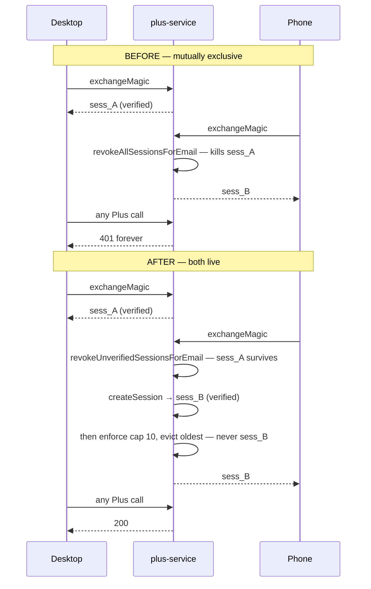
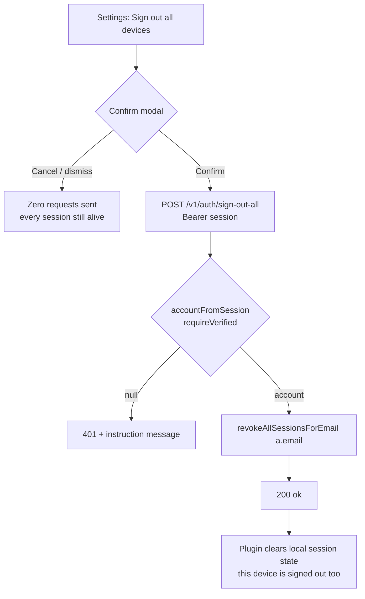

# feat: Multi-device sessions — narrow the exchange revoke, add "Sign out all devices"

## Summary

A paying customer cannot be signed in on desktop and phone at once. `exchangeMagic` revokes **every** session for the email — verified ones included — immediately before minting, so each sign-in evicts the other device, permanently.

The fix is three lines. The plan is not, because revoke-all was silently carrying a second job: it was the only account-recovery path in the product. Narrowing it without a replacement leaves a 60-day window in which a stolen-but-valid session cannot be evicted by any means. So this change lands in one PR as two halves — narrow the revoke, and give the user an explicit **Sign out all devices** control that re-earns the property.

A soft cap of 10 verified sessions with oldest-evicted bounds the accumulation that 60-day sessions plus unlimited devices would otherwise create.

---

## Problem Frame

`exchangeMagic` calls `revokeAllSessionsForEmail(row.email)` right before `createSession(..., { verified: true })`, in all three stores (`plus-service/src/store/memory.mjs:276`, `sqlite.mjs:410`, `postgres.mjs:474`). That helper revokes every row for the email regardless of `verified` (`memory.mjs:167`).

It landed with `2c9c611` as part of the C1 session-fixation fix. #240's doc review found the multi-device consequence independently (finding F3, three reviewers) and resolved it by **disclosing** it in the sign-in confirmation copy rather than changing it. That answered "is the user surprised?"; it did not answer "should a paid product work this way?"

**What revoke-all was actually providing.** Two properties, not one:

1. Session fixation defence (C1) — an unverified soft session must not survive a privilege upgrade. This is what the narrower sibling `revokeUnverifiedSessionsForEmail` (`memory.mjs:174`) already does, and it is what `grantPeriod` already uses (`memory.mjs:110`).
2. **Account recovery** — magic-link sign-in doubled as "boot everyone else". Nothing else in the product does this. `POST /v1/auth/sign-out` (`plus-service/src/server.mjs:586-591`) is per-device only; it calls `revokeSession` on the caller's own bearer token.

Property 1 survives the narrowing. Property 2 does not, and `config.sessionTtlDays` defaults to **60** (`plus-service/src/config.mjs:157`), so the exposure is not academic.

**A second class of verified session, which the first draft of this plan missed.** `verified: true` does not only mean "proved email ownership". `POST /v1/billing/checkout` resolves its caller with `accountFromSession(session)` and **no** `requireVerified` (`plus-service/src/server.mjs:854-857`) — soft sessions are deliberately allowed so Stripe-first onboarding works. `promoteCheckoutSession` and `markSessionVerified` then set `verified = true; revoked = false` on that row (`plus-service/src/store/memory.mjs:203-226`). So a session can be `verified` on the strength of a **payment**, not an email.

Today the broad revoke reaps that class on the owner's next sign-in. After the narrowing it survives the full 60-day TTL. This is a real consequence and it is accepted deliberately — see KTD8 — but it raises the stakes on the recovery control being genuinely complete, which is what R10 is for.

**Prototype evidence already gathered** (do not re-derive):

| Check | Result |
|---|---|
| `plus-service` suite before the swap | 476/476 pass |
| After the swap | 476/476 pass |
| C1 passes for the right reason | Its prior session is built with `startWithEmail`, which is unverified (`plus-service/test/security-auth-criticals.test.mjs:59-81`) |
| C1 is able to fail | Deleting the revoke entirely turns exactly C1 red — the line is genuinely covered |
| Multi-device works | Two exchanges leave two live verified sessions; both can file |
| The probe is able to fail | Restoring `revokeAll`, the desktop session dies on phone sign-in |

The three-line swap is **already applied and uncommitted** on `feat/320-multi-device-sessions`. Fold it into U1 rather than rewriting it.

---

## Goal Capsule

A customer who pays for Atoms Plus can sign in on desktop and phone and stay signed in on both. If they ever need to evict a device they no longer control, Settings gives them one explicit, confirmed action that signs out everything — including the device they are holding — and they sign back in with a fresh link.

---

## Requirements

| ID | Requirement |
|---|---|
| **R1** | Signing in on a second device must not revoke a live **verified** session on another device. |
| **R2** | Signing in must still revoke every **unverified** session for that email (C1 session-fixation defence preserved). |
| **R3** | An authenticated user can sign out **all** devices for their account in one action from Settings. |
| **R4** | "Sign out all devices" revokes **every** session including the calling device's own; the calling device lands signed-out and must use a new magic link. |
| **R5** | The destructive action is confirmed before anything is sent. Cancelling issues **zero** network requests and leaves every session alive. |
| **R6** | A user's live verified sessions are bounded at **10 at magic-link exchange time**; minting an 11th evicts the oldest rather than refusing the sign-in. This is a soft ceiling on device accumulation, not a global invariant — see KTD3. |
| **R7** | The sign-in confirmation copy must stop promising that signing in signs out other devices — that promise becomes false. |
| **R8** | The new route rejects an unauthenticated or unverified caller rather than silently answering `200`. |
| **R9** | The new route is rate-limited per authenticated account, answering `429` with `retryAfterSec` rather than presenting an unbounded call surface. |
| **R10** | "Sign out all devices" is **durable and complete**: it also revokes the account's MCP grants and clears its checkout bindings, so no in-flight webhook or connected app can silently undo it. |

---

## Key Technical Decisions

### KTD1 — Both halves land in one PR *(session-settled: user-directed — chosen over shipping the revoke narrowing alone: part 1 by itself removes the only recovery path for 60 days)*

Governs R1, R3, R4. Narrowing the revoke is a 3-line change that could ship today. It will not, because the repo's blast-radius rule forbids landing a change without its gate, and here the gate is a user-visible control that does not exist yet.

A second, concrete reason surfaced in research: **after U1, `revokeAllSessionsForEmail` has zero production callers.** Its only remaining references are the three factory exports and one test-setup line (`plus-service/test/trial-checkout-session.test.mjs:89`). Part 2's route is what re-earns the export. Shipping part 1 alone leaves a dead export next to a live hazard.

### KTD2 — "Sign out all devices" signs out the caller too *(session-settled: user-directed — chosen over "keep this device signed in": one code path, no carve-out, and a genuinely clean slate)*

Governs R4. The alternative — revoke-others, keep-current, as Google and GitHub do — was considered and rejected. Consequences to honor in implementation:

- The route body is exactly `revokeAllSessionsForEmail(a.email)`; no exclusion of the caller's own token hash, so no second code path and no "which session am I" bookkeeping.
- The plugin **must** clear local session state after a `200`, because its own token is now dead. Reusing the existing local teardown (`clearPlusSession` + `clearPlusRefreshRecord` + `redisplay`) is required, not optional — skipping it leaves the vault reading "signed in" while every Plus call 401s, which is the exact #240 failure shape.
- The confirm copy must say the current device signs out too. A user who expects to stay signed in and does not is a support ticket.

### KTD3 — Soft cap of 10 verified sessions, oldest evicted at exchange time *(session-settled: user-directed — chosen over no cap and over a hard cap that rejects the sign-in)*

Governs R6. A hard cap was rejected because it turns a routine sign-in into a dead-end error — the exact failure shape #240 just spent a release fixing, and `docs/solutions/logic-errors/security-fix-repair-wired-into-only-one-branch.md` states the rule directly: a dead session must never be a dead end.

The cap is enforced **at exchange time, after minting**, not inside `createSession`. `createSession` also mints unverified soft sessions and checkout sessions; exchange is where device accumulation actually happens. The just-minted session is never the eviction victim.

**The bound is therefore soft, and R6 is worded to match.** `markSessionVerified` and `promoteCheckoutSession` (`plus-service/src/store/memory.mjs:203-225`) flip an *existing* row to `verified = true; revoked = false` without passing through exchange, so they can raise the live verified count above the cap — and can even resurrect a row the cap previously evicted. That is accepted: the cap exists to stop unbounded accumulation across a 60-day TTL, not to hold a hard invariant, and an adversarial pass asserting "never more than 10" literally would find counterexamples by design. Stated here so it reads as a decision rather than a hole.

### KTD4 — Order by `exp_ms` rather than adding a `created_ms` column

Governs R6. The `sessions` table has no creation timestamp — `token_hash`, `email`, `exp_ms`, `revoked`, `verified` in both SQL stores (`plus-service/src/store/sqlite.mjs:48-54`, `postgres.mjs:48-54`). Since `exp = now + sessionTtlMs()` with a constant TTL, ordering by `exp_ms` ascending **is** creation order.

The caveat, which must be a code comment and not just a plan line: if an operator changes `ATOMS_PLUS_SESSION_TTL_DAYS` between mints, sessions minted under different TTLs sort wrongly relative to each other. The blast radius is that a slightly-wrong session gets evicted at the cap boundary — bounded and non-destructive to data. That is cheaper than a schema migration across two SQL stores for a tie-break that only matters at the 11th device.

*Alternative considered:* add `created_ms` to both schemas. Correct under any TTL change, but it is a migration on a live production table for a cosmetic ordering improvement.

### KTD5 — The new route 401s, diverging from its permissive sibling

Governs R8. `POST /v1/auth/sign-out` deliberately never 401s: it feature-detects the store method and always answers `200 {ok:true}`, because per-device sign-out is idempotent and non-enumerating. `POST /v1/auth/sign-out-all` is account-wide and destructive, so it authenticates like `POST /v1/promo` (`server.mjs:832-852`): `accountFromSession(bearer(req), { requireVerified: true })`, 401 with an instruction-shaped message on miss.

The two siblings will read as inconsistent to a reviewer. Carry a comment at the route explaining why the asymmetry is deliberate.

### KTD6 — Rate limit on the authenticated email, not the IP

Governs R9. Use exactly one limiter, keyed on the authenticated account and nothing else: `checkRateLimit(\`signout_all:${a.email}\`)` at the default `config.rateLimitPerMinute`, after `accountFromSession` resolves.

This deliberately drops **both** keys the checkout block uses (`server.mjs:861-876`) — do not copy that block. Its IP key is forgeable in both directions, so nothing may depend on it for correctness, and the `hits` Map never evicts, so an IP-keyed prefix adds unbounded attacker-controlled keys (the open sibling issue #240 already made worse by adding four prefixes). Its second key is suffixed with the session token, which makes key count grow *per session* rather than per account — defeating the only property worth having here. One key per account is bounded by the user count.

**What this limiter actually bounds, which is not repeat calls.** Because KTD2 revokes the caller's own session, a given session can reach this route exactly once: the first call succeeds, and every later call with that bearer 401s at `accountFromSession` before the limiter is consulted. So the limit bounds *session farming* — an attacker holding many valid sessions for one email — not a repeat-call loop. Anyone writing or reading the test needs that stated, or they will write a test that cannot reach 429.

Do **not** add a fifth entry to `MAGIC_LINK_RATE_LIMITS` — that table is documented as the unauthenticated magic-token surfaces only.

### KTD7 — The sign-in disclosure is repurposed, not deleted

Governs R7. `signInConfirmCopy` currently returns a `disclosure` string promising the other-device sign-out (`src/settings/plusSignInConfirmModal.ts:37-52`), and the `SignInConfirmCopy` type documents `disclosure` as also present in `lines`, with that identity asserted in `test/plusSignInConfirmModal.test.ts`.

Rather than drop the field and unpick the identity assertion, replace the string with one that is true under the new behavior and points at the new control — the shape being: other devices stay signed in, and Settings has a "Sign out all devices" action. The ordering test (disclosure before buttons) and the identity assertion both survive; only the regex at `test/plusSignInConfirmModal.test.ts:55` changes.

### KTD8 — Payment-promoted sessions are deliberately **not** carved out of the narrowing

Governs R1. The security review raised the class described in the Problem Frame: sessions made `verified` by `promoteCheckoutSession` / `markSessionVerified` rather than by a magic link. The obvious hardening — have `exchangeMagic` keep reaping *those* — is **rejected**, because it reintroduces the exact bug this plan exists to fix.

Trace it: a user pays on desktop, so their desktop session is payment-promoted. They then sign in on their phone. Under the proposed carve-out, the phone's exchange reaps the desktop session — which is #320, verbatim, on the single most common paying-user path. The carve-out would break the majority case to harden a minority one.

So the class is accepted, and the mitigation is the recovery control being complete (R10) rather than the revoke being clever. What this decision **requires** in exchange:

- U1 carries an explicit test pinning the accepted behavior, so a future reader sees it was decided rather than overlooked.
- R10's binding-clear is not optional — without it, a 24-hour checkout binding (`CHECKOUT_BINDING_TTL_MS`, `plus-service/src/store/shared.mjs`) lets a late or retried webhook un-revoke a session the user explicitly evicted, and after U1 no later sign-in will reap it again.

*Alternative considered:* a `verified_via` column distinguishing email-verified from payment-verified rows, letting the revoke be selective. That is the principled fix, but it is a schema migration on two live SQL stores plus a semantic change to three promote paths, and it buys nothing the complete recovery control does not already cover. Revisit only if payment-promoted sessions turn out to be a real abuse vector in practice.

---

## High-Level Technical Design

Sign-in on a second device, before and after:

Recovery path that replaces what revoke-all was doing:

---

## Implementation Units

### U1. Narrow the exchange revoke

**Goal:** A verified session on another device survives a new sign-in; unverified sessions still die.

**Requirements:** R1, R2

**Dependencies:** none

**Files:**
- `plus-service/src/store/memory.mjs` (line 276)
- `plus-service/src/store/sqlite.mjs` (line 410)
- `plus-service/src/store/postgres.mjs` (line 474)
- `plus-service/test/security-auth-criticals.test.mjs`

**Approach:**

1. The swap is already applied and uncommitted on this branch — `revokeAllSessionsForEmail(...)` → `revokeUnverifiedSessionsForEmail(...)` inside `exchangeMagic`, one line per store. Keep it; do not rewrite it. To honor the Execution note below, stash it (or revert the three lines in place) long enough to watch the new test fail, then restore and commit — the point is to see the red, not to re-author the fix.
2. Add a comment at each call site naming the property being preserved (C1, unverified-only) so a future reader does not "restore" the broad revoke.
3. Add the regression test that does not exist today: a **verified** session must survive an exchange. This is the exact property #320 changes and no current test covers it.

**Patterns to follow:** `runStoreSuite` parameterization at `plus-service/test/security-auth-criticals.test.mjs:636-641` — the new test goes inside the suite so it runs on all three store arms.

**Execution note:** Write the surviving-verified-session test first and watch it fail against `revokeAll` before committing the swap. The prototype proved this by hand; the suite should prove it permanently.

**Test scenarios:**
- Covers R1. Two magic exchanges for the same email produce two distinct sessions, and the first is still resolvable via `accountFromSession(..., { requireVerified: true })` after the second exchange.
- Covers R1. Both sessions can `tryConsumeFiling` with distinct idempotency keys after the second exchange.
- Covers R2. A session created with `startWithEmail` (unverified) is dead after an exchange for that email — this is the existing C1 assertion; confirm it still passes for the unverified reason, not incidentally.
- Covers R2. A session for a *different* email is untouched by the exchange.
- Covers KTD8. A session promoted by `promoteCheckoutSession` (payment-verified, not email-verified) **survives** a later `exchangeMagic` for that email. Name the test for the decision, not the mechanism — it exists so a future reader sees an accepted consequence rather than an oversight.
- Mutation check: removing the revoke call entirely turns the C1 test red, and restoring `revokeAllSessionsForEmail` turns the new surviving-session test red. Both directions must be demonstrated, per `docs/solutions/architecture-patterns/a-test-harness-that-cannot-fail-reports-coverage-that-never-ran.md`.

**Verification:** `npm test` in `plus-service` is green with both new assertions present, and each new test has been shown to fail against the opposite implementation.

---

### U2. Bound verified sessions at 10, evicting oldest

**Goal:** A user accumulating sign-ins over a 60-day TTL never holds more than 10 live verified sessions.

**Requirements:** R6

**Dependencies:** U1

**Files:**
- `plus-service/src/store/memory.mjs`
- `plus-service/src/store/sqlite.mjs`
- `plus-service/src/store/postgres.mjs`
- `plus-service/src/config.mjs`
- `plus-service/test/security-auth-criticals.test.mjs`

**Approach:**

1. Add a config value for the cap alongside `sessionTtlDays` (`config.mjs:156-158`): `ATOMS_PLUS_MAX_SESSIONS`, defaulting to 10. **Clamp it to a floor of 1** — the `config` getters do no numeric validation, so a blank or non-numeric override yields `NaN`, and a value of `0` would make the freshly minted session its own eviction victim, contradicting KTD3's stated invariant.
2. Add one store method per backend — the same name in all three — that revokes the oldest live verified sessions for an email beyond the cap. **The ordering field differs by backend:** order by `row.exp` ascending in `memory.mjs` (its session rows are `{ email, exp, revoked, verified }` — there is no `exp_ms` field) and by `exp_ms` ascending in `sqlite.mjs` / `postgres.mjs`. Getting this wrong is a fake-green: a comparator written as `a.exp_ms - b.exp_ms` against the memory store yields `NaN`, which sorts as 0, leaving Map insertion order — which happens to equal creation order today, so the cap test passes against code that never read a timestamp. It must consider only rows that are `verified`, not `revoked`, and not expired.
3. Call it from `exchangeMagic` immediately **after** `createSession`, so the freshly minted session is inside the cap and can never be its own victim.
4. Carry the KTD4 TTL-change caveat as a comment at the ordering site, not only in this plan.
5. Log one structured line at the eviction site — email fingerprint and the count evicted, **never** a raw email or token, per the repo's redact-to-fingerprints log-safety rule. A cap eviction silently kills a live device; without this, the user's "why did my desktop sign out?" is unanswerable and indistinguishable from a compromise.
6. Add a session test seam — `writeSessionRowForTest` plus a `sessionRowsForTest` read — in all three stores, mirroring the existing magic-token seam (`plus-service/src/store/memory.mjs:304-320`, `sqlite.mjs:242-262`). Without it the expired-row test scenario below **cannot be written**: every path sets `exp = Date.now() + sessionTtlMs()` and no backend exposes a way to plant a row with an arbitrary expiry. The only alternative is overriding the TTL mid-test, which is precisely the TTL change KTD4 says corrupts the ordering this method depends on. Extend the source-scanning parity test to cover both new methods alongside the cap method — and check whether the sibling scan at `plus-service/test/stripe-incidents.test.mjs:249-284` also needs them, since two parity scanners exist and only one is the obvious one.

**Patterns to follow:** the three-store method symmetry, and the source-scanning parity test at `plus-service/test/security-auth-criticals.test.mjs:758-798` which greps all three store files for a method's `function X(` and `X,` export — extend it to cover the new method so a backend cannot silently omit it.

**Test scenarios:**
- Covers R6. Minting 10 verified sessions leaves all 10 live.
- Covers R6. The 11th exchange leaves exactly 10 live and the oldest one revoked; the newly minted session is live.
- Covers R6. Eviction never touches a *different* email's sessions.
- Eviction skips already-revoked and already-expired rows when counting, so a user with 9 live and 5 expired sessions is not evicted at all.
- The sign-in itself always succeeds at the cap boundary — no error path, no refusal (this is the KTD3 anti-dead-end property).
- Parity: the new store method exists and is exported in all three backends (extend the source-scanning test).

**Verification:** the memory and sqlite arms are green locally; the postgres arm is exercised in CI only (see Risks).

---

### U3. `POST /v1/auth/sign-out-all`

**Goal:** An authenticated, verified caller can revoke every session on their account.

**Requirements:** R3, R4, R8, R9, R10

**Dependencies:** U1

**Files:**
- `plus-service/src/server.mjs` (insert at ~line 593, directly after the `/v1/auth/sign-out` block)
- `plus-service/src/store/memory.mjs`, `sqlite.mjs`, `postgres.mjs` (checkout-binding clear)
- `plus-service/test/http-auth-sign-out-all.test.mjs` (new)
- `plus-service/test/security-auth-criticals.test.mjs` (store-level durability cases)

**Approach:**

1. New route block immediately after the existing sign-out handler, keeping the two auth-lifecycle POSTs adjacent. Matching is `===`, not `startsWith`, so there is no prefix collision with `/v1/auth/sign-out`.
2. Resolve the caller with `accountFromSession(bearer(req), { requireVerified: true })`; on `null`, 401 with an instruction-shaped message in the house style (`{ message }`), following `POST /v1/promo` at `server.mjs:832-852`.
3. Rate limit with the single account-keyed limiter named in KTD6 — `checkRateLimit(\`signout_all:${a.email}\`)` — after auth resolves. Do not copy the checkout block's two keys.
4. Revoke in three parts, because "sign out everything" has to mean it (R10):
   - `store.revokeAllSessionsForEmail(a.email)` — the sessions themselves.
   - `store.mcpRevokeForEmail(a.email)`, feature-detected the way `server.mjs` guards other optional store methods. MCP clients authenticate off `mcpAccess` / `mcpRefresh` (30-day refresh), not the `sessions` table, so without this a user evicting a device they no longer control leaves that device's connected apps holding account access. The repo already treats this as one account-wide kill switch — `mcpRevokeForEmail` is called on both `revokeSubscription` and `mirrorWipe` (`plus-service/src/store/memory.mjs:1129`, `:519`) — so omitting it here would be the inconsistency, not including it.
   - **Clear the account's checkout bindings.** New store method, symmetric across all three backends. Without it the revoke is not durable: `promoteCheckoutSession` sets `revoked = false` with no check on *why* a row was revoked, and a binding lives 24 hours, so a webhook that lands or is retried after the user evicts everything resurrects exactly one session and marks it verified — and after U1 no later sign-in reaps it. That turns the plan's whole recovery story into something a late webhook can silently undo.
5. Answer `200 { ok: true }` with `NO_STORE` headers (`server.mjs:141`).
6. Comment the deliberate 401 asymmetry against the permissive sibling (KTD5).
7. Log one structured success line — email fingerprint, count of sessions revoked, route — and **no** bearer token and no raw email, per the repo's log-safety rule. The caller's token is in scope at exactly the place an implementer would reach for it.

**Patterns to follow:** `json(res, status, body, extraHeaders)` at `server.mjs:65-74`; the `{ message }` error-body convention throughout. For the test harness, copy `plus-service/test/http-auth-peek.test.mjs:13-40` — the server is created and `listen()`ed at module scope with no export (`server.mjs:1135-1143`), so the only way to exercise a route is to spawn it as a child process on a random port against a temp sqlite file and then re-open that same file with `createSqliteStore(dbPath)`. That shared-file trick is the only way this unit's "assert store state directly" requirement can be met from the test process.

**Test scenarios:**
- Covers R3, R4. Mint two verified sessions for one email; call the route with the first; both are dead afterwards, including the caller's own.
- Covers R8. No `Authorization` header → 401, and no sessions are revoked.
- Covers R8. A garbage or already-revoked bearer → 401, and no sessions are revoked.
- Covers R8. An **unverified** (soft-start) session → 401, and no sessions are revoked. This is the case the permissive sibling would have answered `200` to.
- A second call with the now-dead session → 401 (not a 500).
- Sessions belonging to a different email are untouched.
- Covers R9. **Seed** N+1 live verified sessions for one email directly into the spawned server's sqlite file (`store.createSession(email, { verified: true })`), then call the route once per session: the calls past the limit answer 429 with `retryAfterSec`. Do **not** try to loop one bearer — it 401s after its first success (KTD6), and the HTTP mint/exchange path has its own 30/min ceiling, so neither route reaches the limiter.
- Covers R10. An MCP access token for that email stops resolving after the call.
- Covers R10, and this is the important one: bind a checkout, call sign-out-all, then run `promoteCheckoutSession` — it must return false and no session may come back to life. This is the test that proves the recovery action is durable rather than advisory.

**Verification:** the new HTTP test passes; store state is asserted directly, not inferred from the response body. The route test is a single-store HTTP test (sqlite, per the `http-auth-peek.test.mjs` model); the store-level durability cases go inside `runStoreSuite` so they cover all three arms.

---

### U4. `signOutAllDevices` client helper

**Goal:** The plugin can call the new route through the existing Plus client seam.

**Requirements:** R3

**Dependencies:** U3

**Files:**
- `src/platform/plusClient.ts`
- `test/plusClient.test.ts`

**Approach:** Add a helper modelled exactly on `signOutPlus` (`src/platform/plusClient.ts:738-753`): `plusRequest({ path, method: "POST", sessionToken, body: {} })`, then the two-stage check — `if (!res.ok) return res;` then the non-2xx `mapError(res.status, res.json)` branch — then `{ ok: true }`. Do not set headers directly; `plusRequest` attaches the bearer at `plusClient.ts:185-187`. Do not convert this to `requestUrl`; the `fetch`-backed `plusFetchRequest` is a deliberate documented exception (`plusClient.ts:4-6`).

**Test scenarios:**
- Covers R3. A 200 response yields `{ ok: true }`, and the request went to the right path with `POST` and a bearer header carrying the session token.
- A 401 yields `code: "auth"` and the shared session-rejected message via `mapError`.
- A non-JSON / bodyless refusal yields `code: "upstream"`.
- A thrown network error yields `code: "network"` rather than propagating.
- No raw session token appears in any returned message (the `redact` path at `plusClient.ts:143-151`).

**Verification:** `test/plusClient.test.ts` green using the local `mockRequest` injection pattern at `test/plusClient.test.ts:21-34`; no real network.

---

### U5. Settings control and confirm modal

**Goal:** A signed-in user can find and safely invoke "Sign out all devices".

**Requirements:** R3, R4, R5

**Dependencies:** U4

**Files:**
- `src/settings/settings.ts`
- `src/settings/plusSignOutAllConfirmModal.ts` (new)
- `test/plusSignOutAllConfirmModal.test.ts` (new)
- `test/settings.test.ts`

**Approach:**

1. New modal file following the **`plusSignInConfirmModal.ts` shape** — exported class plus an exported pure copy function, an `answered` latch, verdict-by-callback, safe option first, destructive second wrapped in `markDestructive`, and `onClose()` answering `"dismissed"`. That shape is the only confirm pattern in the repo with direct unit tests; the copy-function split exists because vitest renders the `Modal` stub into nothing.
2. Add the control in `renderPlusSection`'s **active** branch, as its own `Setting` row between the end of the "Manage" row (`settings.ts:455`) and the trailing paragraph (`settings.ts:456`). No row in this file carries three buttons, so it gets its own row rather than joining "Manage".
3. Add the same row to the **exhausted** branch (`settings.ts:379-389`), which also holds a verified session — an expired plan is exactly when someone may need to evict a device (Q1, resolved). The soft/inactive and signed-out branches do **not** get it: there is no verified session to authenticate the call. Extract the row construction once and call it from both branches rather than duplicating it; `renderPlusSection`'s four branches each `return` early, so a shared local helper is the only way to avoid a second copy drifting.
4. Use `markDestructive` from `src/settings/destructiveButton.ts:16`. Never call `setWarning()` or `setDestructive()` directly — the latter is 1.13+ against a `minAppVersion` of 1.11.4 and previously blanked the whole settings tab.
5. On confirm: call `signOutAllDevices`, then on success run the same local teardown the existing server-backed sign-out uses (`clearPlusSession`, `clearPlusRefreshRecord`, `Notice`, `this.redisplay()` — `settings.ts:439-455`). On failure surface the refusal; the sign-in precedent argues for a modal rather than a toast for a terminal failure.
6. Copy must state that **this device signs out too** (KTD2), and that **connected apps are disconnected** — U3 revokes MCP grants as part of the same action (R10), so a user who is not told will be surprised when their MCP client stops working.

**Patterns to follow:** `AskMirrorDeleteConfirmModal` (`settings.ts:1508-1568`) for the latch semantics; `PlusSignInConfirmModal` for the tested shape. Do **not** extract a shared base class in this PR — the handoff records that unification as deliberately deferred because `AskMirrorDeleteConfirmModal` has no direct latch test, and unifying an untested consent surface is exactly what the blast-radius rule forbids.

**Execution note:** Test the cancel path before the confirm path. The whole point of the modal is the branch that does nothing.

**Test scenarios:**
- Covers R5. Cancel issues **zero** network calls — assert on a call counter, not on absence of side effects.
- Covers R5. Dismissing the modal (`onClose()` without choosing) records `"dismissed"` and issues zero network calls.
- Covers R5. The latch holds: answering twice invokes the verdict callback once.
- Covers R3, R4. Confirm calls `signOutAllDevices` exactly once with the current session token, and on success clears local Plus session state so the tab re-renders signed-out.
- Covers R4. The copy states that the current device is signed out too.
- Safe option is rendered first (button order assertion, mirroring `test/plusSignInConfirmModal.test.ts:70-77`).
- A failed call leaves local session state **intact** — a server refusal must not fake a local sign-out.
- The row renders in the **active** branch; add the missing active-branch settings-test helper (`resolveFilingAuth` returning `mode: "plus", status: "active"` plus a seeded Plus session in fake local storage) — no existing test covers this branch.
- Covers Q1. The row also renders in the **exhausted** branch (`status: "exhausted"`), and both branches render the identical row — assert on the shared helper's output, so a future edit to one branch cannot silently diverge.
- The row does **not** render in the soft/inactive or signed-out branches, where no verified session exists to authenticate the call.
- Mutation check: deleting the `verdict !== "confirmed"` gate must turn exactly the cancel and dismiss tests red, per `docs/solutions/architecture-patterns/ask-before-you-spend-when-the-server-revokes-first.md`.

**Verification:** `npm test` at repo root green; the cancel-path assertion demonstrated to fail with the consent gate removed.

---

### U6. Correct the now-false sign-in disclosure

**Goal:** The sign-in confirmation stops promising something the product no longer does.

**Requirements:** R7

**Dependencies:** U1, U5 — the new copy points at the Settings control, so U5 must exist for the reference to be true and for U6's copy assertion to have a counterpart.

**Files:**
- `src/settings/plusSignInConfirmModal.ts`
- `test/plusSignInConfirmModal.test.ts`
- `docs/plans/2026-08-05-240-feat-magic-link-plugin-handoff-plan.md`

**Approach:**

1. Replace the `disclosure` string (`plusSignInConfirmModal.ts:41`) with one true under the new behavior: other devices stay signed in, and Settings carries a "Sign out all devices" action. Keep the field and its identity with a line in `lines` (KTD7).
2. Rewrite the file docstring (`plusSignInConfirmModal.ts:1-11`). Its stated rationale — cancel-is-safe-and-first *because* `exchangeMagic` revokes other sessions before minting — is no longer the reason. Cancel-first still holds because exchange **spends** a single-use token, so the ordering survives with a corrected justification.
3. Update the regex at `test/plusSignInConfirmModal.test.ts:55`; keep the disclosure-before-buttons ordering assertions at `:57-67`.
4. Add a supersession note to the #240 plan where **#240's R4** specifies the disclosure and **#240's KD4** rationale references the revoke. (Those are the #240 plan's own IDs, not this plan's — this plan's R4 is the caller-signs-out-too requirement.) Do not silently contradict a shipped plan doc — mark it superseded by #320 with a pointer.

**Test scenarios:**
- Covers R7. The disclosure no longer claims other devices are signed out.
- Covers R7. The disclosure mentions the Settings control, so the user learns the recovery path at the moment the old promise used to appear.
- The `disclosure` string is still present in `lines` (identity assertion preserved).
- Disclosure still renders before the buttons.

**Verification:** `npm test` at repo root green; the #240 plan doc carries a visible supersession marker.

---

### U7. Version bump

**Goal:** Desktop and phone builds are identifiable after a user-visible change.

**Requirements:** none — release hygiene per `CLAUDE.md` § Versioning

**Dependencies:** U2, U5, U6

**Files:** `manifest.json`, `package.json`, `versions.json`

**Approach:** Bump all three by hand from `0.6.78-beta.1` to the next beta. `npm version` only updates manifest + versions (`package.json:11`); package.json is npm's own job, so a manual edit must touch all three. The tag must equal the package/manifest version or CI fails.

**Test expectation: none — version metadata only, no behavioral change.**

**Verification:** the three files agree, and Settings renders the new version (`settings.ts:143-148`).

---

## Scope Boundaries

**In scope:** the revoke narrowing, the session cap, the server route (including the MCP-grant revoke and checkout-binding clear that make it durable), the client helper, the Settings control and its modal, the sign-in copy correction, the version bump.

### Deferred to Follow-Up Work

- **A shared confirm-modal base class.** `PlusSignInConfirmModal` and `AskMirrorDeleteConfirmModal` carry a byte-identical consent latch, and this PR adds a third copy. Unification is correct eventually but forbidden here: the pre-existing modal has no direct latch test, and the repo's blast-radius rule requires unifying a consent surface *with* its gate or not at all. This PR makes the case stronger, not weaker.
- **Reconciling the three inconsistent "Sign out" controls.** `settings.ts:382` and `:489` are local-only; `:439` calls the server. Adding a fourth control does not fix that, and folding it in would widen a security-adjacent PR.
- **The rate limiter's unbounded `hits` Map.** Pre-existing on master; KTD6 deliberately avoids making it worse rather than fixing it here.
- **A "sign out one device" / session list UI.** Out of scope; the cap plus all-devices covers the recovery need.

### Not doing

- Adding a `created_ms` column to `sessions` (KTD4).
- Reversing the `fetch`-vs-`requestUrl` exception in `plusClient.ts`.

---

## Open Questions

| # | Question | Status |
|---|---|---|
| ~~Q1~~ | Does the **exhausted** branch (`settings.ts:379-389`) also get the "Sign out all devices" row? | **Resolved: yes.** An expired plan is exactly when someone might want to evict a device, and that branch holds a valid session token. Both the `active` and `exhausted` branches get the row; the soft/inactive and signed-out branches do not (no verified session to authenticate with). |
| Q2 | Does the confirm modal need a typed-confirmation (type the email) rather than a two-button consent? | Recommendation: no. The action is recoverable by requesting a new link; a latch plus destructive styling matches the repo's existing bar for irreversible-ish actions. |
| Q3 | After sign-out-all, the up-to-nine **non-calling** devices are remotely revoked. KTD2 only mandates local teardown on the calling device. Do the others detect and surface it? | **Largely answered during review:** `refreshPlusEntitlementRecord` already maps a `code: "auth"` refusal to a `rejected` record with a sign-in surface (`src/platform/plusRefresh.ts:97-110`), so a remotely-revoked device is **not** left in the #240 dead-end shape. No new work in this PR. Verification Contract item 6 still observes it live rather than trusting the code read. |
| Q4 | Should the 10-session cap be disclosed in user-facing copy? R6 and KTD3 make it silent, and no unit gives the user a signal when their oldest device is evicted. | Recommendation: silent for now; the U2 log line makes it diagnosable. Revisit if anyone actually hits it — at 10 devices the eviction is far more likely to be noise than surprise. |

---

## Risks & Dependencies

**The postgres arm is CI-verified only.** `postgresStoreRows()` (`plus-service/test/helpers/postgresTestStore.mjs:177-187`) keys off **`TEST_DATABASE_URL`** — not `DATABASE_URL` — and returns `[]` silently when it is unset locally, while **throwing** when `CI` is set. There is no docker or local `pg` on this machine, so the postgres store changes in U1 and U2 are proven by `.github/workflows/plus-service-tests.yml` and nowhere else. Do not claim local coverage for that arm. CI also enforces a floor of 6 test files emitting the `postgres-active` marker — do not drop a suite below it.

**The root vitest suite does not run on PRs.** Only `plus-service-tests.yml` runs on `pull_request`, scoped to `working-directory: plus-service`. The root suite — which is where U4, U5, U6 are actually tested — runs only on a version tag via `release.yml`. A broken root test is green on every PR and blocks only at release. Run the root suite locally before tagging.

**Deploy must precede the plugin release.** A plugin build calling `/v1/auth/sign-out-all` against an undeployed server gets a 404, and per the open #240 review items a 404 currently surfaces the raw string "Not found" as the user-facing dead-end message. Deploy from the **repo root**, never from `plus-service/`, and confirm with `fly releases -a atoms-plus` rather than the exit code — an earlier attempt exited 0 with no output and deployed nothing (`docs/runbooks/atoms-plus-prod.md:95-97`, 171).

**The #240 generation-guard race changes blast radius.** `createSignInHandoffQueue` had no generation guard, and the resulting failure — vault reads "signed in" while every Plus call 401s — existed *because* exchange revoked other sessions. Narrowing the revoke changes that race's consequences. The two mutation-tested regression tests in `test/plusSignIn.test.ts` must be **re-reasoned**, not merely re-run: confirm they still describe a real hazard and that the guard is still load-bearing.

**Revoked sessions are never swept.** Cap eviction marks rows `revoked = true` and nothing ever deletes them, so the `sessions` table grows monotonically. Pre-existing on master and not introduced here — noted so a reviewer does not read the cap as a storage fix.

**A cited solution doc is not an implemented one.** `docs/solutions/logic-errors/partial-adoption-of-a-cited-solution-doc.md` records a case where a comment cited a doc while implementing two of its three guards. The consent-surface guards named in U5 are checklist items, not references.

---

## Verification Contract

1. `npm test` in `plus-service` — green. The memory and sqlite arms cover U1, U2, and U3's store-level durability cases; U3's route test is a single-store HTTP test. Postgres by CI only.
2. `npm test` at repo root — green, covering U4–U6. Must be run locally; PRs do not run it.
3. **Mutation demonstrations**, each shown to fail against the opposite implementation: U1's surviving-verified-session test, U1's C1 test, U5's cancel-issues-nothing test.
4. `./scripts/verify.sh` with Obsidian open on the throwaway vault, per `CLAUDE.md` — CLI output reported as evidence.
5. Live vault smoke on the demo/test vault: sign in, confirm the new copy, invoke "Sign out all devices", confirm the tab re-renders signed-out and a fresh link signs back in. Screenshots committed under `docs/qa/screenshots/feat-320-multi-device-sessions/` and linked in the PR body with absolute `raw.githubusercontent.com` URLs.
6. Two-device check on the demo vault: sign in twice, confirm both stay live — the actual product claim. Then invoke "Sign out all devices" from one and **record what the other device does** (Q3): whether it surfaces the sign-out, or sits reading "signed in" while every call 401s. Observation, not a gate — it decides whether a follow-up gets filed.

---

## Definition of Done

- R1–R10 satisfied, each traceable to a passing test.
- Both halves in one PR; `revokeAllSessionsForEmail` has a live production caller again.
- `ce-simplify-code`, then `ce-code-review` with the cross-model peer routed to grok (`.compound-engineering/config.local.yaml` already sets `cross_model_peer: grok`), P0/P1 fixed.
- `world-class-qa` including its `adversarial-qa` gate.
- `ce-compound` — at minimum, a learning about a security control silently carrying a second job, and the amendment to `docs/solutions/architecture-patterns/ask-before-you-spend-when-the-server-revokes-first.md` whose premise this change alters.
- PR body carries `Closes #320`, core user stories, edge cases, and real evidence — every Test plan box checked only after it ran, screenshots attached.
- `plus-service` deployed and confirmed via `fly releases` **before** any plugin tag.
- `STATUS.md` row cleared after merge.

---

## Sources & Research

- [Issue #320](https://github.com/taihartman/obsidian-atoms/issues/320) — authoritative problem statement
- [PR #322](https://github.com/taihartman/obsidian-atoms/pull/322) — the claim
- `docs/handoffs/2026-08-06-multi-device-sessions-next.md` — prior analysis, the #240 P1, the deferred modal unification
- `docs/solutions/architecture-patterns/ask-before-you-spend-when-the-server-revokes-first.md` — consent-before-spend; governs U5
- `docs/solutions/logic-errors/security-fix-repair-wired-into-only-one-branch.md` — #163/#230; a dead session must never be a dead end
- `docs/solutions/logic-errors/a-safety-hook-that-was-declared-tested-and-never-wired.md` — untested consent hooks ship broken
- `docs/solutions/architecture-patterns/a-test-harness-that-cannot-fail-reports-coverage-that-never-ran.md` — governs the mutation demonstrations
- `docs/solutions/logic-errors/partial-adoption-of-a-cited-solution-doc.md` — enumerate guards, do not cite them
- `docs/runbooks/atoms-plus-prod.md` — deploy command and the exit-code trap
