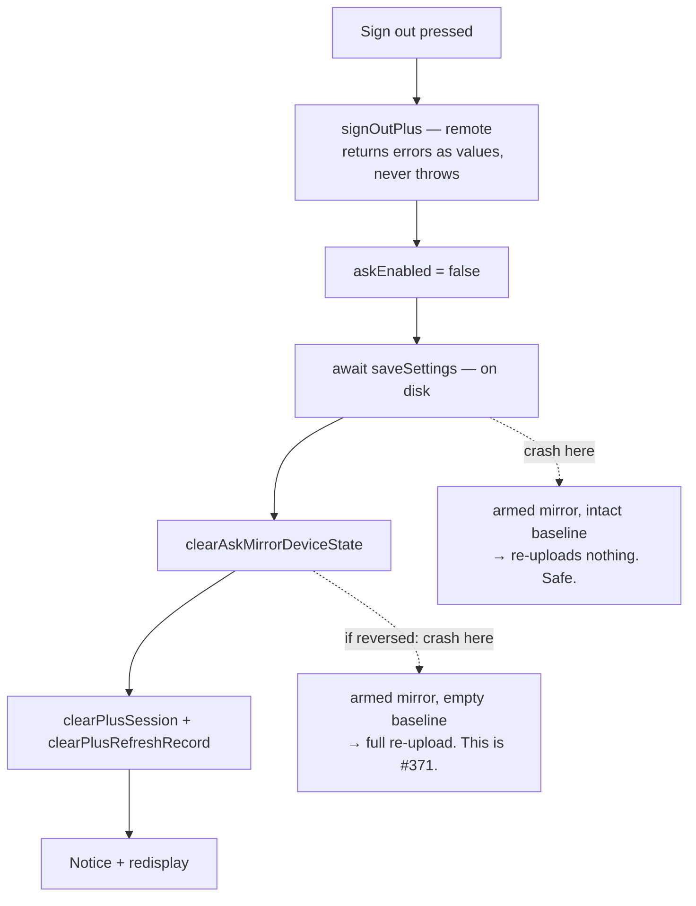

# fix: sign-out tears down the Ask mirror (#372)

## Goal capsule

Signing out of Plus must leave this device unable to talk to *any* account's cloud until someone re-enables the mirror. Today it leaves the mirror armed and the hash baseline intact, so the next account inherits both with no gesture at all.

---

## Problem frame

Grant both Ask consents as account A, sign out with the real **Sign out** button, sign in as account B, reload. No sheet, no prompt — and the vault immediately talks to B's cloud **in both directions**: this vault's atom bodies upload to B, and B's outbox is polled and may create files here.

Same root, second symptom: A's hash baseline survives the switch, so B's first sync uploads nothing. One edit later B's cloud held **1 of 407** atoms while Settings read `last pushed just now` — Ask answering from 1/407 while the plugin reports health.

The cause is a gap, not a wrong branch. `signOutOfPlus` ([settings.ts:1176-1190](src/settings/settings.ts:1176)) clears the session and the refresh record, shows a Notice, and re-renders. It touches **no** `plugin.settings` field, makes **no** `saveSettings()` call, and clears **no** Ask mirror device state. `askEnabled` and the acks are vault-synced settings; the hash baseline is device-local. Neither is scoped to an identity, so both simply carry over.

The wipe path already solves exactly this. `confirmWipeCloudCopy` ([settings.ts:894-901](src/settings/settings.ts:894)) sets `askEnabled = false`, `await`s `saveSettings()`, and only then calls `clearAskMirrorDeviceState`. The comment at `:884-893` records why that order is load-bearing. Sign-out needs the same three lines.

---

## Requirements

| ID | Requirement |
|---|---|
| **R1** | Signing out sets `askEnabled = false` and persists it before any device state is cleared. |
| **R2** | Signing out clears Ask mirror device state through `clearAskMirrorDeviceState` — the single owner of the key list. The sign-out site does not name keys itself. |
| **R3** | The consent **acks** survive sign-out. Only `askEnabled` and device state go. |
| **R4** | Local teardown happens even when the sign-out network call fails. |
| **R5** | A regression test signs out one identity and signs a different email in, and observes that neither the previous account's arming nor its baseline survives. |
| **R6** | The **Sign out** row's description stays true after this change. |
| **R7** | The plugin version is bumped so a phone build carrying the fix is identifiable in Settings. |

**On R3 and what "re-enable" costs.** The acks are vault-synced and deliberately preserved — withdrawal keys off the ack timestamp and has to stay reachable. One consequence follows and is accepted: after an account switch the privacy ack is still current, so re-arming is a bare toggle flip rather than a fresh consent sheet ([settings.ts:2268](src/settings/settings.ts:2268)). That is a deliberate user gesture, which is the line this fix draws — the bug is egress with *no* gesture. Requiring a re-prompt on identity change belongs to the deferred sign-in-side guard.

---

## Key technical decisions

**KTD1 — Sign-out disarms and clears; it does not preserve the same-account fast path.** *(session-settled: user-directed — chosen over an account-keyed hash baseline: a security hole should not wait behind an optimization.)*

Accepted cost: signing back into the **same** account re-uploads all ~407 atoms once, which also re-fires `expand-backfill` and its Anthropic spend. The account-keyed baseline that would avoid this is a follow-up (see Deferred), not a blocker. Governs R1, R2.

**KTD2 — Copy `confirmWipeCloudCopy`'s ordering exactly: disarm → persist → clear.**

The reverse order leaves an armed mirror over an empty baseline if the process dies between the two steps — that is #371 itself, where a cleared baseline becomes a full re-upload through a still-open gate. This order's crash window leaves an armed mirror over an *intact* baseline, which merely re-uploads nothing. One window is a data event; the other is a no-op. Governs R1.

**KTD3 — R4 already holds. Lock it with a test; do not add a wrapper.**

An earlier draft of this plan added a try/catch around the remote call on the theory that a throw would skip local teardown. That premise is false: `plusRequest` catches and returns `{ok: false, status: 0, code: "network"}` ([plusClient.ts:188-224](src/platform/plusClient.ts:188)), and `signOutPlus` ([plusClient.ts:738-753](src/platform/plusClient.ts:738)) returns errors as values with no throw path. A dead network already reaches `clearPlusSession` today.

So R4 costs no code. What it needs is a contract test, because the property is load-bearing and nothing currently asserts it — a future `request` implementation that throws would silently reintroduce the hole. Governs R4.

**KTD4 — Do not add a fourth copy of the egress predicate.**

`askMirrorPermitted` ([askAck.ts:133](src/shared/askAck.ts:133)) is the one home; `AskCoordinator.mirrorPermitted()` delegates to it. The fix needs no new predicate — it changes the *input* (`askEnabled`), and every push and outbox path already reads it. Per [the learning](docs/solutions/workflow-issues/extracting-a-one-home-predicate-does-not-find-the-copy-already-there.md), if a new helper is introduced anyway, verify one-home by searching the **shape** (`rg -n "askEnabled\s*&&" src/`), not the identifier. Governs R1, R2.

---

## High-level technical design

The whole change is an ordering. What makes it correct is which state is on disk when the process can die.

Why disarming is sufficient rather than merely necessary: `askMirrorPermitted` returns `s.askEnabled && askPrivacyAckIsCurrent(s)`, so `askEnabled = false` alone shuts it. Every egress path routes through it — `scheduleSync` ([askCoordinator.ts:149](src/plugin/askCoordinator.ts:149)), the `sync()` entry ([:254](src/plugin/askCoordinator.ts:254)), `runSyncOnce` ([:286](src/plugin/askCoordinator.ts:286)), and `applyOutbox` ([:179](src/plugin/askCoordinator.ts:179)), which ANDs it with `askWriteAckIsCurrent`. The 60s outbox timer stays registered and keeps ticking; it returns `idle` at the gate.

Two things this does **not** gate, both pre-existing and out of scope:

- The **Cloud mirror status → Refresh** row calls `askMirrorStatus` directly ([settings.ts:822](src/settings/settings.ts:822)) with no consent check — it is session-gated only, so it disappears after sign-out. During a sentinel window with a second account signed in, pressing it logs a GET. That is not a gate failure; do not read it as one.
- `runSyncOnce` does not re-check the gate between scan and upsert within a single pass ([askCoordinator.ts:280-285](src/plugin/askCoordinator.ts:280)), so a sign-out mid-pass still ships the remainder of that pass.

---

## Implementation units

### U1. Tear down the Ask mirror in `signOutOfPlus`

**Requirements:** R1, R2, R3, R6
**Dependencies:** none
**Files:** `src/settings/settings.ts`

**Approach:**
1. After the existing `await signOutPlus(...)` at [settings.ts:1181](src/settings/settings.ts:1181), set `this.plugin.settings.askEnabled = false` and `await this.plugin.saveSettings()`. Leave the remote call itself untouched — it already returns errors as values (KTD3).
2. Then call `clearAskMirrorDeviceState((k, v) => this.app.saveLocalStorage(k, v))` — same call shape as [settings.ts:899](src/settings/settings.ts:899).
3. Leave the existing `clearPlusSession` / `clearPlusRefreshRecord` / Notice / `redisplay()` tail in place.
4. Do **not** touch `askPrivacyAckAt`, `askPrivacyAckVersion`, `askWriteAckAt`, or `askWriteAckVersion` (R3). Set the field directly rather than routing through `setAskMirrorEnabled(false)`, which also drops the write ack ([settings.ts:603](src/settings/settings.ts:603)) — that is a different gesture with a different consent meaning.
5. Update the **Sign out** row description at [settings.ts:1297](src/settings/settings.ts:1297) (R6). It currently reads "Remove the Plus session from this device only." — `askEnabled` lives in `data.json` and syncs, so after this change the gesture also turns the Ask mirror off everywhere. Say what it does now; keep it one plain sentence per `docs/voice.md`.

The function is already `async`, so the added `await` needs no signature change. Mirror the rationale comment style of [settings.ts:884-893](src/settings/settings.ts:884) rather than restating it — one line pointing at the ordering invariant and #372.

**Patterns to follow:** `confirmWipeCloudCopy` ([settings.ts:853-909](src/settings/settings.ts:853)) is the reference implementation for the whole sequence.

**Test scenarios:** covered by U2 — this unit lands with U2's tests in the same commit.

**Verification:** `npx tsc --noEmit` clean; U2's suite green.

---

### U2. Identity-switch regression tests

**Requirements:** R4, R5 (and asserts R1–R3)
**Dependencies:** none — authored before U1 and landing in the same commit, so the red-first proof below is reproducible.
**Files:** `test/askMirrorConsentTruth.test.ts`

New `describe("#372 — signing out tears the mirror down")` block in the existing consent-truth suite — the structural sibling that already drives the same disarm→persist→clear invariant through the same harness.

**Harness notes the implementer needs before writing a line:**

1. **The Sign out row does not render from a seeded session alone.** `deriveAccountState` returns `{kind: "active"}` only when `auth.mode === "plus"`; the suite's existing `connect()` helper ([test/askMirrorConsentTruth.test.ts:65-70](test/askMirrorConsentTruth.test.ts:65)) seeds `session` only and derives `signedOut`, which renders "Set up automatic filing" and no Sign out row at all. This block needs its own factory seeding **both** `session` and `auth: { mode: "plus", sessionToken, email, status: "active", remaining, periodEnd }`, copying `activeTab()` at [test/settings.test.ts:394-406](test/settings.test.ts:394). Then `tab.display()` → `open(tab, <account destination>)` → `press(tab, "Sign out", "Sign out")`.
2. **`signOutPlus` is a real network call** — extend the suite's module-level `plusClient` mock ([:31-36](test/askMirrorConsentTruth.test.ts:31)), and give the new spy the same `beforeEach` `mockClear` discipline the existing `wipe` spy has ([:64](test/askMirrorConsentTruth.test.ts:64)).
3. **`calls` cannot prove ordering.** The harness records plugin-double members only ([test/helpers/settingsTab.ts:105-125](test/helpers/settingsTab.ts:105)); `clearAskMirrorDeviceState` writes go to `app.saveLocalStorage`, a plain Map setter that is never recorded. The two events share no sequence to compare — see the ordering scenario below for the shape that does work.

**Test scenarios:**
- Sign out with the mirror armed → `plugin.settings.askEnabled === false`, and `calls` contains `saveSettings`.
- Sign out with the mirror armed → `local.get(LS_ASK_MIRROR_HASHES) === "{}"` and `local.get(LS_ASK_MIRROR_EMAIL) === ""`.
- Sign out → `askPrivacyAckAt`, `askPrivacyAckVersion`, `askWriteAckAt`, and `askWriteAckVersion` are byte-identical to their pre-sign-out values, so the withdrawal row stays reachable (R3).
- **Ordering (KTD2):** seed `plugin: { saveSettings: async () => { snapshot = made.local.get(LS_ASK_MIRROR_HASHES); } }` on the factory and assert `snapshot` still equals the seeded non-empty hash map. This proves the disarm was persisted *while the baseline was intact*, and goes red under the reversed order. Do not assert final state — it is identical either way.
- **R4 contract test:** `signOutPlus` mocked to reject → the session is still cleared, `askEnabled` is still false, device keys are still cleared, and the rejection does not propagate out of the handler. Label this a **contract test** in a comment: production `signOutPlus` returns errors as values and cannot throw today (KTD3), so this guards the contract against a future `request` implementation that does. It is not dead — do not let a simplify pass read it as unreachable.
- **The regression (R5):** seed account A armed with a non-empty hash map and a current privacy ack → sign out → seed a session for a *different* email → construct the real `AskCoordinator` and assert `mirrorPermitted()` is false. Then also assert `readAskMirrorEmail` returns `""` and the hash map is empty under that second session. The extra assertions matter: `mirrorPermitted()` reads `askEnabled` and the privacy ack only ([askCoordinator.ts:135](src/plugin/askCoordinator.ts:135) → [askAck.ts:133-139](src/shared/askAck.ts:133)) — no email, no device state — so on its own it would pass identically whether the second identity were seeded or not, and would prove nothing about the second account or the 1-of-407 baseline half of the bug.
- Idempotence: sign out with `askEnabled` already false and no device state → no throw, no spurious writes.

**Execution note:** write the regression scenario first and watch it fail against the unmodified tree. The whole point is that this gap shipped undetected, so a test that cannot go red proves nothing — per [the learning](docs/solutions/architecture-patterns/a-test-harness-that-cannot-fail-reports-coverage-that-never-ran.md), confirm red before green.

**Verification:** `npx vitest run test/askMirrorConsentTruth.test.ts` green; the regression scenario demonstrably red against `base: 8104484`.

---

### U3. Version bump

**Requirements:** R7
**Dependencies:** U1
**Files:** `package.json`, `manifest.json`, `versions.json`

0.6.88 → **0.6.89**. Sign-out behavior changes on a user-visible gesture, so a phone build must be identifiable in Settings → Atoms. No Release cut — that is the owner's call, per the release runbook.

`versions.json` is a version→minAppVersion map, not a file with a `version` field: add the key `"0.6.89": "1.11.4"` alongside the existing `"0.6.88": "1.11.4"` tail.

**Test expectation:** none — version metadata only.

**Verification:** `package.json` and `manifest.json` both read 0.6.89; `versions.json` carries the new key.

---

## Verification contract

| Gate | Command / evidence |
|---|---|
| Types | `npx tsc --noEmit` clean |
| Unit | `npx vitest run` green, including the new #372 block |
| Regression is real | The identity-switch scenario fails against `base: 8104484` |
| Egress | Sentinel log empty across the switch, **paired with a positive control** in the same session |
| Live smoke | Per the recipe below, phone width 390×844 with `is-phone` asserted |
| Server-side switch | **Blocked** — `plus-service` is not deployed |

**Never run `npm test` or `npm run build`** — `pretest` runs `build:www`, which deletes the tracked fixture `docs/field-notes/published/2026-08-01-sample-loop.json` (#343). Use `npx vitest run` and `npx tsc --noEmit`. If a suite run happens anyway, `git status --short` before committing and never `git add -A`.

### The live-smoke recipe, and why it needs one

A real second sign-in is not available: it goes through the same `plusBaseUrl` override the sentinel occupies ([settings.ts:1068](src/settings/settings.ts:1068), [:1180](src/settings/settings.ts:1180)), and the sentinel refuses everything with 503 — so the account switch the silence window is meant to observe cannot complete while the sentinel is the destination. With the override off there is no deployed service to switch against. Improvising here is how fabricated evidence gets written, so follow the shape the #371/#374 QA already proved ([docs/qa/2026-08-08-371-374-mirror-consent-truth-world-class-qa.md:23-29](docs/qa/2026-08-08-371-374-mirror-consent-truth-world-class-qa.md)):

1. Seed the second identity as a device-local `atoms-plus-session` for a different email via `obsidian eval`, against a **permissive** local stub (the `127.0.0.1:8799` pattern returning `200 {ok:true}`) when a success branch must actually run.
2. Point Plus service URL override at the **refusing** sentinel (`node scripts/qa-egress-sentinel.mjs`, default `127.0.0.1:8787`) for the silence window.
3. Produce the positive control in the same session by re-granting Ask consent and observing an upsert attempt land in the log.
4. Report true server-side account switching **Blocked**, with the deploy named as the reason.

The sentinel and the permissive stub are two different instruments — 503 captures attempts, 200 lets a success branch execute. Choose per the branch you need to drive.

**Egress evidence rules.** The sentinel records method, path, and byte count — never bodies. An empty log proves nothing on its own: a wrong port, a stale override, or a dead sentinel produces a byte-identical empty file. Every "nothing was sent" window must be paired with a window in the same session where something *was* sent. And the sentinel speaks only to what the client attempted — it says nothing about what the server does with data it already holds. Mark server-side effects **Blocked**, as the #371/#374 QA did.

---

## Scope boundaries

**In scope:** the three sign-out lines, the Sign out row description, the identity-switch and contract tests, the version bump.

**Not this issue:** [#284](https://github.com/taihartman/obsidian-atoms/issues/284), the server-side half — MCP grants are keyed by email and sign-out never calls `mcpRevokeForEmail`, so the connector stays live for the signed-out account. It carries its own unresolved design question (whether revoking should kill the pairing on the user's *other* devices) and gets its own plan.

**Outside the fix entirely:** `plus-service` is still not deployed to Fly. That is the owner's act, not a coding task.

### Deferred to follow-up work

- **Account-keyed hash baseline** — bind the baseline to an account identity and invalidate on email change, restoring the same-account fast path KTD1 gives up. File at PR time.
- **Sign-in-side guard** — a device whose sign-out never ran (expired session, magic-link sign-in after a switch, restored vault) reaches the same state by a different road, and would also be the place to force a re-prompt on identity change rather than a bare toggle. Deliberately excluded to keep this change to one site; file at PR time.
- **`runSyncOnce` mid-pass gate re-check** ([askCoordinator.ts:280-285](src/plugin/askCoordinator.ts:280)) — pre-existing, unchanged by this fix.
- **Refresh row has no consent check** ([settings.ts:822](src/settings/settings.ts:822)) — pre-existing, session-gated only.

---

## Risks

| Risk | Mitigation |
|---|---|
| **Sign-out now disarms Ask on every device sharing the vault**, because `askEnabled` rides in synced `data.json` — the coordinator already handles settings arriving from another device mid-pass ([askCoordinator.ts:130-133](src/plugin/askCoordinator.ts:130), #323) | Fails closed, and one toggle restores it because R3 keeps the acks. U1 step 5 updates the Sign out row so its copy stops claiming the gesture is device-only. Call this out in the PR body — it is a real behavior change beyond the reported bug. |
| Same-account re-sign-in re-uploads ~407 atoms and re-fires `expand-backfill` spend | Accepted under KTD1; the account-keyed baseline is the filed follow-up. Note it in the PR so it is a known cost, not a surprise — and warn the QA operator before they fire it unintentionally. |
| Clearing `LS_ASK_MIRROR_EMAIL` blanks the `· as you@…` status suffix | Correct behavior — the status reads `readAskMirrorEmail(...) \|\| sessionEmail \|\| ""` ([settings.ts:2149](src/settings/settings.ts:2149)), and after sign-out there is no session email either. Confirm the status line degrades cleanly rather than rendering a stray middle dot. |
| The client disarm is a client-side claim only | Pre-existing and separately recorded in [the learning](docs/solutions/security/a-consent-version-only-the-client-checks-does-not-gate-the-server.md). #284 owns the server half. |
| STATUS.md conflicts with concurrent branches | The #372 row is the only STATUS.md content this branch owns — on conflict, rebase and re-add that row rather than resolving the whole file. |

---

## Definition of done

- U1–U3 landed; `npx tsc --noEmit` and `npx vitest run` green.
- The identity-switch regression demonstrably fails against `base: 8104484`.
- Egress sentinel evidence captured with a positive control; server-side account switching marked **Blocked** with the deploy named.
- Shipping tail run: `ce-simplify-code` → `ce-code-review` (P0/P1 fixed) → `ce-compound` → `world-class-qa` ending in `adversarial-qa`.
- PR #389 out of draft with `Closes #372`, Test plan boxes checked only against real evidence, the cross-device disarm called out in the body, and phone-width screenshots committed under `docs/qa/screenshots/372-sign-out-teardown/` linked by absolute raw URLs.
- Follow-up issues filed for the account-keyed baseline and the sign-in-side guard.
- After merge to master: STATUS.md row cleared (PR if branch-protected).

---

## Sources

- [#372](https://github.com/taihartman/obsidian-atoms/issues/372) — repro and request log
- `docs/handoffs/2026-08-09-372-sign-out-teardown.md` — the settled shape and its rejected alternative
- `docs/qa/2026-08-08-371-374-mirror-consent-truth-world-class-qa.md` — the QA shape to match, including the local-stub recipe and how it reported what it could not reach
- `docs/solutions/security/consent-gate-must-be-checked-at-egress-not-at-entry.md` · `docs/solutions/security/a-versioned-consent-needs-both-halves-in-the-gate.md` · `docs/solutions/logic-errors/narrowing-one-grant-removed-the-only-way-to-revoke-the-other.md`
- `docs/solutions/workflow-issues/prove-a-gate-held-with-an-egress-sentinel-not-an-assumption.md`
