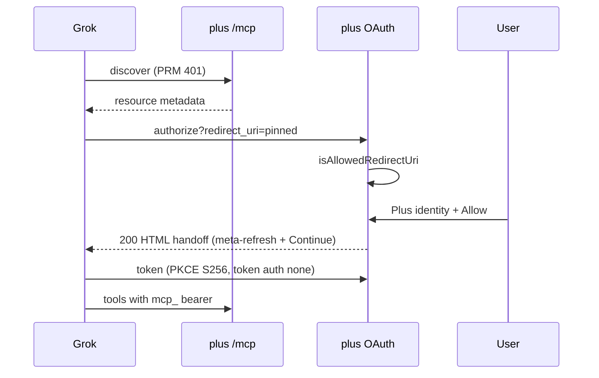

# Ask Grok MCP connector - Plan

## Goal Capsule

**Objective.** A Plus user who already has Ask on can connect the same Atoms MCP URL in Grok (custom connector) via OAuth, then search and optionally file from the mirror — without a second endpoint, without a new tool surface, and without re-prompting existing Ask consents.

**Product authority.** Constitution (vault SSOT, Atoms/-only egress, body sacred, Ask vault→cloud only) > this plan > ChatGPT connector plan (`docs/plans/2026-07-27-006-feat-ask-chatgpt-mcp-plan.md`) as the client-compat pattern.

**Stop conditions.** No second MCP URL. No ack-version bump. No invented Grok callback path. No copy that tells a Claude-only user we send data to xAI. No Grok marketplace listing. No new tools.

**Execution profile.** Test-first on the redirect allowlist. Pin Grok's live `redirect_uri` before merging that allowlist. Plus-service OAuth first; Settings/www copy after. Human Grok dogfood on throwaway vault + Plus test account.

**Tail.** simplify → code-review → compound → world-class-qa (Settings + tryatoms are product-facing). PR `Closes #<claim issue>`. Fly deploy before production Grok OAuth can succeed.

**Open blockers.** Live Grok `redirect_uri` is unpublished. U1 starts by capturing it from a real authorize hop. Do not write allowlist code against an invented path.

---

## Product Contract

### Summary

Grok becomes a third optional Ask client on the existing public MCP URL. OAuth must accept Grok's callback. How-to copy may name Grok. General Ask and privacy copy must not read as if Atoms sends data to xAI unless that person connected Grok.

### Problem Frame

Ask already works in Claude and ChatGPT through one hosted MCP URL. Grok's app accepts the same kind of custom connector (public Streamable HTTP + OAuth). Today the authorize step rejects Grok's redirect, and every Ask sentence still says Claude or ChatGPT. Users who want Grok cannot finish linking. Users who do not use Grok must not be told we send their atoms there.

### Key Decisions

- **Same URL, no new server.** Grok uses `{plusBase}/mcp`. No Grok-only tools, no second mirror. (session-settled: user-approved — chosen over a plugin-local MCP: Grok cannot reach Obsidian on the device.)
- **No re-ack.** Leave `ASK_PRIVACY_DISCLOSURE`, `ASK_WRITE_DISCLOSURE`, and both ack versions frozen. Existing grants stay valid. (session-settled: user-directed — chosen over bumping both sheets: re-prompting every Ask device is annoying; Grok is another chat host, not a new kind of sharing.)
- **Do not imply fan-out to Grok.** How-to (Settings connect row, setup steps, OAuth pages) may name Grok as an app you can connect. General Ask blurbs and privacy pages speak of "the assistant you connect" and that assistant's provider. A Claude-only user must not read that Atoms sends their data to xAI. (session-settled: user-directed — chosen over adding Grok to every Ask sentence: naming Grok next to Claude and ChatGPT on shared surfaces reads as we send to all three.)
- **Ack gate stays.** Do not replace the in-app Acknowledge sheet with a website link. (session-settled: user-approved — chosen over ripping out the gate this round: a link you may never open is not the same as a grant; that rewrite is a different product.)

### Actors

- A1. Plus subscriber with Ask on (may already use Claude and/or ChatGPT; may never use Grok)
- A2. Grok (web / iOS / Android custom connector) as OAuth client
- A3. Claude and ChatGPT connectors (regression)
- A4. Atoms Plus OAuth + MCP host

### Requirements

**Connector**

- R1. The same public MCP URL that Claude and ChatGPT use works for Grok custom-connector discovery.
- R2. OAuth redirect allowlist accepts Grok's production callback(s) without opening arbitrary HTTPS redirects.
- R3. Consent Allow can redirect back to Grok (browser CSP must not block that hop).
- R4. Authorize → Plus identity (magic link or pairing code) → consent → token works for a Grok client the way it works for Claude and ChatGPT.
- R5. Non-allowlisted redirects still 400.
- R6. Claude and ChatGPT callbacks keep working.
- R7. No new MCP tools. Existing read and write-via-outbox tools are unchanged.

**Copy honesty**

- R8. Connect how-to names Grok as a third optional client (Settings connect steps, pairing helper, OAuth HTML, tryatoms setup Ask section).
- R9. General Ask description and tryatoms privacy do not name Grok as a destination of vault data. They say the provider of the assistant the person connected receives tool results.
- R10. Frozen ack sheets are not edited. No `ASK_PRIVACY_ACK_VERSION` or `ASK_WRITE_ACK_VERSION` bump.

**Docs**

- R11. CONCEPTS, architecture Ask-mirror sentence, and the Ask self-host runbook name Grok as a supported connector client, with the same honesty rule as R9.

### Key Flows

- F1. Grok custom connector
  - **Trigger:** User pastes the MCP URL in Grok → New Connector → Custom.
  - **Steps:** Discovery → OAuth to Plus → identity → Allow → return to Grok → tools list.
  - **Outcome:** Search/fetch (and optional outbox write) against this account's mirror.
  - **Covers:** R1–R4, R7
- F2. Claude-only Ask user
  - **Trigger:** Opens Settings Ask or tryatoms privacy; never connected Grok.
  - **Outcome:** Copy does not say Atoms sends their data to Grok or xAI.
  - **Covers:** R9, R10
- F3. Claude / ChatGPT regression
  - **Trigger:** Existing connector reconnects or continues a chat.
  - **Outcome:** Same URL, same tools, same allowlisted redirects.
  - **Covers:** R6, R7
- F4. Rejected redirect
  - **Trigger:** Authorize with `https://evil.example/cb`.
  - **Outcome:** 400; no code minted.
  - **Covers:** R5

### Acceptance Examples

- AE1. Allowlisted Grok redirect completes OAuth in unit/integration tests (live Grok dogfood documented if CI cannot drive grok.com). **Covers R2, R4.**
- AE2. `https://evil.example/cb` still 400. **Covers R5.**
- AE3. Claude callback and ChatGPT prefix/legacy tests stay green. **Covers R6.**
- AE4. Settings connect how-to names Grok; the Ask section intro does not say data goes to Grok. **Covers R8, R9.**
- AE5. tryatoms setup has a Grok step. Privacy, consent, and MCP-instruction copy use "the provider of the assistant you connected" with no third-vendor parenthetical. **Covers R8, R9.**
- AE8. CONCEPTS, architecture Ask-mirror sentence, and `docs/ask-self-host.md` name Grok as a connector client and do not say every Ask user sends data to xAI. **Covers R11.**
- AE6. Frozen disclosure strings and ack versions are byte-identical to master. **Covers R10.**
- AE7. Human dogfood: Grok tool call returns a mirrored atom body from the throwaway vault. **Covers R1, F1.**

### Scope Boundaries

**In.** Redirect allowlist, CSP hop back to Grok, client label, how-to copy, tryatoms setup/privacy honesty, CONCEPTS/runbook, tests, version bump if Settings or site copy is user-visible.

**Out.**

- Replacing the Acknowledge gate with a website-only notice
- Editing frozen ack disclosure strings or bumping ack versions
- A Grok marketplace / catalog listing
- New MCP tools or a Grok-only schema
- Plugin-local or tunneled MCP (Grok must reach a public host)
- Sending mirror data to xAI except as tool results inside a Grok chat the user connected

### Deferred to Follow-Up Work

- Official Grok connector catalog / marketplace listing
- Replacing the Acknowledge gate with a website-only notice (different product)
- Grok Business/Enterprise admin-provisioned connectors (`console.x.ai`)
- Extra iOS/Android callback hosts or custom schemes (`grok:`) after the first web pin

### Dependencies / Assumptions

- Grok custom connectors accept public Streamable HTTP + OAuth the way Claude and ChatGPT do (xAI docs, May 2026).
- Fly deploy is required before live Grok OAuth can succeed against production.
- Grok custom connectors may use OAuth or API keys (xAI docs). This ship is OAuth only. If the first live authorize hop lacks PKCE S256, `state`, or `resource={plusBase}/mcp`, stop and file a follow-up — do not weaken the AS.

### Outstanding Questions

None remaining. Planning resolved the three deferred items into KTD1, KTD4, and KTD6.

### Sources / Research

- Pattern: `docs/plans/2026-07-27-006-feat-ask-chatgpt-mcp-plan.md` (same URL, allowlist, honesty copy; this plan does not repeat that plan's ack-sheet rewrite).
- Allowlist today: `plus-service/src/oauth/constants.mjs` (`isAllowedRedirectUri`).
- CSP: `plus-service/src/html/shell.mjs` `OAUTH_HTML_SECURITY_HEADERS` `form-action` (not `www/src/_headers`).
- Frozen sheets: `src/settings/consent.ts`; lock `test/askConsentVersion.test.ts` (`FROZEN_ASK_PRIVACY`, `FROZEN_ASK_WRITE`).
- xAI: https://docs.x.ai/grok/connectors (custom MCP; public URL; OAuth). **No published callback path** as of 2026-08-12.
- Learnings: do not rewrite a frozen consent entry in place; expand egress stays Anthropic; `mcp_` is not a wider grant.

---

## Planning Contract

### Key Technical Decisions

- KTD1. **Pin the exact live `redirect_uri` (web).** Capture scheme + host + path from a real Grok authorize hop. Default allowlist is that exact string. A ChatGPT-style prefix is allowed only after two live hops differ by one `[A-Za-z0-9_-]+` segment. Never invent `grok.com/connector/oauth/{id}`. Never allowlist all of `grok.com` or `x.ai`. Extra mobile hosts or custom schemes are follow-ups. (resolves planning question: exact callback)
- KTD2. **Extend `isAllowedRedirectUri`; do not add a server.** Claude + ChatGPT + loopback stay as they are. Grok rule uses `hostname ===` the pinned host, https only, reject userinfo / `..` / extra segments / unexpected query or fragment. Cites Product Contract: same URL, no new server.
- KTD3. **Consent already returns 200 + meta-refresh + Continue link** (`redirectToClient`). That hop is not a 302 and is not gated by `form-action`. Adding the pinned origin to `OAUTH_HTML_SECURITY_HEADERS` is optional defense-in-depth for a residual 302. Do not restore a 302. Do not touch landing-page CSP.
- KTD4. **Keep `token_endpoint_auth_methods_supported: ["none"]` and require PKCE S256.** ChatGPT KTD4 meant token-endpoint `none`, not `code_challenge_method=none`. If live Grok omits S256/`state`/`resource={plusBase}/mcp` or demands `private_key_jwt` only, stop and file a follow-up — do not weaken the AS. (resolves CIMD question)
- KTD5. **Label Grok from `new URL(redirectUri).hostname` after the URI already passed `isAllowedRedirectUri`.** Exact hostname match to the pin. Do not substring-match `grok` or `x.ai` in `client_id` or query. Fallback stays `"AI app"`. ChatGPT prefix + `?next=https://x.ai` still labels ChatGPT.
- KTD6. **How-to names Grok; general surfaces do not.** Connect destination, MCP steps, pairing-row name, OAuth authorize HTML, and setup Ask steps name Grok. Ask heading stays `Ask` (do not add Grok). Ask intro, privacy page, consent muted line, and MCP instructions say "the assistant you connected" / that assistant's provider — no third-vendor parenthetical. Write-toggle label stays `"Allow filing from Claude or ChatGPT"` (matches frozen write sheet). Do not rewrite that label to "the assistant you connect." (session-settled: user-directed — chosen over naming Grok on every Ask sentence: that reads as we send to xAI.)
- KTD7. **Frozen ack sheets stay byte-identical.** Do not edit `ASK_PRIVACY_DISCLOSURE`, `ASK_WRITE_DISCLOSURE`, `ASK_PRIVACY_ACK_VERSION`, `ASK_WRITE_ACK_VERSION`, or existing `FROZEN_*` keys. (session-settled: user-directed — chosen over re-prompting the fleet.)
- KTD8. **No new MCP tools or security-scheme rewrite.** Transport stays Streamable HTTP JSON. If live Grok requires SSE GET sessions, document and follow-up — do not dual-transport in this PR.
- KTD9. **Live Grok dogfood is human evidence (AE7).** One successful `tools/list` after OAuth, not only allowlist unit tests.
- KTD10. **Version bump** when Settings or tryatoms copy ships (user-visible).

### High-Level Technical Design

Authorize rejects before any identity step when the redirect is not allowlisted. Allow already uses a same-origin 200 handoff so consent `form-action` cannot swallow the navigation.

### Assumptions

- First pin is Grok web against the same public Plus URL production will use. A second mobile host or custom scheme is a follow-up, not this claim.
- Opaque CIMD `client_id` without the pinned hostname is fine; consent shows `"AI app"`.

### Implementation constraints

- Do not log raw authorize query strings in production (log-safety). Capture the pin from a local/dev authorize log or the browser address bar during dogfood.
- Grok must reach a public Plus URL. Localhost Plus needs a tunnel for the pin step only.
- `atoms-voice` for any new user-facing sentence.

### Sequencing

U1 (capture pin, then allowlist + tests) → U2 (OAuth HTML; optional CSP) → U3 (Settings dest titles) → U4 (www lockstep + docs). U3 and U4 may share a PR; U4 must not merge before U3 dest titles exist.

---

## Implementation Units

### U1. Pin Grok redirect and extend the allowlist

**Goal.** Grok's real callback is allowed; evil redirects still 400; Claude and ChatGPT unchanged.
**Requirements.** R2, R4, R5, R6, F1, F4, AE1, AE2, AE3, KTD1, KTD2, KTD5
**Dependencies.** None
**Files:**
- `plus-service/src/oauth/constants.mjs`
- `plus-service/test/oauth-redirect.test.mjs`
- `plus-service/test/http-ask-oauth.test.mjs`
**Approach.** Start Grok → New Connector → Custom against the public Plus `/mcp`. Capture `redirect_uri` from the browser address bar (not a production log of authorize query). Pin the exact string. Write allowlist code only after that string is in the PR. Prefix rule only if a second live hop differs by one id segment. Label from pinned hostname after allowlist. Do not merge an invented path.
**Execution note.** Test-first on `isAllowedRedirectUri` once the pin is known. Characterization: existing Claude/ChatGPT cases must stay green before the new cases. New tests fail if authorize/token handlers log raw query, `code`, `state`, or `code_verifier`.
**Patterns to follow.** ChatGPT block in `isAllowedRedirectUri`; `docs/plans/2026-07-27-006-feat-ask-chatgpt-mcp-plan.md` U1.
**Test scenarios:**
1. Covers AE1. Pinned Grok HTTPS callback → true
2. Covers AE3. Claude exact callback → true
3. Covers AE3. ChatGPT legacy + `chatgpt.com/connector/oauth/{id}` → true
4. Loopback `/callback` → true
5. Covers AE2. `https://evil.example/cb` → false
6. Wrong path on the pinned host → false
7. `hostname` suffix / prefix lookalikes (`pinned.evil.example`, `evil.pinned`) → false
8. http downgrade, userinfo, unexpected query/fragment → false
9. ChatGPT prefix + `?next=https://x.ai` still labels ChatGPT
10. `oauthClientLabel` for the pinned hostname → `"Grok"`
11. In-process authorize with pinned redirect issues a code
12. In-process authorize with evil redirect → 400
13. DCR with [pinned, unpinned] → 400; DCR with the pinned set → 201
**Verification.** `plus-service` oauth tests pass. PR names the pinned URI.

### U2. CSP hop + OAuth how-to HTML

**Goal.** Allow on consent returns to Grok. Authorize/pairing pages name Grok as a connectable app without saying we send vault data to xAI.
**Requirements.** R3, R8, R9, F1, KTD3, KTD6
**Dependencies.** U1 (pinned origin)
**Files:**
- `plus-service/src/html/shell.mjs`
- `plus-service/test/html-shell.test.mjs`
- `plus-service/src/oauth/html.mjs`
- `plus-service/test/http-ask-oauth.test.mjs`
- `plus-service/src/mcp/instructions.mjs` only if a Claude/ChatGPT-only sentence remains; prefer "the host model provider of this chat"
**Approach.** Live consent muted line is `Tool results are sent to the AI provider (Anthropic or OpenAI) when you chat.` Replace it with host-of-this-chat wording (no xAI on a shared vendor list). Authorize/chooser and pairing citation name Grok and must match the live Settings pairing-row name. Optional: add the pinned origin to `form-action` as defense-in-depth only. Do not restore a 302.
**Patterns to follow.** `html-shell.test.mjs` lock on OAuth CSP; authorize HTML freeze in `http-ask-oauth.test.mjs`.
**Test scenarios:**
1. Landing-page CSP unchanged
2. If `form-action` is touched, it adds only the pinned origin and still includes `claude.ai` + `chatgpt.com` + loopback
3. Authorize HTML names Grok and cites the live Settings pairing-row name
4. Consent muted line has no Anthropic/OpenAI/xAI vendor list — host of this chat only
**Verification.** html-shell + oauth HTTP tests green.

### U3. Settings how-to + version

**Goal.** Settings teach Grok connect. Ask intro and write toggle do not imply Grok fan-out. Plugin version identifiable.
**Requirements.** R8, R9, R10, AE4, AE6, KTD6, KTD7, KTD10
**Dependencies.** U1 pin known (copy can start earlier; dest title must exist before U4)
**Files:**
- `src/settings/settings.ts`
- `test/wwwSetupLabels.test.ts`
- `test/settings.test.ts`
- `test/settingsRows.test.ts`
- `test/askMirrorConsentTruth.test.ts`
- `manifest.json` / `package.json` / `versions.json`
- `test/askConsentVersion.test.ts` (assert still frozen — do not edit `FROZEN_*`)
**Approach.** Connect destination and MCP/pairing how-to name Grok (one dest string, shared with U4). Ask heading stays `Ask` — do not add Grok. Ask intro uses "the assistant you connect" (no client roster). Write row stays `"Allow filing from Claude or ChatGPT"`. Patch-bump version.
**Patterns to follow.** Destination title + `wwwSetupLabels` lockstep. `atoms-voice` for new sentences.
**Test scenarios:**
1. Covers AE4. Connect destination, MCP desc, and pairing-row name Grok
2. Covers AE4. Ask intro uses assistant-you-connect phrasing; no Grok/xAI destination
3. Ask heading does not contain Grok or xAI
4. Write row string unchanged (`Allow filing from Claude or ChatGPT`)
4. Covers AE6. `ASK_PRIVACY_DISCLOSURE`, `ASK_WRITE_DISCLOSURE`, and both ack versions match `FROZEN_*` on master
5. Label tests that name the connect destination are updated in lockstep
**Verification.** `npm test` on the listed files; `npm run build`.

### U4. tryatoms + agent docs

**Goal.** Setup has a Grok step. Privacy names the connected assistant's provider. Future agents know Grok is a supported client.
**Requirements.** R8, R9, R11, AE5, KTD6
**Dependencies.** U3 for dest-title lockstep with `wwwSetupLabels`
**Files:**
- `www/src/setup.html.tmpl`
- `www/src/privacy.html.tmpl`
- `CONCEPTS.md`
- `docs/architecture.md` (Ask mirror sentence)
- `docs/ask-self-host.md`
- `docs/qa/` Grok connector dogfood checklist (new, short)
**Approach.** Add a Grok `<li>` next to Claude/ChatGPT in setup Ask. Soften setup/privacy intros to "the assistant you connect." CONCEPTS Remote MCP + architecture + self-host allowlist sentence name Grok as a client and record the pinned callback family. Rebuild www dist per existing www workflow.
**Patterns to follow.** ChatGPT plan U4; tryatoms source templates, not hand-edited `www/dist`.
**Test scenarios:**
1. Covers AE5. Setup Ask section includes a Grok connect step
2. Covers AE5. Privacy Ask section uses connected-assistant provider wording with no xAI parenthetical
3. `wwwSetupLabels` still matches Settings dest titles
4. Covers AE8. CONCEPTS, architecture, and ask-self-host name Grok as a client without fan-out
**Verification.** www tests green; dist rebuilt if that is the repo's publish path.

---

## Verification Contract

| Gate | Evidence |
|---|---|
| Unit | `plus-service` oauth + html-shell tests (U1, U2) |
| Plugin | listed Settings/consent tests (U3); `askConsentVersion` still pins master wording |
| Site | `wwwSetupLabels` + setup/privacy (U4) |
| Build | `npm run build` |
| Claude / ChatGPT regression | existing oauth MCP tests |
| Human dogfood | AE7 on Grok + Plus test account; throwaway vault only |

**Execution direction.** Test-first on the pinned allowlist. Copy units are string + lockstep tests, not TDD theater.

---

## Definition of Done

- AE1–AE6 and AE8 automated or equivalent lock tests
- AE7 human dogfood checked, or explicitly deferred with reason in the PR
- Frozen ack strings and versions unchanged vs master
- Claude and ChatGPT oauth tests green
- Version bumped if Settings or tryatoms shipped
- Pinned Grok callback named in the PR
- PR body includes `Closes #<claim issue>`
- Shipping tail ran (simplify, code-review, compound, world-class-qa)
- Abandoned pin experiments removed from the diff
