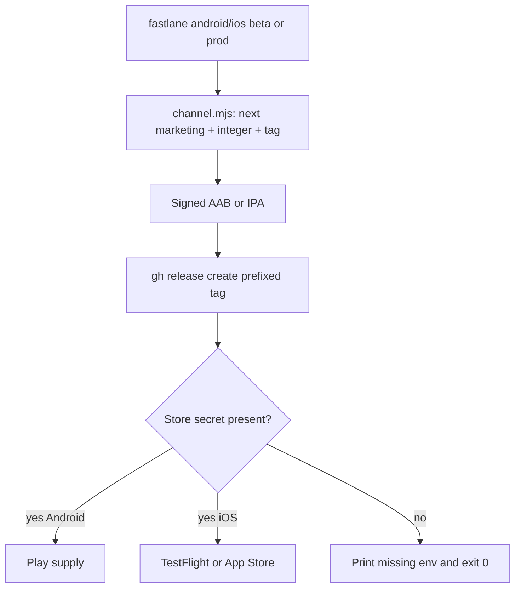
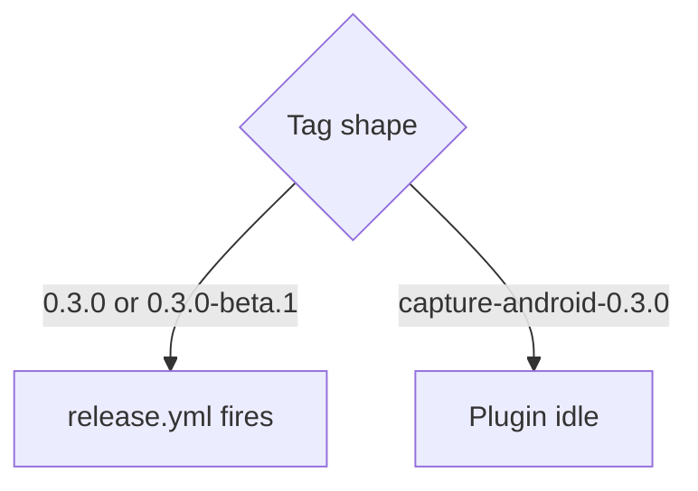

# Companion Fastlane Releases - Plan

## Goal Capsule

**Objective.** One explicit Fastlane command per channel builds a signed Atoms Capture binary, cuts a prefixed GitHub Release for tracking, and uploads to Play or App Store Connect only when the owner secret is present.

**Product authority.** Constitution (one repo, secrets never in git, companions do not classify) > this plan > plugin release runbook as the channel-shape pattern only.

**Stop conditions.** No unprefixed `X.Y.Z` companion tags. No companion Release marked GitHub Latest. No unsigned release binary. No store upload on master merge. No change to plugin `release.yml` tag filters. No iOS `MARKETING_VERSION` containing `-beta`.

**Execution profile.** Local Fastlane on the owner's machine. Channel math (tag name, prerelease, latest flag, suffix rules) lives in a small tested helper. Fastlane orchestrates Gradle / XcodeGen / gym / `gh` / supply / pilot. First Play or TestFlight upload is human-invoked after the matching API key exists.

**Tail.** simplify → code-review → compound → scoped QA (lane smoke, not vault product QA). PR `Closes #<claim issue>`. New Issue; do not pile onto #476.

**Open blockers.** None that hold readiness. Play JSON and ASC `.p8` are owner secrets; lanes must succeed without them by still cutting the GitHub Release.

---

## Product Contract

### Summary

Humans need a visible history of Atoms Capture builds, separate from the plugin's GitHub Releases, and a repeatable path onto Play Internal / Production and TestFlight / App Store. Fastlane is the named orchestrator. GitHub Releases are the tracking record. Store upload is optional distribution.

### Problem Frame

The plugin already has tagged Releases. The companions do not. Play Console Internal testing is empty. iOS has no listing. A signed Android AAB exists on the owner's machine. Without prefixed tags, a companion `0.3.0` tag would fire the plugin releaser. Without an explicit Latest=false, a companion stable Release would steal the repo Latest button that humans use for plugin installs.

### Actors

- A1. Owner on the signing Mac / laptop (`gh` logged in, keystore on disk)
- A2. GitHub Releases page (tracking)
- A3. Play Console (Atoms Capture, `app.tryatoms.capture`)
- A4. App Store Connect (bundle `app.tryatoms.capture.tai`, listing may be absent)
- A5. Plugin releaser (must stay idle)

### Key Flows

- F1. Android beta
  - **Trigger:** `fastlane android beta` from `companion/android`
  - **Steps:** bump integers / set marketing channel → signed `bundleRelease` → GitHub Release `capture-android-X.Y.Z-beta.N` (prerelease, not Latest) + AAB → Play Internal `completed` if `PLAY_STORE_JSON_KEY` is set
  - **Outcome:** testers can install from Internal; history is on GitHub even if Play is skipped
- F2. Android prod
  - **Trigger:** `fastlane android prod`
  - **Steps:** refuse a `-beta` / `-poc` marketing string → bump `versionCode` → signed bundle → GitHub Release `capture-android-X.Y.Z` (not Latest) + AAB → Play production `draft` if the key is set
  - **Outcome:** human hits Rollout; no auto production
- F3. iOS beta / prod
  - **Trigger:** `fastlane ios beta` or `fastlane ios prod`
  - **Steps:** bump `CURRENT_PROJECT_VERSION` on app + widget → keep `MARKETING_VERSION` as period-separated integers → `xcodegen generate` → signed IPA → GitHub Release `capture-ios-…` (beta tag may carry `-beta.N` even when the binary marketing version does not) → beta uploads to TestFlight when ASC env is set; prod uploads to App Store Connect with `submit_for_review: false` when ASC env is set; missing env skips store after the GitHub Release
  - **Outcome:** tracking Release always; store step optional
- F4. Build only
  - **Trigger:** `fastlane android build` / `fastlane ios build`
  - **Steps:** compile signed artifact, no bump required if already current, no GitHub, no store
  - **Outcome:** CI-ready smoke later; no secrets except the Android keystore for a signed Android build

### Requirements

**Tracking**

- R1. Every beta or prod lane that produces a signed binary creates a GitHub Release whose tag is `capture-android-<channelVersion>` or `capture-ios-<channelVersion>`.
- R2. Tags matching `-(beta|rc)` are prerelease. Clean marketing stables are not prerelease and must set `latest=false`.
- R3. The Release attaches the AAB or IPA. Notes name platform, marketing version, and integer build.

**Stores**

- R4. Android beta uploads the AAB to Play track `internal`, status `completed`, when `PLAY_STORE_JSON_KEY` points at a readable JSON file.
- R5. Android prod uploads to Play track `production`, status `draft`, when that key is present. It does not complete production rollout.
- R6. iOS beta uploads to TestFlight when `ASC_KEY_ID`, `ASC_ISSUER_ID`, and `ASC_KEY_PATH` are set. iOS prod uploads to App Store Connect with `submit_for_review: false`. The Fastfile maps those three into `app_store_connect_api_key`.
- R7. Missing store secrets skip the store step after the GitHub Release and print each required env that is unset (Android: `PLAY_STORE_JSON_KEY`; iOS: the three ASC vars the Fastfile checks). They do not fail the lane after a successful Release. A set but unreadable or rejected credential fails the lane after the Release; do not treat that as a skip.

**Signing and versions**

- R8. Release builds fail closed if Android `keystore.properties` is missing or blank. No unsigned AAB.
- R9. `versionCode` and `CURRENT_PROJECT_VERSION` increment on every beta and prod lane.
- R10. Android `versionName` may be `X.Y.Z` or `X.Y.Z-beta.N`. Prod refuses any non-clean marketing string, including leftover `-poc`.
- R11. iOS `MARKETING_VERSION` stays period-separated integers. iOS beta identity for GitHub may still be `X.Y.Z-beta.N`.

**Isolation**

- R12. Companion tags never match plugin `release.yml` filters (`[0-9]+.[0-9]+.[0-9]+` and `[0-9]+.[0-9]+.[0-9]+-*`).
- R13. Master merge does not upload to Play or App Store Connect.
- R14. Plugin `release.yml` tag filters are not edited.

### Acceptance Examples

- AE1. Covers R1, R2, R12. Given channel version `0.3.1-beta.1` on Android, the helper emits tag `capture-android-0.3.1-beta.1`, prerelease true, latest false.
- AE2. Covers R2, R12. Given channel version `0.3.1` on Android, the helper emits tag `capture-android-0.3.1`, prerelease false, latest false.
- AE3. Covers R10. Given Android `versionName` `0.2.0-poc`, `android prod` refuses to run.
- AE4. Covers R11. Given iOS marketing `0.1.0` and a beta lane, the binary marketing version remains `0.1.0` and the GitHub tag is `capture-ios-0.1.0-beta.N`.
- AE5. Covers R7. Given no `PLAY_STORE_JSON_KEY` and a valid keystore, `android beta` still signs, still creates the GitHub Release, and prints that Play was skipped.

### Success Criteria

An owner can run `fastlane android beta` and see a prefixed prerelease with an AAB attached. The repo Latest Release remains the plugin. Play upload happens only with the JSON key. iOS lanes exist and do not write `-beta` into `MARKETING_VERSION`.

### Scope Boundaries

**In**

- Fastlane under `companion/android` and `companion/ios`
- Tested channel helper
- Android signing fail-closed if the target branch still lacks it
- Runbook `docs/runbooks/companion-release-beta-stable.md`
- Gitignore for keystore, Fastlane reports, `.p8`

**Deferred to follow-up**

- GitHub Actions that call `fastlane android build` / `ios build`
- Play closed / open testing
- iOS listing assets
- `match` / cert factory
- Promoting a Play internal release to production without a new binary

**Outside this product's identity**

- Plugin Fastlane
- Changing `applicationId` or iOS bundle ids
- Auto store ship on master (plugin Community listing needs that; companions do not)

### Sources

- Session: user asked for Fastlane beta/prod; then asked for Releases for tracking
- `.github/workflows/release.yml` tag globs
- `docs/runbooks/plugin-release-beta-stable.md`
- `docs/solutions/architecture-patterns/a-green-check-about-a-different-subtree.md`
- Fastlane `upload_to_play_store`, `set_github_release`, `upload_to_testflight`, App Store Connect API key docs

---

## Planning Contract

### Key Technical Decisions

- KTD1. Fastlane is the orchestrator. (session-settled: user-directed — chosen over ad-hoc gradle/`gh` scripts: the user named Fastlane.)
- KTD2. GitHub Release is the tracking record; store upload is a later optional step. (session-settled: user-directed — chosen over store-only shipping: the user asked for Releases for tracking.)
- KTD3. Tags are `capture-android-<ver>` and `capture-ios-<ver>`. Unprefixed semver would match plugin `release.yml`.
- KTD4. Companion stables use `latest=false`. GitHub Latest is repo-wide; a companion stable would bury the plugin install link.
- KTD5. iOS marketing version stays `X.Y.Z`. Apple rejects `-beta` in `CFBundleShortVersionString`. Channel identity for TestFlight dogfood is the build number plus a prefixed prerelease tag.
- KTD6. Android may use `versionName` `X.Y.Z-beta.N`. Play accepts it. Prod still requires a clean `X.Y.Z`.
- KTD7. Channel math lives in `companion/release/channel.mjs` with vitest coverage. Fastlane shells out. The monorepo test runner is already vitest; do not add RSpec for this.
- KTD8. Local invoke only. Owner holds `keystore.properties`, `PLAY_STORE_JSON_KEY`, and ASC `p8`. No companion upload workflow this claim.
- KTD9. Base the claim on `claude/atoms-capture-play-store-24f197` when it has signing and `0.3.0`. Flavors are already collapsed; the store task is `bundleRelease`, not `bundlePlayRelease`. Otherwise U2 adds signing + keystore gitignore on a master-based claim. Channel helper remains U1. Master checkout is `0.2.0-poc` / versionCode 2 and has no `signingConfigs`.
- KTD10. Prod Play release_status is `draft`. Internal is `completed`. Skip Play metadata, images, screenshots, changelogs.

### High-Level Technical Design

### Assumptions

- Owner `gh` auth can create Releases on `taihartman/obsidian-atoms`.
- Play app `4973703899952460961` stays `app.tryatoms.capture`.
- iOS team `JW4P4LQ994` and Automatic signing stay.
- First iOS store upload may need a one-time Xcode archive so a distribution cert exists.

### Implementation constraints

- Repo-relative paths in the plan. Secrets stay outside git.
- Do not add a root Gemfile.
- Do not commit `tmp-play-store/` or `*.aab` / `*.ipa`.
- Hard claim before code.

### Sequencing

U1 (channel helper + tests) → U2 (Android Fastlane + signing if missing) → U3 (iOS Fastlane) → U4 (runbook + gitignore + README pointers). U2 and U3 both depend on U1. U4 last.

---

## Implementation Units

### U1. Channel helper

**Goal:** One tested function decides tag, prerelease, latest flag, and whether a marketing string is prod-legal.

**Requirements:** R1, R2, R10, R11, R12. Covers AE1–AE4. Cites KTD3, KTD4, KTD5, KTD6, KTD7.

**Dependencies:** none

**Files:**

- create `companion/release/channel.mjs`
- create `companion/release/channel.test.mjs` (vitest, include from root or a small npm script)

**Approach:** Pure functions plus a CLI. `node companion/release/channel.mjs --platform android|ios --lane beta|prod --version <marketing> [--existing-tags tag1,tag2]` prints one JSON line `{ tag, prerelease, latest, marketing, channelVersion }` and exits non-zero on prod-guard failure. `latest` is always false. Reject `0.2.0-poc` for prod. iOS GitHub beta N is the next unused `capture-ios-${marketing}-beta.*` from `--existing-tags` (U3 passes `gh release list` / `git tag` output). Marketing stays `X.Y.Z`.

**Execution note:** Test-first on the flag matrix before Fastlane exists.

**Patterns to follow:** plugin prerelease detection `-(beta|rc)` in `release.yml`. No third `version.properties`.

**Test scenarios:**

- Happy: `0.3.0` + android + prod → tag `capture-android-0.3.0`, prerelease false, latest false
- Happy: `0.3.0` + android + beta → tag `capture-android-0.3.0-beta.1` (or next N if already beta)
- Happy: `0.1.0` + ios + beta → tag `capture-ios-0.1.0-beta.1`, marketing remains `0.1.0`
- Edge: `0.1.0` + ios + beta with existing tag `capture-ios-0.1.0-beta.1` → `capture-ios-0.1.0-beta.2`
- Edge: `0.3.0-beta.1` + android + beta → `0.3.0-beta.2`
- Error: `0.2.0-poc` + android + prod → throws
- Error: `0.3.0-beta.1` + android + prod → throws
- Isolation: no emitted tag matches `^[0-9]+\.[0-9]+\.[0-9]+`

**Verification:** extend root `vitest.config.ts` `include` with `companion/release/**/*.test.mjs` so `npm test` runs the helper. That command is green.

### U2. Android Fastlane and fail-closed signing

**Goal:** `build`, `beta`, and `prod` lanes on Android. Signed AAB. GitHub Release. Optional Play upload.

**Requirements:** R1–R5, R7–R10. Covers AE5. Cites KTD1, KTD2, KTD8, KTD9, KTD10.

**Dependencies:** U1

**Files:**

- create `companion/android/Gemfile`
- create `companion/android/fastlane/Fastfile`
- create `companion/android/fastlane/Appfile`
- modify `companion/android/app/build.gradle.kts` if this branch still lacks `signingConfigs` / keystore fail-closed
- modify `companion/android/keystore.properties.example` if missing
- modify `companion/android/.gitignore`
- modify `companion/android/README.md` (pointer only)

**Approach:** `Appfile` package_name `app.tryatoms.capture`. json_key from env, never hardcoded. Private `build_release` runs `bundleRelease` after the existing Gradle fail-closed check. Beta/prod call `channel.mjs`, fail if the computed tag already exists, rewrite `versionName`/`versionCode` in `build.gradle.kts`, build, `gh release create` with `--latest=false` and notes that name platform, marketing version, and integer build, then `upload_to_play_store` when the JSON exists. Leave version-file edits in the working tree for the owner to commit. Skip metadata/images/screenshots/changelogs. `PLAY_STORE_JSON_KEY` is an absolute path outside the git worktree.

**Execution note:** Packaging and secrets. Prefer install/runtime smoke over extra unit tests. Signing proof is `bundleRelease` failing without keystore and succeeding with it.

**Patterns to follow:** play-store worktree fail-closed `doFirst` on `bundle*Release` / `assemble*Release`. `storeFile` may be an absolute path via `rootProject.file`.

**Test scenarios:**

- Error: no `keystore.properties` → Gradle throws the existing unsigned-release message
- Happy: keystore present → AAB exists under `app/build/outputs/bundle/release/`
- Integration: missing `PLAY_STORE_JSON_KEY` after a mocked/skip-able `gh` still exits 0 from the store-skip branch (document how the lane is invoked in dry form if `gh` cannot run in CI)

**Verification:** `fastlane android build` on a machine with keystore produces a signed AAB. Without keystore it fails before packaging.

### U3. iOS Fastlane

**Goal:** `build`, `beta`, and `prod` lanes on iOS. GitHub Release. Optional TestFlight / App Store upload.

**Requirements:** R1–R3, R6, R7, R9, R11. Cites KTD5, KTD8.

**Dependencies:** U1

**Files:**

- create `companion/ios/Gemfile`
- create `companion/ios/fastlane/Fastfile`
- create `companion/ios/fastlane/Appfile`
- modify `companion/ios/README.md` (pointer only)

**Approach:** Appfile identifier `app.tryatoms.capture.tai`. Automatic signing, team from `project.yml`. One bump updates app + widget `settings.base` and matching `info.properties` (`CURRENT_PROJECT_VERSION` / `CFBundleVersion`) together. Never write `-beta` into `MARKETING_VERSION`. `xcodegen generate` then `build_app`. GitHub tag from `channel.mjs` with notes that name platform, marketing version, and integer build. Prefer ASC key **filepath** (`APP_STORE_CONNECT_API_KEY_PATH` plus key id and issuer id) over inlined key content. Then `upload_to_testflight` (`skip_waiting_for_build_processing: true`) or `upload_to_app_store(submit_for_review: false)`. Missing ASC env skips store after Release.

**Execution note:** Smoke. Skip iOS build in verification if this Mac cannot sign.

**Patterns to follow:** `companion/ios/project.yml` as SSOT; regenerate rather than hand-editing pbxproj.

**Test scenarios:**

- Happy: channel helper already covers iOS tag vs marketing split (U1)
- Error: Fastfile refuses to set `MARKETING_VERSION` to a string containing `-`
- Integration: missing ASC env prints the three variable names and leaves the GitHub Release step as the last required success

**Verification:** `fastlane ios build` succeeds on a signed-in Mac, or the runbook records that signing was unavailable.

### U4. Runbook and ignore rules

**Goal:** A cold machine can see the first missing file, not only the happy path on the owner's laptop.

**Requirements:** R7, R8, R12–R14.

**Dependencies:** U2, U3

**Files:**

- create `docs/runbooks/companion-release-beta-stable.md`
- modify `.gitignore` (Fastlane reports, `*.p8` if not covered, do not ignore the helper)
- modify `companion/android/.gitignore` (`keystore.properties`, `*.jks`, `fastlane/report.xml`, `Preview.html`)
- modify `companion/ios/.gitignore` or create it (Fastlane junk)
- modify `companion/android/README.md` and `companion/ios/README.md` if U2/U3 left only stubs

**Approach:** Runbook table mirrors the plugin runbook: command, tag, prerelease, store track, required env. Lead with the missing-secret path, then the invalid-secret fail-closed path. State never `git tag 0.3.0`. State `--latest=false`. Point at `~/keystores/` without writing passwords. Ignore matrix:

| Pattern | Where |
|---|---|
| `keystore.properties`, `*.jks`, `*.keystore` | `companion/android/.gitignore` |
| `*.p8`, `AuthKey_*.p8` | root and `companion/ios/.gitignore` |
| `tmp-play-store/` | root |
| Fastlane `report.xml`, `Preview.html` | both companion ignores |

Keep `keystore.properties.example` tracked with blank passwords.

**Test expectation:** none — documentation and ignore rules. Review by reading the missing-secret section first.

**Verification:** `git check-ignore` covers `companion/android/keystore.properties`, `companion/android/fastlane/report.xml`, `AuthKey_dummy.p8`, and `tmp-play-store/x`.

---

## Verification Contract

| Gate | Command / signal | Units |
|---|---|---|
| Channel tests | vitest on `companion/release/channel.test.mjs` | U1 |
| Android signed build | `fastlane android build` with keystore; fail without | U2 |
| iOS build | `fastlane ios build` when Xcode signing works | U3 |
| Tag isolation | every helper fixture tag fails `^[0-9]+\.[0-9]+\.[0-9]+` | U1 |
| Ignore | `git check-ignore` on keystore + Fastlane report | U4 |
| No plugin CI edit | diff does not touch `.github/workflows/release.yml` | all |
| Store upload | human-only after keys exist | U2, U3 |

Plugin `npm test` / `npm run build` stay green if the helper is wired into the root vitest config. Do not require `./scripts/verify.sh` or vault QA. This claim has no plugin UI.

---

## Definition of Done

- U1–U4 landed. Abandoned experiments removed.
- Channel tests cover AE1–AE4.
- Android release cannot be unsigned.
- Documented commands exist for beta and prod on both platforms.
- A companion stable Release cannot become GitHub Latest.
- Optional human step, not a code unit: `gh release create capture-android-0.3.0 --latest=false` with the existing AAB if that version is the first tracking row.
- PR body has `Closes #<issue>`. Test plan boxes match real commands. Evidence is command output, `N/A — no UI`.

---

## Risks & Dependencies

- Play JSON key and ASC `.p8` are not in the PR. Lanes must degrade as R7.
- iOS first distribution cert may be missing. Lane should fail at `build_app` with Xcode's message, not invent `match`.
- Claim branch must include Android signing. Master today is `0.2.0-poc` without `signingConfigs`.
- `tmp-play-store/` must not be `git add -A`'d.

## Documentation / Operational Notes

New runbook is the operator surface. Companion READMEs get a short Release section that links it. Plugin runbook stays plugin-only.
