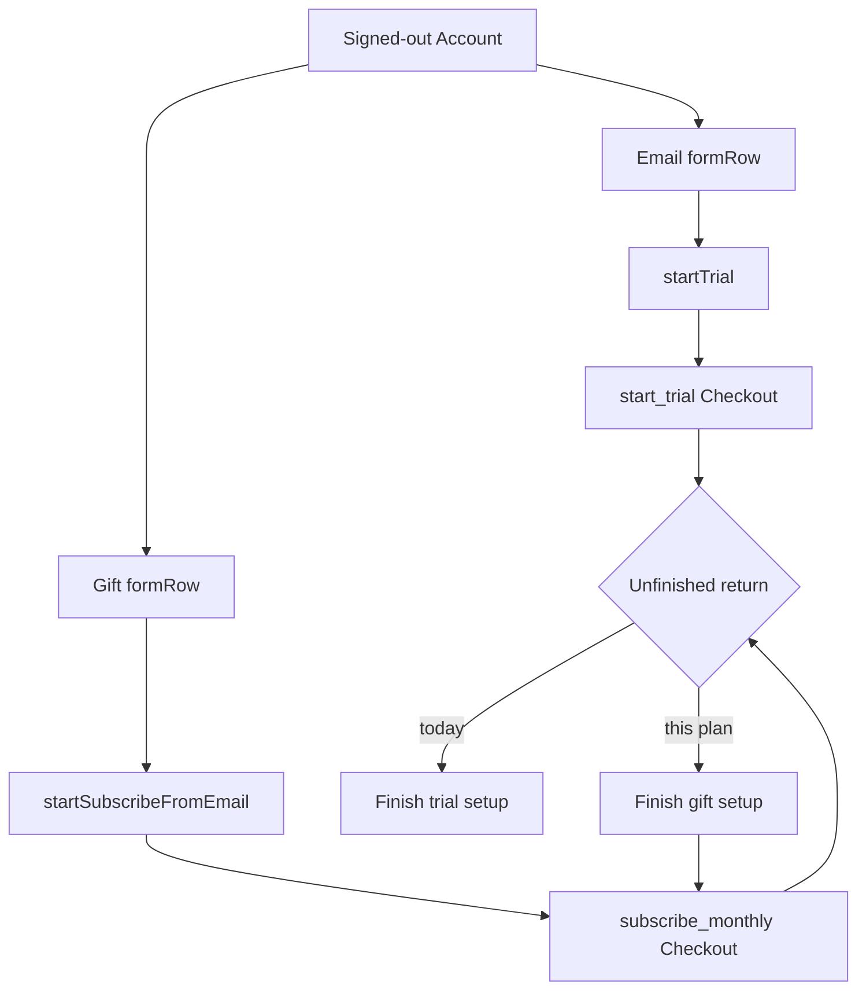

# Plus Have a code - Plan

## Goal Capsule

**Objective.** A friend with a gifted Stripe code can start Plus from Settings → Account and apply those months. They land on monthly Subscribe checkout, type the code on Stripe’s **Add promotion code** field, and receive a paid grant. They do not use **Start free trial**.

**Authority.** Session-settled 2026-08-13: mock first, then implement. Session-settled 2026-08-13: Subscribe checkout, not trial. Origin: `docs/plans/2026-08-11-001-feat-stripe-checkout-promotion-codes-plan.md` (Stripe owns the code string).

**Stop when.** HTML mock approved. Plugin Account chrome matches the picked frame. A new email opens `subscribe_monthly` Checkout. A gift start that is left unfinished never offers **Finish trial setup**. Tests pin the row list and submit wiring. Version bumped. Runbook customer path updated.

**Out of scope.** Plugin code text field. Env `ATOMS_PLUS_PROMOS` / `POST /v1/promo`. Checkout `discounts[]`. Changing trial webhook grants. tryatoms marketing. Yearly as the gift path. Customer Portal promo toggle. plus-service Checkout param changes (`allow_promotion_codes` already ships).

**Execution profile.** U1 is mock-only and stops for a human pick. U2–U5 run after that pick. Tail: simplify, code-review, compound, world-class-qa with Account screenshots.

**Product Contract preservation.** Product Contract written in this bootstrap. No upstream brainstorm to preserve.

## Product Contract

### Summary

Settings → Account will show a gift path that starts a Plus account and opens monthly Subscribe checkout. The friend types the code on hosted Checkout. The 14-day trial button stays. After you pick a mock frame, the plugin implements that frame.

### Problem Frame

Gift codes already work on Stripe Checkout. The plugin never says so. Signed-out Account only offers **Start free trial**. **Subscribe** appears after a period has ended. A friend taps the trial button, enters the code, and our webhook still grants 14-day `trialing`. Coupon duration does not rewrite that grant.

### Key Decisions

- **Mock before plugin code** `(session-settled: user-directed — chosen over implementing the row now: you asked to mock, then design)` Governs R1, R2.
- **Subscribe checkout, not Start trial** `(session-settled: user-approved — chosen over entering the code on the trial button: trial webhook only grants 14 days)` Governs R4, R5, R8.
- **Stripe owns the code string** `(see origin: docs/plans/2026-08-11-001-feat-stripe-checkout-promotion-codes-plan.md)` Governs R3. No plugin field. No `discounts[]`.

### Requirements

**Mock**

- R1. Ship an HTML mock at `docs/design-handoff/plus-promo-redeem/` that shows today’s signed-out Account and both gift layouts.
- R2. Do not write plugin chrome until you pick a signed-out frame.

**Chrome**

- R3. The plugin never collects the promotion code.
- R4. **Use a gift** (final label locked in the mock) starts monthly Subscribe checkout.
- R5. **Start free trial** stays and still opens `start_trial`.
- R6. Signed-out gift start uses that row’s email, then `startPlusAccount`, then Subscribe checkout.
- R7. An email that already has Plus gets the existing magic-link notice. No silent second start.
- R8. After a gift start, if Checkout is unfinished, Account must not offer **Finish trial setup**.
- R9. `periodEnded` keeps its Subscribe row. Add one sentence that a gift is entered at checkout.
- R10. After Checkout opens, a Notice tells the person to tap **Add promotion code** on the next page.
- R11. Copy does not say only “Have a code.” That phrase already means the Ask pairing binder.

**Entitlement**

- R12. Active Plus does not grow a gift checkout row.
- R13. A spent meter (`exhausted` while the period is live) does not open Subscribe checkout.

### Actors

- A1. Friend with a one-use Stripe promotion code, new email.
- A2. Friend whose email already has Plus.
- A3. Operator who minted the code.

### Key Flows

- F1. New email gift
  - **Trigger:** A1 opens Settings → Account, types email on the gift row, submits.
  - **Steps:** Soft session install. Monthly Subscribe Checkout opens. A1 taps **Add promotion code**, pays $0 (card may still be collected). Webhook grants `active` monthly. Plugin poll shows Plus.
  - **Covered by:** R4, R6, R10.
- F2. Email already has Plus
  - **Trigger:** A2 submits the gift row with an entitled email.
  - **Steps:** 409 / needsMagicLink. Notice: send a sign-in link above. No Checkout.
  - **Covered by:** R7.
- F3. Gift start left unfinished
  - **Trigger:** A1 starts gift checkout, closes the tab, returns to Account.
  - **Steps:** Status is gift-incomplete, not trial-incomplete. Primary action finishes **Subscribe** checkout.
  - **Covered by:** R8.
- F4. Ended period
  - **Trigger:** A2 is signed in with `periodEnded`.
  - **Steps:** Existing Subscribe row. Copy mentions entering a gift at checkout.
  - **Covered by:** R9.

### Acceptance Examples

- AE1. Covers R5, R6. Given signed-out Account, when the Email row is submitted, `startTrial` runs. When the gift row is submitted, the gift handler runs with that field’s email and is not `startTrial`.
- AE2. Covers R8. Given a soft session created by the gift handler, when Account redraws, the button is not **Finish trial setup** and the checkout kind is not `start_trial`.
- AE3. Covers R7. Given `startPlusAccount` returns needsMagicLink, when the gift row is submitted, Checkout does not open.

### Success Criteria

A friend can follow the mock without a side note from A3, except the Stripe-hosted **Add promotion code** tap that R10 names in a Notice.

### Scope Boundaries

- No plugin code field. No env promo redeem. No trial grant rewrite. No tryatoms page. No yearly gift path.
- **Deferred to follow-up:** Stripe `custom_text` on subscribe sessions. Customer Portal promo toggle. Yearly Subscribe as a second gift button.

### Sources

- Origin promo contract: `docs/plans/2026-08-11-001-feat-stripe-checkout-promotion-codes-plan.md`
- Account chrome: `src/settings/settings.ts`, `src/settings/rows.ts`, `CONCEPTS.md` row grammar
- Tests: `test/settings.test.ts`, `test/settingsRows.test.ts`
- Mock pattern: `docs/design-handoff/atoms-plus/`
- Learnings: `docs/solutions/architecture-patterns/a-rule-that-keeps-producing-an-ugly-shape-is-missing-a-kind.md`, `docs/solutions/security/session-install-must-disarm-on-identity-change.md`, `docs/solutions/logic-errors/a-device-may-not-assert-an-entitlement-the-server-has-not-confirmed.md`

No external Stripe landscape pass. Local Checkout already sends `allow_promotion_codes`.

## Planning Contract

### Key Technical Decisions

- KTD1. **Sibling of `startTrial`, never `openSubscribeCheckout`.** After `startPlusAccount` the session is `inactive`. `openSubscribeCheckout` treats a successful refresh with no lapse as “already active” and refuses Checkout. Gift start clones `startTrial` and calls `createCheckout(..., "subscribe_monthly")`. (session-settled: user-approved — chosen over wiring the existing Subscribe helper: that helper is the lapse path only)
- KTD2. **Default chrome is a second `formRow`.** One email, two commit buttons is illegal on `formRow` (`test/settingsRows.test.ts`; `CONCEPTS.md` form kind). A seventh kind is only in play if the mock pick is that layout. Governs R1.
- KTD3. **Gift-incomplete is not `trialIncomplete`.** `installPlusSession` of an inactive session currently redraws **Finish trial setup** → `start_trial`. That undoes R4/R8. Split the state or retarget the unfinished CTA to Subscribe checkout. Governs R8.
- KTD4. **U1 stops for a human pick.** No plugin unit starts until the mock README records the chosen frame. (session-settled: user-directed — chosen over implementing first)
- KTD5. **In-flight action id is new.** Do not share `plus:subscribe-checkout` with the `periodEnded` Subscribe row. Double-tap must hold the gift row only.
- KTD6. **Session install goes through `installPlusSession`.** Identity change must disarm Ask. Then `refreshFromExternalSettings` so the open Account page redraws. Cite `docs/solutions/security/session-install-must-disarm-on-identity-change.md` and `docs/solutions/logic-errors/a-session-write-is-not-a-settings-redraw.md`.
- KTD7. **Arm awaiting-checkout only when Checkout returns a URL.** Same resume poll as trial/subscribe. Do not coalesce announce onto one shared promise.

### High-Level Technical Design

### Implementation Constraints

- Row grammar stays six kinds unless the mock pick requires a seventh.
- `createCheckout` body stays `{ kind }`. No plus-service deploy for this claim if live Checkout already shows the promo link.
- Version bump on the plugin chrome change.
- Voice: `docs/voice.md`. No em dashes. No “promo” / “coupon” / “redeem” in plugin chrome.

### Sequencing

U1 mock and stop. Human picks extra `formRow` vs seventh kind. Then U2 tests, U3 gift start, U4 unfinished state, U5 copy/docs/version.

## Implementation Units

### U1. Mock Account gift frames

**Goal.** You can open a browser mock of today’s Account and both gift layouts, then pick one.

**Requirements:** R1, R2, R11.

**Dependencies:** none.

**Files:**
- `docs/design-handoff/plus-promo-redeem/index.html` (create)
- `docs/design-handoff/plus-promo-redeem/README.md` (create)

**Approach:**
1. Clone tokens, phone frames, and the review gate from `docs/design-handoff/atoms-plus/`.
2. Draw today’s signed-out destination (Skip the API key, Sign in, Email, paste), not the old unused S1 promo card.
3. Frame A: extra `formRow` after Email.
4. Frame B: one email, two commits (shown so you can reject it).
5. Also: gift-incomplete signed-in, `periodEnded` copy, Notice + Checkout with **Add promotion code** marked.
6. README: states table, draft copy, “do not implement until picked.”

**Execution note:** This unit is HTML only. Stop for the pick before U2.

**Test expectation:** none -- static design-handoff HTML.

**Verification:** README lists frames. You have named A or B (or marked copy) in chat or on the README.

### U2. Pin Account gift wiring in tests

**Goal.** Failing tests describe the picked chrome and the gift submit path.

**Requirements:** R5, R6, R8. Covers AE1, AE2.

**Dependencies:** U1.

**Files:**
- `test/settings.test.ts`
- `test/settingsRows.test.ts` (only if frame B / seventh kind)
- `test/filingAuth.test.ts` or the existing `deriveAccountState` cases in `test/settings.test.ts` if state splits

**Approach:**
1. Extend `"offers account setup and no Manage row when signed out"` so `rowNames` / `buttonLabels` match the picked frame.
2. Add a gift case to `"each account form row submits its own field"`: the gift handler receives the typed email and is not `startTrial`.
3. Add a redraw case: a gift-started inactive session does not expose **Finish trial setup**.

**Execution note:** Write the failing tests before plugin chrome.

**Test scenarios:**
- Signed-out `rowNames` equals the picked list. Email still has only **Start free trial**.
- Gift row submit calls the gift handler with the trimmed email from that field.
- Gift-started inactive session: no **Finish trial setup** button.
- Frame B only: the new kind renders one input and two buttons; other kinds still refuse that pairing.

**Verification:** Tests fail on current master for the new assertions.

### U3. Gift start from signed-out Account

**Goal.** A new email opens monthly Subscribe checkout.

**Requirements:** R3, R4, R6, R7, R10. Covers AE1, AE3.

**Dependencies:** U2.

**Files:**
- `src/settings/settings.ts`
- `test/settings.test.ts`

**Approach:**
1. Add `startSubscribeFromEmail` as a clone of `startTrial`: `requireEmail` → `startPlusAccount` → needsMagicLink notice → `installPlusSession` → `createCheckout(..., "subscribe_monthly")` → `setAwaitingCheckout` when a URL returns → `window.open` → Notice per R10 → `refreshFromExternalSettings` / `redisplay`.
2. Do not call `openSubscribeCheckout` (KTD1).
3. New in-flight action id (KTD5).
4. Render the picked signed-out chrome. Default: extra `formRow`.

**Patterns to follow:** `startTrial`, `installPlusSession`, existing Checkout Notice + poll.

**Test scenarios:**
- needsMagicLink: Notice, no `window.open`.
- Happy path: checkout kind is `subscribe_monthly`, awaiting-checkout set only when `url` is present.
- `startTrial` still requests `start_trial`.

**Verification:** U2 wiring tests pass for signed-out submit. Trial path unchanged.

### U4. Gift-incomplete is not trial-incomplete

**Goal.** Leaving gift Checkout does not send the friend into a 14-day trial.

**Requirements:** R8. Covers AE2.

**Dependencies:** U3.

**Files:**
- `src/settings/settings.ts` (`AccountState`, `deriveAccountState`, `accountRowDescriptor`, `renderSignedInAccount`)
- `test/settings.test.ts`

**Approach:**
1. Split `trialIncomplete` or retarget unfinished CTA from a local gift-awaiting signal. Sealed `AccountState` must stay exhaustive (`accountRowDescriptor` already fails the build on a missing branch).
2. Gift-incomplete primary action calls Subscribe checkout, not `openTrialCheckout`.
3. True trial starts still use **Finish trial setup**.

**Test scenarios:**
- Inactive session after `startSubscribeFromEmail`: descriptor and button are gift-finish, checkout kind `subscribe_monthly`.
- Inactive session after `startTrial`: still **Finish trial setup** / `start_trial`.
- A fifth `AccountState` without a descriptor branch fails typecheck.

**Verification:** AE2 holds. Trial unfinished path still works.

### U5. Copy, runbook, version

**Goal.** Operator and friend see the same path. Desktop/phone builds are identifiable.

**Requirements:** R9, R11.

**Dependencies:** U4.

**Files:**
- `src/settings/settings.ts` (`periodEnded` Subscribe desc)
- `docs/runbooks/atoms-plus-prod.md` customer bullet
- `docs/qa/app-navigation-map.md`
- `manifest.json`, `package.json`, `versions.json`

**Approach:**
1. Lock labels from the approved mock. Avoid bare “Have a code.”
2. Update the runbook: Settings → gift row → monthly Checkout → **Add promotion code**. Not Start trial.
3. Bump plugin version.

**Test expectation:** none -- copy and version metadata. Existing Account tests still pass.

**Verification:** Runbook and nav map name the gift row. Version visible in Settings.

## Verification Contract

| Gate | Command / evidence | When |
|---|---|---|
| Unit | `npm test` (`test/settings.test.ts`, `test/settingsRows.test.ts` if touched) | U2–U4 |
| Typecheck / bundle | `npm run build` | After U4 |
| Lint | `npm run lint` if `src/**` UI changed | After U3–U4 |
| Live vault | `./scripts/install-to-vault.sh` then Settings → Account screenshots under `docs/qa/screenshots/plus-have-a-code/` | After U5, before PR |
| Checkout | Dogfood or test-mode Subscribe Checkout shows **Add promotion code**. Do not use production `FRIEND-454C92` for QA. | After U3 |
| Shipping tail | simplify, code-review, compound, world-class-qa | After impl |

## Definition of Done

- U1 mock exists and a frame is recorded.
- U2–U4 tests pass. Gift start never calls `openSubscribeCheckout`. Gift-incomplete never opens `start_trial`.
- R3 still true: no plugin code field.
- Version bumped. Runbook customer path matches the chrome.
- Abandoned mock-B seventh-kind code is absent if A was picked.
- PR Test plan boxes match real runs. UI PR includes Account screenshots.

## Risks

- Reusing `openSubscribeCheckout` silently blocks new emails.
- Mapping gift soft-session to `trialIncomplete` spends the friend’s code on a 14-day grant if they also enter it on trial Checkout.
- Extra email row: the friend fills trial and leaves gift empty. Copy on the gift row must say that row’s email is the one that starts Subscribe.
- Live `active` + a Subscribe checkout is a second subscription. R12/R13 keep that row off those states.
- Pairing-code copy collision if the mock keeps “Have a code.”
