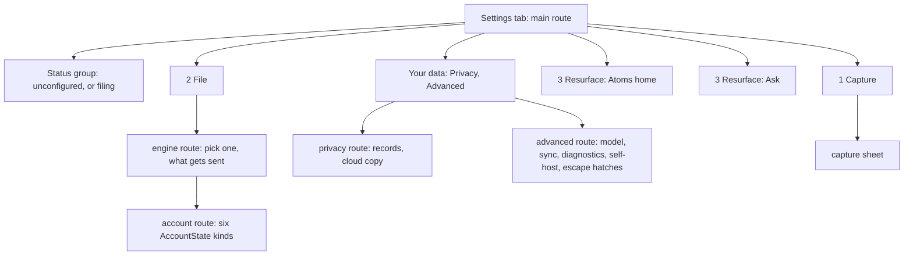
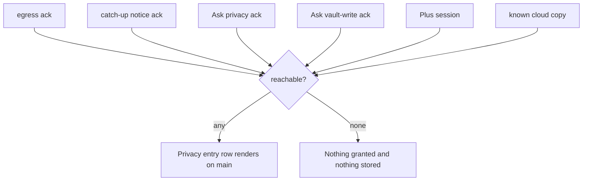

# Settings three-leg overhaul - Plan

## Goal Capsule

**Objective.** Restructure the Atoms settings tab so a new user can tell what the plugin does, whether it is working, and what to do next. Group the main screen by the product's three legs under a status statement. Replace per-row descriptions with one footer per group so a row is a name and a control again. Move records, diagnostics, and escape hatches off the root.

**Authority.** `docs/design-handoff/settings/` (committed `811d5ea`) is the design spec: `overhaul.html` for the main screen, Advanced, privacy, and the capture sheet; `account.html` for Atoms Plus; `README.md` for the findings and the 34-row coverage audit. `docs/design-handoff/tokens/README.md` governs visual treatment. `docs/voice.md` governs copy. `CLAUDE.md` non-negotiables outrank all of them.

**Stop when.** The main screen renders a status group, three legs, and a utility group; every row from the coverage audit has a home; the consent revocation surface is reachable under every disjunct; the signed-out root is re-measured at 390px against the 3,444px / 30-term baseline and both numbers recorded; `DIRECT_SETTING_BUDGET` has not risen; the nine account renders still produce today's row lists; `npm test`, `npm run lint`, and `npm run build` pass; phone and tablet evidence captured.

**Out of scope.** The buy-now / trial-eligibility change (its own plan). Splitting `settings.ts` (KTD3). Any change to `AccountState`'s six kinds. Any edit to a versioned disclosure or ack-standing string (KTD5). Re-shaping the locked promo-code email cluster; restyling it to the v2 tokens is in scope. Re-shaping the account screen's actions (KTD14). The #364 C1 header scrim (KTD15).

**Execution profile.** U1 is foundation. U2-U9 each mutate the shared `expectedRows()` fixture and therefore land **sequentially, not in parallel** (KTD12). U11 closes the copy and test lockstep.

**Hard-claim prerequisite.** No issue covers this work. #364 covers C1 and C2; C2 is addressed here by R17, while C1 ships as its own PR (KTD15) which closes the issue. Per `docs/collab.md`, create and assign a GitHub Issue, add a `STATUS.md` row, and open a draft PR before implementation.

---

## Product Contract

### Summary

Regroup the settings main screen under a status statement into the product's three legs, move explanation from rows into per-group footers on a new grouped-list primitive, and relocate consent records, diagnostics, and escape hatches to destinations. No setting is removed and no consent gate moves.

### Problem Frame

Issue #304 cut the settings screen from ~90 rendered rows to 15 by giving every row a grammar. That work holds. The complaint has changed shape since: users cannot tell *how to do things*.

Two measurements on the live tab at 0.7.11 explain why. Rendered at 390px the signed-out screen is **3,444px — 4.1 phone screens**, and six rows exceed 144px because each carries a paragraph; `Anthropic API key` alone is 211px. Row count was never the mobile problem. Row *height* is, and row height is copy. Separately the screen carries **30 distinct terms** a four-minute-old user cannot know, nine before the first control they could confidently touch.

Underneath both: the screen never says whether Atoms is working. A signed-out install with no API key cannot file anything and renders almost identically to one that files happily. Two headings, `Filing` and `Automatic filing (this device)`, own unrelated things. The one mandatory decision — who does the filing — is presented as two optional sections five headings apart, one labelled *optional*.

A copy-only intervention (shorten the six oversized paragraphs, cut the nine terms above the first control) would recover height without a new primitive. It is rejected because it leaves the three defects that are not about height: the unanswered "is Atoms working", the split filing decision, and consent records that shout louder than the switches granting them.

### Key Decisions

- KD1. **Group by the product's own three legs.** (session-settled: user-directed — chosen over three groups derived from user questions: the north star already names Capture, File + link, Resurface, and a parallel vocabulary drifts from the SSOT.) Governs R1, R3.
- KD2. **Mobile-first is the design canvas.** (session-settled: user-directed — chosen over desktop-modal-first: the plugin is mobile-primary, and the screen measures 4.1 phone screens at 390px.) Governs R2, R14.
- KD3. **The v2 tokens govern the visual treatment.** (session-settled: user-directed — chosen over the bespoke palette first drafted: `docs/design-handoff/tokens/README.md` had already diagnosed that treatment as reading generic and AI-designed.) Governs R14.
- KD4. **Ask needs a service session, not a paid subscription.** (session-settled: user-directed — chosen over copy that gated Ask behind Plus: `docs/ask-self-host.md` documents a self-hosted `plus-service` with a local grant as a supported route.) Governs R13.
- KD5. **Ask sits under Resurface as a second group.** Chosen over a standalone Ask section outside the three legs: from the user's view Ask answers the same question Resurface does, how thoughts come back, just outside Obsidian. Inherited from the mock rather than settled in conversation; see Open Questions. Governs R3.

### Requirements

**Structure**

- R1. The main screen groups its rows under the product's three legs from `docs/architecture.md` § North star: Capture, File + link, Resurface.
- R2. Each main-screen group carries a header and exactly one explanatory footer; groups on destination screens may omit the footer. Rows carry a name, an optional one-line subtitle, and a control.
- R3. Leg 3 renders two groups: Atoms home, and Ask. They are independent features with independent state and one footer cannot serve both.
- R4. A utility group holds the Privacy and Advanced destinations.
- R5. Every row in the coverage audit at `docs/design-handoff/settings/README.md` § Coverage audit has a home. No setting is removed.
- R18. The main screen opens with a status group stating whether Atoms is filing, and carrying the single next step when it is not. It renders two variants: unconfigured, and filing.

**Row content rules**

- R19. When a row's explanation cannot live in the group footer, it escalates: a one-line subtitle that does not wrap at 390px, then a sheet or destination. A rule the user needs in order to predict behavior is never deleted in the footer sweep.
- R20. A row's right-aligned value truncates before the row name does, and every derived value declares an unknown state rather than rendering blank.

**Consent and gates**

- R6. Every money, egress, and vault-write *gate* stays on the main screen or on the engine destination that hosts its credential. Only the passive record of a consent moves.
- R7. The consent revocation surface is reachable whenever any revocable grant is live: the egress ack, the catch-up notice ack, the Ask privacy ack, or the Ask vault-write ack. The parent entry row's render condition is at least as loose as the union of those four, and additionally renders while a Plus session or a known cloud copy exists.
- R8. Versioned disclosure strings and ack-standing strings are unchanged. No ack version is bumped, so no device is re-prompted.

**New-user comprehension**

- R9. The status group states what Atoms does before the screen offers a control.
- R10. The screen states that Atoms never captures for the user.
- R11. The screen states that capture text is never rewritten, and that Atoms only creates atom files, appends marker lines, and writes inside its own delimited hub block.
- R12. When filing is configured, the screen states when the first atoms arrive, so intended day-one silence does not read as breakage.
- R13. Ask is described as needing a session from the Atoms service, not a paid subscription. The self-host route is named on the Advanced screen, not on the main screen.

**Craft**

- R14. Visual treatment follows `docs/design-handoff/tokens/README.md` v2: flat surfaces, no accent-tinted card fills on non-transient surfaces, no accent borders, no decorative icon chips, `--interactive-accent` as the single tint.
- R15. Copy follows `docs/voice.md`: no em dashes, no guilt language, no homework, no invented pricing.
- R17. Consent records do not render louder than the switches that grant consent (#364 C2).
- R21. Every row this plan makes reachable only by chevron is keyboard-reachable and meets a 44px target.

### Scope Boundaries

- Restructures the settings tab only. No pipeline, Ask, or plus-service behavior changes.
- `AccountState` keeps its six kinds. The nine renders are existing variants of `active` and `periodEnded`.

#### Deferred to Follow-Up Work

- The buy-now / trial-eligibility change: `subscribe_yearly` unreachable from the plugin, and the 409 a returning lapsed user gets from `Start free trial`. Own plan; server plus client. It ships **after** this plan only because it re-shapes account-screen action rows this plan restyles; landing it first would mean restyling rows twice. That ordering is a bet worth disagreeing with, since the deferred defect blocks paid conversion today.
- The post-checkout resume poller does not call `refreshFromExternalSettings()` (`src/platform/plusResume.ts`). Pre-existing.
- `FROZEN_CONSENT` in `test/egressConsentParity.test.ts` goes green when an existing entry's string is edited in place.
- The #364 C1 header scrim: one CSS rule giving the settings header an opaque backing. Its own PR, closing #364. Find the real selector by unpacking `app.css` with `npx asar extract` rather than guessing specificity. Park a File group toggle row under the header at 390x844 as the fixture: U6 moves the record row the issue used off the main screen.
- Account-screen action re-shaping: one primary action per state, `Ended` versus `Renews`, and `Sign out all devices` off its own row. Belongs to the buy-now plan, which rewrites those rows and owns `account.html` as its target.

#### Outside this product's identity

- A declarative `getSettingDefinitions()` migration.

---

## Planning Contract

### Key Technical Decisions

- KTD1. **`group()` is a container in `src/settings/rows.ts`, not a row kind.** It takes `{ header, footer, render: (el) => void }` and returns `void`, mirroring `renderDestination` (`src/settings/settings.ts:773`). Every builder already takes `containerEl` first, so rows compose in with no signature changes. Precedent for a kind over a flag: `docs/solutions/architecture-patterns/a-rule-that-keeps-producing-an-ugly-shape-is-missing-a-kind.md`; the reason was testability, so `group()` joins the chainable-return array at `test/settingsRows.test.ts:571`.

- KTD2. **`group()` lives in `rows.ts` so the budget guard stays flat.** `DIRECT_SETTING_BUDGET` (`test/settingsRows.test.ts:1091`, currently 5) counts `new Setting(` **occurrences** in `src/settings/settings.ts` with comments stripped. `settingHeading()` holds one occurrence at `src/settings/settings.ts:289` shared by ten call sites, and the vocabulary destination keeps calling it, so retiring call sites cannot move the count. Expect the budget to stay at 5; it falls only if an inline construction is deleted. Grouping chrome built in `settings.ts` breaks the guard immediately — there is zero headroom.

- KTD3. **`settings.ts` is not split.** The budget guard reads that one path off disk, so moving `new Setting(` sites into new modules would let them escape the ratchet silently. (session-settled: user-approved — chosen over extracting the account screen while restyling it: the guard's file-scoped read makes the split unsafe until the guard moves with it.)

- KTD4. **Group footers render as `p.setting-item-description` plus an `atoms-setting-group-foot` class.** `prose(tab)` (`test/helpers/settingsTab.ts:211`) selects `p.setting-item-description`; a footer with only a bespoke class makes every prose assertion silently blind. The footer is prose only: no unit in this plan needs an action inside it, and an unused affordance on a shared primitive is the speculative generality the row grammar exists to avoid.

- KTD5. **The copy pass stops at versioned and standing strings.** Frozen: `EGRESS_DISCLOSURE`, `EGRESS_ACK_TITLE`, `ASK_PRIVACY_DISCLOSURE`, `ASK_WRITE_DISCLOSURE` and their titles; plus `ACK_STANDING_SUFFIX` (`src/settings/settings.ts:424`) and the three egress-record standing strings (`:2072-2081`). The standing strings live in the file this plan rewrites, are covered by no ack version and no `FROZEN_CONSENT` entry, and are passed into the withdrawal sheet as its granted line. Rewrite labels, row subtitles, and the new group footers only.

- KTD6. **The Privacy entry row renders under the union of every revocable grant, plus a session or a cloud copy.** Egress permission is an OR of two grants (`src/settings/settings.ts:2066-2082`); gating the parent on one disjunct re-creates `docs/solutions/logic-errors/narrowing-one-grant-removed-the-only-way-to-revoke-the-other.md` one level up. The session and cloud-copy disjuncts exist because `Wipe cloud copy` moves onto this screen while withdrawing an ack clears the acks and `askEnabled` **without** wiping the mirror (`:2508-2516`) — without them, a user who withdraws consent keeps a cloud copy with no way to delete it.

- KTD7. **`AccountState` keeps its six kinds and `accountRowDescriptor` stays the single rendering authority.** The nine screens are `active` split by `status` and `periodEnded` split by `lapseKind`. The union exists because the cluster was once four hand-maintained `if` branches that drifted. `periodEnded` keeps carrying `lapseKind`, and the billing-portal row keeps requiring positive proof of a subscription.

- KTD8. **`formActionsRow` keeps its stacked layout inside a group.** `docs/solutions/ui-bugs/a-right-edge-floor-that-saves-one-button-does-not-save-three.md` records that one field with three commits must stack. A uniform group row layout that un-stacks it crushes the name column.

- KTD9. **Two new routes join `SettingsRoute`: `engine` and `privacy`.** The union is switched with `const _exhaustive: never` (`src/settings/settings.ts:768`), pinned by a `@ts-expect-error` at `test/settingsRows.test.ts:1068`. Each needs a branch, a `DESTINATION_TITLES` entry (`:410`), and a row in the order-sensitive `DESTINATIONS` table (`test/settingsRows.test.ts:989`). Because the Privacy entry row is grant-gated while that table is walked unconditionally against the ack-free `SESSION` fixture (`:1000`), seed a grant into the fixture in the same change or `open()` throws.

- KTD10. **Any label renamed *or moved to another screen* requires a matching `www` edit in the same PR.** `test/wwwSetupLabels.test.ts` pins plugin labels against `www/src/setup.html.tmpl`, including `buttonLabels(tab, "Capture Atom shortcut")` containing the install CTA — which U9 empties by moving the action into a sheet.

- KTD11. **The status group and Atoms home's first-day wall read one source of truth.** `firstDaySetupCopy` (`src/home/atomsHomeData.ts:900`) already computes what is unfinished for home. Two hand-maintained copies of "what is not set up yet" is the twin-bug shape; extend that function to serve both, home as a card and settings as a line.

- KTD12. **U2-U9 land sequentially.** They all mutate `expectedRows()` (`test/settings.test.ts:1943`) and its `toHaveLength` assertions at `:1967`, `:1978`, `:1986`; U7 also mutates the exact Advanced list at `:1836`. Each unit updates the fixture for the rows it moves; U11 does the final full-list confirmation.

- KTD14. **U8 restyles the account screen without re-shaping it.** The row list per state stays identical; only grouping and token treatment change. (session-settled: user-directed — chosen over restyling and re-shaping together to match `account.html`: every measurement justifying this plan is main-screen, and the deferred buy-now plan rewrites the same action rows, so deciding which action is primary here means deciding it twice.) `account.html` becomes the buy-now plan's target rather than this one's. Governs R5, R14.

- KTD15. **The header scrim ships separately.** #364 C1 is a one-file CSS fix sharing no code, dependency, or test with this restructure, and folding it in would gate an unrelated fix behind an eleven-unit plan and force a test-exemption carve-out. (session-settled: user-directed — chosen over closing #364 whole in this PR.) R17, the other half of #364, stays here because relocating consent records is this plan's own work.

- KTD13. **`destinationRow` gains keyboard activation in U1.** It reaches its target with a click listener on `settingEl` plus `mod-clickable` (`src/settings/rows.ts:90-95`) with no `tabindex`, `role`, or key handler. This plan multiplies chevron rows, so without this every relocated setting becomes mouse-and-touch only.

### High-Level Technical Design

Revocation reachability, the invariant KTD6 protects:

### Assumptions

- `rowNames()` queries `tab.containerEl.querySelectorAll(".setting-item")` (`test/helpers/settingsTab.ts:198`) — a descendant query, so nesting rows in a wrapper div is safe. But content rendered into a `Modal` sits outside `containerEl`, so U9's sheet assertions use the harness's `sheet()` / `sheetText()` / `pressSheet()` helpers.
- `rowNames()` includes headings today only because `settingHeading()` builds them from a `Setting`. A `createEl` group header is invisible to it, so U1 adds a `groupHeaders(tab)` helper and U11's `expectedRows()` rewrite drops headings from the row list rather than renaming them.
- The settings tab has no wrapper-div precedent; the only `createDiv` sits inside a row's `descEl` (`src/settings/settings.ts:1884`). `group()` is the first nesting element the tab has had, so U1 proves it on device before anything depends on it.

### Sources

- Live measurement at 390px, 0.7.11, Obsidian 1.13.6: `docs/design-handoff/settings/README.md`.
- Kind-versus-flag precedent: `docs/solutions/architecture-patterns/a-rule-that-keeps-producing-an-ugly-shape-is-missing-a-kind.md`.
- Revocation failure this plan must not repeat: `docs/solutions/logic-errors/narrowing-one-grant-removed-the-only-way-to-revoke-the-other.md`.
- Frozen-wording hazard: `docs/solutions/security/a-consent-parity-test-that-freezes-words-does-not-freeze-behavior.md`.
- External-refresh contract: `docs/solutions/logic-errors/a-session-write-is-not-a-settings-redraw.md`.
- Tablet stacking precedent: `styles.css:2008` records that Obsidian's row stacking is gated on `.is-phone`, so neither it nor the phone rule fires on `is-tablet` — the #347/#348 regression that squeezed iPad inputs.
- Obsidian chrome specificity: unpack `app.css` with `npx asar extract` rather than guessing.

---

## Implementation Units

| U | Title | Key files | Depends on |
|---|---|---|---|
| U1 | Grouped-list primitive | `rows.ts`, `styles.css`, `settingsRows.test.ts` | — |
| U2 | Status group | `settings.ts`, `atomsHomeData.ts`, `settings.test.ts` | U1 |
| U3 | Capture and File legs | `settings.ts`, `settings.test.ts` | U2 |
| U4 | Engine destination | `settings.ts`, `settings.test.ts`, `settingsRows.test.ts` | U3 |
| U5 | Resurface leg | `settings.ts`, `setup.html.tmpl`, `www/dist/` | U4 |
| U6 | Privacy destination | `settings.ts`, `settings.test.ts`, `settingsRows.test.ts` | U5 |
| U7 | Advanced destination | `settings.ts`, `settings.test.ts` | U6 |
| U8 | Account screen, restyle only | `settings.ts`, `settings.test.ts` | U7 |
| U9 | Capture sheet | `settings.ts`, `captureShortcut.ts`, `wwwSetupLabels.test.ts` | U8 |
| U11 | Copy lockstep, tests, version | `settings.test.ts`, manifests, `www/dist/` | U2-U9 |

U10 was the header scrim; it ships as its own PR (KTD15). U-IDs are never renumbered, so the gap stands.

### U1. Grouped-list primitive

- **Goal.** Add `group()` so rows compose inside an inset container with one header and one footer, keyboard-reachable.
- **Requirements.** R2, R14, R21.
- **Dependencies.** None.
- **Files.** `src/settings/rows.ts`, `styles.css`, `test/settingsRows.test.ts`, `test/helpers/settingsTab.ts`.
- **Approach.**
  1. `group(containerEl, { header, footer, render })` returning `void` (KTD1). Header is a `createEl` heading built in `rows.ts`, never `new Setting(` (KTD2).
  2. Emit `atoms-setting-group` and `atoms-setting-group-foot`; the footer paragraph keeps `setting-item-description` (KTD4).
  3. CSS rule ships with the class, covering `.is-phone .modal` **and `is-tablet`** — `styles.css:2008` records that Obsidian's stacking is `.is-phone`-gated, which is the #347/#348 iPad regression.
  4. Give `destinationRow` and clickable group rows `tabindex="0"`, `role="button"`, and Enter/Space sharing the click handler (KTD13).
  5. Add a `groupHeaders(tab)` harness helper, since `createEl` headers leave `rowNames()`.
- **Execution note.** Prove the container at 390px **and 768px** before any caller depends on it.
- **Test scenarios.**
  - `group()` returns `undefined`, alongside the other builders.
  - Three rows render one header, three `.setting-item` children, one footer.
  - `rowNames()` finds nested rows in document order; `groupHeaders()` finds headers in order.
  - `prose()` finds the footer.
  - A group with no footer renders no empty paragraph.
  - A chevron row activates on Enter and on Space, and meets a 44px target.
  - `DIRECT_SETTING_BUDGET` still passes at 5.
- **Verification.** Renders at 390×844 and 768×1024 without the input squeeze recorded for `atoms-setting-form`.

### U2. Status group

- **Goal.** Render the element that answers whether Atoms is filing.
- **Requirements.** R18, R9, R12, R14.
- **Dependencies.** U1.
- **Files.** `src/settings/settings.ts`, `src/home/atomsHomeData.ts`, `test/settings.test.ts`, `test/atomsHomeData.test.ts`.
- **Approach.**
  1. Two variants per `overhaul.html`: unconfigured renders a `Get started` header, the `Choose who files your captures` row, and a footer stating what Atoms does (R9); configured renders a `Status` header, the filing-state row, and a footer stating when the first atoms arrive (R12).
  2. Extend `firstDaySetupCopy` to serve both surfaces (KTD11) rather than computing unfinished work twice.
  3. The configured variant takes the `File automatically` toggle and a `Next run` row from the File group, so U3's File composition is state-dependent.
  4. Any soft fill here is the token system's sanctioned transient-status carve-out, not a violation of R14.
- **Test scenarios.**
  - Unconfigured: the status group renders first, states what Atoms does, and names one next step.
  - Configured: it states filing is on and when the first atoms arrive.
  - The File group sheds the filing toggle in the configured variant and keeps it in the unconfigured one.
  - Settings and Atoms home agree on what is unfinished, driven from one source.
- **Verification.** Both variants render at 390×844.

### U3. Capture and File legs

- **Goal.** Replace five headings with two groups.
- **Requirements.** R1, R2, R5, R10, R11, R15, R19, R20.
- **Dependencies.** U2.
- **Files.** `src/settings/settings.ts`, `test/settings.test.ts`.
- **Approach.** Capture group: daily notes status, `Capture on your phone`. File group: engine entry row (opens the `engine` route), atom folder, tags entry row, hub lists, hub-list refresh under its toggle, plus the filing toggle when the status group does not own it. Move each row's paragraph into the owning footer; footers carry R10 and R11. Rules that the footer cannot carry escalate per R19 — the atom folder's `..`/subfolder rule keeps a subtitle, because `clampAtomFolder` (`src/pipeline/render.ts:114-125`) silently rewrites an invalid path with no error surface and that description is the only thing explaining it.
- **Execution note.** Read every footer alone on a phone. `docs/voice.md`: a line that passes inside a paragraph can fail once it is the only sentence on screen.
- **Test scenarios.**
  - Capture and File headers render in order.
  - The engine row states which engine is active, or that none is chosen, and opens the engine route.
  - The atom folder row still rejects `..` and subfolders, **and still states that rule to the user**.
  - Hub-list refresh appears only while its toggle is on.
  - Prose asserts R11's accurate promise renders, naming markers and the delimited hub block.
  - An overlong atom folder value truncates before the row name does.
  - No footer contains an em dash.

### U4. Engine destination

- **Goal.** Build the screen the engine row opens, and give the API key row a home.
- **Requirements.** R5, R6, R2.
- **Dependencies.** U3.
- **Files.** `src/settings/settings.ts`, `test/settings.test.ts`, `test/settingsRows.test.ts`.
- **Approach.** Add `engine` to `SettingsRoute`, `DESTINATION_TITLES`, the `display()` switch, and `DESTINATIONS` (KTD9). Render the `Pick one` group (Atoms Plus row opening the account route; `My own Anthropic key` row hosting `Anthropic API key`) and the `What gets sent` group, per `overhaul.html`. The device-local key fallback toggle stays beside the key field it deletes, never in Advanced — `src/settings/settings.ts:985-988` records that the pair is a complete credential path enabling Anthropic spend and that the toggle is the only thing deleting the stored key (R6).
- **Test scenarios.**
  - The engine route renders both groups and is reachable from the File group.
  - `Anthropic API key` renders here and still stores through SecretStorage.
  - The device-local fallback toggle renders beside the key field and still deletes the stored key when turned off.
  - Route exhaustiveness compiles; `DESTINATIONS` walk finds the entry.

### U5. Resurface leg

- **Goal.** Render Atoms home and Ask as two groups, with honest Ask copy.
- **Requirements.** R1, R3, R13, R15.
- **Dependencies.** U4.
- **Files.** `src/settings/settings.ts`, `test/settings.test.ts`, `www/src/setup.html.tmpl`, `www/dist/`.
- **Approach.** Atoms home group carries one entry row opening the home view via the existing `open-home` command, so the group has a control rather than a header and footer alone. Ask group holds the mirror switch, the vault-write switch, and connected apps. Signed out, Ask is one row reading `Off`; its footer says Ask needs a session from the Atoms service and does **not** introduce self-hosting on the main screen (R13). Commit the rebuilt `www/dist` output alongside any template edit (KTD10, and the diff gate below).
- **Test scenarios.**
  - Signed out, the Ask group renders one row and no ack toggles.
  - The Atoms home row opens the home view.
  - Signed in, both switches render; vault-write stays disabled until the privacy ack is current.
  - The mirror status line renders its failing state distinguishably.
  - `test/wwwSetupLabels.test.ts` passes.

### U6. Privacy destination

- **Goal.** Move the three passive records without narrowing revocation or stranding the cloud copy.
- **Requirements.** R4, R6, R7, R17.
- **Dependencies.** U5.
- **Files.** `src/settings/settings.ts`, `test/settings.test.ts`, `test/settingsRows.test.ts`.
- **Approach.** Add the `privacy` route (KTD9) and seed a grant into the `SESSION` fixture so the unconditional `DESTINATIONS` walk still finds the entry row. Render records with `renderAckRecord`, carrying `ACK_STANDING_SUFFIX` standing text. The entry row renders under the six-way union in KTD6 and carries a subtitle naming what is on record, following the connect row's status-line precedent (`src/settings/settings.ts:2666-2674`). Records lose their accent buttons (R17). Cloud-copy count and `Wipe cloud copy` move here.
- **Execution note.** Test each grant open before testing it closed. A property test that walks rendered rows cannot catch a required row that renders zero times.
- **Test scenarios.**
  - For each of the four grant disjuncts **alone**, including each Ask ack with no egress grant, the entry row renders and the record is reachable.
  - With no grant but a live Plus session, or a known cloud copy, the entry row still renders so `Wipe cloud copy` is reachable.
  - With no grant, no session, and no cloud copy, it does not render.
  - Withdrawing the Ask privacy ack still clears the vault-write ack.
  - Both Ask records stay reviewable after Plus sign-out.
  - No permanent acknowledgment toggle renders.
  - The back row is first on the destination.
  - The `describe("the acknowledgment record")` block at `test/settings.test.ts:1120` and the no-permanent-toggle test at `:1426` navigate the route instead of reading the main render.

### U7. Advanced destination

- **Goal.** Absorb diagnostics, manual sync, self-host, and escape hatches.
- **Requirements.** R4, R5, R13, R15.
- **Dependencies.** U6.
- **Files.** `src/settings/settings.ts`, `test/settings.test.ts`.
- **Approach.** Groups: model; sync (`Sync when you return`, `Sync everything now`); this device (last filing run, last catch-up); run Ask yourself (service URL, self-host guide) whose footer carries the two constraints the guide is emphatic about — set the URL before sign-in, and the server needs a public HTTPS address. Escape hatches hold the custom shortcut link and paste-a-session; the device-local key pair stays on the engine screen (U4). Rewrite `drain → outbox → mirror → filing` and the rest of the internal vocabulary. Update the exact ordered Advanced list at `test/settings.test.ts:1836`.
- **Test scenarios.**
  - Each relocated row renders here; the ordered Advanced list assertion is updated and passing.
  - `Sync everything now` runs the same pass it does today.
  - Advanced prose contains no internal pipeline stage names.

### U8. Account screen, restyle only

- **Goal.** Bring the account destination onto the group primitive and the v2 tokens **without changing what it renders**.
- **Requirements.** R2, R5, R14.
- **Dependencies.** U7.
- **Files.** `src/settings/settings.ts`, `test/settings.test.ts`, `test/plusSignInAccountRefresh.test.ts`.
- **Approach.** Wrap the existing rows in `group()` and apply token treatment. **The row list per state is unchanged**: same names, same order, same actions, same render conditions. `accountRowDescriptor` stays the single authority (KTD7) and gains no branches.
  - Explicitly **not** in this unit, per KTD14: reducing to one primary action per state, demoting `Refresh status` or `Manage subscription`, moving `Sign out all devices` off its own row, and the `Ended`-versus-`Renews` correction. Those re-shape action rows the buy-now plan rewrites, and belong there.
- **Execution note.** The regression bar is that nothing moved. Snapshot the nine row lists before the change and assert equality after.
- **Test scenarios.**
  - Each of the nine renders produces a row list byte-identical to the pre-change list, in the same order.
  - `periodEnded` with `lapseKind: "trial"` and with an unknown plan still renders no billing-portal row; `"subscription"` still renders it.
  - `formActionsRow` stays stacked at 390px with all three commits (KTD8).
  - A session installed through `refreshFromExternalSettings()` while the account destination is open redraws it without a back tap. The post-checkout resume path is out of scope per the deferred poller item.
- **Verification.** Nine renders match today's row lists; only grouping and token treatment differ, evidenced by screenshot.

### U9. Capture-on-phone sheet

- **Goal.** Move the six-step procedure out of a row description into a sheet.
- **Requirements.** R2, R15, R19.
- **Dependencies.** U8.
- **Files.** `src/settings/settings.ts`, `src/settings/captureShortcut.ts`, `test/captureShortcut.test.ts`, `test/settings.test.ts`, `test/wwwSetupLabels.test.ts`, `www/src/setup.html.tmpl`, `www/dist/`.
- **Approach.** The row carries a status only. The sheet carries three numbered steps, keeping the "not Ask Each Time" failure mode visible. Moving the install CTA off the row empties `buttonLabels(tab, "Capture Atom shortcut")`, which `test/wwwSetupLabels.test.ts` asserts — assert the CTA through the sheet and edit the guide in the same commit (KTD10).
- **Test scenarios.**
  - The row renders `Not set up` before install and the version after.
  - The sheet renders three steps and the install action, asserted via `sheet()` / `pressSheet()`.
  - A malformed shortcut URL is still refused with the same guidance.
  - Dismissing the sheet writes no ack.
  - `test/wwwSetupLabels.test.ts` passes against the relocated CTA.
- **Verification.** The sheet renders at 390×844 with all three steps visible.

### U11. Copy lockstep, tests, and version

- **Goal.** Close the copy pass, confirm the pinned lists, bump the version.
- **Requirements.** R5, R8, R15.
- **Dependencies.** U2-U9.
- **Files.** `test/settings.test.ts`, `www/src/setup.html.tmpl`, `www/dist/`, `package.json`, `manifest.json`, `versions.json`.
- **Approach.**
  1. Final full-list confirmation of `expectedRows()` and its three length assertions.
  2. Reconcile the coverage audit against source: enumerate every row-builder call site in `settings.ts` and diff against the 34 audit entries, so a row the live walk could not reach (state-conditional account rows, the device-local-key variant, toggle-revealed rows) is not silently dropped.
  3. Audit every added **or edited** string against `docs/voice.md`.
  4. Confirm no versioned or standing string changed and no ack version moved.
  5. Re-measure the signed-out root at 390px against the 3,444px / 30-term baseline and record both in the QA report.
  6. Bump the three manifests together.
- **Test scenarios.**
  - The main-screen row list matches for signed-out, signed-in, and device-local-key variants.
  - No product-authored string added or edited by this plan contains an em dash.
  - The three ack versions are unchanged; `test/egressConsentParity.test.ts` passes with `FROZEN_CONSENT` untouched.
  - A stranded stamp still renders "against different wording"; a legacy grant still renders "against earlier wording".
  - Version parity across the three manifests holds.

---

## Verification Contract

| Gate | Command | Applies to |
|---|---|---|
| Types, tests | `npm test` | All units |
| Community lint | `npm run lint` | All units touching `src/**` |
| Production build | `npm run build` | All units |
| No test-time mutation | `git diff --exit-code` after `npm test` | All units. `pretest` runs `build:www` and regenerates tracked `www/dist`, so commit the rebuilt page alongside any template edit |
| Token compliance | grep `styles.css` for accent-tinted fills, accent borders, and icon-chip rules added or left by this plan | U1, U8 |
| Measured height | Re-measure the signed-out root at 390px against the 3,444px / 30-term baseline | U11 |
| Live vault smoke | `./scripts/install-to-vault.sh` then `./scripts/verify.sh` | U3-U9 |
| Phone evidence | `dev:screenshot` at 390×844 | U1, U2, U3, U5, U6, U7, U8, U9 |
| Tablet evidence | `dev:screenshot` at 768×1024 | U1, U3, U8 |

Screenshots commit under `docs/qa/screenshots/<branch>/` and link in the PR body with absolute `raw.githubusercontent.com` URLs. Agent vault lane is `test_vault/test vault` only.

## Definition of Done

**Global**

- Every row in the coverage audit renders somewhere, and the audit itself has been reconciled against source. No setting removed.
- `DIRECT_SETTING_BUDGET` has not risen. It falls only if an inline `new Setting(` construction was deleted; retiring `settingHeading()` call sites does not move it.
- No versioned or ack-standing string changed; no ack version bumped.
- The revocation surface is reachable under every disjunct including a session-only and cloud-copy-only state, proven by test.
- All nine account renders produce row lists identical to today's, asserted in test rather than by eye.
- Every chevron row this plan adds is keyboard-reachable and meets a 44px target.
- The signed-out root is re-measured at 390px and both numbers recorded; a height that has not fallen is a failed gate, not a note.
- No product-authored string added or edited by this plan carries an em dash, guilt language, or an invented price.
- Version bumped across the three manifests.
- Abandoned experimental code is removed.
- Shipping tail complete: `ce-simplify-code`, `ce-code-review` with P0/P1 fixed, `ce-compound`, `world-class-qa` including the adversarial half.
- PR body carries `Closes #<issue>` and references #364 without closing it.

**Per unit**

Each unit's Verification bullet is met and its test scenarios exist as real tests. No unit in this plan is permitted a `Test expectation: none` annotation.

---

## Open Questions

- Deferred: is the status group a fourth main-screen group, or page-level chrome above the groups? Changes R1's wording and U2's group count.
- Deferred: KD5 places Ask under Resurface, inherited from the mock rather than settled in conversation. The alternative is a standalone Ask section outside the three legs.
- Deferred: whether `settings.ts` should later be split, and whether the budget guard follows it or becomes a lint rule.
- Deferred: whether `Sync everything now` keeps a root-screen presence for users whose filing has visibly stalled.
