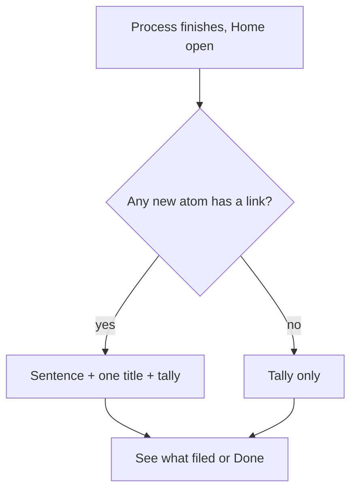
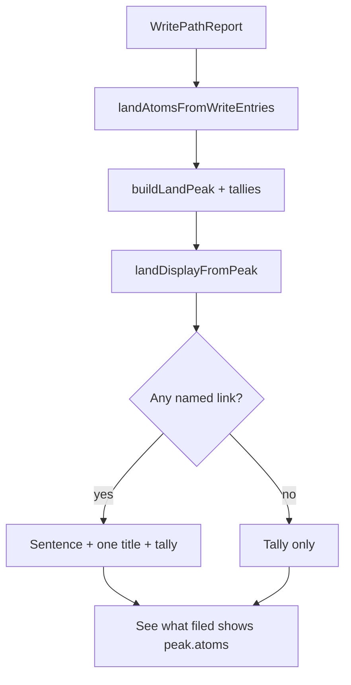

# After Process sentence - Plan

## Goal Capsule

- **Objective:** After Process, Home’s Done card shows one spoken link (when any link exists) plus a run tally, so a phone user who taps Done still sees what the run was worth.
- **Product authority:** This contract. Issue #551. Surrounding ideation tickets (#552 Ask miss, #553 Home quiet/blocked/broken) are not active scope.
- **Open blockers:** None.

---

## Product Contract

### Summary

After Process, keep the same Done card. When a newly filed note has any link, the first screen is one sentence, that one new title, a tally of the run, and See what filed. When it has no link, skip the sentence and show the tally. Done still dismisses.

### Problem Frame

The current after-Process card lists up to three titles, says “Open one to check how it linked,” and may show `Linked · {note}`. It never shows the reason text. On a phone the titles get cut off. The person who runs Process usually taps Done without opening a note, so the “check how it linked” line does not happen. The card is not broken. It is skippable. A week of filing can look green while nobody ever saw a why.

### Key Decisions

- KD1. Same Done card, not a new Home moment. (session-settled: user-directed — chosen over putting the why only on the opened note: they usually tap Done.) Governs R1.
- KD2. First screen is sentence + one title + tally. (session-settled: user-directed — chosen over replacing the list and over stacking every title on the first screen: they want the live why and a receipt, without the cutoff.) Governs R2, R3, R4.
- KD3. Skip the sentence only when there is no link. (session-settled: user-directed — chosen over hiding sticker stems and over a “filed, not linked” line: more sentences; stickers can come back.) Governs R5, R6.
- KD4. Do not rewrite how links get written. Governs R10.

### Requirements

**First screen**

- R1. After Process, Home still uses the existing Done card. Preview and dry-run do not use it. Auto-run with Home closed stays a Notice only.
- R2. When any newly filed atom has at least one link, the first screen shows one sentence, the title of that one new atom, a tally of the run, See what filed, and Done.
- R3. The sentence is the link’s reason if the reason has any text. If the reason is blank, the sentence is the other note’s name (same information as today’s `Linked · {note}`).
- R4. The tally states how many atoms were filed and how many captures were marked noise or task. Exact wording is a planning choice.
- R5. When no newly filed atom has a link, the first screen omits the sentence and the one title. It shows the tally, See what filed, and Done. It does not say “filed, not linked.”

**See what filed**

- R6. See what filed opens the full list of titles filed in this run. It is not required on the first screen.
- R7. Tapping the one title, or the sentence, opens that atom in the vault.

**Link choice**

- R8. If several new atoms have links, pick one. Prefer an atom whose reason text is non-empty. If none have reason text, pick any linked atom. Planning may add a tighter tie-break.
- R9. A link exists when the classify result for that atom names at least one other note. Do not run the existing weak-reason filter on this card.

**Out of this work**

- R10. This work does not change classify, repair, or the text stored on the atom.

### Key Flows

- F1. Process files a linked atom
  - **Trigger:** Process (or Update) finishes with Home open, and at least one new atom has a link.
  - **Steps:** Done card shows the sentence, that atom’s title, the tally, See what filed, Done. Resurface stays frozen until Done.
  - **Covers R1, R2, R3, R4.**
- F2. Process files only unlinked atoms
  - **Trigger:** Process finishes with Home open, and no new atom has a link.
  - **Steps:** Done card shows the tally, See what filed, Done. No sentence.
  - **Covers R5.**
- F3. See the rest of the run
  - **Trigger:** User taps See what filed.
  - **Steps:** The full filed-title list appears. Done still dismisses the card.
  - **Covers R6.**
- F4. Open the spoken atom
  - **Trigger:** User taps the sentence or the one title.
  - **Steps:** That atom opens in the vault.
  - **Covers R7.**
- F5. Home was closed
  - **Trigger:** Auto-run finishes with Home closed.
  - **Steps:** A Notice only. The next Home open is calm. No forced Done card.
  - **Covers R1.**

### Acceptance Examples

- AE1. Linked run
  - **Covers R2, R3, R4.**
  - **Given:** Process creates “Ross keeps people watching” with a reason about last week’s click-away note, plus five other atoms and two noise marks.
  - **When:** Home is open.
  - **Then:** The Done card shows that reason, the Ross title, a tally that includes 6 filed and 2 noise, See what filed, and Done. It does not list all six titles on the first screen.
- AE2. Blank reason
  - **Covers R3, R9.**
  - **Given:** The only link is to Alex with an empty reason.
  - **When:** The Done card appears.
  - **Then:** The sentence is Alex’s name. The card is not empty.
- AE3. Sticker reason
  - **Covers R9.**
  - **Given:** The reason is “preference about Alex.”
  - **When:** The Done card appears.
  - **Then:** That phrase is the sentence. The card does not hide it.
- AE4. No links
  - **Covers R5.**
  - **Given:** Three atoms filed, none with a link, one noise mark.
  - **When:** The Done card appears.
  - **Then:** There is no sentence and no single featured title. The tally is visible. The words “filed, not linked” do not appear.
- AE5. Phone Done
  - **Covers R1, R6.**
  - **Given:** The first screen is up on a phone.
  - **When:** The user taps Done without opening See what filed.
  - **Then:** The card dismisses. They already saw the sentence or the tally.

### Success Criteria

- A phone user who only taps Done still sees either one why or a clear run tally.
- Filing-green with skippable titles is no longer the after-Process experience.

### Scope Boundaries

**In**

- The after-Process Done card on Home (and Update when that card already appears).
- See what filed as the full title list.
- Tapping the featured sentence or title into the vault.

**Deferred for later**

- Rewriting classify or link-reason quality (ideation idea 2, not filed).
- Ask miss kinds (#552).
- Home quiet / blocked / broken (#553).
- Showing the full note body on this card.

**Outside this product's identity**

- Scores, badges, streaks, or “you should process.”
- A review queue.

<!-- ce-section: work-relationships -->
### How This Work Fits Together

This plan owns the after-Process Done card only.

- Ask miss kinds (`docs/ideation/2026-08-17-open-ideation.html` idea 3, #552)
  - Can proceed independently of this plan
- Home quiet / blocked / broken (idea 5, #553)
  - Shares Home
  - Can proceed independently of this plan
- Link-reason quality (idea 2, not filed)
  - Enables stronger sentences on this card later
  - Still to decide as its own brainstorm

### Dependencies / Assumptions

- Today’s Done card, title list, and `Linked · {note}` chip exist as described in `src/home/landPeak.ts` and `src/home/atomsHomeView.ts` (verified 2026-08-17).
- Classify already returns `links[].note` and optional `links[].reason`. This card reads them. It does not write them.
- “Noise” in the tally means captures marked task or noise, not missing files.

### Outstanding Questions

None remaining as Resolve Before Planning. Planning-time copies and expand behavior are KTDs below.

### Sources / Research

- Issue: https://github.com/taihartman/obsidian-atoms/issues/551
- Ideation: `docs/ideation/2026-08-17-open-ideation.html` (idea 1)
- Current card: `src/home/landPeak.ts`, `src/home/atomsHomeView.ts`
- Weak-reason list (not applied here): `src/pipeline/enrich/linkQuality.ts`
- First live vault failure: `docs/solutions/logic-errors/classification-weak-reasons-and-idea-loss.md`
- Land-then-remember contract: `docs/plans/2026-07-17-002-feat-land-then-remember-plan.md`

---

## Planning Contract

### Assumptions

- Update Notes keeps today’s Done card (titles + “Links refreshed”). Refresh items have no `links[]`. Growing that payload is follow-up, not this PR.
- A link exists only when `links[].note` is non-empty after trim.

### Key Technical Decisions

- KTD1. Extend `LandPeak` / `LandDisplay` in `src/home/landPeak.ts`. The view only renders. Governs U1, U2.
- KTD2. Tally copy is `N filed` when nothing was marked task/noise, else `N filed · M noise`. `M` is task + noise. Governs R4, U1.
- KTD3. See what filed expands the full title list on the same card. It does not open a new Home moment and does not call `openLandedAtom`. Governs R6, U2.
- KTD4. Pick the first created atom that has a non-empty reason. Else the first atom with a named note. Per atom, first link with a reason, else first named note. Write order is the array order from `landAtomsFromWriteEntries`. Governs R8, U1.
- KTD5. Replace the process/autorun body “Open one to check how it linked.” Do not stack that line with the new sentence. Headline and tally must not both count filings. Governs U1, U2.
- KTD6. Do not import `isWeakLinkReason`. Governs R9, U1.

### High-Level Technical Design

---

## Implementation Units

### U1. Land peak payload and copy

- **Goal:** Map write entries to a featured sentence, one featured atom, and a tally. First-screen display no longer slices three titles.
- **Requirements:** R2, R3, R4, R5, R8, R9. KD3, KTD2, KTD4, KTD5, KTD6.
- **Dependencies:** None.
- **Files:** `src/home/landPeak.ts`, `src/plugin/main.ts` (`landPeakFromWrite` passes `summaryFromWrite` counts), `test/landPeak.test.ts`
- **Approach:**
  1. Thread `links: { note, reason }[]` on created atoms. Count a link only when `note` is non-empty.
  2. Add `pickSpokenLandAtom`, `formatLandSentence`, `formatLandTally`.
  3. `landDisplayFromPeak` for process/autorun: one featured row or none; sentence or null; tally; keep full `peak.atoms` for expand.
  4. Leave Update headline/body/failure/polish paths as they are.
- **Execution note:** Test-first. Cover AE1–AE4 in `test/landPeak.test.ts` before changing the view.
- **Patterns to follow:** Existing `landAtomsFromWriteEntries` and `summaryFromWrite` in `src/home/runProgress.ts`.
- **Test scenarios:**
  - Covers AE1. Six created atoms, two noise/task, one reasoned link → sentence is that reason, one featured title, tally names 6 and 2, first-screen rows length 1.
  - Covers AE2. Only link is note `Alex` with blank reason → sentence is `Alex`.
  - Covers AE3. Reason `preference about Alex` is the sentence.
  - Covers AE4. Three unlinked atoms, one noise → no sentence, no featured, tally visible, no “filed, not linked”.
  - Earlier blank-reason link loses to a later reasoned atom.
  - Noise/task entries and `atomCreated: null` stay out of `atoms`.
  - Twelve created atoms: first screen one row; `peak.atoms.length` is 12.
- **Verification:** `npm test -- test/landPeak.test.ts` passes. No import of `linkQuality`.

### U2. Done card first screen and See what filed

- **Goal:** Render the new first screen on the existing Done card. Expand the full list in place.
- **Requirements:** R1, R6, R7. KD1, KTD3, KTD5.
- **Dependencies:** U1
- **Files:** `src/home/atomsHomeView.ts`, `styles.css`, `test/landPeak.test.ts` (display helpers if needed)
- **Approach:**
  1. Keep eyebrow Done, dismiss, wait-suppress, `openLandedAtom` for sentence/title taps.
  2. View flag `landListOpen`, reset on begin/dismiss/clear.
  3. Sentence uses a wrapping class, not `.atoms-home-landed-title` nowrap.
  4. See what filed lists every `peak.atoms` title. Do not use `openLandedAtom` for that control.
  5. Drop `Linked ·` on the process first screen. Drop “and N more in Recent” on the first screen.
- **Patterns to follow:** `fillLandPeakContent`, `textControl` rows, `button` / `actionRow`.
- **Test scenarios:**
  - Covers AE5. Dismiss without expand still leaves the sentence or tally as what was shown.
  - Expand shows all titles; Done still dismisses.
  - Sentence tap and featured-title tap open that path (unit-test the display fields the view binds).
- **Verification:** Land peak tests plus a view-level or display-level assert that expand is not a vault open. Manual phone check: sentence wraps.

### U3. Version bump

- **Goal:** Identify the user-visible build.
- **Requirements:** Versioning rule in CLAUDE.md.
- **Dependencies:** U2
- **Files:** `package.json`, `manifest.json`, `versions.json`
- **Approach:** Bump `0.8.3-beta.1` → `0.8.3-beta.2` (or next unused beta). Show in Settings → Atoms.
- **Test expectation:** none — version metadata only.
- **Verification:** Settings version string matches the three files.

---

## Verification Contract

| Gate | When | Signal |
|---|---|---|
| `npm test -- test/landPeak.test.ts` | After U1, U2 | AE1–AE4 green |
| `npm test` | Before PR | Full suite green |
| `npm run build` | Before PR | Typecheck + bundle |
| Phone Home after Process | After install to test vault | Sentence or tally readable; Done still works |

---

## Definition of Done

- R1–R10 hold on Process with Home open.
- Update Notes card is unchanged.
- Auto-run with Home closed is still Notice only.
- Tests cover AE1–AE4.
- Version bumped.
- PR body includes `Closes #551`.

### Deferred to Follow-Up Work

- Spoken sentence on Update Notes (needs `links` on refresh items).
- Apply `isWeakLinkReason` once idea 2 exists.
