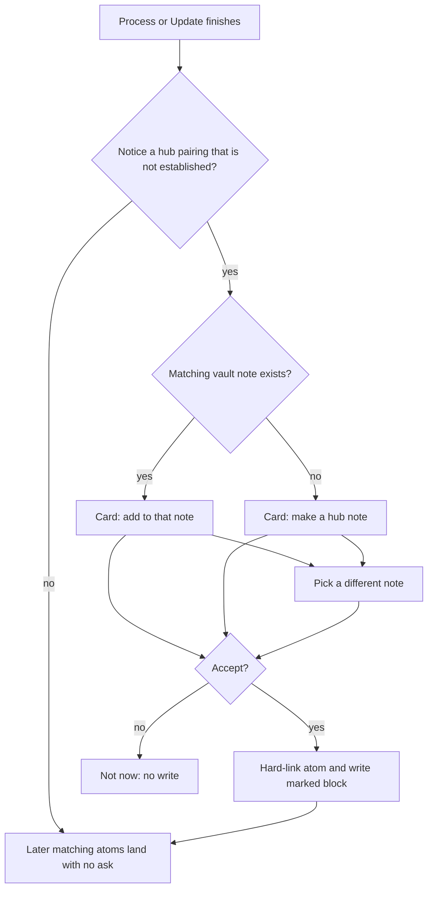
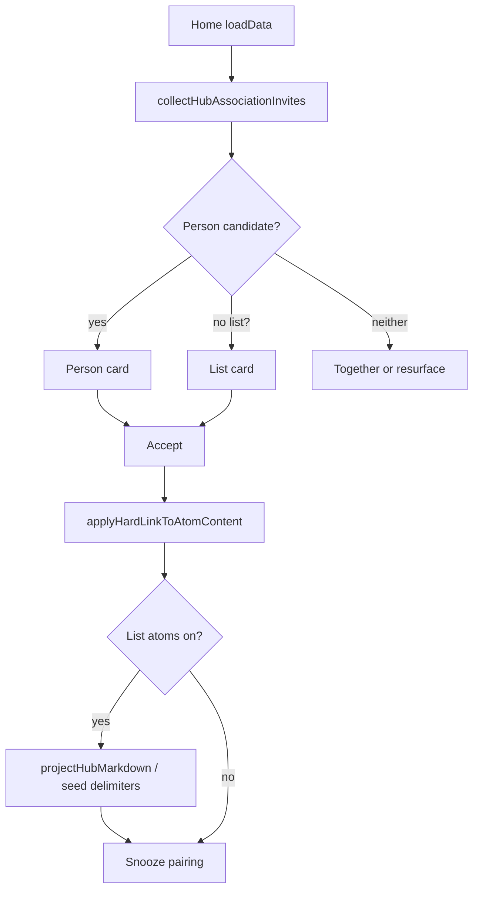

# Hub association invite - Plan

## Goal Capsule

**Objective.** After Process, one Home invite asks before a new hub association is made — person, watch list, or any other hub — and a tap writes the atom into that note the same way existing hubs already list atoms.

**Product authority.** Constitution write-type (d) and `CONCEPTS.md` (person hub invite, qualifying hub, managed hub block). Voice: `docs/voice.md` (quiet by default; no homework). Surrounding work (a Settings hub roster, per-hub toggles, designate-from-Settings) is not active scope.

**Open blockers.** None.

**Lane.** Full feature (unifies Home invites; product-facing).

**Stop.** No Settings roster, no checkbox rewrite, no silent auto-create. Live writes stay on throwaway vaults.

**Tail.** Hard claim, then U1→U4, then shipping tail on the Home card and the Show list write.

**Product Contract preservation:** unchanged. Deferred questions resolved as KTD1–KTD8.

---

## Product Contract

### Summary

One post-Process Home card for every hub association we notice. An existing note is offered first; a new hub is created only if none exists. Accept writes `- [[atom title]]` inside the marked hub block. After that hub is accepted, later matching atoms land there without another ask.

### Problem Frame

People already keep list notes (a show list, a movie list) and turn on **List atoms on hub notes**. They capture "I want to watch Psycho-Pass" and open the list they already use. The new show is not there.

Those notes are not hubs to Atoms: no headings, no marked block, no hard link from the atom. Classify tags the atom `media` / `show` / `watch` and links people instead. Person invites already ask **Add {Name}?**; list notes get no equivalent ask. A Settings roster would make the user maintain hubs. The miss is that Process never asked about the list they already have.

### Key Decisions

- K1. **One invite family, not a Settings roster.** (session-settled: user-directed — chosen over a Settings hub manager and over shipping both: the association is the tap, like Photos' "Is this John?") Governs R1, R2, R10.
- K2. **The addition follows the hub-note pattern.** (session-settled: user-directed — chosen over growing the handwritten checkbox list and over checkbox syntax in the generated block: Process rewrites that block.) Governs R6, R12.
- K3. **Confirm the hub once, then stay quiet.** (session-settled: user-approved — chosen over asking on every later matching atom: Photos, not a permission dialog per item.) Governs R9, R11.
- K4. **Existing note first; create only if none.** (session-settled: user-directed — chosen over silent auto-mark and over designate-from-Settings.) Governs R3, R7, R8.
- K5. **Two list notes stay two hubs** unless the user points both at one note via pick-a-different-note. Governs R3, R4.
- K6. **Under-invite.** A missed card beats a fake hub. Governs R5.

### How This Work Fits Together

<!-- ce-section: work-relationships -->

This plan owns the one Home invite for hub associations. The broader request began as a Settings place to preview, toggle, and designate hubs; that roster is not active scope here.

- Settings hub roster / per-hub on-off
  - Depends on this invite existing (otherwise the roster is the only way to make a hub)
  - Can proceed independently later
  - Still to decide: whether undo belongs on the hub note itself
- Person hub invite and entity hub invite
  - Shares the same card family; this work folds them into one pattern
- Hub list preview / Refresh hub lists
  - Can proceed independently; bulk fill stays as shipped
- List atoms on hub notes (global)
  - This invite writes lists only while that switch is on

### Requirements

**Notice and ask**

- R1. After Process or Update, when we notice an atom belongs with a hub and that pairing is not yet established, show one Home invite card.
- R2. Person, list, watch list, and any later hub kind use the same card family. No second invite species.
- R3. If a matching vault note exists, the card offers to add this memory to that note. If none exists, the card offers to create a hub note.
- R4. The card can target a different existing note. **Not now** dismisses this suggestion without creating or writing.
- R5. Ask only at high confidence. Under-invite: a missed card beats a fake hub.

**Accept**

- R6. Accept establishes the atom's hard link to the hub and writes the atom into that note's marked block as `- [[atom title]]`, under a matching H2 or **Unsorted**. Writing outside the delimiters is never changed.
- R7. Accepting when no hub exists creates one minimal hub note. Never silent auto-create.
- R8. Accepting an existing note that was not yet a hub makes it one. The first marked block may use **Unsorted** when the note has no H2s.
- R9. After a hub is accepted, later atoms that belong there land on it without another ask, while **List atoms on hub notes** is on.

**Global**

- R10. Settings keeps the existing **List atoms on hub notes** switch. This work adds no per-hub roster, toggle, or designate picker.
- R11. Everyday Process after the hub exists does not reopen the invite. **Refresh hub lists** stays the bulk preview.
- R12. Atom bodies stay verbatim. Atoms stay flat. The handwritten checkbox list on a note such as Show list is never rewritten.

### Key Flows

- F1. Watch capture, list note already in the vault
  - **Trigger:** Process files "I want to watch Psycho-Pass". A Show list note exists. No pairing yet.
  - **Steps:** Card offers to add to Show list. Accept. Atom hard-links to Show list. Marked block lists `- [[Want to watch anime Psycho-Pass]]`.
  - **Outcome:** Opening Show list shows the new row in the marked block. Handwritten checkboxes above it are unchanged.
  - **Covered by:** R1, R3, R6, R8, R12

- F2. Later watch capture, Show list already accepted
  - **Trigger:** Process files another want-to-watch atom.
  - **Steps:** No invite. Atom hard-links and the marked block gains the new row.
  - **Outcome:** The list grew without a card.
  - **Covered by:** R9, R11

- F3. Person with no note yet
  - **Trigger:** Process files an atom about someone who has no person note.
  - **Steps:** Same card family offers to create the person hub. Accept creates the note and writes the marked block.
  - **Outcome:** One pattern with F1; only the create beat differs.
  - **Covered by:** R2, R3, R7

- F4. Wrong note
  - **Trigger:** Card offers Show list; the user wanted Movie list.
  - **Steps:** Pick a different note. Accept on Movie list.
  - **Outcome:** Show list is untouched. Movie list becomes the hub for this pairing.
  - **Covered by:** R4, R5

- F5. Not now
  - **Trigger:** Card is showing. User dismisses.
  - **Steps:** No hub created, no marked block written, no hard link added by the invite.
  - **Outcome:** Atom stays as filed. Invite does not nag on the next Process for the same dismissed pairing.
  - **Covered by:** R4, R5

- F6. Global lists off
  - **Trigger:** **List atoms on hub notes** is off. A pairing is noticed.
  - **Steps:** Invite may still offer to create or designate the hub relationship. Accept does not write a marked block until the global switch is on.
  - **Outcome:** The association can exist; list writing stays behind the existing switch.
  - **Covered by:** R9, R10

### Acceptance Examples

- AE1. Psycho-Pass lands on Show list
  - **Covers R1, R3, R6, R8, R12.**
  - **Given:** Show list exists as a handwritten checkbox note with no headings and no marked block. **List atoms on hub notes** is on.
  - **When:** Process files "I want to watch the anime psycho pass" and the user accepts **Add to Show list?**
  - **Then:** Show list gains a marked block containing `- [[Want to watch anime Psycho-Pass]]`. The existing `- [ ]` lines are byte-identical.

- AE2. Second show is silent
  - **Covers R9, R11.**
  - **Given:** AE1 already accepted.
  - **When:** Process files another want-to-watch show.
  - **Then:** No invite card. The new atom appears in Show list's marked block.

- AE3. Movie list stays a separate hub
  - **Covers R3, R4, K5.**
  - **Given:** Movie list and Show list both exist.
  - **When:** The user accepts Show list for an anime capture and later accepts Movie list for a movie capture.
  - **Then:** Each note has its own marked block. Neither invite writes both.

- AE4. Create when nothing exists
  - **Covers R2, R3, R7.**
  - **Given:** No show-list note in the vault.
  - **When:** Process files a high-confidence watch capture and the user accepts create.
  - **Then:** One new hub note is created. The atom is listed in its marked block. No second note is invented.

- AE5. Not now leaves the vault alone
  - **Covers R4, R5.**
  - **Given:** The Show list card is showing.
  - **When:** The user chooses **Not now**.
  - **Then:** Show list is unmodified. The atom has no new hard link from the invite. The same pairing does not reopen on the next Process.

- AE6. Person and list are one card family
  - **Covers R2.**
  - **Given:** A person miss and a list miss could both fire from one Process.
  - **When:** Home renders invites.
  - **Then:** Both use the same card grammar (title, add-or-create, pick another note, not now). There is no separate "entity" species.

- AE7. Lists off does not write the block
  - **Covers R10, F6.**
  - **Given:** **List atoms on hub notes** is off.
  - **When:** The user accepts a Show list invite.
  - **Then:** No marked block is written. Turning the switch on later can fill via **Refresh hub lists** or the next Process, per existing preview rules.

### Scope Boundaries

**In**

- One Home invite family for every noticed hub association
- Folding today's person invite and entity invite into that family
- First marked block on an accepted existing note, including notes with no H2s
- Silent landing after that hub is accepted

**Deferred for later**

- Settings page that lists hubs, toggles them, or designates a note by hand
- Per-hub off from the hub note itself
- Checkbox syntax or preserved check-state inside the marked block
- Rewriting handwritten checkbox rows into the marked block

**Outside this product's identity**

- A task app: no due dates, no "you have N unlisted shows"
- Silent auto-create of hub notes
- Asking on every later atom once the hub is accepted
- AI folder placement or moving atoms out of the flat folder

### Dependencies / Assumptions

- **List atoms on hub notes** remains the write gate for marked blocks.
- Membership remains the atom's hard link to the hub, not a separate hub field.
- Person-invite snooze / dismiss already exists; list pairings inherit the same "do not nag" bar. Exact window is planning's.
- The dogfood case is a handwritten Show list / Movie list with no headings; that shape must qualify after accept (R8).

### Outstanding Questions

**Resolve Before Planning**

- None.

**Deferred to implementation**

- Exact pairing-id string for snooze maps.
- Whether list-note pick UI is a rename of `PersonNoteSuggestModal` or a shared suggest modal.

### Sources

- `CONCEPTS.md` — Person hub invite, qualifying hub, managed hub block, hub list preview
- `docs/plans/2026-07-23-001-feat-person-hub-invite-plan.md` — Add / link / already-have / not now
- `docs/plans/2026-08-09-001-feat-hub-projection-any-hub-plan.md` — list hubs; no `hub:` marker
- `docs/plans/2026-08-10-002-feat-hub-list-preview-plan.md` — bulk preview stays; per-hub include was deferred there
- `docs/voice.md` — quiet by default; no homework
- Live miss (2026-08-17): want-to-watch atom filed with `media` / `show` / `watch` and no link to the existing Show list / Movie list notes
- `docs/solutions/features/person-hub-invite-add-name.md`
- `docs/solutions/logic-errors/person-invite-verb-as-name.md`
- `docs/solutions/features/entity-orbits-hard-keys-and-also-about.md`
- `docs/solutions/logic-errors/read-modify-write-lost-update-synced-file.md`

---

## Planning Contract

### Key Technical Decisions

- KTD1. **One collector, two kinds.** `collectHubAssociationInvites` returns person and list candidates. Home still shows one card. Person wins the hero slot. Governs R1, R2, F3.
- KTD2. **Notice a list pairing without headings.** A list-shaped atom plus exactly one existing vault note (trimmed basename match: Show list, Movie list, Movies, Shows, Watchlist, Films, or an exact `suggestEntityHubLabel` hit). Soft keys stay on orbits, not this gate. Unique hit only. Governs R3, R5, AE1.
- KTD3. **Existing title is the add beat, not a skip.** Today's `collectEntityInvites` skips when the vault already has that title. Invert that for list pairing. Create only when no note exists. Governs R3, R7. (session-settled: user-directed — instantiates K4 / R3.)
- KTD4. **Accept seeds the marked block.** First accept on a headingless one-member list would no-op `shouldWriteNonPersonHub`. Accept calls `projectHubMarkdown` (or treats the designated hub as write-eligible) so AE1 writes. Later Process uses delimiters. Governs R6, R8, AE1.
- KTD5. **Lists off: hard-link, skip the block.** Accept still upgrades link-prose. Marked-block write waits on `enableHubProjection`. Governs R10, F6, AE7.
- KTD6. **Re-read immediately before the hub splice.** Follow `docs/solutions/logic-errors/read-modify-write-lost-update-synced-file.md`. Tests inject a concurrent edit inside the await. Governs R6, R12.
- KTD7. **Do not put list hubs on classify cache Block A.** Person-hub prefix stays byte-stable for the run. Governs R9.
- KTD8. **Trim titles when matching.** `"Show list "` matches Show list. Governs R3, R5.

### High-Level Technical Design

Extend `personInviteCopy` grammar for lists: add-to-existing vs make-new, pick another note, Not now. Entity `Make {label}?` with only Create/Not now goes away.

### Assumptions

- Metadata cache will see `## Unsorted` inside the new marked block, so later classify list context can include that hub. If a vault proves otherwise, U2 also teaches list context to include delimiter-only notes.
- 14-day snooze maps stay device-local, same as person/entity today.

### Sequencing

U1 (collect, test-first) → U2 (accept write) → U3 (Home card) → U4 (copy). U2 can start against U1 types. U3 wires U1+U2. U4 can overlap U3.

### Implementation constraints

- Hard claim before code: GitHub Issue + STATUS row + draft PR. Current branch `chore/clear-status-551` is not this work.
- Vault writes only in `test_vault/` or `docs/media/demo-vault/`.
- Bump `manifest.json` + `package.json` (+ `versions.json`) — user-visible Home card.
- Copy through `atoms-voice` / `docs/voice.md`. No "projection", "regen", "managed block" in the card.
- Do not plant hubs to force a green screenshot. Dogfood: append a watch capture → Process → accept → open the list note.

---

## Implementation Units

### U1. Collect hub association invites

- **Goal:** Pure collector notices person misses and list pairings, including an existing headingless Show list.
- **Requirements:** R1, R2, R3, R5, R9, AE1, AE3, AE4, AE5. KTD1, KTD2, KTD3, KTD8.
- **Dependencies:** None.
- **Files:**
  - Create `src/pipeline/hubInvite.ts` (or fold into existing invite modules if a new file is noise)
  - Modify `src/pipeline/personInvite.ts`, `src/pipeline/entityInvite.ts`, `src/pipeline/enrich/listHubs.ts` as needed
  - Create/modify `test/hubInvite.test.ts`, `test/entityInvite.test.ts`, `test/personInvite.test.ts`
- **Approach:**
  1. Keep person collect as shipped (verbatim people, under-invite). Do not run list titles through the person name guesser.
  2. List collect: list-shaped atom, no hard link to the candidate yet, unique trimmed vault title, snooze applied.
  3. Invert "skip when title exists" for the add-to-existing beat. Keep create-only when no note exists.
  4. Rank: person first, then list. Home takes `[0]` after that rank.
- **Execution note:** Implement collect test-first. Mutation-check the unique-hit and headingless-title cases.
- **Patterns to follow:** `collectPersonInvites`, `isListHubShaped` / `enrichListHubLinks` unique-hit fail-closed, `docs/solutions/logic-errors/person-invite-verb-as-name.md`.
- **Test scenarios:**
  - Covers AE1. Watch-shaped atom + vault `Show list.md` with no `##` → one list invite targeting that note.
  - Covers AE3. Both Movie list and Show list exist; anime-shaped atom uniquely matches Show list only.
  - Trailing-space basename `Show list .md` matches "Show list".
  - Two equally plausible list notes → no list invite (under-invite).
  - Soft key `movies` with no vault note → no invite from the soft key alone.
  - Vault `Movies.md` exists + watch-shaped atom → invite to Movies (existing note wins; soft-key denylist does not hide it).
  - Covers AE4. Watch-shaped, no list note → create-beat candidate, not add-to-existing.
  - Person candidate and list candidate both present → person ranks first.
  - Already hard-linked to Show list → no list invite.
  - Snoozed pairing id → omitted.
  - Covers AE5. Dismissed pairing does not return on a second collect with the same snooze map.
- **Verification:** `npx vitest run test/hubInvite.test.ts test/entityInvite.test.ts test/personInvite.test.ts` green. Entity tests that encoded "no invite when hub exists" are inverted or split into add-vs-create.

### U2. Accept writes the hard link and the first marked block

- **Goal:** Accept establishes membership and lists the atom on the hub, including a headingless one-member list.
- **Requirements:** R6, R7, R8, R10, R12, F6, AE1, AE2, AE7. KTD4, KTD5, KTD6, KTD7.
- **Dependencies:** U1 types/ids.
- **Files:**
  - Modify `src/home/atomsHomeView.ts` accept helpers (or extract `src/pipeline/acceptHubInvite.ts`)
  - Modify `src/pipeline/hubQualify.ts` and/or `src/pipeline/runHubProjection.ts` so designated first-write is eligible
  - Modify `src/pipeline/hubProjection.ts` only if splice needs a new entry point
  - Modify `src/pipeline/context.ts` only if delimiter-only hubs stay invisible to list context
  - Create/modify `test/hubInviteAccept.test.ts`, `test/hubQualify.test.ts`, `test/runHubProjection.test.ts`
- **Approach:**
  1. Reuse `applyHardLinkToAtomContent` (list reason `belongs with [[Title]]` or equivalent existing list reason). Body untouched.
  2. Create path: person note via `formatPersonNoteMarkdown`; list note via `formatEntityHubMarkdown`. Never silent create.
  3. When lists are on, seed `projectHubMarkdown` even if the write brake would refuse (one member, no human H2, no prior delimiters).
  4. Re-read the hub immediately before modify, or use `vault.process`.
  5. When lists are off, stop after the hard link.
  6. Do not add accepted list titles to classify Block A.
- **Execution note:** Test the headingless one-member write first. It is the live miss.
- **Patterns to follow:** `upgradeAtomToPerson` / entity accept in `atomsHomeView.ts`, `projectHubMarkdown`, lost-update solution above.
- **Test scenarios:**
  - Covers AE1. Headingless Show list + one atom + lists on → marked block contains `- [[Want to watch anime Psycho-Pass]]`; checkbox lines above are unchanged.
  - Covers AE2. Second accept/process against a hub that already has delimiters → new row, no second invite from collect.
  - Covers AE7. Lists off → hard link present, no marked block.
  - Concurrent edit during await → user prose outside delimiters survives.
  - Create-beat accept with no existing note → one new file, atom listed.
  - Person accept still creates `Personal notes/Social/{Name}.md` when no note exists (no regression).
- **Verification:** Unit tests mutation-checked on the brake exception. No vault write in unit tests.

### U3. One Home card family

- **Goal:** Home renders one invite card for both kinds, with pick-another-note on lists.
- **Requirements:** R2, R4, R11, AE6. KTD1.
- **Dependencies:** U1, U2.
- **Files:**
  - Modify `src/home/atomsHomeView.ts`
  - Modify `src/home/personNoteSuggestModal.ts` (or shared suggest modal)
  - Modify `styles.css` only if a new class is required (prefer existing `.atoms-home-entity-invite`)
  - Modify `test/personInvite.vault-smoke.test.ts` or add `test/hubInviteHome.test.ts` if copy/render is unit-testable
- **Approach:**
  1. Replace the two renderers with one. Same `flatCard` / action row.
  2. Person still outranks. Together stays behind both.
  3. Process does not open this card. Home refresh after Process does.
  4. Pick-another-note excludes `Atoms/`, dailies, soft index titles. Do not Social-first-only when the invite is a list.
  5. One snooze helper keyed by pairing id. Keep reading old person/entity maps once so in-flight snoozes survive.
- **Patterns to follow:** `renderPersonInviteCard`, Ready > land peak > invite > Together hero order.
- **Test scenarios:**
  - Covers AE6. Copy helper for list existing vs list create vs person existing vs person create all expose add/create, pick-another, Not now.
  - Person candidate present → list card not shown.
  - Not now writes snooze and clears the candidate.
  - Refresh hub lists still does not open this card.
- **Verification:** Copy tests + existing Home smoke still pass. Hero order unchanged except entity-only Create is gone.

### U4. Voice copy

- **Goal:** Card words match Atoms voice and stay test-pinned.
- **Requirements:** R2, R4. K1.
- **Dependencies:** U3 copy helper shape.
- **Files:**
  - Copy lives next to the helper in U1/U3
  - Modify `test/copyVoice.test.ts`
  - `CONCEPTS.md` already names the family
- **Approach:** Load `.agents/skills/atoms-voice/`. Plain words. Add to Show list / Make Show list / Not now / pick another note. No jargon.
- **Test scenarios:**
  - Frozen strings contain none of: projection, regen, managed block, qualifying hub.
  - Existing-note title names the note. Create-beat title names the new hub.
- **Verification:** `npx vitest run test/copyVoice.test.ts` green.

---

## Verification Contract

| Gate | Command / evidence |
|---|---|
| Unit | `npx vitest run test/hubInvite.test.ts test/hubInviteAccept.test.ts test/personInvite.test.ts test/entityInvite.test.ts test/hubQualify.test.ts test/copyVoice.test.ts` (adjust names to files actually added) |
| Full unit | `npm test` |
| Types + bundle | `npm run build` |
| Lint | `npm run lint` |
| Live | `./scripts/install-to-vault.sh` on throwaway vault. Append a watch bullet to a past daily. Process. Accept Add to Show list. Open the note. Confirm marked block row and untouched checkboxes. Process a second watch capture. Confirm silent landing. |
| Dogfood honesty | Do not seed a pre-linked Show list graph. The invite must appear from a real Process of a new capture. |

---

## Definition of Done

- U1–U4 landed with their test scenarios. Abandoned spikes removed.
- AE1–AE7 have a unit or labeled live check.
- Version bumped. Settings shows the new version.
- Hard-claim Issue closed via `Closes #<n>` on the PR.
- Shipping tail: simplify, code-review, compound, world-class-qa (incl. adversarial) on the Home card and the Show list write.
- UI PR includes vault screenshots under `docs/qa/screenshots/hub-association-invite/`.
- STATUS row cleared after merge.

### Per-unit done

- U1. Collect tests cover headingless existing note, unique-hit fail-closed, person-ranks-first.
- U2. Headingless one-member accept writes the marked block; lists-off skips it; lost-update test exists.
- U3. One card on Home; pick-another-note works for lists.
- U4. Copy tests pin voice.
