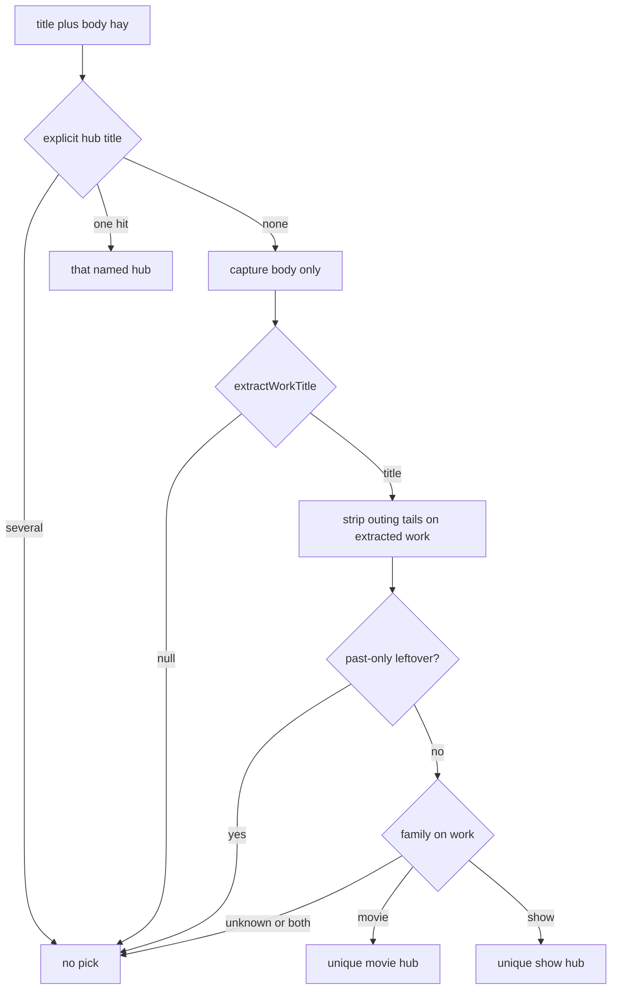

# Watchlist hub membership - Plan

## Goal Capsule

**Objective.** Invite and silent enrich pick Movie list or Show list only for a named work the user means to watch, or when the capture names that hub. Family follows the work. `#movie` on a snack may stay. Existing members are not unlinked. Classify-emitted hub links stay deferred.

**Product authority.** Session-settled decisions below. Parent invite: `docs/plans/2026-08-17-1540-feat-hub-association-invite-plan.md` R5, R9, R12. CONCEPTS: hub association invite, qualifying hub, managed hub block.

**Open blockers.** None.

**Lane.** Amend to shipped 0.8.8 matching.

**Stop.** Do not change tags, `isMediaShaped`, Settings, handwritten checkboxes, or Remote Vault.

**Tail.** New Issue, STATUS row, bump **0.8.9**, throwaway-vault Process only.

**Product Contract preservation:** bootstrap. No upstream requirements-only plan.

---

## Product Contract

### Summary

Home invite and silent Process landing share one membership gate. A capture joins Movie list or Show list when a work title extracts and that work is a movie or a show, or when the capture names the hub (R6). Outing tails on the extracted work (`for` / `at` / `before` the movie, `to watch the movie…`) are stripped inside `cleanWorkTitle`. Unknown family is a miss.

### Problem Frame

Remote Vault atoms that mention a movie night are correctly tagged `#movie`. The matcher treats the word `movie` as “belongs on Movie list.” Dried apricot, Spiderman-already-happened, and Demon Slayer-before-the-outing would join Movie list. `pickSoftMediaHub` also dumps leftover “want to watch Dune” onto Movies when both lists exist. Invite already fails closed on leftover Dune; silent landing does not. Two consumers re-deriving family will drift.

### Key Decisions

- K1. **Tags stay.** (session-settled: user-directed — chosen over retagging apricot/Spiderman: those captures are about a movie night.) Governs R1.
- K2. **Membership is a named work you mean to watch.** (session-settled: user-directed — chosen over “any media-shaped capture” and over a Settings roster.) Governs R2, R3, R6.
- K3. **Family follows the work.** (session-settled: user-directed — chosen over sentence-level `movie`/`show` cues: outing “movie” must not pick Movie list.) Governs R4, R5.
- K4. **Unknown family is a miss.** (session-settled: user-approved — chosen over dumping leftover watch onto Movies.) Governs R5, R7.

### Requirements

**Membership**

- R1. `#movie` / `#show` / `#watch` / `#media` stay as classify/repair tags. They do not pick a list hub.
- R2. Invite and silent landing join by work-family only when `extractWorkTitle` returns a work after outing-phrase strip. R6 may still pick when the capture names the hub title.
- R3. Reject leftover titles that are `it` or `the movie`. Reject past-only captures (`finished`, `watched`, `went to see`) unless a want-to-watch / told-me-to-watch / `movie:` pattern remains.
- R4. After the strip, family is read from the work: `movie`/`film` → movie; `show`/`series`/`anime`/`season`/`episode`/`tv` → show. Do not scan the raw sentence for family.

**Routing**

- R5. Movie family picks the unique movie-named hub (`Movie list` / `Movies` / `Films`). Show family picks the unique show-named hub (`Show list` / `Shows`). Both cues or neither → no pick.
- R6. Explicit mention of the hub title in the capture may still pick that note (`titleMatchesCapture`).
- R7. Delete the Movies/watch default in `pickSoftMediaHub`. `pickListNamedHub` already returns null with no cue; keep that.

**Unchanged parent rules**

- R8. Under-invite stands (parent R5). A missed title beats a snack on the list.
- R9. After the hub is accepted, later matching atoms use this same gate (parent R9).
- R10. Atom bodies stay verbatim. Handwritten checkboxes are never rewritten (parent R12).

### Actors

- A1. Vault owner with headingless Movie list and Show list.
- A2. Process / Update / Home invite.

### Key Flows

- F1. Named movie
  - **Trigger:** “want to watch the new Dune movie”
  - **Steps:** Extract “Dune movie.” Family movie. Unique Movie list.
  - **Outcome:** Invite or silent link to Movie list.
  - **Covered by:** R2, R4, R5
- F2. Named show
  - **Trigger:** “I want to watch the anime psycho pass”
  - **Steps:** Extract work. Family show. Unique Show list.
  - **Outcome:** Show list, not Movie list.
  - **Covered by:** R2, R4, R5
- F3. Outing, not a title
  - **Trigger:** “Andrew wants some dried apricot for the movie”
  - **Steps:** Outing strip. No work title.
  - **Outcome:** No list pick. `#movie` may remain.
  - **Covered by:** R1, R2, R3
- F4. Show homework before an outing
  - **Trigger:** “I need to watch Demon slayer to watch the movie with Christian and Luke”
  - **Steps:** Strip “to watch the movie…”. Extract Demon Slayer. No movie family on the work. Show family if a show cue remains on the work; else miss.
  - **Outcome:** Never Movie list.
  - **Covered by:** R3, R4, R5, R8
- F5. Leftover watch
  - **Trigger:** “want to watch Dune” with Movie list and Show list present
  - **Steps:** Work extracts. Family unknown.
  - **Outcome:** No pick. No Movies default.
  - **Covered by:** R5, R7

### Acceptance Examples

- AE1. Covers F3 / R1, R2. Given apricot-for-the-movie, when collect or enrich runs, then no Movie list link and tags may still include `movie`.
- AE2. Covers F1 / R5. Given “want to watch the new Dune movie” and both lists, when pick runs, then Movie list.
- AE3. Covers F2 / R5. Given Psycho-Pass anime and both lists, when pick runs, then Show list.
- AE4. Covers F5 / R7. Given “want to watch Dune” and Movies+Shows, when `pickSoftMediaHub` runs, then null.
- AE5. Covers F4 / R4. Given Demon Slayer before the movie, when pick runs, then not Movie list.
- AE6. Covers R3. Given “Finished Demon Slayer, watched the movie…”, when pick runs, then no list pick.
- AE7. Covers R6. Given “add to my Shows list” and both hubs, when pick runs, then Shows.

### Success Criteria

Remote Vault sentences in AE1–AE6 pass as unit tests. Invite and silent enrich return the same hub or the same miss for each sentence. Throwaway-vault Process does not write apricot or finished-watch onto Movie list. Existing members stay; this amend does not unlink. Classify-emitted `[[Movie list]]` links remain a later path.

### Scope Boundaries

- In: `extractWorkTitle` cleanup, one family helper, both pickers, tests, 0.8.9, CONCEPTS watchlist sentence.
- Out: tag repair, `isMediaShaped`, Settings roster, classify prompt, handwritten list rewrite, Remote Vault writes, unlinking existing members.
- Deferred: drop model-emitted `[[Movie list]]` links that fail this gate (`src/pipeline/classify.ts` media rules). Packing/gift list matching. Update notes does not strip a hub link that fails the new gate.

### Sources

- Live atoms (read-only): apricot, Spiderman night, Demon Slayer before movie, finished Demon Slayer, Psycho-Pass, House of the Dragon, My Hero Academia, Frieren.
- `src/pipeline/enrich/media.ts`, `src/pipeline/enrich/listHubs.ts`, `src/pipeline/hubInvite.ts`
- `test/listHubs.test.ts` Movies-default cases; `test/hubInvite.test.ts` leftover Dune miss
- `docs/solutions/logic-errors/person-invite-verb-as-name.md`
- `docs/solutions/logic-errors/a-bound-resolved-once-must-reach-both-consumers-by-construction.md`
- `docs/solutions/workflow-issues/extracting-a-one-home-predicate-does-not-find-the-copy-already-there.md`

---

## Planning Contract

### Key Technical Decisions

- KTD1. **One exported gate in `media.ts`.** Both pickers call it. (session-settled: user-approved — chosen over tightening invite only: silent landing still dumps Movies.) After the change, `showCue` / `movieCue` on raw hay must have zero call sites. Governs R2, R4, R7, R9.
- KTD2. **Outing strip lives inside `cleanWorkTitle` on the extracted work.** Cut `for` / `at` / `before` the movie, `to watch the movie…`, and a trailing `with …`. Do not strip those phrases on raw hay (that would eat “to watch Demon slayer”). Family reads the cleaned work. Governs R3, R4.
- KTD3. **Flip the Movies-default tests.** They encode the bug. Governs R7.

### High-Level Technical Design

R6 runs first on hay, matching shipped pickers. Work-family uses capture body only. Past-only uses R3.

### Assumptions

- “Watching My Hero Academia” and “want to watch House of the Dragon” extract a work with no family cue on the cleaned title, so both pickers miss (R8) unless the work string itself has a show cue.
- `suggestEntityHubLabel` stays packing/trip only and does not mint Movie list.
- Headingless Movie list / Show list remain `LIST_NAMED` / `MEDIA_LIST_HUB_SOFT_TITLES` as shipped.

### Implementation Constraints

- Test-first on the gate and on both pickers. Vault sentences are fixtures, not Remote Vault writes.
- Search the *shape* of sentence-level movie/show cues after the edit, not only the new helper name.
- Bump `manifest.json`, `package.json`, `versions.json` to 0.8.9.

### Sequencing

U1 then U2. U2 cannot flip pickers until the gate exists.

---

## Implementation Units

### U1. Watchlist work gate

**Goal:** Export one membership+family result from media repair.
**Requirements:** R2, R3, R4
**Dependencies:** none
**Files:** `src/pipeline/enrich/media.ts`, `test/media.test.ts`
**Approach:**
1. Strip outing tails in `cleanWorkTitle` on the extracted work, including `to watch the movie…` and a trailing `with …`.
2. Export family-from-work. Unknown → null. Movie and show cues together on the cleaned work → null (R5).
3. Reject `it` / `the movie` leftovers and past-only captures per R3.
**Patterns to follow:** `extractWorkTitle` pattern list; do not change `mediaTagsFor` or `isMediaShaped`.
**Execution note:** Implement the gate test-first against AE1, AE5, AE6 and the happy extracts.
**Test scenarios:**
- Covers AE1. “Andrew wants some dried apricot for the movie” → no work.
- “Went to see Spiderman with Andrew…” → no work.
- Covers AE6. “Finished Demon Slayer and watched it with Christian and Luke” → no membership.
- Covers AE5. “I need to watch Demon slayer to watch the movie with Christian and Luke” → work Demon Slayer; family not movie.
- “watch Severance before the movie” → work Severance; family show if season/show cue else unknown.
- “want to watch the new Dune movie” → work includes Dune; family movie.
- “I want to watch the anime psycho pass” → family show.
- “want to watch Dune” → work Dune; family unknown.
- “Watching My Hero Academia” → work extracts; family unknown.
- “want to watch House of the Dragon season 3 with Nichita” → family show (`season`).
- “Alex likes periwinkle” → still null (existing).
**Verification:** `test/media.test.ts` covers the sentences above. `mediaTagsFor` tests unchanged.

### U2. Both pickers call the gate

**Goal:** Invite and silent landing cannot disagree.
**Requirements:** R5, R6, R7, R9
**Dependencies:** U1
**Files:** `src/pipeline/enrich/listHubs.ts`, `src/pipeline/hubInvite.ts`, `test/listHubs.test.ts`, `test/hubInvite.test.ts`, `manifest.json`, `package.json`, `versions.json`, `CONCEPTS.md`
**Approach:**
1. `pickSoftMediaHub` requires the U1 result. Delete Movies/watch default.
2. `pickListNamedHub` uses the same result. Delete hay `showCue` / `movieCue`.
3. Keep explicit `titleMatchesCapture` hub-name hits first (R6), on title-plus-body hay. Pass capture body only (`body` / `captureText`) into the U1 gate.
4. Flip Movies-default tests. Add invite leftover-Dune-vs-Movies miss. Add AE1/AE5/AE6 on both pickers.
5. After edit, search for remaining raw-hay movie/show family cues.
6. Bump 0.8.9. CONCEPTS watchlist sentence already drafted; keep it aligned.
**Patterns to follow:** parent unique-hit fail-closed; `docs/solutions/logic-errors/a-bound-resolved-once-must-reach-both-consumers-by-construction.md`.
**Test scenarios:**
- Covers AE4. Flip “picks Movies for generic watch dump when Movies+Shows exist” to null.
- Flip “links unique Movies hub for watch capture” / “links Movies when Movies+Shows both exist” / “links sole soft hub when media-shaped and only Movies exists” to no Movies link unless family is movie.
- Covers AE2. “Dune movie” + both lists → Movie list on both pickers.
- Covers AE3. Psycho-Pass + both lists → Show list on both pickers.
- Covers AE7. “add to my Shows list” → Shows.
- Covers AE1. Apricot → neither picker returns Movie list.
- Covers AE5. Demon Slayer before movie → not Movie list on either picker.
- Existing leftover Dune vs lone Show list stays null.
- Lone Movies + “Dune movie” still picks Movies.
**Verification:** `npm test`. Grep shows no leftover hay `showCue`/`movieCue`. Throwaway vault: Process a Dune-movie bullet and an apricot bullet; only the title joins Movie list.

---

## Verification Contract

| Gate | Command / evidence | Units |
|---|---|---|
| Unit | `npm test` — `test/media.test.ts`, `test/listHubs.test.ts`, `test/hubInvite.test.ts` | U1, U2 |
| Typecheck | `npm run build` | U2 |
| Shape search | no raw-hay `showCue` / `movieCue` after U2 | U2 |
| Live | throwaway vault Process; Remote Vault read-only | U2 |

---

## Definition of Done

- U1 and U2 test scenarios pass.
- Invite and enrich agree on AE1–AE7.
- 0.8.9 bumped.
- Hard claim (Issue + STATUS + draft PR) before implementation.
- Abandoned experiments removed from the diff.
