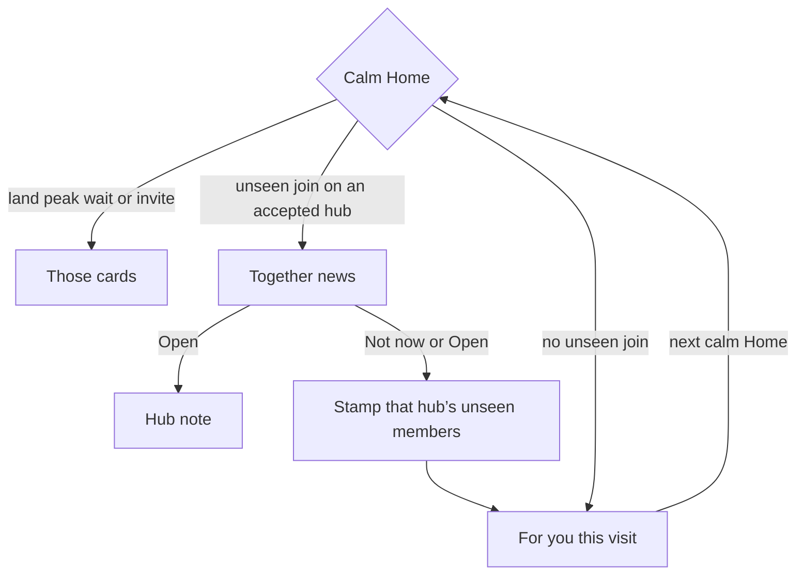
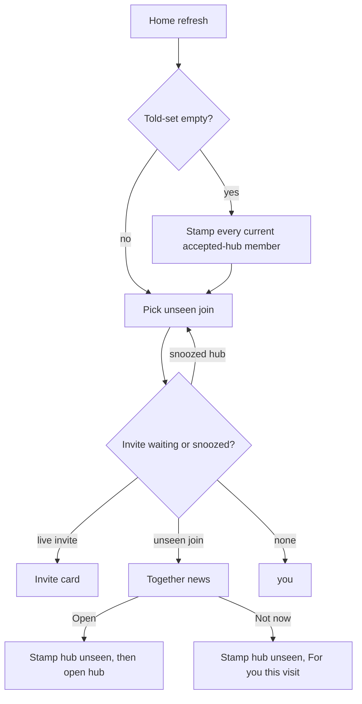

# Together news and hub catalog - Plan

## Goal Capsule

- **Objective:** Stop Home Together from occupying the hero as a directory of clusters the user already has. Accepted hubs become the catalog. Together occupies Home only as news that something just joined a hub.
- **Product authority:** This contract. It reopens T2 in `docs/plans/2026-07-17-006-spec-entity-orbits-product-contract.md` (home Together was optional after pull). Catalog writes stay the managed hub block in `CONCEPTS.md`. First-time missing hubs stay **hub association invite**. Surrounding work (Also about, after-Process sentence, classify quality) is not active scope.
- **Open blockers:** None.
- **Lane:** Full feature (Home hero + hub lists).
- **Stop:** No silent auto-create. No second list writer. No Also about rewrite. No flipping listing default on (constitution). Live writes stay on throwaway vaults.
- **Tail:** Home news card, headingless Show list fill, told-set so existing members are not news. Hard claim before code (`docs/collab.md`).

---

## Product Contract

### Summary

Home Together stops being a directory of existing clusters. Accepted hubs list their members in the managed block, filled now and kept current. Together occupies the hero only when a hub the user already has gained a member they have not been told about. The card names the new atom and the hub. Open goes to the hub note. Then Home returns to For you.

### Problem Frame

Together on calm Home currently takes the hero whenever any surfaceable orbit exists. It peeks the whole sibling set. Not now lasts until Home refreshes. In a vault that already has Show list, that card is almost always Show list, so For you never arrives. The original orbits contract called this optional T2 and said ship it only if pull (Also about) was not enough. Dogfood is that the directory is spam. The Show list hub already exists and is empty, because listing atoms on hub notes is opt-in and off.

### Key Decisions

- KD1. Together is news, not a directory. (session-settled: user-approved — chosen over snooze-only of the dump and over deleting Together) Governs R1, R2, R6.
- KD2. Catalog on every accepted hub, including people. (session-settled: user-directed — chosen over list hubs only) Governs R3, R4.
- KD3. Person pings stay. The sibling dump goes. (session-settled: user-directed — chosen over silent people) Governs R5, R6.
- KD4. Open goes to the hub note. (session-settled: user-approved — chosen over the new atom: the atom already landed) Governs R7.
- KD5. Fill existing members now. (session-settled: user-approved — chosen over future-only and lazy-on-Open) Governs R8.
- KD6. Standing news card, not a Process-only line. (session-settled: user-approved — overnight auto-run still pings on next Home open) Governs R9.
- KD7. Catalog writer is the existing hub-list capability, on for accepted hubs. (session-settled: user-approved — chosen over leaving the setting opt-in) Governs R3, R10.
- KD8. Open and Not now both consume the news. (session-settled: user-approved) Governs R11.
- KD9. Backfill is not news. (session-settled: user-approved) Governs R12.
- KD10. One waiting card. (session-settled: user-approved — not back-to-back related notes) Governs R13.

### Requirements

**Directory dies**

- R1. Calm Home must not show a Together directory of an existing cluster (label, member count, sibling peek, Open to an in-home title list) merely because an orbit of three or more exists.
- R2. Also about on an open atom stays. That pull list is not this card.

**Catalog**

- R3. After this ships, accepted hubs list hard-linked members in the managed hub block. The on-ramp is one first-run hub-list preview on calm Home, not a Settings hunt. The shipped listing default stays off. Settings **List atoms on hub notes** remains an off-ramp.
- R4. An accepted hub is a vault note that already is the entity: a person hub, a list or project note the user already has, or a hub created by invite accept. A missing hub is still the invite, not silent create.
- R8. Existing members of those hubs land in the managed block as part of first catalog fill. Human prose outside the delimiters is never rewritten. Person hubs get the block at the end of the note.
- R10. Catalog writes reuse the existing managed block and the existing bulk hub-list preview. Everyday Process does not open the preview. New members land on the hub as they file, the same way listing already works when the setting is on.
- R12. First catalog fill, Refresh hub lists, and any backfill of members that were already linked must not create Together news.

**News card**

- R5. Together news is eligible when listing is on and an accepted hub, including a person hub, gained a hard-linked member the user has not been told about. Person-only clusters are in scope for this ping. The old orbit-of-three directory gate does not apply.
- R6. The card names the new atom and the hub. It does not dump the sibling set.
- R7. Open opens the hub note in the vault, not the in-home sibling list and not the new atom.
- R9. If a join happens while Home is closed (auto-run), the news waits on the next calm Home open.
- R13. At most one Together news card waits. If several hubs have unseen joins, one hub is shown. The others wait until this card is consumed. Several new members on the same hub are still one card for that hub.

**Consume and priority**

- R11. Open and Not now both consume the news for that join. The same join must not return. A later different join on that hub or another hub may ping.
- R14. Land peak, wait/setup, and hub association invite still outrank Together news. Together news outranks the resurface stream. When Together news is waiting, it also outranks mind-change.

### Key Flows

- F1. First catalog fill
  - **Trigger:** This work lands on a vault that already has accepted hubs with members (Show list, Nichita, …).
  - **Steps:** Existing bulk hub-list preview shows which notes will change. Update lists writes managed blocks. Not now on the preview skips the backfill and leaves listing on so later Process still writes. No Together news from this fill.
  - **Outcome:** Show list contains its current shows. Nichita has a generated member list under the human prose. Home is For you unless a later join is unseen.
  - **Covered by:** R3, R8, R10, R12.

- F2. New show after Process
  - **Trigger:** Process files an atom that hard-links Show list. Land peak is dismissed.
  - **Steps:** The atom is already on Show list. Calm Home shows Together news naming that atom and Show list. Open opens Show list. Home then returns to For you.
  - **Outcome:** One ping, then silence until a different join.
  - **Covered by:** R5, R6, R7, R11, R14.

- F3. Overnight person join
  - **Trigger:** Auto-run files an atom about Nichita while Home is closed.
  - **Steps:** Next calm Home shows Together news naming that atom and Nichita. No list of every Nichita atom. Open opens Nichita.md.
  - **Outcome:** A person ping without a directory dump.
  - **Covered by:** R5, R6, R7, R9.

- F4. Not now, then another hub later
  - **Trigger:** News for Show list is up. A Nichita join is also unseen. User taps Not now.
  - **Steps:** Every currently unseen Show list member is stamped told. This visit returns to For you. Next calm Home may show Nichita.
  - **Outcome:** One card per visit, no directory, no in-session queue.
  - **Covered by:** R11, R13, KTD11.

- F5. Missing hub
  - **Trigger:** A cluster has no accepted hub yet.
  - **Steps:** Hub association invite still asks. Together news does not fire. Accept creates or links the hub and writes the atom into the managed block.
  - **Outcome:** First-time create stays an invite.
  - **Covered by:** R4.

### Acceptance Examples

- AE1. Standing Show list dump is gone
  - **Covers R1.**
  - **Given:** Show list has four hard-linked atoms. Nothing new has joined since last consume (or never news).
  - **When:** Calm Home opens.
  - **Then:** No Together card for Show list. For you (or a higher card) is the hero.

- AE2. Empty hub fills once, silently
  - **Covers R8, R12.**
  - **Given:** Show list exists and its body has no members. Four atoms already link to it.
  - **When:** First catalog fill completes.
  - **Then:** Those four titles are in the managed block. Home does not show Together news for that fill.

- AE3. New member pings once
  - **Covers R5, R6, R7, R11.**
  - **Given:** Show list is an accepted hub with a catalog. Process files Psycho-Pass linked to it. Land peak is dismissed.
  - **When:** Calm Home shows Together news. User Opens.
  - **Then:** The card named Psycho-Pass and Show list with no sibling peek. Show list opens. Reloading Home does not show that same card.

- AE4. Not now sticks for that join
  - **Covers R11.**
  - **Given:** Together news for a Show list join is on screen.
  - **When:** User taps Not now, then Home refreshes with no newer join.
  - **Then:** That card is gone. It does not return for the same join.

- AE5. Person ping, not a roster
  - **Covers R5, R6, KD3.**
  - **Given:** Nichita is an accepted person hub. A new atom about her files.
  - **When:** Together news is eligible.
  - **Then:** The card names that atom and Nichita. It does not list every other Nichita atom.

- AE6. One card when several hubs joined
  - **Covers R13.**
  - **Given:** Unseen joins on Show list and on Nichita.
  - **When:** Calm Home opens.
  - **Then:** One Together news card. After it is consumed, For you this visit. The other hub may ping on the next calm Home open.

- AE7. Invite still owns a missing hub
  - **Covers R4, F5.**
  - **Given:** Several watch atoms share a label and no vault note exists.
  - **When:** Calm Home would otherwise show Together.
  - **Then:** Hub association invite is the card. Together news does not fire.

### Success Criteria

- Home is For you (or invite / land peak) when no unseen join exists, even if Show list has many members.
- After Update lists on the first-run preview, opening Show list shows the shows that already belonged there. Preview skip leaves already-linked members off the note; they are not news; listing stays on so later joins write. Recovery is Settings Refresh, not a second Home prompt.
- A new join pings at most once, names the new atom and the hub, and Open lands on the hub.
- Person pings happen. They never present as a back-to-back roster of related notes.

### Scope Boundaries

**Deferred for later**

- A Process-only ping line as a second news surface (after-Process sentence stays its own plan).
- Changing Also about, citator, or mind-change content. Only the hero occupancy vs Together news is in scope (R14).
- Per-hub toggles, a Settings hub roster, or designate-from-Settings (already out of hub association invite).

**Outside this work**

- Auto-creating hubs. That stays human accept on the invite.
- Merging atom bodies into the hub. Body stays sacred. Catalog is links in the managed block.
- Classify / watchlist membership quality. That is `docs/plans/2026-08-17-2132-fix-watchlist-hub-membership-plan.md`.
- Deleting Together as a product word. The card label can stay Together. The directory behavior goes.

<!-- ce-section: work-relationships -->
### How This Work Fits Together

This plan owns the Home Together hero rule and the listing on-ramp for accepted hubs (existing preview; listing default stays off).

- Hub association invite (`docs/plans/2026-08-17-1540-feat-hub-association-invite-plan.md`) — **Shares** first-time create. This plan does not replace the invite. After accept, later members are catalog plus news, not another invite.
- Hub projection and hub list preview (`docs/plans/2026-07-28-001-feat-hub-projection-plan.md`, `docs/plans/2026-08-10-002-feat-hub-list-preview-plan.md`) — **Depends on** the managed block and bulk preview. This plan uses that writer via the existing preview on-ramp. It does not invent a second writer and does not flip the listing default.
- Entity orbits contract (`docs/plans/2026-07-17-006-spec-entity-orbits-product-contract.md`) — **Shares** T1 pull (Also about). This plan redefines T2 as news, not a standing directory.
- After Process sentence (`docs/plans/2026-08-17-1246-feat-after-process-sentence-plan.md`) — **Can proceed independently of** this plan. Land peak / Done copy is not Together news.

### Dependencies / Assumptions

- The managed hub block, hub list preview, and hub association invite already exist. This work changes when listing is on and when the Together hero may appear.
- "List atoms on hub notes" remains an off-ramp after listing is on.
- `docs/architecture.md` keeps hub projection default off. First fill uses the existing preview (KTD4).

### Outstanding Questions

None blocking. Copy and pick-order live on KTD6 and KTD8.

### Sources / Research

- `docs/plans/2026-07-17-006-spec-entity-orbits-product-contract.md` — T2 optional, pull-first.
- `docs/reviews/2026-07-17-constellations-staff-adversarial-review.md` — standing Home Together as surface inflation.
- `docs/plans/2026-08-17-1540-feat-hub-association-invite-plan.md` — after accept, later atoms land with no ask.
- `CONCEPTS.md` — managed hub block, hub list preview, hub association invite.
- Live Home: Together is first surfaceable orbit, Not now is in-memory only, Open is in-home siblings, listing default off.
- `src/pipeline/hubQualify.ts` — headingless notes are not list-hub candidates.
- `docs/solutions/features/entity-orbits-hard-keys-and-also-about.md` — pull catalog; Together-push ban is superseded by this plan’s news card.
- `docs/solutions/ui-patterns/a-one-time-migration-state-is-a-first-run-experience.md` — stamp existing members told on first run.
- `docs/solutions/logic-errors/a-read-only-surface-that-calls-a-resolver-with-a-real-save.md` — Home refresh must not consume.

---

## Planning Contract

### Key Technical Decisions

- KTD1. Consume is a device-local told-set keyed by hub title + member path, with no TTL. Home refresh must not stamp. Stamp on Open, Together Not now, first-run seed, first-fill preview skip (not Refresh skip), invite accept (that hub’s member paths), and first-fill Update lists. Open or Not now on a news card stamps every currently unseen member of the shown hub. Cites KD8, KD9, KD10. Governs R11, R12, R13.
- KTD2. News uses a new picker over hard links onto accepted hubs. It does not call `pickPrimaryOrbit`. Person hubs are included. No three-member floor. Cites KD1, KD3. Governs R5.
- KTD3. Named list hubs (Show list, Movie list, Watch list) and person hubs qualify for projection even with no H2. Cites KD5. Governs R8.
- KTD4. `enableHubProjection` stays default false. First catalog fill is first calm Home: set listing on in this vault, then the existing hub-list preview. X and Escape equal Not now. Do not open preview from onload, Process, Refresh, or an empty plan. Persist a first-fill stamp so a crash cannot loop the modal. (session-settled: user-approved — chosen over silent fill) Cites KD7. Governs R3, R10.
- KTD5. Together Open calls the vault-note open used by the library, not the in-home sibling list. Cites KD4. Governs R7.
- KTD6. Card copy is a structured helper (`togetherNewsCopy`) under `docs/voice.md`. Same-hub multi-join names the newest living atom and the hub only. Cites KD3. Governs R6.
- KTD7. Catalog writes go through `runHubProjectionForHubs` / `applyHubProjectionPlan` / `seedHubListMarkdown`. No second writer. Export `LIST_NAMED` (or `isNamedListHubTitle`) from `hubInvite.ts` for qualify and news. Cites KD7. Governs R10.
- KTD8. One waiting card: the hub whose unseen member has the newest source date. Cites KD10. Governs R13.
- KTD9. While a hub association invite for that hub is snoozed, Together news does not fire for it. First accept is not news. Governs R4, R5.
- KTD10. Listing off (Settings off-ramp) means no Together news. First-fill preview Not now stamps current members told and leaves listing on so later Process writes. Refresh hub lists Not now does not stamp told. Governs R3, R12.
- KTD11. Consuming a Together card (Open or Not now) restores For you for this Home visit. Other unseen hubs wait until the next calm Home open. Governs R13, R14.

### High-Level Technical Design

Together news is a join event, not an orbit view.

### Assumptions

- Named-list titles are the `LIST_NAMED` set in `hubInvite.ts`, exported as `isNamedListHubTitle` in U2.
- Person hub titles already used for Also about exclusivity are the person accepted-hub set.
- Vault-scoped `app.saveLocalStorage` is the consume store, same family as invite snooze and resurface throttle.

### Implementation Constraints

- English copy in source until a localization claim. Follow `hubAssociationInviteCopy` + test, not new literals in the view.
- Constitution: listing default stays false (`docs/architecture.md`).
- Body sacred: managed block only.

### Sequencing

U2 (headingless qualify + export named-list helper) → U1 (picker + told-set) → U3 (first-run preview + seed told) → U4 (Home card) → U5 (docs). U1 depends on U2. U3 depends on U1 and U2. U4 depends on U1. Keep Together directory unrendered until U4 lands in the same PR.

---

## Implementation Units

### U1. Together news picker and told-set

- **Goal:** Replace orbit-directory selection with unseen-join selection and durable consume.
- **Requirements:** R1, R5, R11, R12, R13. KTD1, KTD2, KTD8, KTD9.
- **Dependencies:** U2.
- **Files:** create `src/pipeline/togetherNews.ts`; create `test/togetherNews.test.ts`; modify `src/home/atomsHomeView.ts` only as far as swapping `refreshEntitySurfaces` Together fill to the new picker (card chrome in U4).
- **Approach:**
  1. A join id is hub title + member path.
  2. Accepted hubs use the same named-list + person rule as KTD3, including headingless Show list.
  3. Collect unseen hard links onto those hubs. Skip min-3. Skip hubs with a live or snoozed invite. Skip when listing is off.
  4. Pick one hub: newest member source date.
  5. If the told-set key is missing, seed it with every current accepted-hub member and return no card.
  6. Card consume stamps every currently unseen member of that hub. Invite accept stamps that hub’s member paths.
- **Execution note:** Implement the picker and told-set test-first. Do not render the new card in this unit beyond wiring the data so tests can drive Home refresh without the sibling peek.
- **Patterns to follow:** `writeSnooze` / `readSnoozeMap` in `atomsHomeView.ts`; resurface throttle; `collectHubAssociationInvites` filtering snoozed ids. Do not copy 14-day TTL.
- **Test scenarios:**
  - Covers AE1. Four Show list members, told-set seeded: picker returns none.
  - Covers AE3. New member path not in told-set: picker returns that atom + Show list.
  - Covers AE5. New atom on Nichita: picker returns it with no sibling roster. Also about on an open Nichita atom is unchanged.
  - Covers AE6. Two hubs with unseen members: one result, newest source date wins.
  - Covers AE4. After consume stamps all unseen members on that hub, picker returns none for that hub.
  - Two unseen Show list members, consume once: picker returns none for Show list.
  - Missing told-set on first call seeds all current members, including headingless Show list, and returns none.
  - Snoozed Show list invite: no news for Show list; another hub may still ping.
  - After invite accept, picker returns none for those member paths.
  - Soft-key-only links never count as joins.
  - Listing off: picker returns none.
- **Verification:** `npx vitest run test/togetherNews.test.ts` plus existing `test/entityOrbitIndex.test.ts` still passes (Also about unchanged).

### U2. Headingless accepted hubs in projection

- **Goal:** Show list and other named list hubs receive a managed block without needing an H2 first.
- **Requirements:** R8, R10. KTD3, KTD7.
- **Dependencies:** None.
- **Files:** `src/pipeline/hubQualify.ts`; `src/pipeline/runHubProjection.ts` (`isListHubCandidate`, `collectListHubTitles`, `resolveListHubsFromVault`); `src/pipeline/hubInvite.ts` (export named-list helper); `test/hubQualify.test.ts`; `test/runHubProjection.test.ts`; `test/hubProjection.test.ts`.
- **Approach:**
  1. Export `isNamedListHubTitle` from `hubInvite.ts`.
  2. Named list hubs and person hubs are write candidates even with no `##`, including `collectListHubTitles` so everyday Process projects new members.
  3. Keep the denylist (dailies, `Atoms/`, templates).
  4. Writes still go through `runHubProjectionForHubs` / `seedHubListMarkdown`.
- **Patterns to follow:** `isListHubCandidate`, `shouldWriteNonPersonHub`, invite `seedHubListMarkdown` which already bypasses the heading brake.
- **Test scenarios:**
  - Covers AE2. Headingless empty Show list, four hard-linked atoms: plan includes Show list and apply writes the four titles in the managed block.
  - Headingless daily or `Atoms/` note is still excluded.
  - Person hub with human H2s: members land in the generated block; prose outside delimiters unchanged.
  - Movie list named hub with no H2 and two members: included.
- **Verification:** `npx vitest run test/hubQualify.test.ts test/runHubProjection.test.ts test/hubProjection.test.ts`.

### U3. First catalog fill and listing on-ramp

- **Goal:** Existing installs get one hub-list preview. Current members are told either way so they are not news.
- **Requirements:** R3, R8, R10, R12. KTD4, KTD10.
- **Dependencies:** U1, U2.
- **Files:** `src/plugin/main.ts` (`openHubListPreview`); `src/home/atomsHomeView.ts` or settings toggle-on path; `src/settings/hubListPreviewModal.ts` only if skip must stamp told; `test/hubListPreview.test.ts`; Home/preview tests as needed.
- **Approach:**
  1. Extract first-fill policy (shouldOffer, onConfirm, onSkip) as pure functions. Host is first calm Home, not onload.
  2. If first-fill stamp is missing, listing is off, and the preview plan has rows, set listing on then call `openHubListPreview`. Empty plan: stamp first-fill done, do not open a modal.
  3. Update lists: apply plan, seed told for members just written, stamp first-fill done.
  4. Not now / X / Escape: skip bulk write, leave listing on, seed told for current members, stamp first-fill done. Do not use the preview emptyBody Settings homework on this path.
  5. Refresh hub lists Not now does not seed told.
  6. Everyday Process still does not open the preview.
  7. Invite-first vaults: accept writes the block (`seedHubListMarkdown`) and stamps those paths; if listing is still off, the next calm Home with members not in a block still offers first-fill.
- **Patterns to follow:** Settings toggle-on → `plugin.openHubListPreview`; preview Not now semantics in CONCEPTS.
- **Test scenarios:**
  - Covers AE2 / F1. Listing off, headingless Show list with members: preview plan includes it.
  - Preview Not now: listing is on, Show list body still empty, told-set contains the four paths, picker returns none.
  - Listing later off via Settings: picker returns none even if a new member files until listing is on again.
- **Verification:** `npx vitest run test/hubListPreview.test.ts test/togetherNews.test.ts`.

### U4. Home Together news card

- **Goal:** Calm Home shows one news card, not a directory. Open is the hub note.
- **Requirements:** R1, R2, R6, R7, R9, R14. KTD5, KTD6.
- **Dependencies:** U1.
- **Files:** `src/home/atomsHomeView.ts`; `src/pipeline/togetherNews.ts` (copy helper if not in U1); `styles.css` if the directory peek styles should not apply; `test/togetherNews.test.ts` or a new home test; `docs/qa/app-navigation-map.md` if the Home calm card actions change.
- **Approach:**
  1. Delete directory Together: member count, sibling peek, “Open to see them all,” Open to `entity-siblings`.
  2. Card: Together kicker (same as list invite, not person orange), title = newest atom, supporting line = hub title only, Open primary, Not now secondary. No count, no peek list, no extra sentence.
  3. Open stamps that hub’s unseen members, then `openPathInVault` for the hub. Not now stamps the same set and restores For you this visit.
  4. Also about strip still uses `pickPrimaryOrbit` / entity-siblings.
  5. Hero stack unchanged except Together is news-or-absent, never a dump.
  6. Keep `togetherCard` null until this unit so U1 wiring cannot resurrect the directory.
- **Patterns to follow:** `hubAssociationInviteCopy`; library `openPathInVault`; invite card actions.
- **Test scenarios:**
  - Covers AE3. News card copy names Psycho-Pass and Show list; no three-title peek.
  - Covers AE4. Not now stamps told; next `loadData` does not rebuild that card.
  - Open sets no `entity-siblings` homeOpen for Together; hub path is opened.
  - Covers AE7. Invite present: news card is not shown.
  - Land peak present: news card is not shown.
  - Covers AE5. Person news has no sibling list.
- **Verification:** targeted vitest plus a Home calm check against `docs/qa/app-navigation-map.md`.

### U5. Docs and superseded Together-push learning

- **Goal:** Vocabulary and T2 match news, not directory.
- **Requirements:** Success criteria; work-relationships.
- **Dependencies:** U1–U4 for accuracy; can draft in parallel and land last.
- **Files:** `CONCEPTS.md` (Together news already added — align managed hub block default-off with KTD4 + on-ramp; mind-change is highest For-you cue when Together news is not waiting); `docs/solutions/features/entity-orbits-hard-keys-and-also-about.md`; `docs/architecture.md` T2 / Together line if it still describes a standing orbit card; `docs/qa/app-navigation-map.md` (add Together news Open / Not now; there is no Together section today).
- **Approach:** Keep listing default-off in CONCEPTS. State the first-run preview on-ramp. Mark the 2026-07-17 “do not push Together” insight as superseded by unseen-join news. Do not seed hubs in QA.
- **Test expectation:** none -- documentation only. Nav-map guard must still pass if that file is edited.
- **Verification:** `CONCEPTS.md` Together news matches R5–R7. Nav-map source anchors still resolve.

---

## Verification Contract

- **U1:** `npx vitest run test/togetherNews.test.ts test/entityOrbitIndex.test.ts`
- **U2:** `npx vitest run test/hubQualify.test.ts test/runHubProjection.test.ts test/hubProjection.test.ts`
- **U3:** `npx vitest run test/hubListPreview.test.ts test/togetherNews.test.ts`
- **U4:** `npx vitest run test/togetherNews.test.ts` and any Home test added; nav-map if edited
- **U5:** docs review; nav-map guard if `docs/qa/app-navigation-map.md` changes
- **Repo:** `npm test` before merge. Goldens are Linux CI; do not `--update-goldens` on Mac.
- **Dogfood:** throwaway vault. Do not seed hubs to force a green Together screenshot (`CLAUDE.md` product dogfood honesty).

---

## Definition of Done

- Calm Home with an existing Show list and no new join shows For you, not a Together directory.
- First-run preview can fill headingless Show list. That fill is not news.
- A new hard-linked member pings once, names that atom and the hub, Open lands on the hub note, and the same join does not return.
- A new atom about an accepted person hub pings without listing every related note.
- Invite still owns a missing hub.
- Listing default remains false. Settings remains the off-ramp.
- Abandoned experiment code is not in the diff.
- `npm test` green for the files in the Verification Contract.

### Deferred to Follow-Up Work

- After-Process sentence as a second ping (`docs/plans/2026-08-17-1246-feat-after-process-sentence-plan.md`).
- Locale catalog for Together copy (plugin still English-in-source).
- Replacing `runHubProjection` read-await-modify with `vault.process` (known lost-update learning; out of this claim unless the fill path is touched and the window is cheap to close).

