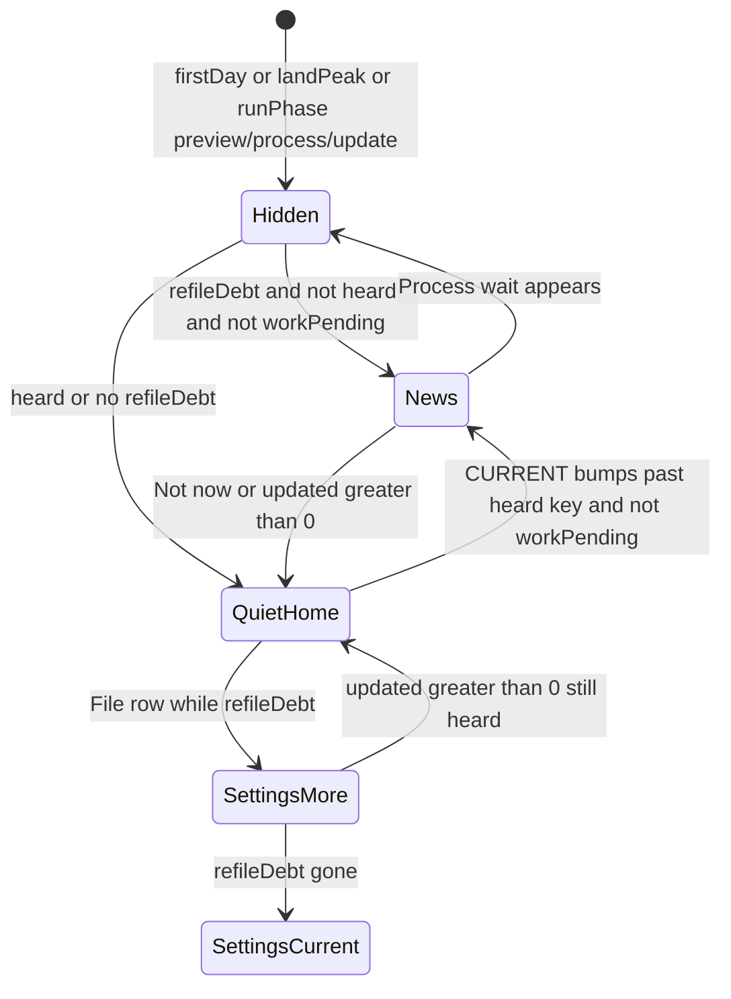
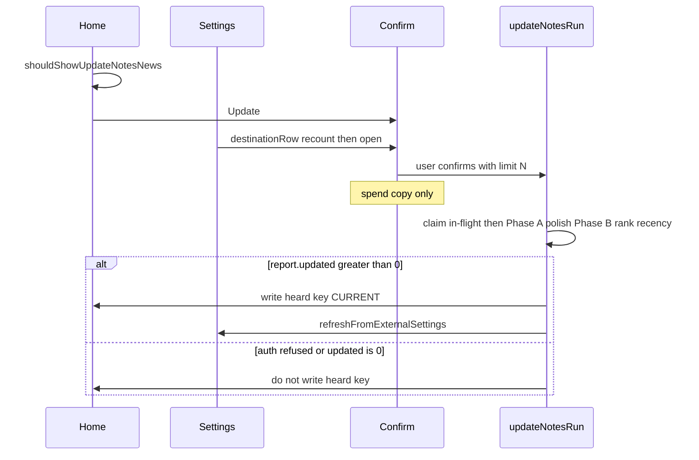

# feat: Update notes once, then Settings

## Goal Capsule

- **Objective:** After a quality bump, Home names what got smarter once. Confirm is the spend. Home goes quiet. More waves live on Settings `Update notes › <short answer>`. Fifteen notes per run, same Plus meter, recent-first among still-below-CURRENT atoms.
- **Authority:** This plan. UX mock `docs/design-handoff/atoms-view/update-notes-once-then-settings.html`. Voice `docs/voice.md`. Settings grammar `docs/solutions/ui-patterns/a-settings-row-is-a-noun-and-its-state-is-the-answer.md`. Architecture hard stop: no auto Update notes.
- **Product Contract preservation:** bootstrap (no upstream requirements-only artifact). Session-settled Apple shape recorded on Key Decisions.
- **Stop conditions:** Do not change `plus-service` classify consume. Do not bump `CURRENT_ATOMS_QUALITY` (already 9). Do not add a weekly Home return. Do not auto-run Update notes. Do not open a plugin locale catalog in this claim.
- **Tail ownership:** Implementation run owns simplify, code review, durable learning, world-class QA, adversarial QA, version bump, and PR evidence. Hard claim (Issue + STATUS row) before code.

---

## Product Contract

### Summary

Update notes still costs filings. The library still catches up in waves of fifteen. Home is not the meter. Home is one news moment per quality bump. Settings is where you ask for the rest.

### Problem Frame

Quality 8→9 re-queued every older atom. Update notes hits the same `POST /v1/classify` meter as filing (150 / period). The shipped Home strip is titled "Filing got smarter", teaches "tap again", and can sit under the Process wait card with its own primary. Confirm re-pitches the feature. The ranker boosts file `mtime`, so a wave that writes notes prefers those same notes next time. A weekly Home slot would pace spend by nagging. The Apple-shaped alternative: news once, spend on confirm, silence, more in Settings.

### Actors

- A1. Plus subscriber on phone or desktop (Home + Settings; command palette is not the design center).
- A2. BYOK user (same surfaces; confirm names the API key, not filings).
- A3. No engine yet (confirm still names sign-in or a key; Update cannot spend).

### Key Decisions (product)

- KD1. **Home once per quality, not weekly.** `(session-settled: user-approved — chosen over weekly Home nags: Apple would not put a billing ritual on Home.)` Not now hides until the next `CURRENT_ATOMS_QUALITY`. A successful Update wave (`report.updated > 0`) also hides Home for this quality. Governs R1, R2, R5, R6, R7.
- KD2. **Same meter, fifteen per confirm.** `(session-settled: user-directed — chosen over a free-update pool or a 30-per-era cap: leftover included filings, top-up only when the month is empty.)` `UPDATE_NOTES_BATCH_LIMIT` stays 15. Governs R11.
- KD3. **One name: Update notes.** `(session-settled: user-approved — chosen over "Filing got smarter": one card name on Home, Settings, and the command.)` Confirm chrome is the spend question `Update N notes?`, not a second product name. Governs R3, R14.
- KD4. **Confirm is the spend.** `(session-settled: user-approved — chosen over a confirm that repeats the quality pitch.)` Titles and links may change. Capture text will not. Cancel, Escape, and click-outside are free. Governs R4, R16.
- KD5. **Process waiting hides the strip.** `(session-settled: user-approved — chosen over a secondary strip under the wait card: one hero.)` Governs R10.
- KD6. **More waves live in Settings.** `(session-settled: user-approved — chosen over Home returning on a clock.)` File group, noun + state. Governs R8, R9.
- KD7. **Honest hole is accepted.** `(session-settled: user-approved — chosen over keeping Home as the catch-up surface.)` Home delivers at most one wave of 15 per quality, and only when the news card is actually shown (idle Home, not wait / first-day / land-peak). Chronic wait-card users get 0 from Home. Settings and the command are their waves. Governs R7, R10.
- KD8. **Recent capture days first.** Rank still-below-CURRENT atoms by source daily (when the thought was captured), then `created`, never file mtime. Governs R12.

### Requirements

- R1. When refile debt exists (`q < CURRENT` on linker atoms), Home is not first-day, no filing run is on screen, land peak is off, Process is not waiting, and this quality has not been heard, Home shows the Update notes news card.
- R2. Home news is keyed off refile debt only. Polish-only work does not show the card or keep Settings out of `Up to date`. Polish-only is not a user-facing Update notes job in this claim: no Home card, no Settings action, no polish-only confirm. Phase A polish may still run inside a refile wave.
- R3. The card title is `Update notes`. The body is this quality's full reason sentence. No eligible count, no "tap again", no "Filing got smarter".
- R4. Confirm copy is spend-only. Live Plus (filings remain): title `Update N notes?`, body `Uses Atoms Plus (N of this month's filings). Titles and links may change. Your original capture text will not.` Spent meter (Plus exhausted, period live): keep Plus identity; say this month's included filings are used up; do not ask them to add an API key. Ended period: subscribe in Settings. BYOK names the API key. No engine asks to sign in or add a key. Confirm does not repeat the quality reason.
- R5. Not now writes the existing quality-era localStorage key (`atoms-update-notes-dismissed-q` = `CURRENT_ATOMS_QUALITY`) and Home goes quiet.
- R6. Write the heard key when `runRefreshEligibleAtoms` returns a report with `updated > 0` (Home, Settings, or command). Auth abort, throw before a report, and `updated === 0` (all-failed classify or polish-only) do not write it, so Home news can still retry.
- R7. After Not now or a wave with `updated > 0`, Home stays quiet even when refile debt remains. Settings still offers waves until debt is gone.
- R8. Settings File group always shows a destination row named `Update notes` immediately after the Filing engine row. Value is this quality's short answer while refile debt remains, else `Up to date`.
- R9. Tapping the row while debt remains opens the same confirm as Home. Recount debt on that tap (do not reuse a stale `display()` snapshot). Tapping `Up to date` is a silent no-op. While an Update run is in flight, a second tap does not open another confirm.
- R10. While `shouldShowWaitCard` is true, the Update notes strip is not drawn.
- R11. A confirmed Home or Settings run refiles at most the quoted N (`min(refileDebt, UPDATE_NOTES_BATCH_LIMIT)`), passed as `runUpdateNotes({ limit: N })`. The command with no confirm uses the default 15. Local polish is not a standalone job (R2); it may still run as Phase A inside a refile wave. Confirm does not mention polish.
- R12. Refile ranking prefers newer source-daily stamps, then `created`. File `mtime` is not an input. At equal stamps, link-health and lower quality are tie-breaks only. Recency is computed from pre-polish content.
- R13. A quality bump ships two adjacent English strings next to `CURRENT_ATOMS_QUALITY`: full Home reason, short Settings answer. This claim ships the q9 pair and does not bump CURRENT.
- R14. The command `atoms:update-notes` is named `Update notes`. It is a no-confirm force path (CLI and palette skip the spend Modal, still claim the in-flight lock). Home and Settings always confirm first.
- R15. New plugin copy stays English in source, centralized in copy helpers, and passes `test/copyVoice.test.ts` (no em dashes, no guilt).
- R16. Body stays verbatim. Update notes never auto-runs. Cancel / Escape / click-outside on confirm does not call `runUpdateNotes`.

### Key Flows

- F1. Quality bump, refile debt, idle Home → news card → Update → spend confirm → wave of ≤15 with `updated > 0` → Home quiet; Settings still shows the short answer if debt remains.
- F2. News card → Not now → Home quiet until the next CURRENT bump; Settings still offers waves.
- F3. Process waiting on Home → Update strip absent.
- F4. Home already quiet, Settings `Update notes › <short answer>` → same confirm → another wave; Settings re-renders the answer after the run.
- F5. No refile debt → Settings `Update notes › Up to date` → tap does nothing.
- F6. Plus exhausted / lapsed / no engine → confirm names that path (not the live-Plus spend sentence, not a BYOK pitch on a live Plus session); a refused classify or `updated === 0` does not write the heard key.

### Acceptance Examples

- AE1. Covers F1. Given q9 debt and Home not dismissed, when the user opens Atoms home with no Process wait, then the strip title is `Update notes` and the body is the q9 reason with no count.
- AE2. Covers F1 / R4. Given Plus with filings left and 40 refile-debt atoms (`q < CURRENT`), when they tap Update, then the Modal title is `Update 15 notes?`, the body names 15 of this month's filings plus the two sacred-text sentences, and neither title nor body contains "Readings" or "Filing got smarter".
- AE3. Covers F1 / R7. Given AE2 confirmed and the run returns `updated > 0` with debt remaining, when they return to Home, then the strip is gone and Settings still shows `Readings can link`.
- AE4. Covers F2. Given the news card, when they tap Not now, then Home is quiet and Settings still offers waves for this quality.
- AE5. Covers F3 / R10. Given unprocessed captures on Home, when the wait card is showing, then the Update notes strip is not in the DOM.
- AE6. Covers F4. Given Home already quiet with debt remaining, when they open Settings → File → Update notes, then the same spend confirm opens.
- AE7. Covers F5. Given every linker atom is at CURRENT, when they open Settings, then the row reads `Up to date` and a tap does not open confirm.
- AE8. Covers R12. Given two eligible atoms, one sourced from yesterday's daily with healthy links and one sourced from a daily two years ago with no links, when a wave of 1 is ranked, then yesterday's atom is chosen. After a polish `mtime` bump on the older file, ranking is unchanged.
- AE9. Covers F6. Given Plus exhausted (period live) with refile debt, when they open confirm, then copy keeps Plus identity and does not ask for an API key. Given a classify refusal or `updated === 0`, the heard key is not written.

### Success Criteria

- Live vault smoke on `test_vault/` or `docs/media/demo-vault/` shows: news once, spend confirm, quiet Home after `updated > 0`, Settings more, Process wait hides the strip, `Up to date` when current.
- Ranker unit tests fail if `mtime` is restored as an input or if missing `created` ranks as today.
- Copy tests lock the q9 reason, the short answer, the Plus spend sentence, and the two sacred-text sentences.

### Scope Boundaries

**In scope**

- Home strip copy, eligibility, Process-wait hide, heard-key on Not now and on `updated > 0`.
- Shared spend-only confirm used by Home and Settings (quoted N is the run limit).
- File-group destination row immediately after Filing, footer sentence, recount on open, refresh after run.
- Ranker recency from source daily then created, never mtime.
- q9 reason + short answer constants. Command name (no-confirm). Version bump. Tests. Mock README settled pointer.

**Out of scope**

- Plugin locale catalog.
- plus-service classify purpose/kind split or a separate Update pool.
- Bumping `CURRENT_ATOMS_QUALITY`.
- Weekly Home timetable, done-card "see you next week", or Home count of remaining notes.
- Replacing Obsidian `Modal` confirm with a new action-sheet primitive.
- Auto Update notes. Personal Remote Vault writes by agents.
- A polish-only user door after refile debt is gone.
- Clamping confirm N to Plus remaining when remaining is 1–14 (over-quote then server 402 is accepted; Home is not the meter).

### Deferred for later

- A future quality bump (10+) ships a new reason/answer pair in the same adjacent constants.
- Optional later: restore link-poverty as the primary ranker key if dogfood shows recent well-linked notes starving islands that needed the bump. Not in this claim.
- Optional later: min(N, Plus remaining) on confirm if over-quote feels dishonest in dogfood.

### Outside this product's identity

- Task-app gravity, due dates, or a guilt queue of "notes left to update".
- Home as a billing dashboard.

---

## Planning Contract

### Assumptions

- Confirm stays the existing Obsidian `Modal` (copy + titleEl + limit wiring). The mock's iOS sheet is directional chrome, not a new primitive.
- Recency is the primary ranker key. Inferred from KD8 plus the Settings footer "New days still come first." This rewrites the shipped empty-link-first characterization in `test/smartRefresh.test.ts`.
- Ranker recency is a new `refileRecencyMs(content)` in `src/pipeline/refreshAtoms.ts`: source daily day if present, else `created` if present (same date shapes as `parseCreatedMs`), else null and sort last by path. Missing `created` must not become today. Do not use `parseImmutableFrontmatter.created` (it defaults to `localDateYmd()`), `refreshChunkDate` (Phase B chunk key, source-first with that default), or `libraryTimeMs` (falls back to file mtime; `atomsHomeData` already imports `refreshAtoms`). Compute recency from pre-polish `EligibleAtom.content`.
- Heard-key write lives in `updateNotesRun` when `report.updated > 0`. Auth failure, throw, and `updated === 0` do not write it.
- English-in-source is the same convention as the measurement-series plan (`docs/localization.md` catalog still unclaimed).
- This claim does not bump quality; it teaches q9 on Home/Settings for vaults that still have q<9 debt.
- `finishHomeRun` land-peak after Update notes is unchanged. Quiet Home means the news strip does not return, not that the Done card is suppressed.

### Key Technical Decisions

- KTD1. **Heard = quality-era localStorage, including after `updated > 0`.** Reuse `atoms-update-notes-dismissed-q`. Do not add a weekly key. (Instantiates KD1, R5, R6.)
- KTD2. **One copy module, two quality strings.** `CURRENT_ATOMS_QUALITY_REASON` (Home body) and `CURRENT_ATOMS_QUALITY_ANSWER` (Settings value) live next to `CURRENT_ATOMS_QUALITY` in `src/pipeline/atomQuality.ts`. Bumping CURRENT without replacing both is a review miss. q9 reason: `Readings of the same thing can link now. Your original text stays.` q9 answer: `Readings can link`. (Instantiates R3, R8, R13.)
- KTD3. **Strip predicate is a pure helper.** Export something like `shouldShowUpdateNotesNews` from `src/home/atomsHomeData.ts` taking refile count, dismissed quality, CURRENT, `workPending`, first-day, run phase, land peak. Home view only renders. (Instantiates R1, R10.)
- KTD4. **Shared confirm opener owns title and spend.** Home and Settings call one helper. `titleEl` is `Update N notes?` (singular `note` when N=1). `contentEl` is billing plus the two sacred-text sentences. Buttons Cancel and Update (CTA). Never `Filing got smarter`. Confirm calls `runUpdateNotes({ limit: N })` with the quoted N. Dismiss does not call the run. (Instantiates R4, R9, R11, R16.)
- KTD5. **Settings row is `destinationRow`, always visible, immediately after `renderEngineRow`.** Name is the noun, `desc` is the answer. Do not use `actionRow`. Do not hide the row when current. (Instantiates KD6, R8, R9.)
- KTD6. **File-group footer gains one Update notes sentence.** Append `Older notes catch up when you ask. Same AI as filing. New days still come first.` Do not rewrite the Filing definition. Do not add a second footer. (Instantiates R8; `CONCEPTS.md` Setting group: a footer may name a row the group actually renders.)
- KTD7. **Ranker drops `mtime` and the today-default.** `refileRecencyMs` as in Assumptions. Sort newer first. Link-health and lower quality remain tie-breaks at equal recency. `listLinkerAtoms` may keep `mtime` on the type for other callers only if ranking ignores it. (Instantiates KD8, R12.) `(session-settled: user-directed — chosen over ranking by file mtime: Update writes bump mtime and would re-pick the same fifteen.)`
- KTD8. **Quoted N is the run cap.** `N = min(refileDebt, UPDATE_NOTES_BATCH_LIMIT)`. Pass `{ limit: N }` from the shared confirm. Do not clamp to Plus remaining in this claim. (Instantiates R4, R11.)
- KTD9. **Hot-file overlap.** `src/home/atomsHomeView.ts` is also on blocked #579. `src/settings/settings.ts` is on #586 (in review) and #561. Rebase/coordinate; do not drive those claims.
- KTD10. **Version bump** on this user-visible change (`manifest.json`, `package.json`, `versions.json`). Show version in Settings as today.
- KTD11. **Settings refile count is a vault read, then a recount.** `display()` may estimate from `metadataCache` frontmatter (`generated-by: linker` and `atoms-quality` < CURRENT), matching `aggregateTagsFromFileCaches`. `onOpen` re-counts before no-op vs confirm. After `updateNotesRun` returns a report, call `settingTab.refreshFromExternalSettings()` so an open File group flips answer. While `manualFilingInFlight` or `backfillBusy`, `onOpen` returns. Billing map: live Plus ≠ exhausted Plus ≠ none. (Instantiates R4, R9, F6.)

### High-Level Technical Design

Home, Settings, and the command are three doors into one run. Only Home is gated by the heard key. Home and Settings confirm first; the command does not. The run always claims `manualFilingInFlight`.

### Alternative Approaches Considered

- **Weekly Home slot** (`docs/design-handoff/atoms-view/update-notes-weekly-waves.html`). Paces spend by returning on a clock. Rejected: Home becomes a billing ritual.
- **Don't charge Update / separate refresh pool.** Requires plus-service purpose. Rejected: same meter; leftover then top-up.
- **Keep empty-link-first ranker, only drop mtime.** Satisfies "do not re-pick just-updated" but contradicts "new days still come first." Deferred as a follow-up if islands starve.

---

## Implementation Units

### U1. Quality strings and spend-only copy

**Goal:** Centralize q9 reason/answer and rewrite strip + confirm copy so tests lock the Apple sentences, including exhausted-Plus vs none.

**Requirements:** R3, R4, R8, R13, R15. KD3, KD4.

**Dependencies:** none

**Files:**
- `src/pipeline/atomQuality.ts` (modify)
- `src/home/atomsHomeData.ts` (modify)
- `test/atomsHomeData.test.ts` (modify)
- `test/atomQuality.test.ts` (modify)
- `test/copyVoice.test.ts` (existing gate)

**Approach:**
1. Add `CURRENT_ATOMS_QUALITY_REASON` and `CURRENT_ATOMS_QUALITY_ANSWER` beside `CURRENT_ATOMS_QUALITY` with a comment that a CURRENT bump replaces both.
2. `updateNotesStripCopy` takes the reason: title `Update notes`, body = reason, button `Update`. Drop counts and `updateNotesBatchWhy` from the strip.
3. Confirm helpers return `{ title, body }`. Title is `Update N notes?`. Body is billing plus `Titles and links may change. Your original capture text will not.` Billing variants: live Plus (N filings), spent meter, ended period, BYOK, none. Delete quality re-pitch and polish-matrix branches.
4. Add `updateNotesSettingsAnswer(refileCount)` → answer or `Up to date`.

**Execution note:** Implement new copy test-first against AE1, AE2, AE7, AE9.

**Patterns to follow:** Existing copy helpers in `src/home/atomsHomeData.ts`. Measurement-series English-in-source convention. `docs/voice.md`. Spent-meter vs ended-period: `docs/solutions/logic-errors/count-the-sites-that-compute-the-predicate-not-the-ones-that-reported-it.md` and `a-device-may-not-assert-an-entitlement-the-server-has-not-confirmed.md`.

**Test scenarios:**
- Happy path: strip copy for any positive refile count is title `Update notes` and body exactly the q9 reason.
- Covers AE2. Plus confirm for 40 refile-debt atoms: title `Update 15 notes?`, body contains `15 of this month's filings`, `Titles and links may change`, and `Your original capture text will not`, and contains neither `Filing got smarter` nor `Readings`.
- Happy path: Settings answer with refile > 0 is `Readings can link`; with 0 is `Up to date`.
- Edge: N = 1 uses singular `note` and `1 of this month's filings`.
- Edge: BYOK confirm names the Anthropic key and does not mention filings.
- Covers AE9. Spent-meter Plus does not use the none sign-in sentence and does not ask for an API key.
- Error: billing `none` tells them to sign in or add a key.

**Verification:** Copy tests fail if the old title, tap-again sentence, or polish-matrix confirm returns. `copyVoice` stays green.

---

### U2. Ranker recency, not mtime

**Goal:** Waves pick newer capture days. A polish or refile write cannot make the same files win the next wave. Missing stamps do not rank as today.

**Requirements:** R12, R16. KD8. KTD7.

**Dependencies:** none (can land parallel to U1)

**Files:**
- `src/pipeline/refreshAtoms.ts` (modify)
- `test/smartRefresh.test.ts` (modify)
- `test/refreshAtoms.test.ts` (modify if it constructs `mtime` for ranking)

**Approach:**
1. Add `refileRecencyMs(content)` per Assumptions. Do not import Home. Do not call `parseImmutableFrontmatter` for the clock.
2. Sort newer first. At equal recency, keep modest link-poverty / broken-link / lower-quality tie-breaks.
3. Remove the `Math.floor(mtime / 1e10)` term. Ranking tests must not pass `mtime` as the recency signal.
4. Rank from pre-polish content. Do not change `UPDATE_NOTES_BATCH_LIMIT`, Phase A polish, quality stamp-on-refile-only, or body extraction.

**Execution note:** Rewrite the empty-link-first characterization; add AE8 before changing `refileScore`.

**Patterns to follow:** `docs/solutions/logic-errors/library-within-day-created-order.md`. Duplicate the `parseCreatedMs` date shapes locally in `refreshAtoms`.

**Test scenarios:**
- Covers AE8. Newer source-day healthy-linked atom beats older empty-link atom at limit 1.
- Happy path: two empty-link atoms, newer source day wins; equal source day, newer `created` wins.
- Edge: day-only `created` still ranks when source is missing; missing both sort last by path.
- Edge: content with no `created` field must not parse as today.
- Edge: raising `mtime` on the loser after a fake polish does not change order.
- Error: atoms already at CURRENT are excluded before ranking.

**Verification:** `test/smartRefresh.test.ts` fails if `mtime` is wired back into ranking or if unstamped atoms sort as newest. Batch limit still 15 in `test/refreshAtoms.test.ts`.

---

### U3. Home news gate, Process hide, heard after `updated > 0`

**Goal:** Home shows the Apple card once, never under Process waiting, and goes quiet after Not now or a wave that actually refiled.

**Requirements:** R1, R2, R5, R6, R7, R10, R16. KD1, KD5. KTD1, KTD3.

**Dependencies:** U1

**Files:**
- `src/home/atomsHomeData.ts` (modify)
- `src/home/atomsHomeView.ts` (modify)
- `src/plugin/main.ts` (modify `updateNotesRun`)
- `test/atomsHomeData.test.ts` (modify)
- `test/atomsHomeView.test.ts` (modify if a home-view harness already covers strip rendering; otherwise keep the predicate in `atomsHomeData` tests)

**Approach:**
1. Export `shouldShowUpdateNotesNews`. Require `refileCount > 0` (not polishable). Hide when `workPending`, first-day, land peak, or run phase is preview/process/update, or dismissed quality ≥ CURRENT.
2. `renderUpdateNotesStrip` uses U1 copy. Not now still writes the heard key.
3. After `runRefreshEligibleAtoms`, write the heard key only when `report.updated > 0`. Do not write on auth abort, throw, or `updated === 0`.
4. Gate the existing strip render with `!workPending` the same way resurface already does. Leave land-peak / `finishHomeRun` behavior unchanged.

**Patterns to follow:** `shouldShowWaitCard` / `workPending` around the resurface/invite block in `src/home/atomsHomeView.ts`. Dismiss key `LS_UPDATE_NOTES_DISMISSED_Q`. Mutual exclusion in `CONCEPTS.md` Backfill / Update notes.

**Test scenarios:**
- Covers AE1. Predicate true when refile > 0, idle, not heard, not workPending.
- Covers AE5. Predicate false when workPending even if refile > 0 and not heard.
- Covers AE3. After dismissedQ === CURRENT, predicate false while refile > 0.
- Edge: polishable > 0 and refile === 0 → predicate false.
- Edge: heard key 8 and CURRENT 9 → predicate true (next quality).
- Covers AE9. `updated === 0` and auth abort do not persist CURRENT into the heard key (extract `rememberUpdateNotesHeard` if `main.ts` is hard to test).

**Verification:** Home idle with debt shows the renamed card; wait-card state does not. A fixture run with `updated > 0` on the throwaway vault leaves Home quiet; a refused classify does not.

---

### U4. Settings File row and shared confirm

**Goal:** iPhone-shaped force path: File group `Update notes › Readings can link` opens the same spend confirm, quotes N, and cannot stack mid-run.

**Requirements:** R4, R8, R9, R11, R14, R16. KD6. KTD4, KTD5, KTD6, KTD8, KTD11.

**Dependencies:** U1; U3 for heard-on-`updated > 0` only (R6). Shared confirm opener is this unit's extract.

**Files:**
- `src/settings/settings.ts` (modify `FILE_GROUP.footer`, `renderFileGroup`)
- `src/home/` new thin confirm helper (create)
- `src/home/atomsHomeView.ts` (modify to call the helper)
- `src/plugin/commands.ts` (modify command `name`)
- `src/plugin/main.ts` (call `settingTab.refreshFromExternalSettings` after a report)
- `test/settings.test.ts` (modify; prefer this over `settingsRows.test.ts` unless a row-only test is cheaper)

**Approach:**
1. Extract confirm Modal construction. Set `titleEl` to `Update N notes?`, body from U1, CTA Update. On confirm, `runUpdateNotes({ limit: N })`. Delete `titleEl.setText("Filing got smarter")`.
2. In `renderFileGroup`, immediately after `renderEngineRow`, `destinationRow` name `Update notes`, desc from `updateNotesSettingsAnswer`. Estimate refile from `metadataCache` (no network). `onOpen` re-counts; if 0 or in-flight, return; else open confirm with live billing map (KTD11).
3. Append the Update notes sentence to `FILE_GROUP.footer`.
4. Rename command to `Update notes`. Do not wrap the command in the Modal.

**Patterns to follow:** `renderEngineRow` + `destinationRow` in `src/settings/settings.ts`. `InFlightActions` / `manualFilingInFlight` for the hold. Confirm-before-spend: `docs/solutions/architecture-patterns/ask-before-you-spend-when-the-server-revokes-first.md`.

**Test scenarios:**
- Covers AE6. File group render includes a destination named `Update notes` immediately after Filing whose desc is the short answer when refile > 0.
- Covers AE7. Desc `Up to date` when refile === 0; activating the row does not call `runUpdateNotes`.
- Happy path: footer contains the catch-up sentence and still defines Filing.
- Integration: Home and Settings confirm strings are the same function.
- Integration: confirm priced at 3 calls `runUpdateNotes` with `limit: 3`.
- Error: opening confirm and Cancel / close does not call `runUpdateNotes` (call counts).
- Edge: command display name is `Update notes` and the command callback does not open the Modal.
- Edge: in-flight `onOpen` does not stack a second Modal.

**Verification:** Settings File group on the throwaway vault shows the noun row after Filing. Tap with debt opens the spend modal. Tap when current does not start a run. After a wave, an open Settings tab updates the answer.

---

### U5. Version, mock pointer, overlap note

**Goal:** Identifiable plugin build; design handoff points at the Apple mock as the shipped shape.

**Requirements:** KTD10.

**Dependencies:** U1–U4 (lands last so the bump matches the user-visible set)

**Files:**
- `manifest.json`, `package.json`, `versions.json` (modify)
- `docs/design-handoff/atoms-view/README.md` (modify)
- `docs/components.md` (modify the Update notes kit line if it still says "Filing got smarter")

**Approach:**
1. Bump patch (currently 0.8.15 → 0.8.16 unless master moved).
2. README: mark `update-notes-once-then-settings.html` as the settled Update notes pacing mock; leave the weekly file as the rejected alternative.
3. `docs/components.md` strip title `Update notes`.

**Test expectation:** none -- version and docs. Rely on existing version-display and the copy tests from U1.

**Verification:** Settings → Atoms shows the new version after install-to-vault on the throwaway lane.

---

## Verification Contract

- Unit: `npm test` covering U1 copy (including exhausted vs none and sacred-text sentences), U2 ranker AE8 plus missing-created-is-not-today, U3 predicate and heard-key, U4 row/footer/command name, quoted `limit`, and dismiss-is-free.
- Voice: `test/copyVoice.test.ts` green on new strings.
- Lint/build: `npm run lint` and `npm run build` on `src/**` UI changes (`docs/obsidian-api-conventions.md`).
- Agent vault smoke (when Obsidian CLI is available): `./scripts/install-to-vault.sh` then Home news, confirm copy, Not now quiet, Settings row, Process-wait hide, fixture `atoms:update-notes` with `updated > 0` writes heard and Home stays quiet. Never Remote Vault.
- If CLI is missing: unit + lint + build, and the QA report states the live-smoke gap. Do not label code-read as world-class QA.

## Definition of Done

- U1–U5 merged as the claim. Product Contract R/F/AE above hold on the throwaway vault or the gap is explicit.
- Shipping tail: simplify, code review (P0/P1 fixed), `docs/solutions/` learning for Home-once vs weekly, world-class QA including adversarial, PR `Closes #<issue>`, Test plan boxes checked from real runs, UI screenshots under `docs/qa/screenshots/<branch>/` with absolute raw GitHub URLs in the PR body.
- Hard claim before implementation: GitHub Issue assigned, STATUS row, draft PR. This planning branch may already have draft PR #595; retitle it to the Apple shape when implementation starts.
- STATUS cleared only after merge to master.

## System-Wide Impact

Plus subscribers feel this on phone first (Settings is the more-waves path). Desktop command remains a no-confirm force path. BYOK gets the same silence/Settings split with different confirm billing. No plus-service deploy. Home file overlap with #579; settings file overlap with #586 / #561.

## Risks & Dependencies

- **Honest hole (accepted):** Home delivers at most 15 notes per quality, and only when the news card actually shows. Chronic Process-wait users get 0 from Home. Mitigation: Settings row is always visible after Filing; command renamed to the same noun.
- **Ranker reallocates the fifteen** toward recent capture days. Old islands wait for Settings waves. Mitigation: deferred follow-up to restore link-poverty primary if dogfood complains.
- **Confirm can over-quote when Plus remaining is 1–14.** Mitigation: accepted; server 402 / F6; clamp-to-remaining is deferred.
- **Merge conflicts** on `atomsHomeView.ts` and `settings.ts`. Mitigation: KTD9, rebase.
- **localization.md vs new English.** Mitigation: same exception as other plugin UI; do not grow a one-off catalog.

## Open Questions

- None launch-blocking. Deferred: link-poverty vs recency if islands starve; clamp confirm N to Plus remaining if over-quote feels dishonest (see Deferred for later).

## Documentation / Operational Notes

- Mock SSOT: `docs/design-handoff/atoms-view/update-notes-once-then-settings.html`.
- Rejected weekly mock stays for history.
- Implementer must not run Update notes on Remote Vault.

## Sources & Research

- Shipped strip/confirm/ranker: `src/home/atomsHomeView.ts`, `src/home/atomsHomeData.ts`, `src/pipeline/refreshAtoms.ts`, `src/pipeline/atomQuality.ts`.
- Settings grammar: `src/settings/rows.ts` `destinationRow`, `src/settings/settings.ts` `FILE_GROUP` / `renderEngineRow`.
- Learnings: `docs/solutions/features/update-notes-quality-stamp.md`, `docs/solutions/ui-patterns/a-settings-row-is-a-noun-and-its-state-is-the-answer.md`, `docs/solutions/logic-errors/library-within-day-created-order.md`, `docs/solutions/logic-errors/both-sides-must-claim-and-hold-time-is-its-own-question.md`, `docs/solutions/architecture-patterns/ask-before-you-spend-when-the-server-revokes-first.md`.
- External research: skipped. Local patterns and the directional mock were sufficient. Plus meter unchanged.
- Doc review (non-interactive, 2026-08-21): coherence, feasibility, product-lens, design-lens, security-lens, scope-guardian, adversarial. Cross-model peer skipped (host serving family unverified). Actionable findings folded into this revision.
