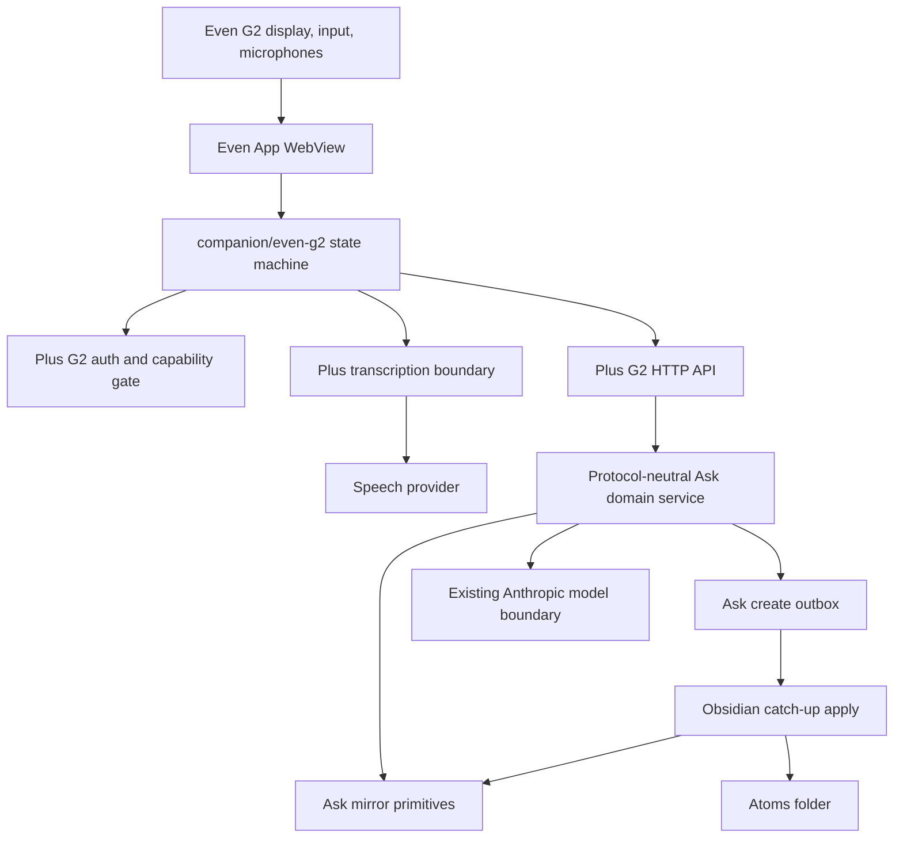
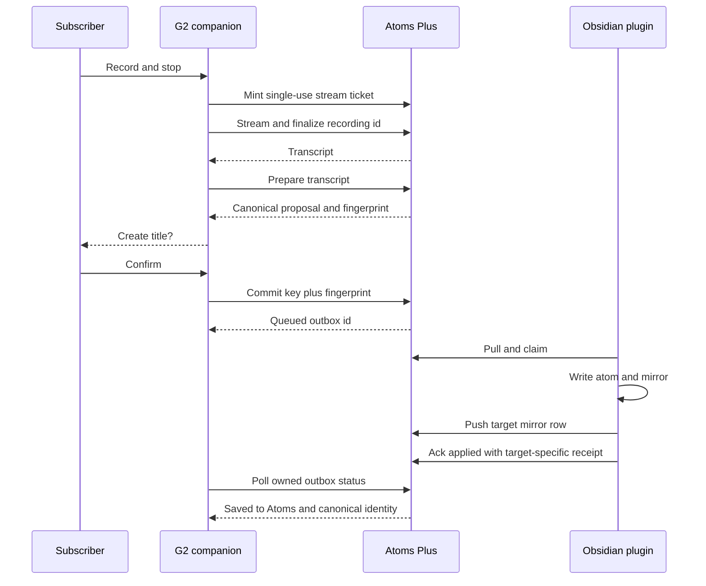
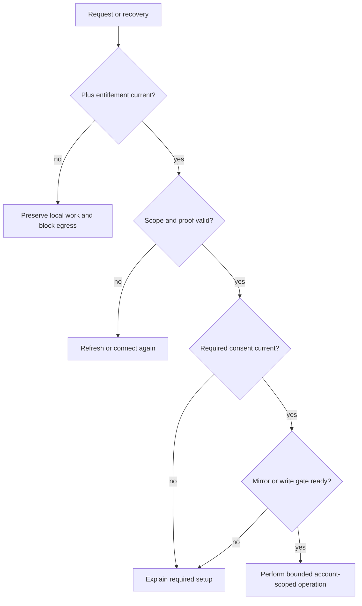

# Even G2 Atoms Companion - Plan

## Goal Capsule

- **Objective:** An Atoms Plus subscriber can create a real atom, ask a grounded question, and read recent atoms from Even Reality G2 glasses without weakening the vault's source-of-truth role.
- **Means:** Add a focused Even Hub companion, a scoped G2 service boundary, and Obsidian pairing controls that reuse the Ask mirror and outbox contracts (KTD2, KTD4, KTD8).
- **Authority:** Product requirements and session-settled decisions outrank implementation preferences. Current repo contracts outrank new abstractions where they satisfy the requirements.
- **Execution profile:** Deep, security-sensitive, cross-surface feature. Build test-first at protocol seams and use runtime spikes for undocumented WebView persistence.
- **Stop conditions:** Do not send real voice or vault content until the device-key and provider-retention gates pass. Do not claim public release before packaged Beta and physical G2 verification.
- **Tail owner:** The implementation run owns code review, automated QA, a private-test artifact, the pull request, and CI. A human with the G2 owns final hardware and public-submission gates.

---

## Product Contract

### Summary

Build an Even Hub app named **Atoms** with three root actions: **New atom**, **Ask atoms**, and **Recent atoms**. The companion uses Atoms Plus while Obsidian and the vault remain authoritative.

### Problem Frame

The G2 can capture speech and render compact text, but it cannot access the vault filesystem. The useful product is therefore a quiet capture and recall surface backed by the existing Plus mirror and outbox, not a second notes system or a local bridge that works only while Obsidian is reachable.

### Actors

- A1. The Atoms Plus subscriber wears the G2 and approves microphone, disclosure, pairing, and atom creation actions.
- A2. The Even Realities App hosts the companion WebView and relays G2 display, gesture, and microphone events.
- A3. Atoms Plus authenticates the device, transcribes audio, prepares atoms, answers grounded questions, and queues writes.
- A4. The Obsidian plugin applies queued writes, mirrors the result, and exposes pairing and revocation controls.
- A5. The configured speech and model providers process only the disclosed request data under the documented retention policy.

### Key Decisions

- **Require Atoms Plus for v1** (session-settled: user-approved — chosen over local-only vault access: Even Hub has no filesystem access and a local bridge would fail while Obsidian is closed). Governs R1, R8, R12.
- **Create a real atom from the glasses** (session-settled: user-directed — chosen over a raw capture inbox: creation is the primary promise). Governs R2, R3, R4, R5.
- **Confirm the canonical generated title before commit** (session-settled: user-approved — chosen over immediate writing: v1 has no undo and must not create on exit). Governs R3, R4.
- **Answer first from mirrored evidence and show sources** (session-settled: user-approved — chosen over search-only results: the small display should resolve a question without hiding evidence). Governs R9, R10.
- **Keep questions one-shot** (session-settled: user-approved — chosen over conversation history: v1 should not infer unstated context). Governs R9.
- **Keep provider secrets on Atoms Plus** (session-settled: user-approved — chosen over bundling provider credentials: packaged Even Hub apps are extractable clients). Governs R6, R14.
- **Gate public listing on physical G2 behavior** (session-settled: user-approved — chosen over simulator-only release: microphone, gesture, lock-screen, and flicker behavior require hardware). Governs R16.

### Requirements

**Access and trust**

- R1. Only a server-confirmed Atoms Plus subscriber with a live, scoped G2 grant can read, query, transcribe, prepare, or commit through the companion.
- R2. Pairing uses a short-lived single-use code created from a verified plugin session, and disconnect revokes only the selected G2 device family.
- R3. Microphone permission, versioned G2 disclosure, Ask mirror consent, and Ask write consent remain separate human-controlled gates.
- R4. A prepared atom can be committed only after the user confirms the exact canonical title shown for that preparation; commit must also present the matching internal proposal fingerprint.

**Create an atom**

- R5. **New atom** records deliberate G2 microphone input and preserves the final transcript byte-for-byte as the atom's captured record segment.
- R6. Atoms Plus may generate a declarative title, approved tags, and reason-bearing links, but it must not add claims to or rewrite the captured record.
- R7. A same-account retry with the same commit key and semantic payload returns the original outbox item, while a changed payload under that key fails with a conflict.
- R8. The companion shows **Queued** for accepted, pending, or claimed work and shows **Saved to Atoms** only after the plugin writes the vault file and confirms its mirror receipt. Queued work says it will finish when the paired vault next syncs; after 15 minutes it also shows **Still queued** with the accepted time, without implying loss or failure.

**Recall**

- R9. **Ask atoms** produces one short answer only from a bounded set of fetched authoritative mirror bodies and returns opaque source identifiers plus visible titles.
- R10. Weak, conflicting, stale, or incomplete evidence returns an honest fallback and closest matches instead of an unsupported answer.
- R11. **Recent atoms** lists at most 20 mirrored atoms by covered creation date and opens the selected verbatim body in readable pages without losing list position.

**Lifecycle, privacy, and release**

- R12. The companion persists monotonic recovery state for recording, transcription, preparation, commit, and delivery so an Android cold start cannot silently lose completed work.
- R13. Cancel, exit, permission loss, suspension, revocation, or teardown stops active capture and prevents stale asynchronous work from restoring credentials or sending content.
- R14. Audio, transcripts, questions, atom bodies, authorization material, and raw tokens never enter application logs; transient data follows explicit local, service, and provider retention limits.
- R15. Every G2 API response is account-scoped, exact-origin protected, rate-limited, and marked `Cache-Control: no-store`; the packaged app allows only required network and G2 microphone permissions.
- R16. Public Even Hub submission is blocked until simulator, local G2, private package, Beta lock-screen, and physical recovery checks pass.

### Key Flows

- F1. **Pair and disclose**
  - **Trigger:** A1 chooses **Connect G2** in Obsidian Settings.
  - **Steps:** A4 verifies Plus and mints a code, A1 redeems it in A2, and A3 binds a scoped device family. The companion then remains in **Setup required** until A1 accepts the G2 voice/model disclosure and the independent mirror/write consents are current.
  - **Outcome:** Pairing grants no content capability. The companion can request only the scopes that are both granted and currently allowed by account state.
  - **Covered by:** R1, R2, R3, R13.
- F2. **Record and prepare**
  - **Trigger:** A1 chooses **New atom**.
  - **Steps:** The companion checks gates, stages PCM locally, streams through A3 to A5, receives a final transcript, and prepares canonical metadata without writing.
  - **Outcome:** A recoverable proposal displays `Create “<title>”?` and contains an expiring fingerprint.
  - **Covered by:** R4, R5, R6, R12, R14.
- F3. **Commit and deliver**
  - **Trigger:** A1 confirms the proposal.
  - **Steps:** A3 enqueues one existing Ask `create` item, A4 applies it with G2 capture context, A4 mirrors the created atom, and A3 exposes the terminal receipt.
  - **Outcome:** The companion transitions from **Queued** to **Saved to Atoms** using the canonical atom identity, even when that transition spans sessions while the paired vault is closed.
  - **Covered by:** R4, R7, R8.
- F4. **Ask with evidence**
  - **Trigger:** A1 dictates one question.
  - **Steps:** A3 transcribes, retrieves, fetches bounded bodies, synthesizes from those bodies, validates cited source IDs, and returns an answer or fallback.
  - **Outcome:** A1 sees an answer with selectable sources or an honest closest-match state.
  - **Covered by:** R9, R10, R14.
- F5. **Read recent or source atom**
  - **Trigger:** A1 chooses **Recent atoms** or an answer source.
  - **Steps:** A3 fetches one account-owned mirror row and the companion paginates its verbatim body.
  - **Outcome:** Back returns to the previous selection and list position.
  - **Covered by:** R11.
- F6. **Recover or revoke**
  - **Trigger:** The WebView restarts, connectivity returns, entitlement changes, or A1 disconnects.
  - **Steps:** The companion rebuilds from durable IDs, rechecks every gate, resumes only foreground-safe work, and clears transient content on revocation.
  - **Outcome:** Work resumes monotonically or stops with a useful explanation; it never duplicates or leaks.
  - **Covered by:** R1, R12, R13, R14.

### Scope Boundaries

**In v1**

- Pairing, per-device revocation, G2 microphone capture, transcription, atom preparation and confirmation, Ask outbox delivery, grounded query, recent/body reads, local recovery, simulator automation, and private package production.
- Distinct G2 provenance and captured-at context while preserving current Ask-origin library compatibility.
- Stage the private build deliberately: capture, confirmation, and outbox delivery reach hardware and Beta validation first; grounded query and recent/body reads land against the same package before public submission.

**Deferred to Follow-Up Work**

- Public store submission after the human-owned Beta and physical G2 gate.
- A paid G2 usage meter. V1 treats G2 as a private-Beta Plus benefit with a visible fair-use envelope: recordings are capped at two minutes, 20 recording starts per account per day, and 30 preparation or query model calls per account per day. At the limit, the companion says **G2 limit reached for today** and preserves already staged work. These are Beta controls, not a permanent included allowance; cost evidence and packaging are decided before public listing.
- Rich metadata editing, pending-write cancellation, multi-turn queries, audio answers, continue/revise/delete, and public localization beyond the scoped English catalog.

**Outside this product's identity**

- Always-listening or background recording, general-purpose AI chat, hidden automatic commit, local LAN vault bridges, and claims based on outside model knowledge.

### Acceptance Examples

- AE1. **Covers F1 / R1-R3.** Given a verified Plus session and current consent, a single-use code connects one G2 device; replay, expiry, wrong account, or revoked family fails without revealing account state.
- AE2. **Covers F2 / R4-R6.** Given a completed recording, the prepared proposal preserves the captured record and shows the canonical final title before any outbox item exists.
- AE3. **Covers F3 / R7-R8.** Given two identical commits with one key, one outbox item and one vault file exist; the glasses report saved only after mirror confirmation.
- AE4. **Covers F3 / R4.** Leaving the confirmation screen creates nothing, and a changed or late-collision proposal requires a new confirmation.
- AE5. **Covers F4 / R9-R10.** A supported question returns a short answer whose claim citations resolve only to fetched bodies and whose titles open those bodies.
- AE6. **Covers F4 / R10.** A true statement absent from the mirror, conflicting atoms, prompt-injection text, or incomplete scope yields a fallback rather than model knowledge.
- AE7. **Covers F5 / R11.** Recent excludes hubs, reports incomplete creation coverage honestly, and restores the selected row after paginated reading.
- AE8. **Covers F6 / R12-R13.** A connection loss or WebView cold start preserves staged work, rechecks entitlement and consent, and resumes without duplicate egress or commit.
- AE9. **Covers F6 / R13-R14.** Revocation during a parked network call stops later egress and prevents stale credential or content restoration.
- AE10. **Covers R15-R16.** A packaged Beta build passes exact-origin preflight, manifest, root exit, lock-screen, idle, microphone, and physical recovery checks before public submission is possible.

Product Contract preservation: `docs/plans/2026-09-08-even-g2-atoms-design.md` is preserved in product meaning. Transcript equality is clarified to the captured record segment because existing atom rendering appends reason-bearing link prose.

---

## Planning Contract

### Key Technical Decisions

- KTD1. **Pin the current Even toolchain.** Use exact versions `@evenrealities/even_hub_sdk` `0.0.15`, `@evenrealities/evenhub-cli` `0.1.14`, and `@evenrealities/evenhub-simulator` `0.9.5`. Pack with the SDK version so the artifact records the Even App `2.2.10` floor.
- KTD2. **Add a separate RFC 9449 sender-constrained G2 grant family.** The existing `sess_` family has broad plugin authority and `mcp_` is a connector bearer family. G2 needs per-device revocation and restricted content scopes. Store hashed `g2a_` access and rotating `g2r_` refresh lineage in each backend. Validate an allowlisted asymmetric algorithm, `typ`, public JWK thumbprint, method, canonical configured target URI, bounded issue time, unique proof ID, access-token hash, and server nonce. Bind refresh lineage and WebSocket-ticket minting to the same non-extractable P-256 key. Client access tokens remain memory-only; an encrypted IndexedDB credential record stores the refresh token under a credential-specific non-extractable key and binds it to account and device-family IDs. Tokens never enter bridge storage. Refuse pairing without durable key support instead of falling back to a long-lived bearer token.
- KTD3. **Keep capability gates independent, live, and monotonic.** Microphone permission is device-local. G2 disclosure, scopes, and entitlement are server-authoritative. Ask mirror and write consent remain plugin-owned but synchronize against a server revision. Withdrawal wins across concurrent devices; a stale client cannot restore a grant, and regrant requires a fresh user gesture against the current revision. Pairing grants none of them. One centralized gate rechecks the relevant state immediately before each provider send, content response, outbox enqueue, and vault write, and advancing a grant to withdrawn aborts provider work under the old authorization generation.
- KTD4. **Extract a protocol-neutral Ask domain service behind MCP and G2 adapters.** The shared service owns search floors, expansion and coverage, authoritative fetch, freshness, revision shaping, atom-only recent listing, enqueue validation, and receipts. MCP and G2 modules own only authentication, rate limits, and response presentation. This preserves Ask semantics without routing G2 through MCP.
- KTD5. **Bind confirmation and idempotency to one canonical proposal.** Preparation returns an expiring ID and semantic fingerprint. Commit stores account, key, fingerprint, and original receipt. Same-key/different-fingerprint requests conflict.
- KTD6. **Carry an exact G2 record contract through the existing create kind.** Preserve `generated-by: ask-mcp` for current library compatibility. Add immutable final-transcript UTF-8 bytes and hash, `origin: g2`, captured timestamp with offset, and an explicit false loop-inference policy. Those fields survive validation, encryption, enqueue, pull, apply, render, mirror, and receipt. The speech provider's final event is the canonicalization boundary; no later trim or newline normalization may alter the captured segment.
- KTD7. **Use a server-side speech-provider adapter with leased sessions.** The first adapter targets OpenAI speech transcription through server-held credentials. A recording ID owns one upstream lease and durable terminal result so reconnects attach instead of duplicating provider egress. Each provider lease owns an abort controller and authorization generation; revocation aborts the request, and late callbacks cannot publish unless generation and lease owner still match. An authenticated HTTPS call mints a very short-lived single-use WebSocket ticket bound to account, device key, exact Origin, recording ID, purpose, and limits. The first application frame consumes it before any audio is accepted. Ambiguous upstream completion waits for status or asks for manual retry.
- KTD8. **Reuse the full Ask retrieval contract with snapshot-bound evidence.** Retrieval preserves scope, freshness, confidence, revision, and creation coverage. Each synthesis source is bound to opaque ID plus content hash and split into server-generated stable chunks. The existing Anthropic service boundary performs answer synthesis with bounded bodies. Each answer claim returns chunk IDs and exact evidence text; the server resolves an unambiguous match to derived byte ranges against that exact snapshot. Unknown, changed, ambiguous, or unsupported evidence fails to closest matches.
- KTD9. **Model the companion as a pure state machine around one account-bound recovery journal.** Glasses rendering, gesture normalization, storage, network, clock, and audio are adapters. Content-bearing IndexedDB records are authoritative, bind immutable account and device-family IDs, and carry monotonic revision plus `recording_id → transcription_id → preparation_id → commit_key → outbox_id`. Bridge storage holds only a non-sensitive wake-up pointer. Recovery reconciles disagreement from durable server IDs, never advances from display copy, and purges rather than migrates content whose binding differs from the live grant.
- KTD10. **Stage audio in IndexedDB and checkpoint metadata in bridge storage.** A packaged hardware spike must prove durable Blob and non-extractable CryptoKey persistence. Failure blocks private content testing and triggers a design review.
- KTD11. **Protect G2 at a dedicated WebView boundary.** G2 response, preflight, and upgrade helpers validate the configured packaged-app Origin before auth or content handling, derive proof targets from `PUBLIC_BASE_URL`, return the exact Origin plus `Vary: Origin`, and set `Cache-Control: no-store` on success and error. They use no third-party scripts and enforce strict CSP, bounded bodies, and metadata-only observability without changing existing Ask wildcard behavior.
- KTD12. **Do not add a billing meter in v1.** Live Plus entitlement and Postgres-backed per-account attempt, cost, and concurrency leases authorize use; the in-process IP limiter remains traffic damping only. Record transcription duration, preparation count, query count, latency, and error rates without content so a later meter decision has evidence.

### Capability and lifecycle matrix

| Operation or event | Authoritative gate | Required outcome |
|---|---|---|
| Pair or refresh | Plus entitlement, scope request, device proof | Grant only the requested allowed scopes; rotate or revoke the family atomically |
| Start microphone | OS permission plus accepted G2 disclosure | No capture or local audio before both gates pass |
| Transcribe or prepare | Live server G2 disclosure, entitlement, scope | Recheck before each provider-bound batch and abort upstream on withdrawal |
| Query, recent, or fetch | Live Plus entitlement, server grant, and current mirror consent | Recheck before model egress and before returning any content |
| Commit | Live Plus entitlement, grant, disclosure, write consent, proposal fingerprint | Enqueue once; no changed proposal under an old confirmation |
| Plugin apply | Current local write consent immediately before vault mutation | Reject rather than write after withdrawal; device disconnect alone does not cancel a confirmed item |
| Account deletion | Account authority | Atomically purge G2 families, recovery rows, budgets, and unapplied G2 outbox work |
| Device disconnect | Device authority | Revoke future device requests; keep already confirmed outbox work and minimal account-owned receipts |

**Endpoint authorization matrix**

| Route class | Accepted authority | Origin policy |
|---|---|---|
| Mint code, list devices, revoke device, synchronize consent | Verified `sess_` plugin session only | Existing Obsidian-compatible session policy |
| Redeem code | Unused code plus initial DPoP public key proof | Exact packaged-app Origin |
| Refresh device family | Current `g2r_` member plus matching DPoP proof | Exact packaged-app Origin |
| Transcribe, prepare, commit, status, query, recent, fetch | Current `g2a_` member, matching DPoP proof, and route scope | Exact packaged-app Origin |

Every wrong credential family fails before account existence, entitlement, or content state is disclosed.

### High-Level Technical Design





```mermaid
stateDiagram-v2
  [*] --> Unpaired
  Unpaired --> Paired: redeem code
  Paired --> SetupRequired: missing disclosure or consent
  SetupRequired --> Ready: all gates current
  Ready --> SetupRequired: consent or entitlement changes
  Ready --> Recording: New atom
  Recording --> Staged: stop or connection loss
  Staged --> Transcribing: foreground and gates live
  Transcribing --> Prepared: final transcript and metadata
  Prepared --> Ready: cancel or discard
  Prepared --> Queued: confirm and commit
  Queued --> Saved: applied plus mirror receipt
  Recording --> SetupRequired: permission loss or revocation
  Transcribing --> Staged: retryable failure or background
  Ready --> Revoked: disconnect or account event
  Staged --> Revoked: disconnect or account event
  Prepared --> Revoked: disconnect or account event
  Queued --> Revoked: device access ends; server receipt remains account-owned
```



### Output Structure

```text
companion/even-g2/
├── app.json
├── package.json
├── src/
│   ├── app/
│   ├── audio/
│   ├── auth/
│   ├── storage/
│   └── ui/
└── test/
plus-service/src/g2/
├── auth.mjs
├── http.mjs
├── preparation.mjs
├── query.mjs
└── transcription.mjs
plus-service/test/
├── http-g2-auth.test.mjs
├── g2-creation.test.mjs
├── g2-query.test.mjs
└── store-g2.test.mjs
```

### Assumptions

- OpenAI is the candidate first speech provider because it supports server-side transcription and does not train on API inputs by default. U1 must pin and prove the exact endpoint/model, PCM compatibility, interim/final behavior, cancellation, timeout, duration, disconnect, and retention contract before U2 begins. If streaming cannot reattach safely, the recorded fallback is completed-audio batch transcription under the same recording lease.
- A non-extractable WebCrypto key can persist in the packaged WebView's IndexedDB. The client includes a capability probe and fails closed if the hardware spike disproves this.
- Existing Ask `applied` acknowledgment remains ordered after vault write and mirror receipt. U5 extends that acknowledgment with a target-specific immutable receipt and keeps `test/catchUp.test.ts` as the regression owner.
- V1 Plus access is entitlement-based and rate-limited without consuming the filing meter. This is an operational assumption, not a permanent pricing decision.
- Disconnect revokes future G2 access but does not cancel already confirmed outbox work. The settings surface shows pending count before revocation.

### Sequencing

1. Prove package floors, device-key persistence, and audio recovery capability before building credential or content flows.
2. Land server stores and auth before content routes.
3. Land plugin pairing, consent, and write context before enabling G2 commit.
4. Land transcription and creation before recall so the companion state machine has one complete vertical slice.
5. Add query and recent reads, then automate simulator and package gates.

### System-Wide Impact

- **Privacy:** Voice, questions, and mirror bodies cross a new provider boundary. Disclosure versioning, retention, and no-content logs become release gates.
- **Identity:** G2 joins `sess_` and `mcp_` as a separate credential family without changing their scope or revocation behavior.
- **Vault semantics:** G2 uses the existing Ask outbox write path but adds capture provenance, capture time, and an explicit loop-inference policy.
- **Operations:** The Plus service gains WebSocket upgrades, provider configuration, schema migrations, cost telemetry, and exact-origin policy.
- **CI:** The new companion is not covered by root TypeScript or Vitest configuration and needs an isolated install/build/test/package job.

**Sensitive data inventory**

| Artifact | Storage and protection | Bound and purge trigger |
|---|---|---|
| Local PCM and uncommitted proposal | Account/device-bound IndexedDB under a non-extractable AEAD key | Reserve capacity for one active plus one completed two-minute recording (7.68 MB raw PCM plus bounded metadata); purge after 24 hours or on discard, successful handoff, disclosure withdrawal, revocation, or account change |
| Device tokens and tickets | Tokens hashed server-side; refresh bearer sender-constrained; tickets single-use | Access minutes, refresh idle/max lifetime, ticket seconds; purge on family or account revocation |
| Service transcription/preparation rows | AES-GCM with versioned service keys and account ID, artifact type, and row ID as associated data; plaintext fallback is forbidden in production | Purge after 24 hours; crash sweeper; purge on terminal handoff, revocation, or account deletion |
| Query input, fetched bodies, and answer | Request memory only | Purge at request completion or abort |
| Applied receipt | Minimal canonical identity and hashes; no body | Retain seven days, longer than client retry TTL, then sweep |

### Risks and Dependencies

- Even Hub is pre-1.0 and current documentation can lag npm packages. Exact pins and packed-manifest assertions limit drift.
- IndexedDB Blob and CryptoKey persistence are undocumented by Even. U1 fails closed and the packaged hardware gate blocks real content if either probe fails.
- Gesture routing differs between current docs and reported simulator/hardware behavior. U1 normalizes all reported envelopes and U7 requires physical selection tests.
- Browser WebSockets cannot set an Authorization header. KTD7 prevents durable credentials in URLs and U4 caps pre-auth bytes at zero.
- Model output can cite irrelevant evidence. KTD8 binds claims to verified snapshot spans and U6 includes legitimate-ID/irrelevant-span attacks.
- Pairing guesses and paid workloads cross processes. KTD12 uses shared leases while proxy-aware IP limits remain secondary damping.
- Schema and socket rollback can strand state. U8 deploys additive schema with G2 disabled, validates sweepers, enables provider/origin gates, and drains tickets before rollback.
- Public release depends on the user's G2, Even developer account, provider credentials, and Beta portal. U8 records those external tail gates without claiming completion.

---

## Implementation Units

### U1. Scaffold and prove the Even runtime boundary

- **Goal:** Create the isolated companion package and executable capability probes for toolchain floors, event routing, durable audio, and non-extractable keys.
- **Requirements:** R12, R13, R15, R16; KTD1, KTD9, KTD10.
- **Dependencies:** None.
- **Files:** `companion/even-g2/package.json`, `companion/even-g2/package-lock.json`, `companion/even-g2/app.json`, `companion/even-g2/index.html`, `companion/even-g2/tsconfig.json`, `companion/even-g2/vite.config.ts`, `companion/even-g2/src/main.ts`, `companion/even-g2/src/platform/even.ts`, `companion/even-g2/src/storage/capabilities.ts`, `companion/even-g2/test/capabilities.test.ts`, `companion/even-g2/test/provider-capability.test.ts`, `.gitignore`.
- **Approach:** Exact-pin KTD1. Keep the package framework-light. Add a minimal capability-probe entrypoint that U7 later extends into the product controller. Normalize text, list, and system gesture envelopes at one adapter. Incrementally encrypt, persist, cold-reload, decrypt, hash-check, and purge a maximum two-minute Blob while one completed recording already exists; reserve capacity before microphone start and fail closed near quota. Use synthetic audio to prove the exact OpenAI endpoint/model, PCM, interim/final, abort, timeout, disconnect, and retention behavior or record the completed-audio batch fallback before authorization work begins.
- **Execution note:** Start with pure probe tests, then verify install, build, package, and packed manifest before adding product state.
- **Patterns to follow:** `companion/release/package.json`, `companion/android/` package isolation, official Even ASR template, and current CLI packaging rules.
- **Test scenarios:**
  - A supported WebView persists and reloads one maximum-bound encrypted Blob and one non-extractable key while reporting no secret material.
  - Near-quota capacity refusal, storage eviction, decrypt/hash mismatch, and purge remain fail-closed before microphone start.
  - The exact speech endpoint/model accepts 16 kHz signed 16-bit little-endian mono, and its finalization, abort, timeout, duration, and disconnect behavior match the selected streaming or batch fallback.
  - Missing IndexedDB or key persistence returns a blocked capability state with no bearer fallback.
  - Text, list, and system click envelopes normalize to one action while unknown events are ignored.
  - The manifest contains only exact Atoms Plus origins, `network`, and `g2-microphone`.
  - The packaged artifact records SDK `0.0.15` and Even App `2.2.10` floors.
- **Verification:** The companion installs reproducibly, builds, packages, and exposes a hardware-readable capability report with no product data.

### U2. Add G2 device identity and authorization

- **Goal:** Add single-use pairing, sender-constrained rotating grants, device listing, and revocation across memory, SQLite, and Postgres.
- **Requirements:** R1, R2, R3, R13-R15; KTD2-KTD4, KTD11.
- **Dependencies:** U1.
- **Files:** `plus-service/src/store/shared.mjs`, `plus-service/src/store/memory.mjs`, `plus-service/src/store/askSqliteMethods.mjs`, `plus-service/src/store/askPostgresMethods.mjs`, `plus-service/src/g2/auth.mjs`, `plus-service/src/g2/http.mjs`, `plus-service/src/server.mjs`, `plus-service/test/store-g2.test.mjs`, `plus-service/test/http-g2-auth.test.mjs`, `plus-service/test/helpers/askStore.mjs`.
- **Approach:** Reuse code normalization and token hashing. Use separate G2 tables so MCP codes cannot clobber G2 codes. Implement KTD2 proof validation, a replay cache, shared pairing-attempt budget, and atomic refresh families. Enforce the endpoint authorization matrix before account lookup. Trust forwarded IP only through the configured proxy chain.
- **Execution note:** Implement the shared contract against memory first, then require identical SQLite and Postgres behavior before HTTP wiring.
- **Patterns to follow:** MCP pairing helpers in `plus-service/src/store/askHelpers.mjs`, multi-backend Ask store tests, and `subscriptionLive` in `plus-service/src/store/shared.mjs`.
- **Test scenarios:**
  - Covers AE1. A current code redeems once for the same Plus account and requested scopes.
  - Expired, replayed, guessed, wrong-proof, wrong-audience, or over-scoped requests fail generically.
  - Concurrent refresh rotates once; replay of the old member revokes the active family.
  - Proof replay, stale or future issue time, wrong method or canonical URI, wrong token hash, wrong key, private JWK, and unsupported algorithm fail.
  - Distributed guesses, process restart, spoofed forwarding headers, concurrent redemption, and multi-instance limits preserve one atomic attempt budget.
  - Revoking one device leaves other G2, MCP, and plugin sessions unchanged.
  - Sign-out-all, account deletion, and entitlement lapse stop subsequent G2 requests in every backend.
  - Account A cannot list, revoke, refresh, or inspect account B's device.
  - Every session, code, refresh, and access credential family fails against every route class it does not own.
- **Verification:** All store implementations satisfy one contract and negative HTTP tests prove tenant, scope, proof, expiry, and revocation boundaries.

### U3. Add plugin pairing controls and consent coverage

- **Goal:** Let a verified Plus user connect, inspect, and disconnect G2 while keeping every content gate explicit.
- **Requirements:** R1-R3, R13; KTD3, KTD4.
- **Dependencies:** U2.
- **Files:** `src/platform/plusClient.ts`, `src/settings/settings.ts`, `src/settings/consent.ts`, `src/shared/askAck.ts`, `src/i18n/g2.ts`, `test/plusClient.test.ts`, `test/settings.test.ts`, `test/settingsRows.test.ts`, `test/askConsentVersion.test.ts`, `test/plusSenderInventory.test.ts`, `docs/localization.md`.
- **Approach:** Add session-authenticated pair/list/revoke and consent-synchronization methods. Plus alone enables Connect and code redemption; a paired device remains in **Setup required** until disclosure, mirror consent, and write consent are current. Widen and version Ask write consent from named chat clients to connected apps including G2. Synchronize monotonic server consent revisions with withdrawal-wins conflict handling. Render G2 as settings rows with one pending-count warning and a destructive disconnect confirmation.
- **Patterns to follow:** Ask pairing settings, row grammar in `CONCEPTS.md`, existing consent sheets, and Plus sender inventory enforcement.
- **Test scenarios:**
  - Connect is unavailable without server-confirmed Plus; a paired device remains **Setup required** until disclosure, Ask mirror consent, and current write consent are all current.
  - A stale device cannot overwrite a newer withdrawal; concurrent withdrawal/regrant, offline replay, and process restart preserve the server revision and require a fresh regrant gesture.
  - Updating the write disclosure retires the older acknowledgment and prompts once before new writes.
  - A created code is shown without logging and replacement invalidates the prior active G2 code only.
  - Disconnect confirms the selected device, reports pending writes, and does not wipe the mirror or other clients.
  - Every new user-facing plugin string resolves through the scoped English catalog.
- **Verification:** Settings exposes the full device lifecycle and existing Ask consent, pairing, and sender-inventory suites remain green.

### U4. Add bounded transcription and recovery transport

- **Goal:** Stream deliberate PCM through a server-held provider credential and recover safely after interruption.
- **Requirements:** R3, R5, R12-R15; KTD7, KTD9-KTD11.
- **Dependencies:** U1-U3.
- **Files:** `plus-service/src/g2/transcription.mjs`, `plus-service/src/g2/http.mjs`, `plus-service/src/config.mjs`, `plus-service/src/prodGate.mjs`, `plus-service/src/server.mjs`, `plus-service/test/g2-transcription.test.mjs`, `companion/even-g2/src/audio/recorder.ts`, `companion/even-g2/src/audio/transport.ts`, `companion/even-g2/src/storage/recovery.ts`, `companion/even-g2/test/audio-recovery.test.ts`.
- **Approach:** Issue and consume the KTD7 ticket before audio. Accept arbitrary even-byte PCM chunks with sequence numbers and backpressure. Stage encrypted, account/device-bound capture locally from recording start. Reconnect by recording ID to the existing lease or result; ambiguous provider completion waits for status or an explicit manual retry. Every provider lease owns an abort controller and authorization generation, and late results under a revoked generation are discarded.
- **Execution note:** Use a fake provider and fault-injected transport first. A live provider smoke test is a separate private-data gate.
- **Patterns to follow:** Official Even ASR event flow, content-bearing egress gates, and teardown race learnings in `docs/solutions/security/consent-gate-must-be-checked-at-egress-not-at-entry.md`.
- **Test scenarios:**
  - Covers AE8. Arbitrary even-byte chunks survive a socket loss and cold restart without duplication.
  - Odd bytes, sequence gaps, duration/byte/concurrency overflow, stale tickets, and wrong Origin fail before provider forwarding.
  - Pre-auth audio, concurrent ticket consumption, ticket replay, wrong proof binding, and revocation after upgrade produce no provider-bound bytes.
  - Worker crash, lease takeover, late provider completion, and duplicate finalization produce at most one upstream owner and one terminal transcript.
  - Account switching, offline sign-out, re-pairing to another account, and stale asynchronous completion cannot reveal or send an earlier account's journal.
  - Cancel, permission loss, background, revocation, and disclosure withdrawal stop the mic and future chunks.
  - Backpressure pauses or stages input before browser buffering exceeds the bound.
  - A successful final transcript deletes raw local audio and leaves only the next recovery identifiers.
  - Logs and errors contain correlation metadata but no PCM, transcript, token, or authorization header.
- **Verification:** Deterministic fake-provider tests cover normal, retry, teardown, and limit behavior; the live provider remains disabled until configured disclosure and retention checks pass.

### U5. Prepare, confirm, and deliver one real atom

- **Goal:** Turn a sacred transcript into one human-confirmed Ask outbox item and a truthful terminal receipt.
- **Requirements:** R4-R8, R12-R14; KTD4-KTD6, KTD9.
- **Dependencies:** U2, U3, U4.
- **Files:** `plus-service/src/g2/preparation.mjs`, `plus-service/src/g2/http.mjs`, `plus-service/src/store/askHelpers.mjs`, `plus-service/src/store/memory.mjs`, `plus-service/src/store/askSqliteMethods.mjs`, `plus-service/src/store/askPostgresMethods.mjs`, `plus-service/test/g2-creation.test.mjs`, `plus-service/test/store-ask-outbox.test.mjs`, `src/platform/askOutbox.ts`, `src/platform/plusClient.ts`, `src/plugin/catchUp.ts`, `test/askOutbox.test.ts`, `test/catchUp.test.ts`, `test/atomsHomeData.test.ts`, `companion/even-g2/src/app/createFlow.ts`, `companion/even-g2/test/create-flow.test.ts`.
- **Approach:** Prepare only canonical title, allowed tags, and links to known mirror rows. Persist the fingerprint before confirmation. Extend the existing create payload with G2 origin, captured-at offset, and explicit no-loop-inference context while keeping current Library compatibility.
- **Execution note:** Start with a failing store-to-plugin integration test that observes the full payload and post-mirror acknowledgment.
- **Patterns to follow:** `validateOutboxPayload`, Ask create rendering, `client_request_id`, and `docs/solutions/logic-errors/outbox-apply-must-forward-full-payload-and-kind.md`.
- **Test scenarios:**
  - Covers AE2. The captured record segment matches the final transcript exactly while title, tags, and reason-bearing links validate separately.
  - Covers AE3. Same key and fingerprint returns one receipt across memory, SQLite, and Postgres; changed payload conflicts.
  - Covers AE4. Cancel, cold-start confirmation restore, expired preparation, and title collision never create without a current confirmation.
  - G2 origin and capture time survive enqueue, pull, render, write, mirror, and status without implicit open-loop state.
  - Trailing spaces, terminal newlines, CRLF, emoji, explicit false, and unknown optional fields preserve the exact captured bytes or reject before commit.
  - Pending and claimed map to **Queued**; only post-mirror applied maps to **Saved to Atoms** with the canonical atom identity.
  - An unrelated mirror success, ack replay, or mismatched record hash cannot mint a saved receipt.
  - Tenant-scoped status hides unknown and foreign outbox IDs identically.
- **Verification:** One end-to-end throwaway-vault test proves proposal, confirmation, one file, verbatim record, mirror receipt, and truthful status.

### U6. Add grounded query, recent, and body reads

- **Goal:** Provide answer-first recall and honest recent/body browsing through shared mirror semantics.
- **Requirements:** R9-R11, R14-R15; KTD4, KTD8.
- **Dependencies:** U2, U3, U4.
- **Files:** `plus-service/src/ask/domain.mjs`, `plus-service/src/mcp/tools.mjs`, `plus-service/src/g2/query.mjs`, `plus-service/src/g2/http.mjs`, `plus-service/src/store/askHelpers.mjs`, `plus-service/test/ask-domain-parity.test.mjs`, `plus-service/test/g2-query.test.mjs`, `plus-service/test/store-ask-outbox.test.mjs`, `companion/even-g2/src/app/queryFlow.ts`, `companion/even-g2/src/app/readFlow.ts`, `companion/even-g2/test/query-read-flow.test.ts`.
- **Approach:** Search with existing relevance and expansion signals, filter recent to atoms before pagination, fetch bounded bodies by opaque ID, and require structured citations that name server-generated chunk IDs plus exact evidence text. Resolve each unambiguous quote to derived UTF-8 byte ranges against the content-hash-bound snapshot. Carry scope, freshness, revision, and creation coverage to client states.
- **Execution note:** Build a small fixed evaluation corpus before enabling synthesis.
- **Patterns to follow:** MCP `search_atoms`, `fetch_atom`, `list_atoms`, `docs/solutions/features/ask-search-silent-empty-and-index-expand.md`, and Ask mirror parity.
- **Test scenarios:**
  - Covers AE5. Supported claims cite exact spans from fetched source IDs and titles open the same rows.
  - Covers AE6. Absent, weak, conflicting, stale, incomplete, and prompt-injected evidence returns the correct fallback.
  - Unknown citation IDs, oversized bodies, foreign rows, and deleted rows fail closed without content leakage.
  - Valid source IDs with irrelevant or altered quotes, ambiguous repeated text, multibyte/normalization variants, mutation during synthesis, rename, deletion, and same-title rows fail or retry from one new snapshot.
  - MCP and G2 adapters return the same scope, freshness, revision, search, fetch, and creation-coverage semantics for one fixture.
  - Covers AE7. Recent filters hubs before pagination, orders covered dates descending, handles null dates deterministically, and exposes incomplete coverage.
  - Body pagination preserves text and returns to the same source or recent-list position.
- **Verification:** Retrieval and synthesis evaluations pass independently, and tenant isolation is proven at store and HTTP layers.

### U7. Build the glasses state machine and display

- **Goal:** Connect pairing, create, query, recent, recovery, and error states to a legible G2 experience.
- **Requirements:** R1-R16; KTD1, KTD3, KTD9-KTD11.
- **Dependencies:** U3-U6.
- **Files:** `companion/even-g2/src/app/state.ts`, `companion/even-g2/src/app/controller.ts`, `companion/even-g2/src/ui/phone.ts`, `companion/even-g2/src/ui/render.ts`, `companion/even-g2/src/ui/paginate.ts`, `companion/even-g2/src/main.ts`, `companion/even-g2/test/pairing-ui.test.ts`, `companion/even-g2/test/state.test.ts`, `companion/even-g2/test/render.test.ts`, `companion/even-g2/test/lifecycle.test.ts`.
- **Approach:** Use one controller for phone and glasses state. The phone WebView owns code entry, disclosure review, invalid/expired/replayed-code feedback, loading, successful pairing, **Setup required**, and reconnect. Use native glasses lists only for stable choices and flicker-free text upgrades for transcript and status. Truncate list labels at Unicode-safe 63-byte boundaries. Paginate bodies for the readable 400–500 character budget. Root double-tap always invokes the system exit confirmation.
- **Patterns to follow:** Even page lifecycle, display, submission guidance, and Atoms user-facing voice.
- **Test scenarios:**
  - Root actions appear in the approved order and every gesture produces visible feedback.
  - Phone pairing covers code entry, disclosure acceptance, loading, invalid/expired/replayed codes, successful pairing, **Setup required**, and reconnect against the shared controller.
  - Recording indicator, transcript, confirmation, queued, still-queued, saved, weak-evidence, revoked, offline, empty, stale, microphone-denied, transcription-failed, preparation-failed, proposal-expired, title-collision, commit-unknown, recovery-full, recovered-awaiting-retry, and discard-confirmation states render without a blank page.
  - ASCII, CJK, and emoji labels truncate safely within 63 bytes.
  - Cold launch resumes staged audio or exact proposal confirmation without auto-commit.
  - Context-menu foreground-exit events do not tear down active state as if the app exited.
  - Root double-tap uses system confirmation; confirmed exit stops audio, sockets, and subscriptions.
- **Verification:** Pure state tests cover every transition and simulator automation captures 576 by 288 evidence for each stable state without console errors.

**G2 interaction map**

| State | Tap or list select | Forward swipe | Back swipe | Double tap |
|---|---|---|---|---|
| Root | Open selected action | Move selection | No-op | System exit confirmation |
| Recording | Stop and stage | No-op | Cancel, then discard confirmation | Stop and stage |
| Confirmation | Create selected proposal | Select Create or Try again | Return without creating | No-op |
| Answer or Sources | Open selected source | Next page or selection | Restore prior selection and page | No-op |
| Recent or Body | Open row | Next page or selection | Restore prior list position | No-op |
| Queued, recovery, or error | Run the visible retry/reconnect/discard action | Move action selection | Return when safe | No-op |

Every error state exposes exactly one safe primary action: retry after gates are rechecked, reconnect, discard with confirmation, return, or wait. No gesture commits from outside Confirmation.

### U8. Add CI, operations, privacy, and private-release gates

- **Goal:** Make the new surface reproducible, deployable, observable, and reviewable, with a runbook and release process that withhold public submission until human-owned Beta and physical G2 evidence is recorded.
- **Requirements:** R14-R16; KTD1, KTD7, KTD11, KTD12.
- **Dependencies:** U1-U7.
- **Files:** `.github/workflows/even-g2-tests.yml`, `plus-service/.env.example`, `plus-service/fly.toml`, `plus-service/Dockerfile`, `docs/runbooks/atoms-plus-prod.md`, `docs/architecture.md`, `docs/privacy.md`, `docs/g2-private-test.md`, `docs/plans/2026-09-08-even-g2-atoms-design.md`.
- **Approach:** Add isolated companion install/test/build/package CI, additive store migrations, mixed-version rollback checks, crash sweepers, content-free cost telemetry, and a private-test runbook. Deploy with G2 disabled, validate schema/provider/origin gates, then enable private use. Inject separate development, private, and production OpenAI/Anthropic/encryption keys through Fly secrets with least provider permissions and spend caps; document dual-key rotation and emergency revocation, and forbid keys in config, images, logs, crash reports, environment dumps, and packages. Update the design pins to current facts. Keep public submission as an unchecked human gate with required Beta and G2 evidence.
- **Patterns to follow:** Existing Plus production gate, release workflow, throwaway-vault policy, and Even submission checklist.
- **Test scenarios:**
  - Covers AE10. CI rejects stale SDK floors, unexpected origins, extra permissions, missing CSP, secrets in the package, and package failure.
  - Production gate requires provider, origin, retention-disclosure, and G2 feature configuration only when G2 is enabled.
  - Clean and upgraded databases, interrupted migration, two service versions, rollback with G2 rows, sweeper failure, and feature-off behavior preserve current Ask service.
  - Metrics record durations, counts, status classes, and latency without content or identifiers that expose note data.
  - Simulator automation drives root, create, query, sources, recent, pagination, setup, revoked, offline, and exit states.
  - The private checklist records local G2, packaged Private, Beta lock-screen, idle, interruption, and throwaway-vault evidence separately.
- **Verification:** Root, Plus, companion, package, secret-scan, and simulator gates pass; the runbook names every remaining human-owned hardware and portal action.

---

## Verification Contract

| Gate | Command or evidence | Covers |
|---|---|---|
| Root static checks | `npm run lint`, `npm run typecheck`, `npm run typecheck:test` | U3, U5 |
| Root behavior | `npm test`, `npm run build` | U3, U5, Ask regressions |
| Plus service | `cd plus-service && npm ci && npm test` | U2, U4-U6, U8 |
| G2 companion | `cd companion/even-g2 && npm ci && npm test && npm run build && npm run package` | U1, U4-U8 |
| Security | Token replay, tenant isolation, egress teardown races, exact CORS/Origin, CSP, no-store, log and package secret scans | U2-U8 |
| Simulator | Automation-driven gestures, screenshots, console inspection, and stable-state coverage at 576 by 288 | U7, U8 |
| Throwaway vault | Confirm one queued request becomes one file and one mirror-confirmed receipt with a verbatim captured record | U5 |
| Physical G2 | Temple and R1 gestures, microphone quality, connection loss, phone lock, five-minute resume, two-minute idle, exit cleanup | U1, U4, U7, U8 |
| Release | Private `.ehpk`, then Beta reviewer-parity evidence; public submission remains blocked until both pass | U8 |

`world-class-qa` followed by `adversarial-qa` is required before merge per repository policy. Browser/simulator QA supplements those gates and does not replace physical G2 verification.

---

## Definition of Done

- Every R-ID is implemented or remains behind its named human hardware/public-release gate.
- U1-U8 satisfy their verification outcomes and all automated gates pass without weakened assertions.
- Pairing, refresh, revocation, idempotency, CORS, retention, and tenant boundaries pass negative tests across supported stores.
- The atom capture segment is verbatim, one confirmation produces one vault file, and **Saved to Atoms** comes only from a mirror-confirmed receipt.
- Query answers cite only fetched mirror bodies and weak evidence never becomes an answer.
- The companion produces a private `.ehpk` with no secret, exact origins, minimal permissions, correct version floors, and stable simulator screenshots.
- Provider configuration and disclosure are verified before real voice or vault content leaves a private build.
- The PR records any uncompleted Beta or physical G2 checks as explicit human-owned follow-up gates and does not claim public availability.
- Documentation, runbooks, privacy copy, localization, schema migration, and production feature gates match the shipped behavior.
- Dead-end experiments, unused scopes, stale package output, and abandoned fallback code are removed from the diff.

---

## Appendix

### Sources and Research

- `docs/plans/2026-09-08-even-g2-atoms-design.md`
- `CONCEPTS.md`
- `docs/architecture.md`
- `docs/solutions/architecture-patterns/ask-mirror-parity.md`
- `docs/solutions/logic-errors/outbox-apply-must-forward-full-payload-and-kind.md`
- `docs/solutions/logic-errors/title-collision-cannot-see-the-same-capture.md`
- `docs/solutions/security/consent-gate-must-be-checked-at-egress-not-at-entry.md`
- `docs/solutions/features/ask-search-silent-empty-and-index-expand.md`
- [Even Hub architecture](https://hub.evenrealities.com/docs/get-started/architecture)
- [Even Hub device APIs](https://hub.evenrealities.com/docs/build/device-apis)
- [Even Hub lifecycle](https://hub.evenrealities.com/docs/build/background-lifecycle)
- [Even Hub networking](https://hub.evenrealities.com/docs/build/networking)
- [Even Hub submission QA](https://hub.evenrealities.com/docs/ship/app-submission)
- [Even Hub SDK package](https://www.npmjs.com/package/@evenrealities/even_hub_sdk)
- [OAuth device flow, RFC 8628](https://datatracker.ietf.org/doc/html/rfc8628)
- [OAuth security BCP, RFC 9700](https://www.rfc-editor.org/rfc/rfc9700.html)
- [OAuth DPoP, RFC 9449](https://www.rfc-editor.org/rfc/rfc9449.html)
- [OpenAI API data controls](https://platform.openai.com/docs/models/default-usage-policies-by-endpoint)
