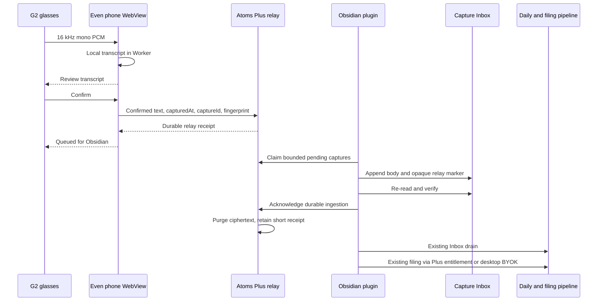
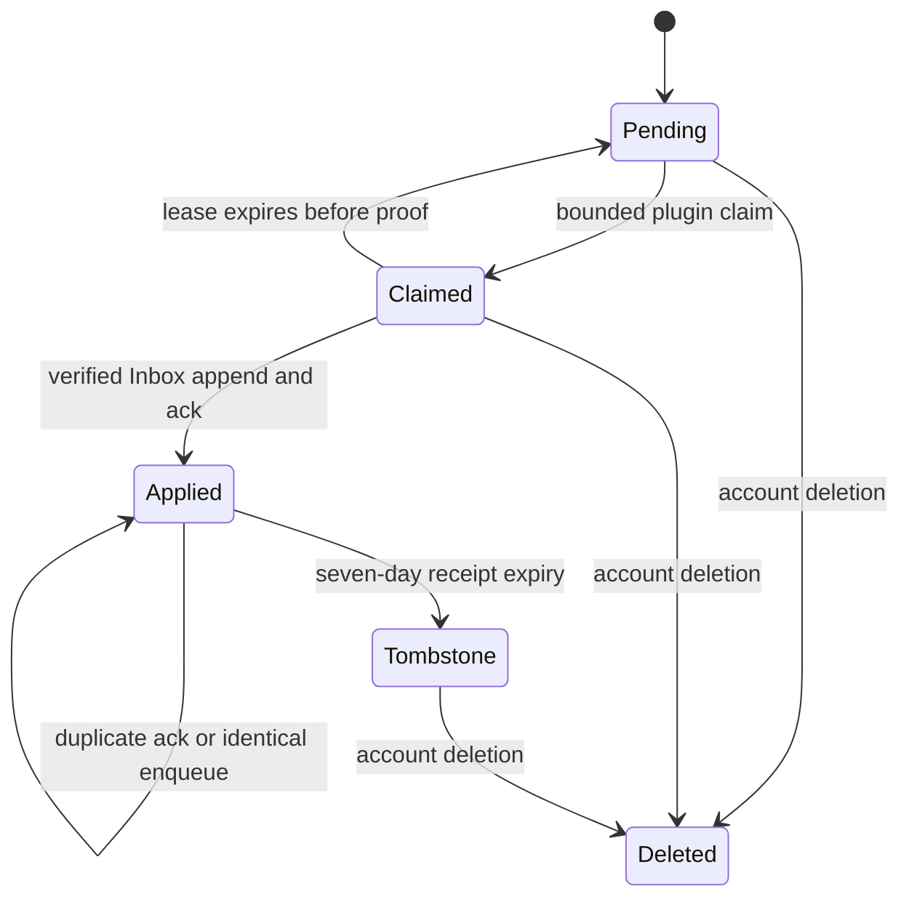
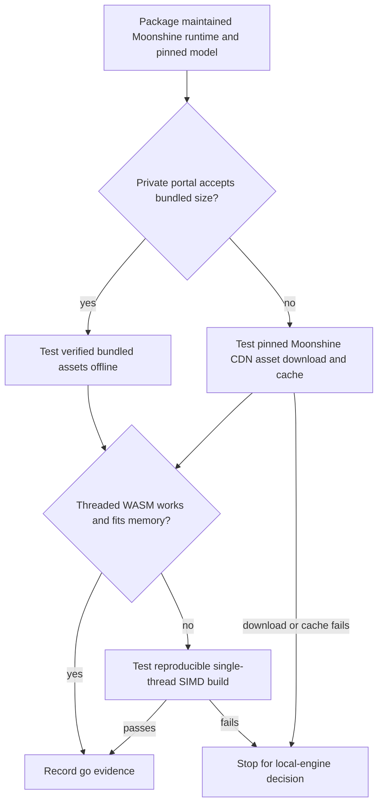
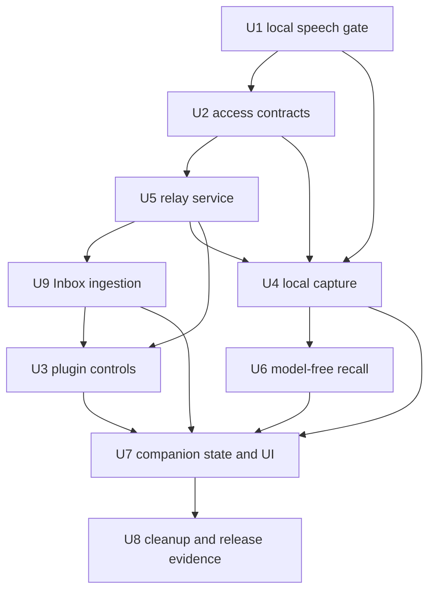

# Even G2 Local Capture Companion - Plan

## Goal Capsule

- **Objective:** An Atoms Plus subscriber can speak a thought through Even Reality G2, confirm the transcript, and trust that it will enter the same durable Inbox-to-daily-to-atom workflow as an iOS Shortcut when Obsidian next opens, while retaining private, model-free recall from the glasses.
- **Means:** Transcribe on the paired phone, enqueue only the confirmed text in a dedicated Plus capture relay, drain that relay into `Atoms System/Inbox.md` before the existing inbox pass, and replace generated answers with mirror-backed search, recent, and fetch (KTD1, KTD4, KTD7, KTD9).
- **Authority:** The 2026-09-09 user-approved pivot supersedes the cloud-transcription, generated-metadata, direct-atom, and generated-answer behavior in the origin design and the prior revision of this plan. Repository source-of-truth, security, and shipping contracts remain binding.
- **Execution profile:** Deep, security-sensitive, cross-surface feature. Run U1 as a feasibility gate before product implementation; build protocol and persistence seams test-first; reserve physical-device claims for recorded hardware evidence.
- **Stop conditions:** Stop before product implementation if packaged phone-local speech recognition cannot meet the U1 gates on both declared targets. Stop any data-bearing request when entitlement, device proof, account binding, or live consent is absent. Do not restore cloud speech recognition or generated answers without a new user decision and privacy review.
- **Tail owner:** The implementation run owns automated verification, simplify, one code review, durable learnings, world-class QA with its adversarial gate, the private-test artifact, and PR updates. A human with a G2 and Even developer access owns portal acceptance, physical-device evidence, Beta, and public-submission gates.

---

## Product Contract

### Summary

Replace the current branch's cloud-first G2 experiment with a deliberately smaller V1. The Even Hub companion records microphone PCM, transcribes it locally in the phone-hosted WebView, and asks the user to confirm the transcript. Atoms Plus durably holds only that confirmed text until the paired Obsidian plugin appends it to the normal capture Inbox and acknowledges delivery. The existing drain and filing pipeline then decides when and how the capture becomes an atom, using the subscriber's normal Plus filing entitlement or the existing desktop BYOK path.

Recall remains available through the existing Ask mirror, but V1 returns ranked matches, recent atoms, and verbatim fetched bodies only. It does not generate an answer or require a new user-supplied API key.

### Problem Frame

The prior branch solved for immediate atom creation and answer synthesis by sending audio and note evidence through hosted model providers. That shape conflicts with the approved privacy and product direction: speech recognition belongs on the paired phone, the user should approve their actual words rather than generated metadata, and the vault workflow—not a server-side preparation—is responsible for turning raw thought into an atom.

Even Hub code runs in a phone WebView and the G2 supplies PCM and display/gesture events. The vault is unavailable until Obsidian opens. The missing product boundary is therefore a durable, idempotent handoff between a confirmed phone transcript and the already-shipped Inbox drain, not a second write pipeline.

### Actors

- A1. The Atoms Plus subscriber wears the G2, grants microphone and G2 capture disclosure, confirms a transcript, and may browse mirrored atoms.
- A2. The Even app hosts the companion WebView on the paired iOS or Android phone and relays G2 audio, display, lifecycle, and gesture events.
- A3. The Atoms Plus service authenticates the device, stores confirmed captures until acknowledged, and serves model-free mirror reads.
- A4. The Obsidian plugin claims pending captures, appends each one exactly once to `Atoms System/Inbox.md`, acknowledges durable delivery, drains the Inbox, and runs the existing filing pipeline.
- A5. A human release owner verifies the packaged app in the Even private portal and on the declared physical phone/G2 targets.

### Key Decisions

- **Transcribe on the paired phone; no audio leaves the phone** (session-settled: user-approved pivot). Governs R3, R4, R15.
- **Confirm the transcript, not a generated title or metadata proposal** (session-settled: user-approved pivot). Governs R4-R6.
- **Relay only confirmed raw capture until Obsidian opens** (session-settled: user-approved pivot). Governs R5-R9, R13.
- **Enter through the same Inbox, daily-note, and filing path as the iOS Shortcut** (session-settled: user-approved pivot). Governs R7-R10.
- **Keep search, recent, and fetch; remove model-generated query answers from V1** (session-settled: user-approved pivot). Governs R11, R12.
- **Require no new user API key; normal filing uses existing Plus entitlement or desktop BYOK** (session-settled: user-approved pivot). Governs R1, R10, R11.
- **Keep the companion Plus/admin gated for V1** (session-settled: user-approved pivot). Governs R1, R2, R14.

### Requirements

**Access and local speech**

- R1. Only an admin-enabled, server-confirmed Atoms Plus subscriber with a live scoped G2 device grant can enqueue captures or read the account's mirror; the G2 capture relay itself consumes no filing credit.
- R2. Pairing remains a short-lived, single-use, plugin-created code with device-bound proof tokens, account-bound refresh, family-specific revocation, and exact-origin enforcement.
- R3. G2 microphone audio is processed only in the paired phone host, is never uploaded to Atoms Plus or another speech provider, and is removed from app memory after transcription, cancellation, teardown, or failure.
- R4. The local speech engine consumes the G2's 16 kHz mono signed-16-bit PCM and produces a reviewable transcript without requiring network access after its pinned runtime and model assets are available.
- R5. The user can inspect the transcript on the glasses and the phone and must explicitly confirm it before any text is enqueued; retry and cancel cause no server write.

**Capture relay and vault ingestion**

- R6. Confirmation enqueues the exact reviewed transcript, an exact-offset capture timestamp, a client-generated opaque capture ID, and a matching content fingerprint; the server does not title, tag, link, summarize, or rewrite it.
- R7. While a capture is pending or its seven-day applied receipt exists, a same-account retry with the same capture ID and identical semantic payload returns the original receipt; changed reuse conflicts. After the receipt expires, the account-scoped opaque ID remains as a content-free tombstone and all reuse is rejected until account deletion. Foreign accounts learn nothing from identifier collisions.
- R8. Confirmed capture text is encrypted at rest, account-bound, and retained until the plugin proves durable Inbox ingestion. An authenticated plugin for that account may drain already accepted captures after device revocation, G2 disclosure withdrawal, or subscription lapse; a global admin emergency disable pauses delivery, and explicit account deletion purges it. Acknowledgement immediately purges ciphertext, leaves a content-resistant idempotency receipt for seven days, and then retains only the opaque ID tombstone required by R7.
- R9. The plugin claims a bounded batch, uses an opaque relay marker to make each local Inbox replica idempotent, re-reads and verifies the capture body plus marker, and only then acknowledges it. If independently synced replicas still produce the same marker more than once after a lease expiry, the parser treats them as one logical capture and the drain writes exactly one daily entry while marking every duplicate Inbox occurrence inert.
- R10. After durable Inbox acknowledgement, the existing drain and filing pipeline remains authoritative: it preserves captured-at identity in the daily note, applies the normal filed marker, and consumes the subscriber's ordinary Plus filing entitlement or existing desktop BYOK configuration only when filing runs.

**Model-free recall**

- R11. **Search atoms** transcribes a spoken query with the same phone-local engine, shows the canonical query for submit/retry, and only after submit returns a bounded ranked list of mirror-backed titles, snippets, opaque atom IDs, and mirror freshness/coverage metadata without calling a generation model or consuming filing credit.
- R12. Recent atoms lists no more than 20 rows by covered creation date, and selecting a search or recent result fetches that exact mirror row's verbatim body in readable pages while preserving the prior list position.

**Consent, lifecycle, and release**

- R13. Capture and recall are capability-gated: per-capture transcript confirmation plus current G2 capture disclosure authorizes one enqueue; mirror consent authorizes search/recent/fetch; Ask write consent is not required because the relay does not create a final atom.
- R14. Every companion content-bearing egress rechecks live entitlement, admin enablement, scoped device proof, device/account generation, and the relevant consent at the call boundary. Plugin claim and acknowledgement instead require a current account-authenticated plugin session and matching account generation; they do not re-require the originating device or current disclosure for already accepted rows. Revocation or account switch cancels in-flight work and prevents stale completion from crossing tenants.
- R15. Local transcription ships only after the maintained runtime, model assets, integrity checks, memory profile, offline behavior, WebView capabilities, `.ehpk` packaging, and private-portal acceptance pass U1. Failure stops the feature rather than falling back to cloud speech recognition.
- R16. Status language distinguishes local transcription, server acceptance, pending Obsidian delivery, Inbox delivery, and later filing. The glasses may say **Queued for Obsidian** only after durable server acceptance and must never say **Saved to Atoms** based only on relay state.
- R17. Public release remains blocked until simulator, packaged iPhone 16 Pro Max, the owner's available Nothing Phone, and physical G2 evidence cover microphone input, lifecycle interruption, connectivity loss, local-model behavior, readability, and exit cleanup. The Nothing Phone result applies only to the exact model, Android version, and Even App version recorded during U1.

### Success Criteria

- In a throwaway vault, one confirmed G2 transcript creates one logical marked Inbox capture, drains to one daily-note capture even after a duplicate-marker Sync merge, and later follows the unmodified filing path with no direct Ask outbox write.
- Repeating any network or process boundary in the flow cannot produce a second Inbox capture or expose content across accounts.
- Network inspection and egress sentinels observe no PCM or unconfirmed transcript leaving the phone and no call to a speech or answer-generation provider.
- Search, recent, and fetch remain useful when a current mirror exists and fail honestly when mirror consent, coverage, or freshness is insufficient.
- A private `.ehpk` installs and runs on the declared iPhone 16 Pro Max and Nothing Phone/G2 combinations with recorded local-model load time, peak memory, first-transcript latency, and package size.

### Key Flows

- F1. Confirmed capture
  - **Trigger:** A paired and eligible user selects **New capture** and starts recording.
  - **Actors:** A1-A4.
  - **Steps:** The phone buffers bounded PCM, performs local transcription, displays the transcript, receives explicit confirmation, obtains a durable relay receipt, then the plugin appends and verifies the capture before acknowledgement and normal drain.
  - **Outcome:** The confirmed words appear once in the daily capture path and remain eligible for normal filing.
  - **Covered by:** R1-R10, R13-R16.
- F2. Retry after an ambiguous boundary
  - **Trigger:** The companion loses the enqueue response or the plugin loses the acknowledgement response.
  - **Actors:** A1-A4.
  - **Steps:** The original capture ID and fingerprint are retried; the service returns the original row; the plugin detects the existing relay marker or re-verifies the append; acknowledgement becomes idempotent.
  - **Outcome:** The user gets one durable capture without guessing whether retry will duplicate it.
  - **Covered by:** R7-R9, R14, R16.
- F3. Local or network failure before acceptance
  - **Trigger:** Microphone permission, model load, transcription, integrity verification, or the enqueue network call fails.
  - **Actors:** A1-A3.
  - **Steps:** The app stops audio, preserves no unconfirmed server-side content, and offers the one safe action appropriate to the state: retry, reconnect, return, or discard.
  - **Outcome:** No success claim appears until the relay returns the durable receipt.
  - **Covered by:** R3-R6, R15, R16.
- F4. Model-free recall
  - **Trigger:** An eligible user selects **Search atoms** or **Recent atoms**.
  - **Actors:** A1-A3.
  - **Steps:** The phone locally transcribes a spoken search, the user submits the displayed canonical query, and the service enforces mirror consent, queries the tenant-scoped mirror, returns bounded matches or recent rows, and fetches the selected exact body by opaque ID.
  - **Outcome:** The user reads source material, not a generated answer.
  - **Covered by:** R1, R2, R11-R14.
- F5. Revocation or account change
  - **Trigger:** The device is revoked, capture/mirror consent is withdrawn, entitlement lapses, or the companion changes account during an asynchronous operation.
  - **Actors:** A1-A4.
  - **Steps:** Live companion egress gates reject new device operations, lifecycle generations invalidate late results, and tenant-scoped stores conceal foreign identifiers. Already accepted account-owned captures remain available to that account's authenticated plugin after device revocation, disclosure withdrawal, or subscription lapse; a global emergency disable may pause delivery, and account deletion purges it.
  - **Outcome:** No stale work crosses a security boundary and confirmed data is not silently discarded by device revocation.
  - **Covered by:** R1, R2, R8, R13, R14.

### Acceptance Examples

- AE1. **Covers R3-R5, R15.** Given the pinned local engine and model are installed, when the G2 supplies valid PCM and the phone has no network, then a transcript can still be produced and reviewed, and no outbound request contains audio.
- AE2. **Covers R5-R10, R16.** Given the user confirms `Call Mom tomorrow` at `2026-09-09T09:30:00-04:00`, when Obsidian next catches up, then the exact text and timestamp enter the Inbox once, drain through the existing daily-note format, and the G2 never claims it was filed before filing actually runs.
- AE3. **Covers R7-R9.** Given enqueue or acknowledgement responses are lost, when the companion and plugin retry with the original identifiers, then the server returns the original receipt within its defined window, each local replica appends at most once, a later Sync duplicate is deduplicated by marker during drain, and acknowledgement succeeds once or idempotently thereafter.
- AE4. **Covers R3, R5, R6, R16.** Given transcription fails or the network is unavailable at confirmation, when the user retries or exits, then no relay row exists and the UI does not show **Queued for Obsidian**.
- AE5. **Covers R8, R13, R14.** Given capture A is accepted and its originating device is revoked, disclosure is withdrawn, or Plus later lapses, when the same account's authenticated plugin catches up, then capture A can still be ingested unless the global emergency gate is paused; the device cannot enqueue or read anything further.
- AE6. **Covers R11-R13.** Given current mirror coverage and mirror consent, when the user submits a locally transcribed query that matches three atoms, then the G2 shows ranked titles/snippets and opens a selected verbatim body without generating a prose answer.
- AE7. **Covers R11-R14.** Given mirror consent is withdrawn while a read is in flight, when the content-bearing call reaches egress, then it sends no body and returns a setup/consent state without leaking whether a requested atom ID exists.
- AE8. **Covers R7, R14.** Given two accounts reuse the same opaque capture ID, when either account retries, then each can observe only its own row and responses do not reveal the collision.
- AE9. **Covers R8-R10.** Given the plugin verifies the Inbox append, when acknowledgement completes, then capture ciphertext is gone immediately, a metadata receipt remains for seven days, and the normal Inbox/daily content remains the durable vault source.
- AE10. **Covers R15, R17.** Given simulator tests pass but the private portal rejects the package or the physical iPhone cannot load the model within the recorded resource limits, then the feature remains private and implementation stops for a local-engine decision.

### Scope Boundaries

**In scope**

- Phone-local English transcription for deliberate G2 recordings.
- Confirmed-text relay, exact-once Inbox ingestion, and existing daily/file behavior.
- Model-free mirror search, recent, and fetch.
- Plus/admin access, pairing, device lifecycle, privacy, operational, and private-release controls.

**Deferred to follow-up work**

- On-phone transcript editing beyond retrying a recording.
- Additional Moonshine languages or a user-selectable speech model.
- A durable offline queue for a confirmed transcript that has not yet reached Plus; V1 requires a successful relay receipt before it claims the capture is queued.
- User-facing management of old pending captures beyond status and disconnect warnings.
- Generated answers, conversational follow-ups, or model-produced titles/tags from the glasses.

**Outside this product's identity**

- Uploading G2 audio to Atoms Plus or a third-party speech provider.
- Giving the companion direct vault filesystem access or making it a second notes database.
- Consuming an Ask write operation to bypass the Inbox and create a final atom.
- Shipping a model API credential, asking the subscriber for a new provider key, or silently substituting a cloud fallback.

---

## Planning Contract

### Key Technical Decisions

- KTD1. **Make local speech feasibility the first executable gate.** The installed Even phone WebViews must prove Worker, WebAssembly SIMD, memory, Cache API persistence, model load, latency, package size, and portal behavior before dependent product work begins; U1 records the measured result against R15 and R17.
- KTD2. **Use the maintained Moonshine Voice WebAssembly package as the pinned leading candidate.** Start with `@moonshine-ai/moonshine-wasm` 0.1.5 and Tiny Streaming English rather than archived `moonshine-js`; keep the dependency and model manifest exact and review any version change as a new feasibility input (R4, R15).
- KTD3. **Own the audio conversion and model integrity boundary in the companion.** Convert G2 signed-16-bit little-endian PCM to 16 kHz float samples in a Worker, bound all buffers, and verify app-owned SHA-256 values for every runtime/model asset before load because the upstream downloader validates size but not cryptographic identity (R3, R4, R15).
- KTD4. **Use a dedicated capture relay, not the Ask outbox.** Capture relay items represent raw Inbox input with per-capture confirmation and different acknowledgement semantics; Ask outbox remains reserved for prepared final-vault writes (R6-R10, R13).
- KTD5. **Bind idempotency to tenant, capture ID, and canonical payload.** Store one account-scoped row per client capture ID, verify the client fingerprint against the canonical timestamp/body, and compare retries with a versioned server-keyed digest rather than retaining a raw content hash. Pending or seven-day applied rows return only for identical payloads; afterward a content-free account-scoped ID tombstone rejects all reuse until account deletion. Unknown and foreign IDs remain indistinguishable (R7, R14).
- KTD6. **Encrypt pending content and make key retirement data-aware.** Use the service's versioned AES-GCM keyring with account, device family, and capture ID in authenticated context. Pending content has no automatic age-based deletion because it is the only confirmed copy. A rotation job re-encrypts every pending row under the new key, verifies parity across all stores, and blocks retirement of an old key until no row references it; keyed-digest rotation retains old digest keys until no seven-day receipt needs them. Acknowledge purges ciphertext immediately, receipt expiry removes the keyed digest, and account deletion purges all states (R8).
- KTD7. **Make the Inbox relay marker the idempotency witness.** In one canonical atomic mutation per vault replica, check for the parser-recognized opaque marker and append marker plus capture only when absent. Exclude the marker from captured body semantics and re-read to prove the local write before acknowledgement. Because atomicity cannot span independently synced vault replicas, the parser groups repeated relay markers as one logical capture, the drain writes one daily entry, and it marks every Inbox occurrence filed/inert (R9, R10).
- KTD8. **Run capture ingestion before the existing Inbox drain.** Add a `capture` resume stage ahead of `drain`; once the Inbox append is verified, the relay may be acknowledged because the vault has become the durable source, even if daily drain or filing fails later (R9, R10).
- KTD9. **Reuse mirror retrieval without generation.** Replace `/v1/g2/query` with a bounded `/v1/g2/search` adapter over existing tenant-scoped search semantics; preserve recent and fetch, expose freshness/coverage, and remove Anthropic answer synthesis and citation machinery from the G2 surface (R11, R12).
- KTD10. **Split capability consent instead of requiring all G2 grants at setup.** Capture enqueue requires current versioned G2 disclosure and a fresh transcript confirmation; that confirmation authorizes later same-account vault delivery of the accepted row. Recall requires current Ask mirror consent. Neither path requires Ask write consent, and authorization is checked again at its own content boundary (R8, R13, R14).
- KTD11. **Preserve the existing pairing and proof architecture while narrowing scopes.** Give the companion only capture-enqueue and search/recent/fetch device scopes with exact HTTP Origin checks, DPoP replay defense, no-store responses, rate limits, and device-family revocation. Give plugin claim/ack and content-free pending status a separate existing-session account boundary rather than a G2 device scope (R1, R2, R8, R14).
- KTD12. **Treat server acceptance as the companion's durable terminal success.** The companion does not poll for a final atom receipt. It reports **Queued for Obsidian** after an accepted relay receipt; the plugin and settings can separately report pending/ingested state, while filing remains visible through existing Atoms surfaces (R16).
- KTD13. **Remove the superseded provider path rather than leave a dormant fallback.** Delete G2 cloud transcription, metadata preparation, generated query answers, provider configuration, provider production gates, audio WebSocket tickets, and their disclosures/tests so audits cannot confuse dead code with an allowed path (R3, R6, R11, R15).
- KTD14. **Canonicalize before the user reviews or identifiers are derived.** Normalize local engine output to NFC with LF line endings, trim only outer whitespace, reject an empty or over-limit UTF-8 result, and use the resulting displayed bytes for capture/search, fingerprints, and retries. Record `capturedAt` once at recording start as an RFC 3339 timestamp with numeric offset and reject values more than 24 hours from server receipt (R4-R7, R11).

### High-Level Technical Design

### System-Wide Impact

- **Data lifecycle:** The service gains a second queue whose content is transient raw capture rather than a final-vault write. Store parity across memory, SQLite, and Postgres and mixed-version behavior are required.
- **Security and privacy:** Audio egress disappears, but confirmed transcript storage remains sensitive. Pairing, DPoP, tenant isolation, live consent, encryption-key rotation, logging, and account deletion remain load-bearing.
- **Vault write integrity:** The Inbox parser gains a machine marker and resume gains an earlier stage. Parser compatibility, append verification, multi-window races, Obsidian Sync races, and crash recovery must be tested against the existing Shortcut format.
- **Billing:** Relay and recall do not spend filing entitlement. Only the existing classifier path spends Plus filing or uses the existing BYOK key after the capture reaches the daily pipeline.
- **Operations:** Provider secrets and WebSocket audio infrastructure are removed. New signals cover pending age, claim expiry, enqueue/ack conflicts, ingestion latency, and local-only client metrics without content.
- **Stakeholders:** Users need truthful capture states; developers need one canonical capture contract; operators need visibility into stuck ciphertext; reviewers need proof that provider and direct-write paths are gone; the release owner needs package and device measurements.

### Risks and Dependencies

| Risk or dependency | Impact | Mitigation / decision |
|---|---|---|
| Even WebView lacks cross-origin isolation or threaded WASM | Default Moonshine build cannot start | U1 tries the default build, then a reproducible upstream-tagged single-thread SIMD build; failure of both stops the plan. |
| Tiny Streaming model or WASM exceeds target-phone memory or `.ehpk` limits | Local transcription cannot ship reliably | Measure against the fixed go/no-go criteria, prefer bundled assets if the portal accepts them, otherwise use the exact hash-verified Moonshine CDN artifacts; no cloud fallback. |
| Runtime model download depends on mutable remote bytes | Supply-chain or offline failure | Pin an app-owned asset manifest and SHA-256; cache only verified bytes; prefer bundled assets. |
| Ack is lost after Inbox append | Duplicate capture on retry | KTD7 marker detection and idempotent server acknowledgement. |
| Pending captures become old but remain the only confirmed copy | Long-lived sensitive server content | Encrypt, expose content-free age/count telemetry, warn operationally at 30 days, support account deletion, and do not silently age-delete user data. |
| Revocation occurs after a capture was accepted | Security cleanup can conflict with no-data-loss behavior | Revoke future device operations immediately but keep the accepted row account-owned for plugin ingestion; account deletion is the destructive boundary. |
| Existing cloud-era branch schema/tests obscure the allowed product | Dead provider paths survive audits or regressions | KTD13 removes them and U8 updates all current architecture, privacy, runbook, and access-matrix claims. |

### Alternatives Considered

- **Reuse the Ask outbox for raw captures.** Rejected because it applies final atom payloads directly, carries Ask write consent, and acknowledges only after a different write/mirror lifecycle. Extending it would entangle two trust contracts and make `origin: g2` misleading.
- **Send local transcripts directly to the existing daily note from the companion.** Rejected because Even Hub has no vault filesystem access and Obsidian may be closed.
- **Keep cloud transcription as a fallback.** Rejected by the approved privacy boundary; it would make failure semantics and disclosure conditional and could silently reintroduce audio egress.
- **Generate answers from mirror search results.** Rejected for V1; ranked source material is smaller, model-free, auditable, and consistent with the approved scope.
- **Automatically expire unacknowledged pending captures.** Rejected because the relay may hold the only confirmed copy. Retention ends on verified Inbox ingestion, explicit account deletion, or a future user-controlled discard flow; KTD6 makes indefinite retention safe across key rotation.

### Deferred Implementation Notes

- U1 determines whether model assets are bundled or fetched after a user gesture. The download branch is limited to exact version-addressed assets from `download.moonshine.ai`, verified against the app-owned SHA-256 manifest before caching or load; it adds only that host to the companion whitelist. Failure of the host, integrity, cache, or offline-restart checks is a no-go, not a prompt to invent new asset infrastructure.
- Exact store helper names and migration SQL remain implementation details. The externally visible lifecycle and retention contract in KTD5-KTD7 is fixed.
- The seven-day applied-receipt cleanup, ID tombstone, 30-day pending-age alert, and key-rotation migration may reuse existing sweeper and clock-injection patterns; implementation must retain the lifecycle in KTD5-KTD7.

### Local Speech Go/No-Go Criteria

U1 records these thresholds before running the private test. A missing measurement is a failure, not a waived gate.

| Measure | Pass threshold |
|---|---|
| Hardware targets | iPhone 16 Pro Max is the iOS test floor. Android evidence comes from the owner's available Nothing Phone. Record the exact OS version and Even App version for iOS and the exact device model, OS version, and Even App version for Android; neither result implies support for other Android hardware. |
| Recording bound | 120 seconds at 16 kHz mono signed-16-bit PCM with bounded memory and no dropped or duplicated samples |
| Cold readiness | Verified cached runtime and model become ready within 15 seconds after app entry |
| Streaming/final latency | Processing keeps pace with real time and the final canonical transcript appears within 2 seconds after stop for the 120-second synthetic fixture and three 30-second physical recordings |
| Memory stability | Peak companion process memory stays at or below 384 MiB, and retained memory grows by no more than 16 MiB from the first to the twentieth full record/transcribe/discard cycle after an idle collection interval |
| Cancellation | Microphone capture and Worker processing stop within 500 ms and no late transcript becomes actionable |
| Accuracy smoke | On the checked-in 20-phrase private English corpus, word error rate is at most 20% with no more than two meaning-changing errors in names, negations, dates, or numbers |
| Asset delivery | Bundled assets pass private-portal acceptance, or exact CDN assets pass hash verification, cache persistence, offline restart, failure recovery, and whitelist checks |
| Package/device stability | The private `.ehpk` installs, survives 20 full cycles without crash or jetsam, and leaves no audio/transcript in logs, storage, fixtures, or network traces |

---

## Implementation Units

### U1. Prove packaged phone-local speech feasibility

- **Goal:** Establish a reproducible go/no-go result for local Moonshine transcription in the installed Even WebViews on iPhone 16 Pro Max and the owner's Nothing Phone, plus the private `.ehpk` path, before dependent product work.
- **Requirements:** R3-R5, R15, R17; AE1, AE10; KTD1-KTD3.
- **Dependencies:** None.
- **Files:** `companion/even-g2/package.json`, `companion/even-g2/package-lock.json`, `companion/even-g2/app.json`, `companion/even-g2/src/audio/localTranscriber.ts` (new), `companion/even-g2/src/audio/moonshineWorker.ts` (new), `companion/even-g2/src/audio/modelManifest.ts` (new), `companion/even-g2/src/provider/capability.ts`, `companion/even-g2/scripts/verify-package.mjs`, `companion/even-g2/test/local-transcriber.test.ts` (new), `companion/even-g2/test/provider-capability.test.ts`, `docs/g2-private-test.md`.
- **Approach:**
  1. Pin `@moonshine-ai/moonshine-wasm` 0.1.5 and Tiny Streaming English in an explicit runtime/model manifest with source, version, byte size, and SHA-256.
  2. Build the smallest Worker-based PCM-to-transcript spike using bounded buffers and app-owned asset verification.
  3. Measure default threaded/SIMD support, `crossOriginIsolated`, Worker and Cache API behavior, model load, memory stability, latency, cancellation, accuracy smoke, host restart, package size, and private-portal acceptance against the fixed go/no-go table on the declared iPhone 16 Pro Max and Nothing Phone targets.
  4. If threads are unavailable, try one reproducible upstream-tagged single-thread SIMD build. If bundled assets exceed portal constraints, try only the exact manifest-pinned `download.moonshine.ai` assets after a user gesture, with hash verification before cache/load and offline restart afterward. Stop if neither allowed branch passes.
- **Execution note:** This is runtime-first research with unit tests around deterministic PCM conversion and integrity behavior; do not build the server or product flow before recording the go result.
- **Patterns to follow:** Existing provider capability gating and package verification; official Even ASR PCM contract; maintained Moonshine WebAssembly API.
- **Test scenarios:**
  - Covers AE1. Valid signed-16-bit little-endian PCM becomes correctly scaled 16 kHz float samples and produces a reviewable local transcript while network egress is blocked.
  - Odd-byte chunks, oversized recordings, worker failure, cancellation, repeated start/stop, and lifecycle teardown free bounded audio and model resources.
  - Missing, changed, truncated, or wrong-hash WASM/model assets fail before model initialization and never fall through to a network provider.
  - Default threaded runtime and single-thread fallback each report a truthful capability result; an unsupported environment keeps capture disabled.
  - Covers AE10. Packaged private installation on both declared phone targets meets every predeclared hardware, latency, memory, cancellation, accuracy, asset, stability, and portal threshold.
- **Verification:** A dated private-test entry records the chosen asset delivery/runtime branch and measured hardware evidence, or records a no-go that stops U2-U9. Package verification proves no provider secret, unexpected origin, or unmanifested model asset is present.

### U2. Narrow G2 access, scopes, and consent contracts

- **Goal:** Preserve the proven pairing and DPoP boundary while replacing cloud-era permissions with the capture-relay and model-free-read capabilities.
- **Requirements:** R1, R2, R8, R13, R14; AE5, AE7, AE8; KTD10, KTD11.
- **Dependencies:** U1 go result.
- **Files:** `plus-service/src/g2/auth.mjs`, `plus-service/src/g2/http.mjs`, `plus-service/src/store/shared.mjs`, `plus-service/src/store/memory.mjs`, `plus-service/src/store/sqlite.mjs`, `plus-service/src/store/postgres.mjs`, `plus-service/src/server.mjs`, `plus-service/test/http-g2-auth.test.mjs`, `plus-service/test/g2-operations.test.mjs`, `plus-service/test/store-g2.test.mjs`, `companion/even-g2/src/auth/client.ts`, `companion/even-g2/src/auth/setup.ts`, `companion/even-g2/test/auth-client.test.ts`, `companion/even-g2/test/pairing-ui.test.ts`.
- **Approach:**
  1. Replace transcription/prepare/commit/query grants with least-privilege companion capture-enqueue and search/recent/fetch scopes, and define plugin relay claim/ack/status under the existing authenticated-account session boundary.
  2. Make setup capability-specific so capture can operate without mirror or Ask write consent, while recall remains blocked without mirror consent.
  3. Keep exact-origin, proof replay, refresh rotation, account binding, device-family revocation, no-store, rate-limit, and disabled-feature behavior unchanged except where the narrower scopes require explicit failures.
  4. Version the replacement G2 disclosure so stale cloud-era acceptance does not grant the new retention contract. Ensure live consent and generation checks occur at companion content-bearing calls, while accepted-row delivery follows R8 and R14.
- **Execution note:** Start with failing access-matrix and negative HTTP tests; preserve current successful pairing vectors as characterization coverage.
- **Patterns to follow:** Existing G2 auth tests, DPoP proof binding, and `docs/solutions/security/consent-gate-must-be-checked-at-egress-not-at-entry.md`.
- **Test scenarios:**
  - A capture-only device grant cannot search/fetch; a recall-only device grant cannot enqueue; neither device grant can call plugin claim/ack/status, and removed cloud-era scopes authorize nothing.
  - Pair code expiry/replay, wrong Origin, wrong method/URL proof, stale nonce, refresh replay, revoked family, lapsed Plus, and disabled admin gate fail closed.
  - Covers AE7. Mirror withdrawal between scheduling and fetch causes no body egress.
  - Covers AE8. Tenant-scoped identifiers reveal neither existence nor state across accounts.
  - Device revocation, disclosure withdrawal, and subscription lapse block new device calls while preserving an already accepted account-owned capture for authenticated plugin ingestion; the global emergency gate pauses both new calls and delivery.
- **Verification:** Existing pairing vectors remain green; new scope/consent matrices prove each capability independently and observe content egress rather than proxy state.

### U5. Replace preparation and direct writes with a durable capture relay

- **Goal:** Persist exactly one encrypted confirmed capture per semantic request and expose bounded claim/status/ack operations for the paired plugin.
- **Requirements:** R6-R9, R13, R14, R16; AE2, AE3, AE5, AE8, AE9; KTD4-KTD6, KTD11-KTD14.
- **Dependencies:** U2.
- **Files:** `plus-service/src/g2/capture.mjs` (new), `plus-service/src/g2/crypto.mjs`, `plus-service/src/g2/http.mjs`, `plus-service/src/g2/telemetry.mjs`, `plus-service/src/store/shared.mjs`, `plus-service/src/store/memory.mjs`, `plus-service/src/store/sqlite.mjs`, `plus-service/src/store/postgres.mjs`, `plus-service/src/store/askSqliteMethods.mjs`, `plus-service/src/store/askPostgresMethods.mjs`, `plus-service/src/server.mjs`, `plus-service/test/g2-capture.test.mjs` (new), `plus-service/test/http-g2-outbox-ack.test.mjs`, `plus-service/test/store-g2.test.mjs`.
- **Approach:**
  1. Define device-authenticated enqueue plus account-session-authenticated status, bounded claim, and acknowledgement contracts for canonical transcript, captured-at timestamp, capture ID, client fingerprint, and server-keyed retry digest.
  2. Add equivalent pending/claimed/applied/tombstone persistence and claim leases to memory, SQLite, and Postgres; do not destructively drop cloud-era local tables in deployed stores.
  3. Encrypt pending content with versioned authenticated context. Add a resumable rotation that re-encrypts and verifies every old-key pending row before retirement, and retain old keyed-digest versions until their applied receipts expire.
  4. Acknowledge only a valid account-bound claim, purge ciphertext and the raw client fingerprint transactionally, retain a seven-day content-resistant receipt, then reduce it to the opaque ID tombstone.
  5. Remove preparation/metadata/direct Ask outbox creation from G2 routes and make old endpoints return the normal unsupported/not-found boundary with no compatibility fallback.
- **Execution note:** Start with one shared store contract suite used by memory, SQLite, and Postgres, then add HTTP fault injection for response loss and lease takeover.
- **Patterns to follow:** Existing Ask outbox leases and idempotency, G2 AES-GCM keyring, tenant-hiding HTTP responses, and full-payload forwarding lessons.
- **Test scenarios:**
  - Covers AE2. A valid confirmed capture round-trips exact UTF-8 body, offset timestamp, ID, and fingerprint without generated fields.
  - Covers AE3. Identical enqueue retries return one receipt; changed payload under the same account/ID conflicts; duplicate acknowledgements are safe.
  - Covers AE5. Revoking the originating device, withdrawing disclosure, or losing Plus does not delete or block same-account plugin delivery of an accepted row, but the device cannot read or mutate it further; the global emergency gate pauses delivery.
  - Covers AE8. Same IDs in two accounts remain independent and foreign status/ack responses reveal no collision.
  - Covers AE9. Valid ack removes ciphertext immediately, leaves the seven-day keyed receipt, and receipt expiry removes everything except the account-scoped opaque ID tombstone.
  - Claim expiry, concurrent claimers, worker crash, stale claim token, wrong account, malformed or implausibly skewed timestamp, body/fingerprint mismatch, size limit, queue limit, encryption-key rotation, and keyed-digest rotation preserve one valid owner and no plaintext logs.
  - Account deletion purges pending ciphertext, claims, and applied receipts; service restart and store migration preserve retry semantics.
- **Verification:** One parity suite passes against every store and an HTTP integration proves enqueue-response loss, claim-response loss, ack-response loss, lease expiry, key rotation, and restart without duplication or content leakage.

### U9. Drain relay captures into the canonical Inbox idempotently

- **Goal:** Make the vault the durable source by appending each claimed relay capture at most once per replica, deduplicating any later cross-replica Sync copies, proving the write, and acknowledging safely across crashes or windows.
- **Requirements:** R8-R10, R14, R16; AE2, AE3, AE5, AE9; KTD7, KTD8.
- **Dependencies:** U2, U5.
- **Files:** `src/platform/g2CaptureRelay.ts` (new), `src/platform/plusClient.ts`, `src/pipeline/inbox.ts`, `src/platform/resume.ts`, `src/plugin/catchUp.ts`, `src/plugin/main.ts`, `test/g2CaptureRelay.test.ts` (new), `test/plusClient.test.ts`, `test/inbox.test.ts`, `test/resume.test.ts`, `test/catchUp.test.ts`.
- **Approach:**
  1. Add a `capture` resume stage before `drain` that claims only a bounded batch under the current account/generation.
  2. Extend the Inbox parser/writer with an indented opaque relay marker that is recognized as machine metadata, excluded from body text, groups cross-replica duplicate occurrences into one logical capture, and remains adjacent through the normal filed-marker lifecycle.
  3. Use the canonical atomic vault mutator to check for the exact marker and append marker plus capture as one mutation. Afterward, re-read and verify marker, timestamp, and body from the vault. Acknowledge only that proof; on retry, an existing valid marker skips append and proceeds to ack.
  4. Preserve the current drain's timestamp/body identity, daily append verification, filed-marker handling, and failure recovery. When the same relay marker appears more than once after Sync, write one daily capture and mark every Inbox occurrence filed/inert. Do not route relay items through `askOutbox.ts`.
- **Execution note:** Add characterization coverage for current Shortcut lines and drain races before changing the parser; then drive the new crash points with a fake relay client and real in-memory vault adapter.
- **Patterns to follow:** Existing append-then-re-read Inbox drain, `docs/solutions/documentation-gaps/ios-shortcut-capture-wire-format-traps.md`, and the resume stage ledger.
- **Test scenarios:**
  - Covers AE2. One claimed relay row becomes one parseable Inbox capture and then one normal daily capture with exact timestamp/body.
  - Covers AE3. Crash after append but before ack, lost ack response, plugin restart, and two plugin windows racing one local mutation never append a second local occurrence; a fixture merging independently synced duplicate markers drains once and marks both Inbox copies inert.
  - A pre-existing marker with changed body/timestamp is treated as corruption and is not acknowledged.
  - Shortcut captures without relay markers parse and drain exactly as before; relay markers never appear in the user capture body or atom record.
  - Inbox missing, externally edited, renamed, temporarily unavailable, or changed between write and re-read leaves the server row unacknowledged and retryable.
  - Covers AE5. Current-account plugin ingestion succeeds after originating-device revocation; sign-out or account switch cancels before foreign content is appended.
  - Covers AE9. Ack happens after Inbox proof but does not depend on later daily drain or filing success.
- **Verification:** A throwaway-vault integration injects failure at every boundary from claim through ack and proves one Inbox entry, unchanged Shortcut behavior, one daily entry, and no direct atom file.

### U4. Build bounded local transcription and transcript confirmation

- **Goal:** Replace streamed cloud transcription and generated-title confirmation with one phone-local recording, transcript review, and exact confirmed-text enqueue.
- **Requirements:** R3-R7, R13-R16; AE1-AE4; KTD2-KTD5, KTD10-KTD14.
- **Dependencies:** U1, U2, U5.
- **Files:** `companion/even-g2/src/audio/recorder.ts`, `companion/even-g2/src/audio/transport.ts` (delete), `companion/even-g2/src/audio/localTranscriber.ts`, `companion/even-g2/src/audio/moonshineWorker.ts`, `companion/even-g2/src/app/createFlow.ts`, `companion/even-g2/src/storage/recovery.ts`, `companion/even-g2/src/storage/appRecovery.ts`, `companion/even-g2/src/bootstrap.ts`, `companion/even-g2/test/audio-recovery.test.ts`, `companion/even-g2/test/create-flow.test.ts`, `companion/even-g2/test/local-retention.test.ts`, `companion/even-g2/test/bootstrap.test.ts`.
- **Approach:**
  1. Keep deliberate recording and bounded PCM capture, but feed chunks only to the local Worker and remove WebSocket ticket/audio transport.
  2. Canonicalize the engine output once, present that exact value on glasses and phone with confirm, retry recording, and cancel actions, and let the first valid action win across both surfaces. Confirmation freezes the body, recording-start timestamp, fingerprint, and generated capture ID.
  3. Retry ambiguous enqueue responses with the same immutable request until the server returns the receipt or a terminal conflict/auth error. Do not claim durable success when offline before receipt.
  4. Keep only non-secret, session-scoped recovery sufficient to avoid double-confirming within a live host. Clear PCM and transcript buffers on success, retry, cancel, exit, permission loss, revocation, and account-generation change.
- **Execution note:** Test the stateful flow against fake recorder, local transcriber, and relay adapters; use real model/device behavior only in U1/U8 hardware gates.
- **Patterns to follow:** Existing recorder bounds, app recovery generation checks, local retention tests, and dynamic iPhone loopback-origin handling for Plus calls.
- **Test scenarios:**
  - Covers AE1. Arbitrary even-byte chunks produce one local transcript with zero audio network calls.
  - Covers AE2. The exact displayed transcript and captured-at timestamp are the bytes fingerprinted and enqueued after confirmation.
  - Covers AE3. Lost enqueue response retries the same capture ID/payload and resolves to one durable receipt.
  - Covers AE4. Local failure, offline enqueue, cancel, and exit create no server row and show no queued success.
  - Confirmation double-tap, late Worker result, account switch, revocation, microphone loss, background/foreground churn, and root exit cannot enqueue stale or unreviewed text.
  - Empty/whitespace transcript, maximum duration, oversized UTF-8 text, decomposed Unicode, emoji, CRLF, and terminal newline follow KTD14 before display and fingerprint.
  - Raw PCM and unconfirmed transcript are absent from logs, errors, recovery storage, and packaged fixtures.
- **Verification:** State and adapter tests prove no cloud audio path exists, confirmation freezes one immutable request, all teardown paths clear sensitive buffers, and only a server receipt enables **Queued for Obsidian**.

### U6. Replace generated answers with model-free search, recent, and fetch

- **Goal:** Preserve useful private recall while removing answer synthesis and provider dependencies from the G2 surface.
- **Requirements:** R1, R11-R14; AE6, AE7; KTD9-KTD11, KTD13, KTD14.
- **Dependencies:** U1, U2, U4.
- **Files:** `plus-service/src/g2/query.mjs` (replace or delete), `plus-service/src/g2/search.mjs` (new), `plus-service/src/g2/http.mjs`, `plus-service/src/ask/domain.mjs`, `plus-service/src/store/askHelpers.mjs`, `plus-service/test/g2-query.test.mjs` (replace), `plus-service/test/g2-search.test.mjs` (new), `plus-service/test/ask-domain-parity.test.mjs`, `companion/even-g2/src/app/queryFlow.ts` (replace or delete), `companion/even-g2/src/app/searchFlow.ts` (new), `companion/even-g2/src/app/readFlow.ts`, `companion/even-g2/test/query-read-flow.test.ts` (replace), `companion/even-g2/test/search-read-flow.test.ts` (new).
- **Approach:**
  1. Reuse the U4 local transcriber and KTD14 canonicalization for spoken search, show the exact query with submit/retry, and send no query before submit.
  2. Expose bounded search results from existing mirror retrieval signals with title, short source-derived snippet, opaque ID, revision, freshness, and coverage—never a generated answer.
  3. Preserve recent filtering before pagination and exact-body fetch by opaque ID; keep tenant, deletion, revision, and body-size boundaries consistent with the Ask domain.
  4. Rename companion query concepts and states to search, preserve source/list position through pagination, and return honest empty/stale/incomplete states.
  5. Remove Anthropic calls, citation-generation validation, and G2 answer evaluation fixtures while retaining retrieval parity coverage.
- **Execution note:** Keep a fixed retrieval fixture to prevent the simplified adapter from drifting from Ask mirror search semantics.
- **Patterns to follow:** MCP `search_atoms`, `fetch_atom`, `list_atoms`, Ask mirror parity, and `docs/solutions/features/ask-search-silent-empty-and-index-expand.md`.
- **Test scenarios:**
  - Covers AE6. A spoken query is transcribed locally, canonicalized, displayed, and submitted before ranked title/snippet rows appear; selecting one fetches the same mirror row's exact body without a model call.
  - Retry, cancel, double-submit, late transcription, and account/consent changes cannot send an unreviewed or stale search query.
  - Covers AE7. Consent withdrawal at egress, stale/revoked proof, foreign IDs, and deleted rows reveal no content or existence.
  - Empty index, no matches, weak matches, incomplete coverage, stale mirror, renamed row, same-title rows, emoji, and oversized bodies produce bounded honest states.
  - Recent filters atoms before pagination, sorts covered creation dates descending, handles null dates deterministically, and returns at most 20 rows.
  - Search/fetch and MCP adapters agree on tenant scope, freshness, revision, deletion, and body semantics for one fixture.
- **Verification:** Retrieval parity and HTTP tests pass with provider-call sentinels that fail if any generation/transcription client is invoked.

### U3. Update plugin device controls and capability-specific status

- **Goal:** Keep pairing/revocation manageable in Obsidian while accurately showing capture and recall readiness and pending relay state.
- **Requirements:** R1, R2, R8, R13, R14, R16; AE5, AE7; KTD10-KTD12.
- **Dependencies:** U2, U5, U9.
- **Files:** `src/platform/plusClient.ts`, `src/settings/settings.ts`, `src/settings/rows.ts`, `src/settings/consent.ts`, `src/i18n/en.ts`, `test/plusClient.test.ts`, `test/settings.test.ts`, `test/settingsRows.test.ts`, `test/askConsentVersion.test.ts`.
- **Approach:**
  1. Preserve Plus/admin pairing-code creation, connected-device inventory, targeted disconnect, and account-wide sign-out.
  2. Replace all-or-nothing G2 setup language with separate capture readiness and recall readiness. Show content-free pending capture count/age and explain that disconnect blocks the device but does not discard already accepted account captures.
  3. Replace the G2 disclosure version and copy so it accurately covers phone-local speech, confirmed-text relay retention, model asset delivery, and later vault ingestion. Remove Ask write consent from G2 capture readiness while preserving it for actual Ask outbox features, and keep mirror withdrawal's live egress/cancellation behavior for recall.
  4. Route every new string through the English catalog and the repo's Atoms voice rules.
- **Execution note:** Use `atoms-voice` when authoring final user-facing strings; behavior tests should assert capability meaning and actions rather than freezing incidental prose.
- **Patterns to follow:** Existing Account settings rows, destructive disconnect confirmation, external-consent adoption, and content-free device inventory.
- **Test scenarios:**
  - Capture readiness succeeds with current G2 disclosure and no Ask write consent; recall remains unavailable without mirror consent.
  - Disconnect identifies the selected device, warns about pending account-owned captures, revokes only that family, and leaves other devices and accepted captures intact.
  - Old disclosure acceptance does not grant the revised contract; mirror withdrawal cancels in-flight recall, while capture-disclosure withdrawal blocks later enqueue without mutating Ask write consent or an already accepted row.
  - Pending count/oldest age never includes body, title, capture ID, or another tenant's metadata.
  - Every new row/action renders through the catalog and remains usable on the supported desktop and phone settings widths.
- **Verification:** Settings tests prove independent capability gates and device lifecycle behavior; live QA captures the paired, capture-ready, recall-needs-consent, pending, and disconnect-confirmation states.

### U7. Rebuild the companion state machine around capture and search

- **Goal:** Present a coherent G2/phone experience for local capture, transcript confirmation, durable queueing, model-free search, recent, fetch, and recovery.
- **Requirements:** R1-R17; AE1-AE7, AE10; KTD1-KTD14.
- **Dependencies:** U3-U6, U9.
- **Files:** `companion/even-g2/src/app/state.ts`, `companion/even-g2/src/app/controller.ts`, `companion/even-g2/src/ui/phone.ts`, `companion/even-g2/src/ui/render.ts`, `companion/even-g2/src/ui/paginate.ts`, `companion/even-g2/src/i18n/en.ts`, `companion/even-g2/src/main.ts`, `companion/even-g2/src/simulator.ts`, `companion/even-g2/test/pairing-ui.test.ts`, `companion/even-g2/test/state.test.ts`, `companion/even-g2/test/render.test.ts`, `companion/even-g2/test/lifecycle.test.ts`, `companion/even-g2/test/search-read-flow.test.ts`.
- **Approach:**
  1. Change roots to **New capture**, **Search atoms**, and **Recent atoms**; remove preparation, generated-title, answer, citation, and saved-receipt states.
  2. Use one controller for phone and glasses. The phone owns detailed model/setup diagnostics and full transcript review; glasses use stable list/text layouts with Unicode-safe labels and readable body pages.
  3. Make every async transition generation-bound, serialize phone/glasses actions so the first valid confirmation/retry wins, and give each failure state one safe primary action. Root double-tap retains the system exit confirmation and teardown clears microphone, Worker, timers, requests, and subscriptions.
  4. Render **Queued for Obsidian** only from a durable receipt and explain that Obsidian will ingest it when next open; expose no claim that filing completed.
- **Patterns to follow:** Current controller/render separation, Even lifecycle and display guidance, simulator harness, and Atoms voice.
- **Test scenarios:**
  - Root actions appear in the approved order and every gesture produces visible feedback without accidental confirmation.
  - Recording, local transcribing, transcript review, confirming, enqueueing, queued, search, recent, body, setup-required, revoked, offline, empty, stale, integrity-failed, model-unsupported, microphone-denied, and discard states render without a blank page.
  - Transcript and spoken-search confirmation can be reviewed on phone and glasses; simultaneous controls resolve once, retry/cancel cannot enqueue or search, and success copy appears only after the relay receipt.
  - ASCII, CJK, and emoji titles/snippets truncate safely within SDK byte limits; body paging returns to the exact prior selection/page.
  - Foreground/context-menu events do not masquerade as exit; confirmed exit cancels microphone, Worker, fetches, and subscriptions.
  - Simulator fixtures contain no PCM, real transcript, mirror body, token, provider secret, or unverified model binary.
- **Verification:** Pure transition tests cover every state/gesture, simulator automation records stable 576 by 288 evidence with console inspection, and `atoms-voice` review signs off the final strings.

**G2 interaction map**

| State | Tap or list select | Forward swipe | Back swipe | Double tap |
|---|---|---|---|---|
| Root | Open selected action | Move selection | No-op | System exit confirmation |
| Recording | Stop recording | No-op | Cancel, then discard confirmation | Stop recording |
| Transcript review | Confirm selected action | Select Confirm or Try again | Return without enqueue | No-op |
| Search input/results | Submit or open selected match | Move selection / next page | Restore prior state | No-op |
| Recent/body | Open row | Move selection / next page | Restore prior list position | No-op |
| Queued, setup, or error | Run visible primary action | Move action selection | Return when safe | No-op |

### U8. Remove cloud-era infrastructure and complete release evidence

- **Goal:** Make code, configuration, privacy claims, operations, CI, and release evidence describe only the approved local-capture/model-free product.
- **Requirements:** R1-R17; AE1-AE10; KTD1-KTD14.
- **Dependencies:** U1-U7, U9.
- **Files:** `plus-service/src/g2/transcription.mjs` (delete), `plus-service/src/g2/metadata.mjs` (delete), `plus-service/src/g2/preparation.mjs` (delete), `plus-service/src/config.mjs`, `plus-service/src/prodGate.mjs`, `plus-service/src/server.mjs`, `plus-service/.env.example`, `plus-service/fly.toml`, `plus-service/Dockerfile`, `plus-service/test/g2-transcription.test.mjs` (delete), `plus-service/test/g2-websocket-finalize.test.mjs` (delete), `plus-service/test/g2-creation.test.mjs` (replace or delete), `.github/workflows/even-g2-tests.yml`, `companion/even-g2/scripts/verify-package.mjs`, `docs/security/contracts/access-matrix.yaml`, `docs/architecture.md`, `docs/privacy.md`, `docs/g2-private-test.md`, `docs/runbooks/atoms-plus-prod.md`, `docs/plans/2026-09-08-even-g2-atoms-design.md`, `docs/qa/2026-09-09-even-g2-atoms-world-class-qa.md`.
- **Approach:**
  1. Remove G2 OpenAI/Anthropic configuration, production gates, provider leasing/telemetry, audio tickets/WebSocket upgrade, generated metadata, and answer synthesis. Retain only service-wide provider configuration still used by unrelated shipped features.
  2. Update architecture, privacy, access matrix, operations, and private-test documentation to name local audio processing, confirmed-text retention, capture relay lifecycle, re-encryption/key-retirement procedure, capability-specific consent, model-free reads, tombstones, and account deletion.
  3. Harden CI/package checks around exact dependency lock, asset manifest/hash, the conditional `download.moonshine.ai` whitelist, permissions, CSP/origin policy, package contents/size, secret scan, deleted endpoint absence, and simulator contracts.
  4. Run the repository shipping tail and record which evidence is simulator, packaged phone, physical G2, or human portal review. Keep the PR draft and public release blocked until every human-owned gate is actually evidenced.
- **Execution note:** Remove abandoned cloud-era code only after replacement tests exist; do not rewrite historical QA artifacts except the active G2 report and origin design's explicit supersession notice.
- **Patterns to follow:** Existing production gate, package verifier, `docs/qa/README.md`, throwaway-vault rules, and repository shipping-tail contract.
- **Test scenarios:**
  - Configuration and package scans reject G2 provider keys, audio endpoints, generated-answer routes, unexpected hosts, missing model hashes, extra permissions, and unmanifested artifacts.
  - Feature-off and missing-local-capability states preserve the existing Ask service and return no cloud fallback.
  - Clean and upgraded memory/SQLite/Postgres stores support new rows while unused cloud-era local tables cause no destructive migration or startup failure; rotation refuses old-key retirement until every pending row is re-encrypted and verified.
  - Metrics contain durations, counts, status classes, queue age, and latency but no PCM, transcript, search query, mirror body, token, capture ID, client fingerprint, or keyed digest.
  - Simulator and throwaway-vault evidence covers all acceptance examples; both packaged-phone targets and physical G2 evidence are recorded separately and honestly.
- **Verification:** Root, Plus, companion, package, privacy-contract, secret-scan, simulator, throwaway-vault, packaged-phone, and physical-G2 gates pass with no skipped user-visible state. Documentation and code searches find no current claim or reachable path for cloud G2 transcription, generated preparation, direct atom creation, or generated answers.

---

## Verification Contract

| Gate | Command or evidence | Covers |
|---|---|---|
| Root static checks | `npm run lint`, `npm run typecheck`, `npm run typecheck:test` | U3, U9 |
| Root behavior/build | `npm test`, `npm run build` | U3, U9 and Inbox/Ask regressions |
| Plus service | `cd plus-service && npm ci && npm test` | U2, U5, U6, U8 |
| G2 companion | `cd companion/even-g2 && npm ci && npm run typecheck && npm test && npm run build` | U1, U2, U4, U6, U7 |
| Package contract | `cd companion/even-g2 && npm run package && npm run package:verify` | U1, U7, U8 |
| Security/privacy | Tenant isolation, DPoP replay, live egress gates, exact Origin, no-store, encryption/key rotation, account deletion, content-free log/package scans, and an audio/provider egress sentinel | U2, U4-U6, U8, U9 |
| Simulator | Automated gestures, stable-state screenshots, console inspection, and package-shaped capability failures at 576 by 288 | U1, U4, U6, U7, U8 |
| Throwaway vault | Confirmed relay capture through claim, marked Inbox append, lost-ack retry, normal daily drain, later filing, and no direct Ask outbox atom | U5, U9 |
| Packaged phones | On iPhone 16 Pro Max and the recorded Nothing Phone: Worker/WASM support, model integrity/load, cache/offline restart, peak memory, transcript latency, cancellation, network inspection, package size, and private-portal acceptance | U1, U4, U8 |
| Physical G2 | R1 gestures, microphone quality, transcript readability, connection loss, phone lock, interruption, five-minute resume, two-minute idle, and exit cleanup | U1, U7, U8 |
| Shipping tail | `ce-simplify-code`, one `ce-code-review` with valid P0/P1 findings fixed, `ce-compound`, `world-class-qa`, then its required `adversarial-qa` gate | All units before PR ready |

Automated tests may use synthetic PCM and mirror fixtures, but they do not prove microphone quality, phone resource behavior, portal acceptance, or G2 readability. Those claims remain blocked until the named human evidence exists. UI PR evidence must use the real throwaway vault and packaged surfaces defined by `docs/qa/README.md`.

---

## Definition of Done

The success criteria below apply only after U1 records a go result. A U1 no-go is a genuine blocker, not completion: record the evidence, leave U2-U9 and the draft PR unfinished, run no release tail, and return to the user for a new local-engine or scope decision without preserving a cloud fallback.

- R1-R17 and AE1-AE10 are implemented and traced to passing evidence, with every hardware/public-release exception explicitly left blocked rather than described as complete.
- U1 records a passing local-engine/package decision against every predeclared threshold.
- One confirmed transcript produces at most one local marked Inbox occurrence per replica and exactly one normal daily capture across duplicate enqueue, duplicate claim, crash, restart, concurrent plugin window, cross-replica Sync duplication, lost acknowledgement, and account/device lifecycle tests.
- G2 audio and unconfirmed transcripts never leave the phone; pending confirmed text is encrypted and account-bound; re-encryption, key retirement, acknowledgement, receipt expiry, tombstones, and account deletion enforce the documented lifecycle.
- Capture relay, search, recent, and fetch enforce Plus/admin, device proof, tenant, exact-origin, rate-limit, and live consent boundaries without requiring Ask write consent or a new user API key.
- Filing remains unchanged: relay and recall spend no filing entitlement, while later filing uses the existing Plus allowance or desktop BYOK route.
- Search returns source-derived matches only; no reachable G2 path performs answer synthesis, cloud transcription, metadata generation, or direct Ask outbox atom creation.
- The companion produces a verified private `.ehpk` with exact dependencies/assets, minimal permissions/origins, no secret, bounded local resources, and truthful copy for every stable/error state.
- Current architecture, privacy, security contract, operations, private-test, and origin-design documents match the approved product; historical artifacts remain historical and are not rewritten as current behavior.
- Repository tests, focused security sentinels, simulator, throwaway-vault, both packaged-phone targets, physical-G2, and required shipping-tail gates pass with evidence appropriate to each claim.
- Dead-end experiments, unused scopes, stale provider dependencies/configuration, old endpoints, generated artifacts, and abandoned fallback code are removed from the diff.

---

## Appendix

### Sources and Research

**Repository contracts and patterns**

- `CLAUDE.md`
- `CONCEPTS.md`
- `docs/architecture.md`
- `docs/capture-shortcut.md`
- `docs/workflow-lanes.md`
- `docs/plans/2026-09-08-even-g2-atoms-design.md`
- `docs/solutions/documentation-gaps/ios-shortcut-capture-wire-format-traps.md`
- `docs/solutions/logic-errors/outbox-apply-must-forward-full-payload-and-kind.md`
- `docs/solutions/security/consent-gate-must-be-checked-at-egress-not-at-entry.md`
- `docs/solutions/features/ask-search-silent-empty-and-index-expand.md`

**External primary sources checked 2026-09-09**

- [Maintained Moonshine Voice repository](https://github.com/moonshine-ai/moonshine)
- [`@moonshine-ai/moonshine-wasm` package](https://www.npmjs.com/package/@moonshine-ai/moonshine-wasm)
- [Moonshine Voice documentation](https://moonshine-voice.readthedocs.io/en/latest/)
- [Moonshine available models](https://moonshine-voice.readthedocs.io/en/latest/models/available-models/)
- [Archived and deprecated `moonshine-js` repository](https://github.com/moonshine-ai/moonshine-js)
- [Official Even Hub ASR template and PCM contract](https://github.com/even-realities/evenhub-templates/blob/main/asr/README.md)
- [Even Hub architecture](https://hub.evenrealities.com/docs/get-started/architecture)
- [Even Hub networking](https://hub.evenrealities.com/docs/guides/networking)
- [Open Even Hub native phone speech-to-text request](https://github.com/even-realities/everything-evenhub/issues/9)
- [OAuth DPoP, RFC 9449](https://www.rfc-editor.org/rfc/rfc9449.html)
