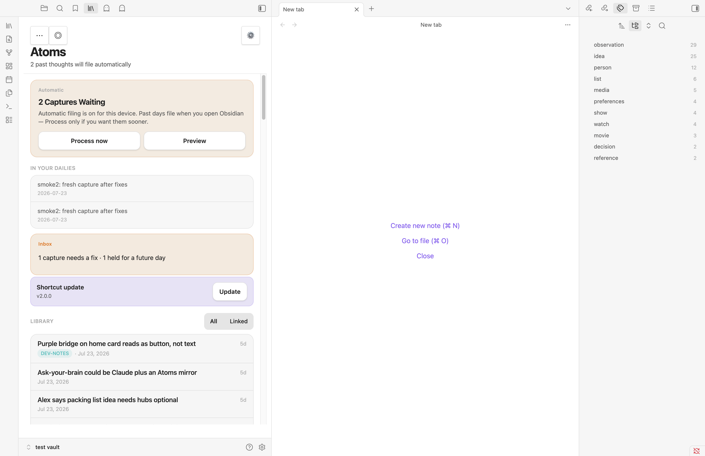

# QA — iOS capture inbox and drain

**Branch** `feat/ios-capture-inbox-drain` · **Issue** #56 · **PR** [#167](https://github.com/taihartman/obsidian-atoms/pull/167)
**Plan** [`docs/plans/2026-07-28-002-feat-ios-capture-inbox-drain-plan.md`](../plans/2026-07-28-002-feat-ios-capture-inbox-drain-plan.md)
**Date** 2026-07-28 · **Vault lane** throwaway `test_vault/test vault` only. Remote Vault untouched.
**Build under test** Atoms v0.6.45, installed via `./scripts/install-to-vault.sh`, Obsidian 1.12.7.

---

## What this had to prove

Capture on the phone must stop depending on today's daily note existing, and no capture may ever be
lost. Everything below is evidence against that bar, not a description of the code.

---

## Core user stories

### 1. A capture lands in the daily for the day it was made

Seeded the inbox with captures stamped across three dates, one of them a date with no daily note, and
ran `atoms:drain-inbox`.

| Stamp date | Daily existed? | Result |
|---|---|---|
| 2026-07-19 | no | daily **created**, both its captures appended |
| 2026-07-20 | yes | capture appended after existing processed content |
| 2026-07-21 | yes | capture appended, body verbatim |

`Daily/2026-07-19.md` after the drain — created from nothing, multi-line capture preserved as a
bullet plus a tab-indented continuation:

```
- 22:40:10 smoke: no daily for this date yet
- 22:41:00 smoke: multi-line capture first line
	second line of the same capture
```

No capture crossed into a neighbouring day.

### 2. Nothing is deleted; filed lines are marked in place

Inbox after the drain (tabs shown as `^I`):

```
- 2026-07-20T09:14:03-04:00 smoke: existing daily, monday
^I<!--atoms:filed-->
- 2026-07-19T22:41:00-04:00 smoke: multi-line capture first line
^Isecond line of the same capture
^I<!--atoms:filed-->
- 2026-07-21T08:00:00-04:00 smoke: capture mentioning [[Some Note]] inline
^I<!--atoms:filed-->
- 2099-01-01T10:00:00-04:00 smoke: future dated, should be held
- this line has no stamp at all and should be counted unparseable
```

Every marker sits under its own capture, including after the multi-line capture's continuation
(KTD11 line-drift guard, verified against the real vault rather than only in unit tests). The
future-dated and unparseable lines are untouched and unmarked. A capture body containing a wikilink
was not mistaken for a marker.

### 3. The drain is idempotent

Checksummed the inbox and all three dailies, re-ran `atoms:drain-inbox`, re-checksummed.

```
IDEMPOTENT: second drain produced no change
```

Repeated after the review-fix commit — still no change.

### 4. A capture whose marker is lost to a sync merge is not filed twice

Deleted the marker from an already-filed capture (simulating a merge that dropped it) and re-drained.

```
daily occurrences before=1 after=1
marker restored: - 2026-07-21T08:00:00-04:00 smoke: capture mentioning [[Some Note]] inline
                 ^I<!--atoms:filed-->
```

The dedupe suppressed the duplicate bullet and the marker was re-applied. AE4 holds.

### 5. Stuck captures surface without opening the inbox

Asserted against the live rendered DOM rather than eyeballing a screenshot:

```
{"found":true,"text":"Inbox 1 capture needs a fix · 1 held for a future day","repair":true}
```

Held and unparseable are named distinctly, and the `is-repair` treatment marks the one needing a
human. Then repaired the unparseable line, pulled the future capture back to a past date, re-drained:

```
{"indicatorPresent":false}
both repaired captures filed into 2026-07-22
```

The indicator clears itself. Silence is the healthy state.



### 6. Bootstrap creates the inbox note and its bookmark

Fresh plugin load created `Atoms System/Inbox.md` with its explanatory frontmatter, and
`.obsidian/bookmarks.json` gained:

```json
{ "type": "file", "path": "Atoms System/Inbox.md", "title": "Atoms Inbox" }
```

This resolves KTD12 and the U2 spike positively — the undocumented internal Bookmarks API works, so
R14's bookmark half ships rather than degrading to a manual setup step.

---

## Adversarial pass (break-it)

Six reviewers attacked the diff. The findings below were confirmed and fixed **with regression tests
that fail without the fix**; the fixes were then re-verified in the live vault.

| Attack | What broke | Now |
|---|---|---|
| Append a capture while the drain is mid-pass | The final marker write used the *opening* snapshot and discarded it — silent capture loss | Re-read before marking; relocate by stamp+body. Test fails without it |
| Inbox without a trailing newline | Next Shortcut append fused onto the marker line, matching neither regex — capture invisible to every count | Terminator restored and preserved |
| CRLF inbox | Whole file rewritten to LF, maximizing sync-merge surface on the one file that can't afford it | Dominant terminator preserved |
| Blank line drifts between a capture and its marker | Filed capture read as pending, re-filed, second marker stacked | Marker detected across the region, mirroring `captureAlreadyHasMarker` |
| One daily fails to write mid-drain | Whole drain aborted; earlier dates kept bullets with no markers | Per-date try covers the write; the rest still file |
| Run the command while the load-time drain is running | Both passes missed the dedupe and appended the same bullet | Single-flight; the command joins the running pass |
| Fresh device, Sync hasn't delivered the inbox yet | An empty inbox was created over the real one holding the backlog | Waits for the vault index, as the auto-run path does |
| Two identical captures, same stamp and text | Risk of one collapsing the other | Both file — verified live (`2` bullets) |

Live re-verification after the fixes:

```
drifted-marker capture: no duplicate bullet, no second marker
identical stamp+text:   both filed (2)
second drain:           wrote nothing
```

---

## Not proven here

Stated plainly rather than checked off:

- **The phone smoke is the human-only gate and has not run.** No agent can drive iOS Shortcuts. Until
  someone force-quits Obsidian, runs the rebuilt Shortcut on a day with no daily, and confirms the
  capture reaches that day's daily, R1–R3 rest on the device findings recorded in the plan, not on
  this pass.
- **Two Shortcuts details are documented but unverified on device**: that the Format Date custom
  pattern `yyyy-MM-dd'T'HH:mm:ssZZZZZ` emits the offset as written, and the exact label of the append
  control inside Capture to Bookmark.
- **Obsidian Sync's merge behavior on a divergent inbox is still unverified** (plan Risk 1). Append-only
  means nothing *we* write deletes anything, and the re-read narrows the lost-update window, but
  `vault.modify` is last-writer-wins; Obsidian's atomic `vault.process` is the real fix and is
  unadopted repo-wide (13 `vault.modify` call sites, zero `vault.process`).
- **`./scripts/verify.sh` did not run** — it is stale independently of this branch: it imports
  `./src/parse.ts` (moved to `src/pipeline/parse.ts`) and calls `obsidian plugins:enabled`, which
  1.12.7 rejects. It produced no output for 15 minutes and was killed. Every gate it wraps was run
  individually instead (`npm test`, `npm run build`, the CLI drain smoke twice).

## Known-open, deferred with reasons

Real findings from the adversarial pass, deliberately not fixed in this PR because each is a design
change rather than a patch. Each is filed rather than forgotten:

- A capture whose **body line is exactly `<!--atoms:filed-->`** is read as already-filed and never
  routed. Fixing it properly means keying the marker to the capture's stamp — a change to the on-disk
  marker format, which deserves its own decision.
- **Inbox and daily continuation rules diverge**: a body line matching a `<!--linker:*-->` marker is
  body in the inbox but a terminator in the daily, so such a capture arrives pre-marked noise.
- **A line that is neither bullet, continuation, nor marker is skipped and counted nowhere** — the one
  remaining hole in "never dropped, always surfaced".
- **`pending` copy reads as self-healing** even when the cause is a hard failure (Daily Notes plugin
  disabled), which is the most likely new-install failure.

---

## Gates

| Gate | Result |
|---|---|
| `npm test` | 498 passed, 44 files |
| `npm run build` | clean (`tsc -noEmit` + esbuild production) |
| `npx tsc --noEmit` | clean |
| CLI drain smoke, run twice | second run wrote nothing |
| Vault lane | throwaway vault only; Remote Vault never touched |
| Phone smoke | **not run — human-only gate** |
